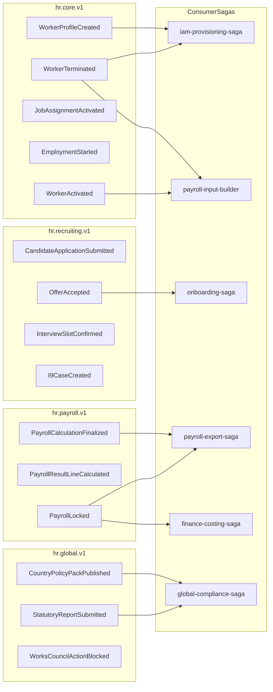
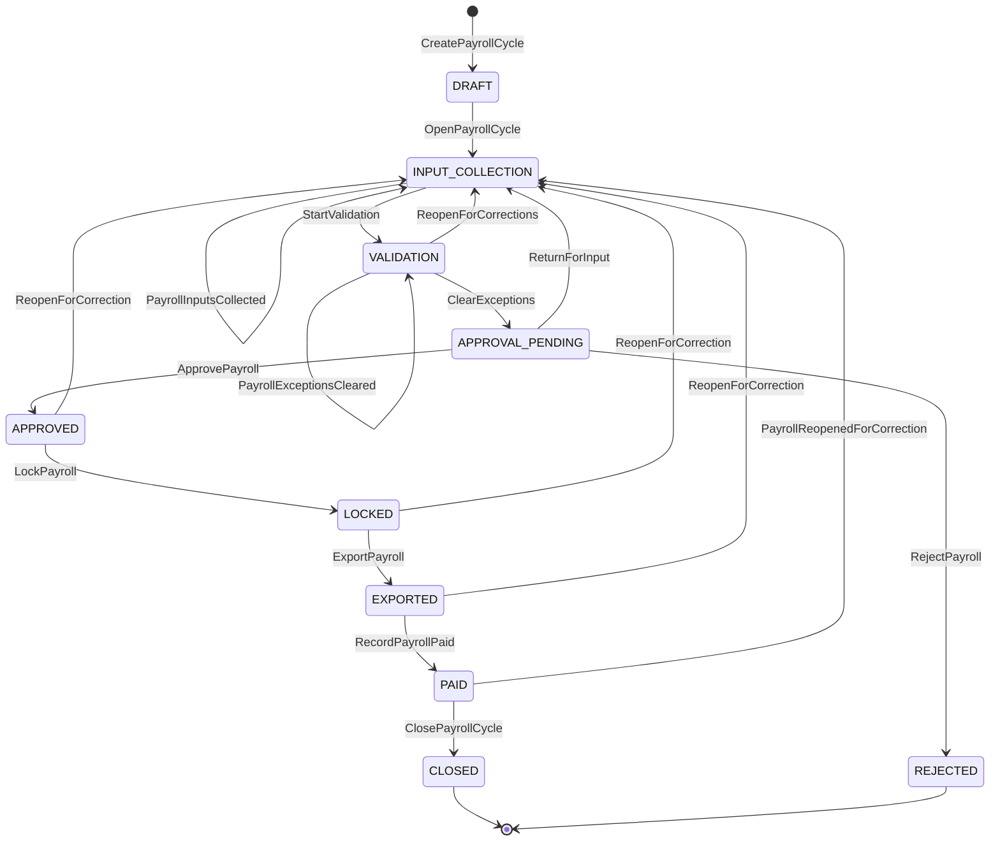
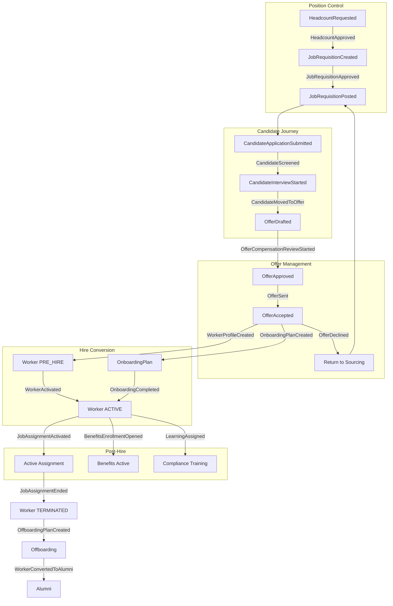

# Enterprise HR/HCM Event Flow Chart

**Version:** 1.4  
**Derived from:** Enterprise HR/HCM Master Blueprint v1.4  
**Date:** 2026-05-23  
**Status:** Canonical event topology documentation for Phase 0 execution planning

---

## Table of Contents

1. [Event Naming Standards](#1-event-naming-standards)
2. [Event Topic Registry](#2-event-topic-registry)
3. [Complete Event Catalog](#3-complete-event-catalog)
4. [Event Trigger Cascade Map](#4-event-trigger-cascade-map)
5. [Consumer Group Responsibilities](#5-consumer-group-responsibilities)
6. [Inbox DDL Contract](#6-inbox-ddl-contract)
7. [Event Envelope Structure](#7-event-envelope-structure)
8. [Mermaid Diagrams](#8-mermaid-diagrams)

---

## 1. Event Naming Standards

### 1.1 Naming Convention

```text
{Aggregate}{BusinessFactPastTense}
```

**Examples:**

```text
WorkerActivated
OfferAccepted
TimesheetApproved
PayrollCycleClosed
LeaveApproved
PerformanceReviewAcknowledged
EmployeeRelationsCaseClosed
```

**Rule:** Never emit two event names for the same business meaning.

### 1.2 Topic Naming Convention

```text
hr.{boundedContext}.v{major}
```

**Example:** `hr.core.v1`, `hr.payroll.v1`, `hr.global.v1`

### 1.3 Routing Key Convention

```text
{tenantId}:{aggregateType}:{aggregateId}
```

### 1.4 Consumer Group Naming Convention

```text
{domain}-{purpose}-consumer-v{major}
```

---

## 2. Event Topic Registry

### 2.1 Topic Overview (13+ Topics)

| Topic | Producer Domains | Example Events | Primary Consumer Groups |
|---|---|---|---|
| `hr.core.v1` | HR Core, Employment | `WorkerProfileCreated`, `WorkerTerminated`, `JobAssignmentActivated` | `iam-provisioning-saga`, `payroll-input-builder`, `benefits-eligibility-projection`, `reporting-warehouse-export` |
| `hr.recruiting.v1` | Recruiting, Candidate Experience | `CandidateApplicationSubmitted`, `OfferAccepted`, `InterviewSlotConfirmed`, `I9CaseCreated` | `onboarding-saga`, `candidate-experience-projection`, `reporting-warehouse-export` |
| `hr.compensation.v1` | Compensation | `CompensationChangeApproved`, `BonusPayoutStaged`, `EquityGrantApproved`, `StepProgressionStagedForPayroll` | `payroll-input-builder`, `pay-equity-audit-saga`, `total-comp-projection` |
| `hr.time.v1` | Time, WFM, Mobile | `TimesheetApproved`, `OvertimeApproved`, `MobileClockEventRecorded`, `ScheduleDeviationResolved` | `payroll-input-builder`, `schedule-adherence-projection` |
| `hr.absence.v1` | Absence Entitlement, Leave | `LeaveEntitlementCalculated`, `AbsenceRequestApproved`, `LeaveLiabilityStagedForFinance` | `payroll-input-builder`, `finance-export-saga`, `worker-self-service-projection` |
| `hr.payroll.v1` | Payroll Calculation, Payroll Tax | `PayrollCalculationFinalized`, `PayrollResultLineCalculated`, `TaxJurisdictionAssignmentFinalized`, `YearEndFormDelivered` | `payroll-export-saga`, `finance-costing-saga`, `worker-payslip-projection` |
| `hr.benefits.v1` | Benefits | `BenefitsEnrollmentFinalized`, `DependentEligibilityApproved`, `CarrierReconciliationVarianceDetected` | `payroll-deduction-builder`, `carrier-integration-saga`, `total-rewards-projection` |
| `hr.learning.v1` | Learning Delivery | `LearningDeliverySessionCompleted`, `AssessmentAttemptGraded`, `CertificationCreditGranted` | `certification-saga`, `compliance-training-projection` |
| `hr.global.v1` | Global HR, Compliance | `CountryRuleSetPublished`, `StatutoryReportSubmitted`, `WorksCouncilActionBlocked`, `CountryPolicyPackPublished` | `global-compliance-saga`, `reporting-warehouse-export`, `payroll-rule-cache`, `tax-jurisdiction-engine`, `absence-entitlement-engine`, `benefits-eligibility-engine` |
| `hr.contingent.v1` | Contingent Workforce | `ContingentAssignmentActivated`, `MisclassificationLegalReviewRequired`, `SowEngagementClosed` | `iam-provisioning-saga`, `finance-costing-saga`, `service-desk-workforce-sync` |
| `hr.analytics.v1` | Reporting, DEI, Engagement | `ReportExecutionCompleted`, `PayGapReportPublished`, `DeiReportPublished` | `report-schedule-delivery`, `compliance-evidence-export` |
| `hr.mobile.v1` | HR Mobile | `HrMobileDeviceRegistered`, `HrMobileSyncBatchSubmitted`, `MobilePushTokenRotated` | `mobile-notification-service`, `security-risk-signal-consumer` |
| `hr.wellbeing.v1` | Wellbeing/EAP | `EapReferralCreated`, `EapUsageAnonymized`, `WellnessClaimApproved` | `wellbeing-dashboard-projection`, `payroll-reimbursement-builder` |

### 2.2 Topic Routing Topology (Mermaid)

```mermaid
graph TB
    subgraph Producers
        P1[HR Core / Employment]
        P2[Recruiting / Candidate Experience]
        P3[Compensation]
        P4[Time / WFM / Mobile]
        P5[Absence / Leave]
        P6[Payroll Calculation / Tax]
        P7[Benefits]
        P8[Learning Delivery]
        P9[Global HR / Compliance]
        P10[Contingent Workforce]
        P11[Reporting / DEI / Engagement]
        P12[HR Mobile]
        P13[Wellbeing / EAP]
    end

    subgraph Topics
        T1[hr.core.v1]
        T2[hr.recruiting.v1]
        T3[hr.compensation.v1]
        T4[hr.time.v1]
        T5[hr.absence.v1]
        T6[hr.payroll.v1]
        T7[hr.benefits.v1]
        T8[hr.learning.v1]
        T9[hr.global.v1]
        T10[hr.contingent.v1]
        T11[hr.analytics.v1]
        T12[hr.mobile.v1]
        T13[hr.wellbeing.v1]
    end

    subgraph ConsumerGroups
        C1[iam-provisioning-saga]
        C2[payroll-input-builder]
        C3[benefits-eligibility-projection]
        C4[reporting-warehouse-export]
        C5[onboarding-saga]
        C6[candidate-experience-projection]
        C7[pay-equity-audit-saga]
        C8[total-comp-projection]
        C9[schedule-adherence-projection]
        C10[finance-export-saga]
        C11[worker-self-service-projection]
        C12[payroll-export-saga]
        C13[finance-costing-saga]
        C14[worker-payslip-projection]
        C15[payroll-deduction-builder]
        C16[carrier-integration-saga]
        C17[total-rewards-projection]
        C18[certification-saga]
        C19[compliance-training-projection]
        C20[global-compliance-saga]
        C21[payroll-rule-cache]
        C22[tax-jurisdiction-engine]
        C23[absence-entitlement-engine]
        C24[benefits-eligibility-engine]
        C25[service-desk-workforce-sync]
        C26[report-schedule-delivery]
        C27[compliance-evidence-export]
        C28[mobile-notification-service]
        C29[security-risk-signal-consumer]
        C30[wellbeing-dashboard-projection]
        C31[payroll-reimbursement-builder]
    end

    P1 --> T1
    P2 --> T2
    P3 --> T3
    P4 --> T4
    P5 --> T5
    P6 --> T6
    P7 --> T7
    P8 --> T8
    P9 --> T9
    P10 --> T10
    P11 --> T11
    P12 --> T12
    P13 --> T13

    T1 --> C1
    T1 --> C2
    T1 --> C3
    T1 --> C4
    T2 --> C5
    T2 --> C6
    T2 --> C4
    T3 --> C2
    T3 --> C7
    T3 --> C8
    T4 --> C2
    T4 --> C9
    T5 --> C2
    T5 --> C10
    T5 --> C11
    T6 --> C12
    T6 --> C13
    T6 --> C14
    T7 --> C15
    T7 --> C16
    T7 --> C17
    T8 --> C18
    T8 --> C19
    T9 --> C20
    T9 --> C4
    T9 --> C21
    T9 --> C22
    T9 --> C23
    T9 --> C24
    T10 --> C1
    T10 --> C13
    T10 --> C25
    T11 --> C26
    T11 --> C27
    T12 --> C28
    T12 --> C29
    T13 --> C30
    T13 --> C31
```



---

## 3. Complete Event Catalog

### 3.1 Core HR Events (Section 8.2)

```text
WorkerProfileCreated
WorkerActivated
WorkerProfileMarkedIncomplete
WorkerPersonalDataUpdated
WorkerPlacedOnLeave
WorkerReturnedFromLeave
WorkerSuspended
WorkerNoticePeriodStarted
WorkerTerminated
WorkerConvertedToAlumni
WorkerArchived
EmploymentStarted
EmploymentTypeChanged
EmploymentEnded
JobAssignmentProposed
JobAssignmentApproved
JobAssignmentActivated
JobAssignmentEnded
JobAssignmentCorrected
EmploymentContractDrafted
EmploymentContractSigned
EmploymentContractActivated
EmploymentContractAmended
EmploymentContractTerminated
```

**Authority Owner:** HR Core  
**Topic:** `hr.core.v1`

### 3.2 Organization and Position Events (Section 8.3)

```text
LegalEntityCreated
LegalEntityUpdated
OrgUnitCreated
OrgUnitReorganized
OrgUnitMerged
OrgUnitArchived
PositionCreated
PositionApprovalRequested
PositionApproved
PositionOpened
PositionRecruitingStarted
PositionFilled
PositionFrozen
PositionClosed
JobProfilePublished
CompensationBandPublished
HeadcountRequested
HeadcountApproved
HeadcountRejected
HeadcountFulfilled
WorkforcePlanApproved
WorkforcePlanActivated
```

**Authority Owners:** Organization Management, Position Management, Workforce Planning  
**Topic:** `hr.core.v1`

### 3.3 Recruiting and Onboarding Events (Section 8.4)

```text
JobRequisitionCreated
JobRequisitionApprovalRequested
JobRequisitionApproved
JobRequisitionPosted
JobSourcingStarted
JobScreeningStarted
JobInterviewingStarted
JobOfferPending
JobRequisitionFilled
JobRequisitionClosed
CandidateCreated
CandidateConsentRecorded
CandidateApplicationSubmitted
CandidateScreeningStarted
CandidateAssessmentRequested
CandidateInterviewStarted
CandidateBackgroundCheckRequested
CandidateMovedToOffer
CandidateHired
CandidateRejected
CandidateWithdrawn
CandidateMovedToTalentPool
OfferDrafted
OfferCompensationReviewStarted
OfferApprovalRequested
OfferApproved
OfferSent
OfferAccepted
OfferDeclined
OfferExpired
OfferWithdrawn
OfferSuperseded
OnboardingPlanCreated
PreboardingStarted
OnboardingTaskCompleted
OnboardingBlocked
OnboardingReadyForDayOne
OnboardingCompleted
```

**Authority Owners:** Recruiting, Onboarding  
**Topic:** `hr.recruiting.v1`

### 3.4 Time, Absence, Payroll, Benefits Events (Section 8.5)

#### Time and Attendance
```text
AbsenceRequested
AbsenceApproved
AbsenceRejected
AbsenceCancelled
AbsenceTaken
AbsenceAdjusted
LeaveCaseOpened
LeaveDocumentationRequested
LeaveApproved
LeaveDenied
LeaveStarted
LeaveExtended
WorkerReturnedFromLeave
LeaveCaseClosed
TimesheetOpened
TimesheetSubmitted
TimesheetApproved
TimesheetRejected
TimesheetLocked
TimesheetExportedToPayroll
TimesheetReopened
AttendanceExceptionDetected
AttendanceAdjustmentApproved
AttendanceAdjustmentRejected
```

#### Payroll
```text
PayrollCycleOpened
PayrollInputsCollected
PayrollValidationStarted
PayrollExceptionsRecorded
PayrollExceptionsCleared
PayrollApprovalRequested
PayrollApproved
PayrollLocked
PayrollExported
PayrollPaid
PayrollCycleClosed
PayrollReopenedForCorrection
PayrollInputStaged
PayrollInputValidated
PayrollAdjustmentApproved
```

#### Benefits
```text
BenefitsEnrollmentOpened
BenefitsEnrollmentSubmitted
BenefitsEligibilityReviewStarted
BenefitsEnrollmentApproved
BenefitsCoverageActivated
BenefitsLifeEventRecorded
BenefitsEnrollmentChanged
BenefitsCoverageTerminated
```

**Authority Owners:** Absence Management, Payroll, Benefits  
**Topics:** `hr.time.v1`, `hr.absence.v1`, `hr.payroll.v1`, `hr.benefits.v1`

### 3.5 Performance, Learning, Engagement Events (Section 8.6)

#### Performance
```text
ReviewCycleCreated
ReviewCycleConfigured
ReviewCycleLaunched
SelfReviewStarted
SelfReviewSubmitted
ManagerReviewSubmitted
CalibrationStarted
CalibrationCompleted
ReviewAcknowledged
ReviewCycleClosed
GoalCreated
GoalActivated
GoalProgressUpdated
GoalMarkedAtRisk
GoalCompleted
GoalCancelled
PipCreated
PipApproved
PipStarted
PipCheckInRecorded
PipCompleted
PipExtended
PipClosed
```

#### Learning and Skills
```text
LearningCoursePublished
LearningAssigned
LearningStarted
LearningCompleted
LearningOverdue
LearningWaived
SkillEvidenceAdded
SkillVerified
SkillExpired
CertificationIssued
CertificationRenewed
CertificationExpired
CertificationRevoked
SuccessionPlanDrafted
SuccessorNominated
SuccessionPlanApproved
TalentPoolCreated
WorkerAddedToTalentPool
```

#### Engagement
```text
EngagementSurveyLaunched
SurveyResponseRecorded
EngagementSurveyInsightsPublished
EngagementActionPlanCreated
RecognitionRecorded
```

**Authority Owners:** Performance, Learning, Engagement  
**Topics:** `hr.core.v1`, `hr.learning.v1`

### 3.6 Employee Relations and Compliance Events (Section 8.7)

```text
HrCaseOpened
HrCaseClassified
HrCaseAssigned
HrCaseResolved
HrCaseClosed
EmployeeRelationsCaseOpened
EmployeeRelationsCaseTriaged
InvestigationStarted
ErFindingsSubmitted
ErActionPlanApproved
EmployeeRelationsCaseClosed
DisciplinaryActionDrafted
DisciplinaryActionIssued
DisciplinaryActionAcknowledged
DisciplinaryActionAppealed
DisciplinaryActionClosed
AccommodationRequested
InteractiveProcessStarted
AccommodationApproved
AccommodationImplemented
AccommodationReviewed
AccommodationClosed
PolicyAcknowledgementAssigned
PolicyViewed
PolicyAcknowledged
PolicyAcknowledgementOverdue
PolicyAcknowledgementWaived
StatutoryReportGenerated
StatutoryReportSubmitted
HrLegalHoldApplied
HrLegalHoldReleased
EmployeeDataAccessed
EmployeeDataRedacted
EmployeeDataSubjectRequestCreated
EmployeeDataSubjectRequestCompleted
```

**Authority Owners:** HR Service Delivery, Employee Relations, Compliance  
**Topics:** `hr.core.v1`, `hr.global.v1`

---

### 3.7 V1.1 Additions: Compensation, Offboarding, WFM, Global, Benefits Deepening (Section 8.9)

#### Compensation and Total Rewards
```text
CompensationPlanDrafted
CompensationBudgetModeled
PayEquityReviewStarted
CompensationPlanApprovalRequested
CompensationPlanApproved
CompensationPlanActivated
CompensationPlanSuperseded
BonusCycleCreated
BonusPoolAllocated
BonusRecommendationSubmitted
BonusCalibrationStarted
BonusCycleApproved
BonusPayoutStaged
BonusPayoutExportedToPayroll
EquityGrantDrafted
EquityGrantApproved
EquityGrantIssued
EquityVestingRecorded
EquityGrantForfeited
EquityVestingAccelerated
VariableCompPlanApproved
VariableCompPlanAssigned
VariableAttainmentRecorded
CommissionPayoutApproved
TotalCompStatementGenerated
TotalCompStatementPublished
TotalCompStatementAccessed
```

#### Offboarding and Alumni
```text
OffboardingPlanCreated
OffboardingPlanPrepared
OffboardingPlanStarted
OffboardingTaskAdded
OffboardingTaskCompleted
OffboardingPlanBlocked
OffboardingPlanCompleted
ExitInterviewScheduled
ExitInterviewCompleted
ExitInterviewRedacted
FinalSettlementCalculated
FinalSettlementApproved
FinalSettlementStagedForPayroll
FinalSettlementPaid
ReferenceRequested
ReferenceResponseDelivered
AlumniPortalAccountActivated
```

#### Workforce Management
```text
ShiftScheduleDrafted
ShiftSchedulePublished
ShiftScheduleAdjusted
OpenShiftCreated
ShiftBidSubmitted
ShiftBidApproved
ShiftSwapRequested
ShiftSwapExecuted
OvertimeRequested
OvertimeApproved
CoverageGapDetected
CoverageGapResolved
ScheduleAdherenceExceptionRecorded
```

#### Global HR Compliance
```text
CountryRuleSetPublished
StatutoryLeaveTypePublished
WorkAuthorizationCaseOpened
GovernmentFilingRecorded
WorkAuthorizationApproved
WorkAuthorizationExpired
WorksCouncilConsultationRequested
WorksCouncilOutcomeApproved
StatutoryReportGenerated
StatutoryReportSubmitted
StatutoryReportAccepted
StatutoryReportRejected
```

#### Benefits Deepening
```text
BenefitsOpenEnrollmentLaunched
EnrollmentElectionSubmitted
DependentVerificationRequested
DependentEligibilityApproved
BenefitsContinuationRequired
CarrierReconciliationStarted
CarrierMismatchRecorded
SpendingAccountEnrolled
WellnessProgramActivated
```

#### HR Service Delivery
```text
HrKnowledgeArticlePublished
HrServiceItemPublished
HrVirtualAgentSessionStarted
HrVirtualAgentHandoffRequested
HrCaseSlaBreached
```

#### Life Events and Manager Actions
```text
LifeEventStarted
LifeEventApproved
LifeEventEffectsApplied
ManagerActionRequested
ManagerActionApproved
ManagerActionExecuted
```

#### Workforce Planning and DEI
```text
WorkforceScenarioCreated
WorkforceScenarioApproved
ScenarioConvertedToHeadcountRequests
SkillsGapAnalysisPublished
FteBudgetVarianceFlagged
DeiReportGenerated
SmallCellDataSuppressed
PayGapReportPublished
PayEquityAuditStarted
PayEquityActionPlanApproved
```

#### Engagement and Labor Relations
```text
Feedback360Launched
Feedback360Closed
RecognitionSubmitted
RecognitionPublished
UnionContractActivated
UnionGrievanceFiled
UnionArbitrationRecorded
LaborActionReported
LaborActionResolved
```

#### HR AI Governance
```text
HrAiUseCaseRegistered
HrAiUseCaseApproved
HrAiModelRunRecorded
HrAiBiasTestRecorded
HrAiSafetyFindingRecorded
HrAiUseCaseDisabled
```

---

### 3.8 V1.2 Additions: World-Class Functional Depth (Section 8.11)

#### Native Payroll Calculation
```text
PayrollCalculationRunCreated
PayrollInputSnapshotCaptured
PayrollRuleSetResolved
PayrollCalculationStarted
PayrollCalculationFinalized
PayrollResultLineCalculated
RetroCalculationStarted
RetroResultStaged
```

#### Tax Jurisdiction
```text
TaxJurisdictionAssignmentRequested
TaxJurisdictionAssignmentFinalized
WorkerTaxProfileCreated
PayrollTaxFilingSubmitted
YearEndFormGenerated
YearEndFormDelivered
```

#### Learning Delivery Runtime
```text
LearningContentPackagePublished
LearningDeliverySessionStarted
LearningDeliverySessionCompleted
AssessmentAttemptGraded
IltAttendanceRecorded
LearningTranscriptUpdated
```

#### Reporting and Analytics Platform
```text
ReportDefinitionPublished
ReportExecutionStarted
ReportExecutionCompleted
ReportExported
WarehouseExportDelivered
```

#### Contingent Workforce
```text
ContingentAssignmentRequested
ContingentAssignmentActivated
SowEngagementApproved
MisclassificationAssessmentStarted
MisclassificationLegalReviewRequired
```

#### Statutory Leave Entitlement Engine
```text
LeaveEntitlementCalculationRequested
LeaveEntitlementCalculated
LeaveBalanceProjected
LeaveLiabilityStagedForFinance
PublicHolidayCalendarPublished
```

#### Candidate Experience
```text
CareerSitePagePublished
CandidateJobViewed
CandidateApplicationStarted
CandidateSelfSchedulingStarted
InterviewSlotConfirmed
CandidateCommunicationSent
CandidateReferralSubmitted
VideoInterviewSubmitted
CandidateExperienceSurveySent
```

#### I-9 / E-Verify
```text
I9CaseCreated
I9Section1Completed
I9Section2Completed
I9DocumentReviewRecorded
EVerifyCaseSubmitted
EVerifyResultRecorded
I9EmploymentEligibilityVerified
```

#### Compensation Step Progression
```text
PayScalePublished
StepProgressionBatchGenerated
StepProgressionStagedForPayroll
```

#### HR Mobile
```text
HrMobileDeviceRegistered
MobilePushTokenRotated
HrMobilePackageGenerated
HrMobileSyncBatchSubmitted
MobileClockEventRecorded
```

#### Org Design and Wellbeing
```text
OrgDesignScenarioSimulated
OrgDesignDecisionPublished
RifScenarioApproved
EapReferralCreated
EapUsageAnonymized
WellnessClaimApproved
EarnedWageAccessDeductionExported
```

---

### 3.9 V1.4 Additions: Country Policy Pack Governance (Section 8.12)

```text
CountryPolicyPackDrafted
CountryPolicyPackUploaded
CountryPolicyUploadParsingStarted
CountryPolicyUploadParsed
CountryPolicyUploadQuarantined
CountryPolicyUploadRejected
CountryPolicyValidationStarted
CountryPolicyValidated
CountryPolicyValidationFailed
CountryPolicyImpactSimulationRequested
CountryPolicyImpactSimulated
CountryPolicyApprovalRequested
CountryPolicyLegalReviewRequired
CountryPolicyLegalApprovalRecorded
CountryPolicyPayrollTaxReviewRequired
CountryPolicyPayrollTaxApprovalRecorded
CountryPolicyGlobalHrReviewRequired
CountryPolicyGlobalHrApprovalRecorded
CountryPolicyBenefitsReviewRequired
CountryPolicyBenefitsApprovalRecorded
CountryPolicyAbsenceReviewRequired
CountryPolicyAbsenceApprovalRecorded
CountryPolicyComplianceReviewRequired
CountryPolicyComplianceApprovalRecorded
CountryPolicyPackApproved
CountryPolicyPackRejected
CountryPolicyPublicationScheduled
CountryPolicyPackPublished
CountryPolicyPackSuperseded
CountryPolicyPackRolledBack
CountryPolicyPackRetired
CountryPolicyRecalculationRequested
CountryPolicyRevalidationCompleted
```

**Authority Owner:** Global HR Compliance / Country Policy Governance  
**Topic:** `hr.global.v1`

---

## 4. Event Trigger Cascade Map

### 4.1 WorkerTerminated Cascade

When `WorkerTerminated` is emitted on `hr.core.v1`:

| # | Triggered Action | Target Domain | Event Emitted | Topic |
|---|---|---|---|---|
| 1 | Create Offboarding Plan | Offboarding | `OffboardingPlanCreated` | `hr.core.v1` |
| 2 | Request IAM Deprovisioning | IAM Saga | `IamDeprovisioningRequested` | `hr.core.v1` |
| 3 | Terminate Benefits Coverage | Benefits | `BenefitsCoverageTerminated` | `hr.benefits.v1` |
| 4 | Calculate Final Settlement | Payroll/Offboarding | `FinalSettlementCalculated` | `hr.payroll.v1` |
| 5 | Stage Final Settlement for Payroll | Payroll | `FinalSettlementStagedForPayroll` | `hr.payroll.v1` |
| 6 | Schedule Exit Interview | Offboarding/EE | `ExitInterviewScheduled` | `hr.core.v1` |
| 7 | Close Open Job Assignment | HR Core | `JobAssignmentEnded` | `hr.core.v1` |
| 8 | Convert to Alumni (post-retention) | HR Core | `WorkerConvertedToAlumni` | `hr.core.v1` |
| 9 | End Employment Record | HR Core | `EmploymentEnded` | `hr.core.v1` |
| 10 | Cancel Open Time Entries | Time | `TimesheetCancelled` | `hr.time.v1` |
| 11 | Close Leave Cases | Absence | `LeaveCaseClosed` | `hr.absence.v1` |
| 12 | Cancel Learning Assignments | Learning | `LearningCancelled` | `hr.learning.v1` |
| 13 | Close Performance Cycles | Performance | `ReviewCycleClosed` (for worker) | `hr.core.v1` |
| 14 | Deactivate Alumni Portal (if exists) | Alumni | `AlumniPortalAccountDeactivated` | `hr.core.v1` |
| 15 | Release Legal Holds (if policy allows) | Compliance | `HrLegalHoldReleased` | `hr.global.v1` |

### 4.2 OfferAccepted Cascade

When `OfferAccepted` is emitted on `hr.recruiting.v1`:

| # | Triggered Action | Target Domain | Event Emitted | Topic |
|---|---|---|---|---|
| 1 | Create Worker Profile (PRE_HIRE) | HR Core | `WorkerProfileCreated` | `hr.core.v1` |
| 2 | Create Onboarding Plan | Onboarding | `OnboardingPlanCreated` | `hr.recruiting.v1` |
| 3 | Start Preboarding | Onboarding | `PreboardingStarted` | `hr.recruiting.v1` |
| 4 | Create Employment Contract | HR Core/Legal | `EmploymentContractDrafted` | `hr.core.v1` |
| 5 | Send Contract for Signature | e-Signature | `EmploymentContractSentForSignature` | `hr.core.v1` |
| 6 | Mark Position Filled | Position Control | `PositionFilled` | `hr.core.v1` |
| 7 | Close Job Requisition | Recruiting | `JobRequisitionFilled` | `hr.recruiting.v1` |
| 8 | Create I-9 Case | Compliance | `I9CaseCreated` | `hr.recruiting.v1` |
| 9 | Create Work Authorization Case | Global HR | `WorkAuthorizationCaseOpened` | `hr.global.v1` |
| 10 | Request IAM Account Creation | IAM Saga | `IamProvisioningRequested` | `hr.core.v1` |
| 11 | Create Job Assignment | HR Core | `JobAssignmentProposed` | `hr.core.v1` |
| 12 | Trigger First-Day Readiness Check | Onboarding | `FirstDayReadinessCheckTriggered` | `hr.recruiting.v1` |

### 4.3 PayrollCycleLocked Cascade

When `PayrollLocked` is emitted on `hr.payroll.v1`:

| # | Triggered Action | Target Domain | Event Emitted | Topic |
|---|---|---|---|---|
| 1 | Stage Payroll for Export | Payroll Export | `PayrollExported` | `hr.payroll.v1` |
| 2 | Notify Finance | Finance Saga | `FinanceCostingRecordCreated` | `hr.payroll.v1` |
| 3 | Generate Payslip Projections | Payslip Projection | `WorkerPayslipProjectionUpdated` | `hr.payroll.v1` |
| 4 | Send Payroll Paid Notification | Notification | `PayrollPaidNotificationSent` | `hr.payroll.v1` |
| 5 | Close Payroll Cycle | Payroll | `PayrollCycleClosed` | `hr.payroll.v1` |
| 6 | Lock Timesheets for Period | Time | `TimesheetLocked` | `hr.time.v1` |
| 7 | Stage Leave Liability for Finance | Absence | `LeaveLiabilityStagedForFinance` | `hr.absence.v1` |
| 8 | Update General Ledger | Finance Integration | `GeneralLedgerPayrollPosted` | `hr.payroll.v1` |

### 4.4 CountryPolicyPackPublished Cascade

When `CountryPolicyPackPublished` is emitted on `hr.global.v1`:

| # | Triggered Action | Target Domain | Event Emitted | Topic |
|---|---|---|---|---|
| 1 | Reload Payroll Rule Cache | Payroll Engine | `PayrollRuleSetResolved` | `hr.global.v1` |
| 2 | Reload Tax Jurisdiction Engine | Tax Engine | `TaxJurisdictionAssignmentFinalized` | `hr.global.v1` |
| 3 | Recalculate Absence Entitlements | Absence Engine | `CountryPolicyRecalculationRequested` | `hr.global.v1` |
| 4 | Revalidate Benefits Eligibility | Benefits Engine | `CountryPolicyRevalidationCompleted` | `hr.global.v1` |
| 5 | Update Contract Policy Engine | Contracts | `ContractPolicyEngineUpdated` | `hr.global.v1` |
| 6 | Reload I-9/E-Verify Engine | Employment Eligibility | `I9EmploymentEligibilityVerified` | `hr.global.v1` |
| 7 | Update Statutory Reporting Engine | Compliance | `StatutoryReportGenerated` | `hr.global.v1` |
| 8 | Trigger Payroll Recalculation Saga | Payroll | `PayrollRecalculationStarted` | `hr.payroll.v1` |
| 9 | Trigger Leave Balance Recalculation | Absence | `LeaveBalanceRecalculated` | `hr.absence.v1` |
| 10 | Trigger Tax Profile Revalidation | Tax | `TaxProfileRevalidated` | `hr.global.v1` |
| 11 | Trigger Benefits Reconciliation | Benefits | `BenefitsReconciliationTriggered` | `hr.benefits.v1` |
| 12 | Supersede Previous Active Pack | Global HR | `CountryPolicyPackSuperseded` | `hr.global.v1` |

### 4.5 WorkerActivated Cascade

When `WorkerActivated` is emitted on `hr.core.v1`:

| # | Triggered Action | Target Domain | Event Emitted | Topic |
|---|---|---|---|---|
| 1 | Create Benefits Eligibility Record | Benefits | `BenefitsEnrollmentOpened` | `hr.benefits.v1` |
| 2 | Create Payroll Input Profile | Payroll | `PayrollInputProfileCreated` | `hr.payroll.v1` |
| 3 | Assign Default Learning | Learning | `LearningAssigned` (compliance) | `hr.learning.v1` |
| 4 | Create Skill Profile | Skills | `SkillEvidenceAdded` | `hr.learning.v1` |
| 5 | Assign Policy Acknowledgements | Compliance | `PolicyAcknowledgementAssigned` | `hr.global.v1` |
| 6 | Create Probation Review | HR Core | `ProbationReviewStarted` | `hr.core.v1` |
| 7 | Notify Manager | Notification | `NewHireManagerNotificationSent` | `hr.core.v1` |
| 8 | Project Workforce Analytics | Analytics | `WorkforceProjectionUpdated` | `hr.analytics.v1` |

### 4.6 JobAssignmentActivated Cascade

When `JobAssignmentActivated` is emitted on `hr.core.v1`:

| # | Triggered Action | Target Domain | Event Emitted | Topic |
|---|---|---|---|---|
| 1 | Update Payroll Cost Center | Payroll | `PayrollCostCenterUpdated` | `hr.payroll.v1` |
| 2 | Update Benefits Eligibility | Benefits | `BenefitsEligibilityRecalculated` | `hr.benefits.v1` |
| 3 | Update IAM Access | IAM | `IamAccessUpdated` | `hr.core.v1` |
| 4 | Update Reporting Hierarchy | Analytics | `ReportingHierarchyUpdated` | `hr.analytics.v1` |
| 5 | Notify Service Desk | ITSM | `ServiceDeskWorkforceSyncTriggered` | `hr.contingent.v1` |
| 6 | Update Compensation Reference | Compensation | `CompensationReferenceUpdated` | `hr.compensation.v1` |

### 4.7 BenefitsEnrollmentApproved Cascade

When `BenefitsEnrollmentApproved` is emitted on `hr.benefits.v1`:

| # | Triggered Action | Target Domain | Event Emitted | Topic |
|---|---|---|---|---|
| 1 | Stage Payroll Deductions | Payroll | `PayrollDeductionStaged` | `hr.payroll.v1` |
| 2 | Export to Carrier | Carrier Saga | `CarrierEnrollmentExported` | `hr.benefits.v1` |
| 3 | Update Total Rewards Projection | Analytics | `TotalRewardsProjectionUpdated` | `hr.analytics.v1` |
| 4 | Activate Coverage | Benefits | `BenefitsCoverageActivated` | `hr.benefits.v1` |
| 5 | Trigger Carrier Reconciliation | Benefits | `CarrierReconciliationStarted` | `hr.benefits.v1` |

### 4.8 TimesheetApproved Cascade

When `TimesheetApproved` is emitted on `hr.time.v1`:

| # | Triggered Action | Target Domain | Event Emitted | Topic |
|---|---|---|---|---|
| 1 | Stage Payroll Input | Payroll | `PayrollInputStaged` | `hr.payroll.v1` |
| 2 | Check Schedule Adherence | WFM | `ScheduleAdherenceChecked` | `hr.time.v1` |
| 3 | Export to Payroll (if cutoff) | Payroll | `TimesheetExportedToPayroll` | `hr.time.v1` |
| 4 | Update Project Costing | Finance | `ProjectCostingUpdated` | `hr.time.v1` |

### 4.9 LeaveApproved Cascade

When `LeaveApproved` is emitted on `hr.absence.v1`:

| # | Triggered Action | Target Domain | Event Emitted | Topic |
|---|---|---|---|---|
| 1 | Place Worker on Leave | HR Core | `WorkerPlacedOnLeave` | `hr.core.v1` |
| 2 | Update Payroll for Leave Period | Payroll | `PayrollLeaveInputStaged` | `hr.payroll.v1` |
| 3 | Recalculate Leave Entitlement | Absence | `LeaveEntitlementRecalculated` | `hr.absence.v1` |
| 4 | Update Benefits Continuation | Benefits | `BenefitsContinuationRequired` | `hr.benefits.v1` |
| 5 | Notify Manager/HR | Notification | `LeaveStartedNotificationSent` | `hr.absence.v1` |
| 6 | Create Return-to-Work Task | HR Core | `ReturnToWorkTaskCreated` | `hr.core.v1` |
| 7 | Stage Leave Liability | Finance | `LeaveLiabilityStagedForFinance` | `hr.absence.v1` |

### 4.10 PerformanceReviewCycleClosed Cascade

When `ReviewCycleClosed` is emitted on `hr.core.v1`:

| # | Triggered Action | Target Domain | Event Emitted | Topic |
|---|---|---|---|---|
| 1 | Stage Compensation Changes | Compensation | `CompensationChangeProposed` | `hr.compensation.v1` |
| 2 | Update Skill Profiles | Skills | `SkillEvidenceAdded` | `hr.learning.v1` |
| 3 | Update Succession Plans | Talent | `SuccessionPlanUpdated` | `hr.core.v1` |
| 4 | Trigger Calibration Results | Compensation | `CalibrationCompleted` | `hr.compensation.v1` |
| 5 | Update Learning Assignments | Learning | `LearningAssigned` (development) | `hr.learning.v1` |
| 6 | Archive Review Data | Compliance | `ReviewDataArchived` | `hr.analytics.v1` |

### 4.11 DisciplinaryActionIssued Cascade

When `DisciplinaryActionIssued` is emitted on `hr.core.v1`:

| # | Triggered Action | Target Domain | Event Emitted | Topic |
|---|---|---|---|---|
| 1 | Create Performance Improvement Plan | Performance/ER | `PipCreated` | `hr.core.v1` |
| 2 | Restrict System Access | IAM | `IamAccessRestricted` | `hr.core.v1` |
| 3 | Notify Legal (if required) | Compliance | `LegalNotificationSent` | `hr.global.v1` |
| 4 | Update Worker Record | HR Core | `WorkerRecordUpdated` | `hr.core.v1` |
| 5 | Create Appeal Task | ER | `AppealTaskCreated` | `hr.core.v1` |

### 4.12 EmployeeRelationsCaseOpened Cascade

When `EmployeeRelationsCaseOpened` is emitted on `hr.core.v1`:

| # | Triggered Action | Target Domain | Event Emitted | Topic |
|---|---|---|---|---|
| 1 | Apply Legal Hold | Compliance | `HrLegalHoldApplied` | `hr.global.v1` |
| 2 | Restrict Data Access | Privacy | `DataAccessRestricted` | `hr.core.v1` |
| 3 | Create Investigation Task | ER | `InvestigationStarted` | `hr.core.v1` |
| 4 | Notify Legal/HRBP | Notification | `ErCaseNotificationSent` | `hr.core.v1` |
| 5 | Block Related Actions | Workflow | `RelatedActionsBlocked` | `hr.core.v1` |

---

## 5. Consumer Group Responsibilities

### 5.1 Saga Consumers (Process Managers)

| Consumer Group | Topic(s) | Responsibility | Commands Issued |
|---|---|---|---|
| `iam-provisioning-saga` | `hr.core.v1`, `hr.contingent.v1` | Creates, updates, and deactivates IAM accounts based on worker lifecycle events | Request IAM provisioning/deprovisioning |
| `payroll-input-builder` | `hr.core.v1`, `hr.compensation.v1`, `hr.time.v1`, `hr.absence.v1` | Builds payroll input collection from approved time, compensation changes, and absence events | Stage payroll inputs |
| `payroll-export-saga` | `hr.payroll.v1` | Manages payroll export to external providers and tracks acknowledgements | Retry exports, create reconciliation tasks |
| `finance-costing-saga` | `hr.payroll.v1`, `hr.contingent.v1` | Posts payroll and contingent worker costs to finance/GL | Create costing records |
| `onboarding-saga` | `hr.recruiting.v1` | Orchestrates onboarding workflow from offer acceptance through day-one readiness | Create onboarding plan, trigger readiness checks |
| `pay-equity-audit-saga` | `hr.compensation.v1` | Monitors compensation changes for pay equity violations and triggers audits | Create pay equity review tasks |
| `global-compliance-saga` | `hr.global.v1` | Orchestrates compliance workflows across statutory reporting, work authorization, and works council | Create compliance cases, trigger reviews |
| `carrier-integration-saga` | `hr.benefits.v1` | Manages benefits carrier enrollment exports and reconciliation | Export enrollments, record mismatches |
| `certification-saga` | `hr.learning.v1` | Tracks certification requirements and triggers compliance alerts | Create renewal assignments |
| `candidate-experience-projection` | `hr.recruiting.v1` | Maintains candidate-facing read model for portal and communications | Update candidate dashboard |

### 5.2 Projection Consumers (Read Model Builders)

| Consumer Group | Topic(s) | Responsibility |
|---|---|---|
| `benefits-eligibility-projection` | `hr.core.v1` | Maintains benefits eligibility read model |
| `reporting-warehouse-export` | `hr.core.v1`, `hr.recruiting.v1`, `hr.global.v1` | Exports events to data warehouse for analytics |
| `schedule-adherence-projection` | `hr.time.v1` | Builds schedule adherence dashboards |
| `worker-self-service-projection` | `hr.absence.v1` | Updates employee self-service views |
| `worker-payslip-projection` | `hr.payroll.v1` | Generates payslip read models |
| `total-comp-projection` | `hr.compensation.v1` | Builds total compensation statements |
| `total-rewards-projection` | `hr.benefits.v1` | Maintains total rewards dashboard |
| `compliance-training-projection` | `hr.learning.v1` | Tracks compliance training completion status |
| `wellbeing-dashboard-projection` | `hr.wellbeing.v1` | Builds wellbeing/EAP analytics views |
| `payroll-deduction-builder` | `hr.benefits.v1` | Builds payroll deduction instructions from benefits enrollments |
| `payroll-reimbursement-builder` | `hr.wellbeing.v1` | Stages wellbeing reimbursement payroll inputs |
| `mobile-notification-service` | `hr.mobile.v1` | Sends mobile push notifications |
| `security-risk-signal-consumer` | `hr.mobile.v1` | Monitors mobile security risk signals |
| `report-schedule-delivery` | `hr.analytics.v1` | Executes scheduled report generation and delivery |
| `compliance-evidence-export` | `hr.analytics.v1` | Exports audit evidence for compliance purposes |

---

## 6. Inbox DDL Contract

### 6.1 inbox_events Table

```sql
CREATE TABLE IF NOT EXISTS hr_platform.inbox_events (
  id                    uuid PRIMARY KEY DEFAULT gen_random_uuid(),
  tenant_id             uuid NOT NULL,
  consumer_name         text NOT NULL,
  consumer_version      text NOT NULL,
  source_event_id       uuid NOT NULL,
  source_topic          text NOT NULL,
  source_partition      int,
  source_offset         bigint,
  event_name            text NOT NULL,
  aggregate_type        text NOT NULL,
  aggregate_id          uuid NOT NULL,
  processing_status     text NOT NULL CHECK (
                          processing_status IN (
                            'IN_PROGRESS',
                            'SUCCESS',
                            'FAILED_RETRYABLE',
                            'FAILED_NON_RETRYABLE',
                            'SKIPPED'
                          )
                        ),
  retry_count           int NOT NULL DEFAULT 0,
  next_retry_at         timestamptz,
  error_summary         text,
  processed_at          timestamptz,
  created_at            timestamptz NOT NULL DEFAULT now(),
  UNIQUE (consumer_name, consumer_version, source_event_id)
);
```

### 6.2 Consumer Rules

```text
- Every consumer stores sourceEventId + consumerName + consumerVersion in inbox_events.
- Consumers may call authoritative command ports only if registered as process managers.
- Projection consumers must not call commands.
- Unique constraint prevents duplicate processing by the same consumer version.
- Retryable failures use exponential backoff with next_retry_at.
- Non-retryable failures require manual intervention.
```

---

## 7. Event Envelope Structure

### 7.1 Base Event Envelope

All HR events use the platform domain event envelope plus HR-specific privacy metadata.

### 7.2 HrEventPrivacy Extension

```typescript
type HrEventPrivacy = {
  piiClassification: 'NONE' | 'LOW' | 'MEDIUM' | 'HIGH' | 'RESTRICTED' | 'SPECIAL_CATEGORY';
  employeeDataCategory?: 'PROFILE' | 'COMPENSATION' | 'PAYROLL' | 'BENEFITS' | 'PERFORMANCE' | 'ER_CASE' | 'MEDICAL' | 'IMMIGRATION' | 'SURVEY';
  subjectWorkerId?: string;
  managerVisible: boolean;
  employeeVisible: boolean;
  hrRestricted: boolean;
  redactionApplied: boolean;
  dataResidencyRegion?: string;
};
```

### 7.3 Privacy Rules

```text
- Payroll, compensation, benefits, ER, medical, and immigration events are restricted by default.
- Events must not include raw national IDs, bank account numbers, medical details, or investigation notes.
- Sensitive payloads store hashes/references, not raw values.
- Projections and analytics consume only sanitized fields.
- V1.1+ events that reference candidate, worker, compensation, benefits, ER, health/accommodation,
  immigration, union, or demographic data must set privacy.employeeDataCategory and privacy.hrRestricted.
```

### 7.4 Routing Rules for V1.1+ Events

```text
routingKey = tenantId + ':' + aggregateType + ':' + aggregateId
privacy.employeeDataCategory and privacy.hrRestricted must be set for every V1.1 event
that references candidate, worker, compensation, benefits, ER, health/accommodation,
immigration, union, or demographic data.
```

---

## 8. Mermaid Diagrams

### 8.1 Event Topic Routing Topology



### 8.2 Worker Lifecycle Cascade Flow (Sequence Diagram)

```mermaid
sequenceDiagram
    autonumber
    participant REC as Recruiting
    topic CORE as hr.core.v1
    topic RECR as hr.recruiting.v1
    topic PAY as hr.payroll.v1
    topic BEN as hr.benefits.v1
    topic GLO as hr.global.v1
    topic LRN as hr.learning.v1
    participant IAM as IAM Saga
    participant ONB as Onboarding Saga
    participant PAYR as Payroll
    participant BENR as Benefits
    participant COMP as Compliance

    %% Offer Acceptance
    REC ->> RECR: OfferAccepted
    RECR ->> CORE: triggers WorkerProfileCreated (PRE_HIRE)
    CORE ->> IAM: iam-provisioning-saga<br/>creates IAM account
    RECR ->> ONB: onboarding-saga<br/>creates OnboardingPlan
    ONB ->> RECR: OnboardingPlanCreated
    ONB ->> RECR: PreboardingStarted

    %% Day One Activation
    ONB ->> CORE: WorkerActivated
    CORE ->> BENR: benefits-eligibility-projection<br/>opens enrollment
    BEN ->> BENR: BenefitsEnrollmentOpened
    CORE ->> PAYR: payroll-input-builder<br/>creates payroll profile
    CORE ->> COMP: PolicyAcknowledgementAssigned
    CORE ->> LRN: LearningAssigned (compliance)

    %% Active Employment Events
    REC -->> CORE: JobAssignmentActivated
    CORE -->> PAY: PayrollCostCenterUpdated
    CORE -->> BEN: BenefitsEligibilityRecalculated

    %% Leave
    BENR ->> CORE: WorkerPlacedOnLeave
    CORE ->> PAY: PayrollLeaveInputStaged
    BENR ->> BEN: BenefitsContinuationRequired

    %% Return from Leave
    BENR ->> CORE: WorkerReturnedFromLeave
    CORE ->> PAY: PayrollLeaveInputReversed

    %% Termination
    CORE ->> CORE: WorkerTerminated
    CORE ->> ONB: OffboardingPlanCreated
    CORE ->> IAM: IamDeprovisioningRequested
    CORE ->> BENR: BenefitsCoverageTerminated
    CORE ->> PAYR: FinalSettlementCalculated
    PAYR ->> PAY: FinalSettlementStagedForPayroll
    PAY ->> PAYR: FinalSettlementPaid
    CORE ->> COMP: HrLegalHoldReleased (if policy)
    CORE ->> CORE: WorkerConvertedToAlumni
    CORE ->> CORE: EmploymentEnded
```

### 8.3 Country Policy Pack Event Flow

```mermaid
sequenceDiagram
    autonumber
    participant UP as Policy Uploader
    topic GLO as hr.global.v1
    participant PS as Policy Service
    participant VS as Validation Service
    participant IS as Impact Simulation
    participant AS as Approval Service
    participant PE as Publication Engine
    participant RC as Recalculation Controller

    %% Upload Phase
    UP ->> PS: UploadCountryPolicyPack
    PS ->> GLO: CountryPolicyPackUploaded
    PS ->> PS: START_PARSE
    GLO ->> GLO: CountryPolicyUploadParsingStarted

    alt Parse Failure / Security Issue
        PS ->> GLO: CountryPolicyUploadQuarantined
        PS ->> UP: Reject upload
    else Parse Success
        PS ->> GLO: CountryPolicyUploadParsed
        PS ->> VS: Request validation
        VS ->> GLO: CountryPolicyValidated
    end

    alt Validation Failure
        VS ->> GLO: CountryPolicyValidationFailed
        VS ->> UP: Return errors
    end

    %% Impact Simulation Phase
    VS ->> IS: REQUEST_IMPACT_SIMULATION
    IS ->> GLO: CountryPolicyImpactSimulated

    %% Approval Workflow Phase
    IS ->> AS: Require Legal Review
    GLO ->> GLO: CountryPolicyLegalReviewRequired
    AS ->> GLO: CountryPolicyLegalApprovalRecorded

    IS ->> AS: Require Payroll/Tax Review
    GLO ->> GLO: CountryPolicyPayrollTaxReviewRequired
    AS ->> GLO: CountryPolicyPayrollTaxApprovalRecorded

    IS ->> AS: Require Benefits Review
    GLO ->> GLO: CountryPolicyBenefitsReviewRequired
    AS ->> GLO: CountryPolicyBenefitsApprovalRecorded

    IS ->> AS: Require Absence Review
    GLO ->> GLO: CountryPolicyAbsenceReviewRequired
    AS ->> GLO: CountryPolicyAbsenceApprovalRecorded

    IS ->> AS: Require Compliance Review
    GLO ->> GLO: CountryPolicyComplianceReviewRequired
    AS ->> GLO: CountryPolicyComplianceApprovalRecorded

    %% Final Approval
    AS ->> GLO: CountryPolicyPackApproved

    alt Rejected
        AS ->> GLO: CountryPolicyPackRejected
    end

    %% Publication Phase
    AS ->> PE: SCHEDULE_PUBLICATION
    GLO ->> GLO: CountryPolicyPublicationScheduled
    PE ->> GLO: CountryPolicyPackPublished

    %% Engine Cascade
    GLO ->> RC: Trigger engine reloads
    RC ->> GLO: PayrollRuleSetResolved
    RC ->> GLO: TaxJurisdictionAssignmentFinalized
    RC ->> GLO: CountryPolicyRecalculationRequested
    GLO ->> GLO: CountryPolicyRevalidationCompleted

    %% Supersession / Rollback
    alt Superseded
        PE ->> GLO: CountryPolicyPackSuperseded
    else Rolled Back
        PE ->> GLO: CountryPolicyPackRolledBack
        RC ->> RC: Force engine cache refresh
        GLO ->> GLO: CountryPolicyRollbackReconciliationStarted
    end

    %% Retirement
    PE ->> GLO: CountryPolicyPackRetired
```

### 8.4 Payroll Cycle State Flow



### 8.5 Recruiting-to-Hire Domain Flow



### 8.6 Cross-Domain Event Cascade Overview

```mermaid
flowchart TB
    subgraph "Recruiting Domain"
        OA[OfferAccepted]
    end

    subgraph "Core HR Domain"
        WA[WorkerActivated]
        WT[WorkerTerminated]
        WL[WorkerPlacedOnLeave]
    end

    subgraph "Time & Attendance Domain"
        TA[TimesheetApproved]
        OA2[OvertimeApproved]
    end

    subgraph "Payroll Domain"
        PL[PayrollLocked]
        PC[PayrollCalculationFinalized]
    end

    subgraph "Benefits Domain"
        BE[BenefitsEnrollmentApproved]
    end

    subgraph "Global/Compliance Domain"
        CP[CountryPolicyPackPublished]
    end

    OA -->|creates| WA
    OA -->|triggers| OB[OnboardingPlan]

    WA -->|opens| BEN[Benefits Enrollment]
    WA -->|creates| PP[Payroll Profile]
    WA -->|assigns| TR[Compliance Training]

    WL -->|stages leave| PLI[Payroll Leave Input]
    WL -->|requires| BCR[Benefits Continuation]

    TA -->|stages| PI[Payroll Input]
    OA2 -->|stages| PI

    BE -->|stages| PD[Payroll Deductions]
    BE -->|exports| CE[Carrier Enrollment]

    PL -->|exports| PX[Payroll Export]
    PL -->|generates| PS[Worker Payslip]
    PL -->|posts| GL[General Ledger]

    CP -->|reloads| PR[Payroll Rule Cache]
    CP -->|recalculates| LE[Leave Entitlements]
    CP -->|revalidates| BE2[Benefits Eligibility]
    CP -->|triggers| RC[Payroll Recalculation]

    WT -->|creates| OF[Offboarding Plan]
    WT -->|deprovisions| IAM[IAM Account]
    WT -->|terminates| BEN2[Benefits Coverage]
    WT -->|calculates| FS[Final Settlement]
    WT -->|closes| JA[Job Assignment]
    WT -->|converts to| AL[Alumni]
```



---

## 9. Reconciliation Jobs Triggered by Events

### 9.1 Core Reconciliation Jobs (Section 9)

| Job | Triggering Event Pattern | Owner | Detection | Repair Path |
|---|---|---|---|---|
| Worker active without job assignment | `WorkerActivated` without active assignment after threshold | HR Core | ACTIVE worker has no active assignment | Request HR correction |
| Accepted offer not converted | `OfferAccepted` older than threshold with no worker profile | Recruiting/HR Core | OfferAccepted older than threshold with no worker profile | Create conversion task or command |
| Position filled but no active worker | `PositionFilled` without active assignment | Position Control | FILLED position without active assignment | Investigate or reopen position |
| Worker terminated but IAM active | `WorkerTerminated` + IAM still active after offboarding window | HR Core/IAM | WorkerTerminated and IAM identity still active | Request IAM deactivation |
| Worker terminated but benefits active | `WorkerTerminated` + active benefits after effective date | Benefits | Terminated worker with active benefits after effective date | Terminate benefits coverage |
| Worker terminated but payroll not finalized | `WorkerTerminated` + no final payroll flag | Payroll | Terminated worker has no final payroll flag | Create final-pay review |
| Timesheet approved but not exported | `TimesheetApproved` past payroll cutoff | Time/Payroll | APPROVED timesheet past payroll cutoff | Lock/export or escalate |
| Payroll export unacknowledged | `PayrollExported` without provider acknowledgement | Payroll/Integration | PayrollExported without provider acknowledgement | Retry/reconcile |
| Leave active beyond expected return | `WorkerPlacedOnLeave` past return date | Leave Management | ACTIVE_LEAVE past return date | Request extension/return review |
| Certification expired but assignment eligible | `CertificationExpired` referenced by active role | Learning/Workforce | Expired certification referenced by active role requirement | Block eligibility or assign renewal |
| Policy acknowledgement overdue | `PolicyAcknowledgementAssigned` past due | Compliance | Assigned acknowledgement past due | Reminder/escalation |
| ER case overdue update | `EmployeeRelationsCaseOpened` exceeds policy threshold | Employee Relations | Investigation state exceeds policy threshold | Alert ER owner |
| Survey anonymity threshold breach | `SurveyResponseRecorded` below minimum | Engagement/Privacy | Survey result group below minimum threshold | Suppress projection |
| Candidate consent expired | `CandidateConsentRecorded` validUntil passed | Recruiting/Privacy | Candidate consent validUntil passed | Archive/redact candidate data |

### 9.2 V1.1 Reconciliation Additions (Section 9.3)

| Job | Triggering Event Pattern | Owner |
|---|---|---|
| Missing offboarding plan after termination notice | `WorkerNoticePeriodStarted` without active offboarding plan | Offboarding/HR Core |
| Offboarding task overdue | `OffboardingTaskAdded` with dueAt exceeded | Offboarding |
| Final settlement dependency stale | `FinalSettlementCalculated` awaiting timesheet/benefits after threshold | Payroll/Offboarding |
| Work authorization expiry risk | `WorkAuthorizationCaseOpened` with permit/visa expiring within window | HR Compliance |
| Statutory report overdue | `StatutoryReportGenerated` past due date not submitted/accepted | HR Compliance |
| Works council blocker unresolved | `WorksCouncilConsultationRequested` past deadline | Labor Relations |
| Shift schedule coverage gap | `ShiftSchedulePublished` with unfilled required coverage | Workforce Management |
| Overtime without approval | `OvertimeWorkedRecorded` over threshold with no approval | Time/Workforce |
| Benefits carrier mismatch | `BenefitsEnrollmentApproved` but carrier data differs | Benefits |
| Dependent verification overdue | `DependentVerificationRequested` evidence/review overdue | Benefits |
| Compensation outside-band unreviewed | `CompensationChangeProposed` outside band with no pay-equity review | Compensation |
| Bonus cycle stale before payroll cutoff | `BonusPayoutStaged` not staged by cutoff | Compensation/Payroll |
| Equity vesting event not recorded | `EquityGrantIssued` with vesting schedule event due | Equity/Compensation |
| HR knowledge article stale | `HrKnowledgeArticlePublished` review date passed | HR Service Delivery |
| Self-service life event incomplete | `LifeEventStarted` evidence missing beyond window | Employee Self-Service |
| Small-cell analytics violation | `DeiReportGenerated` cell below threshold | People Analytics/Privacy |
| HR AI stale suggestion | `HrAiModelRunRecorded` source aggregate changed after | HR AI Governance |
| Union grievance deadline risk | `UnionGrievanceFiled` step deadline approaching | Labor Relations |
| Workforce scenario budget mismatch | `WorkforceScenarioApproved` budget differs from Finance | Workforce Planning/Finance |

### 9.3 V1.2 Reconciliation Additions (Section 9.4)

| Job | Triggering Event Pattern | Owner |
|---|---|---|
| Payroll calc without finalized result | `PayrollCalculationStarted` in CALCULATING beyond threshold | Payroll Calculation |
| Payroll result missing tax jurisdiction | `PayrollResultLineCalculated` with missing tax jurisdiction | Payroll Tax |
| Retro calc not staged | `RetroCalculationStarted` approved but not staged by deadline | Payroll Calculation |
| Year-end form not delivered | `YearEndFormGenerated` undelivered past deadline | Payroll Tax |
| Learning completion without transcript | `LearningDeliverySessionCompleted` lacks transcript update | Learning Delivery |
| Report schedule delivery missed | `ReportExecutionCompleted` not delivered | Reporting |
| Contingent worker active after end date | `ContingentAssignmentActivated` active past end date | Contingent Workforce |
| Leave entitlement stale after country rule change | `CountryPolicyPackPublished` with active entitlement using retired rules | Absence Entitlement |
| I-9 reverification due | `I9Section2Completed` with temporary authorization nearing expiry | Employment Eligibility |
| Step progression missed | `StepProgressionBatchGenerated` worker eligible but absent | Compensation |
| HR mobile push token stale | `HrMobileDeviceRegistered` with token expired/delivery failed | HR Mobile |
| EAP anonymization overdue | `EapReferralCreated` past anonymization window | Wellbeing |

### 9.4 V1.4 Country Policy Reconciliation Jobs (Section 9.5)

| Job | Triggering Event Pattern | Detection |
|---|---|---|
| Country policy upload stuck in parsing | `CountryPolicyPackUploaded` + PARSING beyond parser SLA | UPLOADED/PARSING beyond parser SLA |
| Country policy validation stale | `CountryPolicyValidated` without simulation beyond window | VALIDATED without simulation beyond policy window |
| Country policy approval overdue | `CountryPolicyApprovalRequested` past due date | APPROVAL_PENDING past due date |
| Country policy scheduled but not published | `CountryPolicyPublicationScheduled` effectiveFrom reached | SCHEDULED_FOR_PUBLICATION effectiveFrom reached |
| Published policy not loaded by engine | `CountryPolicyPackPublished` not reflected in engine cache | Published event not reflected in engine policy cache |
| Country policy recalculation not started | `CountryPolicyPackPublished` requires recalculation but job missing | Published pack requires recalculation but owner job missing |
| Conflicting active country policy packs | `CountryPolicyPackPublished` overlapping PUBLISHED packs | Overlapping PUBLISHED packs for same scope/effective window |
| Country policy rollback incomplete | `CountryPolicyPackRolledBack` but engines still using old version | Rollback event emitted but impacted engines still using rolled-back version |

---

## 10. Event Count Summary

| Domain Category | Base Events (V1.0) | V1.1 Additions | V1.2 Additions | V1.4 Additions | Total |
|---|---|---|---|---|---|
| Core HR / Employment | 23 | 6 | 0 | 0 | 29 |
| Organization / Position | 21 | 4 | 0 | 0 | 25 |
| Recruiting / Onboarding | 36 | 10 | 17 | 0 | 63 |
| Time / Attendance | 24 | 9 | 3 | 0 | 36 |
| Payroll | 20 | 8 | 16 | 0 | 44 |
| Benefits | 8 | 14 | 3 | 0 | 25 |
| Performance / Goals | 22 | 2 | 0 | 0 | 24 |
| Learning / Skills | 16 | 6 | 8 | 0 | 30 |
| ER / Compliance / Legal | 30 | 16 | 3 | 0 | 49 |
| Compensation / Equity | 0 | 30 | 3 | 0 | 33 |
| Offboarding / Alumni | 0 | 14 | 0 | 0 | 14 |
| Workforce Management | 0 | 11 | 0 | 0 | 11 |
| Global HR / Statutory | 0 | 12 | 7 | 0 | 19 |
| HR Service Delivery | 0 | 5 | 0 | 0 | 5 |
| Workforce Planning / DEI | 0 | 11 | 2 | 0 | 13 |
| Engagement / Recognition | 0 | 6 | 0 | 0 | 6 |
| Labor Relations | 0 | 5 | 0 | 0 | 5 |
| HR AI Governance | 0 | 5 | 0 | 0 | 5 |
| HR Mobile | 0 | 0 | 5 | 0 | 5 |
| Wellbeing / EAP | 0 | 0 | 4 | 0 | 4 |
| Country Policy Pack | 0 | 0 | 0 | 32 | 32 |
| **TOTAL** | **200** | **174** | **71** | **32** | **~477** |

---

*Document generated from Enterprise HR/HCM Master Blueprint v1.4.*  
*All events follow the HrEventPrivacy extension contract.*  
*Consumer groups follow the inbox_events deduplication pattern.*  
*Saga orchestrators are the only consumers permitted to issue commands to authoritative owners.*
