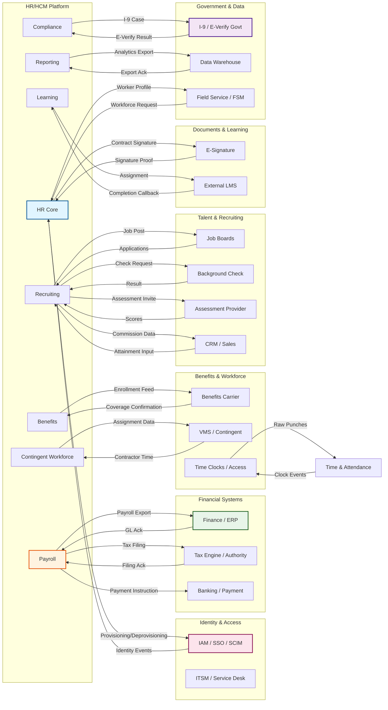
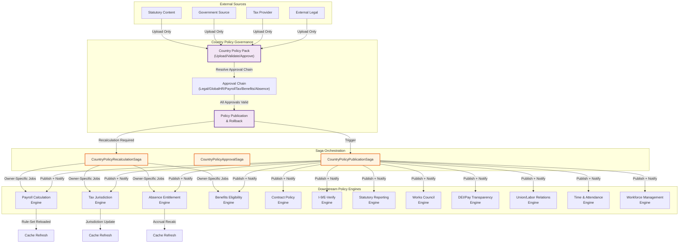

# Enterprise HR/HCM Feature Integration Chart

> **Derived from:** Enterprise HR/HCM Master Blueprint v1.4 — Country Policy Approval Ready  
> **Purpose:** Comprehensive integration matrix mapping all 27 capability domains, external system contracts, cross-blueprint integrations, and V1.4 country policy engine wiring.  
> **Integration types:** CP = Command Port (domain A commands domain B) | EC = Event Consumption (domain A listens to domain B's events) | PR = Projection Read (domain A reads domain B's projections) | SO = Saga Orchestration (domain A orchestrates cross-domain saga) | ○ = No direct integration | — = Self (N/A)

---

## 1. Cross-Domain Integration Matrix

### Row → Column Convention
Each row domain is the **active party**; each column domain is the **target party**.
- **CP** — Row domain issues commands to column domain's command port
- **EC** — Row domain consumes events published by column domain
- **PR** — Row domain reads column domain's projections
- **SO** — Row domain orchestrates sagas involving column domain
- **CP+EC** — Both command and event integration
- **EC+PR** — Both event consumption and projection read
- **CP+EC+SO** — Full integration (command + event + saga)
- **○** — No direct integration

---

### 27 HR Capability Domains

| ID | Domain | Abbreviation |
|----|--------|-------------|
| 1 | HR Core | HRC |
| 2 | Organization Management | ORG |
| 3 | Position Control | POS |
| 4 | Recruiting | REC |
| 5 | Onboarding | ONB |
| 6 | Compensation | CMP |
| 7 | Benefits | BEN |
| 8 | Payroll | PAY |
| 9 | Time & Attendance | TAT |
| 10 | Absence/Leave | ABS |
| 11 | Performance | PRF |
| 12 | Learning | LRN |
| 13 | Skills/Talent | SKL |
| 14 | Succession Planning | SUC |
| 15 | Engagement | ENG |
| 16 | Employee Relations | ER |
| 17 | Compliance | COM |
| 18 | HR Service Delivery | HSD |
| 19 | Workforce Planning | WFP |
| 20 | DEI/People Analytics | DEI |
| 21 | Workforce Management | WFM |
| 22 | Global HR Compliance | GHR |
| 23 | Contingent Workforce | CNT |
| 24 | HR Mobile | MOB |
| 25 | Wellbeing/EAP | WLB |
| 26 | Union/Labor Relations | UNI |
| 27 | Reporting Platform | RPT |

---

### Integration Matrix (Row → Column)

#### 1. HR Core (HRC) → All Domains

| From ↓ / To → | HRC | ORG | POS | REC | ONB | CMP | BEN | PAY | TAT | ABS | PRF | LRN | SKL | SUC | ENG | ER | COM | HSD | WFP | DEI | WFM | GHR | CNT | MOB | WLB | UNI | RPT |
|:-:|:-:|:-:|:-:|:-:|:-:|:-:|:-:|:-:|:-:|:-:|:-:|:-:|:-:|:-:|:-:|:-:|:-:|:-:|:-:|:-:|:-:|:-:|:-:|:-:|:-:|:-:|
| **HRC** | — | EC | EC | EC | SO | EC | EC | EC | EC | EC | EC | EC | EC | EC | EC | EC | EC | EC | EC+PR | PR | EC | EC | EC | EC | EC | EC | PR |

**Notes:**
- **ORG** ← HRC: HRC consumes `OrgUnitCreated`, `OrgUnitReorganized`, `PositionFilled` events to validate worker org context
- **POS** ← HRC: HRC consumes `PositionOpened`, `PositionFilled`, `HeadcountApproved` for job assignment proposals
- **REC** ← HRC: HRC observes `OfferAccepted` to trigger worker profile creation (Command Port from Recruiting to HRC)
- **ONB** ← HRC: HRC orchestrates **OfferToHireSaga** (SO): `OfferAccepted` → create pre-hire worker → create onboarding plan → draft contract → request IAM pre-provisioning
- **CMP** ← HRC: HRC observes `CompensationChangeApplied` for payroll input staging
- **BEN** ← HRC: HRC observes `BenefitsCoverageActivated` for worker snapshot completeness
- **PAY** ← HRC: HRC observes `PayrollCycleOpened` for payroll readiness; HRC does not command payroll directly
- **TAT** ← HRC: HRC consumes `TimesheetApproved` for manager oversight
- **ABS** ← HRC: HRC consumes `AbsenceApproved`, `LeaveStarted`, `WorkerReturnedFromLeave` for employment status
- **PRF** ← HRC: HRC consumes `ReviewCycleClosed` for probation integration
- **GHR** ← HRC: HRC consumes `CountryRuleSetPublished`, `WorkAuthorizationApproved` for global hire compliance
- **WFM** ← HRC: HRC consumes `ShiftSchedulePublished` for workforce visibility
- **RPT** ← HRC: RPT reads HRC projections (`Worker directory projection`) via PR only

---

#### 2. Organization Management (ORG) → All Domains

| From ↓ / To → | HRC | ORG | POS | REC | ONB | CMP | BEN | PAY | TAT | ABS | PRF | LRN | SKL | SUC | ENG | ER | COM | HSD | WFP | DEI | WFM | GHR | CNT | MOB | WLB | UNI | RPT |
|:-:|:-:|:-:|:-:|:-:|:-:|:-:|:-:|:-:|:-:|:-:|:-:|:-:|:-:|:-:|:-:|:-:|:-:|:-:|:-:|:-:|:-:|:-:|:-:|:-:|:-:|:-:|
| **ORG** | CP | — | CP | EC+PR | EC | PR | ○ | PR | PR | ○ | PR | ○ | PR | ○ | ○ | ○ | ○ | ○ | PR | ○ | PR | EC | ○ | ○ | ○ | EC | PR |

**Notes:**
- **HRC** ← ORG: ORG commands `CreateLegalEntity`, `CreateOrgUnit`, `ArchiveOrgUnit` via HRC command port; ORG owns `LegalEntity`, `OrgUnit`, `ManagerRelationship`
- **POS** ← ORG: ORG commands position creation; Position Control is the HR boundary for approved headcount
- **REC** ← ORG: Recruiting reads `OrgUnitCreated`, `OrgUnitReorganized` projections for requisition scope; Recruiting observes org changes via events
- **WFM** ← ORG: WFM reads org projections for scheduling boundaries; observes `OrgUnitCreated` for team-based scheduling
- **GHR** ← ORG: GHR observes `LegalEntityCreated` for statutory scope registration

---

#### 3. Position Control (POS) → All Domains

| From ↓ / To → | HRC | ORG | POS | REC | ONB | CMP | BEN | PAY | TAT | ABS | PRF | LRN | SKL | SUC | ENG | ER | COM | HSD | WFP | DEI | WFM | GHR | CNT | MOB | WLB | UNI | RPT |
|:-:|:-:|:-:|:-:|:-:|:-:|:-:|:-:|:-:|:-:|:-:|:-:|:-:|:-:|:-:|:-:|:-:|:-:|:-:|:-:|:-:|:-:|:-:|:-:|:-:|:-:|:-:|
| **POS** | CP | EC | — | CP+EC | ○ | PR | ○ | ○ | ○ | ○ | ○ | ○ | ○ | ○ | ○ | ○ | ○ | ○ | EC | ○ | ○ | ○ | ○ | ○ | ○ | ○ | PR |

**Notes:**
- **HRC** ← POS: Position Control commands `FillPosition`, `ClosePosition` via HR Core command port
- **REC** ← POS: Position Control commands `CreateJobRequisition` (via headcount fulfillment); Recruiting consumes `HeadcountApproved`, `PositionOpened` events
- **WFP** ← POS: Workforce Planning consumes `HeadcountApproved` for scenario conversion

---

#### 4. Recruiting (REC) → All Domains

| From ↓ / To → | HRC | ORG | POS | REC | ONB | CMP | BEN | PAY | TAT | ABS | PRF | LRN | SKL | SUC | ENG | ER | COM | HSD | WFP | DEI | WFM | GHR | CNT | MOB | WLB | UNI | RPT |
|:-:|:-:|:-:|:-:|:-:|:-:|:-:|:-:|:-:|:-:|:-:|:-:|:-:|:-:|:-:|:-:|:-:|:-:|:-:|:-:|:-:|:-:|:-:|:-:|:-:|:-:|:-:|
| **REC** | CP+SO | PR | EC | — | SO | CP | ○ | ○ | ○ | ○ | ○ | ○ | CP | ○ | ○ | ○ | EC | ○ | PR | ○ | ○ | SO | ○ | ○ | ○ | ○ | PR |

**Notes:**
- **HRC** ← REC: Recruiting commands HRC to `CreateWorkerProfile` via `ConvertAcceptedOffer` (OfferToHireSaga); commands `StartEmployment`, `ChangeEmploymentType`
- **ONB** ← REC: Recruiting orchestrates **OnboardingReadinessSaga** triggered by `OfferAccepted`; creates onboarding plan, drafts contract, requests IAM pre-provisioning
- **CMP** ← REC: Recruiting commands compensation review during offer stage (`OfferCompensationReviewStarted`); uses `CompensationBand` projections for offer range validation
- **SKL** ← REC: Recruiting consumes `SkillEvidenceAdded`, `SkillVerified` for candidate skill matching
- **GHR** ← REC: Recruiting orchestrates **GlobalHireComplianceSaga** (`OfferAccepted` → resolve country rules → validate contract type/work authorization/works council)
- **HRC** command port: `CreateWorkerProfile`, `StartEmployment`

---

#### 5. Onboarding (ONB) → All Domains

| From ↓ / To → | HRC | ORG | POS | REC | ONB | CMP | BEN | PAY | TAT | ABS | PRF | LRN | SKL | SUC | ENG | ER | COM | HSD | WFP | DEI | WFM | GHR | CNT | MOB | WLB | UNI | RPT |
|:-:|:-:|:-:|:-:|:-:|:-:|:-:|:-:|:-:|:-:|:-:|:-:|:-:|:-:|:-:|:-:|:-:|:-:|:-:|:-:|:-:|:-:|:-:|:-:|:-:|:-:|:-:|
| **ONB** | EC | ○ | ○ | ○ | — | ○ | SO | ○ | ○ | ○ | ○ | SO | ○ | ○ | ○ | ○ | SO | SO | ○ | ○ | ○ | SO | ○ | ○ | ○ | ○ | ○ |

**Notes:**
- **HRC** ← ONB: Onboarding observes `WorkerProfileCreated`, `EmploymentStarted` for onboarding plan completion
- **BEN** ← ONB: Onboarding orchestrates **BenefitsLifeEventSaga** triggered by new-hire enrollment
- **LRN** ← ONB: Onboarding orchestrates learning assignment via `AssignLearning` command port for compliance training
- **COM** ← ONB: Onboarding orchestrates **PolicyAcknowledgement** assignment via Compliance command port
- **HSD** ← ONB: Onboarding creates HR Service Cases for equipment/facilities requests through HSD command port

---

#### 6. Compensation (CMP) → All Domains

| From ↓ / To → | HRC | ORG | POS | REC | ONB | CMP | BEN | PAY | TAT | ABS | PRF | LRN | SKL | SUC | ENG | ER | COM | HSD | WFP | DEI | WFM | GHR | CNT | MOB | WLB | UNI | RPT |
|:-:|:-:|:-:|:-:|:-:|:-:|:-:|:-:|:-:|:-:|:-:|:-:|:-:|:-:|:-:|:-:|:-:|:-:|:-:|:-:|:-:|:-:|:-:|:-:|:-:|:-:|:-:|
| **CMP** | CP | ○ | EC | EC+PR | ○ | — | ○ | CP+SO | ○ | ○ | EC | ○ | ○ | ○ | ○ | ○ | ○ | ○ | ○ | SO | ○ | ○ | ○ | ○ | ○ | SO | PR |

**Notes:**
- **HRC** ← CMP: Compensation commands `ApplyCompensationChange` via HRC (triggers job assignment update); commands `ProposeJobAssignment` for comp-driven transfers
- **PAY** ← CMP: Compensation commands `StagePayrollInput` for comp changes; orchestrates **CompensationCycleSaga**, **BonusPayoutSaga**, **EquityLifecycleSaga**
- **PRF** ← CMP: Compensation consumes `CalibrationCompleted` for performance-to-comp recommendations
- **DEI** ← CMP: Compensation orchestrates **PayTransparencyReportSaga** with DEI analytics
- **POS** ← CMP: Compensation observes `StepProgressionStagedForPayroll` for position-linked pay scales
- **UNI** ← CMP: Compensation observes `UnionContractActivated` for CBA pay scale constraints

---

#### 7. Benefits (BEN) → All Domains

| From ↓ / To → | HRC | ORG | POS | REC | ONB | CMP | BEN | PAY | TAT | ABS | PRF | LRN | SKL | SUC | ENG | ER | COM | HSD | WFP | DEI | WFM | GHR | CNT | MOB | WLB | UNI | RPT |
|:-:|:-:|:-:|:-:|:-:|:-:|:-:|:-:|:-:|:-:|:-:|:-:|:-:|:-:|:-:|:-:|:-:|:-:|:-:|:-:|:-:|:-:|:-:|:-:|:-:|:-:|:-:|
| **BEN** | EC | ○ | ○ | ○ | ○ | ○ | — | CP | ○ | ○ | ○ | ○ | ○ | ○ | ○ | ○ | ○ | ○ | ○ | ○ | ○ | EC | ○ | ○ | ○ | ○ | PR |

**Notes:**
- **PAY** ← BEN: Benefits commands `StagePayrollInput` for deduction changes; Benefits orchestrates **BenefitsLifeEventSaga**, **OpenEnrollmentSaga**
- **GHR** ← BEN: Benefits consumes `CountryRuleSetPublished` for benefits continuation, statutory leave rules
- **HRC** ← BEN: Benefits observes `WorkerTerminated` to trigger coverage termination

---

#### 8. Payroll (PAY) → All Domains

| From ↓ / To → | HRC | ORG | POS | REC | ONB | CMP | BEN | PAY | TAT | ABS | PRF | LRN | SKL | SUC | ENG | ER | COM | HSD | WFP | DEI | WFM | GHR | CNT | MOB | WLB | UNI | RPT |
|:-:|:-:|:-:|:-:|:-:|:-:|:-:|:-:|:-:|:-:|:-:|:-:|:-:|:-:|:-:|:-:|:-:|:-:|:-:|:-:|:-:|:-:|:-:|:-:|:-:|:-:|:-:|
| **PAY** | EC | ○ | ○ | ○ | ○ | EC | EC | — | EC | EC | ○ | ○ | ○ | ○ | ○ | ○ | EC+SO | ○ | ○ | ○ | ○ | SO | ○ | ○ | ○ | ○ | PR |

**Notes:**
- **HRC** ← PAY: Payroll observes `WorkerActivated`, `WorkerTerminated` for payroll eligibility; does not command HRC directly
- **TAT** ← PAY: Payroll consumes `TimesheetApproved`, `OvertimeApproved` for payroll input building
- **ABS** ← PAY: Payroll consumes `AbsenceApproved`, `LeaveStarted`, `LeaveEntitlementCalculated` for leave pay staging
- **CMP** ← PAY: Payroll observes `CompensationChangeApplied`, `BonusPayoutStaged` for earning lines
- **BEN** ← PAY: Payroll observes `BenefitsEnrollmentFinalized` for deduction lines
- **COM** ← PAY: Payroll orchestrates **PayrollTaxFilingSaga** with Compliance; observes statutory report requirements
- **GHR** ← PAY: Payroll orchestrates tax jurisdiction workflows via Global HR rule sets

---

#### 9. Time & Attendance (TAT) → All Domains

| From ↓ / To → | HRC | ORG | POS | REC | ONB | CMP | BEN | PAY | TAT | ABS | PRF | LRN | SKL | SUC | ENG | ER | COM | HSD | WFP | DEI | WFM | GHR | CNT | MOB | WLB | UNI | RPT |
|:-:|:-:|:-:|:-:|:-:|:-:|:-:|:-:|:-:|:-:|:-:|:-:|:-:|:-:|:-:|:-:|:-:|:-:|:-:|:-:|:-:|:-:|:-:|:-:|:-:|:-:|:-:|
| **TAT** | ○ | ○ | ○ | ○ | ○ | ○ | ○ | CP+SO | — | EC | ○ | ○ | ○ | ○ | ○ | ○ | ○ | ○ | ○ | ○ | EC+SO | ○ | ○ | EC | ○ | EC | PR |

**Notes:**
- **PAY** ← TAT: Time commands `StagePayrollInput` via Payroll command port; orchestrates **TimesheetToPayrollSaga**
- **ABS** ← TAT: Time consumes `AbsenceApproved` for timesheet leave entries
- **WFM** ← TAT: Time consumes `ShiftSchedulePublished` for schedule adherence; orchestrates **MobileClockToTimesheetSaga** with Workforce Management
- **MOB** ← TAT: Time consumes `MobileClockEventRecorded` for mobile clock events
- **UNI** ← TAT: Time observes `UnionContractActivated` for CBA overtime rules

---

#### 10. Absence/Leave (ABS) → All Domains

| From ↓ / To → | HRC | ORG | POS | REC | ONB | CMP | BEN | PAY | TAT | ABS | PRF | LRN | SKL | SUC | ENG | ER | COM | HSD | WFP | DEI | WFM | GHR | CNT | MOB | WLB | UNI | RPT |
|:-:|:-:|:-:|:-:|:-:|:-:|:-:|:-:|:-:|:-:|:-:|:-:|:-:|:-:|:-:|:-:|:-:|:-:|:-:|:-:|:-:|:-:|:-:|:-:|:-:|:-:|:-:|
| **ABS** | EC | ○ | ○ | ○ | ○ | ○ | ○ | CP+SO | ○ | — | ○ | ○ | ○ | ○ | ○ | ○ | EC | ○ | ○ | ○ | ○ | EC+SO | ○ | ○ | ○ | ○ | PR |

**Notes:**
- **PAY** ← ABS: Absence commands `StagePayrollInput` for leave pay; orchestrates **LeaveToPayrollSaga**
- **GHR** ← ABS: Absence consumes `CountryRuleSetPublished`, `StatutoryLeaveTypePublished` for entitlement rules; orchestrates **LeaveEntitlementRecalculationSaga**
- **COM** ← ABS: Absence observes statutory reporting requirements for leave liability

---

#### 11. Performance (PRF) → All Domains

| From ↓ / To → | HRC | ORG | POS | REC | ONB | CMP | BEN | PAY | TAT | ABS | PRF | LRN | SKL | SUC | ENG | ER | COM | HSD | WFP | DEI | WFM | GHR | CNT | MOB | WLB | UNI | RPT |
|:-:|:-:|:-:|:-:|:-:|:-:|:-:|:-:|:-:|:-:|:-:|:-:|:-:|:-:|:-:|:-:|:-:|:-:|:-:|:-:|:-:|:-:|:-:|:-:|:-:|:-:|:-:|
| **PRF** | CP | ○ | ○ | ○ | ○ | CP+SO | ○ | ○ | ○ | ○ | — | ○ | EC | ○ | ○ | SO | ○ | ○ | ○ | ○ | ○ | ○ | ○ | ○ | ○ | ○ | PR |

**Notes:**
- **HRC** ← PRF: Performance commands `StartProbationReview`, `PassProbation`, `ExtendProbation` via HRC command port
- **CMP** ← PRF: Performance commands compensation changes via `ProposeCompensationChange`; orchestrates **PerformanceToCompensationSaga** (`CalibrationCompleted` → comp recommendations → comp review)
- **SKL** ← PRF: Performance consumes `SkillEvidenceAdded` for review context
- **ER** ← PRF: Performance orchestrates **ERActionPlanSaga** when PIP fails or performance issues escalate to disciplinary

---

#### 12. Learning (LRN) → All Domains

| From ↓ / To → | HRC | ORG | POS | REC | ONB | CMP | BEN | PAY | TAT | ABS | PRF | LRN | SKL | SUC | ENG | ER | COM | HSD | WFP | DEI | WFM | GHR | CNT | MOB | WLB | UNI | RPT |
|:-:|:-:|:-:|:-:|:-:|:-:|:-:|:-:|:-:|:-:|:-:|:-:|:-:|:-:|:-:|:-:|:-:|:-:|:-:|:-:|:-:|:-:|:-:|:-:|:-:|:-:|:-:|
| **LRN** | EC | ○ | ○ | ○ | ○ | ○ | ○ | ○ | ○ | ○ | ○ | — | CP | ○ | ○ | ○ | SO | ○ | ○ | ○ | ○ | ○ | ○ | EC | ○ | ○ | PR |

**Notes:**
- **SKL** ← LRN: Learning commands `AddSkillEvidence`, `VerifySkill` via Skills command port upon course completion
- **COM** ← LRN: Learning orchestrates **CertificationExpirySaga** for compliance-driven training; orchestrates **LearningComplianceSaga**
- **MOB** ← LRN: Learning consumes `HrMobileSyncBatchSubmitted` for offline learning progress

---

#### 13. Skills/Talent (SKL) → All Domains

| From ↓ / To → | HRC | ORG | POS | REC | ONB | CMP | BEN | PAY | TAT | ABS | PRF | LRN | SKL | SUC | ENG | ER | COM | HSD | WFP | DEI | WFM | GHR | CNT | MOB | WLB | UNI | RPT |
|:-:|:-:|:-:|:-:|:-:|:-:|:-:|:-:|:-:|:-:|:-:|:-:|:-:|:-:|:-:|:-:|:-:|:-:|:-:|:-:|:-:|:-:|:-:|:-:|:-:|:-:|:-:|
| **SKL** | ○ | ○ | ○ | PR | ○ | ○ | ○ | ○ | ○ | ○ | PR | EC | — | SO | ○ | ○ | ○ | ○ | SO | ○ | ○ | ○ | ○ | ○ | ○ | ○ | PR |

**Notes:**
- **REC** ← SKL: Recruiting reads skill profile projections for candidate matching
- **PRF** ← SKL: Performance reads skill profiles for review context
- **SUC** ← SKL: Skills orchestrates succession readiness via `TalentPool` membership; feeds `SuccessionPlan` with skill readiness data
- **WFP** ← SKL: Skills orchestrates **SkillsGapAnalysis** → requests learning plan from gaps

---

#### 14. Succession Planning (SUC) → All Domains

| From ↓ / To → | HRC | ORG | POS | REC | ONB | CMP | BEN | PAY | TAT | ABS | PRF | LRN | SKL | SUC | ENG | ER | COM | HSD | WFP | DEI | WFM | GHR | CNT | MOB | WLB | UNI | RPT |
|:-:|:-:|:-:|:-:|:-:|:-:|:-:|:-:|:-:|:-:|:-:|:-:|:-:|:-:|:-:|:-:|:-:|:-:|:-:|:-:|:-:|:-:|:-:|:-:|:-:|:-:|:-:|
| **SUC** | EC | ○ | ○ | ○ | ○ | ○ | ○ | ○ | ○ | ○ | ○ | ○ | EC | — | ○ | ○ | ○ | ○ | EC | ○ | ○ | ○ | ○ | ○ | ○ | ○ | PR |

**Notes:**
- **HRC** ← SUC: Succession observes `WorkerTerminated`, `EmploymentStarted` for succession risk pool management
- **WFP** ← SUC: Succession consumes `WorkforceScenarioApproved` for succession pipeline planning
- **SKL** ← SUC: Succession consumes `SkillEvidenceAdded` for readiness scoring

---

#### 15. Engagement (ENG) → All Domains

| From ↓ / To → | HRC | ORG | POS | REC | ONB | CMP | BEN | PAY | TAT | ABS | PRF | LRN | SKL | SUC | ENG | ER | COM | HSD | WFP | DEI | WFM | GHR | CNT | MOB | WLB | UNI | RPT |
|:-:|:-:|:-:|:-:|:-:|:-:|:-:|:-:|:-:|:-:|:-:|:-:|:-:|:-:|:-:|:-:|:-:|:-:|:-:|:-:|:-:|:-:|:-:|:-:|:-:|:-:|:-:|
| **ENG** | EC | ○ | ○ | ○ | EC | ○ | ○ | ○ | ○ | ○ | ○ | ○ | ○ | ○ | — | ○ | ○ | ○ | ○ | SO | ○ | ○ | ○ | ○ | ○ | ○ | PR |

**Notes:**
- **HRC** ← ENG: Engagement observes `WorkerTerminated` for alumni/exit flow; `WorkerActivated` for milestone tracking
- **ONB** ← ENG: Engagement observes `OnboardingCompleted` for engagement pulse timing
- **DEI** ← ENG: Engagement orchestrates **PayTransparencyReportSaga** with DEI; provides engagement data for inclusion in DEI analytics

---

#### 16. Employee Relations (ER) → All Domains

| From ↓ / To → | HRC | ORG | POS | REC | ONB | CMP | BEN | PAY | TAT | ABS | PRF | LRN | SKL | SUC | ENG | ER | COM | HSD | WFP | DEI | WFM | GHR | CNT | MOB | WLB | UNI | RPT |
|:-:|:-:|:-:|:-:|:-:|:-:|:-:|:-:|:-:|:-:|:-:|:-:|:-:|:-:|:-:|:-:|:-:|:-:|:-:|:-:|:-:|:-:|:-:|:-:|:-:|:-:|:-:|
| **ER** | EC | ○ | ○ | ○ | ○ | ○ | ○ | ○ | ○ | ○ | EC | ○ | ○ | ○ | ○ | — | SO | ○ | ○ | ○ | ○ | SO | ○ | ○ | SO | SO | PR |

**Notes:**
- **HRC** ← ER: ER observes `WorkerTerminated`, `WorkerSuspended` for case context
- **PRF** ← ER: ER consumes `PipStarted`, `PipFailed` for performance-related ER cases
- **COM** ← ER: ER orchestrates disciplinary action workflows with Compliance
- **WLB** ← ER: ER orchestrates accommodation case workflows with Wellbeing/EAP
- **UNI** ← ER: ER orchestrates **UnionGrievanceSaga** with Labor Relations

---

#### 17. Compliance (COM) → All Domains

| From ↓ / To → | HRC | ORG | POS | REC | ONB | CMP | BEN | PAY | TAT | ABS | PRF | LRN | SKL | SUC | ENG | ER | COM | HSD | WFP | DEI | WFM | GHR | CNT | MOB | WLB | UNI | RPT |
|:-:|:-:|:-:|:-:|:-:|:-:|:-:|:-:|:-:|:-:|:-:|:-:|:-:|:-:|:-:|:-:|:-:|:-:|:-:|:-:|:-:|:-:|:-:|:-:|:-:|:-:|:-:|
| **COM** | CP | ○ | ○ | ○ | CP | ○ | ○ | ○ | ○ | ○ | ○ | CP | ○ | ○ | ○ | CP | — | ○ | ○ | ○ | ○ | SO | SO | ○ | ○ | SO | PR |

**Notes:**
- **HRC** ← COM: Compliance commands `RedactPersonalData` via HRC for privacy/DSAR; commands `SuspendWorker` for legal hold
- **ONB** ← COM: Compliance commands `AssignPolicyAcknowledgement` during onboarding
- **LRN** ← COM: Compliance commands `AssignLearning` for compliance training
- **ER** ← COM: Compliance commands for disciplinary case review
- **CNT** ← COM: Compliance orchestrates **MisclassificationAssessment** for contingent worker compliance
- **UNI** ← COM: Compliance orchestrates works council consultation blockers via Labor Relations
- **GHR** ← COM: Compliance orchestrates **GlobalHireComplianceSaga** for work authorization verification

---

#### 18. HR Service Delivery (HSD) → All Domains

| From ↓ / To → | HRC | ORG | POS | REC | ONB | CMP | BEN | PAY | TAT | ABS | PRF | LRN | SKL | SUC | ENG | ER | COM | HSD | WFP | DEI | WFM | GHR | CNT | MOB | WLB | UNI | RPT |
|:-:|:-:|:-:|:-:|:-:|:-:|:-:|:-:|:-:|:-:|:-:|:-:|:-:|:-:|:-:|:-:|:-:|:-:|:-:|:-:|:-:|:-:|:-:|:-:|:-:|:-:|:-:|
| **HSD** | EC | ○ | ○ | ○ | ○ | ○ | ○ | ○ | ○ | ○ | ○ | ○ | ○ | ○ | ○ | ○ | ○ | — | ○ | ○ | ○ | ○ | ○ | ○ | ○ | ○ | PR |

**Notes:**
- **HRC** ← HSD: HSD observes `WorkerProfileCreated`, `WorkerActivated` for case routing and service catalog eligibility
- **RPT** ← HSD: RPT reads HSD projections for service delivery analytics, deflection metrics

---

#### 19. Workforce Planning (WFP) → All Domains

| From ↓ / To → | HRC | ORG | POS | REC | ONB | CMP | BEN | PAY | TAT | ABS | PRF | LRN | SKL | SUC | ENG | ER | COM | HSD | WFP | DEI | WFM | GHR | CNT | MOB | WLB | UNI | RPT |
|:-:|:-:|:-:|:-:|:-:|:-:|:-:|:-:|:-:|:-:|:-:|:-:|:-:|:-:|:-:|:-:|:-:|:-:|:-:|:-:|:-:|:-:|:-:|:-:|:-:|:-:|:-:|
| **WFP** | EC | EC | CP+SO | CP | ○ | ○ | ○ | ○ | ○ | ○ | ○ | EC | EC | EC | ○ | ○ | ○ | ○ | — | ○ | ○ | EC | SO | ○ | ○ | ○ | SO |

**Notes:**
- **ORG** ← WFP: WFP consumes `OrgUnitCreated` for org structure analytics
- **POS** ← WFP: WFP commands `RequestHeadcount` via Position Control; orchestrates headcount-to-requisition flow
- **REC** ← WFP: WFP commands workforce scenario conversion to headcount requests
- **SKL** ← WFP: WFP consumes `SkillEvidenceAdded` for skills gap analysis
- **SUC** ← WFP: WFP consumes `SuccessionPlanDrafted` for workforce pipeline planning
- **GHR** ← WFP: WFP consumes `CountryRuleSetPublished` for global workforce cost modeling
- **CNT** ← WFP: WFP orchestrates contingent workforce planning scenarios
- **RPT** ← WFP: WFP orchestrates report generation via Reporting Platform

---

#### 20. DEI/People Analytics (DEI) → All Domains

| From ↓ / To → | HRC | ORG | POS | REC | ONB | CMP | BEN | PAY | TAT | ABS | PRF | LRN | SKL | SUC | ENG | ER | COM | HSD | WFP | DEI | WFM | GHR | CNT | MOB | WLB | UNI | RPT |
|:-:|:-:|:-:|:-:|:-:|:-:|:-:|:-:|:-:|:-:|:-:|:-:|:-:|:-:|:-:|:-:|:-:|:-:|:-:|:-:|:-:|:-:|:-:|:-:|:-:|:-:|:-:|
| **DEI** | PR | PR | PR | PR | ○ | PR | PR | PR | ○ | ○ | PR | ○ | PR | PR | PR | ○ | PR | ○ | PR | — | ○ | PR | ○ | ○ | ○ | PR | SO |

**Notes:**
- **All PR rows**: DEI reads projections from virtually all domains for analytics, but **never commands or consumes events** (read-only projection access with field policy, aggregation thresholds, and small-cell suppression)
- **CMP** ← DEI: DEI reads compensation projections for pay equity audits
- **UNI** ← DEI: DEI reads union/labor data for pay transparency reporting
- **RPT** ← DEI: DEI orchestrates report generation via Reporting Platform; publishes `DeiReportPublished`, `PayGapReportPublished`

---

#### 21. Workforce Management (WFM) → All Domains

| From ↓ / To → | HRC | ORG | POS | REC | ONB | CMP | BEN | PAY | TAT | ABS | PRF | LRN | SKL | SUC | ENG | ER | COM | HSD | WFP | DEI | WFM | GHR | CNT | MOB | WLB | UNI | RPT |
|:-:|:-:|:-:|:-:|:-:|:-:|:-:|:-:|:-:|:-:|:-:|:-:|:-:|:-:|:-:|:-:|:-:|:-:|:-:|:-:|:-:|:-:|:-:|:-:|:-:|:-:|:-:|
| **WFM** | ○ | ○ | ○ | ○ | ○ | ○ | ○ | CP+SO | EC+SO | ○ | ○ | ○ | ○ | ○ | ○ | ○ | ○ | ○ | ○ | ○ | — | ○ | ○ | EC | ○ | EC | PR |

**Notes:**
- **PAY** ← WFM: WFM commands `StagePayrollInput` for overtime pay; orchestrates **WorkforceScheduleSaga** feeding payroll
- **TAT** ← WFM: WFM consumes `TimesheetApproved` for schedule adherence; orchestrates **MobileClockToTimesheetSaga**; consumes `AttendanceExceptionDetected` for coverage gap detection
- **MOB** ← WFM: WFM consumes `MobileClockEventRecorded` for geofenced clock events
- **UNI** ← WFM: WFM consumes `UnionContractActivated` for CBA scheduling rules

---

#### 22. Global HR Compliance (GHR) → All Domains

| From ↓ / To → | HRC | ORG | POS | REC | ONB | CMP | BEN | PAY | TAT | ABS | PRF | LRN | SKL | SUC | ENG | ER | COM | HSD | WFP | DEI | WFM | GHR | CNT | MOB | WLB | UNI | RPT |
|:-:|:-:|:-:|:-:|:-:|:-:|:-:|:-:|:-:|:-:|:-:|:-:|:-:|:-:|:-:|:-:|:-:|:-:|:-:|:-:|:-:|:-:|:-:|:-:|:-:|:-:|:-:|
| **GHR** | CP | CP | ○ | CP | ○ | ○ | ○ | CP | ○ | CP | ○ | ○ | ○ | ○ | ○ | ○ | CP | ○ | ○ | ○ | ○ | — | CP | ○ | ○ | CP | SO |

**Notes:**
- **HRC** ← GHR: GHR commands `ValidateWorkAuthorization` for global hire compliance; `PlaceWorkerOnLeave` for statutory leave
- **ORG** ← GHR: GHR commands for legal entity statutory registration
- **REC** ← GHR: GHR commands for work authorization validation in recruiting
- **PAY** ← GHR: GHR commands tax jurisdiction rules for payroll
- **ABS** ← GHR: GHR commands statutory leave type, entitlement rules for absence
- **COM** ← GHR: GHR commands statutory report generation workflows
- **CNT** ← GHR: GHR commands work authorization for contingent workers
- **UNI** ← GHR: GHR commands works council consultation rules
- **RPT** ← GHR: GHR orchestrates statutory report generation via Reporting Platform

---

#### 23. Contingent Workforce (CNT) → All Domains

| From ↓ / To → | HRC | ORG | POS | REC | ONB | CMP | BEN | PAY | TAT | ABS | PRF | LRN | SKL | SUC | ENG | ER | COM | HSD | WFP | DEI | WFM | GHR | CNT | MOB | WLB | UNI | RPT |
|:-:|:-:|:-:|:-:|:-:|:-:|:-:|:-:|:-:|:-:|:-:|:-:|:-:|:-:|:-:|:-:|:-:|:-:|:-:|:-:|:-:|:-:|:-:|:-:|:-:|:-:|:-:|
| **CNT** | EC | ○ | ○ | ○ | ○ | ○ | ○ | ○ | ○ | ○ | ○ | ○ | ○ | ○ | ○ | ○ | ○ | ○ | ○ | ○ | ○ | ○ | — | ○ | ○ | ○ | PR |

**Notes:**
- **HRC** ← CNT: Contingent Workforce observes `WorkerProfileCreated` for consolidated workforce view
- **RPT** ← CNT: RPT reads contingent workforce projections

---

#### 24. HR Mobile (MOB) → All Domains

| From ↓ / To → | HRC | ORG | POS | REC | ONB | CMP | BEN | PAY | TAT | ABS | PRF | LRN | SKL | SUC | ENG | ER | COM | HSD | WFP | DEI | WFM | GHR | CNT | MOB | WLB | UNI | RPT |
|:-:|:-:|:-:|:-:|:-:|:-:|:-:|:-:|:-:|:-:|:-:|:-:|:-:|:-:|:-:|:-:|:-:|:-:|:-:|:-:|:-:|:-:|:-:|:-:|:-:|:-:|:-:|
| **MOB** | ○ | ○ | ○ | ○ | ○ | ○ | ○ | ○ | CP | CP | ○ | ○ | ○ | ○ | ○ | ○ | ○ | ○ | ○ | ○ | EC | ○ | ○ | — | ○ | ○ | ○ |

**Notes:**
- **TAT** ← MOB: Mobile commands `SubmitTimesheet` via Time & Attendance command port; commands `DetectAttendanceException` for mobile clock events
- **ABS** ← MOB: Mobile commands `RequestAbsence` via Absence command port; commands `CancelAbsence`
- **WFM** ← MOB: Mobile consumes `ShiftSchedulePublished` for shift swap/bid mobile UX

---

#### 25. Wellbeing/EAP (WLB) → All Domains

| From ↓ / To → | HRC | ORG | POS | REC | ONB | CMP | BEN | PAY | TAT | ABS | PRF | LRN | SKL | SUC | ENG | ER | COM | HSD | WFP | DEI | WFM | GHR | CNT | MOB | WLB | UNI | RPT |
|:-:|:-:|:-:|:-:|:-:|:-:|:-:|:-:|:-:|:-:|:-:|:-:|:-:|:-:|:-:|:-:|:-:|:-:|:-:|:-:|:-:|:-:|:-:|:-:|:-:|:-:|:-:|
| **WLB** | EC | ○ | ○ | ○ | ○ | ○ | ○ | ○ | ○ | ○ | ○ | ○ | ○ | ○ | ○ | EC | ○ | ○ | ○ | ○ | ○ | ○ | ○ | ○ | — | ○ | PR |

**Notes:**
- **HRC** ← WLB: Wellbeing observes `WorkerTerminated` for EAP program termination
- **ER** ← WLB: Wellbeing observes `AccommodationRequested` for medical-related EAP referrals; **EapReferralCreated** is privacy-governed
- **RPT** ← WLB: RPT reads **anonymized only** wellbeing projections (never individual EAP details)

---

#### 26. Union/Labor Relations (UNI) → All Domains

| From ↓ / To → | HRC | ORG | POS | REC | ONB | CMP | BEN | PAY | TAT | ABS | PRF | LRN | SKL | SUC | ENG | ER | COM | HSD | WFP | DEI | WFM | GHR | CNT | MOB | WLB | UNI | RPT |
|:-:|:-:|:-:|:-:|:-:|:-:|:-:|:-:|:-:|:-:|:-:|:-:|:-:|:-:|:-:|:-:|:-:|:-:|:-:|:-:|:-:|:-:|:-:|:-:|:-:|:-:|:-:|
| **UNI** | EC | ○ | ○ | ○ | ○ | EC | ○ | EC | EC | ○ | ○ | ○ | ○ | ○ | ○ | EC | EC | ○ | ○ | ○ | EC | EC | ○ | ○ | ○ | — | PR |

**Notes:**
- **HRC** ← UNI: Union observes `WorkerTerminated` for CBA grievance timing; `EmploymentStarted` for membership eligibility
- **CMP** ← UNI: Union observes `CompensationBandPublished`, `StepProgressionStagedForPayroll` for CBA pay scale compliance
- **PAY** ← UNI: Union consumes `PayrollCalculationFinalized` for CBA pay audit
- **TAT** ← UNI: Union consumes `OvertimeApproved`, `TimesheetApproved` for CBA overtime rule compliance
- **WFM** ← UNI: Union consumes `ShiftSchedulePublished` for CBA scheduling rule compliance
- **ER** ← UNI: Union consumes `EmployeeRelationsCaseOpened` for union grievance escalation
- **COM** ← UNI: Union observes `WorksCouncilConsultationRequested` for co-determination blockers
- **GHR** ← UNI: Union observes `CountryRuleSetPublished` for country-specific labor law rules

---

#### 27. Reporting Platform (RPT) → All Domains

| From ↓ / To → | HRC | ORG | POS | REC | ONB | CMP | BEN | PAY | TAT | ABS | PRF | LRN | SKL | SUC | ENG | ER | COM | HSD | WFP | DEI | WFM | GHR | CNT | MOB | WLB | UNI | RPT |
|:-:|:-:|:-:|:-:|:-:|:-:|:-:|:-:|:-:|:-:|:-:|:-:|:-:|:-:|:-:|:-:|:-:|:-:|:-:|:-:|:-:|:-:|:-:|:-:|:-:|:-:|:-:|
| **RPT** | PR | PR | PR | PR | PR | PR | PR | PR | PR | PR | PR | PR | PR | PR | PR | PR | PR | PR | PR | PR | PR | PR | PR | PR | PR | PR | — |

**Notes:**
- **All domains** ← RPT: Reporting Platform reads projections from **all 26 domains** (read-only, never commands). Governed by field policy, suppression thresholds, and audit-on-access. Cannot directly access special-category raw data. Uses `ReportDefinitionPublished` → `ReportExecutionCompleted` workflow.

---

## 2. External System Integration Contracts

### 2.1 Contract Summary Table

| # | Integration | Mastership | Sync Direction | Data Exchanged | Forbidden Patterns |
|---|------------|------------|---------------|----------------|-------------------|
| 1 | **HR ↔ IAM/SSO/SCIM** | IAM owns identity; HR owns employment status | HR → IAM: provisioning/deprovisioning commands; IAM → HR: identity events only | Worker lifecycle events → IAM; login identity ← IAM | HR cannot mutate IAM credentials; IAM cannot mutate employment status |
| 2 | **HR ↔ Payroll Provider** | Platform owns pre-payroll; external may own gross-to-net/payment per tenant | HR → Provider: payroll export batch; Provider → HR: payroll result ack | Worker snapshot, comp input, time input, absence input, benefits deduction, tax profile → Provider; pay result lines, tax lines, net pay ← Provider | Provider cannot directly mutate HR Core, Compensation, Time, Benefits, or Absence truth |
| 3 | **HR ↔ Tax Engine / Tax Authority** | External tax authority owns legal acknowledgement; platform owns assignment decision | Platform → Tax Engine: tax filing; Tax Engine → Platform: filing acknowledgement, tax rules | Worker tax profile, jurisdiction assignment, payroll data → Tax Engine; tax calculation results, filing acknowledgement ← Tax Engine | Tax adapter cannot change worker profile or payroll result without owner commands |
| 4 | **HR ↔ Benefits Carrier** | Benefits owns platform enrollment; carrier owns external coverage confirmation | Benefits → Carrier: enrollment data; Carrier → Benefits: coverage confirmation, billing data | Enrollment elections, dependent data → Carrier; coverage confirmation, premium rates, reconciliation data ← Carrier | Carrier cannot directly mutate platform enrollment; mismatches enter reconciliation workflow |
| 5 | **HR ↔ Job Boards** | Recruiting owns requisition/posting truth; boards are external publishers | Recruiting → Job Boards: job post; Boards → Recruiting: candidate application, click data | Job requisitions, posting content → Boards; candidate applications, source tracking, click events ← Boards | Job boards cannot change candidate stage or offer state directly |
| 6 | **HR ↔ Background Check Provider** | Provider owns raw check; Recruiting/Compliance owns decision record | Provider → HR: background check result; HR → Provider: candidate info, check request | Candidate PII (with consent), check type → Provider; check status, result reference ← Provider | Sensitive results stored by reference and policy only; no raw data in events |
| 7 | **HR ↔ Assessment Provider** | Provider owns raw scoring; Recruiting owns candidate-stage decision | Provider → HR: assessment scores; HR → Provider: candidate invite, assessment type | Candidate info, assessment type → Provider; scores, completion status ← Provider | Scores are decision inputs, not automatic outcomes; provider cannot advance candidate stage |
| 8 | **HR ↔ E-Signature Provider** | Provider owns signature proof; HR Document Platform owns contract/signature state | HR → Provider: document for signature; Provider → HR: signature event callback | Contract document, signer info → Provider; signature timestamp, proof document, audit trail ← Provider | Callbacks route through Contract command only; provider cannot mutate employment contract terms |
| 9 | **HR ↔ LMS** | Platform owns learning assignment unless LMS declared completion master | HR → LMS: learning assignment; LMS → HR: completion callback (via Learning commands) | Learning assignments, learner info → LMS; completion evidence, SCORM/xAPI statements ← LMS | External LMS cannot directly issue certifications without Learning command validation |
| 10 | **HR ↔ Finance/ERP** | Finance owns GL/journal truth; HR owns payroll staging | Payroll → Finance: payroll journal staging; Finance → HR: GL allocation ack, cost center mirror | Payroll journal entries, headcount, compensation liability → Finance; GL account mapping, budget snapshots ← Finance | Finance cannot rewrite HR payroll cycle history; warehouse writeback forbidden |
| 11 | **HR ↔ Time Clocks/Access Control** | External owns device event; Time owns normalized attendance facts | Clock → HR: raw clock events; HR → Clock: worker sync, schedule data | Worker ID badge mapping → Clock; raw punches, device events ← Clock; worker schedule sync → Clock | Device events normalized and deduped by Time; clocks cannot directly approve timesheets |
| 12 | **HR ↔ VMS (Contingent Workforce)** | VMS or platform per tenant contract | VMS → HR: contingent worker data, time; HR → VMS: assignment data, rate cards | Worker identity, SOW, rate cards, assignments → VMS; contractor time, vendor data, spend data ← VMS | VMS cannot mutate employee HR Core records or payroll truth directly |
| 13 | **HR ↔ Data Warehouse** | Platform owns export job and field policy; warehouse owns downstream copy | HR → Warehouse: analytics export job; Warehouse → HR: none (read-only) | Governed projections, field-policy-filtered data → Warehouse | Warehouse writeback into HR authoritative tables is forbidden |
| 14 | **HR ↔ Service Desk / Field Service** | HR owns worker/employment context; Service Desk owns ticket/work order | HR → FSM: worker profile, skills, certification, availability; FSM → HR: workforce sync request | Worker profile, skills, certifications, shift availability → FSM; service ticket status, dispatch needs ← FSM | FSM cannot change employment status, compensation, or worker profile; HR cannot assign field visits |
| 15 | **HR ↔ CRM** | CRM owns customer/opportunity truth; HR owns worker/job/termination | HR → CRM: worker termination, job assignment changes; CRM → HR: commission attainment data | Worker terminated, job assignment ended → CRM (triggers account transfer); commission attainment data ← CRM | CRM cannot derive termination by deactivating a CRM user; must consume HR events |
| 16 | **HR ↔ I-9/E-Verify Government** | Platform owns I-9 case evidence; government owns E-Verify result | HR → Government: I-9 case, E-Verify case; Government → HR: E-Verify result, filing acknowledgement | I-9 sections, document review evidence → Government; E-Verify result (authorized/TNC/DHS reverification) ← Government | E-Verify adapter cannot directly activate employment; HR Core validates and mutates employment state |

### 2.2 Detailed Integration Contract Specifications

#### 2.2.1 HR ↔ IAM/SSO/SCIM

```
Mastership: IAM owns identity credentials; HR Core owns employment status
Direction: HR publishes events/commands → IAM; IAM publishes identity events → HR (observation only)

HR Commands to IAM:
  - RequestIamProvisioning(workerId, email, roleAssignments)
  - RequestIamDeactivation(workerId, reason, effectiveDate)
  - RequestIamRoleUpdate(workerId, roleAssignments)

IAM Events to HR:
  - IamProvisioned(workerId, identityId)
  - IamDeactivated(workerId, identityId)
  - IamRoleUpdated(workerId, identityId, roles)

Data exchanged:
  HR → IAM: workerId, email, employmentStatus, roleAssignments, effectiveDate
  IAM → HR: identityId, provisionStatus, roleAssignments, timestamp

Forbidden patterns:
  - HR cannot create or mutate IAM credentials directly
  - IAM cannot set Worker employment status (Active, Suspended, Terminated)
  - IAM cannot write to hr_workers table
  - UI self-service cannot bypass HR command to IAM
```

#### 2.2.2 HR ↔ Payroll Provider

```
Mastership: Platform owns pre-payroll inputs/cycles; external payroll may own gross-to-net/payment
Direction: HR Payroll → Provider: export batch; Provider → HR: result acknowledgement

HR Commands to Provider (via adapter):
  - ExportPayrollBatch(payrollCycleId, workerEarnings[], deductions[], taxes[], idempotencyKey)

Provider Callbacks to HR (via command port):
  - RecordPayrollExportAcknowledged(payrollCycleId, exportVersion, providerRef)
  - RecordPayrollExportError(payrollCycleId, errorCode, errorDetail)

Inbound allowlist: payrollRunId, workerExternalId, earningLines, taxLines, deductionLines, 
                   employerCostLines, netPay, currency, period, ruleVersion, resultHash
Outbound allowlist: worker snapshot, compensation input, time input, absence input, 
                    benefits deduction input, tax profile, jurisdiction assignment

Forbidden patterns:
  - External payroll cannot directly mutate HR Core, Compensation, Time, Benefits, Absence truth
  - Payroll export must be idempotent by payrollCycleId + exportVersion
  - No bank account secrets in events or logs
  - Provider errors create Payroll exceptions, not HR source mutations
```

#### 2.2.3 HR ↔ Benefits Carrier

```
Mastership: Benefits owns platform enrollment truth; carrier owns external coverage confirmation
Direction: Benefits → Carrier: enrollment feed; Carrier → Benefits: coverage confirmation, billing

Benefits Commands to Carrier (via adapter):
  - ExportEnrollmentFeed(enrollmentBatchId, enrollments[], idempotencyKey)
  - RequestCarrierReconciliation(carrierId, period)

Carrier Callbacks to Benefits (via command port):
  - RecordCoverageConfirmation(enrollmentId, carrierRef, effectiveDate)
  - RecordCarrierMismatch(mismatchType, carrierData, platformData)

Data exchanged:
  Benefits → Carrier: enrollmentId, workerId, planId, coverageLevel, dependents, effectiveDate
  Carrier → Benefits: carrierEnrollmentId, confirmationStatus, premiumAmount, mismatchRecords

Forbidden patterns:
  - Carrier cannot directly mutate platform enrollment state
  - Mismatches enter BenefitsCarrierReconciliation, corrected by Benefits commands only
  - Carrier billing data does not override platform enrollment truth
```

#### 2.2.4 HR ↔ Data Warehouse

```
Mastership: Platform owns export job and field policy; warehouse owns downstream copy
Direction: HR Reporting → Warehouse: export job only; no warehouse → HR writeback

Reporting Commands:
  - RunWarehouseExportJob(reportDefinitionId, fieldPolicyVersion, idempotencyKey)
  - ScheduleWarehouseExport(reportDefinitionId, schedule, fieldPolicyVersion)

Data exchanged:
  HR → Warehouse: field-policy-filtered projections, calculated fields, aggregation-ready data
  Warehouse → HR: export completion acknowledgement only

Forbidden patterns:
  - Warehouse writeback into HR authoritative tables is strictly forbidden
  - Special-category raw data excluded unless explicitly approved
  - Report execution is read-only and audited
```

---

## 3. Cross-Blueprint Contracts (Section 12.6)

### 3.1 Contract Summary Diagram

```text
┌─────────────────────────────────────────────────────────────────────────────────────────┐
│                           CROSS-BLUEPRINT INTEGRATION MAP                               │
│                                                                                         │
│   ┌──────────┐     ┌──────────┐     ┌──────────┐     ┌──────────┐     ┌──────────┐    │
│   │ HR/HCM   │◄───►│ Service  │     │   CRM    │     │ Finance  │     │  ITSM    │    │
│   │ Blueprint│     │ Desk/FSM │     │  /Sales  │     │  /ERP    │     │  /IAM    │    │
│   └────┬─────┘     └────┬─────┘     └────┬─────┘     └────┬─────┘     └────┬─────┘    │
│        │                │                │                │                │          │
│        │                │                │                │                │          │
│   ┌────┴─────┐     ┌────┴─────┐     ┌────┴─────┐     ┌────┴─────┐     ┌────┴─────┐    │
│   │  Worker  │     │  Worker  │     │ Worker/  │     │  Worker  │     │ Worker   │    │
│   │ Profile  │     │  Skills  │     │  Territory│    │  Payroll │     │ Identity │    │
│   │  Events  │     │  /Certs  │     │ Transfer │     │  Journal │     │ Lifecycle│    │
│   └──────────┘     └──────────┘     └──────────┘     └──────────┘     └──────────┘    │
│                                                                                         │
│   ┌──────────┐     ┌──────────┐     ┌──────────┐                                       │
│   │   LMS    │     │ Benefits │     │   Data   │                                       │
│   │/Learning │     │  Carrier │     │ Warehouse│                                       │
│   └────┬─────┘     └────┬─────┘     └────┬─────┘                                       │
│        │                │                │                                              │
│   ┌────┴─────┐     ┌────┴─────┐     ┌────┴─────┐                                       │
│   │ Learning │     │ Enrollment│    │ Analytics │                                       │
│   │Completion│     │  /Coverage│    │  Export   │                                       │
│   └──────────┘     └──────────┘     └──────────┘                                       │
└─────────────────────────────────────────────────────────────────────────────────────────┘
```

### 3.2 Detailed Cross-Blueprint Contracts

#### HR ↔ Service Desk / Field Service / FSM

| Aspect | Specification |
|--------|--------------|
| **Business concepts** | Worker profile, field agent skill profile, certification, shift availability, employment status |
| **HR owns** | Worker identity in employment context, employment status, job assignment, skills/certifications (if HR-owned), work authorization, training completion (if HR-owned) |
| **Service Desk/FSM owns** | Service ticket, work order, field visit, dispatch appointment, field-agent operational assignment, mobile work package |
| **Sync direction** | HR publishes `WorkerActivated`, `WorkerSuspended`, `WorkerTerminated`, `CertificationIssued/Expired/Revoked`, `SkillProfileUpdated`, `ShiftSchedulePublished` |
| **FSM consumption** | FSM consumes through Workforce/Dispatch command ports; may request certification/availability validation |
| **Forbidden** | FSM/Dispatch may **not** change employment status, compensation, or HR worker profile. HR may **not** assign field visits or mutate work orders |
| **Conflict resolution** | HR employment/work-authorization status blocks dispatch eligibility; FSM operational schedule does not override HR schedule unless a declared workforce integration policy accepts it |
| **Contract type** | Event-driven with command port validation |

#### HR ↔ CRM / Sales Operations

| Aspect | Specification |
|--------|--------------|
| **Business concepts** | Sales employee, account owner, territory assignment, quota/commission inputs |
| **HR owns** | Worker identity, job assignment, termination, manager chain |
| **CRM owns** | Customer/account/opportunity truth; account ownership operational record where declared |
| **Sync direction** | HR publishes `WorkerTerminated`, `JobAssignmentEnded` → CRM; CRM publishes commission attainment → HR |
| **CRM requirements** | CRM must consume `WorkerTerminated` or `JobAssignmentEnded` to trigger account-owner transfer workflow; it cannot derive termination by deactivating a CRM user |
| **Commission flow** | Commission attainment produced by CRM but imported through `VariableCompPlan` / `CommissionAttainment` commands |
| **Forbidden** | CRM cannot directly mutate worker profile, compensation bands, or employment status; CRM commission data is advisory until Compensation commands process it |
| **Contract type** | Event-driven (HR→CRM) + Command port (CRM→HR) |

#### HR ↔ Finance / ERP

| Aspect | Specification |
|--------|--------------|
| **Business concepts** | Cost center, GL allocation, payroll journal, headcount budget, compensation liability |
| **HR owns** | Headcount, worker/job assignment, compensation approval, payroll inputs |
| **Finance owns** | GL, journal truth, payment settlement, finance budget where declared |
| **Sync direction** | Payroll export creates financial staging events; Finance provides GL allocation ack and cost center mirror |
| **Key integration** | `PayrollCycleLocked` → `PayrollExportBatch` → Finance staging → ERP acknowledgment; ERP acknowledgement does not rewrite HR payroll cycle history |
| **FTE reconciliation** | `FteBudgetReconciliation` compares HR headcount truth to Finance budget snapshots |
| **Forbidden** | Finance cannot rewrite HR payroll cycle history; Finance cannot directly approve compensation or headcount changes |
| **Contract type** | Command + Event with staging acknowledgement |

#### HR ↔ ITSM / IAM

| Aspect | Specification |
|--------|--------------|
| **Business concepts** | Account provisioning, access requests, device/equipment tasks, deprovisioning |
| **HR owns** | Hire, transfer, termination, worker lifecycle |
| **IAM owns** | Credentials and access identity |
| **ITSM owns** | IT task lifecycle |
| **Sync direction** | HR onboarding/offboarding requests IAM/ITSM actions through commands/events; IAM/ITSM report completion status |
| **HR commands** | `RequestIamProvisioning`, `RequestIamDeactivation`, `RequestEquipmentProvisioning`, `RequestAccessRevocation` |
| **IAM/ITSM callbacks** | `IamProvisioned`, `IamDeactivated`, `EquipmentTaskCompleted`, `AccessRevoked` |
| **Forbidden** | IAM/ITSM cannot set worker employment status; HR cannot create ITSM tickets directly (requests through command port) |
| **Contract type** | Saga orchestration (OnboardingCompletionSaga, WorkerTerminationSaga) |

#### HR ↔ LMS / Learning

| Aspect | Specification |
|--------|--------------|
| **Business concepts** | Course catalogue, learning assignment, completion, certification |
| **HR Learning owns** | Learning assignment and accepted completion unless LMS is declared completion master per tenant |
| **LMS owns** | Raw learning content delivery, SCORM/xAPI runtime if external |
| **Sync direction** | HR → LMS: learning assignments, learner enrollment; LMS → HR: completion callbacks via Learning commands |
| **Callback routing** | LMS callbacks route through `RecordLearningCompletionEvidence` and `AcceptLearningCompletion` commands |
| **Forbidden** | External LMS cannot directly issue certifications without Learning command validation; LMS cannot mutate skill profiles directly |
| **Contract type** | Command port with callback validation |

#### HR ↔ Payroll / Tax Authority

| Aspect | Specification |
|--------|--------------|
| **Business concepts** | Payroll inputs, payroll cycle, tax filings, payslip metadata |
| **HR Payroll owns** | Pre-payroll validation, payroll-cycle workflow, payroll export staging |
| **External payroll owns** | Gross-to-net calculation and payment truth per mastership contract |
| **Tax Authority owns** | Legal filing acknowledgement and tax rule interpretation |
| **Sync direction** | Payroll → Tax Authority: tax filings, worker tax profiles; Tax Authority → Payroll: filing acknowledgement, tax rule updates |
| **Key events** | `PayrollCalculationFinalized`, `PayrollResultLineCalculated`, `TaxJurisdictionAssignmentFinalized`, `YearEndFormDelivered`, `PayrollTaxFilingSubmitted` |
| **Forbidden** | Tax adapter cannot change worker profile or payroll result without owner commands; tax results are inputs to payroll validation, not overrides |
| **Contract type** | Staged export with acknowledgement + rule-set consumption |

#### HR ↔ Benefits Carrier

| Aspect | Specification |
|--------|--------------|
| **Business concepts** | Benefits enrollment, carrier coverage, premiums, dependent eligibility |
| **Benefits owns** | Platform enrollment truth |
| **Carrier owns** | External coverage confirmation and billing truth |
| **Sync direction** | Benefits → Carrier: enrollment elections, changes, dependent data; Carrier → Benefits: coverage confirmation, billing reconciliation data |
| **Reconciliation** | Carrier mismatches enter `BenefitsCarrierReconciliation` and are corrected by Benefits commands only |
| **Forbidden** | Carrier cannot directly mutate platform enrollment; carrier billing data does not override enrollment truth |
| **Contract type** | Command port + reconciliation workflow |

#### HR ↔ Data Warehouse

| Aspect | Specification |
|--------|--------------|
| **Business concepts** | Analytics export, field policy, report definitions, warehouse jobs |
| **Platform owns** | Export job definition, field policy, execution audit |
| **Warehouse owns** | Downstream analytics copy |
| **Sync direction** | HR Reporting Platform → Warehouse: export jobs only; Warehouse → HR: completion acknowledgement |
| **Data governance** | All exports are field-policy-filtered, aggregated where required, and audited on execution |
| **Forbidden** | Warehouse writeback into HR authoritative tables is strictly forbidden; warehouse cannot trigger HR commands |
| **Contract type** | Producer-only export with governance |

---

## 4. V1.4 Country Policy Pack Integration

### 4.1 Country Policy Governance Flow

```text
Policy Upload          Policy Validation           Policy Simulation             Policy Approval                    Policy Publication
┌──────────┐          ┌──────────────┐            ┌──────────────────┐         ┌──────────────────┐            ┌──────────────────────┐
│  UPLOAD  │─────────►│   VALIDATE   │───────────►│    SIMULATE      │────────►│    APPROVE       │───────────►│     PUBLISH          │
│  source  │          │  schema +    │            │  impact on       │         │  Legal / Global  │           │  Activate engines    │
│  evidence│          │  evidence    │            │  workers,        │         │  HR / Payroll    │           │  Trigger             │
│          │          │  + semantic  │            │  payroll,        │         │  Tax / Benefits  │           │  recalculation       │
│          │          │              │            │  leave, tax,     │         │  / Absence       │           │                      │
│          │          │              │            │  benefits        │         │  / Compliance    │           │                      │
└──────────┘          └──────────────┘            └──────────────────┘         └──────────────────┘            └──────────────────────┘
       │                      │                         │                            │                              │
       ▼                      ▼                         ▼                            ▼                              ▼
  ┌─────────┐          ┌────────────┐           ┌──────────────┐           ┌──────────────┐            ┌──────────────────┐
  │ Source  │          │ Validation │           │  Simulation  │           │  Approval    │            │  Publication     │
  │Evidence │          │    Run     │           │    Report    │           │   Steps      │            │   Event          │
  │  Store  │          │  Results   │           │   Generated  │           │  Recorded    │            │   Emitted        │
  └─────────┘          └────────────┘           └──────────────┘           └──────────────┘            └──────────────────┘
```

### 4.2 Country Policy Engine Integration Map

| Downstream Engine | Policy Sections Consumed | Integration Pattern | Trigger Event |
|---|---|---|---|
| **Payroll Calculation Engine** | `payrollTaxJurisdictionRules`, `payrollCalendarRules`, `currencyRules` | Policy cache refresh + rule-set reload | `CountryPolicyPackPublished` → payroll-rule-cache consumer |
| **Tax Jurisdiction Engine** | `payrollTaxJurisdictionRules`, `taxAuthorityFilingEndpoints` | Jurisdiction assignment rules updated | `CountryPolicyPackPublished` → tax-jurisdiction-engine consumer |
| **Absence Entitlement Engine** | `statutoryLeaveTypes`, `publicHolidayCalendarRules`, `noticePeriodRules` | Accrual formula refresh, carryover rules updated | `CountryPolicyPackPublished` → absence-entitlement-engine consumer |
| **Benefits Eligibility Engine** | `benefitsContinuationRules`, `statutoryLeaveTypes` | Eligibility rules, continuation coverage rules | `CountryPolicyPackPublished` → benefits-eligibility-engine consumer |
| **Employment Contract Policy Engine** | `contractTypeRules`, `probationRules`, `noticePeriodRules` | Contract template rules, probation periods | `CountryPolicyPackPublished` → contract-policy-engine consumer |
| **I-9 / E-Verify Engine** | `workAuthorizationRules` | Work authorization validation rules | `CountryPolicyPackPublished` → I-9/E-Verify engine consumer |
| **Statutory Reporting Engine** | `statutoryReportingRules`, `payTransparencyRules` | Report schemas, filing rules, thresholds | `CountryPolicyPackPublished` → statutory-reporting-engine consumer |
| **Works Council Engine** | `worksCouncilConsultationRules` | Co-determination blockers, consultation rules | `CountryPolicyPackPublished` → works-council engine consumer |
| **Union/Labor Relations Engine** | `contractTypeRules`, `worksCouncilConsultationRules`, `noticePeriodRules` | CBA rule validation, union consultation | `CountryPolicyPackPublished` → union-contract-rules consumer |
| **DEI / Pay Transparency Engine** | `payTransparencyRules`, `dataRetentionRules` | Pay gap reporting thresholds, retention | `CountryPolicyPackPublished` → DEI-report-engine consumer |
| **Time & Attendance Engine** | `publicHolidayCalendarRules`, `statutoryLeaveTypes` | Holiday calendars, leave type mapping | `CountryPolicyPackPublished` → time-calendar-engine consumer |
| **Workforce Management Engine** | `publicHolidayCalendarRules`, `noticePeriodRules` | Scheduling constraints, notice-based scheduling | `CountryPolicyPackPublished` → WFM-scheduling-engine consumer |

### 4.3 V1.4 Event-Driven Integration

| Event | Topic | Impacted Engines | Consumer Action |
|---|---|---|---|
| `CountryPolicyPackUploaded` | `hr.global.v1` | country-policy-dashboard, global-compliance-saga, security-scan-consumer | Validate source, trigger parsing |
| `CountryPolicyValidated` | `hr.global.v1` | country-policy-dashboard, global-compliance-saga | Trigger simulation, resolve approval chain |
| `CountryPolicyImpactSimulated` | `hr.global.v1` | approval-service, impacted-engine preview | Present to approvers, preview impact |
| `CountryPolicyPackApproved` | `hr.global.v1` | CountryPolicyPublicationSaga, recalculation-saga | Schedule publication, prepare engine refresh |
| `CountryPolicyPackPublished` | `hr.global.v1` | All 12 downstream engines + payroll-rule-cache + tax-jurisdiction-engine + absence-entitlement-engine + benefits-eligibility-engine + contract-policy-engine + I-9/E-Verify engine + statutory-reporting-engine | Refresh policy cache, reload rule sets, begin recalculation |
| `CountryPolicyPackSuperseded` | `hr.global.v1` | All downstream engines | Switch to newer pack, handle overlap |
| `CountryPolicyPackRolledBack` | `hr.global.v1` | All downstream engines | Restore previous active pack, cancel pending recalculations |
| `CountryPolicyRecalculationRequested` | `hr.global.v1` | payroll-recalculation-saga, leave-balance-recalculation-saga, tax-profile-revalidation-saga, benefits-reconciliation-saga | Execute owner-specific recalculation jobs |

### 4.4 V1.4 Required Approval Chain Resolution

| Policy Section Impacted | Required Approvers | SoD Rule |
|---|---|---|
| Labor/contract rules | Legal Policy Approver + Global HR Compliance Officer | Uploader ≠ Legal Approver |
| Payroll/tax rules | Payroll Tax Policy Approver | Author ≠ Approver |
| Absence/leave rules | Absence Policy Approver | Author ≠ Approver |
| Benefits rules | Benefits Policy Approver | Author ≠ Approver |
| Works council rules | Legal Policy Approver + Labor Relations Specialist | Uploader ≠ Approver |
| I-9/E-Verify rules | Global HR Compliance Officer | Uploader ≠ Approver |
| Statutory reporting | Compliance Officer + Legal | Uploader ≠ Approver |
| Full pack publication | Country Policy Publisher (after all approvals valid) | Publisher ≠ Original Uploader |

### 4.5 V1.4 Forbidden Patterns

```text
1. External legal/tax/statutory providers cannot publish country policy directly.
2. Uploaded policy cannot be consumed by payroll, absence, benefits, contracts, I-9/E-Verify, 
   or statutory reporting engines until PUBLISHED status is reached.
3. Government/tax adapters cannot mutate worker records, payroll results, leave balances, 
   or I-9 eligibility directly.
4. Vendor feeds cannot bypass Legal/Global HR/Payroll Tax approval chain.
5. Implementation teams may not encode country-specific law directly in application code; 
   they must consume country packs through policy engines.
6. Emergency rollback requires independent approval unless break-glass policy applies.
7. Same actor cannot upload and publish without independent approval and platform exception.
8. Policy engines must validate authoritative policy version from command handlers, not 
   projection cache alone.
```

---

## 5. Saga Orchestration Integration Map

### 5.1 Cross-Domain Saga Registry

| Saga | Orchestrator | Domains Involved | Trigger Event | DLQ Topic |
|---|---|---|---|---|
| **OfferToHireSaga** | HR Core + Recruiting | HRC → ONB → Contract → IAM | `OfferAccepted` | `hr.saga.dlq.offer-to-hire` |
| **OnboardingReadinessSaga** | Onboarding | ONB → Task → ITSM → IAM → Facilities | `OnboardingPlanCreated` | `hr.saga.dlq.onboarding-readiness` |
| **WorkerTerminationSaga** | HR Core | HRC → Offboarding → IAM → Benefits → Payroll | `WorkerTerminated` | `hr.saga.dlq.worker-termination` |
| **OffboardingCompletionSaga** | Offboarding | Offboarding → ITSM → Payroll → Benefits → Facilities | `WorkerNoticePeriodStarted` | `hr.saga.dlq.offboarding` |
| **FinalSettlementSaga** | Payroll + Offboarding | PAY → Time → Benefits → Finance | `OffboardingPlanStarted` | `hr.saga.dlq.final-settlement` |
| **TimesheetToPayrollSaga** | Time & Attendance | TAT → Payroll | `TimesheetApproved` | `hr.saga.dlq.timesheet-payroll` |
| **BenefitsLifeEventSaga** | Benefits | BEN → Payroll → Carrier | `BenefitsLifeEventRecorded` | `hr.saga.dlq.benefits-life-event` |
| **LeaveToPayrollSaga** | Absence/Leave | ABS → Payroll | `LeaveApproved` / `LeaveStarted` | `hr.saga.dlq.leave-payroll` |
| **RequisitionToOfferSaga** | Recruiting | REC → JobBoards → Assessment → Background → CMP | `JobRequisitionApproved` | `hr.saga.dlq.requisition-offer` |
| **PerformanceToCompensationSaga** | Performance + Compensation | PRF → CMP → Payroll | `CalibrationCompleted` | `hr.saga.dlq.performance-compensation` |
| **CompensationCycleSaga** | Compensation | CMP → Bonus → Equity → Payroll | `CompensationPlanActivated` | `hr.saga.dlq.compensation-cycle` |
| **BonusPayoutSaga** | Compensation + Payroll | CMP → PAY | `BonusCycleApproved` | `hr.saga.dlq.bonus-payout` |
| **EquityLifecycleSaga** | Compensation | CMP → Payroll → Finance | `EquityGrantIssued` | `hr.saga.dlq.equity-lifecycle` |
| **OpenEnrollmentSaga** | Benefits | BEN → Carrier → Payroll | `OpenEnrollmentLaunched` | `hr.saga.dlq.open-enrollment` |
| **WorkforceScheduleSaga** | Workforce Management | WFM → TAT → Payroll | `ShiftSchedulePublished` | `hr.saga.dlq.workforce-schedule` |
| **GlobalHireComplianceSaga** | Recruiting + Global HR | REC → GHR → WorkAuth → Compliance → ONB | `OfferAccepted` | `hr.saga.dlq.global-hire` |
| **CertificationExpirySaga** | Learning + Compliance | LRN → SKL → Manager | `CertificationExpiringSoon` | `hr.saga.dlq.certification-expiry` |
| **ERActionPlanSaga** | Employee Relations | ER → Disciplinary → Training → Manager | `ErActionPlanApproved` | `hr.saga.dlq.er-action-plan` |
| **PayTransparencyReportSaga** | DEI + Reporting | DEI → RPT → Compliance | `ReportingPeriodClosed` | `hr.saga.dlq.pay-transparency` |
| **UnionGrievanceSaga** | Union/Labor Relations | UNI → ER → Legal → Arbitration | `UnionGrievanceFiled` | `hr.saga.dlq.union-grievance` |
| **PayrollCalculationSaga** | Payroll | PAY → Tax → Validation → Export | `PayrollCycleLocked` | `hr.saga.dlq.payroll-calculation` |
| **PayrollTaxFilingSaga** | Payroll + Tax | PAY → Tax Authority → Compliance | `TaxFilingDue` | `hr.saga.dlq.tax-filing` |
| **ContingentWorkerOnboardingSaga** | Contingent Workforce | CNT → VMS → HRC → IAM | `ContingentAssignmentApproved` | `hr.saga.dlq.contingent-onboarding` |
| **I9VerificationSaga** | Employment Eligibility | I-9 → E-Verify → HR Core | `I9CaseCreated` | `hr.saga.dlq.i9` |
| **CountryPolicyPublicationSaga** | Global HR Compliance | GHR → All 12 downstream engines | `CountryPolicyPackApproved` | `hr.saga.dlq.country-policy-publication` |
| **CountryPolicyApprovalSaga** | Global HR Compliance | GHR → Legal → GlobalHR → PayrollTax → Benefits → Absence | `CountryPolicyImpactSimulated` | `hr.saga.dlq.country-policy-approval` |
| **CountryPolicyRecalculationSaga** | Global HR Compliance | GHR → Payroll → Tax → Absence → Benefits | `CountryPolicyPackPublished` (recalculationRequired=true) | `hr.saga.dlq.country-policy-recalculation` |

### 5.2 Saga Operational Contract Template

Every saga must declare:

```textnmaxDurationSeconds:         {seconds}
maxRetryCount:              {count}
stepTimeoutSeconds:         {seconds}
timeoutTransition:          {MOVE_TO_MANUAL_REVIEW | MARK_BLOCKED | ROUTE_EXCEPTION}
deadLetterTopic:            hr.saga.dlq.{saga-name}
stuckDetectionQuery:        {query to detect stuck saga instances}
ownerOnCallRole:            {role responsible for manual recovery}
manualRecoveryCommand:      {Recover{SagaName}}
```

---

## 6. Mermaid Diagrams

### 6.1 Full HR/HCM Integration Topology Graph

```mermaid
graph TB
    subgraph "Core HR Domains"
        HRC["HR Core<br/>(Worker/Employment)"]
        ORG["Organization Mgmt<br/>(Legal Entity/Org Unit)"]
        POS["Position Control<br/>(Headcount/Position)"]
    end
    subgraph "Talent Lifecycle"
        REC["Recruiting<br/>(Requisitions/Candidates/Offers)"]
        ONB["Onboarding<br/>(Plans/Tasks/Contracts)"]
    end
    subgraph "Compensation & Benefits"
        CMP["Compensation<br/>(Pay/Bonus/Equity)"]
        BEN["Benefits<br/>(Enrollment/Carrier)"]
        PAY["Payroll<br/>(Cycle/Calculation/Tax)"]
    end
    subgraph "Time & Workforce"
        TAT["Time & Attendance<br/>(Timesheets/Clock)"]
        ABS["Absence/Leave<br/>(Requests/Accruals)"]
        WFM["Workforce Mgmt<br/>(Scheduling/Shifts)"]
    end
    subgraph "Talent & Performance"
        PRF["Performance<br/>(Reviews/Goals/PIP)"]
        LRN["Learning<br/>(Courses/Assignments)"]
        SKL["Skills/Talent<br/>(Profiles/Evidence)"]
        SUC["Succession Planning<br/>(Pools/Plans)"]
    end
    subgraph "Employee Experience"
        ENG["Engagement<br/>(Surveys/Recognition)"]
        WLB["Wellbeing/EAP<br/>(Referrals/Programs)"]
        HSD["HR Service Delivery<br/>(Cases/Knowledge)"]
    end
    subgraph "Governance & Risk"
        ER["Employee Relations<br/>(Cases/Investigations)"]
        COM["Compliance<br/>(Policies/Statutory Reports)"]
        GHR["Global HR Compliance<br/>(Country Rules/Policy Packs)"]
        UNI["Union/Labor Relations<br/>(CBA/Grievances)"]
    end
    subgraph "Analytics & Contingent"
        DEI["DEI/People Analytics"]
        RPT["Reporting Platform"]
        CNT["Contingent Workforce"]
        MOB["HR Mobile"]
        WFP["Workforce Planning"]
    end

    HRC <-->|Command + Event| ORG
    HRC <-->|Event| POS
    HRC <-->|Command + Saga| REC
    HRC <-->|Saga| ONB
    HRC <-->|Event| CMP
    HRC <-->|Event| BEN
    HRC <-->|Event| PAY
    HRC <-->|Event| TAT
    HRC <-->|Event| ABS
    HRC <-->|Event| PRF
    HRC <-->|Event| GHR
    HRC <-->|Event| UNI
    
    REC -->|OfferToHireSaga| ONB
    REC -->|Command| CMP
    REC -->|GlobalHireSaga| GHR
    ONB -->|Command| HRC
    ONB -->|Saga| BEN
    ONB -->|Saga| LRN
    ONB -->|Saga| COM
    
    CMP -->|Saga| PAY
    CMP -->|PerformanceToCompSaga| PRF
    CMP -->|Command| HRC
    BEN -->|Command| PAY
    BEN -->|Saga| PAY
    PAY -->|Event| COM
    PAY -->|TaxFilingSaga| GHR
    
    TAT -->|TimesheetToPayrollSaga| PAY
    TAT <-->|ShiftSync| WFM
    TAT -->|Event| MOB
    ABS -->|LeaveToPayrollSaga| PAY
    ABS -->|EntitlementRecalcSaga| GHR
    WFM -->|Command| PAY
    WFM -->|Saga| TAT
    
    PRF -->|Command| HRC
    PRF -->|Saga| CMP
    PRF -->|Saga| ER
    LRN -->|Command| SKL
    LRN -->|CertExpirySaga| COM
    SKL -->|Saga| SUC
    SKL -->|Saga| WFP
    
    WFP -->|Command| POS
    WFP -->|Command| REC
    WFP -->|Saga| CNT
    DEI -->|Read Only| HRC
    DEI -->|Read Only| CMP
    DEI -->|Read Only| PRF
    DEI -->|Saga| RPT
    
    GHR -->|PolicyPublicationSaga| PAY
    GHR -->|PolicyPublicationSaga| ABS
    GHR -->|PolicyPublicationSaga| BEN
    GHR -->|PolicyPublicationSaga| COM
    GHR -->|PolicyPublicationSaga| UNI
    
    ER -->|Saga| WLB
    ER -->|UnionGrievanceSaga| UNI
    ENG -->|Saga| DEI
    
    RPT -->|Read Only| HRC
    RPT -->|Read Only| PAY
    RPT -->|Read Only| REC
    RPT -->|Read Only| AllDomains
    
    MOB -->|Command| TAT
    MOB -->|Command| ABS
    MOB -->|Event| WFM
    
    CNT -->|Saga| HRC
    WLB -->|Event| ER
    
    style HRC fill:#e1f5ff,stroke:#01579b,stroke-width:2px
    style PAY fill:#fff3e0,stroke:#e65100,stroke-width:2px
    style REC fill:#e8f5e9,stroke:#1b5e20,stroke-width:2px
    style GHR fill:#f3e5f5,stroke:#4a148c,stroke-width:2px
    style RPT fill:#eceff1,stroke:#263238,stroke-width:2px
```



### 6.2 External System Integration Map



### 6.3 Cross-Blueprint Contract Diagram

```mermaid
graph TB
    subgraph "HR/HCM Blueprint"
        direction TB
        
        subgraph "HR Core Layer"
            HW["Worker Profile"]
            HJ["Job Assignment"]
            HE["Employment Status"]
        end
        
        subgraph "HR Talent Layer"
            HS["Skills/Certifications"]
            HP["Performance Data"]
            HC["Compensation"]
        end
        
        subgraph "HR Operations Layer"
            HPA["Payroll Input"]
            HBE["Benefits Enrollment"]
            HT["Time/Absence"]
        end
        
        subgraph "HR Governance Layer"
            HG["Global HR Rules"]
            HCOM["Compliance Reports"]
        end
    end
    
    subgraph "Service Desk / FSM Blueprint"
        FA["Field Agent Profile"]
        FW["Work Order"]
        FD["Dispatch"]
        FT["Ticket"]
    end
    
        subgraph "CRM / Sales Blueprint"
        CO["Account Owner"]
        CT["Territory"]
        CA["Attainment"]
        COP["Opportunity"]
    end
    
    subgraph "Finance / ERP Blueprint"
        FGL["General Ledger"]
        FBC["Budget/Cost Center"]
        FPA["Payment"]
        FJR["Journal"]
    end
    
    subgraph "ITSM / IAM Blueprint"
        II["Identity"]
        IC["Credentials"]
        IT["IT Task"]
        IA["Access Request"]
    end
    
    subgraph "Data / Analytics Blueprint"
        DW["Data Warehouse"]
        DRA["Analytics"]
        DSH["Dashboards"]
    end
    
    HW -.->|"WorkerActivated/Terminated<br/>Events"| FA
    HS -.->|"Certification/Skill<br/>Events"| FA
    HJ -.->|"Job Assignment<br/>Events"| FA
    FA -.->|"Workforce Sync<br/>Request"| HW
    
    HW -.->|"Termination Events"| CO
    HJ -.->|"Territory Change"| CT
    HC -.->|"Commission Input"| CA
    CA -.->|"Attainment Data"| HC
    
    HPA -.->|"Payroll Journal<br/>Staging"| FGL
    HPA -.->|"Payment<br/>Instruction"| FPA
    FBC -.->|"Cost Center<br/>Mirror"| HJ
    FJR -.->|"GL Acknowledgement"| HPA
    
    HW -.->|"Provisioning/Deprovisioning<br/>Commands"| II
    II -.->|"Identity Events"| HW
    HW -.->|"Equipment/Access<br/>Requests"| IT
    IT -.->|"Task Completion"| HW
    
    HW -.->|"Field-Policy-Filtered<br/>Export"| DW
    HC -.->|"Anonymized Export"| DW
    HP -.->|"Aggregation Export"| DW
    HG -.->|"Statutory Export"| DW
    DW -.->|"Analytics"| DRA
    DRA -.->|"Dashboards"| DSH
    
    style HW fill:#e1f5ff,stroke:#01579b,stroke-width:2px
    style HPA fill:#fff3e0,stroke:#e65100,stroke-width:2px
    style II fill:#fce4ec,stroke:#880e4f,stroke-width:2px
    style FGL fill:#e8f5e9,stroke:#1b5e20,stroke-width:2px
    style DW fill:#eceff1,stroke:#263238,stroke-width:2px
```



### 6.4 V1.4 Country Policy Engine Topology



---

## 7. Event Topic Wiring Summary

### 7.1 Topic → Producer → Consumer Map

| Topic | Producers | Consumers | Integration Purpose |
|---|---|---|---|
| `hr.core.v1` | HR Core, Employment | IAM, Payroll, Benefits, Reporting | Worker lifecycle, job assignment |
| `hr.recruiting.v1` | Recruiting, Candidate Experience | Onboarding, Reporting, Global HR | Requisitions, offers, candidate events |
| `hr.compensation.v1` | Compensation | Payroll, DEI, Reporting | Pay changes, bonus, equity events |
| `hr.time.v1` | Time, WFM, Mobile | Payroll, Schedule Adherence | Timesheets, clock events, schedules |
| `hr.absence.v1` | Absence Entitlement, Leave | Payroll, Finance, Self-Service | Leave requests, accruals, liability |
| `hr.payroll.v1` | Payroll Calculation, Payroll Tax | Finance, Payslip, Reporting | Payroll results, tax filings |
| `hr.benefits.v1` | Benefits | Payroll, Carrier, Reporting | Enrollment, life events, reconciliation |
| `hr.learning.v1` | Learning Delivery | Certification, Compliance | Course completions, transcripts |
| `hr.global.v1` | Global HR, Compliance | All downstream engines, Reporting | Country rules, statutory reports, **country policy packs** |
| `hr.contingent.v1` | Contingent Workforce | IAM, Finance, Service Desk | Contractor assignments, SOW |
| `hr.analytics.v1` | Reporting, DEI, Engagement | Schedule Delivery, Compliance | Report execution, DEI insights |
| `hr.mobile.v1` | HR Mobile | Notifications, Security | Device sync, push tokens, clock |
| `hr.wellbeing.v1` | Wellbeing/EAP | Dashboard, Payroll | EAP referrals, wellness claims |

### 7.2 Consumer Group Rules

```text
1. Consumer group naming: {domain}-{purpose}-consumer-v{major}
2. Every consumer stores sourceEventId + consumerName + consumerVersion in inbox_events
3. Consumers may call authoritative command ports ONLY if registered as process managers
4. Projection consumers must NOT call commands
5. Inbox deduplication enforced by UNIQUE(consumer_name, consumer_version, source_event_id)
6. Failed messages route to domain-specific DLQ with error class, correlationId, recovery hints only
```

---

## 8. Integration Anti-Patterns (Forbidden)

| Anti-Pattern | Rule |
|---|---|
| **Cross-domain direct write** | No domain may directly mutate another domain's tables. All mutations go through command ports. |
| **Event bypass for commands** | Consumers cannot use events as commands. Events notify; commands request. |
| **Projection writeback** | Projection consumers must never call authoritative commands. Projections are read-only. |
| **External system direct mutation** | No external system (payroll, carrier, VMS, tax) may directly mutate HR authoritative tables. |
| **Saga direct repository access** | Sagas call owner command ports only; they do not access domain repositories directly unless they own that domain. |
| **UI bypass** | No UI screen may mutate HR records directly; all changes go through command handlers. |
| **Self-service approval bypass** | Self-service cannot approve its own request unless explicitly auto-approved by published policy. |
| **Warehouse writeback** | Data warehouse cannot write back into HR authoritative tables. |
| **Hardcoded country rules** | Implementation teams may not encode country-specific law directly in code; must use policy packs. |
| **AI HR truth ownership** | AI remains advisory; it never owns HR truth or makes autonomous adverse decisions. |
| **Emergency bypass** | Break-glass access requires post-review; emergency rollback requires independent approval. |

---

> **Document Governance**
> - **Owner:** Enterprise Integration Architecture Team
> - **Review cycle:** Per blueprint version (this doc maps to v1.4)
> - **Change trigger:** New domain, new saga, new external system, new country policy engine
> - **Approval:** Platform Architect + HR Domain Architect
