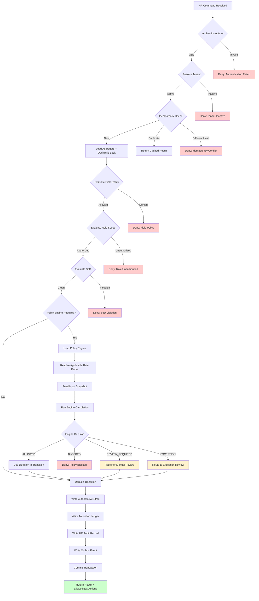
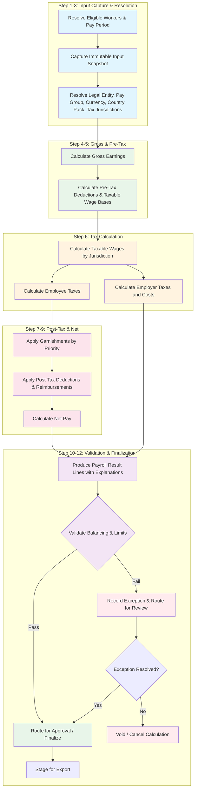
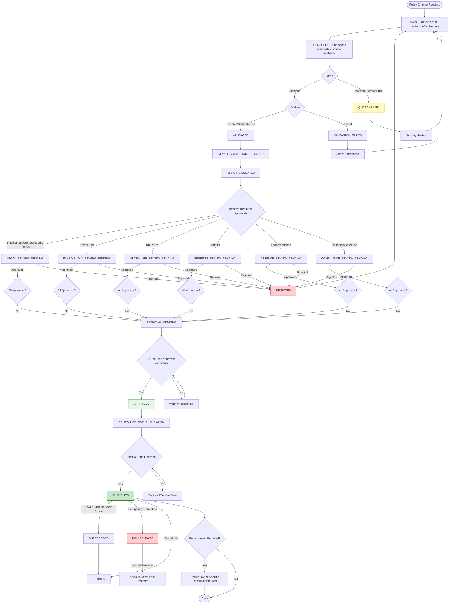
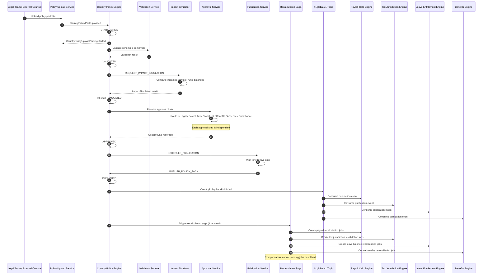
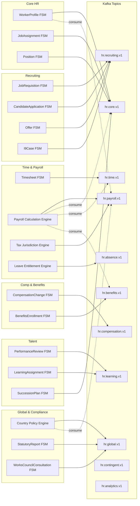

# Brain, Engines, Integration and Wiring

> Derived from `enterprise_hr_hcm_master_blueprint_v1_4_country_policy_approval_ready.md`
> Version: 1.4 | Date: 2025-01-27

---

## Table of Contents

1. [Policy Engine Catalog (25+ Engines)](#1-policy-engine-catalog)
2. [Calculation Engines](#2-calculation-engines)
3. [Country Policy Engine (V1.4)](#3-the-country-policy-engine-v14)
4. [Engine Wiring Architecture](#4-engine-wiring-architecture)
5. [Rule Pack Data Models](#5-rule-pack-data-models)
6. [Mermaid Diagrams](#6-mermaid-diagrams)
7. [Appendix A: Architecture Decision Register](#appendix-a-architecture-decision-register-summary)
8. [Appendix B: Glossary](#appendix-b-glossary)

---

## 1. Policy Engine Catalog

The HR Business Brain produces explainable, versioned decisions. UI, BFF, and projections may never infer HR policy outcomes as authority. Each policy engine below declares its inputs, outputs, decision record types, associated rule packs, associated tables, and the version in which it was introduced.

---

### 1.1 Employment Eligibility Policy Engine

| Attribute | Details |
|---|---|
| **Engine Name** | Employment Eligibility Policy |
| **Purpose** | Determines whether a worker is eligible to be activated based on completeness of identity, contracts, work authorization, background checks, training, and acknowledgements. |
| **Version Introduced** | V1.0 |

**Inputs:**
- worker identity completeness, legal entity, country/region, work location, employment type
- work authorization status, contract signed status
- background check result (if required)
- age/minimum work eligibility rules, mandatory onboarding tasks
- required policy acknowledgements, required training/certification before start
- manager and position validity

**Outputs:**
```text
ELIGIBLE_TO_ACTIVATE
ELIGIBLE_WITH_APPROVED_EXCEPTION
BLOCKED_MISSING_CONTRACT
BLOCKED_WORK_AUTHORIZATION
BLOCKED_BACKGROUND_CHECK
BLOCKED_MANDATORY_TRAINING
BLOCKED_POLICY_ACKNOWLEDGEMENT
BLOCKED_POSITION_INVALID
BLOCKED_LEGAL_ENTITY_INVALID
UNKNOWN_REQUIRES_HR_REVIEW
```

**Decision Record Types Emitted:**
- `EmploymentEligibilityDecision` -- links workerId, decision code, blocking factors, effective date

**Associated Rule Packs:**
- `global-hiring-eligibility-rules`, `country-work-authorization-rules`, `background-check-policy-rules`, `onboarding-task-completion-rules`

**Associated Tables:**
- `hr_workers`, `hr_employment_relationships`, `hr_employment_contracts`, `hr_job_assignments`, `work_authorization_cases`, `background_check_cases`, `policy_acknowledgements`, `learning_assignments`

---

### 1.2 Position & Headcount Policy Engine

| Attribute | Details |
|---|---|
| **Engine Name** | Position & Headcount Policy |
| **Purpose** | Evaluates whether a headcount request is approved, requires approval, or is blocked based on workforce plan alignment, budget, position control, and hiring freezes. |
| **Version Introduced** | V1.0 |

**Inputs:**
- workforce plan, budget approval, legal entity, department/org unit, cost center, job profile, grade/level, FTE
- backfill/new headcount flag, location/work model, hiring urgency

**Outputs:**
```text
HEADCOUNT_APPROVED
HEADCOUNT_APPROVAL_REQUIRED
HEADCOUNT_BLOCKED_BUDGET
HEADCOUNT_BLOCKED_POSITION_CONTROL
HEADCOUNT_BLOCKED_FREEZE
HEADCOUNT_BLOCKED_ORG_INVALID
```

**Decision Record Types Emitted:** `HeadcountRequestDecision`, `PositionControlDecision`

**Associated Rule Packs:** `position-control-rules`, `budget-authorization-rules`, `headcount-freeze-rules`, `workforce-plan-alignment-rules`

**Associated Tables:** `org_positions`, `headcount_requests`, `workforce_plans`, `org_legal_entities`, `org_units`

---

### 1.3 Recruiting Fairness & Compliance Policy Engine

| Attribute | Details |
|---|---|
| **Engine Name** | Recruiting Fairness & Compliance Policy |
| **Purpose** | Evaluates job postings, candidate advancement, and offer readiness against pay transparency rules, consent requirements, assessment results, and labor-law compliance. |
| **Version Introduced** | V1.0 |

**Inputs:**
- job posting content, compensation transparency requirement, interview scorecards
- candidate consent, candidate source, assessment results, background check scope
- country/local labor rules, internal mobility eligibility, conflict of interest rules

**Outputs:**
```text
POSTING_ALLOWED / POSTING_REQUIRES_COMPLIANCE_REVIEW
CANDIDATE_ADVANCE_ALLOWED / CANDIDATE_ADVANCE_REQUIRES_REVIEW
OFFER_ALLOWED / OFFER_BLOCKED_MISSING_CONSENT / OFFER_BLOCKED_BACKGROUND_CHECK / OFFER_BLOCKED_COMPLIANCE_REVIEW
```

**Decision Record Types Emitted:** `PostingComplianceDecision`, `CandidateAdvancementDecision`, `OfferComplianceDecision`

**Associated Rule Packs:** `pay-transparency-rules`, `candidate-consent-rules`, `conflict-of-interest-rules`, `assessment-usage-rules`, `equal-opportunity-recruiting-rules`

**Associated Tables:** `job_requisitions`, `requisition_postings`, `candidates`, `candidate_applications`, `candidate_consents`, `interview_events`, `assessment_results`, `background_check_cases`

---

### 1.4 Offer & Compensation Policy Engine

| Attribute | Details |
|---|---|
| **Engine Name** | Offer & Compensation Policy |
| **Purpose** | Determines whether an offer is within compensation band, requires review, or is blocked based on internal equity, pay transparency rules, and approval thresholds. |
| **Version Introduced** | V1.0 |

**Inputs:**
- job profile, compensation band, candidate location, internal equity, market adjustment
- sign-on bonus, equity/incentive eligibility, relocation package, approver thresholds, pay transparency rules

**Outputs:**
```text
OFFER_WITHIN_POLICY / OFFER_REQUIRES_COMP_REVIEW / OFFER_REQUIRES_EXEC_APPROVAL
OFFER_REQUIRES_PAY_EQUITY_REVIEW / OFFER_BLOCKED_OUTSIDE_BAND / OFFER_BLOCKED_LEGAL_REVIEW
```

**Decision Record Types Emitted:** `OfferCompensationDecision`, `PayEquityRiskDecision`, `OutsideBandCompensationDecision`

**Associated Rule Packs:** `compensation-band-rules`, `pay-equity-review-rules`, `offer-approval-threshold-rules`, `pay-transparency-jurisdiction-rules`

**Associated Tables:** `offers`, `offer_approvals`, `compensation_bands`, `compensation_changes`, `pay_equity_reviews`

---

### 1.5 Time, Absence & Leave Policy Engine

| Attribute | Details |
|---|---|
| **Engine Name** | Time, Absence & Leave Policy |
| **Purpose** | Evaluates absence requests, leave eligibility, and scheduling against worker eligibility, accrual balances, blackout dates, statutory entitlements, and medical documentation requirements. |
| **Version Introduced** | V1.0 |

**Inputs:**
- worker eligibility, work schedule, holiday calendar, absence type, accrual balance
- statutory entitlement, prior approved absences, blackout dates, manager approval requirement
- medical documentation requirement, return-to-work requirement

**Outputs:**
```text
ABSENCE_AUTO_APPROVED / ABSENCE_MANAGER_REVIEW_REQUIRED / ABSENCE_HR_REVIEW_REQUIRED
ABSENCE_BLOCKED_INSUFFICIENT_BALANCE / ABSENCE_BLOCKED_BLACKOUT_DATE
LEAVE_DOCUMENTATION_REQUIRED / LEAVE_APPROVAL_REQUIRED / RETURN_TO_WORK_CLEARANCE_REQUIRED
```

**Decision Record Types Emitted:** `AbsenceEligibilityDecision`, `LeaveCaseDecision`, `ReturnToWorkDecision`

**Associated Rule Packs:** `absence-type-rules`, `accrual-balance-rules`, `blackout-date-rules`, `statutory-leave-rules`, `medical-documentation-rules`

**Associated Tables:** `absence_requests`, `leave_cases`, `absence_accrual_balances`, `work_schedules`, `timesheets`, `timesheet_entries`

---

### 1.6 Payroll Validation Policy Engine

| Attribute | Details |
|---|---|
| **Engine Name** | Payroll Validation Policy |
| **Purpose** | Validates payroll inputs before calculation runs, ensuring completeness of timesheets, compensation data, tax locations, bank details, and benefit deductions. |
| **Version Introduced** | V1.0 |

**Inputs:**
- employment status, job assignment effective dates, compensation effective dates
- timesheet status, absence facts, benefit deductions, tax location/work location
- bank/payment details, one-time payments, retro changes, payroll calendar

**Outputs:**
```text
PAYROLL_INPUT_VALID / PAYROLL_INPUT_REQUIRES_OWNER_CORRECTION
PAYROLL_INPUT_BLOCKED_MISSING_TIMESHEET / PAYROLL_INPUT_BLOCKED_COMPENSATION_CONFLICT
PAYROLL_INPUT_BLOCKED_TAX_LOCATION / PAYROLL_INPUT_BLOCKED_BANK_DETAILS
PAYROLL_CYCLE_READY_FOR_APPROVAL / PAYROLL_CYCLE_BLOCKED_EXCEPTIONS
```

**Decision Record Types Emitted:** `PayrollValidationDecision`, `PayrollInputReadinessDecision`, `PayrollCycleApprovalDecision`

**Associated Rule Packs:** `payroll-input-completeness-rules`, `payroll-calendar-rules`, `tax-location-validation-rules`, `retro-calculation-rules`

**Associated Tables:** `payroll_cycles`, `payroll_inputs`, `payroll_validation_results`, `hr_job_assignments`, `compensation_changes`, `timesheets`, `absence_requests`, `benefits_enrollments`

---

### 1.7 Performance & Calibration Policy Engine

| Attribute | Details |
|---|---|
| **Engine Name** | Performance & Calibration Policy |
| **Purpose** | Evaluates review readiness, calibration requirements, rating distribution compliance, and promotion eligibility against cycle rules and feedback completeness. |
| **Version Introduced** | V1.0 |

**Inputs:**
- review cycle type, goal completion, feedback completeness, manager review submitted
- peer review required, calibration rules, rating distribution policy
- promotion eligibility, compensation cycle linkage

**Outputs:**
```text
REVIEW_READY_FOR_CALIBRATION / REVIEW_BLOCKED_MISSING_FEEDBACK
RATING_REQUIRES_CALIBRATION / PROMOTION_RECOMMENDATION_ALLOWED
PROMOTION_REQUIRES_APPROVAL / PAY_RECOMMENDATION_REQUIRES_COMP_REVIEW
```

**Decision Record Types Emitted:** `ReviewReadinessDecision`, `CalibrationDecision`, `PromotionEligibilityDecision`, `RatingDistributionDecision`

**Associated Rule Packs:** `review-cycle-rules`, `calibration-policy-rules`, `rating-distribution-rules`, `promotion-eligibility-rules`

**Associated Tables:** `performance_review_cycles`, `performance_reviews`, `review_feedback_items`, `goals`, `calibration_sessions`, `performance_improvement_plans`

---

### 1.8 Employee Relations & Disciplinary Policy Engine

| Attribute | Details |
|---|---|
| **Engine Name** | Employee Relations & Disciplinary Policy |
| **Purpose** | Evaluates ER case routing, disciplinary action authorization, works council requirements, legal risk, and evidence sufficiency. |
| **Version Introduced** | V1.0 |

**Inputs:**
- case type, severity, legal risk, complainant/respondent relationship
- manager involvement, prior disciplinary history, country labor rules
- union/works council requirement, privacy/special-category data

**Outputs:**
```text
ER_CASE_STANDARD_REVIEW / ER_CASE_LEGAL_REVIEW_REQUIRED / ER_CASE_RESTRICTED_ACCESS_REQUIRED
DISCIPLINARY_ACTION_ALLOWED / DISCIPLINARY_ACTION_LEGAL_REVIEW_REQUIRED
DISCIPLINARY_ACTION_BLOCKED_INSUFFICIENT_EVIDENCE / WORKS_COUNCIL_REVIEW_REQUIRED
```

**Decision Record Types Emitted:** `ErCaseRoutingDecision`, `DisciplinaryActionDecision`, `WorksCouncilReviewDecision`, `EvidenceSufficiencyDecision`

**Associated Rule Packs:** `er-case-routing-rules`, `disciplinary-action-authority-rules`, `works-council-blocker-rules`, `evidence-threshold-rules`

**Associated Tables:** `employee_relations_cases`, `er_investigations`, `disciplinary_actions`, `accommodation_cases`, `works_council_consultations`

---

### 1.9 Talent & Succession Policy Engine

| Attribute | Details |
|---|---|
| **Engine Name** | Talent & Succession Policy |
| **Purpose** | Evaluates successor readiness, development needs, retention risk, and internal mobility recommendations against talent pool rules and performance trends. |
| **Version Introduced** | V1.0 |

**Inputs:**
- critical role status, successor readiness, skill gaps, performance trend
- mobility interest, retention risk, manager nomination, calibration outcome
- learning plan status

**Outputs:**
```text
SUCCESSOR_READY_NOW / SUCCESSOR_READY_SOON / SUCCESSOR_DEVELOPMENT_REQUIRED
SUCCESSION_PLAN_REVIEW_REQUIRED / INTERNAL_MOBILITY_RECOMMENDED / RETENTION_ACTION_RECOMMENDED
```

**Decision Record Types Emitted:** `SuccessorReadinessDecision`, `SuccessionPlanReviewDecision`, `InternalMobilityDecision`, `RetentionRiskDecision`

**Associated Rule Packs:** `succession-readiness-rules`, `talent-pool-rules`, `skill-gap-rules`, `retention-action-rules`

**Associated Tables:** `succession_plans`, `succession_candidates`, `talent_pools`, `talent_pool_memberships`, `skill_profiles`, `career_paths`

---

### 1.10 HR Privacy & Visibility Policy Engine

| Attribute | Details |
|---|---|
| **Engine Name** | HR Privacy & Visibility Policy |
| **Purpose** | Field-level access control engine that decides visibility, masking, and step-up requirements for any employee data field based on actor role, relationship, data category, and jurisdiction. |
| **Version Introduced** | V1.0 |

**Inputs:**
- actor role, actor relationship to subject worker, employee data field category
- special-category data flag, employee relations case restriction, legal hold
- country/region, purpose of access, break-glass state

**Outputs:**
```text
FIELD_VISIBLE / FIELD_MASKED / FIELD_HIDDEN
ACCESS_REQUIRES_STEP_UP / ACCESS_REQUIRES_BREAK_GLASS
ACCESS_DENIED_SPECIAL_CATEGORY / ACCESS_DENIED_NO_BUSINESS_NEED
```

**Decision Record Types Emitted:** `FieldAccessDecision`, `BreakGlassAccessDecision`, `StepUpAuthenticationDecision`

**Associated Rule Packs:** `field-classification-rules`, `actor-scope-rules`, `special-category-rules`, `legal-hold-rules`, `break-glass-rules`

**Associated Tables:** `hr_audit_access_logs`, `employee_data_subject_requests`, `hr_legal_holds`, `hr_personal_data_records`

---

### 1.11 Compensation, Equity & Total Rewards Policy Engine

| Attribute | Details |
|---|---|
| **Engine Name** | Compensation, Equity & Total Rewards Policy |
| **Purpose** | Comprehensive compensation governance engine covering plan eligibility, off-band risk, pay equity, bonus allocation, equity grants, vesting, variable comp, and total comp statement visibility. |
| **Version Introduced** | V1.0 / V1.1 expanded |

**Required Decision Record Types:**
- `CompensationPlanEligibilityDecision`, `OutsideBandCompensationDecision`, `PayEquityRiskDecision`, `BonusPoolAllocationDecision`
- `EquityGrantEligibilityDecision`, `EquityVestingTreatmentDecision`, `VariableCompPayoutDecision`, `TotalCompStatementVisibilityDecision`

**Inputs:**
- job assignment, job profile, grade, band, geography, legal entity, worker type
- performance result, calibration result, market survey version, prior compensation history
- pay-equity cohort, budget owner, currency, union/CBA coverage, country rule set
- manager recommendation, HRBP approval, finance approval, payroll calendar

**Outputs:**
```text
COMP_ALLOWED / COMP_REQUIRES_PAY_EQUITY_REVIEW / COMP_REQUIRES_FINANCE_APPROVAL
COMP_BLOCKED_OUTSIDE_BAND / COMP_BLOCKED_MISSING_ACTIVE_PLAN
EQUITY_ALLOWED / EQUITY_BLOCKED_POLICY
BONUS_PAYOUT_ALLOWED / BONUS_PAYOUT_REQUIRES_CALIBRATION
TOTAL_COMP_VISIBLE_TO_EMPLOYEE / TOTAL_COMP_REDACTED_BY_FIELD_POLICY
```

**Rules:**
- Compensation recommendations never become pay changes until Compensation owner approves and stages them.
- Off-band or protected-cohort risk requires pay-equity review before approval.
- Payroll consumes approved staged outcomes; it does not decide compensation eligibility.

**Associated Rule Packs:** `compensation-band-governance-rules`, `pay-equity-rules`, `bonus-allocation-rules`, `equity-grant-rules`, `total-comp-visibility-rules`

**Associated Tables:** `compensation_plans`, `compensation_plan_cycles`, `compensation_bands`, `compensation_changes`, `pay_equity_reviews`, `bonus_cycles`, `bonus_recommendations`, `equity_grants`, `equity_vesting_events`, `variable_comp_plans`, `total_compensation_statements`

---

### 1.12 Workforce Management & Scheduling Policy Engine

| Attribute | Details |
|---|---|
| **Engine Name** | Workforce Management & Scheduling Policy |
| **Purpose** | Evaluates shift schedules against demand forecasts, legal maximum hours, rest periods, certifications, union/CBA rules, and labor budget constraints. |
| **Version Introduced** | V1.1 |

**Inputs:**
- demand forecast, legal maximum hours, rest period, skills, certifications
- union/CBA rules, availability, existing shifts, overtime history
- location, worker age/permit constraints, labor budget, coverage requirement

**Outputs:**
```text
SCHEDULE_ALLOWED / SCHEDULE_REQUIRES_MANAGER_APPROVAL
SCHEDULE_BLOCKED_REST_PERIOD / SCHEDULE_BLOCKED_OVERTIME_POLICY
SCHEDULE_BLOCKED_CERTIFICATION / SCHEDULE_BLOCKED_WORK_AUTHORIZATION
COVERAGE_GAP_DETECTED
```

**Decision Record Types Emitted:** `ScheduleApprovalDecision`, `CoverageGapDecision`, `OvertimeEligibilityDecision`

**Associated Rule Packs:** `scheduling-constraint-rules`, `overtime-policy-rules`, `rest-period-rules`, `certification-requirement-rules`, `union-scheduling-rules`

**Associated Tables:** `shift_schedules`, `shift_assignments`, `open_shifts`, `shift_bids`, `shift_swap_requests`, `overtime_approvals`, `coverage_gap_events`, `schedule_adherence_records`, `work_schedules`

---

### 1.13 Global Labor-Law Localization Policy Engine

| Attribute | Details |
|---|---|
| **Engine Name** | Global Labor-Law Localization Policy |
| **Purpose** | Applies country-specific labor rules to HR actions, determining whether a given action is available, requires statutory reporting, works council consultation, or is blocked by local law. |
| **Version Introduced** | V1.1 |

**Inputs:**
- country, subdivision, legal entity, worker type, contract type
- union/CBA coverage, hire date, termination reason, notice period
- probation status, leave type, payroll currency, tax authority, works council rule set

**Outputs:**
```text
LABOR_RULE_AVAILABLE / LABOR_RULE_MISSING
ACTION_REQUIRES_WORKS_COUNCIL / ACTION_REQUIRES_NOTICE_PERIOD
ACTION_REQUIRES_STATUTORY_REPORT / ACTION_BLOCKED_BY_LOCAL_LAW
ACTION_REQUIRES_LOCAL_HR_REVIEW
```

**Decision Record Types Emitted:** `LaborRuleDecision`, `WorksCouncilRequirementDecision`, `StatutoryReportRequirementDecision`

**Associated Rule Packs:** `country-labor-law-rules` (country packs), `works-council-rules`, `statutory-reporting-rules`, `notice-period-rules`, `probation-rules`

**Associated Tables:** `global_country_rule_sets`, `statutory_leave_types`, `local_contract_type_rules`, `notice_period_rules`, `works_council_consultations`, `statutory_reports`, `work_authorization_cases`

---

### 1.14 Benefits Policy Engine

| Attribute | Details |
|---|---|
| **Engine Name** | Benefits Policy |
| **Purpose** | Evaluates benefit eligibility, dependent verification, open enrollment windows, spending account limits, continuation requirements, and carrier reconciliation needs. |
| **Version Introduced** | V1.1 |

**Inputs:**
- employment status, legal entity, country, benefit class, life event
- dependent data, open enrollment window, carrier plan
- spending account limits, continuation eligibility, worker contribution, payroll frequency

**Outputs:**
```text
BENEFIT_ELIGIBLE / BENEFIT_NOT_ELIGIBLE / BENEFIT_REQUIRES_DEPENDENT_VERIFICATION
BENEFIT_REQUIRES_CARRIER_RECONCILIATION / CONTINUATION_REQUIRED
SPENDING_ACCOUNT_LIMIT_EXCEEDED / OPEN_ENROLLMENT_CLOSED
```

**Decision Record Types Emitted:** `BenefitEligibilityDecision`, `DependentVerificationDecision`, `ContinuationEligibilityDecision`, `OpenEnrollmentDecision`

**Associated Rule Packs:** `benefit-eligibility-rules`, `dependent-verification-rules`, `continuation-rules`, `spending-account-limit-rules`, `carrier-reconciliation-rules`

**Associated Tables:** `benefits_programs`, `benefits_enrollments`, `benefits_life_events`, `benefits_open_enrollments`, `dependent_eligibility_verifications`, `benefits_continuation_cases`, `spending_accounts`, `carrier_reconciliation_runs`, `carrier_reconciliation_mismatches`

---

### 1.15 HR Service Delivery Policy Engine

| Attribute | Details |
|---|---|
| **Engine Name** | HR Service Delivery Policy |
| **Purpose** | Routes HR service cases to the correct resolution path (self-service, HR agent, ER restricted, legal review) based on case characteristics and actor role. |
| **Version Introduced** | V1.1 |

**Inputs:**
- service catalog item, employee role, country, legal entity
- case category, sensitivity, ER proximity, SLA tier
- language, requester, manager relationship, field policy

**Outputs:**
```text
CASE_CAN_SELF_RESOLVE / CASE_REQUIRES_HR_AGENT
CASE_REQUIRES_ER_RESTRICTED_ROUTING / CASE_REQUIRES_LEGAL_REVIEW
CASE_SLA_TARGET_SELECTED / CASE_VISIBILITY_RESTRICTED
```

**Decision Record Types Emitted:** `CaseRoutingDecision`, `CaseSlaDecision`, `CaseVisibilityDecision`

**Associated Rule Packs:** `service-catalog-routing-rules`, `case-priority-rules`, `sla-tier-rules`, `er-proximity-rules`

**Associated Tables:** `hr_service_cases`, `hr_case_tasks`, `hr_service_catalog_items`, `hr_knowledge_articles`, `hr_virtual_agent_sessions`, `hr_case_sla_instances`, `hr_deflection_attempts`

---

### 1.16 Self-Service Authority Policy Engine

| Attribute | Details |
|---|---|
| **Engine Name** | Self-Service Authority Policy |
| **Purpose** | Determines which self-service actions an employee or manager can execute without HR approval, and which require approval or step-up authentication. |
| **Version Introduced** | V1.1 |

**Self-Service Command Allowlist:**

| Actor | Allowed without HR approval | Usually requires approval |
|---|---|---|
| Employee | update contact details, emergency contact, consent preference, submit absence request, submit life event evidence, acknowledge policy, view payslip/total comp | legal name, bank reference, national ID, benefit election outside window, work location change, accommodation request, grievance |
| Manager | approve simple absence, submit requisition request, submit compensation recommendation, record performance input, request transfer/promotion, approve shift swap | termination, disciplinary action, compensation approval, PIP closure, ER-sensitive action, immigration/work authorization decision |

**Rules:**
- Self-service requests use command envelopes and authority owners; the UI never mutates HR truth directly.
- Payslip and total compensation access is audited and field-policy-filtered.
- Life events may trigger Benefits/Payroll/HR Core effects only after owner validation and approval where required.

**Decision Record Types Emitted:** `SelfServiceAllowlistDecision`, `ManagerActionDecision`, `StepUpRequiredDecision`

**Associated Rule Packs:** `employee-self-service-rules`, `manager-self-service-rules`, `sensitive-change-rules`, `step-up-authentication-rules`

**Associated Tables:** `self_service_requests`, `manager_action_requests`, `payslip_access_logs`, `employee_life_events`

---

### 1.17 Workforce Planning Policy Engine

| Attribute | Details |
|---|---|
| **Engine Name** | Workforce Planning Policy |
| **Purpose** | Evaluates workforce planning scenarios against strategic plans, budgets, headcount targets, skills gaps, and contingent workforce needs. |
| **Version Introduced** | V1.1 |

**Inputs:**
- strategic plan, budget, current headcount, open requisitions, positions
- attrition signals, skills inventory, demand forecast
- contingent workforce plan, finance cost centers

**Outputs:**
```text
SCENARIO_WITHIN_BUDGET / SCENARIO_REQUIRES_FINANCE_REVIEW
HEADCOUNT_REQUEST_ALLOWED / SKILLS_GAP_IDENTIFIED
CONTINGENT_WORKFORCE_REQUIRED / FTE_BUDGET_VARIANCE_FLAGGED
```

**Decision Record Types Emitted:** `WorkforceScenarioDecision`, `HeadcountRequestAllowedDecision`, `SkillsGapDecision`

**Associated Rule Packs:** `workforce-scenario-rules`, `budget-variance-rules`, `skills-gap-rules`, `contingent-workforce-planning-rules`

**Associated Tables:** `workforce_plans`, `headcount_requests`, `org_positions`, `talent_pools`, `skill_profiles`

---

### 1.18 DEI, Pay Transparency & People Analytics Policy Engine

| Attribute | Details |
|---|---|
| **Engine Name** | DEI, Pay Transparency & People Analytics Policy |
| **Purpose** | Governs the production of demographic, DEI, and pay transparency reports, ensuring lawful basis, minimum cell thresholds, legal review, and pay gap action planning. |
| **Version Introduced** | V1.1 |

**Inputs:**
- demographic data availability, lawful basis, minimum cell threshold
- reporting jurisdiction, job family, grade, comp band
- promotion/attrition/event data, pay equity cohort

**Outputs:**
```text
REPORT_ALLOWED / REPORT_SUPPRESSED_SMALL_CELL / REPORT_REQUIRES_LEGAL_REVIEW
PAY_GAP_ACTION_PLAN_REQUIRED / PAY_EQUITY_REMEDIATION_REQUIRED
DEMOGRAPHIC_ACCESS_DENIED
```

**Decision Record Types Emitted:** `DeiReportDecision`, `PayTransparencyReportDecision`, `PayGapActionPlanDecision`, `DemographicAccessDecision`

**Associated Rule Packs:** `dei-reporting-rules`, `pay-transparency-rules`, `minimum-cell-threshold-rules`, `demographic-access-rules`

**Associated Tables:** `pay_equity_reviews`, `engagement_surveys`, `statutory_reports`, `hr_audit_access_logs`

---

### 1.19 Engagement, Recognition & 360 Feedback Policy Engine

| Attribute | Details |
|---|---|
| **Engine Name** | Engagement, Recognition & 360 Feedback Policy |
| **Purpose** | Governs survey eligibility, anonymity thresholds, recognition program rules, feedback visibility, and conflict-of-interest checks. |
| **Version Introduced** | V1.1 |

**Inputs:**
- survey type, anonymity threshold, visibility policy
- recognition program rules, reward budget
- manager/team relationship, reviewer eligibility, conflict-of-interest policy

**Outputs:**
```text
SURVEY_ALLOWED / SURVEY_SUPPRESSED_ANONYMITY_THRESHOLD
RECOGNITION_ALLOWED / RECOGNITION_REQUIRES_MODERATION
FEEDBACK_RELEASE_ALLOWED / FEEDBACK_VISIBILITY_RESTRICTED
```

**Decision Record Types Emitted:** `SurveyEligibilityDecision`, `RecognitionDecision`, `FeedbackVisibilityDecision`

**Associated Rule Packs:** `survey-anonymity-rules`, `recognition-program-rules`, `feedback-visibility-rules`, `conflict-of-interest-rules`

**Associated Tables:** `engagement_surveys`, `engagement_survey_responses`, `engagement_action_plans`, `recognition_records`, `review_feedback_items`

---

### 1.20 Union, Works-Council & Labor Relations Policy Engine

| Attribute | Details |
|---|---|
| **Engine Name** | Union, Works-Council & Labor Relations Policy |
| **Purpose** | Evaluates union/CBA requirements, works council consultation obligations, grievance deadlines, and labor action contingency needs. |
| **Version Introduced** | V1.1 |

**Inputs:**
- union membership, CBA scope, works council rules, action type
- filing deadline, grievance step, representation
- arbitration status, strike/labor-action risk

**Outputs:**
```text
ACTION_REQUIRES_CBA_RULE / ACTION_REQUIRES_WORKS_COUNCIL_CONSULTATION
GRIEVANCE_DEADLINE_VALID / GRIEVANCE_DEADLINE_EXPIRED
LABOR_ACTION_CONTINGENCY_REQUIRED
```

**Decision Record Types Emitted:** `CbaRequirementDecision`, `WorksCouncilConsultationDecision`, `GrievanceDeadlineDecision`, `LaborActionContingencyDecision`

**Associated Rule Packs:** `union-coverage-rules`, `cba-rule-enforcement-rules`, `works-council-consultation-rules`, `grievance-procedure-rules`

**Associated Tables:** `works_council_consultations`, `labor_law_rules`, `hr_legal_holds`

---

### 1.21 HR AI Governance Policy Engine

| Attribute | Details |
|---|---|
| **Engine Name** | HR AI Governance Policy |
| **Purpose** | Governs AI use cases in HR, evaluating risk classification, bias testing, human review requirements, and tenant posture before allowing AI-driven suggestions. |
| **Version Introduced** | V1.1 |

**Inputs:**
- AI use case, risk classification, population impacted
- protected-attribute availability, model/provider, prompt/template version
- evaluation dataset, bias metrics, human reviewer, appeal path
- tenant posture, legal review

**Outputs:**
```text
AI_USE_CASE_ALLOWED_ASSISTIVE / AI_USE_CASE_BLOCKED_HIGH_RISK_NO_CONTROLS
AI_USE_CASE_REQUIRES_BIAS_TEST / AI_OUTPUT_REQUIRES_HUMAN_REVIEW
AI_SUGGESTION_STALE / AI_USE_CASE_DISABLED
```

**Rules:**
- HR AI is assistive/high-risk-governed; no autonomous adverse decisions.
- HR AI activation requires bias/fairness testing and human oversight evidence.

**Decision Record Types Emitted:** `HrAiUseCaseDecision`, `AiBiasTestDecision`, `AiOutputReviewDecision`

**Associated Rule Packs:** `ai-risk-classification-rules`, `ai-bias-testing-rules`, `ai-human-oversight-rules`, `ai-data-governance-rules`

**Associated Tables:** `hr_virtual_agent_sessions`, `hr_ai_use_cases`, `hr_ai_model_runs`, `hr_ai_bias_tests`

---

### 1.22 Offboarding & Settlement Policy Engine

| Attribute | Details |
|---|---|
| **Engine Name** | Offboarding & Settlement Policy |
| **Purpose** | Governs offboarding plan readiness, task completion, final settlement, exit interview, reference handling, and alumni account lifecycle. |
| **Version Introduced** | V1.1 |

**Inputs:**
- termination reason, notice period status, offboarding plan tasks
- equipment/access inventory, final pay obligations
- benefit continuation eligibility, knowledge transfer status

**Outputs:**
```text
OFFBOARDING_PLAN_READY / OFFBOARDING_TASK_BLOCKED
FINAL_SETTLEMENT_READY / FINAL_SETTLEMENT_BLOCKED_BENEFITS
EXIT_INTERVIEW_ALLOWED / REFERENCE_ALLOWED / ALUMNI_ACCOUNT_ELIGIBLE
```

**Associated Tables:** `offboarding_plans`, `offboarding_tasks`, `exit_interviews`, `final_settlements`, `reference_requests`, `alumni_portal_accounts`

---

### 1.23 Work Authorization & Immigration Policy Engine

| Attribute | Details |
|---|---|
| **Engine Name** | Work Authorization & Immigration Policy |
| **Purpose** | Evaluates work authorization status, visa/permit requirements, right-to-work evidence, and statutory reporting needs. |
| **Version Introduced** | V1.1 |

**Inputs:**
- country, worker nationality, visa/permit type, employment type
- legal entity, work location, hire date, government filing status, renewal deadline

**Outputs:**
```text
WORK_AUTH_REQUIRED / WORK_AUTH_VALID / WORK_AUTH_EXPIRING
WORK_AUTH_EXPIRED / WORK_AUTH_BLOCKED / STATUTORY_REPORT_REQUIRED
```

**Associated Tables:** `work_authorization_cases`, `government_filing_events`, `hr_workers`

---

### 1.24 I-9 / E-Verify Policy Engine

| Attribute | Details |
|---|---|
| **Engine Name** | I-9 / E-Verify Policy |
| **Purpose** | Governs the I-9 case workflow and E-Verify integration for US employment eligibility verification. |
| **Version Introduced** | V1.2 |

**Inputs:**
- hire/worksite context, form version, employee identity
- document evidence (List A / List B+C), E-Verify result
- remote/physical inspection policy, work authorization expiration

**Outputs:**
```text
I9_SECTION_1_PENDING / I9_SECTION_2_PENDING / DOCUMENT_REVIEW_REQUIRED
EVERIFY_PENDING / TENTATIVE_NONCONFIRMATION / VERIFIED
REVERIFICATION_REQUIRED / CORRECTION_REQUIRED
```

**Associated Tables:** `work_authorization_cases` (I-9 specific), `government_filing_events`

---

### 1.25 Policy Acknowledgement & Compliance Policy Engine

| Attribute | Details |
|---|---|
| **Engine Name** | Policy Acknowledgement & Compliance Policy |
| **Purpose** | Governs policy document lifecycle, acknowledgement assignments, completion tracking, and escalation for overdue acknowledgements. |
| **Version Introduced** | V1.0 |

**Inputs:**
- policy document version, worker assignment, country, effective date
- acknowledgement due date, prior acknowledgement status

**Outputs:**
```text
ACKNOWLEDGEMENT_REQUIRED / ACKNOWLEDGEMENT_COMPLETE
ACKNOWLEDGEMENT_OVERDUE / ACKNOWLEDGEMENT_EXEMPT
ACKNOWLEDGEMENT_BLOCKED_LEGAL_HOLD
```

**Associated Tables:** `policy_documents`, `policy_acknowledgements`, `hr_legal_holds`

---

## Summary: Policy Engine Matrix

| # | Engine | Version | Key Decision Records | Primary Rule Pack |
|---|---|---|---|---|
| 1 | Employment Eligibility | V1.0 | `EmploymentEligibilityDecision` | `global-hiring-eligibility-rules` |
| 2 | Position & Headcount | V1.0 | `HeadcountRequestDecision` | `position-control-rules` |
| 3 | Recruiting Fairness & Compliance | V1.0 | `PostingComplianceDecision`, `CandidateAdvancementDecision` | `equal-opportunity-recruiting-rules` |
| 4 | Offer & Compensation | V1.0 | `OfferCompensationDecision`, `PayEquityRiskDecision` | `compensation-band-rules` |
| 5 | Time, Absence & Leave | V1.0 | `AbsenceEligibilityDecision`, `LeaveCaseDecision` | `statutory-leave-rules` |
| 6 | Payroll Validation | V1.0 | `PayrollValidationDecision`, `PayrollInputReadinessDecision` | `payroll-input-completeness-rules` |
| 7 | Performance & Calibration | V1.0 | `ReviewReadinessDecision`, `CalibrationDecision` | `review-cycle-rules` |
| 8 | Employee Relations & Disciplinary | V1.0 | `ErCaseRoutingDecision`, `DisciplinaryActionDecision` | `er-case-routing-rules` |
| 9 | Talent & Succession | V1.0 | `SuccessorReadinessDecision`, `RetentionRiskDecision` | `succession-readiness-rules` |
| 10 | HR Privacy & Visibility | V1.0 | `FieldAccessDecision`, `BreakGlassAccessDecision` | `field-classification-rules` |
| 11 | Compensation, Equity & Total Rewards | V1.0/V1.1 | `CompensationPlanEligibilityDecision`, `BonusPoolAllocationDecision`, `EquityGrantEligibilityDecision`, `TotalCompStatementVisibilityDecision` | `compensation-band-governance-rules` |
| 12 | Workforce Management & Scheduling | V1.1 | `ScheduleApprovalDecision`, `CoverageGapDecision` | `scheduling-constraint-rules` |
| 13 | Global Labor-Law Localization | V1.1 | `LaborRuleDecision`, `WorksCouncilRequirementDecision` | `country-labor-law-rules` |
| 14 | Benefits | V1.1 | `BenefitEligibilityDecision`, `DependentVerificationDecision` | `benefit-eligibility-rules` |
| 15 | HR Service Delivery | V1.1 | `CaseRoutingDecision`, `CaseSlaDecision` | `service-catalog-routing-rules` |
| 16 | Self-Service Authority | V1.1 | `SelfServiceAllowlistDecision`, `ManagerActionDecision` | `employee-self-service-rules` |
| 17 | Workforce Planning | V1.1 | `WorkforceScenarioDecision`, `SkillsGapDecision` | `workforce-scenario-rules` |
| 18 | DEI, Pay Transparency & People Analytics | V1.1 | `DeiReportDecision`, `PayTransparencyReportDecision` | `dei-reporting-rules` |
| 19 | Engagement, Recognition & 360 Feedback | V1.1 | `SurveyEligibilityDecision`, `RecognitionDecision` | `survey-anonymity-rules` |
| 20 | Union, Works-Council & Labor Relations | V1.1 | `CbaRequirementDecision`, `WorksCouncilConsultationDecision` | `union-coverage-rules` |
| 21 | HR AI Governance | V1.1 | `HrAiUseCaseDecision`, `AiBiasTestDecision` | `ai-risk-classification-rules` |
| 22 | Offboarding & Settlement | V1.1 | `OffboardingPlanDecision`, `FinalSettlementDecision` | `offboarding-plan-rules` |
| 23 | Work Authorization & Immigration | V1.1 | `WorkAuthorizationDecision` | `work-authorization-rules` |
| 24 | I-9 / E-Verify | V1.2 | `I9CaseDecision` | `i9-everify-rules` |
| 25 | Policy Acknowledgement & Compliance | V1.0 | `PolicyAcknowledgementDecision` | `policy-acknowledgement-rules` |


---

## 2. Calculation Engines

Calculation engines are deterministic, reproducible, and versioned. They consume immutable input snapshots and explicit rule-set versions. They produce explainable result lines with full traceability to rule, input, jurisdiction, and calculation step.

---

### 2.1 Payroll Calculation Engine (V1.2)

| Attribute | Details |
|---|---|
| **Engine Name** | Payroll Calculation Engine |
| **Purpose** | Gross-to-net payroll calculation producing result lines with full explainability. Supports retro calculations, exception routing, and export staging. |
| **Version Introduced** | V1.2 |
| **FSM** | `PayrollCalculationRun` (Section 6.77) |

**States:**
```text
DRAFT -> INPUT_SNAPSHOT_CAPTURED -> RULESET_RESOLVED -> CALCULATING -> EXCEPTION_REVIEW -> CALCULATED -> APPROVAL_PENDING -> FINALIZED
  |                                      |                  |               |                 |            |              |
  |-> REOPENED_FOR_CORRECTION <---------|                  |               |                 |            |              |
  |                                                         |               |                 |            |              |
  |-> VOIDED (from any pre-FINALIZED state)                 |               |                 |            |              |
  |                                                         |               |                 |            |              |
  |-> CANCELLED (from DRAFT/INPUT_SNAPSHOT_CAPTURED/RULESET_RESOLVED)                     |            |              |
```

**Inputs:**
- worker employment snapshot
- legal entity, pay group, pay period calendar
- job assignment and cost center
- base pay and compensation changes
- bonus/equity/variable pay staged items
- time, schedule, overtime and premium inputs
- absence/leave payout and unpaid time
- benefit elections and deductions
- worker tax profile
- tax jurisdiction assignment
- garnishment/levy/child-support orders
- retro/correction inputs

**Calculation Sequence:**
```text
1. Resolve eligible workers and pay period.
2. Capture immutable input snapshot.
3. Resolve legal entity, pay group, currency, country pack, and tax jurisdictions.
4. Calculate gross earnings.
5. Calculate pre-tax deductions and taxable wage bases.
6. Calculate employee taxes and employer taxes using versioned rule sets.
7. Apply garnishments/levies/child-support priority rules.
8. Apply post-tax deductions and reimbursements.
9. Calculate net pay.
10. Produce payroll result lines with explanations.
11. Validate variance, negative net, statutory, and policy thresholds.
12. Route exceptions, finalize, and stage export.
```

**Outputs:**
```text
PAYROLL_CALCULATION_READY
PAYROLL_EXCEPTION_REVIEW_REQUIRED
PAYROLL_BLOCKED_MISSING_TAX_PROFILE
PAYROLL_BLOCKED_MISSING_JURISDICTION
PAYROLL_BLOCKED_NEGATIVE_NET_PAY
PAYROLL_BLOCKED_RULESET_MISSING
PAYROLL_BLOCKED_RETRO_REQUIRES_APPROVAL
PAYROLL_RESULT_FINALIZED
```

**Rules:**
- Country packs define jurisdiction-specific rule families; no hard-coded tax rates in command handlers.
- Rates, thresholds, wage bases, limits, and filing forms are effective-dated data.
- Every result line contains: `calculationBasis`, `ruleSetId`, `ruleId`, `sourceInputIds`, `taxableBasis`, `amount`, `currency`, and `explanation`.
- Retro calculation never rewrites closed payroll results; it creates retro result lines linked to prior periods.

**Decision Record Types Emitted:** `PayrollCalculationDecision`, `PayrollExceptionDecision`, `PayrollResultLineDecision`

**Associated Rule Packs:** `payroll-rule-pack` (versioned per country/region/pay group), `garnishment-priority-rules`, `retro-calculation-rules`

**Associated Tables:** `payroll_cycles`, `payroll_inputs`, `payroll_validation_results`, `payroll_export_batches`, `payslip_metadata`

**FSM Transitions (Key):**

| Action | From | To | Event |
|---|---|---|---|
| CREATE_CALCULATION_RUN | none | DRAFT | PayrollCalculationRunCreated |
| CAPTURE_INPUT_SNAPSHOT | DRAFT/REOPENED | INPUT_SNAPSHOT_CAPTURED | PayrollInputSnapshotCaptured |
| RESOLVE_RULESET | INPUT_SNAPSHOT_CAPTURED | RULESET_RESOLVED | PayrollRuleSetResolved |
| START_CALCULATION | RULESET_RESOLVED | CALCULATING | PayrollCalculationStarted |
| RECORD_EXCEPTION | CALCULATING | EXCEPTION_REVIEW | PayrollCalculationExceptionRecorded |
| RESOLVE_EXCEPTION | EXCEPTION_REVIEW | CALCULATING | PayrollCalculationExceptionResolved |
| MARK_CALCULATED | CALCULATING/EXCEPTION_REVIEW | CALCULATED | PayrollCalculationCalculated |
| REQUEST_APPROVAL | CALCULATED | APPROVAL_PENDING | PayrollCalculationApprovalRequested |
| FINALIZE_CALCULATION | CALCULATED/APPROVAL_PENDING | FINALIZED | PayrollCalculationFinalized |
| REOPEN_FOR_CORRECTION | FINALIZED | REOPENED_FOR_CORRECTION | PayrollCalculationReopenedForCorrection |
| VOID_CALCULATION | any pre-FINALIZED | VOIDED | PayrollCalculationVoided |
| CANCEL_CALCULATION | DRAFT/INPUT_SNAPSHOT_CAPTURED/RULESET_RESOLVED | CANCELLED | PayrollCalculationCancelled |

---

### 2.2 Tax Jurisdiction Assignment Engine (V1.2)

| Attribute | Details |
|---|---|
| **Engine Name** | Tax Jurisdiction Assignment Engine |
| **Purpose** | Determines tax jurisdiction for a worker based on work location, home address, reciprocity rules, employer nexus, and local tax district rules. |
| **Version Introduced** | V1.2 |
| **FSM** | `TaxJurisdictionAssignment` (Section 6.78) |

**States:**
```text
REQUESTED -> EVALUATING -> ASSIGNED
                 |            |
                 |-> MANUAL_REVIEW_REQUIRED -> ASSIGNED
                                             |
                                             |-> EXPIRED
                 |
                 |-> CANCELLED
```

**Inputs:**
- worker home address, primary work location
- actual worked locations by period
- remote/hybrid work pattern
- legal entity registrations and nexus
- country/state/local reciprocity rules
- tax forms and residency status
- local payroll tax district rules
- country pack rule version

**Outputs:**
```text
TAX_JURISDICTION_ASSIGNED
TAX_JURISDICTION_MANUAL_REVIEW_REQUIRED
TAX_JURISDICTION_BLOCKED_MISSING_LOCATION
TAX_JURISDICTION_BLOCKED_MISSING_TAX_FORM
TAX_JURISDICTION_SUPERSEDED_BY_LOCATION_CHANGE
```

**Rules:**
- Tax jurisdiction decisions are immutable; changes supersede prior decisions rather than rewriting history.
- Manual review triggers: `missing_home_address`, `multi_state_work_pattern`, `unrecognized_local_tax`, `nexus_uncertain`.

**Decision Record Types Emitted:** `TaxJurisdictionAssignmentDecision`, `TaxJurisdictionManualReviewDecision`

**Associated Rule Packs:** `tax-jurisdiction-rule-pack`, `reciprocity-rules`, `local-tax-district-rules`, `employer-nexus-rules`

**Associated Tables:** `global_country_rule_sets`, `hr_job_assignments`, `payroll_inputs`

**FSM Transitions (Key):**

| Action | From | To | Event |
|---|---|---|---|
| REQUEST_ASSIGNMENT | none | REQUESTED | TaxJurisdictionAssignmentRequested |
| EVALUATE_ASSIGNMENT | REQUESTED | EVALUATING | TaxJurisdictionAssignmentEvaluationStarted |
| REQUIRE_MANUAL_REVIEW | EVALUATING | MANUAL_REVIEW_REQUIRED | TaxJurisdictionManualReviewRequired |
| FINALIZE_ASSIGNMENT | EVALUATING/MANUAL_REVIEW | ASSIGNED | TaxJurisdictionAssignmentFinalized |
| SUPERSEDE_ASSIGNMENT | ASSIGNED | SUPERSEDED | TaxJurisdictionAssignmentSuperseded |
| EXPIRE_ASSIGNMENT | ASSIGNED/MANUAL_REVIEW | EXPIRED | TaxJurisdictionAssignmentExpired |
| CANCEL_ASSIGNMENT | REQUESTED/EVALUATING/MANUAL_REVIEW | CANCELLED | TaxJurisdictionAssignmentCancelled |

---

### 2.3 Leave Entitlement & Liability Engine (V1.2)

| Attribute | Details |
|---|---|
| **Engine Name** | Leave Entitlement & Liability Engine |
| **Purpose** | Calculates leave entitlements, accruals, carryover, forfeiture, payout requirements, and financial liability projections. |
| **Version Introduced** | V1.2 |
| **FSM** | `LeaveEntitlementCalculation` (Section 6.82) |

**States:**
```text
REQUESTED -> INPUTS_COLLECTED -> CALCULATING -> CALCULATED
                                      |            |
                                      |-> MANUAL_REVIEW_REQUIRED -> CALCULATED
                                                                  |
                                                                  |-> SUPERSEDED
                                                                  |
                                                                  |-> EXPIRED
                                      |
                                      |-> CANCELLED
```

**Inputs:**
- country pack, statutory leave type, company leave policy
- worker tenure, employment status, FTE, schedule
- public holiday calendar, CBA/union rules
- prior balances, carryover, leave already taken/planned
- qualifying events and termination date where applicable

**Outputs:**
```text
LEAVE_ENTITLEMENT_CALCULATED
LEAVE_BALANCE_PROJECTED
LEAVE_PAYOUT_REQUIRED
LEAVE_CARRYOVER_APPLIED
LEAVE_FORFEITURE_APPLIED
LEAVE_MANUAL_REVIEW_REQUIRED
```

**Rules:**
- Leave entitlement calculation is a decision snapshot with rule-set explainability.
- Statutory/company rule pack and effective-date version must be available.
- Collective agreement, unusual schedule, cross-border, or incomplete evidence triggers manual review.

**Decision Record Types Emitted:** `LeaveEntitlementDecision`, `LeaveLiabilityDecision`, `LeaveBalanceProjectionDecision`

**Associated Rule Packs:** `leave-entitlement-rule-pack`, `carryover-policy-rules`, `payout-calculation-rules`

**Associated Tables:** `absence_accrual_balances`, `leave_cases`, `absence_requests`, `statutory_leave_types`

**FSM Transitions (Key):**

| Action | From | To | Event |
|---|---|---|---|
| REQUEST_CALCULATION | none | REQUESTED | LeaveEntitlementCalculationRequested |
| COLLECT_INPUTS | REQUESTED | INPUTS_COLLECTED | LeaveEntitlementInputsCollected |
| START_CALCULATION | INPUTS_COLLECTED | CALCULATING | LeaveEntitlementCalculationStarted |
| REQUIRE_MANUAL_REVIEW | CALCULATING | MANUAL_REVIEW_REQUIRED | LeaveEntitlementManualReviewRequired |
| FINALIZE_CALCULATION | CALCULATING/MANUAL_REVIEW | CALCULATED | LeaveEntitlementCalculated |
| SUPERSEDE_CALCULATION | CALCULATED | SUPERSEDED | LeaveEntitlementCalculationSuperseded |
| EXPIRE_CALCULATION | CALCULATED/MANUAL_REVIEW | EXPIRED | LeaveEntitlementCalculationExpired |
| CANCEL_CALCULATION | REQUESTED/INPUTS_COLLECTED/CALCULATING/MANUAL_REVIEW | CANCELLED | LeaveEntitlementCalculationCancelled |

---

### 2.4 Learning Delivery Runtime Engine (V1.2)

| Attribute | Details |
|---|---|
| **Engine Name** | Learning Delivery Runtime Engine |
| **Purpose** | Supports SCORM/xAPI content lifecycle and runtime tracking. Validates content packages, tracks learner progress, grades assessments, and updates transcripts without allowing content players to mutate certification or employment truth directly. |
| **Version Introduced** | V1.2 |
| **FSM** | `LearningContentPackage` (Section 6.79) |

**States:**
```text
DRAFT -> VALIDATING -> VALIDATED -> PUBLISHED -> SUSPENDED -> RETIRED
              |                                    |
              |-> REJECTED                         |-> PUBLISHED (resume)
```

**SCORM Runtime Command Mapping:**

| SCORM/xAPI Action | Platform Command | Platform Owner Result |
|---|---|---|
| Launch SCO/content | `StartLearningDeliverySession` | Creates session with launch token, content package version, learner eligibility |
| Initialize | `RecordLearningRuntimeInitialized` | Marks runtime initialized; stores attempt/session identifiers |
| SetValue / runtime data | `RecordLearningRuntimeProgress` | Stores suspend data, score, progress, lesson status, completion status, time |
| Commit | `CommitLearningRuntimeState` | Persists runtime snapshot and event hash |
| Terminate | `CompleteOrSuspendLearningDeliverySession` | Finalizes attempt as completed/passed/failed/suspended per manifest rules |
| xAPI statement received | `RecordXapiStatement` | Stores immutable statement after actor/activity/verb validation |
| Assessment grade | `GradeAssessmentAttempt` | Records score, pass/fail, retry count, item analytics |
| Transcript update | `UpdateLearningTranscript` | Owner-validated transcript fact; may request certification owner command |

**Inputs:**
- learning assignment, content package version, SCORM/xAPI manifest
- learner identity and locale, prerequisites, assessment rules
- certification credit rules, compliance due date, ILT/virtual classroom resources

**Outputs:**
```text
LEARNING_SESSION_STARTED
LEARNING_PROGRESS_RECORDED
LEARNING_COMPLETION_ACCEPTED
ASSESSMENT_PASSED
ASSESSMENT_FAILED_RETRY_ALLOWED
CERTIFICATION_CREDIT_GRANTED
LEARNING_TRANSCRIPT_UPDATED
```

**Rules:**
- SCORM suspend data is stored in `learning_delivery_sessions.runtime_state_snapshot` -- never in logs.
- xAPI statements are immutable and idempotent by `statementId + tenantId`.
- Completion does not issue certification directly; certification issuance requires Certification owner command.
- External LMS callbacks use the same commands and cannot write transcripts directly.
- Failed validation of a package blocks publication.

**Decision Record Types Emitted:** `LearningDeliveryDecision`, `AssessmentGradingDecision`, `TranscriptUpdateDecision`

**Associated Rule Packs:** `scorm-runtime-rules`, `xapi-validation-rules`, `certification-credit-rules`

**Associated Tables:** `learning_courses`, `learning_assignments`, `certifications`, `skill_profiles`, `skill_evidence`

---

### 2.5 Reporting & Analytics Brain (V1.2)

| Attribute | Details |
|---|---|
| **Engine Name** | Reporting & Analytics Brain |
| **Purpose** | Governs report definition, field policy enforcement, aggregation/suppression, scheduled execution, and data warehouse export. |
| **Version Introduced** | V1.2 |
| **FSM** | `ReportDefinition` (Section 6.80) |

**States:**
```text
DRAFT -> VALIDATING -> APPROVAL_PENDING -> PUBLISHED -> SCHEDULED
              |            |                  |            |
              |-> REJECTED |                  |-> PAUSED   |
              |            |                  |            |
              |            |-> RETIRED <------|------------|
```

**Inputs:**
- report definition, field policy version, data source contracts
- aggregation/suppression rules, calculated fields, parameters
- actor role/object scope, export permission

**Outputs:**
```text
REPORT_ALLOWED / REPORT_DENIED_FIELD_POLICY / REPORT_DENIED_MINIMUM_CELL_SUPPRESSION
REPORT_REQUIRES_APPROVAL / REPORT_EXECUTION_READY
REPORT_EXPORT_ALLOWED / REPORT_EXPORT_BLOCKED_SENSITIVE_DATA
```

**Rules:**
- Report builder is governed by field policy, suppression, and audited execution.
- Sensitive reports (compensation, ER, DEI, payroll) require independent approval.
- No report may expose small-cell data below the minimum threshold.

**Decision Record Types Emitted:** `ReportDefinitionDecision`, `ReportExecutionDecision`, `ReportExportDecision`

**Associated Tables:** `performance_review_cycles`, `engagement_surveys`, `pay_equity_reviews`, `statutory_reports`, `hr_audit_access_logs`

---

### 2.6 Contingent Workforce & Misclassification Brain (V1.2)

| Attribute | Details |
|---|---|
| **Engine Name** | Contingent Workforce & Misclassification Brain |
| **Purpose** | Evaluates contingent worker assignments against misclassification risk, vendor compliance, SOW/budget rules, and statutory contractor tests. |
| **Version Introduced** | V1.2 |
| **FSM** | `ContingentWorkerAssignment` (Section 6.81) |

**States:**
```text
REQUESTED -> VENDOR_REVIEW -> COMPLIANCE_REVIEW -> APPROVED -> ACTIVE -> EXTENSION_PENDING -> ENDED
                                                              |
                                                              |-> CANCELLED
                                                              |-> REJECTED
```

**Inputs:**
- worker type, vendor/SOW/rate card, job duties/control indicators
- country/state contractor tests, duration/exclusivity, manager relationship
- equipment/access needs, budget and PO/SOW status, VMS source data

**Outputs:**
```text
CONTINGENT_ASSIGNMENT_ALLOWED
CONTINGENT_ASSIGNMENT_REQUIRES_COMPLIANCE_REVIEW
CONTINGENT_ASSIGNMENT_BLOCKED_MISCLASSIFICATION_RISK
CONTINGENT_ASSIGNMENT_BLOCKED_VENDOR_NOT_APPROVED
```

**Decision Record Types Emitted:** `ContingentAssignmentDecision`, `MisclassificationRiskDecision`

**Associated Rule Packs:** `contingent-classification-rules`, `vendor-compliance-rules`, `misclassification-risk-rules`

---

### 2.7 Candidate Experience Brain (V1.2)

| Attribute | Details |
|---|---|
| **Engine Name** | Candidate Experience & Career Site Brain |
| **Purpose** | Governs the public-facing candidate experience including job viewing, application submission, self-scheduling, communication, and referral processing. |
| **Version Introduced** | V1.2 |
| **FSM** | `CandidateExperienceSession` (Section 6.83) |

**States:**
```text
STARTED -> JOB_VIEWED -> APPLICATION_STARTED -> APPLICATION_SUBMITTED -> COMMUNICATION_ACTIVE -> SURVEY_SENT -> CLOSED
                                                              |
                                                              |-> INTERVIEW_SELF_SCHEDULING -> COMMUNICATION_ACTIVE
                                                              |
                                                              |-> EXPIRED
```

**Inputs:**
- job posting state, career site locale, application source, candidate consent
- communication preference, interview plan, panel availability, candidate timezone
- referral policy, I-9/pre-employment rule trigger

**Outputs:**
```text
CANDIDATE_CAN_APPLY / CANDIDATE_BLOCKED_MISSING_CONSENT
INTERVIEW_SELF_SCHEDULING_AVAILABLE / INTERVIEW_SELF_SCHEDULING_BLOCKED_PANEL_UNAVAILABLE
REFERRAL_REWARD_ELIGIBLE / I9_REQUIRED_FOR_HIRE
```

**Decision Record Types Emitted:** `CandidateExperienceDecision`, `InterviewSchedulingDecision`, `ReferralEligibilityDecision`

---

### 2.8 Grade-Step & Position-Based Compensation Brain (V1.2)

| Attribute | Details |
|---|---|
| **Engine Name** | Grade-Step & Position-Based Compensation Brain |
| **Purpose** | Manages pay scale definitions, step progression eligibility, longevity pay, and position-based compensation rules (primarily for public sector and union/CBA environments). |
| **Version Introduced** | V1.2 |
| **FSM** | `PayScale and StepProgression` (Section 6.85) |

**States:**
```text
DRAFT -> REVIEW_PENDING -> APPROVED -> ACTIVE -> GENERATED -> ELIGIBILITY_REVIEW -> APPROVED -> STAGED_FOR_PAYROLL -> EXPORTED_TO_PAYROLL
                                              |
                                              |-> SUPERSEDED
```

**Inputs:**
- pay scale, grade, step, worker time-in-grade/time-in-step
- performance rating, union/CBA rules, public-sector rules, position funding
- longevity rules, prior step increases

**Outputs:**
```text
STEP_INCREASE_ELIGIBLE / STEP_INCREASE_REQUIRES_APPROVAL
STEP_INCREASE_BLOCKED_PERFORMANCE / STEP_INCREASE_BLOCKED_TIME_IN_GRADE
LONGEVITY_PAY_ELIGIBLE
```

**Rules:**
- Step progression is a compensation batch process, not a manager direct edit.
- Pay scale changes require independent approval and SoD validation.

**Decision Record Types Emitted:** `StepProgressionEligibilityDecision`, `PayScaleApprovalDecision`, `LongevityPayDecision`

**Associated Rule Packs:** `pay-scale-rules`, `step-progression-rules`, `longevity-pay-rules`

**Associated Tables:** `compensation_bands`, `compensation_changes`, `pay_equity_reviews`, `performance_reviews`

---

### 2.9 Organization Design & RIF Brain (V1.2)

| Attribute | Details |
|---|---|
| **Engine Name** | Organization Design & RIF Brain |
| **Purpose** | Supports org design scenario creation, simulation, impact review, and RIF (Reduction in Force) scenario approval. Does not directly mutate org/employment records. |
| **Version Introduced** | V1.2 |
| **FSM** | `OrgDesignScenario and RIFScenario` (Section 6.87) |

**States:**
```text
DRAFT -> SIMULATING -> IMPACT_REVIEW -> APPROVAL_PENDING -> DECISION_PUBLISHED -> IMPLEMENTATION_REQUESTED -> ARCHIVED
                                                                                                      |
                                                                                                      |-> CANCELLED
```

**Inputs:**
- current org structure, positions, vacancies, worker assignments
- cost center and budget, span/layer rules, skills evidence where allowed
- legal entity/country constraints, works council obligations, DEI/pay equity risk controls

**Outputs:**
```text
ORG_SCENARIO_SIMULATION_READY / ORG_SCENARIO_REQUIRES_LEGAL_REVIEW
ORG_SCENARIO_REQUIRES_WORKS_COUNCIL
RIF_SCENARIO_BLOCKED_PRIVACY_OR_DEI_RISK
```

**Rules:**
- Org design scenarios simulate and request owner commands; they do not directly mutate org/employment records.
- Works council consultation may block RIF scenarios.
- DEI/pay equity risk controls can block publication.

**Decision Record Types Emitted:** `OrgDesignScenarioDecision`, `RifScenarioApprovalDecision`

**Associated Rule Packs:** `org-design-rules`, `rif-procedure-rules`, `span-layer-rules`

---

### 2.10 Wellbeing / EAP Privacy Brain (V1.2)

| Attribute | Details |
|---|---|
| **Engine Name** | Wellbeing/EAP Privacy Brain |
| **Purpose** | Governs EAP referral privacy, anonymization, wellness claim processing, and crisis escalation while protecting sensitive health and wellbeing data. |
| **Version Introduced** | V1.2 |
| **FSM** | `Wellbeing/EAP` (Section 6.88) |

**Privacy Rules:**
- EAP details are never manager-visible by default.
- EAP usage metrics are aggregate only and suppressed below minimum population threshold.
- Crisis/emergency escalation is governed by safety policy and audit.
- Financial wellness/EWA exports must not expose unsupported debt/medical details to managers.

**States:**
```text
EAP:    CREATED -> CONSENT_PENDING -> REFERRED -> FOLLOW_UP_DUE -> CLOSED -> ANONYMIZED
Wellness Claim: SUBMITTED -> EVIDENCE_REVIEW -> APPROVED -> REIMBURSED
                                                 |
                                                 |-> REJECTED
```

**Decision Record Types Emitted:** `EapReferralDecision`, `EapAnonymizationDecision`, `WellnessClaimDecision`

**Associated Tables:** `wellness_programs`, `spending_accounts`

---

## Summary: Calculation Engine Matrix

| # | Engine | Version | FSM | Key Output |
|---|---|---|---|---|
| 1 | Payroll Calculation | V1.2 | `PayrollCalculationRun` | `PAYROLL_RESULT_FINALIZED` |
| 2 | Tax Jurisdiction Assignment | V1.2 | `TaxJurisdictionAssignment` | `TAX_JURISDICTION_ASSIGNED` |
| 3 | Leave Entitlement & Liability | V1.2 | `LeaveEntitlementCalculation` | `LEAVE_ENTITLEMENT_CALCULATED` |
| 4 | Learning Delivery Runtime | V1.2 | `LearningContentPackage` | `LEARNING_TRANSCRIPT_UPDATED` |
| 5 | Reporting & Analytics | V1.2 | `ReportDefinition` | `REPORT_EXECUTION_READY` |
| 6 | Contingent Workforce & Misclassification | V1.2 | `ContingentWorkerAssignment` | `CONTINGENT_ASSIGNMENT_ALLOWED` |
| 7 | Candidate Experience | V1.2 | `CandidateExperienceSession` | `CANDIDATE_CAN_APPLY` |
| 8 | Grade-Step & Position-Based Compensation | V1.2 | `PayScale and StepProgression` | `STEP_INCREASE_ELIGIBLE` |
| 9 | Organization Design & RIF | V1.2 | `OrgDesignScenario and RIFScenario` | `ORG_SCENARIO_SIMULATION_READY` |
| 10 | Wellbeing/EAP Privacy | V1.2 | `Wellbeing/EAP` | `EAP_ANONYMIZED` |


---

## 3. The Country Policy Engine (V1.4)

The Country Policy Engine governs how country-specific HR/legal/payroll values enter the system. It accepts structured uploads, validates them, simulates their business impact, resolves approval requirements, and activates only approved and published policy packs.

> **Core Principle:** Policy uploads are not active policy. Only `PUBLISHED` country policy packs can drive authoritative decisions. Country-specific legal/payroll values must never be hardcoded in command handlers or UI.

---

### 3.1 FSM: CountryPolicyPack / GlobalCountryRuleSet

| Attribute | Details |
|---|---|
| **FSM Name** | `CountryPolicyPack` |
| **Version Introduced** | V1.4 |
| **Purpose** | Canonical lifecycle for country-specific policy values -- upload, validation, simulation, approval, publication, and rollback. |

**Canonical States (28 states):**
```text
DRAFT, UPLOADED, PARSING, VALIDATION_FAILED, VALIDATED,
IMPACT_SIMULATION_REQUIRED, IMPACT_SIMULATED,
LEGAL_REVIEW_PENDING, PAYROLL_TAX_REVIEW_PENDING, GLOBAL_HR_REVIEW_PENDING,
BENEFITS_REVIEW_PENDING, ABSENCE_REVIEW_PENDING, COMPLIANCE_REVIEW_PENDING,
APPROVAL_PENDING, APPROVED,
SCHEDULED_FOR_PUBLICATION, PUBLISHED,
REJECTED, SUPERSEDED, ROLLED_BACK, RETIRED, QUARANTINED
```

**Core Transitions:**

| Action | From | To | Guard Summary | Event |
|---|---|---|---|---|
| DRAFT_POLICY_PACK | none | DRAFT | country scope, owner, intended effective date, policy sections declared | CountryPolicyPackDrafted |
| UPLOAD_POLICY_PACK | DRAFT/REJECTED | UPLOADED | actor can upload; file type, size, hash, source evidence captured | CountryPolicyPackUploaded |
| START_PARSE | UPLOADED | PARSING | parser for policy-pack schema version exists | CountryPolicyUploadParsingStarted |
| QUARANTINE_UPLOAD | UPLOADED/PARSING | QUARANTINED | malware, signature, unsupported format, source-integrity issue | CountryPolicyUploadQuarantined |
| COMPLETE_PARSE | PARSING | VALIDATED | schema shape valid; required sections present | CountryPolicyUploadParsed |
| FAIL_VALIDATION | PARSING/VALIDATED | VALIDATION_FAILED | schema, semantic, evidence, overlap, or dependency validation failed | CountryPolicyValidationFailed |
| REQUEST_IMPACT_SIMULATION | VALIDATED | IMPACT_SIMULATION_REQUIRED | impacted engines and effective-date scope identified | CountryPolicyImpactSimulationRequested |
| COMPLETE_IMPACT_SIMULATION | IMPACT_SIMULATION_REQUIRED | IMPACT_SIMULATED | impacted workers/calculations/reports and required approvals computed | CountryPolicyImpactSimulated |
| REQUIRE_LEGAL_REVIEW | IMPACT_SIMULATED | LEGAL_REVIEW_PENDING | legal approval required for one or more sections | CountryPolicyLegalReviewRequired |
| RECORD_LEGAL_APPROVAL | LEGAL_REVIEW_PENDING | APPROVAL_PENDING or next review | legal approver independent of uploader; evidence attached | CountryPolicyLegalApprovalRecorded |
| REQUIRE_PAYROLL_TAX_REVIEW | IMPACT_SIMULATED or post-legal | PAYROLL_TAX_REVIEW_PENDING | payroll/tax sections or impact detected | CountryPolicyPayrollTaxReviewRequired |
| RECORD_PAYROLL_TAX_APPROVAL | PAYROLL_TAX_REVIEW_PENDING | APPROVAL_PENDING | payroll tax approver decision recorded | CountryPolicyPayrollTaxApprovalRecorded |
| REQUIRE_GLOBAL_HR_REVIEW | IMPACT_SIMULATED or post-legal | GLOBAL_HR_REVIEW_PENDING | employment, contract, notice, works-council section detected | CountryPolicyGlobalHrReviewRequired |
| RECORD_GLOBAL_HR_APPROVAL | GLOBAL_HR_REVIEW_PENDING | APPROVAL_PENDING | Global HR approver decision recorded | CountryPolicyGlobalHrApprovalRecorded |
| REQUIRE_BENEFITS_REVIEW | IMPACT_SIMULATED | BENEFITS_REVIEW_PENDING | benefits/continuation/dependent/spending-account section detected | CountryPolicyBenefitsReviewRequired |
| RECORD_BENEFITS_APPROVAL | BENEFITS_REVIEW_PENDING | APPROVAL_PENDING | benefits approver decision recorded | CountryPolicyBenefitsApprovalRecorded |
| REQUIRE_ABSENCE_REVIEW | IMPACT_SIMULATED | ABSENCE_REVIEW_PENDING | statutory leave, accrual, carryover, public holiday section detected | CountryPolicyAbsenceReviewRequired |
| RECORD_ABSENCE_APPROVAL | ABSENCE_REVIEW_PENDING | APPROVAL_PENDING | absence owner decision recorded | CountryPolicyAbsenceApprovalRecorded |
| REQUIRE_COMPLIANCE_REVIEW | IMPACT_SIMULATED | COMPLIANCE_REVIEW_PENDING | statutory reporting, I-9/E-Verify, retention section detected | CountryPolicyComplianceReviewRequired |
| RECORD_COMPLIANCE_APPROVAL | COMPLIANCE_REVIEW_PENDING | APPROVAL_PENDING | compliance approver decision recorded | CountryPolicyComplianceApprovalRecorded |
| APPROVE_POLICY_PACK | APPROVAL_PENDING | APPROVED | all required approvals valid, unexpired, independent, and SoD-clean | CountryPolicyPackApproved |
| REJECT_POLICY_PACK | any review pending | REJECTED | rejection reason and owner response path recorded | CountryPolicyPackRejected |
| SCHEDULE_PUBLICATION | APPROVED | SCHEDULED_FOR_PUBLICATION | effective date not in past; rollback target known | CountryPolicyPublicationScheduled |
| PUBLISH_POLICY_PACK | APPROVED/SCHEDULED | PUBLISHED | effective date reached; prior active pack superseded safely | CountryPolicyPackPublished |
| SUPERSEDE_POLICY_PACK | PUBLISHED | SUPERSEDED | newer approved pack published for overlapping scope/effective date | CountryPolicyPackSuperseded |
| ROLLBACK_POLICY_PACK | PUBLISHED/SCHEDULED | ROLLED_BACK | rollback target valid; emergency/legal approval where required | CountryPolicyPackRolledBack |
| RETIRE_POLICY_PACK | PUBLISHED/SUPERSEDED/ROLLED_BACK | RETIRED | no active dependency or approved replacement exists | CountryPolicyPackRetired |

---

### 3.2 Upload -> Validation -> Simulation -> Approval -> Publication -> Rollback Pipeline

```text
+------------+    +------------+    +-----------+    +-----------+
|   DRAFT    |--->|  UPLOADED  |--->|  PARSING  |--->| VALIDATED |
+------------+    +------------+    +-----------+    +-----------+
                                                           |
                              +----------------------------+---------------------+
                              |                                                  |
                              v                                                  v
                    +--------------------+                            +------------------+
                    | VALIDATION_FAILED  |                            | QUARANTINED      |
                    +--------------------+                            +------------------+
                              |                                                  |
                              | (re-upload with corrections)                     | (security review)
                              |                                                  |
                              +----------------------------> (returns to DRAFT)  |

After VALIDATED:

+-----------+    +-------------------------+    +----------------+
| VALIDATED |--->| IMPACT_SIMULATION_REQ   |--->| IMPACT_SIMULATED |
+-----------+    +-------------------------+    +----------------+
                                                       |
                                                       v
                    +----------------------------------------------------------------------------------+
                    |                           APPROVAL ROUTING ENGINE                                |
                    +----------------------------------------------------------------------------------+
                       |                                                                               |
                       |---> LEGAL_REVIEW_PENDING --> RECORD_LEGAL_APPROVAL                            |
                       |---> PAYROLL_TAX_REVIEW_PENDING --> RECORD_PAYROLL_TAX_APPROVAL               |
                       |---> GLOBAL_HR_REVIEW_PENDING --> RECORD_GLOBAL_HR_APPROVAL                   |
                       |---> BENEFITS_REVIEW_PENDING --> RECORD_BENEFITS_APPROVAL                      |
                       |---> ABSENCE_REVIEW_PENDING --> RECORD_ABSENCE_APPROVAL                        |
                       |---> COMPLIANCE_REVIEW_PENDING --> RECORD_COMPLIANCE_APPROVAL                   |
                       |                                                                               |
                       | All required approvals recorded?                                               |
                       |---> APPROVAL_PENDING --> APPROVED                                              |
                       |                                                                               |
                       | Any rejection?                                                                  |
                       |---> REJECTED (returns to DRAFT for revision)                                  |
                    +----------------------------------------------------------------------------------+
                                                       |
                                                       v
                    +--------------------+    +------------------------+    +----------------+
                    |     APPROVED       |--->| SCHEDULED_FOR_PUBLICATION |--->|   PUBLISHED    |
                    +--------------------+    +------------------------+    +----------------+
                                                                                      |
                                +----------------------------------------------------+
                                |                                                    |
                                v                                                    v
                    +--------------------+                                +----------------+
                    |    SUPERSEDED      |                                |  ROLLED_BACK   |
                    | (by newer pack)    |                                | (emergency)    |
                    +--------------------+                                +----------------+
                                                                                      |
                                                                                      v
                                                                              +----------------+
                                                                              |    RETIRED     |
                                                                              | (end of life)  |
                                                                              +----------------+
```

---

### 3.3 Approval Routing Rules by Policy Section

| Policy Section Impact | Required Approver Role | Additional Rule |
|---|---|---|
| Employment contracts, probation, notice, termination, works council | Global HR Compliance + Legal | Works-council or CBA changes require labor-relations review |
| Payroll calculation, deduction priority, retro, year-end, tax filing | Payroll Calculation Admin + Payroll Tax Specialist + Legal (where statutory) | Payroll-impacting rules cannot be published with open payroll run conflict unless approved |
| Tax jurisdiction, nexus, reciprocity, local taxes | Payroll Tax Specialist + Legal | Tax jurisdiction changes may require manual review for affected workers |
| Leave entitlement, carryover, payout, public holidays | Absence/Leave Owner + Global HR Compliance | Retroactive leave balance recalculation requires approval and worker-impact notice policy |
| Benefits continuation, dependent rules, spending accounts | Benefits Admin + Legal (where statutory) | Carrier impact requires benefits reconciliation plan |
| I-9/E-Verify or work authorization | Global HR Compliance + Legal | Government integration behavior remains adapter-mediated; HR Core employment activation still validates eligibility facts |
| Statutory reporting and retention | Compliance Officer + Data Privacy Officer (where privacy impact exists) | Report format/retention changes require audit evidence |

**Key Approval Rules:**
- Same actor cannot upload and provide final legal/payroll/global-HR approval for the same policy pack unless explicit break-glass governance applies.
- Required approvals are resolved from impacted domains and cannot be bypassed by UI, developer code, or tenant admin unless platform/legal policy explicitly permits emergency rollback.
- Approval decisions are durable and must identify: approver role, actor, scope, timestamp, evidence, and SoD result.

---

### 3.4 Recalculation Trigger Mechanism

When a published country policy pack requires recalculation, the following mechanism activates:

```text
CountryPolicyPackPublished (with recalculationRequired=true)
  |
  v
+-----------------------------------------+
|    CountryPolicyRecalculationSaga       |
|    maxDurationSeconds=604800 (7 days)   |
|    maxRetryCount=3                      |
|    DLQ=hr.saga.dlq.country-policy-recalculation |
+-----------------------------------------+
  |
  v
Create owner-specific recalculation jobs
  |
  |---> payroll-recalculation-saga        (for payroll/tax rule changes)
  |---> leave-balance-recalculation-saga  (for leave/accrual rule changes)
  |---> tax-profile-revalidation-saga     (for tax jurisdiction rule changes)
  |---> benefits-reconciliation-saga      (for benefits rule changes)
  |---> statutory-report-revalidation     (for reporting rule changes)
  |---> contract-policy-revalidation      (for contract/termination rule changes)
  |
  v
Call authoritative owner commands
  |
  v
Record completion
  |
  v
Compensation path (on rollback): Cancel pending jobs; preserve audit of completed recalculations
```

**Recalculation Rules:**
- Publishing a policy pack may trigger revalidation or recalculation jobs, but those jobs must call authoritative owner commands.
- Policy-driven recalculation completion is a tracked metric: completed recalculation jobs / required recalculation jobs by publication.
- If rollback occurs, cancel unstarted recalculation jobs; preserve audit of completed recalculations.

---

### 3.5 Source Evidence and Legal Memo Integration

| Attribute | Details |
|---|---|
| **Table** | `country_policy_source_evidence` |
| **Authority** | Legal / Global HR Compliance |
| **Purpose** | Legal memo/source reference, uploaded file hash, jurisdiction source, vendor feed reference, and review evidence |

**Required Source Contract Fields:**
```text
sourceProvider
sourceType: INTERNAL_LEGAL | EXTERNAL_COUNSEL | PAYROLL_TAX_PROVIDER | BENEFITS_CONSULTANT | GOVERNMENT_SOURCE | STATUTORY_CONTENT_PROVIDER
countryCode
coveredPolicySections[]
sourceDocumentRefs[]
sourceEvidenceHash
schemaVersion
dataClassification
signatureVerificationPolicy
allowedUploaderRoles[]
requiredApproverRoles[]
revalidationCadence
retroactivityPolicy
emergencyCorrectionPolicy
```

**Forbidden Integration Patterns:**
- External legal/tax/statutory providers cannot publish country policy directly.
- Uploaded policy cannot be consumed by payroll, absence, benefits, contracts, I-9/E-Verify, or statutory reporting until `PUBLISHED`.
- Government/tax adapters cannot mutate worker records, payroll results, leave balances, or I-9 eligibility directly.
- Vendor feeds cannot bypass Legal/Global HR/Payroll Tax approval chain.

---

### 3.6 V1.4 Sagas

| Saga | Trigger | Happy Path | Compensation Path | Timeout/DLQ |
|---|---|---|---|---|
| **CountryPolicyPublicationSaga** | CountryPolicyPackApproved or scheduled effective date | Schedule publication -> PublishCountryPolicyPack -> notify impacted engines -> create recalculation jobs -> mark publication complete | RollBackCountryPolicyPack -> restore previous active pack -> cancel unstarted recalculation jobs -> alert Legal/Global HR | maxDurationSeconds=86400; maxRetryCount=3; DLQ=`hr.saga.dlq.country-policy-publication`; timeoutTransition=ROUTE_MANUAL_POLICY_REVIEW |
| **CountryPolicyApprovalSaga** | CountryPolicyImpactSimulated | Resolve required approval steps -> request legal/global-HR/payroll-tax/benefits/absence/compliance approvals -> track decisions -> approve or reject pack | Expire approval steps -> route to manual review -> keep pack non-published | maxDurationSeconds=604800; maxRetryCount=2; DLQ=`hr.saga.dlq.country-policy-approval`; timeoutTransition=EXPIRE_OR_ESCALATE_APPROVAL |
| **CountryPolicyRecalculationSaga** | CountryPolicyPackPublished with recalculationRequired=true | Create owner-specific recalculation jobs -> call payroll/tax/absence/benefits/statutory owners -> record completion | Cancel pending jobs if rollback occurs; preserve audit of completed recalculations | maxDurationSeconds=604800; maxRetryCount=3; DLQ=`hr.saga.dlq.country-policy-recalculation`; timeoutTransition=ESCALATE_RECALCULATION_OWNER |

---

### 3.7 V1.4 Country Policy Tables

| Table | Authority | Purpose |
|---|---|---|
| `country_policy_packs` | Global HR Compliance / Country Policy Governance | Aggregate root for uploaded, validated, approved, published, superseded, rolled-back, or retired country policy packs |
| `country_policy_pack_sections` | Country Policy Governance | Typed section inventory for labor, payroll, tax, leave, benefits, contracts, I-9/E-Verify, statutory reporting, works council, data retention, and local forms |
| `country_policy_uploads` | Country Policy Governance | Raw upload metadata, source hash, uploader, source evidence, parser status, quarantine status, and validation batch |
| `country_policy_validation_runs` | Country Policy Governance | Schema, semantic, evidence, effective-date, overlap, dependency, and approval-requirement validation evidence |
| `country_policy_impact_simulations` | Country Policy Governance / Impact Analysis | Simulation of impacted workers, contracts, payroll runs, tax assignments, leave balances, benefits, reports, I-9/E-Verify cases, and legal blockers |
| `country_policy_approval_steps` | Approval Management / Country Policy Governance | Required approval steps by section, approver role, approver actor, decision, expiry, SoD result, and evidence |
| `country_policy_publications` | Country Policy Governance | Effective publication, activation, rollback, supersession, impacted-engine notification, and recalculation/revalidation trigger record |
| `country_policy_recalculation_jobs` | Country Policy Governance / Reconciliation | Owner-approved downstream revalidation/recalculation jobs triggered by a published country policy change |
| `country_policy_source_evidence` | Legal / Global HR Compliance | Legal memo/source reference, uploaded file hash, jurisdiction source, vendor feed reference, and review evidence |

---

### 3.8 V1.4 Country Policy Event Catalogue

```text
CountryPolicyPackDrafted
CountryPolicyPackUploaded
CountryPolicyUploadParsingStarted
CountryPolicyUploadParsed
CountryPolicyUploadQuarantined
CountryPolicyUploadRejected
CountryPolicyValidationStarted
CountryPolicyValidated
CountryPolicyValidationFailed
CountryPolicyImpactSimulationRequested
CountryPolicyImpactSimulated
CountryPolicyApprovalRequested
CountryPolicyLegalReviewRequired
CountryPolicyLegalApprovalRecorded
CountryPolicyPayrollTaxReviewRequired
CountryPolicyPayrollTaxApprovalRecorded
CountryPolicyGlobalHrReviewRequired
CountryPolicyGlobalHrApprovalRecorded
CountryPolicyBenefitsReviewRequired
CountryPolicyBenefitsApprovalRecorded
CountryPolicyAbsenceReviewRequired
CountryPolicyAbsenceApprovalRecorded
CountryPolicyComplianceReviewRequired
CountryPolicyComplianceApprovalRecorded
CountryPolicyPackApproved
CountryPolicyPackRejected
CountryPolicyPublicationScheduled
CountryPolicyPackPublished
CountryPolicyPackSuperseded
CountryPolicyPackRolledBack
CountryPolicyPackRetired
CountryPolicyRecalculationRequested
CountryPolicyRevalidationCompleted
```

**Event Routing:**

| Event Family | Topic | Primary Consumers |
|---|---|---|
| Upload/validation | `hr.global.v1` | country-policy-dashboard, global-compliance-saga, security-scan-consumer |
| Approval | `hr.global.v1` | approval-service, legal-review-queue, payroll-tax-review-queue, benefits-review-queue, absence-review-queue |
| Publication | `hr.global.v1` | payroll-rule-cache, tax-jurisdiction-engine, absence-entitlement-engine, benefits-eligibility-engine, contract-policy-engine, I-9/E-Verify engine, statutory-reporting-engine |
| Recalculation/revalidation | `hr.global.v1` | payroll-recalculation-saga, leave-balance-recalculation-saga, tax-profile-revalidation-saga, benefits-reconciliation-saga |

**Payload Keys for Publication Events:**
```text
countryPolicyPackId
countryCode
policyPackVersion
effectiveFrom
effectiveUntil
scopeHash
sectionKeys[]
impactedEngines[]
previousPolicyPackId nullable
approvalStepIds[]
impactSimulationId
recalculationRequired boolean
sourceEvidenceHash
```


---

## 4. Engine Wiring Architecture

This section describes how commands flow into engines, how engines emit decisions that feed into command validation, how rule packs are versioned and loaded, how country policy packs feed into engines, and the event-driven vs synchronous invocation patterns.

---

### 4.1 Command -> Engine -> Decision Flow

```text
                    +-------------------------------------------------------------+
                    |                    COMMAND ENVELOPE                          |
                    |  HrCommandEnvelope<TPayload>                                |
                    |  - commandId, commandName, tenantId, actor                   |
                    |  - aggregateType, aggregateId, effectiveDate                 |
                    |  - idempotencyKey, correlationId, causationId                |
                    |  - payload, metadata (requestHash, clientType, sensitivity)  |
                    +-------------------------------------------------------------+
                                          |
                                          v
                    +-------------------------------------------------------------+
                    |              UNIVERSAL COMMAND HANDLING ORDER                 |
                    |                                                              |
                    |  1. Authenticate actor / system actor                       |
                    |  2. Resolve tenant from trusted auth context                |
                    |  3. Validate tenant active and HR module enabled            |
                    |  4. Validate command schema and payload                     |
                    |  5. Perform fast idempotency lookup                          |
                    |  6. Begin transaction                                        |
                    |  7. Reserve idempotency key with request hash               |
                    |  8. Reject same key with different request hash             |
                    |  9. Load aggregate with optimistic lock / for update        |
                    |  10. Validate tenant and subject-worker access               |
                    |  11. Evaluate HR data privacy and field policy               |
                    |  12. Evaluate command authorization and role scope           |
                    |  13. Evaluate manager/HRBP/HR admin relationship             |
                    |  14. Evaluate workflow guard, expected state, version, date  |
                    |  15. Evaluate legal hold, retention, country labor-law policy|
                    |  16. Evaluate SoD policy                                     |
                    |  17. Perform domain transition through aggregate method      |
                    |  18. Write authoritative state                               |
                    |  19. Write transition ledger                                 |
                    |  20. Write HR audit record                                   |
                    |  21. Write outbox event in the same transaction              |
                    |  22. Store idempotency result                                |
                    |  23. Commit                                                  |
                    |  24. Return command result with allowedNextActions            |
                    +-------------------------------------------------------------+
                                          |
                                          v
                    +-------------------------------------------------------------+
                    |              ENGINE INVOCATION DECISION POINT                 |
                    |                                                              |
                    |  Does the command require a policy engine evaluation?        |
                    |                                                              |
                    |  YES --> Load relevant engine                                |
                    |          Resolve applicable rule packs                       |
                    |          Feed input snapshot                                 |
                    |          Run engine calculation                              |
                    |          Receive decision record                             |
                    |          Use decision in transition validation               |
                    |                                                              |
                    |  NO  --> Proceed with aggregate transition                   |
                    +-------------------------------------------------------------+
                                          |
                                          v
                    +-------------------------------------------------------------+
                    |              DECISION RECORD EMISSION                         |
                    |                                                              |
                    |  Engine produces:                                            |
                    |  - Decision code (e.g., PAYROLL_RESULT_FINALIZED)           |
                    |  - Explanation (rule-based, traceable)                       |
                    |  - Rule references (ruleSetId, ruleId)                       |
                    |  - Input references (sourceInputIds)                         |
                    |  - Variance / exception details                              |
                    |  - Timestamp and version                                     |
                    |                                                              |
                    |  Decision is stored in:                                      |
                    |  - Transition ledger (for command traceability)             |
                    |  - HR audit record (policyDecisionId field)                  |
                    |  - Outbox event (for downstream consumers)                   |
                    |  - Dedicated decision record tables (per engine)             |
                    +-------------------------------------------------------------+
                                          |
                                          v
                    +-------------------------------------------------------------+
                    |              EVENT EMISSION & DOWNSTREAM CONSUMPTION          |
                    |                                                              |
                    |  Outbox event written in same transaction as state change    |
                    |  Event published to Kafka topic (hr.{boundedContext}.v1)     |
                    |  Consumers read from topic and process via inbox pattern     |
                    |  Consumers call authoritative commands only                  |
                    |  Projections are read-only and disposable                    |
                    +-------------------------------------------------------------+
```

---

### 4.2 Engine Invocation Patterns

#### Synchronous Engine Invocation

Synchronous invocation is used when a command handler needs an immediate policy decision to validate the command:

```text
Command Handler -> Policy Engine (sync call)
                        |
                        v
              Decision Record Returned
                        |
                        v
              Command Handler Validates Decision
                        |
                        v
              Proceed or Block Command
```

**Use Cases for Synchronous Invocation:**
- Employment eligibility check during worker activation
- Compensation band validation during offer approval
- Absence balance check during leave request
- Tax jurisdiction resolution during payroll calculation
- Field policy evaluation during data access
- Self-service allowlist check during employee action

**Rules:**
- Engine must return within SLA (typically <500ms for simple decisions, <2s for complex calculations).
- Engine failure blocks the command; no silent fallback.
- Decision is recorded in transition ledger and audit.

#### Event-Driven (Asynchronous) Engine Invocation

Event-driven invocation is used for complex calculations, background processing, and cascading effects:

```text
Command Handler -> Write State Change -> Outbox Event
                                              |
                                              v
                                        Kafka Topic
                                              |
                                              v
                                        Engine Consumer
                                              |
                                              v
                                        Run Calculation
                                              |
                                              v
                                        Emit Decision Event
                                              |
                                              v
                                        Downstream Consumers
```

**Use Cases for Event-Driven Invocation:**
- Payroll calculation run (full gross-to-net)
- Leave entitlement recalculation
- Tax jurisdiction reassessment after location change
- Country policy impact simulation
- Benefits reconciliation after enrollment change
- Org design scenario simulation
- Report execution and delivery

**Rules:**
- Engine consumer is registered as a process manager (can call commands).
- Calculation results are idempotent by input snapshot hash + rule set version.
- Engine failures trigger retry with DLQ after max retries.
- Results are published as events for further consumption.

#### Saga-Coordinated Multi-Engine Invocation

For complex workflows spanning multiple engines, sagas coordinate the sequence:

```text
Saga Orchestrator
       |
       |---> Engine A (sync or async)
       |       |
       |       v
       |   Decision Received
       |       |
       |       v
       |---> Engine B (conditional on A's output)
       |       |
       |       v
       |   Decision Received
       |       |
       |       v
       |---> Engine C (parallel with B if independent)
               |
               v
           Complete Saga
```

**Use Cases for Saga Coordination:**
- Country policy publication (approval saga -> publication saga -> recalculation saga)
- Worker termination (offboarding -> final settlement -> benefits termination -> payroll final pay)
- Offer acceptance (recruiting -> compensation -> HR Core -> IAM provisioning)
- Compensation cycle (planning -> calibration -> approval -> staging -> payroll)

---

### 4.3 Rule Pack Versioning and Loading

#### Rule Pack Lifecycle

```text
+-----------+    +-----------+    +-----------+    +-----------+    +-----------+
|   DRAFT   |--->|  REVIEW   |--->|  APPROVED |--->|  ACTIVE   |--->| RETIRED   |
+-----------+    +-----------+    +-----------+    +-----------+    +-----------+
                                              |           |
                                              |           |-> SUPERSEDED
                                              |           |   (by newer version)
                                              |           |
                                              |           |-> EMERGENCY_ROLLBACK
                                              |
                                              |-> REJECTED (returns to DRAFT)
```

#### Rule Pack Loading Rules

```text
1. Engine loads rule packs at calculation start, not during command validation.
2. Rule pack selection is based on:
   - countryCode + regionCode + legalEntityScope
   - effectiveDate (must cover the decision/calculation date)
   - payGroup (for payroll rules)
   - workerType + contractType (for leave/benefits rules)
   - union/CBA scope (where applicable)
3. Only one ACTIVE rule pack per scope combination at any effective date.
4. Superseded packs remain available for retro calculations and audit.
5. Rule pack expressions are evaluated only in the approved engine sandbox.
6. Arbitrary tenant JavaScript/code execution is prohibited.
```

#### Rule Pack Resolution Hierarchy

```text
Scope Specificity (most specific wins):
  1. countryCode + regionCode + legalEntityId + payGroup
  2. countryCode + regionCode + legalEntityId
  3. countryCode + regionCode (global for region)
  4. countryCode (global for country)
  5. Platform default (fallback, rarely used)

Effective Date Resolution:
  - Pick the pack with latest effectiveFrom <= calculation date
  - Where effectiveUntil is set: effectiveFrom <= date < effectiveUntil
  - Where effectiveUntil is null: pack is active indefinitely
```

---

### 4.4 Country Policy Pack Feeding into Engines

```text
Country Policy Pack (PUBLISHED)
       |
       |---> Payroll Calculation Engine
       |       |---> payroll-tax-jurisdiction rules
       |       |---> deduction-priority rules
       |       |---> garnishment-limit rules
       |       |---> year-end-reporting rules
       |
       |---> Tax Jurisdiction Assignment Engine
       |       |---> nexus rules
       |       |---> reciprocity rules
       |       |---> local-tax-district rules
       |
       |---> Leave Entitlement & Liability Engine
       |       |---> statutory-leave-type rules
       |       |---> carryover-policy rules
       |       |---> public-holiday rules
       |
       |---> Benefits Policy Engine
       |       |---> continuation rules
       |       |---> dependent-rules
       |       |---> spending-account-limit rules
       |
       |---> Employment Eligibility Engine
       |       |---> work-authorization rules
       |       |---> I-9/E-Verify rules
       |
       |---> Global Labor-Law Localization Engine
       |       |---> contract-type rules
       |       |---> notice-period rules
       |       |---> probation rules
       |       |---> works-council rules
       |
       |---> HR Service Delivery Engine
       |       |---> data-retention rules
       |       |---> statutory-reporting rules
       |
       |---> Organization Design & RIF Engine
               |---> consultation-requirement rules
               |---> mass-restructuring rules
```

**Key Rules:**
- Policy engines may consume only `PUBLISHED` policy packs whose effective date covers the decision date.
- Draft, uploaded, rejected, validation-failed, or approval-pending packs may be used only in simulation mode.
- Implementation teams may not encode country-specific law directly in application code; they must consume country packs through policy engines.
- Country packs are effective-dated and immutable after publication.
- Corrections create a new `countryPackVersion` and may trigger recalculation/revalidation jobs.

---

### 4.5 Event-Driven vs Synchronous Decision Matrix

| Engine / Decision | Pattern | Latency Budget | Retry Policy |
|---|---|---|---|
| Employment eligibility | Synchronous | <200ms | No retry; block on failure |
| Position & headcount | Synchronous | <200ms | No retry; block on failure |
| Offer compensation band | Synchronous | <200ms | No retry; block on failure |
| Absence balance check | Synchronous | <100ms | No retry; block on failure |
| Payroll input validation | Synchronous | <300ms | No retry; block on failure |
| Privacy field access | Synchronous | <50ms | No retry; deny on failure |
| Self-service allowlist | Synchronous | <50ms | No retry; deny on failure |
| Payroll gross-to-net calculation | Event-driven (async) | <30s total | Retry 3x, then DLQ |
| Tax jurisdiction assignment | Event-driven (async) | <10s | Retry 3x, then manual review |
| Leave entitlement recalculation | Event-driven (async) | <30s | Retry 3x, then DLQ |
| Learning session completion | Event-driven (async) | <5s | Retry 2x |
| Report execution | Event-driven (async) | <5min | Retry 2x, then DLQ |
| Org design simulation | Event-driven (async) | <2min | Retry 2x |
| Country policy impact simulation | Event-driven (async) | <5min | Retry 2x |
| Country policy recalculation | Saga-coordinated | <24hr | Retry 3x per job, then escalate |
| Benefits reconciliation | Event-driven (async) | <10min | Retry 3x, then DLQ |
| Misclassification assessment | Event-driven (async) | <30s | Retry 2x, then manual review |

---

### 4.6 Inbox/Outbox Pattern

**Outbox (per bounded context):**
```text
Outbox table stores events in the same transaction as state changes:
  - eventId, aggregateType, aggregateId
  - eventName, payload, metadata
  - correlationId, causationId
  - createdAt, publishedAt, publishAttemptCount

Outbox publisher polls unpublished events and sends to Kafka.
On successful publish, marks publishedAt.
On failure, increments attempt count; after max retries, routes to DLQ.
```

**Inbox (per consumer):**
```sql
CREATE TABLE IF NOT EXISTS hr_platform.inbox_events (
  id uuid PRIMARY KEY DEFAULT gen_random_uuid(),
  tenant_id uuid NOT NULL,
  consumer_name text NOT NULL,
  consumer_version text NOT NULL,
  source_event_id uuid NOT NULL,
  source_topic text NOT NULL,
  source_partition int,
  source_offset bigint,
  event_name text NOT NULL,
  aggregate_type text NOT NULL,
  aggregate_id uuid NOT NULL,
  processing_status text NOT NULL CHECK (processing_status IN (
    'IN_PROGRESS','SUCCESS','FAILED_RETRYABLE','FAILED_NON_RETRYABLE','SKIPPED'
  )),
  retry_count int NOT NULL DEFAULT 0,
  next_retry_at timestamptz,
  error_summary text,
  processed_at timestamptz,
  created_at timestamptz NOT NULL DEFAULT now(),
  UNIQUE (consumer_name, consumer_version, source_event_id)
);
```

**Consumer Group Rules:**
- Consumer group names use `{domain}-{purpose}-consumer-v{major}`.
- Every consumer stores `sourceEventId + consumerName + consumerVersion` in `inbox_events`.
- Consumers may call authoritative command ports only if registered as process managers.
- Projection consumers must not call commands.

---

## 5. Rule Pack Data Models

This section defines the canonical schemas for payroll rule packs, tax jurisdiction rule packs, and country policy packs.

---

### 5.1 Payroll Rule Pack Schema

```json
{
  "ruleSetKey": "US-FEDERAL-PAYROLL-2026",
  "ruleSetVersion": "2026.1.0",
  "countryCode": "US",
  "regionCode": "FEDERAL",
  "legalEntityScope": "optional-uuid-or-global",
  "effectiveFrom": "LEGAL_APPROVED_EFFECTIVE_DATE",
  "effectiveUntil": null,
  "currencyCode": "USD",
  "calculationSequence": [
    "resolve_worker_tax_profile",
    "calculate_regular_earnings",
    "calculate_overtime_premiums",
    "calculate_supplemental_and_retro_earnings",
    "apply_pre_tax_deductions",
    "calculate_taxable_wages_by_jurisdiction",
    "calculate_employee_taxes",
    "calculate_garnishments_by_priority",
    "apply_post_tax_deductions",
    "calculate_employer_taxes_and_costs",
    "calculate_net_pay",
    "validate_balancing_and_limits"
  ],
  "rules": [
    {
      "ruleId": "fica-social-security-employee-2026",
      "ruleType": "EMPLOYEE_TAX",
      "jurisdictionType": "FEDERAL",
      "jurisdictionCode": "US-FED",
      "priority": 600,
      "appliesWhen": {"workerTaxProfile.countryCode": "US"},
      "basisExpression": "min(subjectWages.socialSecurity, annualWageBaseRemaining)",
      "rateExpression": "0.062",
      "limitExpression": "annualSocialSecurityWageBase",
      "roundingMode": "HALF_UP_2_DECIMALS",
      "explanationTemplate": "Social Security tax calculated as 6.2% of taxable Social Security wages up to annual wage base."
    }
  ],
  "validationRules": [
    {"code": "NET_PAY_NON_NEGATIVE", "severity": "BLOCKING"},
    {"code": "TAX_LINES_BALANCE_TO_TAXABLE_BASIS", "severity": "BLOCKING"}
  ]
}
```

**Rule Types:**

| Rule Type | Description |
|---|---|
| `EARNING_REGULAR` | Base salary/hourly pay |
| `EARNING_OVERTIME` | Overtime premium pay |
| `EARNING_PREMIUM` | Shift differential, hazard pay, etc. |
| `EARNING_SUPPLEMENTAL` | Bonuses, commissions, non-regular pay |
| `EARNING_RETRO` | Retroactive pay adjustments |
| `PRE_TAX_DEDUCTION` | 401(k), health premiums, etc. |
| `POST_TAX_DEDUCTION` | After-tax deductions |
| `EMPLOYEE_TAX` | Income tax, FICA, Medicare, etc. |
| `EMPLOYER_TAX` | Employer FICA, FUTA, SUTA, etc. |
| `GARNISHMENT` | Court-ordered wage garnishments |
| `BENEFIT_EMPLOYEE_CONTRIBUTION` | Employee share of benefit costs |
| `BENEFIT_EMPLOYER_CONTRIBUTION` | Employer share of benefit costs |
| `NET_PAY_ADJUSTMENT` | Corrections and adjustments to net pay |
| `ROUNDING_BALANCER` | Rounding difference allocation |
| `YEAR_END_REPORTING_BOX` | W-2, 1099, and other year-end form box mappings |

**Validation Rule Severities:**
- `BLOCKING` -- Calculation cannot proceed until resolved.
- `WARNING` -- Calculation proceeds with annotation; requires review.
- `INFO` -- Informational only; no action required.

**Calculation Sequence Order:**
1. `resolve_worker_tax_profile` -- Load tax profile for each worker
2. `calculate_regular_earnings` -- Base pay from salary/hourly rate
3. `calculate_overtime_premiums` -- OT at 1.5x, 2x per jurisdiction rules
4. `calculate_supplemental_and_retro_earnings` -- Bonuses, retro adjustments
5. `apply_pre_tax_deductions` -- 401(k), health premiums reduce taxable basis
6. `calculate_taxable_wages_by_jurisdiction` -- Allocate wages to tax jurisdictions
7. `calculate_employee_taxes` -- Apply tax rules per jurisdiction
8. `calculate_garnishments_by_priority` -- Apply garnishments in priority order
9. `apply_post_tax_deductions` -- After-tax deductions
10. `calculate_employer_taxes_and_costs` -- Employer portion of taxes and benefits
11. `calculate_net_pay` -- Gross - deductions - taxes = net pay
12. `validate_balancing_and_limits` -- Ensure balancing, non-negative net, etc.

---

### 5.2 Tax Jurisdiction Rule Pack Schema

```json
{
  "jurisdictionRuleSetKey": "US-WORK-HOME-SOURCING-2026",
  "countryCode": "US",
  "effectiveFrom": "LEGAL_APPROVED_EFFECTIVE_DATE",
  "effectiveUntil": null,
  "jurisdictionResolutionOrder": [
    "work_location",
    "home_location",
    "reciprocity",
    "local_tax",
    "employer_nexus",
    "manual_review"
  ],
  "reciprocityRules": [
    {
      "homeState": "PA",
      "workState": "NJ",
      "withholdingState": "PA",
      "requiresCertificate": true
    },
    {
      "homeState": "NJ",
      "workState": "PA",
      "withholdingState": "NJ",
      "requiresCertificate": false
    }
  ],
  "localTaxRules": [
    {
      "jurisdictionCode": "PHILADELPHIA_WAGE",
      "appliesWhen": {"workCity": "Philadelphia"},
      "manualReviewRequired": false,
      "taxType": "LOCAL_INCOME"
    },
    {
      "jurisdictionCode": "NYC_UNINCORPORATED_BUSINESS",
      "appliesWhen": {"workCity": "New York", "workerType": "CONTRACTOR"},
      "manualReviewRequired": true,
      "taxType": "LOCAL_BUSINESS"
    }
  ],
  "nexusRules": [
    {
      "jurisdictionCode": "CA-STATE",
      "nexusTrigger": "employee_worked_15_days_or_more",
      "registrationRequired": true
    }
  ],
  "manualReviewTriggers": [
    "missing_home_address",
    "multi_state_work_pattern",
    "unrecognized_local_tax",
    "nexus_uncertain",
    "reciprocity_certificate_missing"
  ]
}
```

**Jurisdiction Resolution Order:**
1. `work_location` -- Primary withholding based on work location
2. `home_location` -- Secondary withholding based on residence
3. `reciprocity` -- Apply reciprocity agreements to reduce double withholding
4. `local_tax` -- Apply city/county/local district taxes
5. `employer_nexus` -- Verify employer has nexus to withhold in jurisdiction
6. `manual_review` -- Route to specialist for complex cases

**Manual Review Triggers:**
- `missing_home_address` -- No home address on file for worker
- `multi_state_work_pattern` -- Worker has worked in multiple states in period
- `unrecognized_local_tax` -- Work location maps to unconfigured local tax
- `nexus_uncertain` -- Employer nexus status is ambiguous
- `reciprocity_certificate_missing` -- Reciprocity requires certificate not on file

---

### 5.3 Country Policy Pack Schema

```json
{
  "countryCode": "ISO-3166-1-alpha-2",
  "countryPackVersion": "string",
  "effectiveFrom": "YYYY-MM-DD",
  "effectiveUntil": null,
  "legalReviewId": "uuid",
  "laborRuleSources": ["official source or legal memo reference"],
  "supportedLegalEntityTypes": [],
  "contractTypeRules": [
    {
      "contractType": "PERMANENT",
      "writtenStatementRequired": true,
      "probationRulesRef": "string",
      "noticePeriodRulesRef": "string"
    },
    {
      "contractType": "FIXED_TERM",
      "maxTermMonthsBeforeReview": "LEGAL_APPROVED_VALUE",
      "renewalLimitRulesRef": "string"
    }
  ],
  "probationRules": [
    {
      "maxProbationMonths": 6,
      "extensionAllowed": false,
      "noticeDuringProbationDays": 7
    }
  ],
  "noticePeriodRules": [
    {
      "tenureFromMonths": 1,
      "tenureToMonths": 24,
      "minimumNoticeDays": "LEGAL_APPROVED_VALUE"
    },
    {
      "tenureFromMonths": 24,
      "minimumNoticeDaysExpression": "LEGAL_APPROVED_FORMULA"
    }
  ],
  "statutoryLeaveTypes": [
    {
      "leaveTypeCode": "ANNUAL_LEAVE",
      "minimumEntitlement": {"amount": "LEGAL_APPROVED_VALUE", "unit": "LEGAL_APPROVED_UNIT"},
      "carryoverRequiresPolicy": true,
      "maxCarryoverDays": 5
    },
    {
      "leaveTypeCode": "STATUTORY_SICK_PAY",
      "eligibilityRuleRef": "GB-SSP-2026",
      "waitingDays": 3
    }
  ],
  "publicHolidayCalendarRules": [
    {
      "year": 2026,
      "holidays": [
        {"date": "2026-01-01", "name": "New Year's Day", "substituteMonday": false}
      ],
      "substitutionRule": "next_available_weekday"
    }
  ],
  "worksCouncilConsultationRules": [
    {
      "action": "HIRING",
      "consultationRequired": true,
      "blockingUntilDecisionOrDeadline": true
    },
    {
      "action": "TERMINATION",
      "consultationRequired": true,
      "blockingUntilDecisionOrDeadline": true
    },
    {
      "action": "MASS_RESTRUCTURING",
      "consultationRequired": true,
      "legalReviewRequired": true,
      "minimumAffectedWorkers": 10
    }
  ],
  "workAuthorizationRules": [
    {
      "visaType": "string",
      "rightToWorkEvidenceRequired": true,
      "maximumDurationMonths": 60
    }
  ],
  "statutoryReportingRules": [
    {
      "reportType": "GENDER_PAY_GAP",
      "thresholdEmployees": "LEGAL_APPROVED_VALUE",
      "publicationRequired": true,
      "deadlineMonthDay": "04-04"
    }
  ],
  "payTransparencyRules": [
    {
      "reportType": "GENDER_PAY_GAP",
      "thresholdEmployees": "LEGAL_APPROVED_VALUE",
      "publicationRequired": true
    }
  ],
  "payrollTaxJurisdictionRules": {
    "jurisdictionResolutionOrderRef": "string",
    "reciprocityRulesRef": "string",
    "localTaxRulesRef": "string"
  },
  "benefitsContinuationRules": [
    {
      "continuationType": "COBRA",
      "maximumDurationMonths": 18,
      "qualifyingEvents": ["TERMINATION", "REDUCTION_IN_HOURS"]
    }
  ],
  "dataRetentionRules": [
    {
      "dataCategory": "PAYROLL_RECORDS",
      "minimumRetentionYears": 7,
      "postTerminationExtensionMonths": 0
    }
  ],
  "requiredApprovalsByAction": [
    {
      "action": "PUBLISH",
      "requiredApprovals": ["LEGAL", "GLOBAL_HR"]
    }
  ],
  "manualReviewTriggers": [
    "redundancy_consultation",
    "shared_parental_leave",
    "complex_holiday_carryover",
    "works_council_required",
    "collective_agreement_applies",
    "termination",
    "mass_restructuring"
  ]
}
```

**Country Pack Rules:**
- Country packs are effective-dated and immutable after publication.
- Corrections create a new `countryPackVersion` and may trigger recalculation/revalidation jobs.
- Any country pack used by payroll, absence, contract, works council, statutory reporting, or I-9/work authorization logic must have legal approval evidence.
- Implementation teams may not encode country-specific law directly in application code; they must consume country packs through policy engines.

---

### 5.4 Payroll Explainability Rules

Every payroll calculation must be fully explainable:

```text
- Every payroll_result_line stores: rule_set_id, rule_id, calculation_step, input_hash, and explanation.
- Run-level explanation records summarize: rule packs used, source snapshots, exceptions, balancing checks, and reviewer decisions.
- Retro calculations reference: original period, corrected input fact, recalculation rule version, delta result lines, and downstream export status.
- Tax jurisdiction decisions are immutable; changes supersede prior decisions rather than rewriting history.
- Rule-pack expressions are evaluated only in the approved payroll rule engine sandbox.
- Arbitrary tenant JavaScript/code execution is prohibited.
```

**Explainability Record Schema (per result line):**
```json
{
  "resultLineId": "uuid",
  "payrollCalculationRunId": "uuid",
  "workerId": "uuid",
  "ruleSetId": "US-FEDERAL-PAYROLL-2026",
  "ruleSetVersion": "2026.1.0",
  "ruleId": "fica-social-security-employee-2026",
  "ruleType": "EMPLOYEE_TAX",
  "calculationStep": 7,
  "jurisdictionCode": "US-FED",
  "inputSnapshotHash": "sha256:...",
  "taxableBasis": 5000.00,
  "amount": 310.00,
  "currency": "USD",
  "explanation": "Social Security tax calculated as 6.2% of taxable Social Security wages up to annual wage base.",
  "sourceInputIds": ["earning-line-uuid-1", "earning-line-uuid-2"],
  "effectiveDate": "2026-01-15"
}
```

---

### 5.5 Rule Pack Versioning Strategy

```text
Version Format: {YEAR}.{MAJOR}.{MINOR}
  Example: 2026.1.0, 2026.1.1, 2026.2.0

Version Semantics:
  - YEAR: Calendar year the pack applies to
  - MAJOR: Structural change, new rules, or legal changes requiring recalculation
  - MINOR: Correction, clarification, or non-structural update

Version Transitions:
  - New year: Always a new major version
  - Mid-year legal change: New major version with supersession
  - Correction to published pack: New minor version with replacement

Supersession Chain:
  - Each pack references its superseded predecessor
  - Audit trail maintains full chain of versions
  - Retro calculations use the version active at the time of the original period

Approval Requirement:
  - Major versions require full approval chain
  - Minor versions may use expedited review depending on tenant policy
```


---

## 6. Mermaid Diagrams

### 6.1 Engine Topology Diagram

This diagram shows all engines and their relationships. Policy engines are grouped. Calculation engines are grouped. The Country Policy Engine is the central governance hub. Data flows are shown as directed edges.

```mermaid
graph TB
    subgraph HRBusinessBrain["HR Business Brain -- Policy Engines"]
        direction TB
        EP["1. Employment Eligibility Policy"]
        PHP["2. Position & Headcount Policy"]
        RFCP["3. Recruiting Fairness & Compliance Policy"]
        OCP["4. Offer & Compensation Policy"]
        TALP["5. Time, Absence & Leave Policy"]
        PVP["6. Payroll Validation Policy"]
        PCALP["7. Performance & Calibration Policy"]
        ERDP["8. Employee Relations & Disciplinary Policy"]
        TSP["9. Talent & Succession Policy"]
        HPVP["10. HR Privacy & Visibility Policy"]
        CETRP["11. Compensation, Equity & Total Rewards Policy"]
        WMSP["12. Workforce Management & Scheduling Policy"]
        GLLLP["13. Global Labor-Law Localization Policy"]
        BP["14. Benefits Policy"]
        HSDSP["15. HR Service Delivery Policy"]
        SSAP["16. Self-Service Authority Policy"]
        WPP["17. Workforce Planning Policy"]
        DEIPP["18. DEI, Pay Transparency & People Analytics Policy"]
        ERP["19. Engagement, Recognition & 360 Feedback Policy"]
        UWCLRP["20. Union, Works-Council & Labor Relations Policy"]
        HRAIP["21. HR AI Governance Policy"]
        OBSP["22. Offboarding & Settlement Policy"]
        WAIP["23. Work Authorization & Immigration Policy"]
        I9P["24. I-9 / E-Verify Policy"]
        PACP["25. Policy Acknowledgement & Compliance Policy"]
    end

    subgraph CalculationEngines["Calculation Engines"]
        direction TB
        PCE["Payroll Calculation Engine"]
        TJA["Tax Jurisdiction Assignment"]
        LEL["Leave Entitlement & Liability"]
        LDR["Learning Delivery Runtime"]
        RAB["Reporting & Analytics Brain"]
        CWMB["Contingent Workforce & Misclassification"]
        CXB["Candidate Experience Brain"]
        GSCB["Grade-Step & Compensation Brain"]
        ODRB["Organization Design & RIF Brain"]
        WEPB["Wellbeing/EAP Privacy Brain"]
    end

    subgraph CountryPolicy["Country Policy Engine (V1.4)"]
        CPE["Country Policy Upload, Validation, Simulation, Approval, Publication, Rollback"]
    end

    subgraph DataStores["Data & Rule Pack Stores"]
        CPP[(Country Policy Packs)]
        PRP[(Payroll Rule Packs)]
        TJRP[(Tax Jurisdiction Rule Packs)]
        LERP[(Leave Entitlement Rule Packs)]
        BRP[(Benefits Rule Packs)]
    end

    subgraph Events["Event Nervous System"]
        K[(Kafka Topics)]
    end

    CPE -->|"PUBLISHED packs feed into"| CPP
    CPE -->|"PUBLISHED packs feed into"| PRP
    CPE -->|"PUBLISHED packs feed into"| TJRP
    CPE -->|"PUBLISHED packs feed into"| LERP
    CPE -->|"PUBLISHED packs feed into"| BRP

    CPP -->|"consumes"| GLLLP
    CPP -->|"consumes"| WAIP
    CPP -->|"consumes"| I9P
    CPP -->|"consumes"| HSDSP
    CPP -->|"consumes"| PACP

    PRP -->|"consumes"| PCE
    PRP -->|"validates inputs"| PVP

    TJRP -->|"resolves jurisdiction"| TJA
    TJRP -->|"validates"| PCE

    LERP -->|"calculates entitlements"| LEL
    LERP -->|"validates absence"| TALP

    BRP -->|"evaluates eligibility"| BP

    GLLLP -->|"enforces"| UWCLRP
    GLLLP -->|"validates"| EP
    GLLLP -->|"validates"| ERDP
    GLLLP -->|"validates"| ODRB

    EP -->|"eligibility decision"| RFCP
    OCP -->|"compensation decision"| CETRP

    PHP -->|"headcount approved"| RFCP
    WPP -->|"scenario approved"| PHP

    PCALP -->|"calibration"| TSP
    PCALP -->|"promotion"| OCP

    CETRP -->|"pay change staged"| PCE
    GSCB -->|"step increase staged"| PCE

    TJA -->|"jurisdiction assigned"| PCE
    PCE -->|"result finalized"| RAB

    LEL -->|"liability reported"| RAB

    LDR -->|"transcript updated"| TSP

    HPVP -->|"field access"| HRAIP
    HPVP -->|"field access"| RAB
    HPVP -->|"field access"| DEIPP

    HRAIP -->|"AI suggestion"| SSAP

    PCE -->|"events"| K
    TJA -->|"events"| K
    LEL -->|"events"| K
    CPE -->|"events"| K

    K -->|"consumed by"| PCE
    K -->|"consumed by"| TJA
    K -->|"consumed by"| LEL
    K -->|"consumed by"| CPE

    style CPE fill:#FFD700,stroke:#333,stroke-width:2px
    style PCE fill:#90EE90,stroke:#333,stroke-width:1px
    style TJA fill:#90EE90,stroke:#333,stroke-width:1px
    style LEL fill:#90EE90,stroke:#333,stroke-width:1px
    style LDR fill:#90EE90,stroke:#333,stroke-width:1px
    style RAB fill:#90EE90,stroke:#333,stroke-width:1px
    style CWMB fill:#90EE90,stroke:#333,stroke-width:1px
    style CXB fill:#90EE90,stroke:#333,stroke-width:1px
    style GSCB fill:#90EE90,stroke:#333,stroke-width:1px
    style ODRB fill:#90EE90,stroke:#333,stroke-width:1px
    style WEPB fill:#90EE90,stroke:#333,stroke-width:1px
```



---

### 6.2 Policy Decision Flow Diagram



---

### 6.3 Payroll Calculation Pipeline



---

### 6.4 Country Policy Lifecycle Pipeline



---

### 6.5 Command -> Engine -> Event Wiring Diagram

```mermaid
sequenceDiagram
    autonumber
    participant UI as Employee Portal / Admin UI
    participant BFF as BFF Layer
    participant CH as Command Handler
    participant Idem as Idempotency Store
    participant Agg as Aggregate Store
    participant PE as Policy Engine
    participant RP as Rule Pack Store
    participant TL as Transition Ledger
    participant Audit as Audit Store
    participant Outbox as Outbox Table
    participant Kafka as Kafka Topic
    participant Consumer as Engine Consumer
    participant Inbox as Inbox Table
    participant Proj as Projection

    UI->>BFF: Submit Command
    BFF->>CH: HrCommandEnvelope

    CH->>Idem: Check idempotency key
    Idem-->>CH: New / Duplicate / Conflict

    CH->>Agg: Load aggregate with lock
    Agg-->>CH: Aggregate state

    CH->>PE: Evaluate policy (if required)
    PE->>RP: Load applicable rule packs
    RP-->>PE: Rule pack definitions
    PE-->>CH: Decision record

    CH->>Agg: Perform domain transition
    CH->>TL: Write transition ledger entry
    CH->>Audit: Write audit record
    CH->>Outbox: Write outbox event

    Note over CH,Outbox: All writes in single transaction

    CH-->>BFF: Command result + allowedNextActions
    BFF-->>UI: Response

    Outbox->>Kafka: Publish event
    Kafka->>Consumer: Deliver event

    Consumer->>Inbox: Record processing start
    Consumer->>CH: Call authoritative command
    CH->>Agg: Mutate downstream aggregate
    CH->>Outbox: Write downstream event

    Note over Consumer,CH: Consumer is process manager

    Kafka->>Proj: Deliver event (async)
    Proj->>Inbox: Record processing
    Note over Proj: Read-only; never calls commands

    Proj-->>UI: Updated projection (on next read)
```

---

### 6.6 Country Policy Engine Event Flow



---

### 6.7 Engine-Topic Mapping Diagram



---

### 6.8 Integration Contract Overview

```mermaid
graph TB
    subgraph HRPlatform["HR/HCM Platform"]
        subgraph Engines["Policy & Calculation Engines"]
            PE[Policy Engines]
            CE[Calculation Engines]
            CPE[Country Policy Engine]
        end

        subgraph DataLayer["Data Layer"]
            Agg[Aggregate Stores]
            EventStore[Event Store]
            Proj[Projections]
        end

        subgraph EventBus["Event Bus"]
            Outbox[Outbox]
            Kafka[Kafka]
            Inbox[Inbox]
        end
    end

    subgraph ExternalSystems["External Systems"]
        IAM[IAM / SSO / SCIM]
        Payroll[Payroll Provider]
        Tax[Tax Engine / Authority]
        Benefits[Benefits Carrier]
        LMS[LMS / Content Provider]
        VMS[VMS / Contingent Workforce]
        JobBoards[Job Boards]
        BG[Background Check Provider]
        Bank[Banking / Payment]
        Finance[Finance / ERP]
        WH[Data Warehouse]
        Gov[Government Filing Adapters]
    end

    PE --> Agg
    CE --> Agg
    CPE --> Agg
    Agg --> EventStore
    Agg --> Outbox
    Outbox --> Kafka
    Kafka --> Inbox
    Inbox --> CE
    Kafka --> Proj

    HRPlatform -->|"Worker activation/termination"| IAM
    HRPlatform -->|"Payroll export"| Payroll
    HRPlatform -->|"Tax filing"| Tax
    HRPlatform -->|"Enrollment updates"| Benefits
    HRPlatform -->|"Learning completions"| LMS
    HRPlatform -->|"Contingent assignments"| VMS
    HRPlatform -->|"Job postings"| JobBoards
    HRPlatform -->|"Background check requests"| BG
    HRPlatform -->|"Payment instructions"| Bank
    HRPlatform -->|"GL staging"| Finance
    HRPlatform -->|"Analytics export"| WH
    HRPlatform -->|"Statutory filings"| Gov

    IAM -.->|"Identity callbacks"| HRPlatform
    Payroll -.->|"Payroll results"| HRPlatform
    Tax -.->|"Tax acknowledgements"| HRPlatform
    Benefits -.->|"Coverage confirmations"| HRPlatform
    LMS -.->|"Completion events"| HRPlatform
    VMS -.->|"Assignment updates"| HRPlatform
    Gov -.->|"Filing responses"| HRPlatform

    Note over HRPlatform,ExternalSystems: All external callbacks route through authoritative command handlers. External systems never write directly to HR aggregate stores.
```

---

## Appendix A: Architecture Decision Register Summary

| ADR | Decision | Owner | Revisit Trigger |
|---|---|---|---|
| HR-ADR-031 | Platform defines native gross-to-net engine; tenant may choose external payroll mastership | Payroll Architect | First native payroll tenant |
| HR-ADR-032 | Tax jurisdiction assignment is a distinct decision service consumed by Payroll Calculation | Payroll Tax Architect | Multi-state/country payroll launch |
| HR-ADR-033 | Tax/rate/statutory rules are effective-dated data, not code constants | Payroll Architect | First annual tax update |
| HR-ADR-034 | Platform supports SCORM/xAPI runtime while preserving external LMS mastership option | Learning Architect | First compliance-learning tenant |
| HR-ADR-035 | Report builder is governed by field policy, suppression, and audited execution | Analytics Architect | First sensitive report |
| HR-ADR-036 | Contingent assignments are distinct from employee job assignments | Workforce Architect | First VMS integration |
| HR-ADR-037 | Leave entitlement calculation is a decision snapshot with rule-set explainability | Absence Architect | Second-country leave launch |
| HR-ADR-043 | Native payroll rules are versioned rule packs with typed rule components and explainability records | Payroll Architect | First native payroll tenant |
| HR-ADR-044 | Tax jurisdiction is a separate authoritative decision before payroll calculation | Payroll Tax Architect | New country/state/local tax engine |
| HR-ADR-049 | Country-specific values are uploaded policy artifacts, not code constants | Global HR Compliance Architect | First country rollout or legal change feed |
| HR-ADR-050 | Country policy packs cannot become active until required approvals are recorded | Legal/Compliance Architect | Approval model change |
| HR-ADR-051 | All material country-policy changes require impact simulation before approval | HR Platform Architect | Policy simulation engine replacement |
| HR-ADR-052 | Published policy packs are immutable; changes create superseding versions | Platform Ops Architect | Emergency rollback incident |

---

## Appendix B: Glossary

| Term | Definition |
|---|---|
| **Policy Engine** | A deterministic decision system that evaluates HR business rules and produces explainable, versioned decisions. |
| **Calculation Engine** | A specialized engine that performs numerical calculations (e.g., payroll, leave) with full traceability. |
| **Rule Pack** | A versioned collection of typed business rules that feed into policy/calculation engines. |
| **Country Policy Pack** | A governed, versioned artifact containing country-specific labor-law, tax, leave, and benefits rules. |
| **Decision Record** | An immutable record of a policy engine's output, including decision code, explanation, and rule references. |
| **FSM** | Finite State Machine -- defines the lifecycle states and transitions of an aggregate. |
| **SoD** | Segregation of Duties -- ensures incompatible actions are performed by different actors. |
| **Outbox Pattern** | Events are written to an outbox table in the same transaction as state changes, then published to Kafka. |
| **Inbox Pattern** | Consumers write processing status to an inbox table to ensure exactly-once processing. |
| **Input Snapshot** | An immutable capture of all input data at calculation start, ensuring reproducibility. |
| **Saga** | A long-running transaction coordinator that manages multi-step workflows across aggregates. |
| **DLQ** | Dead Letter Queue -- holds events that failed processing after max retries. |
| **Break-Glass** | Emergency access mechanism that bypasses normal approval with post-hoc audit. |
| **Retro Calculation** | A backward-looking recalculation that creates delta result lines without rewriting closed results. |
| **Supersession** | Replacing an active rule/policy pack with a newer version while preserving the old for audit. |
