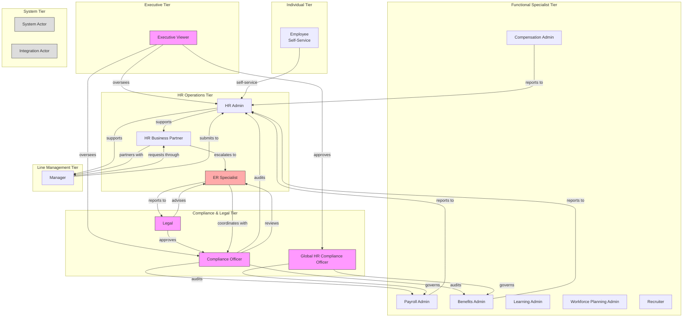
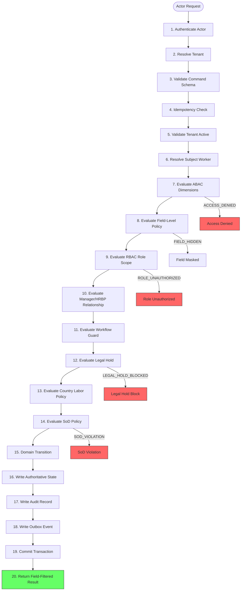
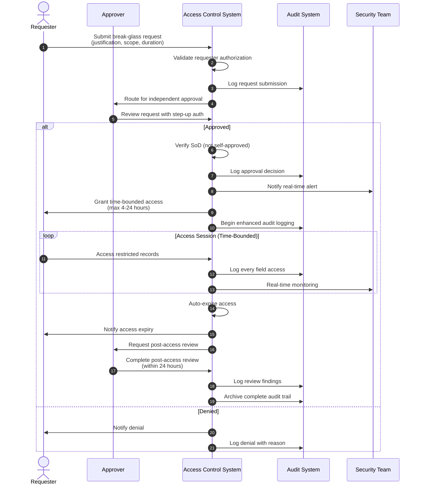
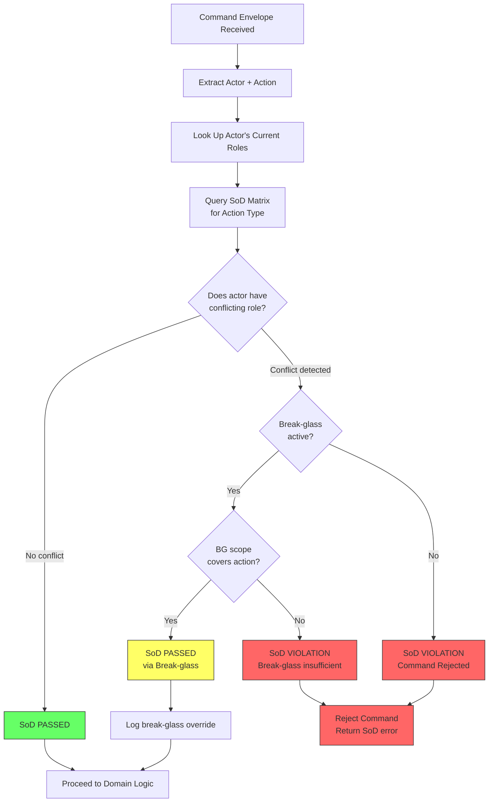
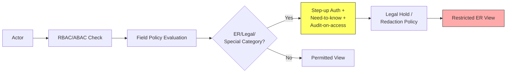
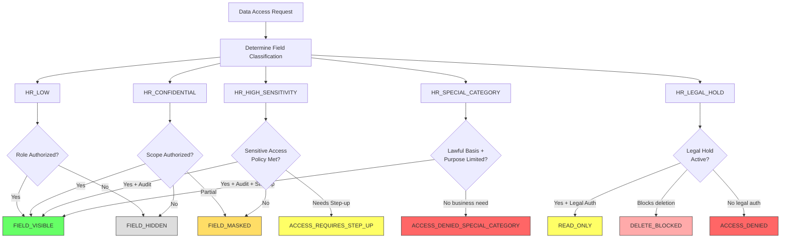

# Enterprise HR/HCM — Complete Rules, Roles Definition, and Accessibility Matrix

**Version:** 1.4 (Aligned with enterprise_hr_hcm_master_blueprint_v1_4_country_policy_approval_ready.md)
**Document Type:** IAM Architecture — RBAC / ABAC / PBAC / SoD / Field-Level Access
**Classification:** HR_CONFIDENTIAL — Internal Architecture

---

## Table of Contents

1. [RBAC Role Catalog](#1-rbac-role-catalog)
2. [ABAC Dimensions](#2-abac-dimensions)
3. [Complete SoD Matrix](#3-complete-sod-matrix)
4. [Field-Level Access Policy Matrix](#4-field-level-access-policy-matrix)
5. [Self-Service Command Allowlist](#5-self-service-command-allowlist)
6. [HR Data Classification Levels](#6-hr-data-classification-levels)
7. [Break-Glass and Emergency Access](#7-break-glass-and-emergency-access)
8. [Compliance Posture Mapping](#8-compliance-posture-mapping)
9. [Mermaid Diagrams](#9-mermaid-diagrams)

---

## 1. RBAC Role Catalog

### 1.1 Core HR Roles

#### HR Admin
| Attribute | Definition |
|---|---|
| **Scope** | Full HR operational scope within delegated legal entities and countries |
| **Primary Functions** | Worker lifecycle management, job assignment corrections, data stewardship, policy configuration |
| **Mutating Authority** | Can issue commands to HR Core, Organization Management, Position Control; owns worker profile mutations |
| **Access Boundaries** | Cannot self-approve own compensation changes; cannot approve own break-glass requests; cannot bypass SoD controls; cannot view ER cases without explicit case assignment; field policy still applies |
| **Data Classifications** | HR_LOW (full), HR_CONFIDENTIAL (full within scope), HR_HIGH_SENSITIVITY (masked by default, audit-on-access), HR_SPECIAL_CATEGORY (need-to-know only), HR_LEGAL_HOLD (read-only) |
| **SoD Constraints** | Cannot be: compensation approver for own recommendations; break-glass approver for own requests; country policy legal approver for own uploads |
| **System Surfaces** | HR Command Center, HR Admin UI, all consoles by delegation |

#### HR Business Partner (HRBP)
| Attribute | Definition |
|---|---|
| **Scope** | Assigned business units, departments, or employee populations; geographically scoped |
| **Primary Functions** | Employee relations triage, performance coaching, organizational change support, compensation recommendations, case escalation |
| **Mutating Authority** | Can submit ER cases, compensation recommendations, PIP requests, transfer/promotion requests, manager action requests; can propose job assignments |
| **Access Boundaries** | Cannot approve own compensation recommendations; cannot access ER cases outside assigned scope; cannot view cross-legal-entity compensation without authorization; team analytics must respect privacy thresholds |
| **Data Classifications** | HR_LOW (full), HR_CONFIDENTIAL (scoped to assigned BUs), HR_HIGH_SENSITIVITY (masked), HR_SPECIAL_CATEGORY (purpose-limited) |
| **SoD Constraints** | Cannot be: calibration approver for own performance ratings; disciplinary action approver for own requests; ER investigation owner when conflicted |
| **System Surfaces** | Manager Hub (extended), ER Console (by case assignment), HR Command Center (scoped) |

#### Recruiter
| Attribute | Definition |
|---|---|
| **Scope** | Assigned requisitions, candidates, and hiring pipelines |
| **Primary Functions** | Requisition management, candidate pipeline, interview scheduling, offer drafting, feedback collection |
| **Mutating Authority** | Can create/manage requisitions, candidates, applications, interview plans, offers (draft only); can advance/reject candidates |
| **Access Boundaries** | Cannot approve own offers; cannot make final offer decisions for high-risk roles without independent approval; cannot directly create active worker profiles; cannot mutate compensation bands; cannot be background check decision maker for own candidates |
| **Data Classifications** | HR_LOW (scoped), HR_CONFIDENTIAL (candidates scoped to own pipeline), HR_HIGH_SENSITIVITY (offer details — masked), HR_SPECIAL_CATEGORY (candidate source diversity data — restricted) |
| **SoD Constraints** | Cannot be: interviewer + final offer approver; hiring manager + background check decision maker; offer drafter + offer approver |
| **System Surfaces** | Recruiter Workspace, Candidate Portal (management view) |

#### Payroll Admin
| Attribute | Definition |
|---|---|
| **Scope** | Payroll cycles, payroll inputs, validations, exports, tax filings within assigned legal entities |
| **Primary Functions** | Payroll cycle management, exception handling, validation, approval staging, export, corrections, tax filings |
| **Mutating Authority** | Can open/close payroll cycles, stage payroll inputs, validate payroll, approve payroll (where SoD permits), export payroll, record tax filings |
| **Access Boundaries** | Cannot approve own high-risk payroll runs where SoD requires independence; cannot directly write HR Core worker data; cannot change job assignments or compensation bands; cannot approve payroll adjustments they staged |
| **Data Classifications** | HR_LOW (full within scope), HR_CONFIDENTIAL (full), HR_HIGH_SENSITIVITY (full — this role is authorized), HR_SPECIAL_CATEGORY (medical info only for absence/payroll correlation — purpose-limited) |
| **SoD Constraints** | Cannot be: payroll preparer + payroll approver (same cycle); payroll calculation preparer + payroll calculation final approver; tax jurisdiction reviewer + payroll finalizer |
| **System Surfaces** | Payroll Console, Time & Attendance Workspace (read) |

#### Benefits Admin
| Attribute | Definition |
|---|---|
| **Scope** | Benefits programs, enrollments, carrier reconciliations, life events, open enrollment periods |
| **Primary Functions** | Enrollment management, carrier sync, eligibility verification, life event processing, spending account management, continuation administration |
| **Mutating Authority** | Can open/close enrollments, approve benefit elections (where SoD permits), manage carrier reconciliations, process life events, approve dependent eligibility |
| **Access Boundaries** | Cannot approve own benefit exception requests; cannot directly mutate payroll cycles; cannot access medical details beyond policy requirements; cannot approve own dependent eligibility submissions |
| **Data Classifications** | HR_LOW (full), HR_CONFIDENTIAL (full), HR_HIGH_SENSITIVITY (benefits data — full), HR_SPECIAL_CATEGORY (dependent medical evidence — purpose-limited) |
| **SoD Constraints** | Cannot be: benefits enrollment requester + exception approver; carrier reconciliation preparer + reconciliation approver |
| **System Surfaces** | Benefits Console, HR Service Delivery (read) |

#### Manager
| Attribute | Definition |
|---|---|
| **Scope** | Direct reports, dotted-line reports (by delegation), team data, and organizational context |
| **Primary Functions** | Team oversight, approval routing, performance input, hiring recommendations, compensation recommendations, absence approvals, schedule management |
| **Mutating Authority** | Can approve absences, submit requisitions, submit compensation recommendations, record performance input, request transfers/promotions, approve shift swaps, submit disciplinary requests, approve simple timesheets |
| **Access Boundaries** | Cannot approve own requests; cannot view ER, medical, compensation, or payroll fields beyond policy; cannot view protected-attribute analytics for small teams; cannot access skip-level details without HRBP authorization; team analytics must respect privacy thresholds |
| **Data Classifications** | HR_LOW (team scope), HR_CONFIDENTIAL (team scope), HR_HIGH_SENSITIVITY (team compensation — masked, cannot approve), HR_SPECIAL_CATEGORY (access denied by default) |
| **SoD Constraints** | Cannot be: performance rater + calibration approver; disciplinary requester + disciplinary approver; termination requester + termination approver; ER investigation owner when subject |
| **System Surfaces** | Manager Hub, Employee Self-Service (own data), Performance Workspace (team) |

#### Employee (Self-Service)
| Attribute | Definition |
|---|---|
| **Scope** | Own worker profile only |
| **Primary Functions** | Profile management, absence requests, benefits enrollment (during windows), policy acknowledgment, payslip viewing, learning, goal management, HR case submission |
| **Mutating Authority** | Can update contact details, emergency contacts, consent preferences, submit absence requests, submit life event evidence, acknowledge policies; all sensitive changes require approval |
| **Access Boundaries** | Cannot approve own sensitive changes; cannot view other worker data; cannot access compensation details beyond own total comp statement; cannot modify payroll, job assignment, or ER data; cannot access manager-visible team data |
| **Data Classifications** | HR_LOW (own record — full), HR_CONFIDENTIAL (own record — partial), HR_HIGH_SENSITIVITY (own payslip/total comp — audit-on-access), HR_SPECIAL_CATEGORY (own medical/accommodation — limited, purpose-limited), HR_LEGAL_HOLD (own record — read-only) |
| **SoD Constraints** | N/A (no approval authority for own sensitive changes) |
| **System Surfaces** | Employee Self-Service Portal, Mobile App |

---

### 1.2 Specialist Roles

#### Employee Relations (ER) Specialist
| Attribute | Definition |
|---|---|
| **Scope** | ER cases, investigations, disciplinary actions, accommodations, grievances within assigned scope |
| **Primary Functions** | Case investigation, finding documentation, disciplinary recommendation, accommodation review, union grievance handling |
| **Mutating Authority** | Can open/close ER cases, start investigations, record findings, approve disciplinary action plans, manage accommodation cases, file/resolve union grievances |
| **Access Boundaries** | Cannot investigate cases where they are the subject or their manager is the subject; cannot access ER cases outside assigned scope; cannot approve own disciplinary recommendations without legal review where required |
| **Data Classifications** | HR_LOW (full), HR_CONFIDENTIAL (full), HR_HIGH_SENSITIVITY (full for ER-related data), HR_SPECIAL_CATEGORY (full — purpose-limited, audit-on-access), HR_LEGAL_HOLD (full — read-only) |
| **SoD Constraints** | Cannot be: ER case subject + investigation owner; disciplinary requester + final approver; ER investigation owner for own team's cases |
| **System Surfaces** | Employee Relations Console (restricted access) |

#### Compliance Officer
| Attribute | Definition |
|---|---|
| **Scope** | Legal holds, policy acknowledgements, statutory reporting, retention rules, DSAR handling, audit management |
| **Primary Functions** | Policy management, legal hold administration, compliance reporting, DSAR processing, retention enforcement, audit evidence collection |
| **Mutating Authority** | Can assign policy acknowledgements, place/remove legal holds, approve statutory reports, manage retention rules, process DSAR requests, approve DEI/pay gap reports |
| **Access Boundaries** | Cannot approve own compliance reports; cannot remove legal holds without documented justification; cannot bypass retention policies; cannot be country policy uploader + legal approver |
| **Data Classifications** | HR_LOW (full), HR_CONFIDENTIAL (full), HR_HIGH_SENSITIVITY (audit-on-access), HR_SPECIAL_CATEGORY (DSAR-related — purpose-limited), HR_LEGAL_HOLD (full control) |
| **SoD Constraints** | Cannot be: DEI/pay gap report preparer + publication approver; compliance report preparer + compliance report approver; country policy uploader + legal approver |
| **System Surfaces** | Compliance Console, HR Command Center |

#### Legal
| Attribute | Definition |
|---|---|
| **Scope** | Employment contracts, ER cases, legal holds, disciplinary actions, accommodations, union matters, country policy packs |
| **Primary Functions** | Contract review, legal advice, ER case legal oversight, disciplinary review, litigation hold management, policy legal approval |
| **Mutating Authority** | Can approve employment contracts, approve ER action plans, approve disciplinary actions, approve legal holds, approve country policy packs (legal sections), approve org/RIF scenarios |
| **Access Boundaries** | Cannot approve own legal recommendations; cannot be country policy uploader + legal approver for same pack; cannot access data beyond case/legal scope |
| **Data Classifications** | HR_LOW (full), HR_CONFIDENTIAL (full), HR_HIGH_SENSITIVITY (masked unless case-related), HR_SPECIAL_CATEGORY (case-related only — purpose-limited), HR_LEGAL_HOLD (full) |
| **SoD Constraints** | Cannot be: country policy uploader + legal approver; contract drafter + contract approver where independence required |
| **System Surfaces** | Employee Relations Console, Compliance Console |

#### Finance Reviewer
| Attribute | Definition |
|---|---|
| **Scope** | Payroll cost data, compensation plans, bonus cycles, headcount financials, budget reconciliation |
| **Primary Functions** | Payroll cost review, compensation plan financial impact, bonus pool oversight, workforce planning financial review, GL reconciliation |
| **Mutating Authority** | Can review payroll exports, approve compensation plans from financial perspective, approve bonus cycles, review workforce plan financials |
| **Access Boundaries** | Cannot approve payroll they prepared; cannot modify payroll cycles directly; cannot access individual salary details beyond financial summary level |
| **Data Classifications** | HR_LOW (full), HR_CONFIDENTIAL (departmental cost aggregates), HR_HIGH_SENSITIVITY (payroll totals — masked to aggregates where possible) |
| **SoD Constraints** | Cannot be: payroll preparer + payroll approver; bonus recommender + bonus approver |
| **System Surfaces** | Workforce Analytics (financial), Payroll Console (read-only) |

---

### 1.3 Executive and Cross-Functional Roles

#### Executive Viewer
| Attribute | Definition |
|---|---|
| **Scope** | Organization-wide analytics, dashboards, compliance posture, workforce health |
| **Primary Functions** | Strategic oversight, compliance review, workforce analytics, talent review, succession planning oversight |
| **Mutating Authority** | Can approve succession plans, approve workforce plans, approve org design scenarios, approve compensation plans (at executive level), approve DEI reports |
| **Access Boundaries** | Read-only access to individual worker records unless explicitly delegated; cannot directly mutate HR Core data; analytics must respect privacy thresholds and suppression rules |
| **Data Classifications** | HR_LOW (full), HR_CONFIDENTIAL (aggregates), HR_HIGH_SENSITIVITY (aggregates/masked), HR_SPECIAL_CATEGORY (aggregated DEI data only — suppressed below thresholds) |
| **SoD Constraints** | Cannot be: org design drafter + final approver; DEI report preparer + publication approver |
| **System Surfaces** | HR Command Center, Workforce Analytics, Talent Review Board |

#### Global HR Compliance Officer
| Attribute | Definition |
|---|---|
| **Scope** | Country rule sets, statutory reports, work authorization, I-9/E-Verify, country policy packs |
| **Primary Functions** | Country labor rule management, statutory report oversight, work authorization management, compliance localization, policy pack governance |
| **Mutating Authority** | Can approve country rule sets, approve statutory reports, manage work authorization cases, approve country policy packs, manage I-9/E-Verify cases |
| **Access Boundaries** | Cannot approve own country policy uploads; cannot bypass approval workflow for country policy publication; cannot be uploader + publisher |
| **Data Classifications** | HR_LOW (full), HR_CONFIDENTIAL (full), HR_HIGH_SENSITIVITY (work authorization — full), HR_SPECIAL_CATEGORY (immigration details — purpose-limited) |
| **SoD Constraints** | Cannot be: country policy uploader + final publisher; country policy uploader + legal approver; emergency rollback requester + rollback approver |
| **System Surfaces** | Compliance Console, HR Command Center |

#### Compensation Admin
| Attribute | Definition |
|---|---|
| **Scope** | Compensation bands, compensation plans, pay scales, bonus cycles, equity grants, total compensation statements |
| **Primary Functions** | Compensation band management, compensation planning, bonus cycle administration, equity grant oversight, market data management, pay equity analysis |
| **Mutating Authority** | Can create compensation bands, draft compensation plans, manage bonus cycles, stage equity grants, manage pay scales, generate total comp statements |
| **Access Boundaries** | Cannot approve own compensation recommendations; cannot self-approve outside-band compensation; cannot be grant drafter + grant approver |
| **Data Classifications** | HR_LOW (full), HR_CONFIDENTIAL (full), HR_HIGH_SENSITIVITY (full — this role is authorized), HR_SPECIAL_CATEGORY (demographic data for pay equity — purpose-limited) |
| **SoD Constraints** | Cannot be: compensation proposer + approver; bonus recommender + bonus calibration approver; equity grant drafter + equity grant approver; pay equity audit preparer + pay equity action plan approver |
| **System Surfaces** | Compensation Console, Workforce Analytics |

#### Learning Admin
| Attribute | Definition |
|---|---|
| **Scope** | Learning catalog, learning assignments, content packages, certifications, skills profiles |
| **Primary Functions** | Course management, content publishing, assignment administration, certification oversight, skill verification |
| **Mutating Authority** | Can create/publish/retire courses, assign learning, manage content packages, issue/renew certifications, manage skill evidence |
| **Access Boundaries** | Cannot directly update job assignments or performance ratings; cannot access learner special-category data; content publishing requires review workflow |
| **Data Classifications** | HR_LOW (full), HR_CONFIDENTIAL (full), HR_HIGH_SENSITIVITY (learning costs — masked), HR_SPECIAL_CATEGORY (EAP referrals — purpose-limited separation) |
| **SoD Constraints** | Cannot be: learning content uploader + content approver where policy requires independence |
| **System Surfaces** | Learning & Skills Hub, Learning Content Admin |

#### Workforce Planning Admin
| Attribute | Definition |
|---|---|
| **Scope** | Workforce scenarios, headcount planning, org design, skills gap analysis, budget reconciliation |
| **Primary Functions** | Workforce scenario modeling, demand/supply analysis, skills gap analysis, org design proposals, RIF scenario planning |
| **Mutating Authority** | Can create workforce scenarios, model demand/supply, generate skills gap analysis, draft org design scenarios, propose RIF scenarios |
| **Access Boundaries** | Cannot publish org design decisions without approval; cannot directly create headcount requests without approval workflow; cannot approve own scenarios |
| **Data Classifications** | HR_LOW (full), HR_CONFIDENTIAL (aggregates), HR_HIGH_SENSITIVITY (compensation impact — masked), HR_SPECIAL_CATEGORY (demographic analytics — suppressed) |
| **SoD Constraints** | Cannot be: org/RIF scenario drafter + final approver; workforce plan preparer + workforce plan approver |
| **System Surfaces** | Workforce Analytics, HR Command Center |

---

### 1.4 System and Integration Roles

#### System Actor
| Attribute | Definition |
|---|---|
| **Scope** | Internal automated processes, scheduled jobs, policy engines, FSM transitions |
| **Primary Functions** | Automated payroll calculations, entitlement calculations, timer-based state transitions, reconciliation jobs, policy evaluations |
| **Mutating Authority** | Can execute authorized system commands within defined boundaries; cannot bypass approval workflows; cannot break SoD rules |
| **Access Boundaries** | Cannot approve human decisions; cannot bypass legal holds; cannot override break-glass policy; cannot issue commands requiring human judgment |
| **Data Classifications** | HR_LOW (full), HR_CONFIDENTIAL (by engine scope), HR_HIGH_SENSITIVITY (engine-authorized only), HR_SPECIAL_CATEGORY (encrypted reference only) |
| **SoD Constraints** | System actors must respect SoD boundaries — calculation engines cannot also approve |
| **System Surfaces** | Internal API, Event Consumers, Process Managers |

#### Integration Actor
| Attribute | Definition |
|---|---|
| **Scope** | External systems: LMS, ATS, payroll providers, benefits carriers, background check, tax authorities, E-Verify |
| **Primary Functions** | Bidirectional data sync, webhook handling, batch imports, carrier reconciliation, government filing |
| **Mutating Authority** | Can submit commands through authorized command ports; cannot write HR tables directly; must use authoritative command handlers |
| **Access Boundaries** | Cannot bypass command authorization; cannot write to HR Core tables directly; cannot approve HR decisions; cannot access data beyond integration scope |
| **Data Classifications** | HR_LOW (integration scope), HR_CONFIDENTIAL (integration scope), HR_HIGH_SENSITIVITY (encrypted in transit), HR_SPECIAL_CATEGORY (never stored raw in integration logs) |
| **SoD Constraints** | Cannot be: data export requester + export approver; cannot approve payroll exports they initiated |
| **System Surfaces** | Integration API, Webhook Endpoints, BFF Routes |

---

## 2. ABAC Dimensions

### 2.1 Subject Worker Relationship Dimension

| Relationship | Definition | Access Implication |
|---|---|---|
| **isSelf** | Actor is the subject worker | Full access to own HR_LOW and HR_CONFIDENTIAL data; HR_HIGH_SENSITIVITY audit-on-access; HR_SPECIAL_CATEGORY limited to own data with purpose limitation; cannot approve own sensitive changes |
| **isManager** | Actor is the direct manager of the subject worker | Access to team HR_LOW and HR_CONFIDENTIAL; HR_HIGH_SENSITIVITY masked; HR_SPECIAL_CATEGORY denied; cannot approve own requests |
| **isSkipLevelManager** | Actor is a skip-level manager (manager's manager) | HR_LOW (read); HR_CONFIDENTIAL (aggregates only); HR_HIGH_SENSITIVITY (denied); HR_SPECIAL_CATEGORY (denied) |
| **isDottedLineManager** | Actor is a dotted-line/matrix manager | HR_LOW (read — delegated scope); HR_CONFIDENTIAL (limited by delegation); HR_HIGH_SENSITIVITY (denied); HR_SPECIAL_CATEGORY (denied) |
| **isHRBP** | Actor is HRBP for subject worker's business unit | HR_LOW (full within BU scope); HR_CONFIDENTIAL (full within BU scope); HR_HIGH_SENSITIVITY (masked); HR_SPECIAL_CATEGORY (purpose-limited) |
| **isPeer** | Actor is a peer/colleague | HR_LOW (directory only — by org policy); all other classifications denied |
| **isSubordinate** | Actor is a subordinate of the subject worker | HR_LOW (directory only); all other classifications denied |

### 2.2 Manager Chain Dimension

| Chain Level | Direct Reports | Skip-Level (L2) | Skip-Level (L3+) |
|---|---|---|---|
| **Worker Profile** | Read/Write (recommendations) | Read (aggregates) | No access |
| **Performance** | Full rating input | Calibration view (aggregated) | No access |
| **Compensation** | Recommend only | No individual data | No access |
| **Absence** | Approve | View (aggregated) | No access |
| **ER Cases** | Read (if relevant) | No access | No access |
| **Timesheet** | Approve | View (aggregated) | No access |

### 2.3 Legal Entity Scope Dimension

| Actor Type | Single Legal Entity | Multiple Legal Entities | All Legal Entities |
|---|---|---|---|
| **HR Admin** | Full (scoped) | By delegation | No (requires global role) |
| **HRBP** | Full (scoped) | By assignment | No |
| **Payroll Admin** | Full (scoped) | By delegation | No |
| **Benefits Admin** | Full (scoped) | By plan scope | No |
| **Manager** | Own entity | No | No |
| **Global HR Compliance** | Full | Full | Full |
| **Executive Viewer** | Aggregated | Aggregated | Aggregated |

### 2.4 Country/Jurisdiction Scope Dimension

| Actor Type | Home Country Only | Regional | Global |
|---|---|---|---|
| **HR Admin** | Full (home) | By delegation | No |
| **HRBP** | Full (home) | By assignment | No |
| **Payroll Admin** | Full (home) | By delegation | No |
| **Global HR Compliance** | Full | Full | Full |
| **Country Policy Editor** | Own countries | By assignment | No |
| **Country Policy Publisher** | Own countries | By assignment | No |

### 2.5 Department/Org Unit Scope Dimension

```text
ABAC Rule: A manager can access worker data within their org-unit subtree.
HRBP can access workers within assigned business units.
HR Admin can access all workers within legal entity scope.
Executive Viewer sees aggregates only.
Self-service actor sees own data only.
```

### 2.6 Case Ownership Dimension

| Case Type | Creator | Assignee | Subject's Manager | HRBP | ER Specialist | Legal | Compliance |
|---|---|---|---|---|---|---|---|
| **HR Service Case** | Read/Write | Full | Read (if team) | Read/Write | No access | No access | Read |
| **ER Case** | Read | Full | Denied | Read/Write (scoped) | Full | Read/Write | Read |
| **Disciplinary Action** | Read | Full | Denied | Read/Write (scoped) | Full | Read/Write | Read |
| **Accommodation Case** | Read | Full | Denied | Read/Write | Read/Write | Read/Write | Read |
| **Investigation** | Read | Full | Denied | Read (scoped) | Full | Read/Write | Read |

> **Critical Rule**: ER case subject (worker) or their manager **CANNOT** be the investigation owner or case assignee. This is enforced by both ABAC and SoD policies.

### 2.7 Recruiting Team Assignment Dimension

| Recruiting Object | Recruiter (Assigned) | Hiring Manager | HRBP | Recruiting Admin |
|---|---|---|---|---|
| **Requisition** | Full (if assigned) | Read/Request | Read | Full (all) |
| **Candidate** | Full (if on requisition) | Read/Interview | Read | Full (all) |
| **Interview Plan** | Full | Read/Schedule | Read | Full |
| **Offer** | Draft only | Recommend only | Read | Full |
| **Application** | Full | Read/Feedback | Read | Full |

---

## 3. Complete SoD Matrix

### 3.1 Core HR SoD Matrix (V1.0)

| # | Incompatible Role Combination | Rule | Enforcement Point | Risk Category |
|---|---|---|---|---|
| 1 | **Compensation proposer + Compensation approver** | Same actor cannot approve own compensation change recommendation | CompensationChange FSM — step 12-14 | Financial / Fraud |
| 2 | **Payroll preparer + Payroll approver** | Payroll approval must be independent where policy requires | PayrollCycle FSM — ApprovePayroll guard | Financial / Fraud |
| 3 | **Candidate interviewer + Final offer approver** | Independent approval required for offer decisions; interviewer bias prevention | Offer FSM — ApproveOffer guard | Bias / Fairness |
| 4 | **Hiring manager + Background check decision maker** | Separation where policy requires; prevents conflicted hiring decisions | CandidateApplication FSM — ScreenApplication guard | Compliance / Bias |
| 5 | **ER case subject/manager + Investigation owner** | Conflicted actors cannot own investigation | EmployeeRelationsCase FSM — StartInvestigation guard | Conflict of Interest |
| 6 | **Disciplinary action requester + Disciplinary approver** | Independent HR/legal review required | DisciplinaryAction FSM — ReviewDisciplinaryAction guard | Abuse of Power |
| 7 | **Performance rating owner + Calibration approver** | Calibration review must be independent where policy requires | PerformanceReviewCycle FSM — StartCalibration guard | Bias / Fairness |
| 8 | **Benefits enrollment requester + Exception approver** | Exception approval must be independent | BenefitsEnrollment FSM — ApproveBenefitsEnrollment guard | Abuse of Power |
| 9 | **HR data export requester + Export approver** | Sensitive exports require independent approval | ReportDefinition FSM — ExportReport guard | Data Breach |
| 10 | **Break-glass requester + Break-glass approver** | Cannot self-approve emergency access | Break-glass policy engine — step-up auth | Emergency / Audit |

### 3.2 V1.1 SoD Expansion

| # | Incompatible Role Combination | Rule | Enforcement Point | Risk Category |
|---|---|---|---|---|
| 11 | **Bonus recommender + Bonus calibration approver** | Same actor cannot submit and approve/calibrate own bonus recommendation | BonusCycle FSM — CalibrateBonusAwards guard | Financial / Fairness |
| 12 | **Equity grant drafter + Equity grant approver** | Grant approval must be independent where policy requires | EquityGrant FSM — ApproveEquityGrant guard | Financial / Governance |
| 13 | **Offboarding plan requester + Final settlement approver** | Settlement approval must be independent | FinalSettlement FSM — ApproveFinalSettlement guard | Financial |
| 14 | **Requisition requester + Requisition approver** | Same manager cannot approve own headcount request | HeadcountRequest FSM — ApproveHeadcount guard | Budget Control |
| 15 | **Succession plan drafter + Succession approver** | Succession nomination must be independently reviewed | SuccessionPlan FSM — ApproveSuccessionPlan guard | Governance |
| 16 | **Payroll export requester + Payroll export approver** | Payroll export requires independent approval for sensitive data | PayrollCycle FSM — ExportPayroll guard | Data Breach |
| 17 | **Policy acknowledgement assigner + Waiver approver** | Policy waiver requires independent approval | PolicyAcknowledgement FSM — WaivePolicyAcknowledgement guard | Compliance |

### 3.3 V1.2 SoD Expansion

| # | Incompatible Role Combination | Rule | Enforcement Point | Risk Category |
|---|---|---|---|---|
| 18 | **Payroll calculation preparer + Payroll calculation final approver** | Same actor cannot finalize own high-risk payroll run | PayrollCalculationRun FSM — FinalizePayrollCalculation guard | Financial / Fraud |
| 19 | **Tax jurisdiction manual reviewer + Payroll finalizer** | Reviewer cannot also be sole payroll finalizer for same worker/pay period | TaxJurisdictionAssignment FSM — FinalizeTaxJurisdictionAssignment guard | Financial / Compliance |
| 20 | **Report builder + Sensitive report approver** | Sensitive report approval must be independent | ReportDefinition FSM — PublishReportDefinition guard | Data Breach |
| 21 | **DEI/pay gap report preparer + Publication approver** | Publication approver must be independent and privacy-trained | DeiReport FSM / PayGapReport FSM — ApproveDeiReport guard | Privacy / Compliance |
| 22 | **Contingent assignment requester + Misclassification approver** | Legal/compliance review must be independent | MisclassificationRiskAssessment FSM — RecordMisclassificationDecision guard | Legal / Compliance |
| 23 | **I-9 document reviewer + Final eligibility exception approver** | Exception approval must be independent | I9Case FSM — RecordI9DocumentReview guard | Immigration / Legal |
| 24 | **Org/RIF scenario drafter + Final approval** | RIF or restructuring approval must be independent and legal-reviewed | OrgDesignScenario FSM — PublishOrgDesignDecision guard | Legal / Governance |
| 25 | **HR AI use case requester + HR AI approver** | High-risk HR AI use case approval must be independent | HrAiUseCase FSM — ApproveHrAiUseCase guard | AI Governance |
| 26 | **EAP referral creator + EAP analytics viewer** | Individual referral access and aggregate analytics access must be separated where policy requires | Wellbeing/EAP FSM — AnonymizeEapUsage guard | Privacy / Medical |

### 3.4 V1.4 Country Policy SoD Expansion

| # | Incompatible Role Combination | Rule | Enforcement Point | Risk Category |
|---|---|---|---|---|
| 27 | **Country policy uploader + Final publisher** | Same actor cannot upload and publish without independent approval | CountryPolicyPack FSM — PublishCountryPolicyPack guard | Governance / Compliance |
| 28 | **Country policy uploader + Legal approver** | Same actor cannot approve legal sections they uploaded | CountryPolicyPack FSM — ApproveCountryPolicyPack guard | Conflict of Interest |
| 29 | **Payroll tax policy author + Payroll tax approver** | Same actor cannot approve own payroll/tax policy section | CountryPolicyPack FSM — RecordCountryPolicyApproval guard | Compliance |
| 30 | **Emergency rollback requester + Rollback approver** | Emergency rollback requires independent approval unless break-glass policy applies | CountryPolicyPack FSM — RollBackCountryPolicyPack guard | Emergency / Audit |
| 31 | **Country policy simulation owner + Final impact approver** | High-impact retroactive changes require independent impact approval | CountryPolicyPack FSM — ApproveCountryPolicyPack guard | Governance |

### 3.5 Cross-Domain SoD Matrix Summary

```
                    Proposer   Preparer   Interviewer  Subject    Requester   Builder   Uploader
                    +Approver  +Approver  +Decider     +Invest    +Approver   +Approver  +Approver
                    --------   --------   ---------    -------    ---------   ---------  --------
Compensation          X
Payroll                 X
Recruiting                         X          X
ER Cases                                        X
Disciplinary                                            X
Performance                                                          X
Benefits                                                                        X
Data Export                                                                     X
Break-glass                                                                     X
Bonus                 X
Equity                X
Payroll Calc            X
Tax Jurisdiction               X
DEI Reports                                                                     X
Contingent                                                                              X
I-9/E-Verify                                                                              X
Org Design/RIF                                                                            X
HR AI                                                                                       X
Country Policy                                                                                    X
```

---

## 4. Field-Level Access Policy Matrix

### 4.1 Access Decision Matrix by Classification

| Data Classification | Default Visibility | Masking | Audit | Step-Up Auth | Purpose Limitation | Legal Hold |
|---|---|---|---|---|---|---|
| **HR_LOW** | Role-filtered, directory visibility | No | No | No | No | Read-only |
| **HR_CONFIDENTIAL** | Manager/HR scoped | Partial (last N digits) | On mutation | For bulk access | No | Read-only |
| **HR_HIGH_SENSITIVITY** | Restricted, need-to-know | Yes (masked by default) | On access + mutation | Yes | Recommended | Read-only + block anonymization |
| **HR_SPECIAL_CATEGORY** | Strict access, minimal | Yes (full redaction) | On access + mutation | Yes | Required | Read-only + block all deletion |
| **HR_LEGAL_HOLD** | Read-only for authorized | Yes (full redaction) | On access + mutation | Yes | Required | Immutable |
| **HR_PUBLIC_CANDIDATE** | Public after compliance review | No | On mutation | No | No | N/A |

### 4.2 Field-Level Policy by Data Type

| Field Category | Classification | Masking Rule | Visible To | Audit | Notes |
|---|---|---|---|---|---|
| **Display name, work email** | HR_LOW | None | Role-filtered directory | No | Standard directory visibility |
| **Work phone, job title** | HR_LOW | None | Role-filtered directory | No | Org chart visible |
| **Department, location, org unit** | HR_CONFIDENTIAL | None | Manager chain + HR | On mutation | Manager scope applies |
| **Manager relationship** | HR_CONFIDENTIAL | None | Manager chain + HR | On mutation | Skip-level limited |
| **Employment status, FTE** | HR_CONFIDENTIAL | None | Manager + HR + Finance | On mutation | Workforce planning accessible |
| **Hire date, tenure** | HR_CONFIDENTIAL | None | Manager + HR | No | Org-wide aggregates allowed |
| **Salary/base pay** | HR_HIGH_SENSITIVITY | Masked (show range only) | HR Admin + Payroll + Comp + own employee | Audit-on-access | Manager sees band only |
| **Bonus/variable comp** | HR_HIGH_SENSITIVITY | Masked (show range only) | HR Admin + Payroll + Comp + own employee | Audit-on-access | Calibration view aggregated |
| **Equity grants** | HR_HIGH_SENSITIVITY | Masked | HR Admin + Comp + own employee | Audit-on-access | Vesting schedule own view |
| **Total compensation** | HR_HIGH_SENSITIVITY | Masked in reports | HR Admin + Comp + own employee + Finance (aggregated) | Audit-on-access | Statement generation audited |
| **National ID (SSN, etc.)** | HR_HIGH_SENSITIVITY | Masked (last 4 only) | HR Admin + Payroll (limited) | Audit-on-access | Encryption at rest required |
| **Bank reference/account** | HR_HIGH_SENSITIVITY | Masked (last 4 only) | Payroll Admin only | Audit-on-access | Never expose full account |
| **Payslip data** | HR_HIGH_SENSITIVITY | Masked | Payroll + own employee | Audit-on-access | Self-service view audited |
| **Medical info/disability** | HR_SPECIAL_CATEGORY | Redacted | Medical reviewer + ER (case-only) | Audit-on-access | Purpose limitation enforced |
| **Accommodation details** | HR_SPECIAL_CATEGORY | Redacted | Accommodation case owner + Legal | Audit-on-access | Interactive process only |
| **Protected class/demographics** | HR_SPECIAL_CATEGORY | Aggregated only | DEI analyst + Compliance (suppressed) | Audit-on-access | Manager never sees individual |
| **ER investigation notes** | HR_SPECIAL_CATEGORY | Redacted | ER Specialist + Legal (case-only) | Audit-on-access | Need-to-know enforced |
| **Disciplinary records** | HR_SPECIAL_CATEGORY | Redacted | ER Specialist + Legal + HR (limited) | Audit-on-access | Manager access by policy only |
| **Union membership** | HR_SPECIAL_CATEGORY | Redacted | Labor Relations + Legal | Audit-on-access | Jurisdiction-specific lawful basis |
| **Performance rating** | HR_HIGH_SENSITIVITY | Masked in aggregates | Manager chain + HR + Calibration | Audit-on-access | Peer comparison anonymized |
| **360 feedback content** | HR_SPECIAL_CATEGORY | Anonymized | HR + Calibration facilitator | Audit-on-access | Never reveal individual feedback source |
| **Background check results** | HR_HIGH_SENSITIVITY | Redacted | HR Admin + Recruiting (limited) | Audit-on-access | Hiring manager limited view |
| **Immigration/work authorization** | HR_HIGH_SENSITIVITY | Partially masked | Global HR Compliance + HR Admin | Audit-on-access | I-9 section access controlled |
| **Consent preferences** | HR_CONFIDENTIAL | None | Self + HR Admin | On mutation | GDPR/CCPA compliance |
| **Work authorization docs** | HR_HIGH_SENSITIVITY | Redacted | Global HR Compliance + Legal | Audit-on-access | Expiration tracked |
| **Candidate source diversity** | HR_SPECIAL_CATEGORY | Anonymized | Recruiting (aggregated) | Audit-on-access | Fairness monitoring only |
| **EAP/wellbeing referral** | HR_SPECIAL_CATEGORY | Fully anonymized | Wellbeing Program Manager (aggregate) | Audit-on-access | Individual referral — clinical access only |

### 4.3 Field Access Decision Flow

```text
INPUTS:
  - actor role
  - actor relationship to subject worker
  - employee data field category
  - special-category data flag
  - employee relations case restriction
  - legal hold
  - country/region
  - purpose of access
  - break-glass state

OUTPUTS:
  FIELD_VISIBLE — No restrictions
  FIELD_MASKED — Partially visible (e.g., range, last-4 digits)
  FIELD_HIDDEN — Not visible but field existence known
  ACCESS_REQUIRES_STEP_UP — MFA or additional authentication required
  ACCESS_REQUIRES_BREAK_GLASS — Emergency access workflow required
  ACCESS_DENIED_SPECIAL_CATEGORY — Special category — access denied
  ACCESS_DENIED_NO_BUSINESS_NEED — No legitimate business purpose
```

---

## 5. Self-Service Command Allowlist

### 5.1 Employee Self-Service

| Category | Action | Allowed Without Approval | Requires Approval | Forbidden |
|---|---|---|---|---|
| **Profile** | Update contact details (phone, address) | Yes | — | — |
| **Profile** | Update emergency contact | Yes | — | — |
| **Profile** | Update consent preferences | Yes | — | — |
| **Profile** | Update legal name | — | Yes (HR Admin) | — |
| **Profile** | Update national ID | — | Yes (HR Admin) | — |
| **Profile** | Update bank reference | — | Yes (Payroll Admin) | — |
| **Profile** | Update work location | — | Yes (HR Admin + Manager) | — |
| **Time** | Submit absence request | Yes | Manager approval | — |
| **Time** | Cancel own absence | Yes (before approval) | — | — |
| **Time** | View timesheet | Yes | — | — |
| **Time** | Submit timesheet | Yes | Manager approval | — |
| **Payroll** | View payslip | Yes | — | — |
| **Payroll** | View total compensation statement | Yes | — | — |
| **Benefits** | Enroll during open enrollment | Yes | — | — |
| **Benefits** | Enroll outside window | — | Yes (Benefits Admin) | — |
| **Benefits** | Submit life event evidence | Yes | Benefits Admin validation | — |
| **Benefits** | Change benefit election | — | Yes (Benefits Admin) | — |
| **Benefits** | Waive coverage | Yes (during OE) | — | — |
| **Learning** | Start assigned learning | Yes | — | — |
| **Learning** | Browse catalog | Yes | — | — |
| **Performance** | Submit self-review | Yes | — | — |
| **Performance** | Acknowledge review | Yes | — | — |
| **Performance** | Create/update own goals | Yes | — | — |
| **Compliance** | Acknowledge policy | Yes | — | — |
| **HR Cases** | Open HR service case | Yes | — | — |
| **HR Cases** | View own case status | Yes | — | — |
| **Accommodation** | Request accommodation | — | Yes (interactive process) | — |
| **Grievance** | Submit grievance | — | Yes (ER review) | — |
| **ER** | View ER case details | — | — | **Forbidden** |
| **Compensation** | View own salary details | — | — | **Forbidden** (statement only) |
| **Manager** | View team data | — | — | **Forbidden** |
| **Admin** | Any admin action | — | — | **Forbidden** |

### 5.2 Manager Self-Service

| Category | Action | Allowed Without Approval | Requires Approval | Forbidden |
|---|---|---|---|---|
| **Team** | View direct reports | Yes | — | — |
| **Team** | View dotted-line reports | By delegation | — | — |
| **Absence** | Approve simple absence | Yes | — | — |
| **Absence** | Reject absence | Yes | — | — |
| **Timesheet** | Approve team timesheet | Yes | — | — |
| **Hiring** | Submit requisition request | Yes | HR/Finance approval | — |
| **Hiring** | Interview feedback | Yes | — | — |
| **Hiring** | Candidate advancement recommendation | Yes | Recruiting approval | — |
| **Compensation** | Submit compensation recommendation | Yes | Comp/HR approval | — |
| **Compensation** | Approve compensation change | — | — | **Forbidden** |
| **Performance** | Record performance input | Yes | — | — |
| **Performance** | Submit rating | Yes | Calibration approval | — |
| **Transfer** | Request transfer/promotion | Yes | HRBP approval | — |
| **Schedule** | Approve shift swap | Yes | — | — |
| **Schedule** | Approve overtime | Yes | — | — |
| **Learning** | Assign learning to team | Yes | — | — |
| **Termination** | Initiate termination | — | Yes (HR + Legal) | — |
| **Disciplinary** | Request disciplinary action | — | Yes (ER + Legal) | — |
| **PIP** | Request PIP | Yes | ER/HR approval | — |
| **PIP** | Close PIP | — | Yes (ER + HR) | — |
| **ER** | View ER case details | — | — | **Forbidden** (unless case-relevant) |
| **ER** | Investigate ER case | — | — | **Forbidden** |
| **Compensation** | View team salaries | — | — | **Forbidden** (bands only) |
| **Admin** | Any admin action | — | — | **Forbidden** |

### 5.3 HRBP Capabilities and Boundaries

| Capability | Scope | Approval Required | Boundary |
|---|---|---|---|
| View worker profile | Assigned BUs | No | Cannot view cross-BU without authorization |
| View compensation | Assigned BUs | No | Masked by default; cannot approve changes |
| Submit ER case | Assigned BUs | No | Cannot investigate own subject cases |
| View ER case | Assigned BUs (by assignment) | No | Cannot view unassigned cases |
| Submit compensation recommendation | Assigned BUs | Yes (Comp Admin) | Cannot self-approve |
| Submit transfer/promotion request | Assigned BUs | Yes (HR Admin) | Cannot directly mutate job assignment |
| View team analytics | Assigned BUs | No | Aggregated only; privacy thresholds apply |
| Submit disciplinary request | Assigned BUs | Yes (ER + Legal) | Cannot approve own requests |
| Approve absence | Assigned BUs (delegated) | No | Manager's authority, not HRBP's own |
| Access special-category data | Assigned BUs | Step-up required | Purpose-limited; audit-on-access |

---

## 6. HR Data Classification Levels

### 6.1 Classification Level Definitions

| Level | Label | Description | Encryption at Rest | Encryption in Transit | Retention |
|---|---|---|---|---|---|
| **HR_LOW** | Public/Internal | Directory-visible data; minimal risk if disclosed | Recommended | Required | Standard |
| **HR_CONFIDENTIAL** | Business Confidential | Internal business data; moderate risk if disclosed | Recommended | Required | Standard |
| **HR_HIGH_SENSITIVITY** | Restricted | Sensitive personal/financial data; high risk if disclosed | **Required** | Required | Extended + audit |
| **HR_SPECIAL_CATEGORY** | Special Category | Protected characteristics; legal regulation applies | **Required** + secure reference | Required | Strict + lawful basis |
| **HR_LEGAL_HOLD** | Litigation Hold | Under investigation or legal hold; immutable | **Required** | Required | Indefinite (until hold released) |
| **HR_PUBLIC_CANDIDATE** | Public | Public-facing after compliance review | None | Required | Standard |

### 6.2 Classification Examples and Minimum Behavior

| Classification | Specific Examples | Minimum Behavior |
|---|---|---|
| **HR_LOW** | Worker display name, work email, work phone, job title, office location | Role-filtered, directory visibility policy. No masking required. Standard authentication. |
| **HR_CONFIDENTIAL** | Job assignment, manager name, department, org unit, employment status, FTE, hire date | Manager/HR scoped. Partial masking for sensitive sub-fields. Audit on mutation. |
| **HR_HIGH_SENSITIVITY** | Compensation (salary, bonus, equity), payroll data, benefits elections, national IDs, bank references, performance ratings, background check results, immigration status, work authorization | Restricted access, masked by default, **audit-on-access** mandatory, step-up authentication for bulk access, encryption at rest required. |
| **HR_SPECIAL_CATEGORY** | Medical information, disability status, accommodation details, protected class (race, gender, age), ER investigation notes, disciplinary records, union membership, EAP referrals, 360 feedback content, demographic data for DEI | Strict access with purpose limitation, encrypted or stored by secure reference, raw values excluded from events/logs/telemetry/projections unless explicitly approved, **lawful basis documentation required**, manager cannot view individual protected attributes. |
| **HR_LEGAL_HOLD** | Any record under litigation hold, investigation evidence, disputed employment records, DSAR-related records | **Deletion and anonymization blocked**. Immutable until legal hold released. Full audit trail preserved. Access requires legal authorization. |
| **HR_PUBLIC_CANDIDATE** | Public job postings, career site content, published employer brand material | Public allowed after compliance review. No sensitive internal data. Standard content governance. |

### 6.3 Cross-Cutting Data Classification Rules

```text
1. All compensation, equity, payroll, benefits, immigration, medical/accommodation, disciplinary, ER, 
   union, and demographic fields are HR_HIGH_SENSITIVITY or HR_SPECIAL_CATEGORY by default.

2. Self-service payloads must be schema-validated and cannot store raw secrets.

3. Demographic data used for DEI/pay transparency reporting must be logically separated from 
   manager-visible worker profiles.

4. Payslip, total compensation, equity, ER, accommodation, immigration, union, and demographic 
   access must write audit-on-access records.

5. Special-category fields are encrypted or stored by secure reference; raw values are excluded 
   from events, logs, telemetry, and projections unless explicitly approved.

6. Demographic analytics must use aggregation and suppression thresholds before display or export.

7. Managers cannot view protected-attribute analytics for small teams (suppression threshold applies).

8. DEI and pay transparency reports require legal/compliance review and versioned formulas.

9. Union membership and health/accommodation fields are restricted by default and may require 
   jurisdiction-specific lawful basis documentation.
```

---

## 7. Break-Glass and Emergency Access

### 7.1 Break-Glass Access Policy

**Purpose**: Enable authorized emergency access to restricted HR data when normal access controls would prevent a critical business or safety need.

**Applicable Scenarios**:
- Crisis/emergency escalation governed by safety policy
- Legal hold requiring immediate access to restricted records
- Emergency payroll correction to meet statutory deadline
- Critical ER investigation requiring cross-scope access
- Emergency country policy rollback

### 7.2 Break-Glass Request Flow

```text
1. REQUEST
   - Authorized requester (HR Admin, ER Specialist, Compliance Officer, Legal) submits 
     break-glass request with:
     * Business justification
     * Specific records/data needed
     * Time window required
     * Emergency category
     * Risk assessment

2. INDEPENDENT APPROVAL (SoD Enforced)
   - Break-glass requester CANNOT approve own request
   - Approver must have equal or higher authorization level
   - Approval requires step-up authentication (MFA + secondary approval)
   - Legal review for HR_SPECIAL_CATEGORY access

3. TEMPORARY ACCESS GRANT
   - Time-bounded (default: 4 hours, max: 24 hours)
   - Scoped to specific records/fields
   - Full audit logging enabled
   - Real-time notification to compliance/security

4. ACCESS MONITORING
   - All actions logged with heightened granularity
   - Screen recording may be activated (per policy)
   - Access pattern anomaly detection active
   - Security team receives real-time alerts

5. AUTO-EXPIRY
   - Access automatically expires at time limit
   - No renewal without new request
   - Session termination forced

6. POST-ACCESS REVIEW
   - Mandatory review within 24 hours of expiry
   - Reviewer documents: records accessed, actions taken, justification validated
   - Compliance Officer validates appropriateness
   - Security team reviews for anomalies
   - Findings recorded in permanent audit trail
```

### 7.3 Break-Glass Approval Requirements by Data Classification

| Data Classification | Requester Role | Approver Role(s) | Max Duration | Legal Review |
|---|---|---|---|---|
| HR_LOW | Any HR role | HR Admin | 4 hours | No |
| HR_CONFIDENTIAL | HR Admin, HRBP | HR Admin + Manager | 4 hours | No |
| HR_HIGH_SENSITIVITY | HR Admin, Payroll Admin, Comp Admin | HR Admin + Compliance Officer | 4 hours | Recommended |
| HR_SPECIAL_CATEGORY | ER Specialist, Legal, Compliance Officer | Legal + Compliance Officer | 4 hours | **Required** |
| HR_LEGAL_HOLD | Legal, Compliance Officer | Legal + Executive | 8 hours | **Required** |

### 7.4 Audit and Compliance Implications

```text
Every break-glass access creates:
1. Break-glass request record with full justification chain
2. Independent approval record with approver identity, timestamp, decision
3. Real-time access audit log (every field viewed, every action taken)
4. Post-access review record with reviewer findings
5. Compliance validation record
6. Permanent retention in audit trail (never deleted, never anonymized)

Break-glass records are:
- Excluded from normal data retention policies
- Available to external auditors (SOC 2, ISO 27001, GDPR)
- Reviewed quarterly by Compliance Officer
- Reported to executive leadership
- Tracked as a risk metric (break-glass frequency, appropriateness rate)
```

### 7.5 Emergency Country Policy Rollback

```text
Emergency rollback is allowed only through a dedicated rollback command with:
- Legal/Global HR approval OR
- Active break-glass policy invocation

Same actor cannot upload and provide final legal/payroll/global-HR approval 
for the same policy pack unless explicit break-glass governance applies.

Post-rollback:
1. All approvals documented
2. Impact assessment required
3. Simulation re-run before re-publication
4. Full audit trail preserved
```

---

## 8. Compliance Posture Mapping

### 8.1 Framework-to-Role Mapping

| Compliance Framework | Control Area | Relevant Roles | Implementation |
|---|---|---|---|
| **SOC 2 Type II** | Access Control (CC6.1) | All roles | RBAC/ABAC enforcement, SoD validation |
| **SOC 2 Type II** | System Operations (CC7.2) | System Actor, Integration Actor | Authorized command pattern, idempotency |
| **SOC 2 Type II** | Change Management (CC8.1) | HR Admin, Compliance Officer | FSM-driven changes, approval workflows |
| **SOC 2 Type II** | Risk Assessment (CC3.x) | Compliance Officer, Executive Viewer | Break-glass policy, risk-based step-up |
| **ISO 27001** | A.9.1 Access Control | All roles | Role-based access, least privilege |
| **ISO 27001** | A.9.2 User Access Management | HR Admin, IAM | Worker lifecycle, access provisioning |
| **ISO 27001** | A.9.4 System Access Control | System Actor | Command authorization, service accounts |
| **ISO 27001** | A.12.1 Operational Procedures | All roles | FSM enforcement, idempotency, audit |
| **ISO 27001** | A.12.4 Logging | System Actor, All roles | Comprehensive audit trail |
| **ISO 27001** | A.16.1 Incident Management | ER Specialist, Compliance Officer | ER case workflow, investigation |
| **GDPR/UK GDPR** | Art. 5 Lawfulness | Compliance Officer, Legal | Purpose limitation, lawful basis |
| **GDPR/UK GDPR** | Art. 6 Lawful Processing | Compliance Officer | Processing justification |
| **GDPR/UK GDPR** | Art. 9 Special Categories | Compliance Officer, ER Specialist | Special category controls, encryption |
| **GDPR/UK GDPR** | Art. 15 Right of Access | Employee, Compliance Officer | DSAR workflow, self-service access |
| **GDPR/UK GDPR** | Art. 17 Right to Erasure | Compliance Officer, Legal | Deletion workflow, legal hold blocking |
| **GDPR/UK GDPR** | Art. 25 Privacy by Design | All | Field-level policy, data minimization |
| **CCPA** | Right to Know | Employee, Compliance Officer | Self-service, DSAR workflow |
| **CCPA** | Right to Delete | Employee, Compliance Officer | Deletion workflow, legal hold blocking |
| **Labor Law** | Statutory Reporting | Global HR Compliance, Payroll Admin | Statutory reports, country packs |
| **Labor Law** | Work Authorization | Global HR Compliance, HR Admin | I-9/E-Verify, immigration cases |
| **Labor Law** | Equal Opportunity | Compliance Officer, DEI Analyst | DEI reports, recruiting fairness |
| **Labor Law** | Works Council | Labor Relations Specialist | Consultation workflows |

### 8.2 Role-to-Control Mapping Matrix

| Role | SOC 2 | ISO 27001 | GDPR | Labor Law |
|---|---|---|---|---|
| HR Admin | CC6.1, CC7.2 | A.9.1, A.9.2 | Art. 25 | Statutory access |
| HRBP | CC6.1 | A.9.1 | Art. 5, 6 | Works council consultation |
| Recruiter | CC6.1 | A.9.1 | Art. 9 (diversity) | Equal opportunity evidence |
| Payroll Admin | CC6.1, CC7.2 | A.9.1, A.12.4 | Art. 9 (financial) | Tax/labor reporting |
| Benefits Admin | CC6.1 | A.9.1 | Art. 9 (health) | Benefits compliance |
| Manager | CC6.1 | A.9.1 | Art. 5 (purpose limit) | Labor law compliance |
| Employee | — | — | Art. 15, 17 | Self-service rights |
| ER Specialist | CC6.1, CC8.1 | A.16.1 | Art. 9 (investigation) | Disciplinary process |
| Compliance Officer | CC3.x, CC8.1 | A.16.1 | Art. 5, 9, 25 | All compliance |
| Legal | CC8.1 | A.16.1 | Art. 17 (legal hold) | Litigation hold |
| Finance Reviewer | CC6.1 | A.9.1 | Art. 9 (aggregated) | Financial reporting |
| Global HR Compliance | CC7.2 | A.12.1 | Art. 25 | Country law packs |
| Compensation Admin | CC6.1 | A.9.1 | Art. 9 (pay equity) | Pay transparency |
| Learning Admin | CC6.1 | A.9.1 | Art. 9 (skills) | Training compliance |
| Workforce Planning | CC6.1 | A.9.1 | Art. 25 (minimization) | RIF/works council |

### 8.3 Audit Evidence Requirements by Compliance Framework

| Framework | Audit Evidence | Retention | Responsible Role |
|---|---|---|---|
| **SOC 2** | Access logs, SoD validation records, break-glass records, approval chains | 1 year minimum | Compliance Officer |
| **ISO 27001** | Access control reviews, incident records, change management records | 3 years minimum | Compliance Officer |
| **GDPR** | DSAR processing records, consent records, special category access logs, deletion records | Duration of employment + applicable limitation period | Compliance Officer, Legal |
| **Labor Law** | Statutory reports, works council consultations, country policy packs, payroll records | Per jurisdiction (typically 3-7 years) | Global HR Compliance, Payroll Admin |

---

## 9. Mermaid Diagrams

### 9.1 Role Hierarchy Diagram



### 9.2 Access Control Decision Flow



### 9.3 Break-Glass Access Flow



### 9.4 SoD Validation Flow



### 9.5 ER Restricted Access Model



### 9.6 Field Policy Decision Diagram



---

## Appendix A: Role-to-Permission Quick Reference

| Permission / Action | HR Admin | HRBP | Recruiter | Payroll Admin | Benefits Admin | Manager | Employee | ER | Comp | Legal |
|---|---|---|---|---|---|---|---|---|---|---|
| Create Worker Profile | X | — | — | — | — | — | — | — | — | — |
| Terminate Worker | X | — | — | — | — | — | — | — | — | — |
| Update Personal Data | X | — | — | — | — | — | own | — | — | — |
| Approve Comp Change | — | — | — | — | — | — | — | — | X | — |
| Propose Comp Change | — | X | — | — | — | X | — | — | X | — |
| Run Payroll Cycle | — | — | — | X | — | — | — | — | — | — |
| Approve Payroll | — | — | — | X* | — | — | — | — | — | — |
| Manage Benefits Enroll | — | — | — | — | X | — | own | — | — | — |
| Open ER Case | X | X | — | — | — | — | — | X | — | — |
| Own Investigation | — | — | — | — | — | — | — | X | — | X |
| Create Requisition | — | — | X | — | — | X | — | — | — | — |
| Approve Offer | — | — | — | — | — | — | — | — | X | X |
| Draft Offer | — | — | X | — | — | — | — | — | — | — |
| Manage Learning | — | — | — | — | — | — | — | — | — | — |
| Approve Policy Pack | — | — | — | — | — | — | — | — | — | X |
| Approve Org Design | X | — | — | — | — | — | — | — | — | X |
| Data Export | X | — | — | X | — | — | — | — | — | — |
| Break-glass Request | X | X | — | X | — | — | — | X | — | X |

*Subject to SoD — cannot approve own prepared payroll.

---

## Appendix B: Authority Doctrine Summary

```text
- HR Core owns the worker/employment record.
- IAM owns login identity and access credentials.
- Organization Management owns org units, departments, positions, and reporting structure.
- Position Control owns approved headcount and position state.
- Recruiting owns requisitions, candidates, interviews, assessments, and offers until hire acceptance.
- HR Core owns conversion from accepted offer to worker profile.
- Payroll owns payroll-cycle state, payroll inputs, payroll validations, and payroll export staging.
- Finance/ERP owns general ledger and final accounting truth where declared.
- Benefits owns eligibility, enrollment, life events, dependents, and coverage state.
- Time and Attendance owns timesheets, attendance facts, time-clock events, and exceptions.
- Absence/Leave owns absence requests, accruals, leave cases, and return-to-work workflow.
- Performance owns reviews, goals, feedback, calibration, and performance plans.
- Learning owns learning assignments, courses, completion, and skill evidence unless an external LMS is declared as completion master.
- Employee Relations owns HR cases, investigations, grievances, and disciplinary records.
- Compliance owns policy acknowledgements, legal holds, retention, labor-law evidence, and statutory HR reporting.
- Employee self-service and manager self-service are portals. They submit commands; they do not own HR truth.
```

---

*Document generated from enterprise_hr_hcm_master_blueprint_v1_4_country_policy_approval_ready.md*
*Classification: HR_CONFIDENTIAL — Internal Architecture*
