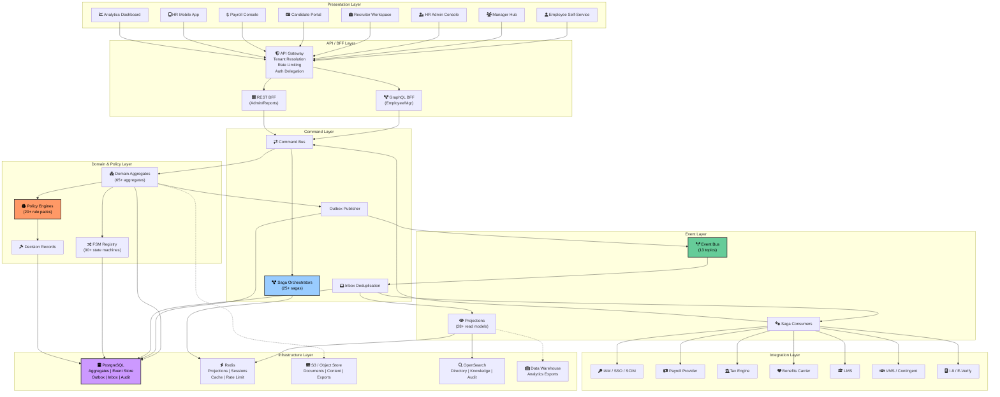
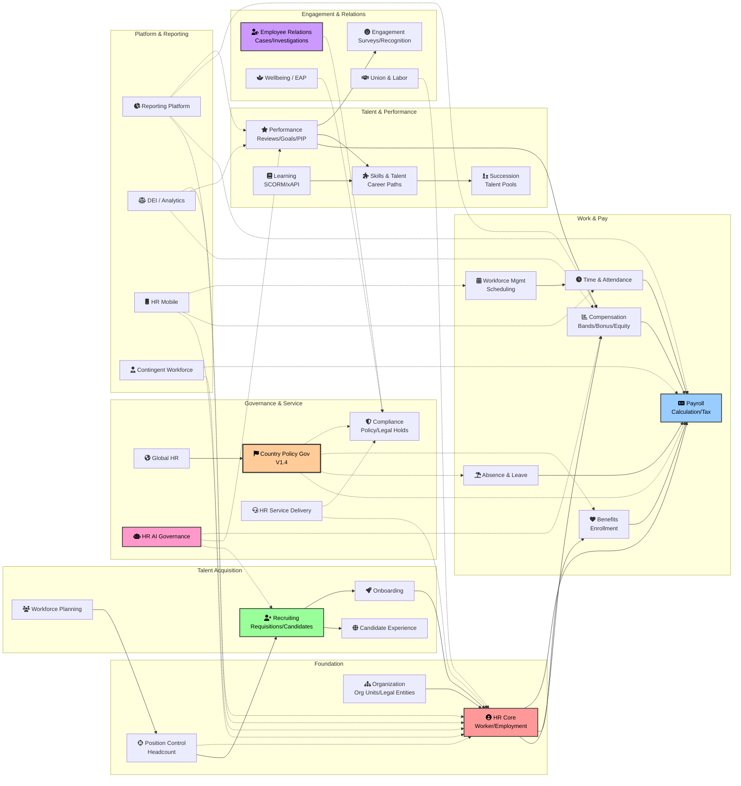
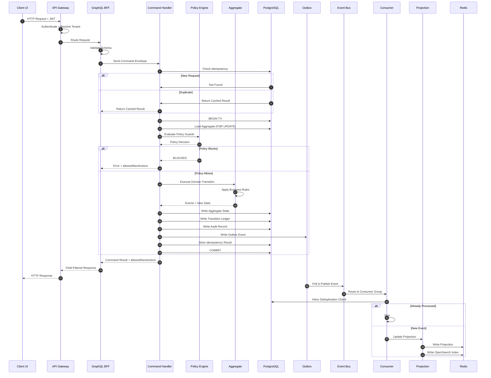
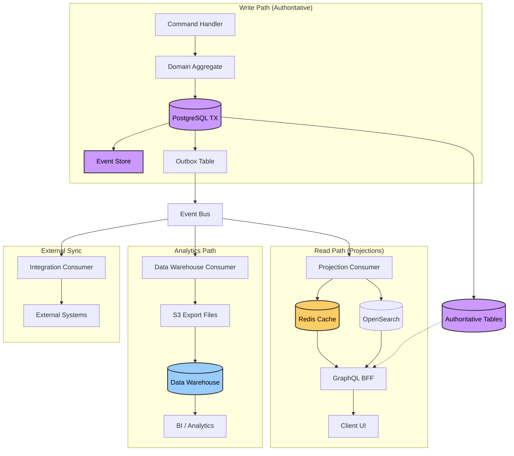
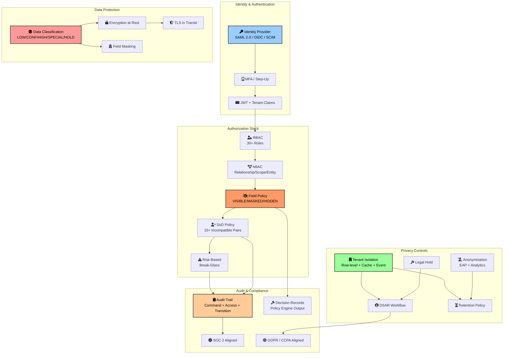
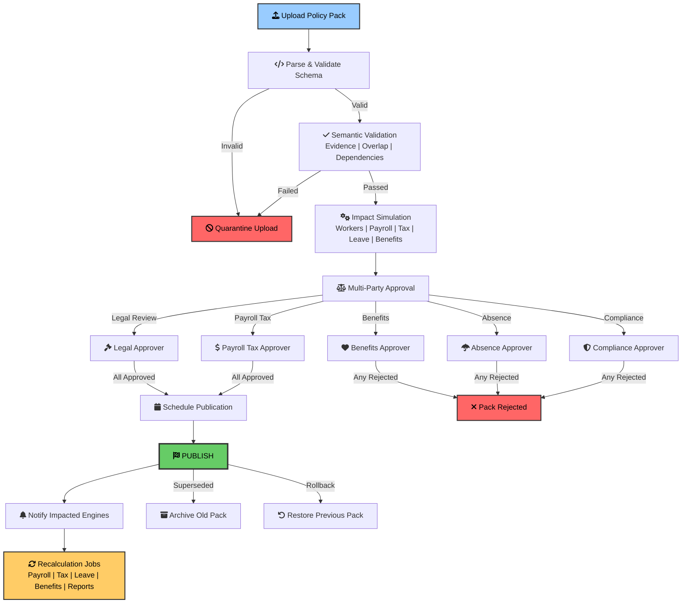

# Enterprise HR/HCM SaaS Platform — Full System Architecture Reference

**Version:** 1.4  
**Date:** 2026-05-23  
**Status:** Definitive architecture reference for engineering  
**Source Blueprint:** `enterprise_hr_hcm_master_blueprint_v1_4_country_policy_approval_ready.md`

---

## Table of Contents

1. [Architectural Doctrine](#1-architectural-doctrine)
2. [Layered Architecture View](#2-layered-architecture-view)
3. [Bounded Context Map](#3-bounded-context-map)
4. [Data Architecture View](#4-data-architecture-view)
5. [Event-Driven Architecture View](#5-event-driven-architecture-view)
6. [External Integration View](#6-external-integration-view)
7. [Security & Privacy Architecture](#7-security--privacy-architecture)
8. [Request Lifecycle Flow](#8-request-lifecycle-flow)
9. [Mermaid Diagrams](#9-mermaid-diagrams)

---

## 1. Architectural Doctrine

The Enterprise HR/HCM platform follows a strict **authority-first, event-driven, command-based architectural doctrine** derived from the master blueprint. These principles are non-negotiable and govern all implementation decisions.

### 1.1 Core Principles

| # | Principle | Implication |
|---|-----------|-------------|
| 1 | **Canonical Authority Matrix** | Every HR business concept has exactly one authoritative owner. Other modules may observe, request, recommend, project, report, or integrate. They may **not** mutate another domain's truth. |
| 2 | **Canonical Workflow/FSM Registry** | Every state machine is canonical. Synonyms may appear only in migration mappings, never in new code. |
| 3 | **Canonical Command Registry** | All meaningful state changes go through authoritative command handlers. No direct database mutations. |
| 4 | **Canonical Event Nervous System** | Events are the single source of cross-domain communication. Events carry identity and correlation but never raw sensitive payloads. |
| 5 | **Business Brain** | Policy engines and decision records produce explainable, versioned decisions. UI may never infer policy outcomes as authority. |
| 6 | **Strict Tenant Isolation** | Every table, query, event, and projection is tenant-scoped. Cross-tenant data leakage is architecturally impossible. |
| 7 | **Field-Level HR Privacy** | HR data classification (LOW, CONFIDENTIAL, HIGH_SENSITIVITY, SPECIAL_CATEGORY, LEGAL_HOLD) governs every field access. |
| 8 | **Audit Discipline** | Every meaningful action produces an immutable audit record with pre-state, post-state, actor, policy decision, and idempotency key. |
| 9 | **Outbox/Inbox Pattern** | All cross-domain events flow through the outbox pattern. All event consumers use inbox deduplication. |
| 10 | **Idempotency by Design** | Every command and saga step is deterministically idempotent. |
| 11 | **Projection Discipline** | Projections are disposable read models. They may not call authoritative commands. |
| 12 | **AI Advisory Only** | HR AI, if used, remains advisory and governed. It never owns HR truth. Human oversight is mandatory for high-risk classifications. |

### 1.2 Authority Doctrine Summary

```text
HR Core          owns Worker/Employment record, Job Assignment, Contract, Personal Data
IAM              owns Login Identity and Credentials (external to HR)
Organization     owns Org Units, Legal Entities, Manager Relationships
Position Control owns Approved Headcount and Position State
Recruiting       owns Requisitions, Candidates, Interviews, Offers until hire
Onboarding       owns Onboarding/Preboarding lifecycle
Compensation     owns Comp Plans, Bands, Bonus, Equity, Variable Pay
Benefits         owns Eligibility, Enrollment, Life Events, Dependents
Payroll          owns Payroll Cycle, Inputs, Validation, Export
Time/Attendance  owns Timesheets, Clock Events, Exceptions
Absence/Leave    owns Absence Requests, Accruals, Leave Cases, Return-to-Work
Performance      owns Reviews, Goals, Calibration, PIPs
Learning         owns Assignments, Courses, Completions, Certifications
Skills/Talent    owns Skill Profiles, Evidence, Talent Pools, Career Paths
Succession       owns Succession Plans, Successor Readiness
Engagement       owns Surveys, Recognition, 360 Feedback
Employee Relations owns HR Cases, Investigations, Grievances, Disciplinary
Compliance       owns Policy Acknowledgements, Legal Holds, Retention, Statutory Reports
Service Delivery owns HR Knowledge, Service Catalog, HR Case SLA/Routing
Workforce Mgmt   owns Shift Schedules, Open Shifts, Bids, Swaps, Overtime
Global HR        owns Country Rule Sets, Statutory Leave, Work Authorization
Contingent Wkfrc owns Contractor Assignments, SOWs, Rate Cards, VMS Sync
HR Mobile        owns Device Registration, Offline Packages, Mobile Sync
Wellbeing/EAP    owns EAP Referrals, Wellness Programs, Anonymous Usage
Union/Labor      owns CBA Lifecycle, Works Council, Grievances, Labor Actions
Reporting        owns Report Definitions, Executions, Schedules, Warehouse Export
Country Policy   owns Upload, Validation, Simulation, Approval, Publication, Rollback
HR AI Governance owns AI Use Case Registry, Bias Testing, Kill Switches
```

---

## 2. Layered Architecture View

The platform is organized into **9 architectural layers**, each with well-defined responsibilities and boundaries.

```
┌─────────────────────────────────────────────────────────────────────────────────┐
│                              PRESENTATION LAYER                                  │
│  ┌─────────────┐ ┌─────────────┐ ┌─────────────┐ ┌─────────────┐ ┌──────────┐  │
│  │Employee     │ │Manager Hub  │ │HR Admin     │ │Candidate    │ │HR Mobile │  │
│  │Self-Service │ │             │ │Command Center│ │Portal       │ │App       │  │
│  └─────────────┘ └─────────────┘ └─────────────┘ └─────────────┘ └──────────┘  │
│  ┌─────────────┐ ┌─────────────┐ ┌─────────────┐ ┌─────────────┐ ┌──────────┐  │
│  │Recruiter    │ │Payroll      │ │Benefits     │ │Time & Attnd │ │Learning  │  │
│  │Workspace    │ │Console      │ │Console      │ │Workspace    │ │& Skills  │  │
│  └─────────────┘ └─────────────┘ └─────────────┘ └─────────────┘ └──────────┘  │
│  ┌─────────────┐ ┌─────────────┐ ┌─────────────┐ ┌───────────────────────────┐  │
│  │ER Console   │ │Compliance   │ │Analytics    │ │Org Design / Workforce     │  │
│  │             │ │Console      │ │Dashboard    │ │Planning Studio            │  │
│  └─────────────┘ └─────────────┘ └─────────────┘ └───────────────────────────┘  │
├─────────────────────────────────────────────────────────────────────────────────┤
│                            API / BFF LAYER                                       │
│  ┌─────────────────┐  ┌─────────────────┐  ┌─────────────────────────────────┐   │
│  │ GraphQL BFF      │  │ REST BFF        │  │ API Gateway                      │   │
│  │ (Employee/Mgr)   │  │ (Admin/Reports) │  │ • Rate limiting                  │   │
│  │                  │  │                 │  │ • Tenant resolution              │   │
│  │                  │  │                 │  │ • Auth delegation                │   │
│  │                  │  │                 │  │ • Field policy pre-filter        │   │
│  └─────────────────┘  └─────────────────┘  └─────────────────────────────────┘   │
├─────────────────────────────────────────────────────────────────────────────────┤
│                           COMMAND LAYER                                          │
│  ┌─────────────────────────────────────────────────────────────────────────────┐ │
│  │                       Command Bus / Router                                   │ │
│  ├──────────┬──────────┬──────────┬──────────┬──────────┬──────────────────────┤ │
│  │Command   │Saga      │Process   │Outbox    │Inbox     │Idempotency           │ │
│  │Handlers  │Orchestra-│Managers  │Publisher │Consumer  │Registry              │ │
│  │(25+ BCs) │tors      │(V1.4)    │          │(Dedup)   │                      │ │
│  └──────────┴──────────┴──────────┴──────────┴──────────┴──────────────────────┘ │
├─────────────────────────────────────────────────────────────────────────────────┤
│                            DOMAIN LAYER                                          │
│  ┌──────────┬──────────┬──────────┬──────────┬──────────┬──────────────────────┐ │
│  │Aggregate │Entity    │Value     │Domain    │Domain    │Workflow/FSM          │ │
│  │Root (65+)│(Business)│Object    │Event     │Service   │Registry (90+)        │ │
│  │          │          │          │(200+)    │          │                      │ │
│  │• Worker  │• Employee│• Money   │• Worker  │• Comp    │• WorkerProfile       │ │
│  │• Position│• Candidate│• Address│  Activated│  Validator│• Position            │ │
│  │• Payroll │• Timesheet│• Period │• Offer   │• Payroll │• PayrollCycle        │ │
│  │  Cycle   │• ER Case  │• Status │  Accepted │  Auditor │• PerformanceReview   │ │
│  │• ER Case │• Succession│• Range │• Leave   │• ER      │• CountryPolicyPack   │ │
│  │          │  Plan     │• Band   │  Approved │  Triage   │• BonusCycle          │ │
│  └──────────┴──────────┴──────────┴──────────┴──────────┴──────────────────────┘ │
├─────────────────────────────────────────────────────────────────────────────────┤
│                         POLICY ENGINE LAYER                                      │
│  ┌──────────┬──────────┬──────────┬──────────┬──────────┬──────────────────────┐ │
│  │Employment│Position  │Recruiting│Offer/Comp│Time/     │Payroll               │ │
│  │Eligibility│Headcount │Fairness  │ensation  │Absence   │Validation            │ │
│  │          │Policy    │Policy    │Policy    │Policy    │                      │ │
│  ├──────────┼──────────┼──────────┼──────────┼──────────┼──────────────────────┤ │
│  │Performance│Talent   │ER/      │HR Privacy│Global    │Country               │ │
│  │Calibration│Succession│Disciplinary│Visibility│Labor Law│Policy                │ │
│  │Policy    │Policy    │Policy    │Policy    │Policy    │Engine (V1.4)         │ │
│  ├──────────┼──────────┼──────────┼──────────┼──────────┼──────────────────────┤ │
│  │Benefits  │Self-Svc  │Workforce│Pay Equity│DEI       │HR AI                 │ │
│  │Policy    │Authority │Scheduling│Audit     │Analytics │Governance            │ │
│  │          │Policy    │Policy    │Policy    │Threshold │Policy                │ │
│  ├──────────┴──────────┴──────────┴──────────┴──────────┴──────────────────────┤ │
│  │                     Decision Record Store                                    │ │
│  │  • Explainable, versioned, auditable policy decisions per tenant/worker      │ │
│  └──────────────────────────────────────────────────────────────────────────────┘ │
├─────────────────────────────────────────────────────────────────────────────────┤
│                            EVENT LAYER                                           │
│  ┌─────────────────────────────────────────────────────────────────────────────┐ │
│  │                     Event Bus (Message Queue)                                │ │
│  ├─────────────────────────────────────────────────────────────────────────────┤ │
│  │  hr.core.v1  │hr.recruiting.v1│hr.compensation.v1│hr.time.v1  │hr.absence.v1│ │
│  │  hr.payroll.v│hr.benefits.v1  │hr.learning.v1    │hr.global.v1│hr.contingent│ │
│  │  hr.analytics│hr.mobile.v1    │hr.wellbeing.v1   │                           │ │
│  ├─────────────────────────────────────────────────────────────────────────────┤ │
│  │  Projections (28+)  │  Saga Consumers (25+)  │  Integration Consumers     │ │
│  │  • Worker Directory │  • OfferToHire         │  • IAM Provisioning        │ │
│  │  • Org Chart        │  • WorkerTermination   │  • Payroll Export          │ │
│  │  • Recruiting Pipe  │  • BenefitsLifeEvent   │  • Benefits Carrier        │ │
│  │  • Payroll Ready    │  • OpenEnrollment      │  • LMS Sync                │ │
│  │  • Compliance Dash  │  • GlobalHireCompliance│  • VMS Sync                │ │
│  └─────────────────────────────────────────────────────────────────────────────┘ │
├─────────────────────────────────────────────────────────────────────────────────┤
│                        INFRASTRUCTURE LAYER                                      │
│  ┌──────────────┐ ┌──────────────┐ ┌──────────────┐ ┌──────────────────────┐   │
│  │ PostgreSQL   │ │ Redis        │ │ S3/Object    │ │ OpenSearch           │   │
│  │              │ │              │ │ Store        │ │                      │   │
│  │ • Aggregates │ │ • Projections│ │ • Documents  │ │ • Worker Directory   │   │
│  │ • Event Store│ │ • Caches     │ │ • Content    │ │ • Knowledge Articles │   │
│  │ • Outbox     │ │ • Sessions   │ │   Packages   │ │ • Report Index       │   │
│  │ • Inbox      │ │ • Rate Limit │ │ • Exports    │ │ • Audit Search       │   │
│  └──────────────┘ └──────────────┘ └──────────────┘ └──────────────────────┘   │
│  ┌──────────────┐ ┌──────────────┐ ┌──────────────────────────────────────────┐ │
│  │ Message      │ │ Data         │ │ Background Job                           │ │
│  │ Queue        │ │ Warehouse    │ │ Processors                               │ │
│  │ (Event Bus)  │ │ (Analytics)  │ │ • Recalc jobs, Retro calc, Report sched │ │
│  └──────────────┘ └──────────────┘ └──────────────────────────────────────────┘ │
├─────────────────────────────────────────────────────────────────────────────────┤
│                       INTEGRATION LAYER                                          │
│  ┌──────────┬──────────┬──────────┬──────────┬──────────┬──────────────────────┐ │
│  │IAM/SSO   │Payroll   │Benefits  │Job Board │Background│Assessment            │ │
│  │SCIM      │Provider  │Carrier   │/Career   │Check     │Provider              │ │
│  │          │          │          │Site      │Provider  │                      │ │
│  ├──────────┼──────────┼──────────┼──────────┼──────────┼──────────────────────┤ │
│  │Calendar/ │E-Sign    │LMS       │Finance   │Time Clock│Tax Engine/           │ │
│  │Email     │Provider  │          │/ERP      │/Access   │Authority             │ │
│  ├──────────┼──────────┼──────────┼──────────┼──────────┼──────────────────────┤ │
│  │Banking/  │Collabor- │VMS/      │I-9/E-    │Data      │Labor Law             │ │
│  │Payment   │ation     │Contingent│Verify    │Warehouse │Content               │ │
│  │          │Tools     │Vendor    │          │          │Provider              │ │
│  ├──────────┴──────────┴──────────┴──────────┴──────────┴──────────────────────┤ │
│  │  Webhook Handlers  │  Polling Adapters  │  API Clients  │  File/SFTP        │ │
│  │  Outbox Consumers  │  Tenant-scoped     │  Circuit      │  Batch Import     │ │
│  └──────────────────────────────────────────────────────────────────────────────┘ │
└─────────────────────────────────────────────────────────────────────────────────┘
```

---

## 3. Bounded Context Map

The platform comprises **28 bounded contexts**, each with clear ownership, aggregates, commands, events, and relationship topology.

### 3.1 Context Registry

#### Context 1: HR Core
| Attribute | Detail |
|-----------|--------|
| **Responsibility** | Worker identity, employment lifecycle, employment status, personal data, job assignments, contracts |
| **Aggregates** | `hr_workers`, `hr_employment_relationships`, `hr_job_assignments`, `hr_employment_contracts`, `hr_personal_data_records` |
| **Commands** | CreateWorkerProfile, ActivateWorker, UpdateWorkerPersonalData, SuspendWorker, TerminateWorker, ArchiveWorker, StartEmployment, ChangeEmploymentType, PlaceWorkerOnLeave, EndEmployment, ProposeJobAssignment, ApproveJobAssignment, ActivateJobAssignment, EndJobAssignment, DraftEmploymentContract, RecordContractSigned, AmendEmploymentContract |
| **Events Published** | WorkerProfileCreated, WorkerActivated, WorkerPersonalDataUpdated, WorkerSuspended, WorkerTerminated, WorkerConvertedToAlumni, WorkerArchived, EmploymentStarted, EmploymentTypeChanged, JobAssignmentActivated, EmploymentContractSigned, EmploymentContractAmended |
| **Relationships** | Downstream to: Organization (reads org units), Position Control (reads positions), Payroll (provides worker snapshots), Benefits (eligibility signals), IAM (provisioning requests). Upstream from: Recruiting (hire conversion), Onboarding (readiness signal) |

#### Context 2: Organization Management
| Attribute | Detail |
|-----------|--------|
| **Responsibility** | Org units, legal entities, departments, reporting structure, manager relationships |
| **Aggregates** | `org_legal_entities`, `org_units`, `org_manager_relationships` |
| **Commands** | CreateLegalEntity, UpdateLegalEntity, ArchiveLegalEntity, CreateOrgUnit, ReorganizeOrgUnit, MergeOrgUnit, ArchiveOrgUnit |
| **Events Published** | LegalEntityCreated, LegalEntityUpdated, LegalEntityArchived, OrgUnitCreated, OrgUnitReorganized, OrgUnitMerged, OrgUnitArchived |
| **Relationships** | Upstream to: HR Core (job assignment references), Position Control (org scope), Payroll (cost centers), Reporting (org hierarchy). Partnership with Finance for cost center truth |

#### Context 3: Position Control
| Attribute | Detail |
|-----------|--------|
| **Responsibility** | Approved positions, headcount governance, position lifecycle, headcount requests |
| **Aggregates** | `org_positions`, `headcount_requests` |
| **Commands** | CreatePosition, ApprovePosition, OpenPosition, FreezePosition, FillPosition, ClosePosition, ArchivePosition, RequestHeadcount, ReviewHeadcount, ApproveHeadcount, RejectHeadcount, FulfillHeadcount |
| **Events Published** | PositionCreated, PositionApproved, PositionOpened, PositionFrozen, PositionFilled, PositionClosed, HeadcountRequested, HeadcountApproved, HeadcountRejected, HeadcountFulfilled |
| **Relationships** | Upstream to: Recruiting (approved demand). Downstream from: Workforce Planning (scenario output), Organization (org validity) |

#### Context 4: Recruiting
| Attribute | Detail |
|-----------|--------|
| **Responsibility** | Job requisitions, candidates, applications, interviews, assessments, offers |
| **Aggregates** | `job_requisitions`, `candidates`, `candidate_applications`, `interview_plans`, `interview_events`, `offers`, `offer_approvals` |
| **Commands** | CreateJobRequisition, PostRequisition, CloseRequisition, CreateCandidate, SubmitApplication, ScreenApplication, ScheduleInterview, DraftOffer, SendOffer, AcceptOffer |
| **Events Published** | JobRequisitionCreated, CandidateCreated, CandidateApplicationSubmitted, OfferSent, OfferAccepted, CandidateHired |
| **Relationships** | Downstream to: HR Core (hire conversion), Onboarding (trigger). Upstream from: Position Control (approved requisitions), Compensation (offer review). External to: Job boards, Assessment providers, Background check providers |

#### Context 5: Onboarding
| Attribute | Detail |
|-----------|--------|
| **Responsibility** | Preboarding, task management, readiness, Day-1 orchestration |
| **Aggregates** | `onboarding_plans`, `onboarding_tasks` |
| **Commands** | CreateOnboardingPlan, StartPreboarding, CompleteOnboardingTask, BlockOnboarding, CompleteOnboarding, CancelOnboarding |
| **Events Published** | OnboardingPlanCreated, PreboardingStarted, OnboardingTaskCompleted, OnboardingBlocked, OnboardingCompleted |
| **Relationships** | Downstream to: HR Core (activation trigger), IAM (provisioning request), ITSM (equipment requests). Triggered by: Recruiting (accepted offer) |

#### Context 6: Compensation
| Attribute | Detail |
|-----------|--------|
| **Responsibility** | Compensation plans, salary bands, bonus cycles, equity grants, variable pay, total comp statements, pay scales, step progression |
| **Aggregates** | `compensation_plans`, `compensation_bands`, `salary_market_data`, `compensation_changes`, `bonus_cycles`, `bonus_recommendations`, `equity_grants`, `equity_vesting_events`, `variable_comp_plans`, `pay_scales`, `step_progression_batches`, `total_compensation_statements` |
| **Commands** | DraftCompensationPlan, ApproveCompensationPlan, CreateBonusCycle, StageBonusPayout, DraftEquityGrant, IssueEquityGrant, RecordVestingEvent, PublishPayScale, GenerateStepProgressionBatch, GenerateTotalCompStatement |
| **Events Published** | CompensationPlanActivated, BonusPayoutStaged, EquityGrantIssued, EquityVestingRecorded, StepProgressionStagedForPayroll, TotalCompStatementPublished |
| **Relationships** | Downstream to: Payroll (staged pay changes). Upstream from: Performance (calibration outcomes). External to: Market survey providers |

#### Context 7: Benefits
| Attribute | Detail |
|-----------|--------|
| **Responsibility** | Plan definitions, eligibility, enrollment, life events, dependents, carrier reconciliation, spending accounts |
| **Aggregates** | `benefits_programs`, `benefits_enrollments`, `benefits_life_events`, `benefits_open_enrollments`, `dependent_eligibility_verifications`, `spending_accounts`, `carrier_reconciliation_runs` |
| **Commands** | OpenBenefitsEnrollment, SubmitBenefitsEnrollment, ChangeBenefitsEnrollment, RequestDependentVerification, StartCarrierReconciliation |
| **Events Published** | BenefitsEnrollmentOpened, BenefitsEnrollmentSubmitted, BenefitsCoverageActivated, BenefitsLifeEventRecorded, DependentEligibilityApproved, CarrierMismatchRecorded |
| **Relationships** | Downstream to: Payroll (deduction inputs). External to: Benefits carriers, Spending account administrators |

#### Context 8: Payroll
| Attribute | Detail |
|-----------|--------|
| **Responsibility** | Payroll cycles, inputs, validation, calculation, export, tax jurisdiction, year-end forms |
| **Aggregates** | `payroll_cycles`, `payroll_inputs`, `payroll_validation_results`, `payroll_export_batches`, `payroll_calculation_runs`, `payroll_result_lines`, `payroll_rule_sets`, `worker_tax_profiles`, `year_end_forms` |
| **Commands** | OpenPayrollCycle, CollectPayrollInputs, ValidatePayroll, LockPayroll, ExportPayroll, StagePayrollInput, CreatePayrollCalculationRun, FinalizePayrollCalculation, EvaluateTaxJurisdiction |
| **Events Published** | PayrollCycleOpened, PayrollValidated, PayrollLocked, PayrollExported, PayrollCalculationFinalized, PayrollResultLineCalculated, TaxJurisdictionAssignmentFinalized |
| **Relationships** | Upstream from: Time (timesheet exports), Benefits (deductions), Compensation (staged changes), Absence (leave inputs). External to: Payroll providers, Tax engines, Banking |

#### Context 9: Time & Attendance
| Attribute | Detail |
|-----------|--------|
| **Responsibility** | Timesheets, time clock events, attendance exceptions, work schedules |
| **Aggregates** | `work_schedules`, `time_clock_events`, `timesheets`, `timesheet_entries`, `attendance_exceptions` |
| **Commands** | OpenTimesheet, SubmitTimesheet, ApproveTimesheet, DetectAttendanceException, ApproveAttendanceAdjustment |
| **Events Published** | TimesheetOpened, TimesheetSubmitted, TimesheetApproved, TimesheetExportedToPayroll, AttendanceExceptionDetected, AttendanceAdjustmentApproved |
| **Relationships** | Downstream to: Payroll (time inputs). External to: Time clocks, Access control systems |

#### Context 10: Absence & Leave
| Attribute | Detail |
|-----------|--------|
| **Responsibility** | Absence requests, accrual balances, leave cases, entitlement calculations, return-to-work |
| **Aggregates** | `absence_requests`, `leave_cases`, `absence_accrual_balances`, `leave_entitlement_calculations`, `leave_balance_projections`, `leave_liability_records` |
| **Commands** | RequestAbsence, ApproveAbsence, OpenLeaveCase, StartLeave, ExtendLeave, ReturnFromLeave, CalculateLeaveEntitlement, ProjectLeaveBalance |
| **Events Published** | AbsenceRequested, AbsenceApproved, LeaveCaseOpened, LeaveStarted, LeaveExtended, WorkerReturnedFromLeave, LeaveEntitlementCalculated, LeaveLiabilityStagedForFinance |
| **Relationships** | Downstream to: Payroll (leave inputs), Finance (liability staging) |

#### Context 11: Performance
| Attribute | Detail |
|-----------|--------|
| **Responsibility** | Review cycles, goals, feedback, calibration, performance improvement plans |
| **Aggregates** | `performance_review_cycles`, `performance_reviews`, `goals`, `calibration_sessions`, `performance_improvement_plans` |
| **Commands** | CreateReviewCycle, LaunchReviewCycle, SubmitSelfReview, SubmitManagerReview, CreateGoal, UpdateGoalProgress, CreatePerformanceImprovementPlan |
| **Events Published** | ReviewCycleLaunched, SelfReviewSubmitted, CalibrationStarted, GoalCreated, GoalProgressUpdated, PipStarted, PipCheckInRecorded |
| **Relationships** | Downstream to: Compensation (calibration outputs). Upstream from: Learning (training recommendations) |

#### Context 12: Learning
| Attribute | Detail |
|-----------|--------|
| **Responsibility** | Course catalog, assignments, completions, certifications, SCORM/xAPI runtime, transcripts |
| **Aggregates** | `learning_courses`, `learning_assignments`, `certifications`, `learning_content_packages`, `learning_delivery_sessions`, `learning_xapi_statements`, `assessment_attempts`, `learning_transcripts` |
| **Commands** | CreateCourse, AssignLearning, RecordLearningCompletion, IssueCertification, RenewCertification, StartLearningDeliverySession, CompleteLearningDeliverySession |
| **Events Published** | LearningCoursePublished, LearningAssigned, LearningCompleted, CertificationIssued, CertificationRenewed, LearningDeliverySessionCompleted, AssessmentAttemptGraded |
| **Relationships** | Downstream to: Skills (skill evidence), Compliance (training requirements). External to: LMS providers |

#### Context 13: Skills & Talent
| Attribute | Detail |
|-----------|--------|
| **Responsibility** | Skill profiles, evidence, talent pools, career paths, succession planning |
| **Aggregates** | `skill_profiles`, `skill_evidence`, `talent_pools`, `talent_pool_memberships`, `career_paths`, `succession_plans`, `succession_candidates` |
| **Commands** | AddSkillEvidence, VerifySkill, CreateTalentPool, AddWorkerToTalentPool, DraftSuccessionPlan, NominateSuccessor |
| **Events Published** | SkillEvidenceAdded, SkillVerified, TalentPoolCreated, WorkerAddedToTalentPool, SuccessionPlanDrafted, SuccessorNominated |
| **Relationships** | Upstream from: Learning (completion evidence), Performance (calibration outcomes). Consumed by: Workforce Planning (skills gap), Succession Planning |

#### Context 14: Engagement
| Attribute | Detail |
|-----------|--------|
| **Responsibility** | Pulse surveys, 360 feedback, recognition programs, action plans |
| **Aggregates** | `engagement_surveys`, `survey_responses`, `feedback_360_cycles`, `feedback_360_responses`, `recognition_programs`, `recognition_records`, `recognition_points_ledger`, `milestone_recognition_events` |
| **Commands** | LaunchSurvey, RecordSurveyResponse, CreateRecognitionProgram, SubmitRecognition, LaunchFeedback360, SubmitFeedback360 |
| **Events Published** | EngagementSurveyLaunched, SurveyResponseRecorded, RecognitionRecorded, Feedback360Launched, Feedback360Submitted |
| **Relationships** | Consumed by: DEI Analytics (aggregated insights). Anonymous usage below privacy thresholds |

#### Context 15: Employee Relations
| Attribute | Detail |
|-----------|--------|
| **Responsibility** | HR cases, investigations, grievances, disciplinary actions, accommodations |
| **Aggregates** | `employee_relations_cases`, `er_investigations`, `disciplinary_actions`, `accommodation_cases` |
| **Commands** | OpenEmployeeRelationsCase, StartInvestigation, RecordFinding, IssueDisciplinaryAction, RequestAccommodation, ApproveAccommodation |
| **Events Published** | EmployeeRelationsCaseOpened, InvestigationStarted, ErFindingRecorded, DisciplinaryActionIssued, AccommodationRequested, AccommodationApproved |
| **Relationships** | Restricted access. Cross-domain coordination with: Compliance (legal holds), HR Core (termination decisions), Labor Relations (union grievances) |

#### Context 16: Compliance
| Attribute | Detail |
|-----------|--------|
| **Responsibility** | Policy acknowledgements, legal holds, retention, statutory reports, data subject requests |
| **Aggregates** | `policy_documents`, `policy_acknowledgements`, `statutory_reports`, `employee_data_subject_requests`, `hr_legal_holds`, `hr_audit_access_logs` |
| **Commands** | AssignPolicyAcknowledgement, RecordPolicyAcknowledged, GenerateStatutoryReport, SubmitStatutoryReport, ApplyHrLegalHold |
| **Events Published** | PolicyAcknowledgementAssigned, PolicyAcknowledged, StatutoryReportGenerated, StatutoryReportSubmitted, HrLegalHoldApplied, HrLegalHoldReleased |
| **Relationships** | Cross-cutting concern. All domains depend on Compliance for policy acknowledgements and legal holds. External to: Statutory content providers |

#### Context 17: HR Service Delivery
| Attribute | Detail |
|-----------|--------|
| **Responsibility** | HR knowledge articles, service catalog, case management, SLA routing, virtual agent handoff |
| **Aggregates** | `hr_service_cases`, `hr_case_tasks`, `hr_knowledge_articles`, `hr_service_catalog_items`, `hr_case_sla_instances`, `hr_deflection_attempts` |
| **Commands** | OpenHrCase, ClassifyHrCase, AssignHrCase, ResolveHrCase, DraftHrKnowledgeArticle, PublishHrKnowledgeArticle |
| **Events Published** | HrCaseOpened, HrCaseClassified, HrCaseAssigned, HrCaseResolved, HrKnowledgeArticlePublished, HrCaseSlaBreached |
| **Relationships** | Consumer of: Worker events (case context), Knowledge events (self-service deflection) |

#### Context 18: Workforce Management
| Attribute | Detail |
|-----------|--------|
| **Responsibility** | Shift schedules, open shifts, shift bids, shift swaps, overtime approval, coverage gaps, schedule adherence |
| **Aggregates** | `shift_schedules`, `shift_assignments`, `open_shifts`, `shift_bids`, `shift_swap_requests`, `overtime_approvals`, `coverage_gap_events`, `schedule_adherence_records` |
| **Commands** | DraftShiftSchedule, PublishShiftSchedule, CreateOpenShift, SubmitShiftBid, RequestShiftSwap, RequestOvertime |
| **Events Published** | ShiftSchedulePublished, ShiftBidSubmitted, ShiftSwapRequested, OvertimeRequested, CoverageGapDetected, ScheduleAdherenceExceptionRecorded |
| **Relationships** | Downstream to: Time & Attendance (schedule facts), Payroll (overtime inputs) |

#### Context 19: Global HR Compliance
| Attribute | Detail |
|-----------|--------|
| **Responsibility** | Country rule sets, statutory leave types, work authorization, works council consultation, statutory reports |
| **Aggregates** | `global_country_rule_sets`, `statutory_leave_types`, `local_contract_type_rules`, `notice_period_rules`, `works_council_consultations`, `work_authorization_cases` |
| **Commands** | DraftCountryRuleSet, PublishCountryRuleSet, OpenWorkAuthorizationCase, RequestWorksCouncilConsultation, GenerateStatutoryReport |
| **Events Published** | CountryRuleSetPublished, StatutoryLeaveTypePublished, WorkAuthorizationCaseOpened, WorksCouncilConsultationRequested, StatutoryReportGenerated |
| **Relationships** | Upstream to: All HR domains (country-specific rules). External to: Government filing adapters, Statutory content providers |

#### Context 20: Contingent Workforce
| Attribute | Detail |
|-----------|--------|
| **Responsibility** | Contractor assignments, SOW engagements, rate cards, vendor management, misclassification assessment |
| **Aggregates** | `contingent_worker_assignments`, `sow_engagements`, `contractor_rate_cards`, `vms_integration_mappings`, `misclassification_assessments` |
| **Commands** | CreateContingentAssignment, ApproveContingentAssignment, DraftSowEngagement, StartMisclassificationAssessment |
| **Events Published** | ContingentAssignmentActivated, SowEngagementApproved, MisclassificationLegalReviewRequired |
| **Relationships** | External to: VMS providers. Downstream to: IAM (provisioning), Finance (costing) |

#### Context 21: HR Mobile
| Attribute | Detail |
|-----------|--------|
| **Responsibility** | Device registration, offline packages, push tokens, mobile sync, mobile clock events |
| **Aggregates** | `hr_mobile_devices`, `hr_mobile_offline_packages`, `hr_mobile_sync_batches`, `mobile_clock_events` |
| **Commands** | RegisterHrMobileDevice, RotateMobilePushToken, GenerateHrMobileOfflinePackage, SubmitHrMobileSyncBatch |
| **Events Published** | HrMobileDeviceRegistered, MobilePushTokenRotated, HrMobileSyncBatchSubmitted, MobileClockEventRecorded |
| **Relationships** | Mobile is a requesting surface only; it submits commands but never mutates HR truth directly |

#### Context 22: Wellbeing / EAP
| Attribute | Detail |
|-----------|--------|
| **Responsibility** | EAP referrals, wellness programs, financial wellness, anonymous usage aggregation |
| **Aggregates** | `eap_referrals`, `wellness_claims`, `financial_wellness_requests`, `eap_anonymous_usage_rollups` |
| **Commands** | CreateEapReferral, AnonymizeEapUsage, CloseEapReferral |
| **Events Published** | EapReferralCreated, EapUsageAnonymized, WellnessClaimApproved |
| **Relationships** | Special privacy rules apply. ER/medical details not exposed to managers. External to: EAP providers |

#### Context 23: Union & Labor Relations
| Attribute | Detail |
|-----------|--------|
| **Responsibility** | Collective bargaining agreements, union grievances, works council co-determination, labor actions |
| **Aggregates** | `union_contracts`, `union_contract_rules`, `union_memberships`, `union_grievances`, `labor_action_events`, `steward_assignments` |
| **Commands** | DraftUnionContract, ActivateUnionContract, FileUnionGrievance, AcknowledgeUnionGrievance |
| **Events Published** | UnionContractActivated, UnionGrievanceFiled, UnionGrievanceAcknowledged |
| **Relationships** | Blocking capability for: Hiring, Termination, Mass restructuring. External to: Union representatives |

#### Context 24: Reporting Platform
| Attribute | Detail |
|-----------|--------|
| **Responsibility** | Ad-hoc report definitions, executions, schedules, calculated fields, warehouse exports |
| **Aggregates** | `report_definitions`, `report_executions`, `calculated_fields`, `report_schedules`, `warehouse_export_jobs` |
| **Commands** | DraftReportDefinition, RunReport, ScheduleReport, ExportReport |
| **Events Published** | ReportDefinitionPublished, ReportExecutionCompleted, ReportExported, WarehouseExportDelivered |
| **Relationships** | Consumes events from all domains. Never mutates HR truth. External to: Data warehouse |

#### Context 25: DEI & People Analytics
| Attribute | Detail |
|-----------|--------|
| **Responsibility** | Diversity reports, pay gap reporting, pay equity audits, promotion/attrition demographics |
| **Aggregates** | `dei_reports`, `pay_gap_reports`, `promotion_equity_reports`, `attrition_segment_reports`, `analytics_suppression_logs` |
| **Commands** | GenerateDeiReport, SuppressSmallCellData, ApproveDeiReport, StartPayEquityAudit |
| **Events Published** | DeiReportGenerated, SmallCellDataSuppressed, DeiReportPublished, PayEquityAuditStarted |
| **Relationships** | Read-only analytics. Aggregation thresholds enforced before display. Consumed by: Compliance, Executives |

#### Context 26: Country Policy Governance (V1.4)
| Attribute | Detail |
|-----------|--------|
| **Responsibility** | Upload, validation, simulation, approval, publication, rollback, and audit of country-specific policy packs |
| **Aggregates** | `country_policy_packs`, `country_policy_pack_sections`, `country_policy_uploads`, `country_policy_validation_runs`, `country_policy_impact_simulations`, `country_policy_approval_steps`, `country_policy_publications`, `country_policy_recalculation_jobs`, `country_policy_source_evidence` |
| **Commands** | UploadCountryPolicyPack, ValidateCountryPolicyPack, SimulateCountryPolicyImpact, RequestCountryPolicyApproval, ApproveCountryPolicyPack, PublishCountryPolicyPack, RollBackCountryPolicyPack |
| **Events Published** | CountryPolicyPackUploaded, CountryPolicyValidated, CountryPolicyImpactSimulated, CountryPolicyPackApproved, CountryPolicyPackPublished, CountryPolicyPackRolledBack |
| **Relationships** | Upstream to: All policy engines in Payroll, Absence, Benefits, Contracts, I-9, Statutory Reporting. Recalculation jobs notify downstream owners |

#### Context 27: HR AI Governance
| Attribute | Detail |
|-----------|--------|
| **Responsibility** | AI use case registry, risk classification, bias testing, human oversight, kill switches |
| **Aggregates** | `hr_ai_use_cases`, `hr_ai_model_runs`, `hr_ai_bias_tests`, `hr_ai_safety_findings`, `hr_ai_kill_switches`, `hr_ai_human_review_decisions` |
| **Commands** | RegisterHrAiUseCase, ApproveHrAiUseCase, SuspendHrAiUseCase, RecordHrAiModelRun, RecordHrAiBiasTest |
| **Events Published** | HrAiUseCaseRegistered, HrAiUseCaseApproved, HrAiUseCaseSuspended, HrAiModelRunRecorded, HrAiBiasTestRecorded |
| **Relationships** | Governance layer across: Recruiting, Performance, Compensation, Analytics, Service Delivery |

#### Context 28: Employee & Manager Self-Service
| Attribute | Detail |
|-----------|--------|
| **Responsibility** | Employee life events, self-service requests, manager action requests, payslip access |
| **Aggregates** | `employee_life_events`, `self_service_requests`, `manager_action_requests`, `payslip_access_logs` |
| **Commands** | StartLifeEvent, SubmitManagerActionRequest, ApproveManagerActionRequest |
| **Events Published** | LifeEventStarted, LifeEventApproved, ManagerActionRequested, ManagerActionApproved, ManagerActionExecuted |
| **Relationships** | Requesting surface only. All mutations route through authoritative owner command ports. Field policy governs every field visibility |

### 3.2 Context Relationship Map

```text
┌─────────────────────────────────────────────────────────────────────────────────┐
│                              BOUNDED CONTEXT RELATIONSHIPS                       │
├─────────────────────────────────────────────────────────────────────────────────┤
│                                                                                  │
│   [Country Policy Gov] ◄───── feeds rules to ─────► [Global HR Compliance]     │
│           │                                              │                       │
│           ▼                                              ▼                       │
│   [Payroll][Benefits][Absence][Time][Contracts][I-9][Statutory Reports]         │
│                                                                                  │
│   [Workforce Planning] ──► [Position Control] ──► [Recruiting] ──► [Onboarding]│
│         │                       │                    │              │           │
│         ▼                       ▼                    ▼              ▼           │
│   [Org Design]            [Organization]       [Candidate Exp]   [HR Core]      │
│                                                              │   (Worker/Empl)  │
│                                                              │       │          │
│   [Skills/Talent] ◄── [Learning]                           │       │          │
│         │                                              ┌─────┴───────┼──────┐   │
│         ▼                                              ▼             ▼      ▼   │
│   [Succession]                                  [Compensation]  [Benefits] [Payroll]│
│         ▲                                              ▲             ▲      ▲   │
│         │                                              │             │      │   │
│   [Performance] ───────────────────────────────────────┘             │      │   │
│         │                                                            │      │   │
│         └────────────────────────────────────────────────────────────┘      │   │
│                                                                           │   │
│   [Time & Attendance] ────────────────────────────────────────────────────┘   │
│         ▲                                                                     │
│         │                                                                     │
│   [Workforce Mgmt]    [Absence & Leave] ──────────────────────────────────────┘
│         │                                                                     │
│         │     [Contingent Workforce] ──► [IAM] (external identity)            │
│         │                                                                     │
│   [HR Mobile]    [Wellbeing/EAP]    [Union/Labor Relations]                   │
│                                                                                  │
│   [Employee Relations] ◄── blocks/signals ──► [Compliance] ◄── [HR AI Gov]    │
│                                                                                  │
│   [HR Service Delivery] ── supports ──► all self-service portals              │
│                                                                                  │
│   [Reporting] ◄── consumes all domains (read-only)                             │
│   [DEI Analytics] ◄── consumes sanitized aggregates                            │
│   [Engagement] ── produces ──► [DEI Analytics]                                 │
│                                                                                  │
└─────────────────────────────────────────────────────────────────────────────────┘
```

---

## 4. Data Architecture View

The platform uses **polyglot persistence** with each storage technology serving a specific architectural purpose.

### 4.1 PostgreSQL (Authoritative Source of Truth)

| Schema Area | Tables | Purpose |
|-------------|--------|---------|
| **Core HR** | `hr_workers`, `hr_employment_relationships`, `hr_job_assignments`, `hr_personal_data_records`, `hr_employment_contracts`, `hr_worker_documents` | Worker identity, employment, contracts |
| **Organization** | `org_legal_entities`, `org_units`, `org_positions`, `org_manager_relationships`, `job_profiles`, `job_families`, `job_grades` | Org structure, positions, job architecture |
| **Recruiting** | `workforce_plans`, `headcount_requests`, `job_requisitions`, `candidates`, `candidate_applications`, `interview_plans`, `interview_events`, `offers`, `assessment_results`, `background_check_cases` | Talent acquisition lifecycle |
| **Onboarding** | `onboarding_plans`, `onboarding_tasks` | New hire orchestration |
| **Time & Attendance** | `work_schedules`, `time_clock_events`, `timesheets`, `timesheet_entries`, `attendance_exceptions` | Time tracking and attendance |
| **Absence & Leave** | `absence_requests`, `leave_cases`, `absence_accrual_balances`, `leave_entitlement_calculations`, `leave_liability_records`, `public_holiday_calendars` | Leave management and accruals |
| **Payroll** | `payroll_cycles`, `payroll_inputs`, `payroll_validation_results`, `payroll_export_batches`, `payroll_calculation_runs`, `payroll_result_lines`, `payroll_rule_sets`, `payroll_retro_calculations`, `payslip_metadata`, `year_end_forms` | Payroll cycle and calculation |
| **Tax** | `payroll_tax_jurisdiction_assignments`, `worker_tax_profiles`, `tax_authority_filings` | Tax jurisdiction and filing |
| **Compensation** | `compensation_plans`, `compensation_bands`, `salary_market_data`, `compensation_changes`, `bonus_cycles`, `bonus_recommendations`, `equity_grants`, `equity_vesting_events`, `variable_comp_plans`, `pay_scales`, `step_progression_batches`, `total_compensation_statements` | Compensation, bonus, equity |
| **Benefits** | `benefits_programs`, `benefits_enrollments`, `benefits_life_events`, `benefits_open_enrollments`, `dependent_eligibility_verifications`, `spending_accounts`, `carrier_reconciliation_runs`, `wellness_programs` | Benefits administration |
| **Performance** | `performance_review_cycles`, `performance_reviews`, `goals`, `calibration_sessions`, `performance_improvement_plans`, `review_feedback_items` | Performance management |
| **Learning** | `learning_courses`, `learning_assignments`, `certifications`, `learning_content_packages`, `learning_delivery_sessions`, `learning_xapi_statements`, `assessment_attempts`, `ilt_events`, `learning_transcripts` | Learning and development |
| **Skills/Talent** | `skill_profiles`, `skill_evidence`, `talent_pools`, `talent_pool_memberships`, `career_paths`, `succession_plans`, `succession_candidates` | Skills and succession |
| **Engagement** | `engagement_surveys`, `survey_responses`, `feedback_360_cycles`, `feedback_360_responses`, `recognition_records`, `recognition_points_ledger`, `milestone_recognition_events` | Engagement and recognition |
| **Employee Relations** | `employee_relations_cases`, `er_investigations`, `disciplinary_actions`, `accommodation_cases` | ER case management |
| **Compliance** | `policy_documents`, `policy_acknowledgements`, `statutory_reports`, `work_authorization_cases`, `hr_legal_holds`, `hr_audit_access_logs`, `employee_data_subject_requests` | Compliance and privacy |
| **Service Delivery** | `hr_service_cases`, `hr_case_tasks`, `hr_knowledge_articles`, `hr_service_catalog_items`, `hr_case_sla_instances`, `hr_deflection_attempts` | HR service delivery |
| **Workforce Mgmt** | `shift_schedules`, `shift_assignments`, `open_shifts`, `shift_bids`, `shift_swap_requests`, `overtime_approvals`, `coverage_gap_events`, `schedule_adherence_records` | Workforce scheduling |
| **Global HR** | `global_country_rule_sets`, `statutory_leave_types`, `local_contract_type_rules`, `notice_period_rules`, `works_council_consultations` | Country localization |
| **Country Policy** | `country_policy_packs`, `country_policy_pack_sections`, `country_policy_uploads`, `country_policy_validation_runs`, `country_policy_impact_simulations`, `country_policy_approval_steps`, `country_policy_publications`, `country_policy_recalculation_jobs`, `country_policy_source_evidence` | Policy governance (V1.4) |
| **Contingent** | `contingent_worker_assignments`, `sow_engagements`, `contractor_rate_cards`, `vms_integration_mappings`, `misclassification_assessments` | Contingent workforce |
| **HR Mobile** | `hr_mobile_devices`, `hr_mobile_offline_packages`, `hr_mobile_sync_batches`, `mobile_clock_events` | Mobile platform |
| **Wellbeing** | `eap_referrals`, `wellness_claims`, `financial_wellness_requests`, `eap_anonymous_usage_rollups` | EAP and wellness |
| **Labor Relations** | `union_contracts`, `union_contract_rules`, `union_memberships`, `union_grievances`, `labor_action_events`, `steward_assignments` | Union and labor |
| **Reporting** | `report_definitions`, `report_executions`, `calculated_fields`, `report_schedules`, `warehouse_export_jobs` | Report platform |
| **DEI Analytics** | `dei_reports`, `pay_gap_reports`, `promotion_equity_reports`, `attrition_segment_reports`, `analytics_suppression_logs` | DEI analytics |
| **HR AI Gov** | `hr_ai_use_cases`, `hr_ai_model_runs`, `hr_ai_bias_tests`, `hr_ai_safety_findings`, `hr_ai_kill_switches`, `hr_ai_human_review_decisions` | AI governance |
| **Self-Service** | `employee_life_events`, `self_service_requests`, `manager_action_requests`, `payslip_access_logs` | Self-service surface |

### 4.2 Supporting Infrastructure Stores

| Store | Tables/Data | Purpose |
|-------|------------|---------|
| **PostgreSQL — Event Store** | `domain_events` (append-only) | Immutable event log with tenant, aggregate, sequence, correlation |
| **PostgreSQL — Outbox** | `outbox_events` | Cross-domain event publishing (transactional) |
| **PostgreSQL — Inbox** | `inbox_events` | Consumer deduplication, at-least-once processing |
| **PostgreSQL — Idempotency** | `idempotency_keys` | Command deduplication with request hash |
| **PostgreSQL — Audit** | `hr_audit_records` | Comprehensive audit trail for every HR action |
| **PostgreSQL — Transition Ledger** | `transition_ledgers` | Aggregate state transitions with pre/post state |

### 4.3 Redis (Ephemeral & Caching)

| Data Type | Purpose |
|-----------|---------|
| **Projections** | Hot read model caches (worker directory, org chart) |
| **Sessions** | User sessions, tenant context, auth tokens |
| **Rate Limiting** | API rate limit counters per tenant/client |
| **Field Policy Cache** | Per-tenant field visibility policy cache |
| **Active Country Policy Cache** | Published policy pack lookup (advisory cache only) |
| **Mobile Offline Package Cache** | Scoped offline data packages |
| **Saga State** | Saga instance state for long-running orchestrations |

### 4.4 S3 / Object Store

| Content Type | Purpose |
|-------------|---------|
| **Documents** | Employment contracts, policy documents, HR case attachments |
| **Content Packages** | SCORM/xAPI learning content, training materials |
| **Exports** | Report exports, payroll export batches, warehouse extracts |
| **Country Policy Uploads** | Raw uploaded policy pack files with source hash |
| **Evidence** | Audit evidence, I-9 document images, legal hold evidence |
| **Org Design Packages** | Org chart exports, RIF scenario packages |

### 4.5 OpenSearch

| Index | Purpose |
|-------|---------|
| **Worker Directory** | Full-text search across worker profiles (field-policy filtered) |
| **Knowledge Articles** | HR knowledge base search for self-service deflection |
| **Report Index** | Report definition catalog and execution history search |
| **Audit Search** | Audit record full-text search for compliance investigations |
| **Candidate Search** | Applicant tracking search for recruiters |

### 4.6 Data Warehouse

| Export | Source Events | Frequency |
|--------|-------------|-----------|
| **Workforce Analytics** | Worker*, Position*, Payroll* | Daily snapshot |
| **Compensation Analytics** | Compensation*, Bonus*, Equity* | Per cycle |
| **DEI Aggregates** | Worker*, PayGap*, DeiReport* | Monthly/Quarterly |
| **Time Analytics** | Timesheet*, Attendance*, Schedule* | Daily |
| **Learning Analytics** | Learning*, Certification*, Skill* | Daily |

### 4.7 Message Queue (Event Bus)

| Component | Details |
|-----------|---------|
| **Topic Convention** | `hr.{boundedContext}.v{major}` |
| **Routing Key** | `{tenantId}:{aggregateType}:{aggregateId}` |
| **Consumer Group Convention** | `{domain}-{purpose}-consumer-v{major}` |
| **Topics** | 13 primary topics (see Event Architecture section) |
| **DLQ Topics** | Per saga (`hr.saga.dlq.{saga-name}`) |
| **Delivery** | At-least-once with inbox deduplication |

---

## 5. Event-Driven Architecture View

### 5.1 Event Topic Registry (13 Topics)

| # | Topic | Producer Domains | Primary Consumer Groups | Description |
|---|-------|-----------------|------------------------|-------------|
| 1 | `hr.core.v1` | HR Core, Employment, Organization | iam-provisioning-saga, payroll-input-builder, benefits-eligibility-projection, reporting-warehouse-export, org-chart-projection | Worker lifecycle, job assignments, org changes |
| 2 | `hr.recruiting.v1` | Recruiting, Candidate Experience | onboarding-saga, candidate-experience-projection, reporting-warehouse-export, i9-verification-saga | Requisitions, candidates, applications, offers, interviews |
| 3 | `hr.compensation.v1` | Compensation, Equity, Variable Pay | payroll-input-builder, pay-equity-audit-saga, total-comp-projection, bonus-payout-saga | Comp plans, bonus cycles, equity grants, pay scales, step progression |
| 4 | `hr.time.v1` | Time & Attendance, Workforce Mgmt, HR Mobile | payroll-input-builder, schedule-adherence-projection, workforce-schedule-saga, mobile-clock-to-timesheet-saga | Timesheets, clock events, schedules, shift swaps, overtime |
| 5 | `hr.absence.v1` | Absence Management, Leave, Entitlement | payroll-input-builder, finance-export-saga, worker-self-service-projection, leave-entitlement-recalc-saga | Absence requests, leave cases, accruals, entitlement calculations, liability |
| 6 | `hr.payroll.v1` | Payroll Calculation, Payroll Tax | payroll-export-saga, finance-costing-saga, worker-payslip-projection, tax-filing-saga | Payroll cycles, calculations, result lines, tax jurisdiction, year-end forms |
| 7 | `hr.benefits.v1` | Benefits Management, Open Enrollment | payroll-deduction-builder, carrier-integration-saga, total-rewards-projection, open-enrollment-saga, benefits-life-event-saga | Enrollments, life events, carrier reconciliation, spending accounts |
| 8 | `hr.learning.v1` | Learning Delivery, Content | certification-saga, compliance-training-projection, learning-transcript-projection, learning-compliance-saga | Course completions, SCORM/xAPI sessions, assessment attempts, ILT |
| 9 | `hr.global.v1` | Global HR Compliance, Statutory Reporting | global-compliance-saga, reporting-warehouse-export, country-policy-publication-saga | Country rules, statutory reports, works council, work authorization |
| 10 | `hr.contingent.v1` | Contingent Workforce, VMS | iam-provisioning-saga, finance-costing-saga, service-desk-workforce-sync, contingent-onboarding-saga | Contingent assignments, SOWs, misclassification, VMS sync |
| 11 | `hr.analytics.v1` | Reporting, DEI, Engagement | report-schedule-delivery, compliance-evidence-export, pay-transparency-report-saga | Report executions, DEI reports, pay gap, engagement insights |
| 12 | `hr.mobile.v1` | HR Mobile Platform | mobile-notification-service, security-risk-signal-consumer, mobile-clock-to-timesheet-saga | Device registration, sync batches, push tokens, mobile clock events |
| 13 | `hr.wellbeing.v1` | Wellbeing/EAP | wellbeing-dashboard-projection, payroll-reimbursement-builder, eap-anonymization-saga | EAP referrals, wellness claims, anonymous usage |

### 5.2 Saga Orchestration Patterns

| Saga | Trigger | Orchestration Pattern | Duration (max) |
|------|---------|----------------------|----------------|
| **OfferToHireSaga** | OfferAccepted | Orchestration: Recruiting -> HR Core -> Onboarding -> IAM | 7 days |
| **OnboardingReadinessSaga** | OnboardingPlanCreated | Orchestration: Onboarding -> HR Core -> IAM -> ITSM -> Facilities | 30 days |
| **WorkerTerminationSaga** | WorkerTerminated | Orchestration: HR Core -> IAM -> Benefits -> Payroll -> Offboarding | 30 days |
| **OffboardingCompletionSaga** | WorkerNoticePeriodStarted | Orchestration: Offboarding -> IAM/ITSM -> Benefits -> FinalSettlement | 30 days |
| **FinalSettlementSaga** | OffboardingPlanStarted | Orchestration: Offboarding -> Time -> Benefits -> Payroll -> Finance | 14 days |
| **TimesheetToPayrollSaga** | TimesheetApproved | Orchestration: Time -> Payroll Input -> Payroll Validation | 7 days |
| **BenefitsLifeEventSaga** | BenefitsLifeEventRecorded | Orchestration: Benefits -> Payroll Deduction -> Carrier | 14 days |
| **LeaveToPayrollSaga** | LeaveApproved | Orchestration: Absence -> Payroll Input -> Schedule Return-to-Work | 14 days |
| **RequisitionToOfferSaga** | JobRequisitionApproved | Choreography: Recruiting -> Candidate -> Interview -> Offer | 30 days |
| **PerformanceToCompensationSaga** | CalibrationCompleted | Orchestration: Performance -> Compensation -> Payroll | 30 days |
| **CompensationCycleSaga** | CompensationPlanActivated | Orchestration: Compensation -> Bonus/Equity -> Payroll Export | 30 days |
| **OpenEnrollmentSaga** | OpenEnrollmentLaunched | Orchestration: Benefits -> Elections -> Carrier -> Reconciliation | 30 days |
| **GlobalHireComplianceSaga** | OfferAccepted | Orchestration: Recruiting -> Global HR -> I-9 -> Works Council -> HR Core | 30 days |
| **CountryPolicyPublicationSaga** | CountryPolicyPackApproved | Orchestration: Country Policy -> Impact Engines -> Recalculation Jobs | 1 day |
| **CountryPolicyApprovalSaga** | CountryPolicyImpactSimulated | Orchestration: Country Policy -> Legal -> Payroll Tax -> Benefits -> Absence -> Compliance | 7 days |
| **PayrollCalculationSaga** | PayrollCycleOpened | Orchestration: Payroll -> Tax Jurisdiction -> Rule Engine -> Result Lines | 2 days |
| **I9VerificationSaga** | I9CaseCreated | Orchestration: I-9 -> E-Verify -> HR Core (eligibility) | 7 days |
| **EquityLifecycleSaga** | EquityGrantIssued | Long-running: Vesting schedule -> Events -> Payroll/Finance notifications | 365 days |
| **UnionGrievanceSaga** | UnionGrievanceFiled | Long-running: Union -> Investigation -> Arbitration -> Resolution | 90 days |

### 5.3 Outbox / Inbox Pattern

```
┌───────────────────────────────────────────────────────────────────────────────┐
│                           OUTBOX / INBOX PATTERN                              │
├───────────────────────────────────────────────────────────────────────────────┤
│                                                                                │
│   ┌──────────┐    TX    ┌──────────┐    Poll    ┌──────────┐   Publish   ┌──┐ │
│   │ Command  │─────────►│ Outbox   │───────────►│ Outbox   │────────────►│MQ│ │
│   │ Handler  │    ▲     │ Table    │            │ Publisher│             │  │ │
│   │          │    │     │(same TX) │            │          │             │  │ │
│   └──────────┘    │     └──────────┘            └──────────┘             └──┘ │
│                   │                                                             │
│                   │     PostgreSQL                                              │
│                   └────────────────────────────────────────────────────────     │
│                                                                                │
│   ┌──────────┐              ┌──────────┐    At-least-once    ┌──────────┐      │
│   │ Inbox    │◄─────────────│ Consumer │◄───────────────────│ Message  │      │
│   │ Dedup    │   SKIP if    │ Group    │     delivery        │ Queue    │      │
│   │ (unique) │   exists     │          │                     │          │      │
│   └──────────┘              └──────────┘                     └──────────┘      │
│                                                                                │
│   Rules:                                                                       │
│   • Outbox events written in same TX as aggregate state change                 │
│   • Inbox deduplication by (consumer_name, consumer_version, source_event_id)  │
│   • Consumers call authoritative command ports only (registered process mgrs)  │
│   • Projection consumers must NOT call commands                                │
│   • DLQ topics are tenant-safe; only references and correlationId stored       │
│                                                                                │
└───────────────────────────────────────────────────────────────────────────────┘
```

---

## 6. External Integration View

### 6.1 Integration Registry (20+ External Systems)

| # | External System | Pattern | Mastership | Data Flow |
|---|-----------------|---------|------------|-----------|
| 1 | **IAM / SSO / SCIM** | Webhook + API Client | IAM owns identity; HR owns employment status | HR publishes WorkerActivated/Terminated; IAM publishes login events |
| 2 | **Payroll Provider** | API Client + File/SFTP | Platform or external per tenant contract | Payroll export batches, acknowledgement callbacks |
| 3 | **Tax Engine / Tax Authority** | API Client + File | External owns tax calculation; Platform owns assignment decision | Tax profile snapshots, filing submissions, acknowledgements |
| 4 | **Benefits Carrier** | API Client + EDI/File | Carrier owns external coverage; Benefits owns enrollment workflow | Enrollment changes, carrier reconciliation, dependent verification |
| 5 | **Job Boards / Career Sites** | API Client + Webhook | Recruiting owns requisition/posting truth | Job post publishing, application inbound callbacks |
| 6 | **Background Check Provider** | API Client + Webhook | External owns raw results; Platform owns decision record | Check requests, result callbacks, status updates |
| 7 | **Assessment Provider** | API Client + Webhook | External owns raw scoring; Recruiting owns stage decision | Assessment requests, score callbacks |
| 8 | **Calendar / Email** | API Client (utility) | Recruiting owns interview/communication truth | Interview scheduling, candidate communications |
| 9 | **E-Signature Provider** | API Client + Webhook | Provider owns signature proof; HR Document Platform owns contract state | Signature requests, completion callbacks |
| 10 | **LMS / Content Provider** | API Client + SCORM/xAPI | Platform or external LMS per tenant contract | Content packages, completion statements, transcript sync |
| 11 | **Finance / ERP** | API Client + File | Finance owns GL; HR owns payroll staging | Payroll journals, cost center references, FTE reconciliation |
| 12 | **Time Clock / Access Control** | API Client + File/Polling | External owns device events; Time owns normalized facts | Clock events imported, normalized, deduplicated |
| 13 | **Banking / Payment** | API Client + File | Provider owns settlement; Payroll owns pay-cycle state | Payment instructions, settlement acknowledgements |
| 14 | **Collaboration Tools** | Webhook (notification) | Notification only; no state mutation | Slack/Teams notifications for approvals, alerts |
| 15 | **VMS / Contingent Vendor** | API Client + File | VMS or platform per tenant contract | Contingent assignments, SOW data, time entries, rate cards |
| 16 | **I-9 / E-Verify (Government)** | API Client | Government owns E-Verify result; Platform owns case workflow | I-9 case submission, E-Verify query, result recording |
| 17 | **Data Warehouse** | File/S3 export + API | Platform owns export job; warehouse owns downstream copy | Scheduled exports, field-policy-filtered data |
| 18 | **Labor Law Content Provider** | API Client + File | External owns content; Compliance owns policy activation | Legal content feeds, rule updates |
| 19 | **EAP / Wellbeing Provider** | API Client | Provider owns clinical data; Platform owns referral record | Referral creation, anonymous usage data, crisis hotline |
| 20 | **Financial Wellness / EWA** | API Client | External owns financial product; Platform owns integration record | EWA requests, deduction export to payroll |

### 6.2 Cross-Blueprint Integration Contracts

| Integration | HR Owns | Counterparty Owns | Sync Direction |
|-------------|---------|-------------------|----------------|
| **HR <-> Service Desk / FSM** | Worker identity, employment status, skills, certifications, work authorization | Service tickets, work orders, field visits, dispatch assignments | HR publishes WorkerActivated/Suspended/Terminated, Certification changes. FSM consumes through command ports |
| **HR <-> CRM / Sales** | Worker, job assignment, termination, manager chain | Customer/account/opportunity truth | CRM consumes WorkerTerminated for account-owner transfer. Commission attainment imported through VariableCompPlan commands |
| **HR <-> Finance / ERP** | Headcount, worker/job assignment, compensation approval, payroll inputs | GL, journal truth, payment settlement | Payroll export creates financial staging. FTE budget reconciliation through FteBudgetReconciliation |
| **HR <-> ITSM / IAM** | Hire, transfer, termination, worker lifecycle | Credentials, access identity, IT task lifecycle | HR requests IAM/ITSM actions through commands/events. IAM/ITSM cannot set employment status |
| **HR <-> LMS** | Learning assignment, accepted completion (unless LMS is completion master) | Course content, raw completion records | LMS callbacks route through Learning command ports |
| **HR <-> Payroll / Tax** | Payroll-cycle workflow, pre-payroll validation, tax jurisdiction assignment | Gross-to-net calculation (external), tax authority acknowledgement | Tax results are inputs to payroll validation; no direct mutation of HR truth |
| **HR <-> Benefits Carrier** | Platform enrollment truth, life events, dependent verification | External coverage confirmation, premium billing | Carrier mismatches enter BenefitsCarrierReconciliation, corrected by Benefits commands |

### 6.3 Country Pack Integration (V1.4)

| Source Type | Allowed Uploaders | Approval Required |
|-------------|-------------------|-------------------|
| Internal Legal | Country Policy Editor + Legal Policy Approver | Legal, Global HR |
| External Counsel | Country Policy Editor + Legal Policy Approver | Legal review evidence required |
| Payroll Tax Provider | Payroll Tax Specialist | Payroll Tax Policy Approver |
| Benefits Consultant | Benefits Admin Lead | Benefits Policy Approver |
| Government Source | Global HR Compliance Officer | Compliance Policy Approver |
| Statutory Content Provider | Global HR Compliance Officer | Legal + Compliance |

---

## 7. Security & Privacy Architecture

### 7.1 Authentication

| Component | Technology | Responsibility |
|-----------|-----------|---------------|
| **IAM/SSO** | External identity provider (SAML 2.0, OIDC, SCIM) | Login identity, credential management, MFA |
| **Tenant Resolution** | JWT claim + tenant mapping | Every request resolves tenant from trusted auth context |
| **Step-Up Authentication** | Risk-based MFA | Triggered for sensitive data access, high-risk commands, break-glass |
| **Biometric (Mobile)** | Device biometric APIs | Mobile step-up for approvals, document upload, clock-in |

### 7.2 Authorization Layers (5 Layers)

```
┌──────────────────────────────────────────────────────────────────────────────┐
│                           AUTHORIZATION STACK                                 │
├──────────────────────────────────────────────────────────────────────────────┤
│                                                                              │
│  Layer 1: RBAC (Role-Based)                                                  │
│  ┌─────────────────────────────────────────────────────────────────────────┐ │
│  │ HR Admin │ HRBP │ Recruiter │ Payroll Admin │ Benefits Admin │ Manager │ │
│  │ Employee │ ER   │ Compliance│ Executive     │ Total Rewards  │ Analyst │ │
│  │ DEI      │ Org  │ WFM       │ Contingent    │ Learning       │ Mobile  │ │
│  │ Wellbeing│ Labor│ Country   │ AI Approver   │ ...            │ ...     │ │
│  └─────────────────────────────────────────────────────────────────────────┘ │
│                                                                              │
│  Layer 2: ABAC (Attribute-Based)                                             │
│  ┌─────────────────────────────────────────────────────────────────────────┐ │
│  │ Subject worker relationship │ Manager chain │ Legal entity │ Country   │ │
│  │ Department / Org scope      │ Case ownership │ Recruiting team        │ │
│  │ Cost center scope           │ Delegated authority                    │ │
│  └─────────────────────────────────────────────────────────────────────────┘ │
│                                                                              │
│  Layer 3: Field Policy                                                       │
│  ┌─────────────────────────────────────────────────────────────────────────┐ │
│  │ FIELD_VISIBLE │ FIELD_MASKED │ FIELD_HIDDEN │ ACCESS_REQUIRES_STEP_UP  │ │
│  │ ACCESS_REQUIRES_BREAK_GLASS │ ACCESS_DENIED_SPECIAL_CATEGORY           │ │
│  │ ACCESS_DENIED_NO_BUSINESS_NEED                                          │ │
│  └─────────────────────────────────────────────────────────────────────────┘ │
│                                                                              │
│  Layer 4: Purpose + SoD + Risk-Based                                        │
│  ┌─────────────────────────────────────────────────────────────────────────┐ │
│  │ Purpose policy: WHY the actor is accessing the data                     │ │
│  │ SoD policy: Incompatible roles/actions separation                        │
│  │ Risk-based policy: Step-up for sensitive data or high-risk commands      │ │
│  │ Break-glass policy: Emergency access with post-review requirement        │ │
│  └─────────────────────────────────────────────────────────────────────────┘ │
│                                                                              │
│  Layer 5: HR Data Classification                                            │
│  ┌─────────────────────────────────────────────────────────────────────────┐ │
│  │ HR_LOW              │ Directory visibility, work email, work phone      │ │
│  │ HR_CONFIDENTIAL     │ Job assignment, manager, department, location     │ │
│  │ HR_HIGH_SENSITIVITY │ Compensation, payroll, benefits, national IDs,    │ │
│  │                     │ bank references                                   │ │
│  │ HR_SPECIAL_CATEGORY │ Medical, disability, accommodation, protected     │ │
│  │                     │ class, ER investigation, union membership         │ │
│  │ HR_LEGAL_HOLD       │ Records under investigation/legal hold —          │ │
│  │                     │ deletion/anonymization blocked                    │ │
│  │ HR_PUBLIC_CANDIDATE │ Public job-posting content (after compliance      │ │
│  │                     │ review)                                           │ │
│  └─────────────────────────────────────────────────────────────────────────┘ │
│                                                                              │
└──────────────────────────────────────────────────────────────────────────────┘
```

### 7.3 Segregation of Duties (SoD) Matrix

| Incompatible Combination | Rule |
|-------------------------|------|
| Compensation proposer + approver | Same actor cannot approve own pay change |
| Payroll preparer + payroll approver | Approval must be independent |
| Candidate interviewer + final offer approver | Independent approval for high-risk roles |
| Hiring manager + background check decision maker | Separation where policy requires |
| ER case subject/manager + investigation owner | Conflicted actors cannot investigate |
| Disciplinary action requester + final approver | Independent HR/legal review required |
| Performance rating owner + calibration approver | Calibration must be independent |
| Benefits enrollment requester + exception approver | Exception approval must be independent |
| HR data export requester + export approver | Sensitive exports require independent approval |
| Break-glass requester + approver | Cannot self-approve |
| Bonus recommender + calibration approver | Cannot submit and calibrate own recommendation |
| Equity grant drafter + equity grant approver | Independent grant approval |
| Country policy uploader + final publisher | Same actor cannot upload and publish without independent approval |
| Country policy uploader + legal approver | Cannot approve legal sections they uploaded |
| HR AI use case requester + HR AI approver | High-risk AI approval must be independent |
| EAP referral creator + EAP analytics viewer | Individual referral and aggregate analytics access separated |

### 7.4 Audit Trail Architecture

Every meaningful HR action produces an immutable audit record containing:

```text
tenantId, actorId, actorType, subjectWorkerId, operation, aggregateType, aggregateId,
previousState, nextState, effectiveDate, requestHash, payloadHash, idempotencyKey,
correlationId, causationId, sourceEventId, transitionLedgerId, approvalRequestId,
policyDecisionId, reason, dataCategory, fieldAccessDecision, mask/redactionState,
timestamp, sanitized metadata
```

| Audit Type | Scope | Storage |
|-----------|-------|---------|
| **Aggregate Transition** | Every state change | `transition_ledgers` table |
| **Command Audit** | Every command execution | `hr_audit_records` table |
| **Access Audit** | Every sensitive data read | `hr_audit_access_logs` table |
| **Field Access** | Per-field access decisions | Embedded in projection responses |
| **Policy Decision** | Every policy engine output | Decision record store |
| **Export Audit** | Every data export | `report_executions` + warehouse audit |

### 7.5 Tenant Isolation

| Isolation Level | Implementation |
|----------------|----------------|
| **Row-level** | Every table has `tenant_id` column; all queries filter by tenant |
| **Schema-level** | Tenant-specific extensions through typed columns (not separate schemas) |
| **Event-level** | Routing key includes `tenantId`; consumers resolve tenant from event |
| **Cache-level** | Redis keys prefixed with `tenant:{tenantId}:` |
| **Projection-level** | Every projection query scoped to tenant |
| **Audit-level** | Every audit record includes `tenantId` |
| **Integration-level** | External adapters resolve tenant from inbound payload |

### 7.6 Data Residency & Privacy

| Control | Implementation |
|---------|---------------|
| **Data Residency Region** | Per-tenant region assignment in command metadata and events |
| **DSAR Workflow** | `employee_data_subject_requests` table with legal hold awareness |
| **Retention Classes** | Per-table retention policy with automated enforcement |
| **Legal Hold** | `hr_legal_holds` table blocks deletion/anonymization for held records |
| **Special Category Data** | Encrypted or stored by secure reference; excluded from events, logs, telemetry |
| **Anonymization** | EAP usage anonymized below privacy thresholds before analytics |
| **Small Cell Suppression** | DEI/pay gap reports suppress cells below minimum thresholds |

---

## 8. Request Lifecycle Flow

### 8.1 Complete Request Path (API -> Command -> Domain -> Event -> Projection)

```
┌──────────┐   ┌──────────┐   ┌──────────┐   ┌──────────┐   ┌──────────┐   ┌──────────┐
│  Client  │──►│  BFF /   │──►│  API     │──►│ Command  │──►│  Domain  │──►│  Event   │
│  (UI/    │   │  Gateway │   │  Router  │   │  Handler │   │  Model   │   │  Store   │
│  Mobile) │   │          │   │          │   │          │   │          │   │ (Outbox) │
└──────────┘   └──────────┘   └──────────┘   └──────────┘   └──────────┘   └────┬─────┘
                                                                                  │
                                                              ┌───────────────────┘
                                                              ▼
┌──────────┐   ┌──────────┐   ┌──────────┐   ┌──────────┐   ┌─────────────────────┐
│  Client  │◄──│  BFF     │◄──│  API     │◄──│Projection│◄──│  Event Bus (MQ)     │
│  (UI)    │   │          │   │  Response│   │  (Redis) │   │  (Topic routing)    │
└──────────┘   └──────────┘   └──────────┘   └──────────┘   └─────────────────────┘
                                                              ▲
                                                              │
┌──────────┐   ┌──────────┐   ┌──────────┐   ┌──────────┐   │
│External  │◄──│Inbox     │◄──│Consumer  │◄──│Saga /    │◄──┘
│System    │   │Dedup     │   │Group     │   │Projection│
│          │   │          │   │          │   │Consumer  │
└──────────┘   └──────────┘   └──────────┘   └──────────┘
```

### 8.2 Command Handling Pipeline (24 Steps)

```
 1. Authenticate actor / system actor
 2. Resolve tenant from trusted auth context
 3. Validate tenant active and HR module enabled
 4. Validate command schema and payload
 5. Perform fast idempotency lookup
 6. Begin transaction
 7. Reserve idempotency key with request hash
 8. Reject same key with different request hash
 9. Load aggregate with optimistic lock / for update
10. Validate tenant and subject-worker access
11. Evaluate HR data privacy and field policy
12. Evaluate command authorization and role scope
13. Evaluate manager/HRBP/HR admin relationship to subject worker
14. Evaluate workflow guard, expected state, expected version, effective-date rules
15. Evaluate legal hold, retention, country labor-law policy, and approval state
16. Evaluate SoD policy
17. Perform domain transition through aggregate method
18. Write authoritative state
19. Write transition ledger
20. Write HR audit record
21. Write outbox event in the same transaction
22. Store idempotency result
23. Commit
24. Return command result with allowedNextActions and field-filtered data
```

---

## 9. Mermaid Diagrams

### 9.1 Full System Architecture (C4-Style Containers)



### 9.2 Bounded Context Map



### 9.3 Request Lifecycle Flow



### 9.4 Data Flow Architecture



### 9.5 Security Architecture Overview



### 9.6 Country Policy Governance Flow (V1.4)



---

## Appendix A: Aggregate Count by Domain

| Domain | Aggregate Count | Key Aggregates |
|--------|----------------|----------------|
| HR Core | 6 | Worker, Employment, Job Assignment, Contract, Personal Data, Document |
| Organization | 4 | Legal Entity, Org Unit, Position, Manager Relationship |
| Recruiting | 7 | Requisition, Candidate, Application, Interview Plan, Interview Event, Offer, Assessment |
| Onboarding | 2 | Onboarding Plan, Onboarding Task |
| Time & Attendance | 4 | Work Schedule, Time Clock Event, Timesheet, Attendance Exception |
| Absence & Leave | 6 | Absence Request, Leave Case, Accrual Balance, Entitlement Calculation, Balance Projection, Liability |
| Payroll & Tax | 8 | Payroll Cycle, Payroll Input, Validation Result, Calculation Run, Result Line, Rule Set, Tax Jurisdiction, Year-End Form |
| Compensation | 10 | Compensation Plan, Band, Market Data, Change, Bonus Cycle, Recommendation, Equity Grant, Vesting, Variable Plan, Pay Scale |
| Benefits | 7 | Benefits Program, Enrollment, Life Event, Open Enrollment, Dependent Verification, Spending Account, Carrier Reconciliation |
| Performance | 5 | Review Cycle, Review, Goal, Calibration Session, PIP |
| Learning | 7 | Course, Assignment, Certification, Content Package, Delivery Session, Assessment Attempt, ILT Event |
| Skills & Talent | 6 | Skill Profile, Skill Evidence, Talent Pool, Pool Membership, Career Path, Succession Plan |
| Engagement | 6 | Survey, Response, 360 Cycle, 360 Response, Recognition Program, Recognition Record |
| Employee Relations | 4 | ER Case, Investigation, Disciplinary Action, Accommodation |
| Compliance | 6 | Policy Document, Acknowledgement, Statutory Report, Work Authorization, Legal Hold, DSAR |
| Service Delivery | 5 | Service Case, Case Task, Knowledge Article, Catalog Item, SLA Instance |
| Workforce Management | 8 | Shift Schedule, Assignment, Open Shift, Shift Bid, Swap Request, Overtime Approval, Coverage Gap, Adherence |
| Global HR | 5 | Country Rule Set, Statutory Leave Type, Contract Type Rule, Notice Period Rule, Works Council |
| Country Policy (V1.4) | 8 | Policy Pack, Section, Upload, Validation Run, Simulation, Approval Step, Publication, Recalculation Job |
| Contingent Workforce | 5 | Contingent Assignment, SOW Engagement, Rate Card, VMS Mapping, Misclassification |
| HR Mobile | 4 | Mobile Device, Offline Package, Sync Batch, Mobile Clock Event |
| Wellbeing | 4 | EAP Referral, Wellness Claim, Financial Wellness, Anonymous Usage |
| Labor Relations | 5 | Union Contract, Contract Rule, Membership, Grievance, Labor Action |
| Reporting | 4 | Report Definition, Execution, Calculated Field, Schedule |
| DEI Analytics | 5 | DEI Report, Pay Gap Report, Promotion Equity, Attrition Segment, Suppression Log |
| HR AI Governance | 5 | AI Use Case, Model Run, Bias Test, Safety Finding, Kill Switch |
| **TOTAL** | **~150+** | |

## Appendix B: Event Count by Topic

| Topic | Approx. Event Types |
|-------|-------------------|
| `hr.core.v1` | 40+ |
| `hr.recruiting.v1` | 50+ |
| `hr.compensation.v1` | 30+ |
| `hr.time.v1` | 25+ |
| `hr.absence.v1` | 25+ |
| `hr.payroll.v1` | 30+ |
| `hr.benefits.v1` | 25+ |
| `hr.learning.v1` | 25+ |
| `hr.global.v1` | 20+ |
| `hr.contingent.v1` | 15+ |
| `hr.analytics.v1` | 15+ |
| `hr.mobile.v1` | 10+ |
| `hr.wellbeing.v1` | 10+ |
| **TOTAL** | **~320+** |

## Appendix C: Saga Registry Summary

| Category | Count | Examples |
|----------|-------|----------|
| Hire-to-Worker | 3 | OfferToHire, OnboardingReadiness, GlobalHireCompliance |
| Employment Lifecycle | 4 | WorkerTermination, OffboardingCompletion, FinalSettlement, LifeEvent |
| Payroll & Benefits | 6 | TimesheetToPayroll, BenefitsLifeEvent, LeaveToPayroll, OpenEnrollment, PayrollCalculation, PayrollTaxFiling |
| Talent & Performance | 3 | RequisitionToOffer, PerformanceToCompensation, CompensationCycle |
| Scheduling | 1 | WorkforceSchedule |
| Compliance & Governance | 6 | CertificationExpiry, ERActionPlan, UnionGrievance, PayTransparencyReport, CountryPolicyPublication, CountryPolicyApproval, I9Verification |
| Contingent & Mobile | 3 | ContingentWorkerOnboarding, MobileClockToTimesheet, VmsContingentSync |
| Wellbeing & Equity | 3 | EquityLifecycle, EapAnonymization, LearningCompliance |
| **TOTAL** | **29+** | |

---

*This document is the definitive system architecture reference for the Enterprise HR/HCM platform. All implementation must conform to the authority boundaries, event contracts, command pipelines, and policy engine interfaces defined herein. Changes to this architecture require formal architecture review.*
