# Enterprise Human Resources / Human Capital Management SaaS Module — Master Blueprint v1.4

**Version:** 1.4 — country-policy-pack upload, approval, simulation, publication, and rollback governance added; final authority-first HR/HCM working blueprint  
**Date:** 2026-05-23  
**Status:** Clean standalone HR/HCM working blueprint for Phase 0 execution planning, code-generation, country-specific policy onboarding, and staged world-class HCM build-out  
**Designed to integrate with:** Enterprise Support Desk / Field Service / SaaS Platform Master Blueprint V4.x architecture  
**Operating mode:** One HR business concept has one authoritative owner. Other modules may observe, request, recommend, project, report, or integrate. They may not mutate another HR domain's truth.

---

## 0. Executive Control Statement

This HR/HCM module is a full enterprise-grade human capital platform blueprint. It is not a simple employee database. It is designed as a world-class HR operating system covering:

```text
Core HR master data
Organization and position control
Workforce planning and headcount governance
Recruiting and applicant tracking
Offer management and preboarding
Employee onboarding and offboarding
Employment contracts and document management
Job assignments, transfers, promotions, and mobility
Compensation planning and compensation changes
Benefits eligibility and enrollment
Time, attendance, absence, leave, and scheduling
Payroll input, pre-payroll validation, payroll cycles, and payroll export
Performance, goals, feedback, calibration, and improvement plans
Learning, skills, certification, career paths, and internal mobility
Succession planning and talent pools
Employee relations, HR cases, grievances, investigations, and disciplinary actions
Accommodation, wellbeing, policy acknowledgement, engagement, and surveys
Compliance, labor-law localization, privacy, audit, retention, legal hold, and regulatory evidence
Manager self-service, employee self-service, HR service delivery, analytics, and workforce intelligence
Native payroll calculation, tax jurisdiction, LMS runtime, report builder, contingent workforce, statutory leave, candidate experience, HR mobile, org design, wellbeing/EAP, I-9/E-Verify, typed rule packs, full transition tables, complete DDL, approval-gated country policy packs, and saga operational controls
```

This module follows the same architectural doctrine as the parent SaaS blueprint:

```text
1. A canonical authority matrix.
2. A canonical workflow/FSM registry.
3. A canonical command registry.
4. A canonical event nervous system.
5. A canonical aggregate/table registry.
6. A business brain made of policy engines and decision records.
7. A timer, reconciliation, and saga registry.
8. Strict tenant isolation and field-level HR privacy.
9. Audit, idempotency, outbox/inbox, replay, and projection discipline.
10. UI allowed-actions driven only by authoritative services.
11. HR self-service and manager self-service without bypassing HR authority.
12. AI, if used, remains advisory and governed; it never owns HR truth.
```


### 0.2 V1.1 Claude Inspection Closure — Final Structural Hardening

V1.1 closes the inspection findings raised against V1.0. The update is not a loose appendix. The findings are absorbed into the canonical authority, table, workflow, event, business brain, integration, schema, testing, roadmap, and project-start sections.

| Inspection gap family | V1.1 canonical closure |
|---|---|
| Incomplete DDL | Section 16.2 adds SQL DDL coverage for the missing V1.0 tables and new V1.1 domains. Section 16.4 adds CI checks that fail when a Section 4/4A table lacks DDL. |
| Missing ADRs | Section 17A adds HR-specific ADR-001 through ADR-030. |
| Compensation skeleton | Sections 3.1, 4.6, 6.28-6.33, 7.11, 8.9, 10.5, 11.4, 16.2, 18.4, and 19.4 add compensation plan, salary band/market, bonus cycle, equity grant, variable/commission plan, and total compensation statement depth. |
| Missing offboarding aggregate | Sections 3.1, 4.7, 6.34-6.38, 8.9, 9.3, 10.5, 11.4, 12.6, 16.2, and 19.5 add OffboardingPlan, OffboardingTask, ExitInterview, FinalSettlement, ReferenceRequest, and AlumniPortal. |
| HR AI governance absent | Section 14A adds HR-specific AI governance for recruitment, performance, compensation, attrition, workforce planning, and employee-service use cases with human oversight, bias testing, kill switches, and high-risk classification controls. |
| Workforce management absent | Sections 3.1, 4.8, 6.39-6.45, 7.12, 8.9, 9.3, 10.5, 11.4, 16.2, 18.4, and 19.6 add shift scheduling, open shifts, shift bids, shift swaps, overtime approval, coverage gaps, and schedule adherence. |
| Global/multi-country HR shallow | Sections 3.1, 4.9, 6.46-6.49, 7.13, 8.9, 9.3, 12.7, and 16.2 add global labor rule sets, country leave types, contract-type rules, works council consultation, statutory reporting, tax authority filing, and notice-period rules. |
| Missing FSMs | Section 6.28-6.71 adds the missing FSMs and related high-value HR domains. |
| No diagrams | Section 19A adds HR bounded context, worker lifecycle, hire-to-retire, recruiting, payroll, ER restricted-access, HR nervous system, compensation, offboarding, WFM, global HR, and AI governance diagrams. |
| Benefits shallow | Sections 3.1, 4.10, 6.50-6.56, 7.14, 8.9, 9.3, 10.5, and 16.2 add open enrollment, continuation, FSA/HSA/spending accounts, dependent verification, carrier reconciliation, wellness, total rewards, and benefits comparison support. |
| Missing cross-blueprint contracts | Section 12.6 adds HR ↔ Service Desk/FSM, HR ↔ CRM, HR ↔ Finance, HR ↔ ITSM/IAM, HR ↔ LMS, HR ↔ Payroll/Tax, HR ↔ Benefits Carrier, and HR ↔ Data Warehouse contracts. |
| HR Service Delivery basic | Sections 3.1, 4.11, 6.57-6.60, 7.15, 8.9, 11.4, 14.5, and 16.2 add HR knowledge, HR service catalog, HR case SLA/routing, virtual assistant handoff governance, and service-deflection analytics. |
| Employee/manager self-service authority unclear | Sections 3.1, 6.61-6.62, 7.16, 13.10, 14.6, and 15.5 define self-service and manager-service command allowlists, life events, payslip/comp security, and approval rules. |
| Workforce planning depth missing | Sections 3.1, 4.12, 6.63-6.65, 7.17, 8.9, 11.4, and 18.4 add scenario planning, demand/supply matching, skills gap analysis, FTE budget reconciliation, and contingent workforce planning. |
| DEI and people analytics missing | Sections 4.13, 6.66-6.68, 7.18, 11.4, 18.4, and 19.10 add DEI report, pay gap reporting, pay equity audit, promotion/attrition demographic analytics, and aggregation thresholds. |
| Recognition/engagement minimal | Sections 4.14, 6.69-6.71, 7.19, 8.9, 11.4, and 18.4 add pulse surveys, 360 feedback, recognition programs, points/reward model, social recognition feed, and milestone automation. |
| Union/labor relations absent | Sections 4.15, 6.72-6.75, 7.20, 8.9, 9.3, 10.5, 12.7, and 16.2 add union contracts, works-council/co-determination blockers, union grievance, labor action, and collective-bargaining rule linkage. |
| CI/DevEx governance absent | Section 16B adds repository, generated-contract, import-boundary, DDL drift, field-classification, special-category-data, HR AI, accessibility, and audit evidence CI gates. |

V1.1 preserves the V1.0 doctrine: HR Core owns the worker/employment record; IAM owns login identity and credentials; payroll/benefits/learning/tax integrations mutate HR truth only through HR command ports; and UI/self-service never bypasses authoritative owners.


### 0.3 V1.2 World-Class Functional Depth Closure — Product Completeness Expansion

V1.2 accepts the second Claude inspection finding that V1.1 was architecturally excellent but not yet feature-complete against the strongest HCM products. The point of V1.2 is to keep the V1.1 authority doctrine intact while adding the missing **engines**, **brains**, **nervous-system events**, **tables**, **FSMs**, **integration contracts**, **UI/API surfaces**, **tests**, and **roadmap gates** for true enterprise HR/HCM depth.

V1.2 does not weaken the V1.1 rule that every HR business concept has one authoritative owner. It adds product depth in a governed way.

| Product-depth finding | V1.2 canonical closure |
|---|---|
| Native payroll calculation missing | Adds Payroll Calculation Engine, gross-to-net rule packs, payroll result lines, retro calculations, tax/deduction sequencing, year-end forms, and payroll explainability records. |
| Tax jurisdiction assignment missing | Adds Tax Jurisdiction Assignment Engine, worker tax profile, work/home sourcing, reciprocity/nexus/local-tax rules, tax authority filings, and rule-set versioning. |
| LMS delivery shallow | Adds Learning Delivery Runtime, SCORM/xAPI package lifecycle, content hosting, ILT/virtual classroom, waitlists, assessments, certification credits, transcript, and content marketplace. |
| Reporting/analytics platform missing | Adds governed ad-hoc report builder, matrix/pivot reports, calculated fields, scheduled delivery, warehouse export, report execution audit, and composite reporting. |
| Contingent workforce/VMS underdeveloped | Adds vendor/contingent-worker lifecycle, SOW/project contractor model, contractor time, rate cards, VMS integration, supplier governance, misclassification assessment, and consolidated workforce view. |
| Absence statutory entitlement engine missing | Adds statutory leave entitlement calculator, accrual/liability engine, carryover, termination payout, public holiday calendar, leave projection, parental/military leave rule packs, and country formulas. |
| Candidate experience thin | Adds career site CMS, SEO/job schema, source integrations, interview self-scheduling, candidate communications, referrals, candidate NPS, video interview, counterproposal, and I-9/pre-employment linkage. |
| Position-based compensation / step progression missing | Adds grade-step/pay-scale engine, step progression batches, within-grade eligibility, longevity pay, union/government pay scales, and position-based compensation rules. |
| HR mobile architecture missing | Adds HR mobile authority boundaries, offline package model, push tokens, mobile approval UX, clock-in/geofence, biometric step-up, document upload, shift bid/swap, and mobile payload rules. |
| Organization design tooling missing | Adds org design scenario, restructuring simulation, span/layer analytics, RIF modeling, cost impact, org chart export, and approval workflow. |
| Wellbeing/EAP integration missing | Adds EAP referral, wellbeing program, crisis hotline linkage, financial wellness/EWA integration, and anonymous usage privacy rules. |
| I-9 / E-Verify missing | Adds I-9 case, document review, remote inspection, reverification, E-Verify case, correction workflow, audit trail, and retention controls. |
| V1.1 technical refinements remaining | Adds domain-typed DDL rules, transition tables for states-only FSMs, saga timeouts/DLQs, role/SoD expansion, country-pack template, HR event topic registry, consumer groups, and inbox dedupe DDL. |

V1.2 remains the product-depth baseline. V1.4 is the new canonical implementation contract for HR/HCM. V1.0, V1.1, and V1.2 remain useful as historical context only.


### 0.4 V1.3 Final Claude Audit Closure — Build-Start Hardening

V1.3 accepts the final Claude audit finding that V1.2 reached world-class architecture/product depth but still needed code-generation hardening before broad implementation. V1.3 therefore converts the remaining inspection findings into canonical implementation artifacts instead of leaving them as future notes.

| Final audit finding | V1.3 canonical closure |
|---|---|
| V1.2 engine FSMs were states/actions only | Section 6.89 adds full transition tables for every V1.2 world-class engine FSM: payroll calculation, tax jurisdiction, learning runtime, reports, contingent workforce, leave entitlement, candidate experience, I-9/E-Verify, pay scale/step progression, HR mobile/offline, org design/RIF, and wellbeing/EAP. |
| V1.2 table registry had partial DDL coverage | Section 16.7 adds typed PostgreSQL DDL for all V1.2 registry tables that were not previously covered. |
| V1.1 DDL remained payload-heavy | Section 16.8 adds a typed-column hardening pack and CI rule that required business identifiers may not live only in `payload`. |
| Saga timeout/DLQ metadata was incomplete | Section 17.13 back-fills operational metadata for original, V1.1, and V1.2 sagas. |
| Country-pack template was required but missing | Section 12.9 adds a country-pack schema plus UK and Germany starter examples. |
| Payroll rule-set model was not concrete enough | Sections 7.31 and 16.9 add the payroll/tax rule-pack schema, rule types, execution order, explainability records, and audit tables. |
| SCORM/xAPI runtime was not implementation-specific enough | Sections 7.32 and 16.10 add SCORM 1.2/2004 and xAPI launch/runtime/termination mapping, state persistence, suspend/resume, scoring, and content-package contracts. |
| Candidate-experience DDL was missing | Section 16.7 adds career site, job post, self-scheduling, communication, referral, and video-interview tables. |
| QA needed final build-start checks | Section 19.6 adds V1.3-specific code-generation, DDL, FSM, saga, country-pack, payroll, tax, LMS, and reporting tests. |

V1.3 does not weaken the HR authority doctrine. All new rules, DDL, transitions, sagas, and engines remain owner-only, command-driven, tenant-scoped, privacy-governed, auditable, idempotent, and event-published.


### 0.5 V1.4 Country Policy Pack Governance Closure — Upload, Simulation, Approval, and Publication

V1.4 closes the remaining implementation note around jurisdiction-specific labor, tax, leave, I-9/E-Verify, benefits, payroll, statutory reporting, and country-local HR values. The platform no longer treats these values as manually hardcoded or static implementation assumptions. They are now governed as **country policy packs** that can be uploaded, validated, simulated, approved, scheduled, published, superseded, and rolled back per country, legal entity, worker type, contract type, union/CBA scope, and effective date.

The service is therefore changeable per country, but only through controlled governance:

```text
Policy upload → schema validation → source/evidence validation → impact simulation
→ required approval chain resolution → Legal/Global HR/Payroll Tax/Benefits/Absence/Compliance approval
→ scheduled publication → policy-engine activation → recalculation/revalidation jobs where required
```

| Country-policy problem | V1.4 canonical closure |
|---|---|
| Country-specific values needed legal/payroll approval before production | Added a Country Policy Pack service with upload, validation, simulation, approval, publication, rollback, and audit. |
| Country rules could be changed informally by implementers | Implementers may only upload draft policy packs. Published policy is immutable and requires authorized approvals. |
| Different countries need different HR/payroll/leave/I-9/tax behavior | Policy packs are scoped by country, region, legal entity, worker type, contract type, union/CBA, pay group, and effective date. |
| Legal, HR, payroll, and benefits approvals differ by policy area | Required approval chain is resolved from the uploaded policy sections and the impacted engines. |
| Policy changes may affect previous calculations | Publication can trigger owner-approved revalidation/recalculation jobs for payroll, tax, leave, benefits, contracts, I-9/E-Verify, statutory reports, and works-council blockers. |
| Legal values should not be embedded in code | Country policy packs are the only source for country-specific legal/payroll/statutory values consumed by command handlers and policy engines. |

V1.4 does not encode legal advice or unverified statutory values. It makes the HR/HCM service configurable and auditable per country after policy upload and authorized approval. Every published country policy pack is effective-dated, versioned, immutable, and tied to approval evidence.


### 0.1 HR authority doctrine

```text
- HR Core owns the worker/employment record.
- IAM owns login identity and access credentials.
- Organization Management owns org units, departments, positions, and reporting structure.
- Position Control owns approved headcount and position state.
- Recruiting owns requisitions, candidates, interviews, assessments, and offers until hire acceptance.
- HR Core owns conversion from accepted offer to worker profile.
- Payroll owns payroll-cycle state, payroll inputs, payroll validations, and payroll export staging.
- Finance/ERP owns general ledger and final accounting truth where declared.
- Benefits owns eligibility, enrollment, life events, dependents, and coverage state.
- Time and Attendance owns timesheets, attendance facts, time-clock events, and exceptions.
- Absence/Leave owns absence requests, accruals, leave cases, and return-to-work workflow.
- Performance owns reviews, goals, feedback, calibration, and performance plans.
- Learning owns learning assignments, courses, completion, and skill evidence unless an external LMS is declared as completion master.
- Employee Relations owns HR cases, investigations, grievances, and disciplinary records.
- Compliance owns policy acknowledgements, legal holds, retention, labor-law evidence, and statutory HR reporting.
- Employee self-service and manager self-service are portals. They submit commands; they do not own HR truth.
```

---

## 1. Supersession and Integration Rule

This HR module is a standalone HR/HCM blueprint. When integrated with the broader SaaS platform:

```text
- Platform IAM remains the source of truth for authentication identity.
- HR Core remains the source of truth for employment status.
- Authorization Policy consumes HR employment facts but does not rewrite them.
- Support Desk / Field Service may observe workforce profile, skills, certifications, and availability where authorized.
- HR may request IAM provisioning/deactivation, but cannot directly mutate IAM tables.
- IAM may observe employment lifecycle events, but cannot directly mutate HR employment state.
- Payroll may produce pay-cycle and pay-result facts; Finance/ERP owns general ledger and final accounting where declared.
- HR employee relations cases are not customer support tickets.
- HR service delivery cases are HR-owned unless the platform explicitly routes them through a shared service-desk wrapper with HR as domain owner.
```

No implementation team may treat employee profile, job assignment, compensation, payroll, performance, or employee-relations records as generic profile fields. These are governed HR business concepts with owner-only mutation.

---

## 2. HR Submodule Catalogue — Authority-Bound View

### 2.1 HR platform foundation

| Capability | Authority status | Notes |
|---|---|---|
| HR Tenant Policy | Authoritative for HR-specific tenant settings | Country, legal entity, HR privacy, localization, labor-law scope. |
| HR Data Privacy | Governance authority | PII, special-category data, employee visibility, manager visibility, retention. |
| HR Document Platform | Authoritative for HR document templates, employee files, signatures, acknowledgements | Does not decide employment outcomes. |
| HR Approval Management | Authoritative for HR approval routes and decisions | Requesting domain validates approval freshness before mutation. |
| HR Audit Ledger | Authoritative HR audit truth | Employee-data access, payroll changes, compensation changes, employee relations evidence. |
| HR Workflow Engine | Platform mechanism only | Validates HR domain-owned definitions; never owns state. |

### 2.2 Core HR and organization

| Capability | Authority status | Notes |
|---|---|---|
| Worker / Employee Profile | HR Core authoritative | Worker identity, employment lifecycle, employment status. |
| Personal Data | HR Core authoritative with privacy controls | Demographics, addresses, emergency contacts, national IDs, work authorization. |
| Employment Relationship | HR Core authoritative | Employee, contractor, intern, consultant, temporary worker. |
| Legal Entity | Organization Management authoritative | Employer-of-record, country, statutory registration. |
| Organization Unit | Organization Management authoritative | Business unit, division, department, team. |
| Position Control | Position Management authoritative | Approved positions, headcount, budgeted roles. |
| Job Architecture | Job Architecture authoritative | Job families, job profiles, grades, levels, competencies. |
| Cost Center Assignment | Finance/Organization reference | HR stores assignment snapshot; Finance owns cost-center ledger truth. |
| Manager Relationship | Organization Management authoritative | Effective-dated reporting relationships. |

### 2.3 Talent acquisition and onboarding

| Capability | Authority status | Notes |
|---|---|---|
| Workforce Plan | Workforce Planning authoritative | Headcount scenarios and workforce demand. |
| Headcount Request | Position Control authoritative | Creates approved recruiting demand when accepted. |
| Job Requisition | Recruiting authoritative | Hiring request lifecycle. |
| Candidate Profile | Recruiting authoritative until hired | Candidate PII, consent, application status. |
| Candidate Application | Recruiting authoritative | Job-specific application lifecycle. |
| Interview Plan | Recruiting authoritative | Interview stages, scorecards, scheduling. |
| Assessment | Recruiting or Assessment Integration master per contract | Assessment records and results. |
| Background Check | Recruiting/Compliance through integration contract | External provider may own result; platform owns decision record. |
| Offer | Recruiting authoritative | Offer package, approvals, acceptance. |
| Preboarding / Onboarding | Onboarding authoritative | Tasks, documents, readiness, first-day flow. |

### 2.4 Employment lifecycle and service delivery

| Capability | Authority status | Notes |
|---|---|---|
| Employment Contract | HR Core / Legal HR authoritative | Contract lifecycle, amendments, signatures. |
| Job Assignment | HR Core authoritative | Role, position, location, manager, employment type, effective dates. |
| Transfer / Promotion / Demotion | HR Core authoritative | Change request lifecycle; updates job assignment only through HR commands. |
| Probation | HR Core / Performance authoritative | Probation periods, reviews, completion. |
| Offboarding / Termination | HR Core authoritative | Termination, exit tasks, final pay flags, access-offboarding requests. |
| HR Case Management | HR Service Delivery authoritative | Employee questions, requests, policy support, service tasks. |
| Employee Relations Case | Employee Relations authoritative | Sensitive ER cases, grievances, complaints, investigations. |
| Disciplinary Action | Employee Relations authoritative | Warning, suspension, appeal, closure. |
| Accommodation Case | Employee Relations / Compliance authoritative | Disability, medical, workplace accommodation, return-to-work. |

### 2.5 Time, attendance, payroll, benefits

| Capability | Authority status | Notes |
|---|---|---|
| Work Schedule | Time and Attendance authoritative | Work patterns, shifts, calendars. |
| Time Clock Event | Time and Attendance authoritative or external clock master through contract | Raw punches and normalized time facts. |
| Timesheet | Time and Attendance authoritative | Submission, approval, export. |
| Attendance Exception | Time and Attendance authoritative | Missing punch, late arrival, absence exception. |
| Absence Request | Absence Management authoritative | Time off request and approval. |
| Leave Case | Leave Management authoritative | Long leave, medical leave, statutory leave, return to work. |
| Accrual Balance | Absence Management authoritative | Earned, used, adjusted balances. |
| Payroll Input | Payroll authoritative | Earnings, deductions, tax inputs, one-time payments. |
| Payroll Cycle | Payroll authoritative | Data collection, validation, lock, export, correction. |
| Payslip Metadata | Payroll authoritative or external payroll mirror | Pay-result references; raw payroll may be external. |
| Benefits Program | Benefits authoritative | Plan definitions, eligibility, coverage. |
| Benefits Enrollment | Benefits authoritative | Enrollment, changes, life events, termination. |

### 2.6 Talent, learning, performance, engagement

| Capability | Authority status | Notes |
|---|---|---|
| Goal / OKR | Performance authoritative | Goals, progress, completion. |
| Performance Review | Performance authoritative | Review cycles, feedback, ratings, acknowledgements. |
| Calibration Session | Performance/Compensation authoritative | Rating calibration, pay recommendations, audit. |
| Performance Improvement Plan | Performance / Employee Relations authoritative | PIP lifecycle and evidence. |
| Continuous Feedback | Performance authoritative | Feedback visibility and permissions. |
| Learning Course | Learning authoritative or LMS mirror | Course catalog and versions. |
| Learning Assignment | Learning authoritative | Assignment, completion, overdue, waiver. |
| Skill Profile | Skills/Talent authoritative | Skills, proficiency, validation, expiry. |
| Certification | Learning/Compliance authoritative | Credential issue, renewal, expiry, revocation. |
| Career Path | Talent authoritative | Career progression and role readiness. |
| Talent Pool | Talent Management authoritative | Nominations, readiness, mobility, succession. |
| Succession Plan | Talent Management authoritative | Critical roles, successors, readiness, risk. |
| Engagement Survey | Engagement authoritative | Surveys, responses, action plans. |
| Recognition | Engagement authoritative | Peer recognition, awards, visibility. |

---


### 2.8 V1.1 Enterprise HR capability expansion

The following capability families are canonical in V1.1. They are staged by roadmap tier, but they are part of the master HR architecture and must follow owner-only mutation.

| Capability | Authority status | Notes |
|---|---|---|
| Compensation Planning | Authoritative | Plans, salary bands, market data, merit cycles, bonus pools, variable pay, equity grants, total compensation statements. |
| Offboarding and Alumni | Authoritative | Offboarding plans/tasks, exit interviews, final settlement, reference requests, alumni portal lifecycle. |
| Workforce Management / Scheduling | Authoritative | Shift schedules, open shifts, bids, swaps, coverage gaps, overtime approval, schedule adherence. |
| Global HR Localization | Authoritative governance layer | Country labor rule sets, statutory leave types, local contract types, notice periods, works council blockers, statutory reports. |
| HR AI Governance | Governance authority | Advisory-only or approved high-risk HR AI under human oversight, bias testing, transparency, and kill-switch controls. |
| Benefits Administration Plus | Authoritative | Open enrollment, dependent verification, continuation coverage, FSA/HSA/spending accounts, carrier reconciliation, wellness programs, total rewards. |
| HR Service Delivery Plus | Authoritative for HR cases/knowledge/catalog | HR knowledge articles, HR service catalog, HR case SLA/routing, virtual agent handoff, deflection analytics. |
| Employee Self-Service | Requesting surface only unless a command is explicitly self-service allowed | Life events, personal data changes, leave requests, benefits enrollment, payslip access, policy acknowledgement. |
| Manager Self-Service | Requesting/approval surface | Manager approvals, team changes, performance inputs, absence approvals, requisitions, compensation recommendations subject to policy. |
| Workforce Planning Plus | Authoritative | Workforce scenarios, FTE budget vs actual, demand/supply matching, skills gap analysis, contingent workforce planning. |
| DEI and People Analytics | Governed analytics authority | Aggregated, threshold-protected DEI/pay-gap/promotion/attrition analytics with strict field policy. |
| Engagement and Recognition | Authoritative | Pulse surveys, 360 feedback, recognition programs, social feed, milestone automation. |
| Union and Labor Relations | Authoritative | Collective bargaining agreements, works council consultation, union grievances, strike/labor action records. |
| HR DevEx and Generated Contracts | Platform governance | SQL-first DDL, generated TypeScript contracts, import-boundary tests, privacy/field-classification drift checks. |


### 2.9 V1.2 World-Class HCM Capability Catalogue

| Capability | Authority status | Notes |
|---|---|---|
| Payroll Calculation Engine | Authoritative for platform-owned gross-to-net calculations and explainable payroll result lines | External payroll may remain system of record per tenant contract, but native payroll calculation is now architecturally defined. |
| Payroll Tax Jurisdiction Engine | Authoritative for tax jurisdiction assignment decisions, worker tax profile, and tax rule-set evaluation | Payroll calculation consumes these decisions; Finance owns GL truth. |
| Year-End Payroll Reporting | Authoritative for generated payroll tax forms and year-end correction workflow when platform-owned | Tax authority filing may be external through declared adapter. |
| Learning Delivery Runtime | Authoritative for learning content delivery sessions, SCORM/xAPI statements, assessment attempts, and learning transcripts | External LMS may be declared completion master, but platform runtime is defined. |
| Ad-Hoc Reporting Platform | Authoritative for report definitions, report executions, schedules, calculated fields, and warehouse export jobs | Reports are read-only; they never mutate HR truth. |
| Contingent Workforce / VMS | Authoritative for platform-managed contingent workers, SOW assignments, contractor time, rate cards, and misclassification-risk cases | VMS may be external master per integration contract. |
| Absence Entitlement Engine | Authoritative for leave entitlement calculations, accruals, projections, carryover, liability, and termination payout decisions | Absence approval remains Absence owner. |
| Candidate Experience Platform | Authoritative for career site content, candidate portal sessions, interview self-scheduling, candidate communications, referrals, candidate survey, and video interview evidence | Recruiting owner remains authoritative for application and hiring decisions. |
| Position-Based Compensation / Step Progression | Authoritative for pay scales, grade-step tables, WGI/step progression eligibility, longevity pay, and step-increase batch processing | Compensation owner approves outcomes; Payroll consumes staged pay changes. |
| HR Mobile Platform | Authoritative for HR mobile device registration, mobile sessions, push tokens, offline packages, mobile document uploads, and mobile approval interactions | Mobile cannot mutate HR truth directly; it submits commands/evidence. |
| Organization Design Studio | Authoritative for org design scenarios, restructuring simulations, span/layer analysis, RIF scenarios, and org chart export packages | Published changes still route through Organization/Position/Employment commands. |
| Wellbeing / EAP / Financial Wellness | Authoritative for wellbeing programs, EAP referral records, wellness claims, financial wellness integrations, and anonymous usage policy | Special privacy rules apply; ER/medical details are not exposed to managers. |
| I-9 / Employment Eligibility Verification | Authoritative for I-9 cases, document review, reverification, corrections, E-Verify cases, and audit evidence when country pack enables US rules | Work authorization and hiring flows consume eligibility facts through HR commands. |


## 3. Strict HR Authority Ownership Matrix

Every row uses owner-only mutation. Allowed requesters may ask through commands or consume events; they may not write the owner's tables.

| Business concept | Authoritative owner | Only mutator | Allowed requesters / observers | Forbidden mutators | Canonical commands | Canonical events |
|---|---|---|---|---|---|---|
| Worker Profile | HR Core | HR worker command service only | IAM, Payroll, Benefits, Learning, Performance, Support Desk observe by policy | IAM, UI, Payroll direct write | CreateWorkerProfile, ActivateWorker, UpdateWorkerPersonalData, SuspendWorker, TerminateWorker, ArchiveWorker | WorkerProfileCreated, WorkerActivated, WorkerPersonalDataUpdated, WorkerSuspended, WorkerTerminated, WorkerArchived |
| Employment Relationship | HR Core | HR employment command service only | Payroll, Benefits, IAM, Compliance | Payroll, IAM, integrations direct write | StartEmployment, ChangeEmploymentType, PlaceWorkerOnLeave, EndEmployment | EmploymentStarted, EmploymentTypeChanged, WorkerPlacedOnLeave, EmploymentEnded |
| Personal Data | HR Core / Privacy | HR personal-data command service only | Employee self-service requests, HR admin | Manager direct write, integration direct DB write | UpdateLegalName, UpdateAddress, UpdateEmergencyContact, UpdateNationalIdentifier, RedactPersonalData | LegalNameUpdated, WorkerAddressUpdated, EmergencyContactUpdated, NationalIdentifierUpdated, PersonalDataRedacted |
| Legal Entity | Organization Management | Org command service only | Payroll, Finance, Compliance | Payroll direct write | CreateLegalEntity, UpdateLegalEntity, ArchiveLegalEntity | LegalEntityCreated, LegalEntityUpdated, LegalEntityArchived |
| Org Unit | Organization Management | Org command service only | HR Core, Payroll, Reporting | HR Core direct write | CreateOrgUnit, ReorganizeOrgUnit, MergeOrgUnit, ArchiveOrgUnit | OrgUnitCreated, OrgUnitReorganized, OrgUnitMerged, OrgUnitArchived |
| Position | Position Management | Position command service only | Recruiting, Workforce Planning, HR Core | Recruiting direct write, HR Core direct write | CreatePosition, ApprovePosition, OpenPosition, FreezePosition, FillPosition, ClosePosition, ArchivePosition | PositionCreated, PositionApproved, PositionOpened, PositionFrozen, PositionFilled, PositionClosed |
| Job Profile | Job Architecture | Job architecture command service only | Recruiting, Performance, Compensation | Recruiting, Payroll | CreateJobProfile, PublishJobProfile, RetireJobProfile | JobProfileCreated, JobProfilePublished, JobProfileRetired |
| Compensation Band | Compensation | Compensation command service only | Recruiting, Payroll, HR Core | Recruiting direct write | CreateCompensationBand, PublishCompensationBand, RetireCompensationBand | CompensationBandCreated, CompensationBandPublished, CompensationBandRetired |
| Workforce Plan | Workforce Planning | Workforce planning command service only | Executives, Finance, Position Control | Recruiting direct write | DraftWorkforcePlan, ApproveWorkforcePlan, ActivateWorkforcePlan, SupersedeWorkforcePlan | WorkforcePlanDrafted, WorkforcePlanApproved, WorkforcePlanActivated, WorkforcePlanSuperseded |
| Headcount Request | Position Control | Position control command service only | Hiring manager, Finance, Recruiting | Recruiting direct write | RequestHeadcount, ReviewHeadcount, ApproveHeadcount, RejectHeadcount, FulfillHeadcount | HeadcountRequested, HeadcountApproved, HeadcountRejected, HeadcountFulfilled |
| Job Requisition | Recruiting | Recruiting command service only | Position Control, Hiring Manager, HRBP | Candidate portal, Finance direct write | CreateJobRequisition, SubmitRequisitionApproval, ApproveRequisition, PostRequisition, PutRequisitionOnHold, CloseRequisition, CancelRequisition | JobRequisitionCreated, JobRequisitionApproved, JobRequisitionPosted, JobRequisitionClosed, JobRequisitionCancelled |
| Candidate | Recruiting | Candidate command service only | Candidate portal, background check, assessment provider | HR Core until hire conversion | CreateCandidate, RecordCandidateConsent, UpdateCandidateProfile, MergeCandidate, ArchiveCandidate | CandidateCreated, CandidateConsentRecorded, CandidateUpdated, CandidateMerged, CandidateArchived |
| Candidate Application | Recruiting | Recruiting command service only | Hiring manager, interviewers, candidate portal | HR Core, Payroll | SubmitApplication, ScreenApplication, AdvanceApplication, RejectApplication, WithdrawApplication, MoveToTalentPool | CandidateApplicationSubmitted, CandidateScreened, CandidateAdvanced, CandidateRejected, CandidateWithdrawn |
| Interview Plan | Recruiting | Interview command service only | Calendar, hiring manager, interviewers | Candidate direct write | CreateInterviewPlan, ScheduleInterview, SubmitInterviewFeedback, CompleteInterviewStage, CancelInterview | InterviewPlanCreated, InterviewScheduled, InterviewFeedbackSubmitted, InterviewStageCompleted |
| Offer | Recruiting | Offer command service only | Compensation, Legal, candidate portal | HR Core, Payroll | DraftOffer, RequestOfferApproval, ApproveOffer, SendOffer, AcceptOffer, DeclineOffer, WithdrawOffer, ExpireOffer | OfferDrafted, OfferApprovalRequested, OfferApproved, OfferSent, OfferAccepted, OfferDeclined, OfferWithdrawn, OfferExpired |
| Onboarding Plan | Onboarding | Onboarding command service only | Recruiting, HR Core, IT, Facilities, IAM | IT or IAM direct onboarding state write | CreateOnboardingPlan, StartPreboarding, CompleteOnboardingTask, BlockOnboarding, CompleteOnboarding, CancelOnboarding | OnboardingPlanCreated, PreboardingStarted, OnboardingTaskCompleted, OnboardingBlocked, OnboardingCompleted |
| Employment Contract | HR Core / Legal HR | Contract command service only | Recruiting, Payroll, e-signature | Candidate portal direct write | DraftEmploymentContract, RequestContractApproval, SendContractForSignature, RecordContractSigned, AmendEmploymentContract, TerminateEmploymentContract | EmploymentContractDrafted, EmploymentContractApprovalRequested, EmploymentContractSentForSignature, EmploymentContractSigned, EmploymentContractAmended |
| Job Assignment | HR Core | Job assignment command service only | Organization, Payroll, Benefits, IAM | Manager direct DB write, Payroll direct write | ProposeJobAssignment, ApproveJobAssignment, ActivateJobAssignment, EndJobAssignment, CorrectJobAssignment | JobAssignmentProposed, JobAssignmentApproved, JobAssignmentActivated, JobAssignmentEnded, JobAssignmentCorrected |
| Compensation Change | Compensation | Compensation command service only | Manager, HRBP, Payroll | Payroll direct compensation change | ProposeCompensationChange, ReviewCompensationChange, ApproveCompensationChange, ApplyCompensationChange, RejectCompensationChange | CompensationChangeProposed, CompensationChangeReviewed, CompensationChangeApproved, CompensationChangeApplied, CompensationChangeRejected |
| Benefits Enrollment | Benefits | Benefits command service only | Worker, HR admin, carrier integration | Payroll direct enrollment write | OpenBenefitsEnrollment, SubmitBenefitsEnrollment, ApproveBenefitsEnrollment, ChangeBenefitsEnrollment, TerminateBenefitsCoverage | BenefitsEnrollmentOpened, BenefitsEnrollmentSubmitted, BenefitsEnrollmentApproved, BenefitsEnrollmentChanged, BenefitsCoverageTerminated |
| Absence Request | Absence Management | Absence command service only | Employee, manager, payroll observes | Payroll direct write | RequestAbsence, ApproveAbsence, RejectAbsence, CancelAbsence, AdjustAbsence | AbsenceRequested, AbsenceApproved, AbsenceRejected, AbsenceCancelled, AbsenceAdjusted |
| Leave Case | Leave Management | Leave command service only | Employee, manager, compliance, payroll | Payroll direct state write | OpenLeaveCase, RequestLeaveDocumentation, ApproveLeave, StartLeave, ExtendLeave, ReturnFromLeave, CloseLeaveCase | LeaveCaseOpened, LeaveDocumentationRequested, LeaveApproved, LeaveStarted, LeaveExtended, WorkerReturnedFromLeave, LeaveCaseClosed |
| Timesheet | Time and Attendance | Timesheet command service only | Employee, manager, payroll | Payroll direct write | OpenTimesheet, SubmitTimesheet, ApproveTimesheet, RejectTimesheet, LockTimesheet, ExportTimesheetToPayroll, ReopenTimesheet | TimesheetOpened, TimesheetSubmitted, TimesheetApproved, TimesheetRejected, TimesheetLocked, TimesheetExportedToPayroll |
| Attendance Exception | Time and Attendance | Attendance command service only | Time clocks, employee, manager | Payroll direct exception write | DetectAttendanceException, RequestEmployeeResponse, ApproveAttendanceAdjustment, RejectAttendanceAdjustment, CloseAttendanceException | AttendanceExceptionDetected, AttendanceEmployeeResponseRequested, AttendanceAdjustmentApproved, AttendanceAdjustmentRejected, AttendanceExceptionClosed |
| Payroll Cycle | Payroll | Payroll command service only | HR Core, Time, Benefits, Finance observes | HR Core direct payroll state write | OpenPayrollCycle, CollectPayrollInputs, ValidatePayroll, ApprovePayroll, LockPayroll, ExportPayroll, RecordPayrollPaid, ClosePayrollCycle, ReopenPayrollForCorrection | PayrollCycleOpened, PayrollInputsCollected, PayrollValidated, PayrollApproved, PayrollLocked, PayrollExported, PayrollPaid, PayrollCycleClosed |
| Payroll Input | Payroll | Payroll input command service only | Time, Benefits, Compensation, HR Core request | Benefits direct write, Time direct write | StagePayrollInput, ValidatePayrollInput, ApprovePayrollAdjustment, SupersedePayrollInput | PayrollInputStaged, PayrollInputValidated, PayrollAdjustmentApproved, PayrollInputSuperseded |
| Performance Review | Performance | Performance command service only | Employee, manager, calibration, compensation | Compensation direct rating write | CreateReviewCycle, LaunchReviewCycle, SubmitSelfReview, SubmitManagerReview, StartCalibration, CloseReviewCycle, AcknowledgeReview | ReviewCycleCreated, ReviewCycleLaunched, SelfReviewSubmitted, ManagerReviewSubmitted, CalibrationStarted, ReviewCycleClosed, ReviewAcknowledged |
| Goal / OKR | Performance | Goal command service only | Employee, manager, performance review | Compensation direct write | CreateGoal, ActivateGoal, UpdateGoalProgress, CompleteGoal, CancelGoal, ArchiveGoal | GoalCreated, GoalActivated, GoalProgressUpdated, GoalCompleted, GoalCancelled, GoalArchived |
| Performance Improvement Plan | Performance / Employee Relations | PIP command service only | Manager, HRBP, Employee Relations | Manager direct write | CreatePerformanceImprovementPlan, ApprovePip, StartPip, RecordPipCheckIn, CompletePip, ExtendPip, ClosePip | PipCreated, PipApproved, PipStarted, PipCheckInRecorded, PipCompleted, PipExtended, PipClosed |
| Learning Course | Learning | Learning catalog command service only | LMS integration, HR, manager | Performance direct write | CreateCourse, PublishCourse, RetireCourse | LearningCourseCreated, LearningCoursePublished, LearningCourseRetired |
| Learning Assignment | Learning | Learning assignment command service only | Manager, employee, compliance, LMS | Performance direct completion write | AssignLearning, StartLearning, RecordLearningCompletion, MarkLearningOverdue, WaiveLearning, CancelLearning | LearningAssigned, LearningStarted, LearningCompleted, LearningOverdue, LearningWaived, LearningCancelled |
| Skill Profile | Skills/Talent | Skill command service only | Learning, Performance, Recruiting, Workforce Planning | Recruiting direct skill mutation | AddSkillEvidence, VerifySkill, ExpireSkill, RevokeSkill | SkillEvidenceAdded, SkillVerified, SkillExpired, SkillRevoked |
| Certification | Learning/Compliance | Certification command service only | Learning, Workforce, Compliance | Manager direct certification write | IssueCertification, RenewCertification, ExpireCertification, RevokeCertification | CertificationIssued, CertificationRenewed, CertificationExpired, CertificationRevoked |
| Succession Plan | Talent Management | Succession command service only | Executive, HRBP, manager | Performance direct write | DraftSuccessionPlan, NominateSuccessor, ReviewSuccessionPlan, ApproveSuccessionPlan, ArchiveSuccessionPlan | SuccessionPlanDrafted, SuccessorNominated, SuccessionPlanReviewed, SuccessionPlanApproved, SuccessionPlanArchived |
| Talent Pool | Talent Management | Talent pool command service only | Recruiting, Performance, Learning | Manager direct write | CreateTalentPool, AddWorkerToTalentPool, RemoveWorkerFromTalentPool, ArchiveTalentPool | TalentPoolCreated, WorkerAddedToTalentPool, WorkerRemovedFromTalentPool, TalentPoolArchived |
| HR Service Case | HR Service Delivery | HR case command service only | Employee, manager, HR agent, knowledge | Payroll, Benefits, IAM direct case write | OpenHrCase, ClassifyHrCase, AssignHrCase, AddHrCaseTask, ResolveHrCase, CloseHrCase, ReopenHrCase | HrCaseOpened, HrCaseClassified, HrCaseAssigned, HrCaseTaskAdded, HrCaseResolved, HrCaseClosed, HrCaseReopened |
| Employee Relations Case | Employee Relations | ER command service only | HRBP, Legal, Compliance, manager by policy | HR service agents without permission | OpenEmployeeRelationsCase, StartInvestigation, RecordFinding, ApproveErActionPlan, CloseEmployeeRelationsCase | EmployeeRelationsCaseOpened, InvestigationStarted, ErFindingRecorded, ErActionPlanApproved, EmployeeRelationsCaseClosed |
| Disciplinary Action | Employee Relations | ER command service only | HRBP, Legal, manager by policy | Manager direct write | DraftDisciplinaryAction, ReviewDisciplinaryAction, IssueDisciplinaryAction, AcknowledgeDisciplinaryAction, AppealDisciplinaryAction, CloseDisciplinaryAction | DisciplinaryActionDrafted, DisciplinaryActionReviewed, DisciplinaryActionIssued, DisciplinaryActionAcknowledged, DisciplinaryActionAppealed, DisciplinaryActionClosed |
| Accommodation Case | Employee Relations / Compliance | Accommodation command service only | Employee, HR, legal, medical reviewer by policy | Manager direct write | RequestAccommodation, StartInteractiveProcess, ApproveAccommodation, ImplementAccommodation, ReviewAccommodation, CloseAccommodation | AccommodationRequested, InteractiveProcessStarted, AccommodationApproved, AccommodationImplemented, AccommodationReviewed, AccommodationClosed |
| Policy Acknowledgement | Compliance | Compliance command service only | Employee portal, HR, legal | HR Core direct write | AssignPolicyAcknowledgement, RecordPolicyViewed, RecordPolicyAcknowledged, MarkPolicyOverdue, WaivePolicyAcknowledgement | PolicyAcknowledgementAssigned, PolicyViewed, PolicyAcknowledged, PolicyAcknowledgementOverdue, PolicyAcknowledgementWaived |
| Engagement Survey | Engagement | Survey command service only | HR, managers, employees | Performance direct write | DraftSurvey, ScheduleSurvey, LaunchSurvey, RecordSurveyResponse, CloseSurvey, PublishSurveyInsights, CreateEngagementActionPlan | SurveyDrafted, SurveyScheduled, SurveyLaunched, SurveyResponseRecorded, SurveyClosed, SurveyInsightsPublished, EngagementActionPlanCreated |
| HR Analytics Projection | Projection service | Projection consumer only | HR leaders, managers, executives | Projection issuing commands | RebuildHrProjection, PauseHrProjection, ResumeHrProjection | HrProjectionRebuildStarted, HrProjectionRebuildCompleted, HrProjectionLagExceeded |

---


### 3.1 V1.1 strict authority additions

| Business concept | Authoritative owner | Only mutator | Allowed requesters/observers | Forbidden mutators | Canonical commands | Canonical events |
|---|---|---|---|---|---|---|
| Compensation Plan | Compensation Management | Compensation command service | Performance, Payroll, Finance observe | Manager Hub, Payroll direct write | DraftCompensationPlan, SubmitCompensationPlanForApproval, ApproveCompensationPlan, ActivateCompensationPlan, SupersedeCompensationPlan, ArchiveCompensationPlan | CompensationPlanDrafted, CompensationPlanApproved, CompensationPlanActivated, CompensationPlanSuperseded, CompensationPlanArchived |
| Compensation Band / Market Data | Compensation Management | Compensation command service | Recruiting, Offer, Job Architecture observe | Recruiter, Manager direct write | PublishCompensationBand, RetireCompensationBand, ImportMarketSurvey, ApproveMarketPositioning | CompensationBandPublished, CompensationBandRetired, MarketSurveyImported, MarketPositioningApproved |
| Bonus Cycle | Compensation Management | Compensation cycle command service | Performance, Payroll, Finance observe | Manager direct payout staging | CreateBonusCycle, AllocateBonusPool, SubmitBonusRecommendation, CalibrateBonusAwards, ApproveBonusCycle, StageBonusPayout, CloseBonusCycle | BonusCycleCreated, BonusPoolAllocated, BonusRecommendationSubmitted, BonusAwardsCalibrated, BonusCycleApproved, BonusPayoutStaged, BonusCycleClosed |
| Equity Grant | Equity/Compensation Management | Equity command service | Payroll/Finance observe vesting and taxable events | Manager, Payroll direct grant mutation | DraftEquityGrant, ApproveEquityGrant, IssueEquityGrant, RecordVestingEvent, ForfeitEquityGrant, AccelerateVesting, CancelEquityGrant | EquityGrantDrafted, EquityGrantApproved, EquityGrantIssued, EquityVestingRecorded, EquityGrantForfeited, EquityVestingAccelerated, EquityGrantCancelled |
| Variable / Commission Plan | Compensation Management | Variable comp command service | Sales ops, Payroll, Finance observe | CRM, Manager direct payout write | DraftVariableCompPlan, ApproveVariableCompPlan, AssignVariableCompPlan, RecordAttainment, ApproveCommissionPayout, StageCommissionPayout | VariableCompPlanApproved, VariableCompPlanAssigned, VariableAttainmentRecorded, CommissionPayoutApproved, CommissionPayoutStaged |
| Total Compensation Statement | Compensation Management | Compensation statement command service | Employee/Manager self-service reads by field policy | UI generation without command | GenerateTotalCompStatement, PublishTotalCompStatement, RevokeTotalCompStatement, ArchiveTotalCompStatement | TotalCompStatementGenerated, TotalCompStatementPublished, TotalCompStatementRevoked, TotalCompStatementArchived |
| Offboarding Plan | Offboarding / HR Core | Offboarding command service | ITSM, Payroll, Benefits, Facilities, Manager observe/request tasks | IAM direct worker mutation, Payroll direct termination | CreateOffboardingPlan, StartOffboardingPlan, AddOffboardingTask, CompleteOffboardingTask, BlockOffboardingPlan, CompleteOffboardingPlan, ArchiveOffboardingPlan | OffboardingPlanCreated, OffboardingPlanStarted, OffboardingTaskAdded, OffboardingTaskCompleted, OffboardingPlanBlocked, OffboardingPlanCompleted, OffboardingPlanArchived |
| Exit Interview | Offboarding / Employee Experience | Exit interview command service | Engagement, ER observe where allowed | Manager direct write where restricted | ScheduleExitInterview, CompleteExitInterview, DeclineExitInterview, RedactExitInterview, ArchiveExitInterview | ExitInterviewScheduled, ExitInterviewCompleted, ExitInterviewDeclined, ExitInterviewRedacted, ExitInterviewArchived |
| Final Settlement | Payroll / Offboarding | Final settlement command service | Benefits, Time, Finance observe | Manager, HR UI direct payroll write | CalculateFinalSettlement, ReviewFinalSettlement, ApproveFinalSettlement, StageFinalSettlementForPayroll, MarkFinalSettlementPaid, ReopenFinalSettlement | FinalSettlementCalculated, FinalSettlementApproved, FinalSettlementStagedForPayroll, FinalSettlementPaid, FinalSettlementReopened |
| Reference Request | HR Core / Offboarding | Reference command service | Alumni portal, HR service delivery | Manager direct unsanctioned reference | RequestReference, ApproveReferenceResponse, RejectReferenceRequest, DeliverReferenceResponse, ArchiveReferenceRequest | ReferenceRequested, ReferenceResponseApproved, ReferenceRequestRejected, ReferenceResponseDelivered, ReferenceRequestArchived |
| Shift Schedule | Workforce Management | Workforce scheduling command service | Time, Payroll, Manager, Employee observe/request | Timesheet, Payroll direct schedule mutation | DraftShiftSchedule, PublishShiftSchedule, AdjustShiftSchedule, LockShiftSchedule, CancelShiftSchedule, ArchiveShiftSchedule | ShiftScheduleDrafted, ShiftSchedulePublished, ShiftScheduleAdjusted, ShiftScheduleLocked, ShiftScheduleCancelled, ShiftScheduleArchived |
| Open Shift / Shift Bid | Workforce Management | Shift bid command service | Employee self-service, Manager | Employee direct schedule write | CreateOpenShift, SubmitShiftBid, ApproveShiftBid, RejectShiftBid, FillOpenShift, CancelOpenShift | OpenShiftCreated, ShiftBidSubmitted, ShiftBidApproved, ShiftBidRejected, OpenShiftFilled, OpenShiftCancelled |
| Shift Swap Request | Workforce Management | Shift swap command service | Employees, Managers, Time observe | Employee direct swap | RequestShiftSwap, ApproveShiftSwap, RejectShiftSwap, ExecuteShiftSwap, CancelShiftSwap | ShiftSwapRequested, ShiftSwapApproved, ShiftSwapRejected, ShiftSwapExecuted, ShiftSwapCancelled |
| Overtime Approval | Workforce Management / Time | Overtime command service | Manager, Payroll observe | Payroll direct approval | RequestOvertime, ApproveOvertime, RejectOvertime, RecordOvertimeWorked, CancelOvertimeApproval | OvertimeRequested, OvertimeApproved, OvertimeRejected, OvertimeWorkedRecorded, OvertimeApprovalCancelled |
| Country Labor Rule Set | Global HR Compliance | Labor localization command service | HR Core, Time, Payroll, Benefits, Recruiting consume | UI, local teams direct rule write | DraftCountryRuleSet, ValidateCountryRuleSet, ApproveCountryRuleSet, PublishCountryRuleSet, SupersedeCountryRuleSet, RetireCountryRuleSet | CountryRuleSetDrafted, CountryRuleSetPublished, CountryRuleSetSuperseded, CountryRuleSetRetired |
| Country Policy Pack | Global HR Compliance / Country Policy Governance | Country policy command service only | Legal, Global HR, Payroll Tax, Benefits, Absence, Recruiting, HR Core, I-9/E-Verify, Statutory Reporting, Works Council, Integration observe/approve | UI direct publish, developers hardcoding country law, payroll engine bypass, local admins self-approving | UploadCountryPolicyPack, ValidateCountryPolicyPack, SimulateCountryPolicyImpact, RequestCountryPolicyApproval, RecordCountryPolicyApproval, ApproveCountryPolicyPack, RejectCountryPolicyPack, ScheduleCountryPolicyPublication, PublishCountryPolicyPack, SupersedeCountryPolicyPack, RollBackCountryPolicyPack, RetireCountryPolicyPack | CountryPolicyPackUploaded, CountryPolicyPackValidated, CountryPolicyImpactSimulated, CountryPolicyApprovalRequested, CountryPolicyApprovalRecorded, CountryPolicyPackApproved, CountryPolicyPackRejected, CountryPolicyPackPublished, CountryPolicyPackSuperseded, CountryPolicyPackRolledBack, CountryPolicyPackRetired |
| Country Policy Upload | Global HR Compliance / Country Policy Governance | Country policy upload command service only | Authorized policy editors, legal operations, payroll tax specialists | Policy engines consuming unvalidated upload, UI direct activation | UploadCountryPolicyPack, ParseCountryPolicyUpload, QuarantineCountryPolicyUpload, RejectCountryPolicyUpload | CountryPolicyPackUploaded, CountryPolicyUploadParsed, CountryPolicyUploadQuarantined, CountryPolicyUploadRejected |
| Country Policy Approval Step | Approval Management + Global HR Compliance | Approval service records decisions; Country Policy owner applies final state | Legal, Global HR, Payroll Tax, Benefits, Absence, Compliance, Finance where payroll-cost impact exists | Same uploader self-approving, policy engines bypassing approval | RequestCountryPolicyApproval, RecordCountryPolicyApproval, ExpireCountryPolicyApproval, CancelCountryPolicyApproval | CountryPolicyApprovalRequested, CountryPolicyApprovalRecorded, CountryPolicyApprovalExpired, CountryPolicyApprovalCancelled |
| Statutory Leave Type | Global HR Compliance / Time | Leave policy command service | Absence, Benefits, Payroll consume | Absence request direct rule write | PublishStatutoryLeaveType, AmendStatutoryLeaveType, RetireStatutoryLeaveType | StatutoryLeaveTypePublished, StatutoryLeaveTypeAmended, StatutoryLeaveTypeRetired |
| Works Council Consultation | Labor Relations | Labor relations command service | HR Core, Compensation, Change, Recruiting request consultation | HR Core bypassing required consultation | RequestWorksCouncilConsultation, RecordWorksCouncilFeedback, ApproveWorksCouncilOutcome, RejectWorksCouncilOutcome, CloseWorksCouncilConsultation | WorksCouncilConsultationRequested, WorksCouncilFeedbackRecorded, WorksCouncilOutcomeApproved, WorksCouncilOutcomeRejected, WorksCouncilConsultationClosed |
| Work Authorization Case | Global HR Compliance | Immigration/work authorization command service | Recruiting, HR Core, Manager observe | Recruiting direct work eligibility mutation | OpenWorkAuthorizationCase, SubmitWorkAuthorizationEvidence, RecordGovernmentFiling, ApproveWorkAuthorization, RejectWorkAuthorization, RenewWorkAuthorization, CloseWorkAuthorizationCase | WorkAuthorizationCaseOpened, WorkAuthorizationEvidenceSubmitted, GovernmentFilingRecorded, WorkAuthorizationApproved, WorkAuthorizationRejected, WorkAuthorizationRenewed, WorkAuthorizationCaseClosed |
| Statutory Report | HR Compliance | Statutory reporting command service | Payroll, DEI, Finance, Legal provide data | Data warehouse direct filing | GenerateStatutoryReport, SubmitStatutoryReport, AcceptStatutoryReport, RejectStatutoryReport, AmendStatutoryReport, ArchiveStatutoryReport | StatutoryReportGenerated, StatutoryReportSubmitted, StatutoryReportAccepted, StatutoryReportRejected, StatutoryReportAmended, StatutoryReportArchived |
| Probation Review | HR Core / Performance | Probation command service | Manager, Performance observe/request | Manager direct assignment change | StartProbationReview, RecordProbationCheckIn, PassProbation, ExtendProbation, FailProbation, CloseProbationReview | ProbationReviewStarted, ProbationCheckInRecorded, ProbationPassed, ProbationExtended, ProbationFailed, ProbationReviewClosed |
| Performance Improvement Plan | Performance / ER | PIP command service | Manager, ER, Legal observe by policy | Manager direct termination mutation | DraftPerformanceImprovementPlan, ApprovePip, StartPip, RecordPipCheckIn, ExtendPip, CompletePip, FailPip, ClosePip | PipDrafted, PipApproved, PipStarted, PipCheckInRecorded, PipExtended, PipCompleted, PipFailed, PipClosed |
| Benefits Open Enrollment | Benefits Management | Benefits command service | Employee self-service participates | Payroll direct enrollment changes | CreateOpenEnrollment, LaunchOpenEnrollment, SubmitEnrollmentElection, AutoRenewElection, WaiveCoverage, CloseOpenEnrollment | OpenEnrollmentCreated, OpenEnrollmentLaunched, EnrollmentElectionSubmitted, EnrollmentElectionAutoRenewed, CoverageWaived, OpenEnrollmentClosed |
| Dependent Eligibility Verification | Benefits Management | Benefits verification command service | Employee self-service submits evidence | Carrier direct employee record write | RequestDependentVerification, SubmitDependentEvidence, ApproveDependentEligibility, RejectDependentEligibility, ExpireDependentVerification | DependentVerificationRequested, DependentEvidenceSubmitted, DependentEligibilityApproved, DependentEligibilityRejected, DependentVerificationExpired |
| Benefits Carrier Reconciliation | Benefits Management | Carrier reconciliation command service | Carrier integration, Payroll, Finance observe | Carrier direct platform mutation | StartCarrierReconciliation, RecordCarrierMismatch, ResolveCarrierMismatch, CloseCarrierReconciliation | CarrierReconciliationStarted, CarrierMismatchRecorded, CarrierMismatchResolved, CarrierReconciliationClosed |
| HR Knowledge Article | HR Service Delivery | HR knowledge command service | HR agents, virtual assistant, employee portal observe | HR case direct article mutation | DraftHrKnowledgeArticle, SubmitHrKnowledgeArticleForReview, ApproveHrKnowledgeArticle, PublishHrKnowledgeArticle, RetireHrKnowledgeArticle, ArchiveHrKnowledgeArticle | HrKnowledgeArticleDrafted, HrKnowledgeArticleApproved, HrKnowledgeArticlePublished, HrKnowledgeArticleRetired, HrKnowledgeArticleArchived |
| HR Service Catalog Item | HR Service Delivery | HR catalog command service | Employee/Manager self-service reads | HR case direct service definition write | DraftHrServiceItem, PublishHrServiceItem, RetireHrServiceItem, ArchiveHrServiceItem | HrServiceItemDrafted, HrServiceItemPublished, HrServiceItemRetired, HrServiceItemArchived |
| Employee Life Event | Employee Self-Service / Benefits | Life event command service | Employee self-service, Benefits, Payroll, HR Core | UI direct cascade mutation | StartLifeEvent, SubmitLifeEventEvidence, ApproveLifeEvent, RejectLifeEvent, ApplyLifeEventEffects, CloseLifeEvent | LifeEventStarted, LifeEventEvidenceSubmitted, LifeEventApproved, LifeEventRejected, LifeEventEffectsApplied, LifeEventClosed |
| Manager Action Request | Manager Self-Service / HR Core | Manager action command service | Manager, HRBP, Approval observe | Manager direct worker mutation | SubmitManagerActionRequest, ApproveManagerActionRequest, RejectManagerActionRequest, ExecuteManagerActionRequest, CancelManagerActionRequest | ManagerActionRequested, ManagerActionApproved, ManagerActionRejected, ManagerActionExecuted, ManagerActionCancelled |
| Workforce Planning Scenario | Workforce Planning | Workforce planning command service | Finance, HRBP, Recruiting observe | Finance direct headcount mutation | CreateWorkforceScenario, ModelDemandSupply, ApproveWorkforceScenario, ConvertScenarioToHeadcountRequests, ArchiveWorkforceScenario | WorkforceScenarioCreated, DemandSupplyModeled, WorkforceScenarioApproved, ScenarioConvertedToHeadcountRequests, WorkforceScenarioArchived |
| Skills Gap Analysis | Workforce Planning / Learning | Skills analytics command service | Learning, Recruiting, Manager observe | Analytics direct skill profile mutation | StartSkillsGapAnalysis, PublishSkillsGapAnalysis, RequestLearningPlanFromGap, ArchiveSkillsGapAnalysis | SkillsGapAnalysisStarted, SkillsGapAnalysisPublished, LearningPlanRequestedFromGap, SkillsGapAnalysisArchived |
| DEI Report / Pay Gap Report | People Analytics / Compliance | DEI analytics command service | Legal, Compliance, Executive observe | Manager or BI direct report publication | GenerateDeiReport, SuppressSmallCellData, ApproveDeiReport, PublishDeiReport, ArchiveDeiReport | DeiReportGenerated, SmallCellDataSuppressed, DeiReportApproved, DeiReportPublished, DeiReportArchived |
| Pay Equity Audit | Compensation / DEI Compliance | Pay equity command service | Compensation, Legal, Compliance observe | Manager direct adjustment | StartPayEquityAudit, RecordPayEquityFinding, ApprovePayEquityActionPlan, ClosePayEquityAudit | PayEquityAuditStarted, PayEquityFindingRecorded, PayEquityActionPlanApproved, PayEquityAuditClosed |
| Recognition Program / Record | Engagement | Recognition command service | Employee/manager self-service, Engagement observe | Social feed direct authoritative write | CreateRecognitionProgram, SubmitRecognition, ApproveRecognition, PublishRecognition, RejectRecognition, ArchiveRecognition | RecognitionProgramCreated, RecognitionSubmitted, RecognitionApproved, RecognitionPublished, RecognitionRejected, RecognitionArchived |
| 360 Feedback | Engagement / Performance | Feedback command service | Employees, Managers, Performance observe by policy | Performance direct feedback rewrite | LaunchFeedback360, SubmitFeedback360, CloseFeedback360, ArchiveFeedback360 | Feedback360Launched, Feedback360Submitted, Feedback360Closed, Feedback360Archived |
| Union Contract / CBA | Labor Relations | Labor relations command service | HR Core, Time, Benefits, Payroll consume | HR Core direct CBA override | DraftUnionContract, ApproveUnionContract, ActivateUnionContract, AmendUnionContract, ExpireUnionContract, ArchiveUnionContract | UnionContractDrafted, UnionContractApproved, UnionContractActivated, UnionContractAmended, UnionContractExpired, UnionContractArchived |
| Union Grievance | Labor Relations | Grievance command service | ER, Legal, Union representative observe | ER case direct grievance mutation | FileUnionGrievance, AcknowledgeUnionGrievance, InvestigateUnionGrievance, RecordArbitration, ResolveUnionGrievance, CloseUnionGrievance | UnionGrievanceFiled, UnionGrievanceAcknowledged, UnionGrievanceInvestigationStarted, UnionArbitrationRecorded, UnionGrievanceResolved, UnionGrievanceClosed |
| HR AI Use Case | HR AI Governance | HR AI governance command service | Recruiting, Performance, Compensation, Analytics request | Tenant admin unilateral activation | RegisterHrAiUseCase, ApproveHrAiUseCase, SuspendHrAiUseCase, RecordHrAiModelRun, RecordHrAiBiasTest, DisableHrAiUseCase | HrAiUseCaseRegistered, HrAiUseCaseApproved, HrAiUseCaseSuspended, HrAiModelRunRecorded, HrAiBiasTestRecorded, HrAiUseCaseDisabled |


### 3.9 V1.2 Additional Strict Authority Ownership Rows

| Business concept | Authoritative owner | Only mutator | Allowed requesters/observers | Forbidden mutators | Canonical commands | Canonical events |
|---|---|---|---|---|---|---|
| Payroll Calculation Run | Payroll Calculation | Payroll calculation command service | Payroll Cycle, Finance, HR Core observe | Finance, UI, HR Core direct write | CreatePayrollCalculationRun, StartPayrollCalculation, ApplyPayrollRuleSet, FinalizePayrollCalculation, ReopenPayrollCalculation, VoidPayrollCalculation | PayrollCalculationRunCreated, PayrollCalculationStarted, PayrollRuleSetApplied, PayrollCalculationFinalized, PayrollCalculationReopened, PayrollCalculationVoided |
| Payroll Result Line | Payroll Calculation | Payroll calculation command service only | Payroll Cycle, Payroll Export, Finance observe | UI, Finance, Benefits direct write | CalculatePayrollResultLine, SupersedePayrollResultLine, CorrectPayrollResultLine | PayrollResultLineCalculated, PayrollResultLineSuperseded, PayrollResultLineCorrected |
| Tax Jurisdiction Assignment | Payroll Tax | Tax jurisdiction command service only | Payroll Calculation, HR Core, Location, Country Pack observe | Payroll Cycle, Finance direct write | EvaluateTaxJurisdiction, FinalizeTaxJurisdictionAssignment, SupersedeTaxJurisdictionAssignment | TaxJurisdictionEvaluated, TaxJurisdictionAssignmentFinalized, TaxJurisdictionAssignmentSuperseded |
| Worker Tax Profile | Payroll Tax | Tax profile command service only | Worker self-service submits forms; Payroll consumes | Payroll calculation direct write | CreateWorkerTaxProfile, UpdateWorkerTaxForm, ValidateWorkerTaxProfile, ArchiveWorkerTaxProfile | WorkerTaxProfileCreated, WorkerTaxFormUpdated, WorkerTaxProfileValidated, WorkerTaxProfileArchived |
| Payroll Tax Filing | Payroll Tax / Compliance | Tax filing command service only | Payroll Cycle, Finance, Tax Authority adapter | Finance direct HR filing mutation | PreparePayrollTaxFiling, SubmitPayrollTaxFiling, RecordTaxFilingAcknowledgement, AmendPayrollTaxFiling, ClosePayrollTaxFiling | PayrollTaxFilingPrepared, PayrollTaxFilingSubmitted, PayrollTaxFilingAcknowledged, PayrollTaxFilingAmended, PayrollTaxFilingClosed |
| Learning Content Package | Learning Delivery | Learning content command service only | Learning, HR Compliance, LMS adapter | Course assignment direct content mutation | RegisterLearningContentPackage, ValidateLearningPackage, PublishLearningPackage, RetireLearningPackage | LearningContentPackageRegistered, LearningContentPackageValidated, LearningContentPackagePublished, LearningContentPackageRetired |
| Learning Delivery Session | Learning Delivery | Learning delivery command service only | Learner portal, Learning assignment, LMS adapter | Performance, Manager direct completion write | StartLearningDeliverySession, RecordLearningProgress, CompleteLearningDeliverySession, FailLearningDeliverySession | LearningDeliverySessionStarted, LearningProgressRecorded, LearningDeliverySessionCompleted, LearningDeliverySessionFailed |
| Report Definition | Reporting Platform | Reporting command service only | HR admins, analysts, executives request | Domain modules direct report mutation | DraftReportDefinition, ValidateReportDefinition, PublishReportDefinition, ScheduleReport, RetireReportDefinition | ReportDefinitionDrafted, ReportDefinitionValidated, ReportDefinitionPublished, ReportScheduled, ReportDefinitionRetired |
| Report Execution | Reporting Platform | Reporting execution service only | Authorized report users | UI direct export bypass | RunReport, ExportReport, CancelReportExecution, ArchiveReportExecution | ReportExecutionStarted, ReportExecutionCompleted, ReportExported, ReportExecutionCancelled, ReportExecutionArchived |
| Contingent Worker Assignment | Contingent Workforce | Contingent workforce command service only | VMS adapter, Manager, Procurement, Finance | Recruiting, Payroll direct contractor state write | CreateContingentAssignment, ApproveContingentAssignment, ActivateContingentAssignment, ExtendContingentAssignment, EndContingentAssignment | ContingentAssignmentCreated, ContingentAssignmentApproved, ContingentAssignmentActivated, ContingentAssignmentExtended, ContingentAssignmentEnded |
| SOW Engagement | Contingent Workforce / Procurement | SOW command service only | Procurement, Finance, Manager, VMS | HR Core direct SOW mutation | DraftSowEngagement, ApproveSowEngagement, ActivateSowEngagement, CloseSowEngagement, CancelSowEngagement | SowEngagementDrafted, SowEngagementApproved, SowEngagementActivated, SowEngagementClosed, SowEngagementCancelled |
| Misclassification Risk Assessment | Compliance / Contingent Workforce | Compliance command service only | HRBP, Legal, Manager observe | Manager direct override | StartMisclassificationAssessment, RecordMisclassificationDecision, RequireLegalReview, CloseMisclassificationAssessment | MisclassificationAssessmentStarted, MisclassificationDecisionRecorded, MisclassificationLegalReviewRequired, MisclassificationAssessmentClosed |
| Leave Entitlement Calculation | Absence Entitlement | Entitlement calculation command service only | Absence/Leave, Payroll, Worker self-service observe | Absence request direct balance edit | CalculateLeaveEntitlement, ProjectLeaveBalance, SupersedeLeaveEntitlement, CloseLeaveEntitlementPeriod | LeaveEntitlementCalculated, LeaveBalanceProjected, LeaveEntitlementSuperseded, LeaveEntitlementPeriodClosed |
| Leave Liability Record | Absence Entitlement / Finance Staging | Leave liability command service only | Finance, Payroll, Absence observe | Finance direct HR balance write | CalculateLeaveLiability, StageLeaveLiabilityForFinance, ReverseLeaveLiability | LeaveLiabilityCalculated, LeaveLiabilityStagedForFinance, LeaveLiabilityReversed |
| Career Site Page | Recruiting / Candidate Experience | Career site command service only | Employer branding, marketing observe | CMS direct hiring mutation | DraftCareerSitePage, PublishCareerSitePage, RetireCareerSitePage | CareerSitePageDrafted, CareerSitePagePublished, CareerSitePageRetired |
| Interview Self-Schedule Slot | Recruiting / Candidate Experience | Scheduling command service only | Candidate portal, Recruiter, Interview panel | Candidate direct interview record mutation | PublishInterviewSlots, ReserveInterviewSlot, ConfirmInterviewSlot, CancelInterviewSlot | InterviewSlotsPublished, InterviewSlotReserved, InterviewSlotConfirmed, InterviewSlotCancelled |
| Candidate Referral | Recruiting / Candidate Experience | Referral command service only | Employee portal, Recruiting, Compensation observe | Candidate direct referral reward mutation | SubmitCandidateReferral, ValidateCandidateReferral, ApproveReferralReward, RejectCandidateReferral | CandidateReferralSubmitted, CandidateReferralValidated, ReferralRewardApproved, CandidateReferralRejected |
| I-9 Case | Employment Eligibility | I-9 command service only | Candidate, HR Core, Compliance, E-Verify adapter | Recruiting direct employment status mutation | CreateI9Case, CompleteI9Section1, CompleteI9Section2, RecordI9DocumentReview, CorrectI9Case, ReverifyI9, CloseI9Case | I9CaseCreated, I9Section1Completed, I9Section2Completed, I9DocumentReviewRecorded, I9CaseCorrected, I9Reverified, I9CaseClosed |
| E-Verify Case | Employment Eligibility | E-Verify command service only | I-9 case, Government adapter | Candidate direct state write | SubmitEVerifyCase, RecordEVerifyResult, ContestEVerifyTentativeNonconfirmation, CloseEVerifyCase | EVerifyCaseSubmitted, EVerifyResultRecorded, EVerifyTentativeNonconfirmationContested, EVerifyCaseClosed |
| Pay Scale / Grade-Step Table | Compensation | Compensation command service only | Position Control, Payroll, Union/Labor observe | Payroll direct pay scale mutation | PublishPayScale, AmendPayScale, RetirePayScale | PayScalePublished, PayScaleAmended, PayScaleRetired |
| Step Progression Batch | Compensation | Compensation batch command service only | Performance, Payroll, Union/Labor observe | Manager direct step increase | GenerateStepProgressionBatch, ApproveStepProgressionBatch, StageStepProgressionForPayroll, CancelStepProgressionBatch | StepProgressionBatchGenerated, StepProgressionBatchApproved, StepProgressionStagedForPayroll, StepProgressionBatchCancelled |
| HR Mobile Device Registration | HR Mobile Platform | Mobile command service only | IAM, User Workspace, Security observe | HR Core direct device write | RegisterHrMobileDevice, RotateMobilePushToken, SuspendHrMobileDevice, RevokeHrMobileDevice | HrMobileDeviceRegistered, MobilePushTokenRotated, HrMobileDeviceSuspended, HrMobileDeviceRevoked |
| HR Mobile Offline Package | HR Mobile Platform | Mobile package command service only | Manager, Worker, Time, WFM consume | Mobile direct HR truth mutation | GenerateHrMobileOfflinePackage, AcknowledgeHrMobilePackage, SubmitHrMobileSyncBatch, RejectHrMobileSyncItem | HrMobilePackageGenerated, HrMobilePackageAcknowledged, HrMobileSyncBatchSubmitted, HrMobileSyncItemRejected |
| Organization Design Scenario | Org Design Studio | Org design command service only | HRBP, Finance, Workforce Planning observe | Organization direct published changes | DraftOrgDesignScenario, SimulateOrgDesignScenario, SubmitOrgDesignForApproval, PublishOrgDesignDecision, ArchiveOrgDesignScenario | OrgDesignScenarioDrafted, OrgDesignScenarioSimulated, OrgDesignApprovalRequested, OrgDesignDecisionPublished, OrgDesignScenarioArchived |
| EAP Referral | Wellbeing / EAP | Wellbeing command service only | Worker self-service, ER, Manager where policy allows | Manager direct medical/wellbeing write | CreateEapReferral, AnonymizeEapUsage, CloseEapReferral | EapReferralCreated, EapUsageAnonymized, EapReferralClosed |


## 4. Canonical Aggregate and Table Registry

### 4.1 HR core and organization tables

| Table | Authority | Purpose |
|---|---|---|
| `hr_workers` | HR Core | Worker profile aggregate root. |
| `hr_personal_data_records` | HR Core / Privacy | Sensitive personal-data records and change history. |
| `hr_employment_relationships` | HR Core | Employment relationship lifecycle. |
| `hr_job_assignments` | HR Core | Effective-dated job, position, manager, location, FTE, employment status. |
| `hr_employment_contracts` | HR Core / Legal HR | Contract lifecycle and signature references. |
| `hr_worker_documents` | HR Document Platform | Employee file metadata, classification, retention. |
| `org_legal_entities` | Organization Management | Employer-of-record and statutory entities. |
| `org_units` | Organization Management | Business units, divisions, departments, teams. |
| `org_positions` | Position Management | Position control and headcount state. |
| `org_manager_relationships` | Organization Management | Effective-dated manager reporting chain. |
| `job_profiles` | Job Architecture | Role/job definition. |
| `job_families` | Job Architecture | Family grouping. |
| `job_grades` | Job Architecture | Grade/level taxonomy. |
| `competency_models` | Skills/Talent | Competency definitions by job family. |

### 4.2 Recruiting and onboarding tables

| Table | Authority | Purpose |
|---|---|---|
| `workforce_plans` | Workforce Planning | Scenario, demand, headcount planning. |
| `headcount_requests` | Position Control | Request and approval for hiring demand. |
| `job_requisitions` | Recruiting | Requisition aggregate root. |
| `requisition_postings` | Recruiting | Job board/internal posting records. |
| `candidates` | Recruiting | Candidate identity, consent, profile. |
| `candidate_applications` | Recruiting | Candidate application lifecycle. |
| `candidate_consents` | Recruiting/Privacy | Candidate consent and retention records. |
| `interview_plans` | Recruiting | Interview stages and scorecard setup. |
| `interview_events` | Recruiting | Scheduled interviews and feedback. |
| `assessment_results` | Recruiting / Assessment Integration | Assessment score and provider evidence. |
| `background_check_cases` | Recruiting / Compliance | Background check status and decision record. |
| `offers` | Recruiting | Offer package and acceptance. |
| `offer_approvals` | Recruiting / Approval | Offer approvals and compensation review. |
| `onboarding_plans` | Onboarding | Onboarding aggregate root. |
| `onboarding_tasks` | Onboarding | Task checklist and ownership. |

### 4.3 Time, absence, payroll, compensation, benefits

| Table | Authority | Purpose |
|---|---|---|
| `work_schedules` | Time and Attendance | Worker schedules and patterns. |
| `time_clock_events` | Time and Attendance | Raw clock facts or normalized imported facts. |
| `timesheets` | Time and Attendance | Timesheet aggregate root. |
| `timesheet_entries` | Time and Attendance | Daily/time-segment entries. |
| `attendance_exceptions` | Time and Attendance | Missing punch, late, absence exception. |
| `absence_requests` | Absence Management | Time-off requests. |
| `leave_cases` | Leave Management | Long leave and statutory leave lifecycle. |
| `absence_accrual_balances` | Absence Management | Earned/used/adjusted balances. |
| `compensation_plans` | Compensation | Salary/bonus/equity/incentive plan definitions. |
| `compensation_bands` | Compensation | Pay ranges by grade/job/region. |
| `compensation_changes` | Compensation | Compensation change lifecycle. |
| `pay_equity_reviews` | Compensation / Compliance | Pay equity analysis and approvals. |
| `benefits_programs` | Benefits | Plan definitions and eligibility. |
| `benefits_enrollments` | Benefits | Enrollment lifecycle. |
| `benefits_life_events` | Benefits | Life event changes. |
| `payroll_inputs` | Payroll | Input staging from HR/Time/Benefits/Compensation. |
| `payroll_cycles` | Payroll | Payroll cycle state. |
| `payroll_validation_results` | Payroll | Validation exceptions and approvals. |
| `payroll_export_batches` | Payroll | External payroll export staging. |
| `payslip_metadata` | Payroll | Pay-result references and access policy. |

### 4.4 Talent, performance, learning, engagement

| Table | Authority | Purpose |
|---|---|---|
| `performance_review_cycles` | Performance | Review cycle aggregate. |
| `performance_reviews` | Performance | Worker review records. |
| `review_feedback_items` | Performance | Self/manager/peer feedback. |
| `goals` | Performance | Goal/OKR aggregate root. |
| `calibration_sessions` | Performance / Compensation | Calibration state and decision evidence. |
| `performance_improvement_plans` | Performance / ER | PIP lifecycle. |
| `learning_courses` | Learning | Course catalog and versions. |
| `learning_assignments` | Learning | Assignments and completions. |
| `skill_profiles` | Skills/Talent | Worker skill profile aggregate. |
| `skill_evidence` | Skills/Talent | Evidence supporting skill proficiency. |
| `certifications` | Learning/Compliance | Credential lifecycle. |
| `career_paths` | Talent | Career progression paths. |
| `talent_pools` | Talent Management | Talent pool aggregate. |
| `talent_pool_memberships` | Talent Management | Membership and readiness. |
| `succession_plans` | Talent Management | Succession plan aggregate. |
| `succession_candidates` | Talent Management | Successor readiness records. |
| `engagement_surveys` | Engagement | Survey aggregate. |
| `engagement_survey_responses` | Engagement | Response records with anonymization controls. |
| `engagement_action_plans` | Engagement | Action plan lifecycle. |
| `recognition_records` | Engagement | Recognition and award facts. |

### 4.5 Employee relations, compliance, HR service delivery

| Table | Authority | Purpose |
|---|---|---|
| `hr_service_cases` | HR Service Delivery | HR case aggregate root. |
| `hr_case_tasks` | HR Service Delivery | Tasks linked to HR cases. |
| `employee_relations_cases` | Employee Relations | Sensitive ER case aggregate. |
| `er_investigations` | Employee Relations | Investigation lifecycle and findings. |
| `disciplinary_actions` | Employee Relations | Disciplinary action lifecycle. |
| `accommodation_cases` | Employee Relations / Compliance | Accommodation and interactive process. |
| `policy_documents` | Compliance / Document Platform | HR policy versions. |
| `policy_acknowledgements` | Compliance | Acknowledgement assignments and completion. |
| `statutory_reports` | Compliance | Country/statutory report lifecycle. |
| `work_authorization_cases` | Compliance / Immigration | Visa/work permit lifecycle. |
| `labor_law_rules` | Compliance | Local labor-law policy definitions. |
| `employee_data_subject_requests` | Privacy | Employee DSAR/erasure/export workflow. |
| `hr_legal_holds` | Legal / Compliance | Holds on employee records. |
| `hr_audit_access_logs` | Audit / Privacy | Employee-data access trace. |

---


### 4.6 V1.1 compensation, equity, and total rewards tables

| Table | Authority | Purpose |
|---|---|---|
| `compensation_plans` | Compensation Management | Merit/market/bonus/equity planning lifecycle root. |
| `compensation_plan_cycles` | Compensation Management | Annual or off-cycle compensation planning cycles. |
| `compensation_bands` | Compensation Management | Salary/pay bands by grade, job, geography, and effective date. |
| `salary_market_data` | Compensation Management | Survey/market benchmark imports and positioning. |
| `compensation_changes` | Compensation Management | Approved pay changes and effective-dated outcomes. |
| `pay_equity_reviews` | Compensation/DEI | Pay equity review, findings, and remediation plan. |
| `bonus_cycles` | Compensation Management | Bonus cycle, pool, calibration, approval, and payout staging. |
| `bonus_recommendations` | Compensation Management | Manager bonus recommendations and calibration evidence. |
| `equity_grants` | Equity/Compensation | Equity grant lifecycle, vesting, forfeiture, acceleration. |
| `equity_vesting_events` | Equity/Compensation | Vesting schedule events and taxable/event metadata. |
| `variable_comp_plans` | Compensation Management | Commission/variable plan definitions and lifecycle. |
| `commission_attainment_records` | Compensation Management | Attainment and payout evidence. |
| `total_compensation_statements` | Compensation Management | Employee-visible total rewards statements and access lifecycle. |

### 4.7 V1.1 offboarding and alumni tables

| Table | Authority | Purpose |
|---|---|---|
| `offboarding_plans` | Offboarding / HR Core | Offboarding orchestration root. |
| `offboarding_tasks` | Offboarding / HR Core | Equipment, access, document, handover, final-pay, and benefits tasks. |
| `exit_interviews` | Offboarding / Employee Experience | Exit interview scheduling, completion, redaction, and archival. |
| `final_settlements` | Payroll / Offboarding | Final pay, PTO payout, deductions, continuation options, approval and payroll staging. |
| `reference_requests` | HR Core / Offboarding | Reference authorization, content constraints, approval, delivery, archival. |
| `alumni_portal_accounts` | Alumni Portal | Post-employment access scope and lifecycle. |

### 4.8 V1.1 workforce management and scheduling tables

| Table | Authority | Purpose |
|---|---|---|
| `work_schedules` | Workforce Management | Schedule templates and published schedules. |
| `shift_schedules` | Workforce Management | Per-team/person shift schedule aggregate. |
| `shift_assignments` | Workforce Management | Worker shift assignment and coverage. |
| `open_shifts` | Workforce Management | Open shifts available for bidding/filling. |
| `shift_bids` | Workforce Management | Employee bid lifecycle for open shifts. |
| `shift_swap_requests` | Workforce Management | Shift swap request, approval, execution. |
| `overtime_approvals` | Workforce Management / Time | Overtime request/approval/worked evidence. |
| `coverage_gap_events` | Workforce Management | Detected coverage gaps and fill status. |
| `schedule_adherence_records` | Workforce Management / Time | Real-time clock/schedule adherence facts. |
| `time_clock_events` | Time and Attendance | Clock-in/out/break source events. |
| `timesheet_entries` | Time and Attendance | Granular time rows under a timesheet. |
| `attendance_exceptions` | Time and Attendance | Late/missed clock/early departure/no-show exceptions. |

### 4.9 V1.1 global HR, statutory, immigration, and labor localization tables

| Table | Authority | Purpose |
|---|---|---|
| `global_country_rule_sets` | Global HR Compliance | Country-specific labor-law, payroll, leave, notice, probation, and consultation rules. |
| `statutory_leave_types` | Global HR Compliance / Time | Country-specific statutory leave definitions. |
| `local_contract_type_rules` | Global HR Compliance / Contracts | Local employment contract types and constraints. |
| `notice_period_rules` | Global HR Compliance | Statutory and contractual notice rules. |
| `works_council_consultations` | Labor Relations | Co-determination consultation lifecycle and blocker evidence. |
| `tax_authority_filings` | Payroll / Compliance | Tax authority filing lifecycle and acknowledgement. |
| `statutory_reports` | HR Compliance | Country-specific statutory reports and amendment history. |
| `work_authorization_cases` | Immigration / HR Compliance | Visa/permit/right-to-work cases and renewal deadlines. |
| `government_filing_events` | HR Compliance | Government filing/request/response evidence. |


### 4.9A V1.4 country policy pack governance tables

These tables make country-specific HR, payroll, tax, leave, I-9/E-Verify, benefits, statutory reporting, works-council, and local labor-policy behavior changeable by authorized upload and approval. They are canonical governance tables, not optional admin notes.

| Table | Authority | Purpose |
|---|---|---|
| `country_policy_packs` | Global HR Compliance / Country Policy Governance | Aggregate root for uploaded, validated, approved, published, superseded, rolled-back, or retired country policy packs. |
| `country_policy_pack_sections` | Country Policy Governance | Typed section inventory for labor, payroll, tax, leave, benefits, contracts, I-9/E-Verify, statutory reporting, works council, data retention, and local forms. |
| `country_policy_uploads` | Country Policy Governance | Raw upload metadata, source hash, uploader, source evidence, parser status, quarantine status, and validation batch. |
| `country_policy_validation_runs` | Country Policy Governance | Schema, semantic, evidence, effective-date, overlap, dependency, and approval-requirement validation evidence. |
| `country_policy_impact_simulations` | Country Policy Governance / Impact Analysis | Simulation of impacted workers, contracts, payroll runs, tax assignments, leave balances, benefits, reports, I-9/E-Verify cases, and legal blockers. |
| `country_policy_approval_steps` | Approval Management / Country Policy Governance | Required approval steps by section, approver role, approver actor, decision, expiry, SoD result, and evidence. |
| `country_policy_publications` | Country Policy Governance | Effective publication, activation, rollback, supersession, impacted-engine notification, and recalculation/revalidation trigger record. |
| `country_policy_recalculation_jobs` | Country Policy Governance / Reconciliation | Owner-approved downstream revalidation/recalculation jobs triggered by a published country policy change. |
| `country_policy_source_evidence` | Legal / Global HR Compliance | Legal memo/source reference, uploaded file hash, jurisdiction source, vendor feed reference, and review evidence. |

### 4.10 V1.1 benefits administration plus tables

| Table | Authority | Purpose |
|---|---|---|
| `benefits_programs` | Benefits Management | Plan/program catalogue and lifecycle. |
| `benefits_enrollments` | Benefits Management | Employee benefit enrollment truth. |
| `benefits_life_events` | Benefits Management | Qualified life events affecting benefits. |
| `benefits_open_enrollments` | Benefits Management | Annual/open enrollment window lifecycle. |
| `dependent_eligibility_verifications` | Benefits Management | Dependent evidence and verification decisions. |
| `benefits_continuation_cases` | Benefits Management | COBRA/statutory continuation or country equivalent. |
| `spending_accounts` | Benefits Management | FSA/HSA/HRA or local equivalent account lifecycle and limits. |
| `carrier_reconciliation_runs` | Benefits Management | Reconciliation against carrier enrollment/billing data. |
| `carrier_reconciliation_mismatches` | Benefits Management | Discrepancies and correction status. |
| `wellness_programs` | Benefits/Engagement | Wellness program eligibility, enrollment, and incentives. |
| `benefits_comparison_sessions` | Benefits Management | Employee decision-support session records, advisory only. |

### 4.11 V1.1 HR service delivery and self-service tables

| Table | Authority | Purpose |
|---|---|---|
| `hr_service_catalog_items` | HR Service Delivery | Requestable HR services, workflow, SLA, fields, and routing. |
| `hr_knowledge_articles` | HR Service Delivery | HR knowledge/FAQ article lifecycle and versions. |
| `hr_knowledge_article_versions` | HR Service Delivery | Immutable HR article versions. |
| `hr_virtual_agent_sessions` | HR Service Delivery / HR AI Governance | Employee HR bot/chat sessions and handoff records. |
| `hr_case_sla_instances` | HR Service Delivery | SLA/OLA for HR service cases by category and jurisdiction. |
| `hr_deflection_attempts` | HR Service Delivery Analytics | Knowledge/bot deflection attempts and outcomes. |
| `employee_life_events` | Employee Self-Service / Benefits | Marriage, birth/adoption, address change, relocation, dependent, etc. |
| `self_service_requests` | Employee Self-Service | Employee-initiated command requests and approval status. |
| `manager_action_requests` | Manager Self-Service | Manager-initiated HR actions and approval/execution state. |
| `payslip_access_logs` | Payroll / Privacy | Audit-on-access for payslip metadata and document access. |

### 4.12 V1.1 workforce planning tables

| Table | Authority | Purpose |
|---|---|---|
| `workforce_plans` | Workforce Planning | Strategic workforce plan root. |
| `workforce_scenarios` | Workforce Planning | What-if scenarios and approval. |
| `workforce_demand_lines` | Workforce Planning | Demand by role, skill, org, location, period. |
| `workforce_supply_snapshots` | Workforce Planning | Current/planned internal and contingent supply. |
| `skills_gap_analyses` | Workforce Planning / Learning | Aggregated skills gap and recommended learning/recruiting actions. |
| `fte_budget_reconciliations` | Workforce Planning / Finance | FTE budget vs actual headcount reconciliation. |
| `contingent_workforce_plans` | Workforce Planning | Contractor/SOW/gig workforce plan records. |
| `headcount_requests` | Position Control | Approved request feeding position and requisition creation. |

### 4.13 V1.1 DEI, people analytics, pay transparency tables

| Table | Authority | Purpose |
|---|---|---|
| `dei_reports` | People Analytics / Compliance | Diversity and workforce demographic reporting with thresholds. |
| `pay_gap_reports` | People Analytics / Compliance | Pay gap calculation, publication, remediation tracking. |
| `promotion_equity_reports` | People Analytics / Compliance | Promotion rate analysis by demographic segment. |
| `attrition_segment_reports` | People Analytics / Compliance | Attrition metrics with minimum cell thresholds. |
| `manager_diversity_reports` | People Analytics / Compliance | Manager population and distribution analytics. |
| `analytics_suppression_logs` | People Analytics / Privacy | Small-cell suppression and privacy-protection evidence. |

### 4.14 V1.1 engagement, feedback, recognition tables

| Table | Authority | Purpose |
|---|---|---|
| `engagement_surveys` | Engagement | Annual, pulse, lifecycle, and ad hoc survey lifecycle. |
| `survey_responses` | Engagement | Anonymous or identified survey response records, according to policy. |
| `feedback_360_cycles` | Engagement / Performance | 360 feedback collection and closure. |
| `feedback_360_responses` | Engagement / Performance | Multi-rater feedback with visibility policy. |
| `recognition_programs` | Engagement | Recognition program configuration and lifecycle. |
| `recognition_records` | Engagement | Recognition submissions, approvals, publication, and archival. |
| `recognition_points_ledger` | Engagement | Optional points/reward ledger. |
| `milestone_recognition_events` | Engagement | Anniversary/birthday/service milestone automation evidence. |

### 4.15 V1.1 union and labor relations tables

| Table | Authority | Purpose |
|---|---|---|
| `union_contracts` | Labor Relations | Collective bargaining agreement lifecycle. |
| `union_contract_rules` | Labor Relations | CBA-derived leave, overtime, grievance, scheduling, pay, and notice rules. |
| `union_memberships` | Labor Relations | Worker union membership and coverage mapping. |
| `union_grievances` | Labor Relations | Grievance lifecycle with filing deadlines and arbitration. |
| `labor_action_events` | Labor Relations | Strike, lockout, work stoppage, emergency staffing events. |
| `steward_assignments` | Labor Relations | Union steward/representative assignment. |

### 4.16 V1.1 HR AI governance tables

| Table | Authority | Purpose |
|---|---|---|
| `hr_ai_use_cases` | HR AI Governance | Approved HR AI use-case registry with high-risk classification. |
| `hr_ai_model_runs` | HR AI Governance | Model invocation metadata, input/output hashes, human reviewer, and decision link. |
| `hr_ai_bias_tests` | HR AI Governance | Bias/fairness test runs and thresholds. |
| `hr_ai_safety_findings` | HR AI Governance | Safety/bias/legal findings and mitigation. |
| `hr_ai_kill_switches` | HR AI Governance / Security | Tenant/platform use-case disablement. |
| `hr_ai_human_review_decisions` | HR AI Governance | Human accept/reject/override decisions. |


### 4.17 V1.2 World-Class Functional Depth Table Registry

| Table | Authority | Purpose |
|---|---|---|
| `payroll_calculation_runs` | Payroll Calculation | Calculation lifecycle for a payroll cycle or off-cycle run |
| `payroll_result_lines` | Payroll Calculation | Typed gross, tax, deduction, employer cost, net-pay result lines |
| `payroll_rule_sets` | Payroll Calculation | Effective-dated gross-to-net rules by country/region/legal entity |
| `payroll_retro_calculations` | Payroll Calculation | Retroactive calculation across closed periods |
| `payroll_tax_jurisdiction_assignments` | Payroll Tax | Worker/legal-entity tax jurisdiction decision records |
| `worker_tax_profiles` | Payroll Tax | Tax forms, filing status, exemptions, withholding preferences, residency/work location inputs |
| `tax_authority_filings` | Payroll Tax / Compliance | Tax filing workflow and acknowledgement records |
| `year_end_forms` | Payroll Tax / Document Platform | Year-end form lifecycle and correction evidence |
| `learning_content_packages` | Learning Delivery | SCORM/xAPI/content package lifecycle and metadata |
| `learning_delivery_sessions` | Learning Delivery | Runtime learning sessions and progress snapshots |
| `learning_xapi_statements` | Learning Delivery | Immutable learning activity statements |
| `assessment_attempts` | Learning Delivery | Quiz/exam attempt, answer, grade, retry, invalidation records |
| `ilt_events` | Learning Delivery | Instructor-led/virtual classroom events, attendance, resources, waitlists |
| `learning_transcripts` | Learning Delivery | Worker learning transcript and audit evidence |
| `report_definitions` | Reporting Platform | Versioned ad-hoc report definitions |
| `report_executions` | Reporting Platform | Report run history, parameters, result metadata, audit |
| `calculated_fields` | Reporting Platform | Governed report calculated-field definitions |
| `report_schedules` | Reporting Platform | Scheduled report delivery definitions |
| `warehouse_export_jobs` | Reporting/Data Platform | Data warehouse export jobs and delivery evidence |
| `contingent_worker_assignments` | Contingent Workforce | Contractor/temp/SOW worker assignment lifecycle |
| `sow_engagements` | Contingent Workforce / Procurement | Statement-of-work engagement lifecycle and spend envelope |
| `contractor_rate_cards` | Contingent Workforce / Procurement | Rate cards by vendor, role, location, and effective date |
| `vms_integration_mappings` | Contingent Workforce / Integration | Mapping to VMS records |
| `misclassification_assessments` | Compliance / Contingent Workforce | Worker classification risk assessment and legal review |
| `leave_entitlement_calculations` | Absence Entitlement | Effective-dated statutory/company leave entitlement calculations |
| `leave_balance_projections` | Absence Entitlement | Future leave balance projections for worker self-service |
| `leave_liability_records` | Absence Entitlement / Finance | Leave liability calculations and finance staging |
| `public_holiday_calendars` | Global HR / Absence | Country/region/site public holiday calendars |
| `career_site_pages` | Candidate Experience | Career-site CMS pages and SEO metadata |
| `career_site_job_posts` | Candidate Experience / Recruiting | Public job post pages, job schema, source tracking |
| `interview_self_schedule_slots` | Candidate Experience | Candidate self-scheduling slot lifecycle |
| `candidate_communications` | Candidate Experience | Candidate communications and responses |
| `candidate_referrals` | Candidate Experience | Employee referral lifecycle and reward eligibility |
| `video_interview_sessions` | Candidate Experience | Async/sync video interview session evidence |
| `i9_cases` | Employment Eligibility | I-9 lifecycle, section completion, correction, reverification |
| `i9_document_reviews` | Employment Eligibility | Document list, verification, remote inspection evidence |
| `everify_cases` | Employment Eligibility | E-Verify case lifecycle and result evidence |
| `pay_scales` | Compensation | Grade/step pay scale tables and union/government pay scales |
| `step_progression_batches` | Compensation | Batch step progression lifecycle |
| `step_progression_items` | Compensation | Per-worker step progression decisions |
| `hr_mobile_devices` | HR Mobile Platform | Mobile device, push token, app version, device risk lifecycle |
| `hr_mobile_offline_packages` | HR Mobile Platform | Scoped offline package snapshots |
| `hr_mobile_sync_batches` | HR Mobile Platform | Mobile sync batches and rejected item evidence |
| `mobile_clock_events` | Time / HR Mobile | Mobile clock-in/out facts with GPS/geofence evidence |
| `org_design_scenarios` | Org Design Studio | Scenario root for org restructuring simulation |
| `org_design_scenario_nodes` | Org Design Studio | Scenario org chart nodes, reporting, position, cost data |
| `rif_scenarios` | Org Design / Workforce Planning | Reduction-in-force scenario lifecycle and legal review evidence |
| `eap_referrals` | Wellbeing / EAP | EAP referral lifecycle with privacy restrictions |
| `wellness_claims` | Wellbeing | Wellness reimbursement/claim lifecycle |
| `financial_wellness_requests` | Wellbeing / Payroll Integration | EWA/financial wellness request lifecycle |
| `eap_anonymous_usage_rollups` | Wellbeing / Analytics | Anonymous aggregate EAP usage rollups below privacy thresholds |


Registry rules:

```text
- Every V1.2 table must have typed business identifier columns; payload jsonb may be present only as an extension field.
- Any table used by a policy engine must expose the fields used by the policy as first-class typed columns.
- Every table above requires field classification, tenant isolation, audit policy, retention class, and projection eligibility metadata.
```


## 5. Universal HR Command Contract

Controllers, employee self-service, manager self-service, HR admin UI, integrations, and BFF routes must never mutate HR business records directly. Every meaningful change goes through an authoritative command handler.

```ts
type HrCommandEnvelope<TPayload> = {
  commandId: string;
  commandName: string;
  commandSchemaVersion: number;
  tenantId: string;
  actor: {
    actorType: 'USER' | 'SYSTEM' | 'SERVICE_ACCOUNT' | 'INTEGRATION';
    actorId?: string;
    systemActor?: string;
    assistedBy?: 'AI';
    aiSuggestionId?: string;
  };
  subjectWorkerId?: string;
  aggregateType: string;
  aggregateId?: string;
  expectedState?: string;
  expectedVersion?: number;
  effectiveDate?: string;
  idempotencyKey: string;
  correlationId: string;
  causationId?: string;
  sourceEventId?: string;
  processInstanceId?: string;
  reason: string;
  payload: TPayload;
  metadata?: {
    requestHash: string;
    clientType?: 'EMPLOYEE_PORTAL' | 'MANAGER_PORTAL' | 'HR_ADMIN' | 'MOBILE' | 'BFF' | 'SYSTEM' | 'INTEGRATION';
    ipHash?: string;
    userAgentHash?: string;
    dataResidencyRegion?: string;
    hrDataSensitivity?: 'LOW' | 'MEDIUM' | 'HIGH' | 'RESTRICTED' | 'SPECIAL_CATEGORY';
  };
};
```

### 5.1 HR command handling order

```text
1. Authenticate actor / system actor.
2. Resolve tenant from trusted auth context.
3. Validate tenant active and HR module enabled.
4. Validate command schema and payload.
5. Perform fast idempotency lookup.
6. Begin transaction.
7. Reserve idempotency key with request hash.
8. Reject same key with different request hash.
9. Load aggregate with optimistic lock / for update.
10. Validate tenant and subject-worker access.
11. Evaluate HR data privacy and field policy.
12. Evaluate command authorization and role scope.
13. Evaluate manager/HRBP/HR admin relationship to subject worker.
14. Evaluate workflow guard, expected state, expected version, and effective-date rules.
15. Evaluate legal hold, retention, country labor-law policy, and approval state.
16. Evaluate SoD policy.
17. Perform domain transition through aggregate method.
18. Write authoritative state.
19. Write transition ledger.
20. Write HR audit record.
21. Write outbox event in the same transaction.
22. Store idempotency result.
23. Commit.
24. Return command result with allowedNextActions and field-filtered data.
```

---

## 6. Canonical Workflow Registry — HR/HCM

Every FSM below is canonical. Older synonyms may appear only in migration mappings, not in new code.

### 6.1 Universal HR guard library

```text
GUARD_TENANT_ACTIVE
GUARD_ACTOR_AUTHENTICATED_OR_SYSTEM_ACTOR_VALID
GUARD_HR_MODULE_ENABLED
GUARD_COMMAND_PERMISSION
GUARD_SUBJECT_WORKER_ACCESS
GUARD_FIELD_ACCESS
GUARD_SPECIAL_CATEGORY_ACCESS
GUARD_MANAGER_RELATIONSHIP_VALID
GUARD_HR_ROLE_SCOPE_VALID
GUARD_AGGREGATE_EXISTS
GUARD_AGGREGATE_NOT_ARCHIVED_UNLESS_ALLOWED
GUARD_CURRENT_STATE_ALLOWS_ACTION
GUARD_EFFECTIVE_DATE_ALLOWED
GUARD_POLICY_VERSION_ACTIVE
GUARD_COUNTRY_LABOR_RULE_AVAILABLE
GUARD_REQUIRED_PAYLOAD_PRESENT
GUARD_IDEMPOTENCY_VALID
GUARD_CONCURRENCY_VERSION_MATCH
GUARD_APPROVAL_STATE_VALID_IF_REQUIRED
GUARD_SOD_VALID
GUARD_NO_BLOCKING_LEGAL_HOLD
GUARD_AUDIT_READY
GUARD_OUTBOX_READY
```

### 6.2 WorkerProfile FSM

```text
PRE_HIRE
ACTIVE
PROFILE_INCOMPLETE
ON_LEAVE
SUSPENDED
NOTICE_PERIOD
TERMINATED
ALUMNI
ARCHIVED
```

| Action | From | To | Guard summary | Event |
|---|---|---|---|---|
| CREATE_PRE_HIRE | none | PRE_HIRE | accepted offer or manual pre-hire approval | WorkerProfileCreated |
| ACTIVATE_WORKER | PRE_HIRE/PROFILE_INCOMPLETE/SUSPENDED | ACTIVE | required personal data, contract, job assignment, and eligibility complete | WorkerActivated |
| MARK_PROFILE_INCOMPLETE | PRE_HIRE/ACTIVE | PROFILE_INCOMPLETE | required fields missing | WorkerProfileMarkedIncomplete |
| PLACE_ON_LEAVE | ACTIVE | ON_LEAVE | approved leave case exists | WorkerPlacedOnLeave |
| RETURN_FROM_LEAVE | ON_LEAVE | ACTIVE | return-to-work clearance where required | WorkerReturnedFromLeave |
| SUSPEND_WORKER | ACTIVE/ON_LEAVE | SUSPENDED | suspension reason and approval where required | WorkerSuspended |
| START_NOTICE_PERIOD | ACTIVE/SUSPENDED/ON_LEAVE | NOTICE_PERIOD | termination/offboarding initiated | WorkerNoticePeriodStarted |
| TERMINATE_WORKER | ACTIVE/SUSPENDED/ON_LEAVE/NOTICE_PERIOD | TERMINATED | termination reason, effective date, final pay flags, access-offboarding request | WorkerTerminated |
| CONVERT_TO_ALUMNI | TERMINATED | ALUMNI | alumni policy and retention rules | WorkerConvertedToAlumni |
| ARCHIVE_WORKER | TERMINATED/ALUMNI | ARCHIVED | retention/legal hold policy allows archive | WorkerArchived |

Rules:

```text
- IAM cannot activate or terminate a worker.
- Worker termination may request IAM deactivation, benefits termination, payroll finalization, equipment return, and offboarding tasks through owner commands.
- Worker state is effective-dated; historical state must be reconstructable.
- Sensitive personal data must be field-policy filtered in every query.
```

### 6.3 Position FSM

```text
DRAFT
APPROVAL_PENDING
APPROVED
OPEN
RECRUITING
FILLED
FROZEN
CLOSED
ARCHIVED
```

| Action | From | To | Event |
|---|---|---|---|
| CREATE_POSITION | none | DRAFT | PositionCreated |
| SUBMIT_POSITION_APPROVAL | DRAFT | APPROVAL_PENDING | PositionApprovalRequested |
| APPROVE_POSITION | APPROVAL_PENDING | APPROVED | PositionApproved |
| OPEN_POSITION | APPROVED/CLOSED/FROZEN | OPEN | PositionOpened |
| START_RECRUITING | OPEN | RECRUITING | PositionRecruitingStarted |
| FILL_POSITION | OPEN/RECRUITING | FILLED | PositionFilled |
| FREEZE_POSITION | OPEN/RECRUITING/APPROVED | FROZEN | PositionFrozen |
| CLOSE_POSITION | OPEN/RECRUITING/FILLED/FROZEN/APPROVED | CLOSED | PositionClosed |
| ARCHIVE_POSITION | CLOSED | ARCHIVED | PositionArchived |

Rules:

```text
- Position fill must be through HR Core activation of a job assignment or approved external worker assignment.
- Recruiting may request position recruiting, but cannot fill a position directly.
- Finance budget approval may be required before APPROVED.
```

### 6.4 HeadcountRequest FSM

```text
DRAFT
SUBMITTED
FINANCE_REVIEW
HR_REVIEW
APPROVED
REJECTED
FULFILLED
CANCELLED
```

| Action | From | To | Event |
|---|---|---|---|
| DRAFT_HEADCOUNT_REQUEST | none | DRAFT | HeadcountRequestDrafted |
| SUBMIT_HEADCOUNT_REQUEST | DRAFT | SUBMITTED | HeadcountRequested |
| START_FINANCE_REVIEW | SUBMITTED | FINANCE_REVIEW | HeadcountFinanceReviewStarted |
| START_HR_REVIEW | SUBMITTED/FINANCE_REVIEW | HR_REVIEW | HeadcountHrReviewStarted |
| APPROVE_HEADCOUNT | FINANCE_REVIEW/HR_REVIEW/SUBMITTED | APPROVED | HeadcountApproved |
| REJECT_HEADCOUNT | FINANCE_REVIEW/HR_REVIEW/SUBMITTED | REJECTED | HeadcountRejected |
| FULFILL_HEADCOUNT | APPROVED | FULFILLED | HeadcountFulfilled |
| CANCEL_HEADCOUNT | DRAFT/SUBMITTED/FINANCE_REVIEW/HR_REVIEW/APPROVED | CANCELLED | HeadcountCancelled |

### 6.5 JobRequisition FSM

```text
DRAFT
APPROVAL_PENDING
APPROVED
POSTED
SOURCING
SCREENING
INTERVIEWING
OFFER_PENDING
FILLED
ON_HOLD
CLOSED
CANCELLED
```

| Action | From | To | Guard summary | Event |
|---|---|---|---|---|
| CREATE_REQUISITION | none | DRAFT | position/headcount or exception reason | JobRequisitionCreated |
| SUBMIT_REQUISITION_APPROVAL | DRAFT | APPROVAL_PENDING | job profile, compensation range, hiring team, position scope | JobRequisitionApprovalRequested |
| APPROVE_REQUISITION | APPROVAL_PENDING | APPROVED | approvals and budget valid | JobRequisitionApproved |
| POST_REQUISITION | APPROVED | POSTED | posting content and compliance checks pass | JobRequisitionPosted |
| START_SOURCING | POSTED/APPROVED | SOURCING | sourcing policy valid | JobSourcingStarted |
| START_SCREENING | POSTED/SOURCING | SCREENING | applicants exist | JobScreeningStarted |
| START_INTERVIEWING | SCREENING/SOURCING | INTERVIEWING | interview plan exists | JobInterviewingStarted |
| MARK_OFFER_PENDING | INTERVIEWING/SCREENING | OFFER_PENDING | selected finalist exists | JobOfferPending |
| MARK_FILLED | OFFER_PENDING | FILLED | accepted offer converted or pending conversion | JobRequisitionFilled |
| HOLD_REQUISITION | APPROVED/POSTED/SOURCING/SCREENING/INTERVIEWING/OFFER_PENDING | ON_HOLD | hold reason | JobRequisitionPutOnHold |
| RESUME_REQUISITION | ON_HOLD | APPROVED/POSTED/SOURCING/SCREENING/INTERVIEWING | resume target valid | JobRequisitionResumed |
| CLOSE_REQUISITION | FILLED/POSTED/SOURCING/SCREENING/INTERVIEWING/OFFER_PENDING | CLOSED | closure reason | JobRequisitionClosed |
| CANCEL_REQUISITION | DRAFT/APPROVAL_PENDING/APPROVED/POSTED/SOURCING/SCREENING/INTERVIEWING/OFFER_PENDING/ON_HOLD | CANCELLED | cancellation reason | JobRequisitionCancelled |

Rules:

```text
- Requisition does not create worker directly.
- Filled state requires accepted offer or approved manual fill evidence.
- Posting must pass equal-opportunity, local labor-law, compensation transparency, and internal mobility policy checks where applicable.
```

### 6.6 CandidateApplication FSM

```text
DRAFT
SUBMITTED
SCREENING
ASSESSMENT
INTERVIEW
BACKGROUND_CHECK
OFFER
HIRED
REJECTED
WITHDRAWN
TALENT_POOL
ARCHIVED
```

| Action | From | To | Event |
|---|---|---|---|
| SUBMIT_APPLICATION | DRAFT/none | SUBMITTED | CandidateApplicationSubmitted |
| START_SCREENING | SUBMITTED | SCREENING | CandidateScreeningStarted |
| REQUEST_ASSESSMENT | SCREENING | ASSESSMENT | CandidateAssessmentRequested |
| START_INTERVIEW | SCREENING/ASSESSMENT | INTERVIEW | CandidateInterviewStarted |
| REQUEST_BACKGROUND_CHECK | INTERVIEW/OFFER | BACKGROUND_CHECK | CandidateBackgroundCheckRequested |
| MOVE_TO_OFFER | INTERVIEW/BACKGROUND_CHECK | OFFER | CandidateMovedToOffer |
| MARK_HIRED | OFFER | HIRED | CandidateHired |
| REJECT_APPLICATION | SUBMITTED/SCREENING/ASSESSMENT/INTERVIEW/BACKGROUND_CHECK/OFFER | REJECTED | CandidateRejected |
| WITHDRAW_APPLICATION | SUBMITTED/SCREENING/ASSESSMENT/INTERVIEW/BACKGROUND_CHECK/OFFER | WITHDRAWN | CandidateWithdrawn |
| MOVE_TO_TALENT_POOL | REJECTED/WITHDRAWN/INTERVIEW/BACKGROUND_CHECK | TALENT_POOL | CandidateMovedToTalentPool |
| ARCHIVE_APPLICATION | REJECTED/WITHDRAWN/TALENT_POOL/HIRED | ARCHIVED | CandidateApplicationArchived |

### 6.7 Offer FSM

```text
DRAFT
COMPENSATION_REVIEW
APPROVAL_PENDING
APPROVED
SENT
ACCEPTED
DECLINED
EXPIRED
WITHDRAWN
SUPERSEDED
```

| Action | From | To | Guard summary | Event |
|---|---|---|---|---|
| DRAFT_OFFER | none | DRAFT | candidate and requisition valid | OfferDrafted |
| START_COMPENSATION_REVIEW | DRAFT | COMPENSATION_REVIEW | comp band and pay equity checks required | OfferCompensationReviewStarted |
| REQUEST_OFFER_APPROVAL | DRAFT/COMPENSATION_REVIEW | APPROVAL_PENDING | approvers resolved | OfferApprovalRequested |
| APPROVE_OFFER | APPROVAL_PENDING/COMPENSATION_REVIEW | APPROVED | approvals, comp range, legal terms valid | OfferApproved |
| SEND_OFFER | APPROVED | SENT | document/template/signature route ready | OfferSent |
| ACCEPT_OFFER | SENT | ACCEPTED | acceptance within validity window | OfferAccepted |
| DECLINE_OFFER | SENT | DECLINED | decline reason optional | OfferDeclined |
| EXPIRE_OFFER | SENT/APPROVED | EXPIRED | validUntil reached | OfferExpired |
| WITHDRAW_OFFER | APPROVED/SENT | WITHDRAWN | withdrawal reason and approvals where required | OfferWithdrawn |
| SUPERSEDE_OFFER | DRAFT/COMPENSATION_REVIEW/APPROVAL_PENDING/APPROVED/SENT | SUPERSEDED | replacement offer created | OfferSuperseded |

Rules:

```text
- Accepted offer does not activate worker automatically; it triggers onboarding and HR Core worker conversion through owner commands.
- Compensation outside band requires compensation approval and pay-equity check.
- Offer terms are immutable after SENT; changes create a superseding offer.
```

### 6.8 OnboardingPlan FSM

```text
CREATED
PREBOARDING
IN_PROGRESS
BLOCKED
READY_FOR_DAY_ONE
COMPLETED
CANCELLED
ARCHIVED
```

| Action | From | To | Event |
|---|---|---|---|
| CREATE_ONBOARDING_PLAN | none | CREATED | OnboardingPlanCreated |
| START_PREBOARDING | CREATED | PREBOARDING | PreboardingStarted |
| START_ONBOARDING | PREBOARDING/CREATED | IN_PROGRESS | OnboardingStarted |
| BLOCK_ONBOARDING | PREBOARDING/IN_PROGRESS/READY_FOR_DAY_ONE | BLOCKED | OnboardingBlocked |
| RESOLVE_ONBOARDING_BLOCK | BLOCKED | PREBOARDING/IN_PROGRESS/READY_FOR_DAY_ONE | OnboardingBlockResolved |
| MARK_READY_FOR_DAY_ONE | PREBOARDING/IN_PROGRESS | READY_FOR_DAY_ONE | OnboardingReadyForDayOne |
| COMPLETE_ONBOARDING | READY_FOR_DAY_ONE/IN_PROGRESS | COMPLETED | OnboardingCompleted |
| CANCEL_ONBOARDING | CREATED/PREBOARDING/IN_PROGRESS/BLOCKED/READY_FOR_DAY_ONE | CANCELLED | OnboardingCancelled |
| ARCHIVE_ONBOARDING | COMPLETED/CANCELLED | ARCHIVED | OnboardingArchived |

### 6.9 EmploymentContract FSM

```text
DRAFT
LEGAL_REVIEW
APPROVAL_PENDING
SENT_FOR_SIGNATURE
SIGNED
ACTIVE
AMENDMENT_PENDING
AMENDED
EXPIRED
TERMINATED
ARCHIVED
```

| Action | From | To | Event |
|---|---|---|---|
| DRAFT_CONTRACT | none | DRAFT | EmploymentContractDrafted |
| START_LEGAL_REVIEW | DRAFT | LEGAL_REVIEW | EmploymentContractLegalReviewStarted |
| REQUEST_CONTRACT_APPROVAL | DRAFT/LEGAL_REVIEW | APPROVAL_PENDING | EmploymentContractApprovalRequested |
| SEND_FOR_SIGNATURE | APPROVAL_PENDING/LEGAL_REVIEW/DRAFT | SENT_FOR_SIGNATURE | EmploymentContractSentForSignature |
| RECORD_SIGNED | SENT_FOR_SIGNATURE | SIGNED | EmploymentContractSigned |
| ACTIVATE_CONTRACT | SIGNED | ACTIVE | EmploymentContractActivated |
| REQUEST_AMENDMENT | ACTIVE/AMENDED | AMENDMENT_PENDING | EmploymentContractAmendmentRequested |
| RECORD_AMENDMENT | AMENDMENT_PENDING | AMENDED | EmploymentContractAmended |
| EXPIRE_CONTRACT | ACTIVE/AMENDED | EXPIRED | EmploymentContractExpired |
| TERMINATE_CONTRACT | ACTIVE/AMENDED/SIGNED | TERMINATED | EmploymentContractTerminated |
| ARCHIVE_CONTRACT | EXPIRED/TERMINATED | ARCHIVED | EmploymentContractArchived |

### 6.10 JobAssignment FSM

```text
PROPOSED
APPROVAL_PENDING
FUTURE_DATED
ACTIVE
ENDED
CORRECTION_PENDING
CANCELLED
ARCHIVED
```

| Action | From | To | Event |
|---|---|---|---|
| PROPOSE_JOB_ASSIGNMENT | none | PROPOSED | JobAssignmentProposed |
| REQUEST_ASSIGNMENT_APPROVAL | PROPOSED | APPROVAL_PENDING | JobAssignmentApprovalRequested |
| APPROVE_ASSIGNMENT | PROPOSED/APPROVAL_PENDING | FUTURE_DATED/ACTIVE | JobAssignmentApproved |
| ACTIVATE_ASSIGNMENT | FUTURE_DATED | ACTIVE | JobAssignmentActivated |
| END_ASSIGNMENT | ACTIVE/FUTURE_DATED | ENDED | JobAssignmentEnded |
| REQUEST_ASSIGNMENT_CORRECTION | ACTIVE/ENDED/FUTURE_DATED | CORRECTION_PENDING | JobAssignmentCorrectionRequested |
| APPLY_ASSIGNMENT_CORRECTION | CORRECTION_PENDING | ACTIVE/ENDED/FUTURE_DATED | JobAssignmentCorrected |
| CANCEL_ASSIGNMENT | PROPOSED/APPROVAL_PENDING/FUTURE_DATED | CANCELLED | JobAssignmentCancelled |
| ARCHIVE_ASSIGNMENT | ENDED/CANCELLED | ARCHIVED | JobAssignmentArchived |

### 6.11 AbsenceRequest FSM

```text
DRAFT
SUBMITTED
MANAGER_REVIEW
HR_REVIEW
APPROVED
REJECTED
CANCELLED
TAKEN
ADJUSTED
```

| Action | From | To | Event |
|---|---|---|---|
| DRAFT_ABSENCE | none | DRAFT | AbsenceRequestDrafted |
| SUBMIT_ABSENCE | DRAFT | SUBMITTED | AbsenceRequested |
| START_MANAGER_REVIEW | SUBMITTED | MANAGER_REVIEW | AbsenceManagerReviewStarted |
| START_HR_REVIEW | SUBMITTED/MANAGER_REVIEW | HR_REVIEW | AbsenceHrReviewStarted |
| APPROVE_ABSENCE | SUBMITTED/MANAGER_REVIEW/HR_REVIEW | APPROVED | AbsenceApproved |
| REJECT_ABSENCE | SUBMITTED/MANAGER_REVIEW/HR_REVIEW | REJECTED | AbsenceRejected |
| CANCEL_ABSENCE | DRAFT/SUBMITTED/MANAGER_REVIEW/HR_REVIEW/APPROVED | CANCELLED | AbsenceCancelled |
| MARK_TAKEN | APPROVED | TAKEN | AbsenceTaken |
| ADJUST_ABSENCE | APPROVED/TAKEN | ADJUSTED | AbsenceAdjusted |

Rules:

```text
- Absence approval updates accrual balance only through Absence owner commands.
- Payroll consumes approved absence facts; Payroll cannot approve absence.
- Legal/statutory leave requests may open a LeaveCase instead of a simple absence request.
```

### 6.12 LeaveCase FSM

```text
REQUESTED
ELIGIBILITY_REVIEW
DOCUMENTATION_REQUIRED
APPROVAL_PENDING
APPROVED
ACTIVE_LEAVE
EXTENSION_REVIEW
RETURN_TO_WORK_PENDING
CLOSED
DENIED
CANCELLED
```

| Action | From | To | Event |
|---|---|---|---|
| OPEN_LEAVE_CASE | none | REQUESTED | LeaveCaseOpened |
| START_ELIGIBILITY_REVIEW | REQUESTED | ELIGIBILITY_REVIEW | LeaveEligibilityReviewStarted |
| REQUEST_DOCUMENTATION | ELIGIBILITY_REVIEW/APPROVAL_PENDING/EXTENSION_REVIEW | DOCUMENTATION_REQUIRED | LeaveDocumentationRequested |
| REQUEST_LEAVE_APPROVAL | ELIGIBILITY_REVIEW/DOCUMENTATION_REQUIRED | APPROVAL_PENDING | LeaveApprovalRequested |
| APPROVE_LEAVE | APPROVAL_PENDING/ELIGIBILITY_REVIEW | APPROVED | LeaveApproved |
| DENY_LEAVE | APPROVAL_PENDING/ELIGIBILITY_REVIEW/DOCUMENTATION_REQUIRED | DENIED | LeaveDenied |
| START_LEAVE | APPROVED | ACTIVE_LEAVE | LeaveStarted |
| REQUEST_EXTENSION | ACTIVE_LEAVE | EXTENSION_REVIEW | LeaveExtensionRequested |
| APPROVE_EXTENSION | EXTENSION_REVIEW | ACTIVE_LEAVE | LeaveExtended |
| START_RETURN_TO_WORK | ACTIVE_LEAVE | RETURN_TO_WORK_PENDING | ReturnToWorkStarted |
| CLOSE_LEAVE_CASE | RETURN_TO_WORK_PENDING/DENIED/CANCELLED | CLOSED | LeaveCaseClosed |
| CANCEL_LEAVE_CASE | REQUESTED/ELIGIBILITY_REVIEW/DOCUMENTATION_REQUIRED/APPROVAL_PENDING/APPROVED | CANCELLED | LeaveCaseCancelled |

### 6.13 Timesheet FSM

```text
OPEN
SUBMITTED
MANAGER_REVIEW
APPROVED
REJECTED
LOCKED
EXPORTED_TO_PAYROLL
REOPENED
ARCHIVED
```

| Action | From | To | Event |
|---|---|---|---|
| OPEN_TIMESHEET | none | OPEN | TimesheetOpened |
| SUBMIT_TIMESHEET | OPEN/REOPENED/REJECTED | SUBMITTED | TimesheetSubmitted |
| START_MANAGER_REVIEW | SUBMITTED | MANAGER_REVIEW | TimesheetManagerReviewStarted |
| APPROVE_TIMESHEET | SUBMITTED/MANAGER_REVIEW | APPROVED | TimesheetApproved |
| REJECT_TIMESHEET | SUBMITTED/MANAGER_REVIEW | REJECTED | TimesheetRejected |
| LOCK_TIMESHEET | APPROVED | LOCKED | TimesheetLocked |
| EXPORT_TO_PAYROLL | LOCKED | EXPORTED_TO_PAYROLL | TimesheetExportedToPayroll |
| REOPEN_TIMESHEET | APPROVED/LOCKED/EXPORTED_TO_PAYROLL | REOPENED | TimesheetReopened |
| ARCHIVE_TIMESHEET | EXPORTED_TO_PAYROLL | ARCHIVED | TimesheetArchived |

### 6.14 PayrollCycle FSM

```text
DRAFT
DATA_COLLECTION
VALIDATING
EXCEPTION_REVIEW
APPROVAL_PENDING
APPROVED
LOCKED
EXPORTED
PAID
CLOSED
REOPENED_FOR_CORRECTION
CANCELLED
```

| Action | From | To | Guard summary | Event |
|---|---|---|---|---|
| OPEN_PAYROLL_CYCLE | none | DRAFT | pay calendar period valid | PayrollCycleOpened |
| START_DATA_COLLECTION | DRAFT | DATA_COLLECTION | source inputs configured | PayrollDataCollectionStarted |
| START_VALIDATION | DATA_COLLECTION | VALIDATING | required inputs present | PayrollValidationStarted |
| RECORD_EXCEPTIONS | VALIDATING | EXCEPTION_REVIEW | validation exceptions found | PayrollExceptionsRecorded |
| CLEAR_EXCEPTIONS | EXCEPTION_REVIEW | VALIDATING/APPROVAL_PENDING | exceptions resolved or waived | PayrollExceptionsCleared |
| REQUEST_PAYROLL_APPROVAL | VALIDATING | APPROVAL_PENDING | validation passed | PayrollApprovalRequested |
| APPROVE_PAYROLL | APPROVAL_PENDING | APPROVED | payroll approver independent where required | PayrollApproved |
| LOCK_PAYROLL | APPROVED | LOCKED | no blocking exceptions | PayrollLocked |
| EXPORT_PAYROLL | LOCKED | EXPORTED | external payroll/finance contract valid | PayrollExported |
| RECORD_PAID | EXPORTED | PAID | payment confirmation or external payroll event | PayrollPaid |
| CLOSE_PAYROLL_CYCLE | PAID/EXPORTED | CLOSED | all corrections/export acknowledgements complete | PayrollCycleClosed |
| REOPEN_FOR_CORRECTION | APPROVED/LOCKED/EXPORTED/PAID/CLOSED | REOPENED_FOR_CORRECTION | correction reason and approval | PayrollReopenedForCorrection |
| CANCEL_PAYROLL_CYCLE | DRAFT/DATA_COLLECTION/VALIDATING/EXCEPTION_REVIEW/APPROVAL_PENDING | CANCELLED | cancellation reason | PayrollCycleCancelled |

Rules:

```text
- Payroll cannot alter worker employment status.
- Payroll may reject inputs and request owner corrections from Time, Benefits, Compensation, or HR Core.
- Export to payroll provider is idempotent by payrollCycleId + exportVersion.
- Reopening paid payroll requires elevated approval, audit, and correction batch.
```

### 6.15 CompensationChange FSM

```text
DRAFT
MANAGER_SUBMITTED
COMP_REVIEW
PAY_EQUITY_REVIEW
APPROVAL_PENDING
APPROVED
EFFECTIVE
REJECTED
CANCELLED
SUPERSEDED
```

| Action | From | To | Event |
|---|---|---|---|
| DRAFT_COMPENSATION_CHANGE | none | DRAFT | CompensationChangeDrafted |
| SUBMIT_COMPENSATION_CHANGE | DRAFT | MANAGER_SUBMITTED | CompensationChangeSubmitted |
| START_COMP_REVIEW | MANAGER_SUBMITTED | COMP_REVIEW | CompensationReviewStarted |
| START_PAY_EQUITY_REVIEW | COMP_REVIEW/MANAGER_SUBMITTED | PAY_EQUITY_REVIEW | PayEquityReviewStarted |
| REQUEST_COMP_APPROVAL | COMP_REVIEW/PAY_EQUITY_REVIEW/MANAGER_SUBMITTED | APPROVAL_PENDING | CompensationApprovalRequested |
| APPROVE_COMP_CHANGE | APPROVAL_PENDING | APPROVED | CompensationChangeApproved |
| APPLY_COMP_CHANGE | APPROVED | EFFECTIVE | CompensationChangeApplied |
| REJECT_COMP_CHANGE | MANAGER_SUBMITTED/COMP_REVIEW/PAY_EQUITY_REVIEW/APPROVAL_PENDING | REJECTED | CompensationChangeRejected |
| CANCEL_COMP_CHANGE | DRAFT/MANAGER_SUBMITTED/COMP_REVIEW/PAY_EQUITY_REVIEW/APPROVAL_PENDING/APPROVED | CANCELLED | CompensationChangeCancelled |
| SUPERSEDE_COMP_CHANGE | DRAFT/MANAGER_SUBMITTED/COMP_REVIEW/APPROVAL_PENDING/APPROVED | SUPERSEDED | CompensationChangeSuperseded |

### 6.16 BenefitsEnrollment FSM

```text
NOT_STARTED
OPEN
SUBMITTED
ELIGIBILITY_REVIEW
APPROVED
ACTIVE
LIFE_EVENT_REVIEW
CHANGED
TERMINATION_PENDING
TERMINATED
REJECTED
CANCELLED
```

| Action | From | To | Event |
|---|---|---|---|
| OPEN_ENROLLMENT | NOT_STARTED/none | OPEN | BenefitsEnrollmentOpened |
| SUBMIT_ENROLLMENT | OPEN/CHANGED | SUBMITTED | BenefitsEnrollmentSubmitted |
| START_ELIGIBILITY_REVIEW | SUBMITTED/LIFE_EVENT_REVIEW | ELIGIBILITY_REVIEW | BenefitsEligibilityReviewStarted |
| APPROVE_ENROLLMENT | SUBMITTED/ELIGIBILITY_REVIEW | APPROVED | BenefitsEnrollmentApproved |
| ACTIVATE_COVERAGE | APPROVED | ACTIVE | BenefitsCoverageActivated |
| RECORD_LIFE_EVENT | ACTIVE | LIFE_EVENT_REVIEW | BenefitsLifeEventRecorded |
| CHANGE_COVERAGE | LIFE_EVENT_REVIEW/ACTIVE | CHANGED | BenefitsEnrollmentChanged |
| REQUEST_TERMINATION | ACTIVE/CHANGED | TERMINATION_PENDING | BenefitsCoverageTerminationRequested |
| TERMINATE_COVERAGE | TERMINATION_PENDING/ACTIVE | TERMINATED | BenefitsCoverageTerminated |
| REJECT_ENROLLMENT | SUBMITTED/ELIGIBILITY_REVIEW/LIFE_EVENT_REVIEW | REJECTED | BenefitsEnrollmentRejected |
| CANCEL_ENROLLMENT | OPEN/SUBMITTED/ELIGIBILITY_REVIEW/APPROVED | CANCELLED | BenefitsEnrollmentCancelled |

### 6.17 PerformanceReviewCycle FSM

```text
DRAFT
CONFIGURED
LAUNCHED
SELF_REVIEW
MANAGER_REVIEW
PEER_REVIEW
CALIBRATION
ACKNOWLEDGEMENT
CLOSED
ARCHIVED
CANCELLED
```

| Action | From | To | Event |
|---|---|---|---|
| CREATE_REVIEW_CYCLE | none | DRAFT | ReviewCycleCreated |
| CONFIGURE_REVIEW_CYCLE | DRAFT | CONFIGURED | ReviewCycleConfigured |
| LAUNCH_REVIEW_CYCLE | CONFIGURED | LAUNCHED | ReviewCycleLaunched |
| START_SELF_REVIEW | LAUNCHED | SELF_REVIEW | SelfReviewStarted |
| SUBMIT_SELF_REVIEW | SELF_REVIEW | MANAGER_REVIEW | SelfReviewSubmitted |
| START_PEER_REVIEW | LAUNCHED/SELF_REVIEW/MANAGER_REVIEW | PEER_REVIEW | PeerReviewStarted |
| SUBMIT_MANAGER_REVIEW | MANAGER_REVIEW/PEER_REVIEW | CALIBRATION/ACKNOWLEDGEMENT | ManagerReviewSubmitted |
| START_CALIBRATION | MANAGER_REVIEW/PEER_REVIEW | CALIBRATION | CalibrationStarted |
| COMPLETE_CALIBRATION | CALIBRATION | ACKNOWLEDGEMENT | CalibrationCompleted |
| ACKNOWLEDGE_REVIEW | ACKNOWLEDGEMENT | CLOSED | ReviewAcknowledged |
| CLOSE_REVIEW_CYCLE | ACKNOWLEDGEMENT/CALIBRATION | CLOSED | ReviewCycleClosed |
| ARCHIVE_REVIEW_CYCLE | CLOSED | ARCHIVED | ReviewCycleArchived |
| CANCEL_REVIEW_CYCLE | DRAFT/CONFIGURED/LAUNCHED | CANCELLED | ReviewCycleCancelled |

### 6.18 Goal FSM

```text
DRAFT
ACTIVE
AT_RISK
COMPLETED
CANCELLED
ARCHIVED
```

| Action | From | To | Event |
|---|---|---|---|
| CREATE_GOAL | none | DRAFT | GoalCreated |
| ACTIVATE_GOAL | DRAFT | ACTIVE | GoalActivated |
| UPDATE_PROGRESS | ACTIVE/AT_RISK | ACTIVE/AT_RISK | GoalProgressUpdated |
| MARK_AT_RISK | ACTIVE | AT_RISK | GoalMarkedAtRisk |
| COMPLETE_GOAL | ACTIVE/AT_RISK | COMPLETED | GoalCompleted |
| CANCEL_GOAL | DRAFT/ACTIVE/AT_RISK | CANCELLED | GoalCancelled |
| ARCHIVE_GOAL | COMPLETED/CANCELLED | ARCHIVED | GoalArchived |

### 6.19 LearningAssignment FSM

```text
ASSIGNED
IN_PROGRESS
COMPLETED
OVERDUE
WAIVED
CANCELLED
EXPIRED
```

| Action | From | To | Event |
|---|---|---|---|
| ASSIGN_LEARNING | none | ASSIGNED | LearningAssigned |
| START_LEARNING | ASSIGNED/OVERDUE | IN_PROGRESS | LearningStarted |
| COMPLETE_LEARNING | ASSIGNED/IN_PROGRESS/OVERDUE | COMPLETED | LearningCompleted |
| MARK_OVERDUE | ASSIGNED/IN_PROGRESS | OVERDUE | LearningOverdue |
| WAIVE_LEARNING | ASSIGNED/IN_PROGRESS/OVERDUE | WAIVED | LearningWaived |
| CANCEL_LEARNING | ASSIGNED/IN_PROGRESS/OVERDUE | CANCELLED | LearningCancelled |
| EXPIRE_ASSIGNMENT | ASSIGNED/IN_PROGRESS/OVERDUE | EXPIRED | LearningAssignmentExpired |

### 6.20 SkillProfile FSM

```text
DRAFT
ACTIVE
VERIFICATION_PENDING
VERIFIED
EXPIRED
REVOKED
ARCHIVED
```

| Action | From | To | Event |
|---|---|---|---|
| CREATE_SKILL_PROFILE | none | DRAFT | SkillProfileCreated |
| ACTIVATE_SKILL_PROFILE | DRAFT | ACTIVE | SkillProfileActivated |
| ADD_SKILL_EVIDENCE | ACTIVE/VERIFIED/EXPIRED | VERIFICATION_PENDING | SkillEvidenceAdded |
| VERIFY_SKILL | VERIFICATION_PENDING/ACTIVE | VERIFIED | SkillVerified |
| EXPIRE_SKILL | VERIFIED/ACTIVE | EXPIRED | SkillExpired |
| REVOKE_SKILL | VERIFIED/ACTIVE/VERIFICATION_PENDING | REVOKED | SkillRevoked |
| ARCHIVE_SKILL_PROFILE | EXPIRED/REVOKED | ARCHIVED | SkillProfileArchived |

### 6.21 SuccessionPlan FSM

```text
DRAFT
REVIEW_PENDING
APPROVED
ACTIVE
REVIEW_OVERDUE
SUPERSEDED
ARCHIVED
CANCELLED
```

| Action | From | To | Event |
|---|---|---|---|
| DRAFT_SUCCESSION_PLAN | none | DRAFT | SuccessionPlanDrafted |
| NOMINATE_SUCCESSOR | DRAFT/ACTIVE | DRAFT/ACTIVE | SuccessorNominated |
| SUBMIT_SUCCESSION_REVIEW | DRAFT/ACTIVE | REVIEW_PENDING | SuccessionPlanReviewRequested |
| APPROVE_SUCCESSION_PLAN | REVIEW_PENDING | APPROVED | SuccessionPlanApproved |
| ACTIVATE_SUCCESSION_PLAN | APPROVED | ACTIVE | SuccessionPlanActivated |
| MARK_REVIEW_OVERDUE | ACTIVE | REVIEW_OVERDUE | SuccessionPlanReviewOverdue |
| SUPERSEDE_SUCCESSION_PLAN | ACTIVE/REVIEW_OVERDUE/APPROVED | SUPERSEDED | SuccessionPlanSuperseded |
| ARCHIVE_SUCCESSION_PLAN | SUPERSEDED/ACTIVE/CANCELLED | ARCHIVED | SuccessionPlanArchived |
| CANCEL_SUCCESSION_PLAN | DRAFT/REVIEW_PENDING/APPROVED | CANCELLED | SuccessionPlanCancelled |

### 6.22 HRServiceCase FSM

```text
OPEN
TRIAGE
ASSIGNED
WAITING_FOR_EMPLOYEE
WAITING_FOR_HR
WAITING_FOR_APPROVAL
WAITING_FOR_DOCUMENTS
RESOLUTION_PROPOSED
RESOLVED
CLOSED
REOPENED
CANCELLED
```

| Action | From | To | Event |
|---|---|---|---|
| OPEN_HR_CASE | none | OPEN | HrCaseOpened |
| START_TRIAGE | OPEN | TRIAGE | HrCaseTriageStarted |
| ASSIGN_HR_CASE | OPEN/TRIAGE/REOPENED | ASSIGNED | HrCaseAssigned |
| WAIT_FOR_EMPLOYEE | ASSIGNED/TRIAGE | WAITING_FOR_EMPLOYEE | HrCaseWaitingForEmployee |
| EMPLOYEE_RESPONDED | WAITING_FOR_EMPLOYEE | ASSIGNED | HrCaseEmployeeResponded |
| WAIT_FOR_HR | ASSIGNED/TRIAGE | WAITING_FOR_HR | HrCaseWaitingForHr |
| WAIT_FOR_APPROVAL | ASSIGNED/TRIAGE | WAITING_FOR_APPROVAL | HrCaseWaitingForApproval |
| WAIT_FOR_DOCUMENTS | ASSIGNED/TRIAGE | WAITING_FOR_DOCUMENTS | HrCaseWaitingForDocuments |
| PROPOSE_RESOLUTION | ASSIGNED/WAITING_FOR_HR/WAITING_FOR_DOCUMENTS | RESOLUTION_PROPOSED | HrCaseResolutionProposed |
| RESOLVE_HR_CASE | RESOLUTION_PROPOSED/ASSIGNED | RESOLVED | HrCaseResolved |
| CLOSE_HR_CASE | RESOLVED | CLOSED | HrCaseClosed |
| REOPEN_HR_CASE | CLOSED/RESOLVED | REOPENED | HrCaseReopened |
| CANCEL_HR_CASE | OPEN/TRIAGE/ASSIGNED/WAITING_FOR_EMPLOYEE/WAITING_FOR_HR | CANCELLED | HrCaseCancelled |

### 6.23 EmployeeRelationsCase FSM

```text
INTAKE
TRIAGE
INVESTIGATION
FINDINGS_REVIEW
ACTION_PLAN_REQUIRED
ACTION_IN_PROGRESS
RESOLUTION_VALIDATION
CLOSED
REOPENED
CANCELLED
```

| Action | From | To | Event |
|---|---|---|---|
| OPEN_ER_CASE | none | INTAKE | EmployeeRelationsCaseOpened |
| TRIAGE_ER_CASE | INTAKE | TRIAGE | EmployeeRelationsCaseTriaged |
| START_INVESTIGATION | TRIAGE | INVESTIGATION | InvestigationStarted |
| SUBMIT_FINDINGS | INVESTIGATION | FINDINGS_REVIEW | ErFindingsSubmitted |
| REQUIRE_ACTION_PLAN | FINDINGS_REVIEW | ACTION_PLAN_REQUIRED | ErActionPlanRequired |
| APPROVE_ACTION_PLAN | ACTION_PLAN_REQUIRED | ACTION_IN_PROGRESS | ErActionPlanApproved |
| VALIDATE_RESOLUTION | ACTION_IN_PROGRESS/FINDINGS_REVIEW | RESOLUTION_VALIDATION | ErResolutionValidationStarted |
| CLOSE_ER_CASE | RESOLUTION_VALIDATION/FINDINGS_REVIEW | CLOSED | EmployeeRelationsCaseClosed |
| REOPEN_ER_CASE | CLOSED | REOPENED | EmployeeRelationsCaseReopened |
| CANCEL_ER_CASE | INTAKE/TRIAGE | CANCELLED | EmployeeRelationsCaseCancelled |

Rules:

```text
- ER cases are restricted by default.
- Managers may be observers only where case policy allows.
- ER records must be excluded from normal employee timeline except for authorized HR/legal roles.
```

### 6.24 DisciplinaryAction FSM

```text
DRAFT
HR_REVIEW
LEGAL_REVIEW
APPROVED
ISSUED
ACKNOWLEDGED
APPEALED
AMENDED
CLOSED
VOIDED
```

| Action | From | To | Event |
|---|---|---|---|
| DRAFT_DISCIPLINARY_ACTION | none | DRAFT | DisciplinaryActionDrafted |
| START_HR_REVIEW | DRAFT | HR_REVIEW | DisciplinaryHrReviewStarted |
| START_LEGAL_REVIEW | HR_REVIEW/DRAFT | LEGAL_REVIEW | DisciplinaryLegalReviewStarted |
| APPROVE_DISCIPLINARY_ACTION | HR_REVIEW/LEGAL_REVIEW | APPROVED | DisciplinaryActionApproved |
| ISSUE_DISCIPLINARY_ACTION | APPROVED | ISSUED | DisciplinaryActionIssued |
| ACKNOWLEDGE_DISCIPLINARY_ACTION | ISSUED | ACKNOWLEDGED | DisciplinaryActionAcknowledged |
| APPEAL_DISCIPLINARY_ACTION | ISSUED/ACKNOWLEDGED | APPEALED | DisciplinaryActionAppealed |
| AMEND_DISCIPLINARY_ACTION | APPEALED/ISSUED/ACKNOWLEDGED | AMENDED | DisciplinaryActionAmended |
| CLOSE_DISCIPLINARY_ACTION | ACKNOWLEDGED/AMENDED/APPEALED | CLOSED | DisciplinaryActionClosed |
| VOID_DISCIPLINARY_ACTION | DRAFT/HR_REVIEW/LEGAL_REVIEW/APPROVED/ISSUED/ACKNOWLEDGED/APPEALED | VOIDED | DisciplinaryActionVoided |

### 6.25 AccommodationCase FSM

```text
REQUESTED
INTERACTIVE_PROCESS
DOCUMENTATION_REQUIRED
APPROVAL_PENDING
APPROVED
IMPLEMENTED
REVIEW_DUE
CLOSED
DENIED
CANCELLED
```

| Action | From | To | Event |
|---|---|---|---|
| REQUEST_ACCOMMODATION | none | REQUESTED | AccommodationRequested |
| START_INTERACTIVE_PROCESS | REQUESTED | INTERACTIVE_PROCESS | InteractiveProcessStarted |
| REQUEST_DOCUMENTATION | INTERACTIVE_PROCESS/APPROVAL_PENDING | DOCUMENTATION_REQUIRED | AccommodationDocumentationRequested |
| REQUEST_APPROVAL | INTERACTIVE_PROCESS/DOCUMENTATION_REQUIRED | APPROVAL_PENDING | AccommodationApprovalRequested |
| APPROVE_ACCOMMODATION | APPROVAL_PENDING/INTERACTIVE_PROCESS | APPROVED | AccommodationApproved |
| IMPLEMENT_ACCOMMODATION | APPROVED | IMPLEMENTED | AccommodationImplemented |
| MARK_REVIEW_DUE | IMPLEMENTED | REVIEW_DUE | AccommodationReviewDue |
| CLOSE_ACCOMMODATION | IMPLEMENTED/REVIEW_DUE/DENIED | CLOSED | AccommodationClosed |
| DENY_ACCOMMODATION | INTERACTIVE_PROCESS/APPROVAL_PENDING/DOCUMENTATION_REQUIRED | DENIED | AccommodationDenied |
| CANCEL_ACCOMMODATION | REQUESTED/INTERACTIVE_PROCESS/DOCUMENTATION_REQUIRED/APPROVAL_PENDING | CANCELLED | AccommodationCancelled |

### 6.26 PolicyAcknowledgement FSM

```text
ASSIGNED
VIEWED
ACKNOWLEDGED
OVERDUE
WAIVED
REASSIGNED
ARCHIVED
```

| Action | From | To | Event |
|---|---|---|---|
| ASSIGN_POLICY_ACKNOWLEDGEMENT | none | ASSIGNED | PolicyAcknowledgementAssigned |
| RECORD_POLICY_VIEWED | ASSIGNED/OVERDUE | VIEWED | PolicyViewed |
| RECORD_POLICY_ACKNOWLEDGED | ASSIGNED/VIEWED/OVERDUE | ACKNOWLEDGED | PolicyAcknowledged |
| MARK_POLICY_ACK_OVERDUE | ASSIGNED/VIEWED | OVERDUE | PolicyAcknowledgementOverdue |
| WAIVE_POLICY_ACKNOWLEDGEMENT | ASSIGNED/VIEWED/OVERDUE | WAIVED | PolicyAcknowledgementWaived |
| REASSIGN_POLICY_ACKNOWLEDGEMENT | ASSIGNED/VIEWED/OVERDUE | REASSIGNED | PolicyAcknowledgementReassigned |
| ARCHIVE_POLICY_ACKNOWLEDGEMENT | ACKNOWLEDGED/WAIVED/REASSIGNED | ARCHIVED | PolicyAcknowledgementArchived |

### 6.27 EngagementSurvey FSM

```text
DRAFT
SCHEDULED
LIVE
CLOSED
ANALYZING
INSIGHTS_PUBLISHED
ACTION_PLANNING
ACTION_IN_PROGRESS
ARCHIVED
CANCELLED
```

| Action | From | To | Event |
|---|---|---|---|
| DRAFT_SURVEY | none | DRAFT | EngagementSurveyDrafted |
| SCHEDULE_SURVEY | DRAFT | SCHEDULED | EngagementSurveyScheduled |
| LAUNCH_SURVEY | SCHEDULED/DRAFT | LIVE | EngagementSurveyLaunched |
| CLOSE_SURVEY | LIVE | CLOSED | EngagementSurveyClosed |
| START_ANALYSIS | CLOSED | ANALYZING | EngagementSurveyAnalysisStarted |
| PUBLISH_INSIGHTS | ANALYZING | INSIGHTS_PUBLISHED | EngagementSurveyInsightsPublished |
| CREATE_ACTION_PLAN | INSIGHTS_PUBLISHED | ACTION_PLANNING | EngagementActionPlanCreated |
| START_ACTION_PLAN | ACTION_PLANNING | ACTION_IN_PROGRESS | EngagementActionPlanStarted |
| ARCHIVE_SURVEY | INSIGHTS_PUBLISHED/ACTION_IN_PROGRESS/CLOSED | ARCHIVED | EngagementSurveyArchived |
| CANCEL_SURVEY | DRAFT/SCHEDULED | CANCELLED | EngagementSurveyCancelled |

---


### 6.28 CompensationPlan FSM

```text
DRAFT
BUDGET_MODELING
PAY_EQUITY_REVIEW
APPROVAL_PENDING
APPROVED
ACTIVE
SUPERSEDED
CANCELLED
ARCHIVED
```

Core transitions:

| Action | From | To | Guard | Event |
|---|---|---|---|---|
| DRAFT_PLAN | none | DRAFT | plan owner, period, population, currency, and policy version supplied | CompensationPlanDrafted |
| MODEL_BUDGET | DRAFT | BUDGET_MODELING | finance cost-center budget reference present | CompensationBudgetModeled |
| START_PAY_EQUITY_REVIEW | BUDGET_MODELING/DRAFT | PAY_EQUITY_REVIEW | pay equity policy required or off-band changes exist | PayEquityReviewStarted |
| REQUEST_APPROVAL | BUDGET_MODELING/PAY_EQUITY_REVIEW | APPROVAL_PENDING | budget, band, and equity checks complete | CompensationPlanApprovalRequested |
| APPROVE_PLAN | APPROVAL_PENDING | APPROVED | independent approver and SoD valid | CompensationPlanApproved |
| ACTIVATE_PLAN | APPROVED | ACTIVE | effective window valid | CompensationPlanActivated |
| SUPERSEDE_PLAN | ACTIVE/APPROVED | SUPERSEDED | replacement plan approved | CompensationPlanSuperseded |
| CANCEL_PLAN | DRAFT/BUDGET_MODELING/PAY_EQUITY_REVIEW/APPROVAL_PENDING/APPROVED | CANCELLED | reason required; no staged payroll effects | CompensationPlanCancelled |
| ARCHIVE_PLAN | SUPERSEDED/CANCELLED | ARCHIVED | retention/legal hold allows archive | CompensationPlanArchived |

Rules:

```text
- Compensation changes must reference an active compensation plan or approved exception.
- Outside-band recommendations require pay-equity review before approval.
- Payroll does not own compensation approval truth; Payroll consumes staged approved outcomes.
```

### 6.29 BonusCycle FSM

```text
DRAFT
POOL_MODELING
MANAGER_RECOMMENDATION
CALIBRATION
APPROVAL_PENDING
APPROVED
PAYOUT_STAGED
EXPORTED_TO_PAYROLL
CLOSED
CANCELLED
```

Core transitions:

| Action | From | To | Event |
|---|---|---|---|
| CREATE_BONUS_CYCLE | none | DRAFT | BonusCycleCreated |
| ALLOCATE_POOL | DRAFT | POOL_MODELING | BonusPoolAllocated |
| OPEN_RECOMMENDATIONS | POOL_MODELING | MANAGER_RECOMMENDATION | BonusRecommendationsOpened |
| SUBMIT_RECOMMENDATION | MANAGER_RECOMMENDATION | MANAGER_RECOMMENDATION | BonusRecommendationSubmitted |
| START_CALIBRATION | MANAGER_RECOMMENDATION | CALIBRATION | BonusCalibrationStarted |
| REQUEST_APPROVAL | CALIBRATION | APPROVAL_PENDING | BonusCycleApprovalRequested |
| APPROVE_BONUS_CYCLE | APPROVAL_PENDING | APPROVED | BonusCycleApproved |
| STAGE_PAYOUT | APPROVED | PAYOUT_STAGED | BonusPayoutStaged |
| EXPORT_TO_PAYROLL | PAYOUT_STAGED | EXPORTED_TO_PAYROLL | BonusPayoutExportedToPayroll |
| CLOSE_BONUS_CYCLE | EXPORTED_TO_PAYROLL | CLOSED | BonusCycleClosed |
| CANCEL_BONUS_CYCLE | DRAFT/POOL_MODELING/MANAGER_RECOMMENDATION/CALIBRATION/APPROVAL_PENDING | CANCELLED | BonusCycleCancelled |
```

### 6.30 EquityGrant FSM

```text
DRAFT
APPROVAL_PENDING
APPROVED
ISSUED
VESTING
FULLY_VESTED
PARTIALLY_FORFEITED
FORFEITED
ACCELERATION_REVIEW
CANCELLED
ARCHIVED
```

Rules:

```text
- Equity grants support RSU/options/local equivalents, cliff/monthly vesting, forfeiture, cancellation, and acceleration.
- Termination/offboarding may request forfeiture or acceleration review but cannot mutate grant truth directly.
- Payroll/Finance consume taxable or reporting events; they do not approve grants.
```

### 6.31 VariableCompPlan FSM

```text
DRAFT
APPROVAL_PENDING
ACTIVE
ASSIGNED
ATTAINMENT_RECORDED
PAYOUT_REVIEW
PAYOUT_APPROVED
PAYOUT_STAGED
SUPERSEDED
RETIRED
```

Rules:

```text
- CRM or sales systems may provide attainment inputs only through declared integration contracts.
- Commission payout requires approval, dispute window, and payroll staging event.
```

### 6.32 TotalCompensationStatement FSM

```text
REQUESTED
DATA_SNAPSHOT_CAPTURED
GENERATING
GENERATED
REVIEW_REQUIRED
PUBLISHED
ACCESSED_BY_EMPLOYEE
REVOKED
ARCHIVED
FAILED
```

Rules:

```text
- Employee access is audited.
- Statement generation uses field-policy-filtered data snapshots.
- Published statements are immutable; corrections generate a new version.
```

### 6.33 CompensationBandMarket FSM

```text
DRAFT
MARKET_DATA_IMPORTED
ANALYSIS_IN_PROGRESS
APPROVAL_PENDING
PUBLISHED
SUPERSEDED
RETIRED
```

### 6.34 OffboardingPlan FSM

```text
DRAFT
PREPARING
IN_PROGRESS
ACCESS_REVOCATION_PENDING
EQUIPMENT_RETURN_PENDING
FINAL_SETTLEMENT_PENDING
BENEFITS_CONTINUATION_PENDING
EXIT_INTERVIEW_PENDING
BLOCKED
COMPLETED
CANCELLED
ARCHIVED
```

Core transitions:

| Action | From | To | Guard | Event |
|---|---|---|---|---|
| CREATE_OFFBOARDING_PLAN | none | DRAFT | termination or contract-end context exists | OffboardingPlanCreated |
| PREPARE_OFFBOARDING | DRAFT | PREPARING | country/labor/notice rules resolved | OffboardingPlanPrepared |
| START_OFFBOARDING | PREPARING | IN_PROGRESS | tasks generated and owners assigned | OffboardingPlanStarted |
| REQUIRE_ACCESS_REVOCATION | IN_PROGRESS | ACCESS_REVOCATION_PENDING | IAM/ITSM task required | OffboardingAccessRevocationRequired |
| REQUIRE_EQUIPMENT_RETURN | IN_PROGRESS | EQUIPMENT_RETURN_PENDING | asset/facilities task required | OffboardingEquipmentReturnRequired |
| REQUIRE_FINAL_SETTLEMENT | IN_PROGRESS | FINAL_SETTLEMENT_PENDING | payroll/time/benefits dependencies exist | FinalSettlementRequired |
| REQUIRE_BENEFITS_CONTINUATION | IN_PROGRESS | BENEFITS_CONTINUATION_PENDING | country/benefit policy requires continuation review | BenefitsContinuationRequired |
| REQUIRE_EXIT_INTERVIEW | IN_PROGRESS | EXIT_INTERVIEW_PENDING | exit interview policy applies | ExitInterviewRequired |
| BLOCK_PLAN | IN_PROGRESS/ACCESS_REVOCATION_PENDING/EQUIPMENT_RETURN_PENDING/FINAL_SETTLEMENT_PENDING/BENEFITS_CONTINUATION_PENDING/EXIT_INTERVIEW_PENDING | BLOCKED | blocking dependency and owner recorded | OffboardingPlanBlocked |
| RESUME_PLAN | BLOCKED | IN_PROGRESS | blocker cleared | OffboardingPlanResumed |
| COMPLETE_OFFBOARDING | IN_PROGRESS | COMPLETED | all mandatory tasks complete or approved waiver exists | OffboardingPlanCompleted |
| CANCEL_OFFBOARDING | DRAFT/PREPARING/IN_PROGRESS/BLOCKED | CANCELLED | termination cancelled or conversion accepted | OffboardingPlanCancelled |
| ARCHIVE_OFFBOARDING | COMPLETED/CANCELLED | ARCHIVED | retention/legal hold allows archive | OffboardingPlanArchived |

Rules:

```text
- Offboarding coordinates IAM, ITSM, Benefits, Payroll, Facilities, Legal, and HR Core by command ports only.
- WorkerProfile may enter ALUMNI only after required offboarding gates pass or approved exception exists.
- Offboarding tasks preserve evidence and owner acknowledgement.
```

### 6.35 ExitInterview FSM

```text
REQUESTED
SCHEDULED
COMPLETED
DECLINED
REDACTION_REQUIRED
REDACTED
ARCHIVED
CANCELLED
```

### 6.36 FinalSettlement FSM

```text
REQUESTED
CALCULATING
EXCEPTION_REVIEW
APPROVAL_PENDING
APPROVED
STAGED_FOR_PAYROLL
PAID
REOPENED_FOR_CORRECTION
CANCELLED
CLOSED
```

### 6.37 ReferenceRequest FSM

```text
REQUESTED
ELIGIBILITY_REVIEW
APPROVAL_PENDING
APPROVED
REJECTED
RESPONSE_DRAFTED
RESPONSE_DELIVERED
ARCHIVED
CANCELLED
```

### 6.38 AlumniPortalAccount FSM

```text
INVITED
ACTIVE
LIMITED_ACCESS
SUSPENDED
DEACTIVATED
ARCHIVED
```

### 6.39 ShiftSchedule FSM

```text
DRAFT
COVERAGE_CHECK
APPROVAL_PENDING
PUBLISHED
ADJUSTMENT_PENDING
LOCKED
IN_PROGRESS
COMPLETED
CANCELLED
ARCHIVED
```

Core transitions:

| Action | From | To | Event |
|---|---|---|---|
| DRAFT_SHIFT_SCHEDULE | none | DRAFT | ShiftScheduleDrafted |
| CHECK_COVERAGE | DRAFT/ADJUSTMENT_PENDING | COVERAGE_CHECK | ShiftCoverageChecked |
| REQUEST_SCHEDULE_APPROVAL | COVERAGE_CHECK | APPROVAL_PENDING | ShiftScheduleApprovalRequested |
| PUBLISH_SHIFT_SCHEDULE | APPROVAL_PENDING/COVERAGE_CHECK | PUBLISHED | ShiftSchedulePublished |
| REQUEST_ADJUSTMENT | PUBLISHED/IN_PROGRESS | ADJUSTMENT_PENDING | ShiftScheduleAdjustmentRequested |
| LOCK_SCHEDULE | PUBLISHED | LOCKED | ShiftScheduleLocked |
| START_SCHEDULE_PERIOD | PUBLISHED/LOCKED | IN_PROGRESS | ShiftScheduleStarted |
| COMPLETE_SCHEDULE_PERIOD | IN_PROGRESS | COMPLETED | ShiftScheduleCompleted |
| CANCEL_SCHEDULE | DRAFT/COVERAGE_CHECK/APPROVAL_PENDING/PUBLISHED | CANCELLED | ShiftScheduleCancelled |

### 6.40 OpenShift FSM

```text
CREATED
OPEN_FOR_BIDS
BID_REVIEW
FILLED
UNFILLED_ESCALATED
CANCELLED
EXPIRED
```

### 6.41 ShiftBid FSM

```text
SUBMITTED
ELIGIBILITY_REVIEW
APPROVED
REJECTED
WITHDRAWN
EXPIRED
```

### 6.42 ShiftSwapRequest FSM

```text
REQUESTED
COUNTERPART_PENDING
MANAGER_REVIEW
APPROVED
REJECTED
EXECUTED
CANCELLED
EXPIRED
```

### 6.43 OvertimeApproval FSM

```text
REQUESTED
POLICY_REVIEW
APPROVAL_PENDING
APPROVED
REJECTED
WORKED
EXPORTED_TO_PAYROLL
CANCELLED
```

### 6.44 CoverageGap FSM

```text
DETECTED
FILL_PLAN_REQUIRED
FILL_IN_PROGRESS
RESOLVED
ESCALATED
WAIVED
CLOSED
```

### 6.45 ScheduleAdherence FSM

```text
EXPECTED
EARLY
ON_TIME
LATE
MISSED
EXCEPTION_REVIEW
EXCEPTION_APPROVED
EXCEPTION_REJECTED
CLOSED
```

### 6.46 CountryPolicyPack / GlobalCountryRuleSet FSM — V1.4

This is the canonical lifecycle for country-specific policy values. It supersedes the earlier states-only GlobalCountryRuleSet lifecycle. Country rules are changeable only through this upload, validation, approval, publication, and rollback process.

Canonical states:

```text
DRAFT
UPLOADED
PARSING
VALIDATION_FAILED
VALIDATED
IMPACT_SIMULATION_REQUIRED
IMPACT_SIMULATED
LEGAL_REVIEW_PENDING
PAYROLL_TAX_REVIEW_PENDING
GLOBAL_HR_REVIEW_PENDING
BENEFITS_REVIEW_PENDING
ABSENCE_REVIEW_PENDING
COMPLIANCE_REVIEW_PENDING
APPROVAL_PENDING
APPROVED
SCHEDULED_FOR_PUBLICATION
PUBLISHED
REJECTED
SUPERSEDED
ROLLED_BACK
RETIRED
QUARANTINED
```

Core transitions:

| Action | From | To | Guard summary | Event |
|---|---|---|---|---|
| DRAFT_POLICY_PACK | none | DRAFT | country scope, owner, intended effective date, and policy sections declared | CountryPolicyPackDrafted |
| UPLOAD_POLICY_PACK | DRAFT/REJECTED | UPLOADED | actor can upload; file type, size, hash, and source evidence captured | CountryPolicyPackUploaded |
| START_PARSE | UPLOADED | PARSING | parser for policy-pack schema version exists | CountryPolicyUploadParsingStarted |
| QUARANTINE_UPLOAD | UPLOADED/PARSING | QUARANTINED | malware, signature, unsupported format, or source-integrity issue | CountryPolicyUploadQuarantined |
| COMPLETE_PARSE | PARSING | VALIDATED | schema shape valid; required sections present | CountryPolicyUploadParsed |
| FAIL_VALIDATION | PARSING/VALIDATED | VALIDATION_FAILED | schema, semantic, evidence, overlap, or dependency validation failed | CountryPolicyValidationFailed |
| REQUEST_IMPACT_SIMULATION | VALIDATED | IMPACT_SIMULATION_REQUIRED | impacted engines and effective-date scope identified | CountryPolicyImpactSimulationRequested |
| COMPLETE_IMPACT_SIMULATION | IMPACT_SIMULATION_REQUIRED | IMPACT_SIMULATED | impacted workers/calculations/reports and required approvals computed | CountryPolicyImpactSimulated |
| REQUIRE_LEGAL_REVIEW | IMPACT_SIMULATED | LEGAL_REVIEW_PENDING | legal approval required for one or more sections | CountryPolicyLegalReviewRequired |
| RECORD_LEGAL_APPROVAL | LEGAL_REVIEW_PENDING | APPROVAL_PENDING/GLOBAL_HR_REVIEW_PENDING/PAYROLL_TAX_REVIEW_PENDING/BENEFITS_REVIEW_PENDING/ABSENCE_REVIEW_PENDING/COMPLIANCE_REVIEW_PENDING | legal approver independent of uploader; evidence attached | CountryPolicyLegalApprovalRecorded |
| REQUIRE_PAYROLL_TAX_REVIEW | IMPACT_SIMULATED/LEGAL_REVIEW_PENDING/GLOBAL_HR_REVIEW_PENDING | PAYROLL_TAX_REVIEW_PENDING | payroll/tax sections or payroll calculation impact detected | CountryPolicyPayrollTaxReviewRequired |
| RECORD_PAYROLL_TAX_APPROVAL | PAYROLL_TAX_REVIEW_PENDING | APPROVAL_PENDING | payroll tax approver decision recorded; exceptions handled | CountryPolicyPayrollTaxApprovalRecorded |
| REQUIRE_GLOBAL_HR_REVIEW | IMPACT_SIMULATED/LEGAL_REVIEW_PENDING | GLOBAL_HR_REVIEW_PENDING | employment, contract, notice, works-council, or HR policy section detected | CountryPolicyGlobalHrReviewRequired |
| RECORD_GLOBAL_HR_APPROVAL | GLOBAL_HR_REVIEW_PENDING | APPROVAL_PENDING | Global HR approver decision recorded | CountryPolicyGlobalHrApprovalRecorded |
| REQUIRE_BENEFITS_REVIEW | IMPACT_SIMULATED | BENEFITS_REVIEW_PENDING | benefits/continuation/dependent/spending-account section detected | CountryPolicyBenefitsReviewRequired |
| RECORD_BENEFITS_APPROVAL | BENEFITS_REVIEW_PENDING | APPROVAL_PENDING | benefits approver decision recorded | CountryPolicyBenefitsApprovalRecorded |
| REQUIRE_ABSENCE_REVIEW | IMPACT_SIMULATED | ABSENCE_REVIEW_PENDING | statutory leave, accrual, carryover, public holiday, or payout section detected | CountryPolicyAbsenceReviewRequired |
| RECORD_ABSENCE_APPROVAL | ABSENCE_REVIEW_PENDING | APPROVAL_PENDING | absence owner decision recorded | CountryPolicyAbsenceApprovalRecorded |
| REQUIRE_COMPLIANCE_REVIEW | IMPACT_SIMULATED | COMPLIANCE_REVIEW_PENDING | statutory reporting, I-9/E-Verify, immigration, retention, or regulated-evidence section detected | CountryPolicyComplianceReviewRequired |
| RECORD_COMPLIANCE_APPROVAL | COMPLIANCE_REVIEW_PENDING | APPROVAL_PENDING | compliance approver decision recorded | CountryPolicyComplianceApprovalRecorded |
| APPROVE_POLICY_PACK | APPROVAL_PENDING | APPROVED | all required approvals valid, unexpired, independent, and SoD-clean | CountryPolicyPackApproved |
| REJECT_POLICY_PACK | LEGAL_REVIEW_PENDING/PAYROLL_TAX_REVIEW_PENDING/GLOBAL_HR_REVIEW_PENDING/BENEFITS_REVIEW_PENDING/ABSENCE_REVIEW_PENDING/COMPLIANCE_REVIEW_PENDING/APPROVAL_PENDING | REJECTED | rejection reason and owner response path recorded | CountryPolicyPackRejected |
| SCHEDULE_PUBLICATION | APPROVED | SCHEDULED_FOR_PUBLICATION | effective date not in past unless approved correction; rollback target known | CountryPolicyPublicationScheduled |
| PUBLISH_POLICY_PACK | APPROVED/SCHEDULED_FOR_PUBLICATION | PUBLISHED | effective date reached or immediate publish approved; prior active pack superseded safely | CountryPolicyPackPublished |
| SUPERSEDE_POLICY_PACK | PUBLISHED | SUPERSEDED | newer approved pack published for overlapping scope/effective date | CountryPolicyPackSuperseded |
| ROLLBACK_POLICY_PACK | PUBLISHED/SCHEDULED_FOR_PUBLICATION | ROLLED_BACK | rollback target valid; emergency/legal approval where required | CountryPolicyPackRolledBack |
| RETIRE_POLICY_PACK | PUBLISHED/SUPERSEDED/ROLLED_BACK | RETIRED | no active dependency or approved replacement exists | CountryPolicyPackRetired |

Rules:

```text
- Country policy packs are tenant-scoped or platform-scoped, country-scoped, effective-dated, and immutable after publication.
- Policy pack sections declare impacted domains: HR Core, Contracts, Payroll, Payroll Tax, Absence, Benefits, Recruiting, I-9/E-Verify, Work Authorization, Works Council, Statutory Reporting, Retention, and Analytics.
- Required approvals are resolved from impacted domains and cannot be bypassed by UI, developer code, or tenant admin unless platform/legal policy explicitly permits emergency rollback.
- Same actor cannot upload and provide final legal/payroll/global-HR approval for the same policy pack unless explicit break-glass governance applies.
- Policy engines may consume only PUBLISHED policy packs whose effective date covers the decision date.
- Draft, uploaded, rejected, validation-failed, or approval-pending packs may be used only in simulation mode.
- Publishing a policy pack may trigger revalidation or recalculation jobs, but those jobs must call authoritative owner commands.
- Country-specific legal/payroll values must not be hardcoded in command handlers or UI.
```

### 6.47 WorkAuthorizationCase FSM

```text
OPENED
EVIDENCE_REQUESTED
EVIDENCE_SUBMITTED
GOVERNMENT_FILING_PENDING
FILED
APPROVED
REJECTED
RENEWAL_DUE
EXPIRED
CLOSED
CANCELLED
```

### 6.48 StatutoryReport FSM

```text
DRAFT
DATA_COLLECTION
VALIDATING
APPROVAL_PENDING
SUBMITTED
ACCEPTED
REJECTED_BY_AUTHORITY
AMENDMENT_REQUIRED
AMENDED
ARCHIVED
CANCELLED
```

### 6.49 WorksCouncilConsultation FSM

```text
REQUESTED
DOCUMENTATION_PREPARED
CONSULTATION_IN_PROGRESS
FEEDBACK_RECORDED
OUTCOME_APPROVED
OUTCOME_REJECTED
ESCALATED
CLOSED
CANCELLED
```

Rules:

```text
- Required consultation creates a blocking hold on affected HR actions until closed or waived by policy.
- Works council outcomes are audit evidence and may be jurisdiction-specific.
```

### 6.50 BenefitsOpenEnrollment FSM

```text
DRAFT
CONFIGURED
LAUNCHED
ELECTION_WINDOW_OPEN
ELECTION_WINDOW_CLOSED
CARRIER_EXPORT_PENDING
CARRIER_RECONCILIATION
COMPLETED
CANCELLED
ARCHIVED
```

### 6.51 DependentEligibilityVerification FSM

```text
REQUESTED
EVIDENCE_PENDING
UNDER_REVIEW
APPROVED
REJECTED
EXPIRED
ARCHIVED
```

### 6.52 BenefitsContinuationCase FSM

```text
TRIGGERED
ELIGIBILITY_REVIEW
NOTICE_SENT
ELECTION_PENDING
ENROLLED
WAIVED
EXPIRED
TERMINATED
CLOSED
```

### 6.53 SpendingAccount FSM

```text
ELIGIBLE
ENROLLED
ACTIVE
CONTRIBUTION_CHANGE_PENDING
SUSPENDED
CLOSED
ARCHIVED
```

### 6.54 CarrierReconciliationRun FSM

```text
CREATED
DATA_IMPORTED
MISMATCH_REVIEW
CORRECTION_PENDING
CORRECTED
CLOSED
FAILED
```

### 6.55 WellnessProgram FSM

```text
DRAFT
APPROVAL_PENDING
ACTIVE
ENROLLMENT_OPEN
IN_PROGRESS
COMPLETED
RETIRED
ARCHIVED
```

### 6.56 BenefitsComparisonSession FSM

```text
STARTED
OPTIONS_PRESENTED
EMPLOYEE_REVIEWING
ELECTION_STARTED
COMPLETED
EXPIRED
```

Rules:

```text
- Benefits comparison is advisory and must not auto-enroll the employee.
- Elections are submitted through BenefitsEnrollment commands only.
```

### 6.57 HrKnowledgeArticle FSM

```text
DRAFT
UNDER_REVIEW
REVISION_REQUIRED
APPROVED
PUBLISHED
LOCALIZATION_REQUIRED
RETIRED
ARCHIVED
```

### 6.58 HrServiceCatalogItem FSM

```text
DRAFT
REVIEW
PUBLISHED
SUSPENDED
RETIRED
ARCHIVED
```

### 6.59 HrVirtualAgentSession FSM

```text
STARTED
INTENT_IDENTIFIED
SELF_SERVICE_GUIDANCE
HANDOFF_REQUESTED
HR_AGENT_JOINED
RESOLVED_SELF_SERVICE
CASE_CREATED
ABANDONED
ARCHIVED
```

Rules:

```text
- The virtual agent cannot make employment, compensation, ER, benefits, or immigration decisions.
- Handoff preserves transcript context only according to HR privacy policy.
```

### 6.60 HrCaseSlaInstance FSM

```text
PENDING_TARGET_SELECTION
ACTIVE
PAUSED
WARNING_SENT
BREACHED
FULFILLED
WAIVED
CANCELLED
```

### 6.61 EmployeeLifeEvent FSM

```text
STARTED
EVIDENCE_REQUIRED
SUBMITTED
HR_REVIEW
BENEFITS_REVIEW
PAYROLL_REVIEW
APPROVED
REJECTED
EFFECTS_APPLIED
CLOSED
CANCELLED
```

### 6.62 ManagerActionRequest FSM

```text
DRAFT
SUBMITTED
POLICY_REVIEW
APPROVAL_PENDING
APPROVED
REJECTED
EXECUTION_PENDING
EXECUTED
CANCELLED
```

### 6.63 WorkforceScenario FSM

```text
DRAFT
MODELING
FINANCE_REVIEW
HRBP_REVIEW
APPROVED
CONVERTED_TO_HEADCOUNT_REQUESTS
ARCHIVED
CANCELLED
```

### 6.64 SkillsGapAnalysis FSM

```text
REQUESTED
DATA_COLLECTION
ANALYSIS_IN_PROGRESS
REVIEW
PUBLISHED
ACTION_PLAN_REQUESTED
ARCHIVED
```

### 6.65 FteBudgetReconciliation FSM

```text
OPEN
MATCHING
EXCEPTION_REVIEW
RESOLVED
ESCALATED
CLOSED
```

### 6.66 DeiReport FSM

```text
DRAFT
DATA_COLLECTION
SMALL_CELL_SUPPRESSION
LEGAL_REVIEW
APPROVAL_PENDING
APPROVED
PUBLISHED
AMENDMENT_REQUIRED
ARCHIVED
```

### 6.67 PayGapReport FSM

```text
DRAFT
CALCULATING
SUPPRESSION_REVIEW
ACTION_PLAN_REQUIRED
LEGAL_REVIEW
APPROVED
PUBLISHED
AMENDED
ARCHIVED
```

### 6.68 PayEquityAudit FSM

```text
INITIATED
DATA_COLLECTION
ANALYSIS
FINDINGS_REVIEW
ACTION_PLAN_REQUIRED
ACTION_PLAN_APPROVED
REMEDIATION_IN_PROGRESS
EFFECTIVENESS_REVIEW
CLOSED
```

### 6.69 Feedback360Cycle FSM

```text
DRAFT
NOMINATION
COLLECTION_OPEN
COLLECTION_CLOSED
ANONYMITY_REVIEW
RESULTS_RELEASED
ARCHIVED
CANCELLED
```

### 6.70 RecognitionRecord FSM

```text
SUBMITTED
MODERATION_REVIEW
APPROVAL_PENDING
APPROVED
PUBLISHED
REJECTED
ARCHIVED
```

### 6.71 RecognitionProgram FSM

```text
DRAFT
APPROVAL_PENDING
ACTIVE
PAUSED
RETIRED
ARCHIVED
```

### 6.72 UnionContract FSM

```text
DRAFT
NEGOTIATION
APPROVAL_PENDING
ACTIVE
AMENDMENT_PENDING
AMENDED
EXPIRED
ARCHIVED
```

### 6.73 UnionGrievance FSM

```text
FILED
ACKNOWLEDGED
STEP_1_REVIEW
STEP_2_REVIEW
ARBITRATION_PENDING
ARBITRATION_RECORDED
RESOLVED
CLOSED
WITHDRAWN
```

### 6.74 LaborActionEvent FSM

```text
REPORTED
RISK_ASSESSMENT
CONTINGENCY_PLANNING
ACTIVE
RESOLVED
POST_ACTION_REVIEW
CLOSED
```

### 6.75 HrAiUseCase FSM

```text
DRAFT
RISK_CLASSIFICATION
BIAS_TESTING
LEGAL_REVIEW
HUMAN_OVERSIGHT_REVIEW
APPROVAL_PENDING
APPROVED
ACTIVE
SUSPENDED
DISABLED
RETIRED
```

Rules:

```text
- HR AI may not produce an authoritative hiring, termination, compensation, performance, promotion, disciplinary, immigration, or benefits decision.
- High-risk HR AI requires documented risk classification, representative evaluation dataset, bias/fairness thresholds, human oversight, appeal path, audit evidence, and kill switch before production.
```


### 6.76 V1.2 Transition Closure for Previously States-Only FSMs

V1.2 makes every V1.1 states-only lifecycle executable by adding canonical transition tables. The table below is the mandatory minimum transition contract for validator generation. Domain teams may add more transitions only by updating this registry, the event catalogue, table metadata, and tests.

| FSM | Action | From | To | Guard summary | Event |
|---|---|---|---|---|---|
| EquityGrant | CREATE | none | DRAFT/REQUESTED | owner, tenant, payload and source context valid | EquityGrantCreated |
| EquityGrant | SUBMIT_OR_START_REVIEW | DRAFT/REQUESTED | REVIEW_PENDING/UNDER_REVIEW | required evidence complete and reviewer/routing resolved | EquityGrantReviewStarted |
| EquityGrant | APPROVE_OR_ACCEPT | REVIEW_PENDING/UNDER_REVIEW | APPROVED/ACTIVE/PUBLISHED | approval, policy and SoD guards pass | EquityGrantApproved |
| EquityGrant | REJECT_OR_REQUEST_REVISION | REVIEW_PENDING/UNDER_REVIEW | REJECTED/REVISION_REQUIRED | rejection/revision reason supplied | EquityGrantRejectedOrRevisionRequired |
| EquityGrant | COMPLETE_OR_CLOSE | APPROVED/ACTIVE/PUBLISHED | COMPLETED/CLOSED/ARCHIVED | closure evidence and retention policy valid | EquityGrantClosed |
| EquityGrant | CANCEL_OR_RETIRE | DRAFT/REQUESTED/APPROVED/ACTIVE/PUBLISHED | CANCELLED/RETIRED | cancellation/retirement reason and dependency check valid | EquityGrantCancelledOrRetired |
| VariableCompPlan | CREATE | none | DRAFT/REQUESTED | owner, tenant, payload and source context valid | VariableCompPlanCreated |
| VariableCompPlan | SUBMIT_OR_START_REVIEW | DRAFT/REQUESTED | REVIEW_PENDING/UNDER_REVIEW | required evidence complete and reviewer/routing resolved | VariableCompPlanReviewStarted |
| VariableCompPlan | APPROVE_OR_ACCEPT | REVIEW_PENDING/UNDER_REVIEW | APPROVED/ACTIVE/PUBLISHED | approval, policy and SoD guards pass | VariableCompPlanApproved |
| VariableCompPlan | REJECT_OR_REQUEST_REVISION | REVIEW_PENDING/UNDER_REVIEW | REJECTED/REVISION_REQUIRED | rejection/revision reason supplied | VariableCompPlanRejectedOrRevisionRequired |
| VariableCompPlan | COMPLETE_OR_CLOSE | APPROVED/ACTIVE/PUBLISHED | COMPLETED/CLOSED/ARCHIVED | closure evidence and retention policy valid | VariableCompPlanClosed |
| VariableCompPlan | CANCEL_OR_RETIRE | DRAFT/REQUESTED/APPROVED/ACTIVE/PUBLISHED | CANCELLED/RETIRED | cancellation/retirement reason and dependency check valid | VariableCompPlanCancelledOrRetired |
| TotalCompStatement | CREATE | none | DRAFT/REQUESTED | owner, tenant, payload and source context valid | TotalCompStatementCreated |
| TotalCompStatement | SUBMIT_OR_START_REVIEW | DRAFT/REQUESTED | REVIEW_PENDING/UNDER_REVIEW | required evidence complete and reviewer/routing resolved | TotalCompStatementReviewStarted |
| TotalCompStatement | APPROVE_OR_ACCEPT | REVIEW_PENDING/UNDER_REVIEW | APPROVED/ACTIVE/PUBLISHED | approval, policy and SoD guards pass | TotalCompStatementApproved |
| TotalCompStatement | REJECT_OR_REQUEST_REVISION | REVIEW_PENDING/UNDER_REVIEW | REJECTED/REVISION_REQUIRED | rejection/revision reason supplied | TotalCompStatementRejectedOrRevisionRequired |
| TotalCompStatement | COMPLETE_OR_CLOSE | APPROVED/ACTIVE/PUBLISHED | COMPLETED/CLOSED/ARCHIVED | closure evidence and retention policy valid | TotalCompStatementClosed |
| TotalCompStatement | CANCEL_OR_RETIRE | DRAFT/REQUESTED/APPROVED/ACTIVE/PUBLISHED | CANCELLED/RETIRED | cancellation/retirement reason and dependency check valid | TotalCompStatementCancelledOrRetired |
| CompensationBandMarket | CREATE | none | DRAFT/REQUESTED | owner, tenant, payload and source context valid | CompensationBandMarketCreated |
| CompensationBandMarket | SUBMIT_OR_START_REVIEW | DRAFT/REQUESTED | REVIEW_PENDING/UNDER_REVIEW | required evidence complete and reviewer/routing resolved | CompensationBandMarketReviewStarted |
| CompensationBandMarket | APPROVE_OR_ACCEPT | REVIEW_PENDING/UNDER_REVIEW | APPROVED/ACTIVE/PUBLISHED | approval, policy and SoD guards pass | CompensationBandMarketApproved |
| CompensationBandMarket | REJECT_OR_REQUEST_REVISION | REVIEW_PENDING/UNDER_REVIEW | REJECTED/REVISION_REQUIRED | rejection/revision reason supplied | CompensationBandMarketRejectedOrRevisionRequired |
| CompensationBandMarket | COMPLETE_OR_CLOSE | APPROVED/ACTIVE/PUBLISHED | COMPLETED/CLOSED/ARCHIVED | closure evidence and retention policy valid | CompensationBandMarketClosed |
| CompensationBandMarket | CANCEL_OR_RETIRE | DRAFT/REQUESTED/APPROVED/ACTIVE/PUBLISHED | CANCELLED/RETIRED | cancellation/retirement reason and dependency check valid | CompensationBandMarketCancelledOrRetired |
| ExitInterview | CREATE | none | DRAFT/REQUESTED | owner, tenant, payload and source context valid | ExitInterviewCreated |
| ExitInterview | SUBMIT_OR_START_REVIEW | DRAFT/REQUESTED | REVIEW_PENDING/UNDER_REVIEW | required evidence complete and reviewer/routing resolved | ExitInterviewReviewStarted |
| ExitInterview | APPROVE_OR_ACCEPT | REVIEW_PENDING/UNDER_REVIEW | APPROVED/ACTIVE/PUBLISHED | approval, policy and SoD guards pass | ExitInterviewApproved |
| ExitInterview | REJECT_OR_REQUEST_REVISION | REVIEW_PENDING/UNDER_REVIEW | REJECTED/REVISION_REQUIRED | rejection/revision reason supplied | ExitInterviewRejectedOrRevisionRequired |
| ExitInterview | COMPLETE_OR_CLOSE | APPROVED/ACTIVE/PUBLISHED | COMPLETED/CLOSED/ARCHIVED | closure evidence and retention policy valid | ExitInterviewClosed |
| ExitInterview | CANCEL_OR_RETIRE | DRAFT/REQUESTED/APPROVED/ACTIVE/PUBLISHED | CANCELLED/RETIRED | cancellation/retirement reason and dependency check valid | ExitInterviewCancelledOrRetired |
| FinalSettlement | CREATE | none | DRAFT/REQUESTED | owner, tenant, payload and source context valid | FinalSettlementCreated |
| FinalSettlement | SUBMIT_OR_START_REVIEW | DRAFT/REQUESTED | REVIEW_PENDING/UNDER_REVIEW | required evidence complete and reviewer/routing resolved | FinalSettlementReviewStarted |
| FinalSettlement | APPROVE_OR_ACCEPT | REVIEW_PENDING/UNDER_REVIEW | APPROVED/ACTIVE/PUBLISHED | approval, policy and SoD guards pass | FinalSettlementApproved |
| FinalSettlement | REJECT_OR_REQUEST_REVISION | REVIEW_PENDING/UNDER_REVIEW | REJECTED/REVISION_REQUIRED | rejection/revision reason supplied | FinalSettlementRejectedOrRevisionRequired |
| FinalSettlement | COMPLETE_OR_CLOSE | APPROVED/ACTIVE/PUBLISHED | COMPLETED/CLOSED/ARCHIVED | closure evidence and retention policy valid | FinalSettlementClosed |
| FinalSettlement | CANCEL_OR_RETIRE | DRAFT/REQUESTED/APPROVED/ACTIVE/PUBLISHED | CANCELLED/RETIRED | cancellation/retirement reason and dependency check valid | FinalSettlementCancelledOrRetired |
| ReferenceRequest | CREATE | none | DRAFT/REQUESTED | owner, tenant, payload and source context valid | ReferenceRequestCreated |
| ReferenceRequest | SUBMIT_OR_START_REVIEW | DRAFT/REQUESTED | REVIEW_PENDING/UNDER_REVIEW | required evidence complete and reviewer/routing resolved | ReferenceRequestReviewStarted |
| ReferenceRequest | APPROVE_OR_ACCEPT | REVIEW_PENDING/UNDER_REVIEW | APPROVED/ACTIVE/PUBLISHED | approval, policy and SoD guards pass | ReferenceRequestApproved |
| ReferenceRequest | REJECT_OR_REQUEST_REVISION | REVIEW_PENDING/UNDER_REVIEW | REJECTED/REVISION_REQUIRED | rejection/revision reason supplied | ReferenceRequestRejectedOrRevisionRequired |
| ReferenceRequest | COMPLETE_OR_CLOSE | APPROVED/ACTIVE/PUBLISHED | COMPLETED/CLOSED/ARCHIVED | closure evidence and retention policy valid | ReferenceRequestClosed |
| ReferenceRequest | CANCEL_OR_RETIRE | DRAFT/REQUESTED/APPROVED/ACTIVE/PUBLISHED | CANCELLED/RETIRED | cancellation/retirement reason and dependency check valid | ReferenceRequestCancelledOrRetired |
| AlumniPortalAccount | CREATE | none | DRAFT/REQUESTED | owner, tenant, payload and source context valid | AlumniPortalAccountCreated |
| AlumniPortalAccount | SUBMIT_OR_START_REVIEW | DRAFT/REQUESTED | REVIEW_PENDING/UNDER_REVIEW | required evidence complete and reviewer/routing resolved | AlumniPortalAccountReviewStarted |
| AlumniPortalAccount | APPROVE_OR_ACCEPT | REVIEW_PENDING/UNDER_REVIEW | APPROVED/ACTIVE/PUBLISHED | approval, policy and SoD guards pass | AlumniPortalAccountApproved |
| AlumniPortalAccount | REJECT_OR_REQUEST_REVISION | REVIEW_PENDING/UNDER_REVIEW | REJECTED/REVISION_REQUIRED | rejection/revision reason supplied | AlumniPortalAccountRejectedOrRevisionRequired |
| AlumniPortalAccount | COMPLETE_OR_CLOSE | APPROVED/ACTIVE/PUBLISHED | COMPLETED/CLOSED/ARCHIVED | closure evidence and retention policy valid | AlumniPortalAccountClosed |
| AlumniPortalAccount | CANCEL_OR_RETIRE | DRAFT/REQUESTED/APPROVED/ACTIVE/PUBLISHED | CANCELLED/RETIRED | cancellation/retirement reason and dependency check valid | AlumniPortalAccountCancelledOrRetired |
| OpenShift | CREATE | none | DRAFT/REQUESTED | owner, tenant, payload and source context valid | OpenShiftCreated |
| OpenShift | SUBMIT_OR_START_REVIEW | DRAFT/REQUESTED | REVIEW_PENDING/UNDER_REVIEW | required evidence complete and reviewer/routing resolved | OpenShiftReviewStarted |
| OpenShift | APPROVE_OR_ACCEPT | REVIEW_PENDING/UNDER_REVIEW | APPROVED/ACTIVE/PUBLISHED | approval, policy and SoD guards pass | OpenShiftApproved |
| OpenShift | REJECT_OR_REQUEST_REVISION | REVIEW_PENDING/UNDER_REVIEW | REJECTED/REVISION_REQUIRED | rejection/revision reason supplied | OpenShiftRejectedOrRevisionRequired |
| OpenShift | COMPLETE_OR_CLOSE | APPROVED/ACTIVE/PUBLISHED | COMPLETED/CLOSED/ARCHIVED | closure evidence and retention policy valid | OpenShiftClosed |
| OpenShift | CANCEL_OR_RETIRE | DRAFT/REQUESTED/APPROVED/ACTIVE/PUBLISHED | CANCELLED/RETIRED | cancellation/retirement reason and dependency check valid | OpenShiftCancelledOrRetired |
| ShiftBid | CREATE | none | DRAFT/REQUESTED | owner, tenant, payload and source context valid | ShiftBidCreated |
| ShiftBid | SUBMIT_OR_START_REVIEW | DRAFT/REQUESTED | REVIEW_PENDING/UNDER_REVIEW | required evidence complete and reviewer/routing resolved | ShiftBidReviewStarted |
| ShiftBid | APPROVE_OR_ACCEPT | REVIEW_PENDING/UNDER_REVIEW | APPROVED/ACTIVE/PUBLISHED | approval, policy and SoD guards pass | ShiftBidApproved |
| ShiftBid | REJECT_OR_REQUEST_REVISION | REVIEW_PENDING/UNDER_REVIEW | REJECTED/REVISION_REQUIRED | rejection/revision reason supplied | ShiftBidRejectedOrRevisionRequired |
| ShiftBid | COMPLETE_OR_CLOSE | APPROVED/ACTIVE/PUBLISHED | COMPLETED/CLOSED/ARCHIVED | closure evidence and retention policy valid | ShiftBidClosed |
| ShiftBid | CANCEL_OR_RETIRE | DRAFT/REQUESTED/APPROVED/ACTIVE/PUBLISHED | CANCELLED/RETIRED | cancellation/retirement reason and dependency check valid | ShiftBidCancelledOrRetired |
| ShiftSwapRequest | CREATE | none | DRAFT/REQUESTED | owner, tenant, payload and source context valid | ShiftSwapRequestCreated |
| ShiftSwapRequest | SUBMIT_OR_START_REVIEW | DRAFT/REQUESTED | REVIEW_PENDING/UNDER_REVIEW | required evidence complete and reviewer/routing resolved | ShiftSwapRequestReviewStarted |
| ShiftSwapRequest | APPROVE_OR_ACCEPT | REVIEW_PENDING/UNDER_REVIEW | APPROVED/ACTIVE/PUBLISHED | approval, policy and SoD guards pass | ShiftSwapRequestApproved |
| ShiftSwapRequest | REJECT_OR_REQUEST_REVISION | REVIEW_PENDING/UNDER_REVIEW | REJECTED/REVISION_REQUIRED | rejection/revision reason supplied | ShiftSwapRequestRejectedOrRevisionRequired |
| ShiftSwapRequest | COMPLETE_OR_CLOSE | APPROVED/ACTIVE/PUBLISHED | COMPLETED/CLOSED/ARCHIVED | closure evidence and retention policy valid | ShiftSwapRequestClosed |
| ShiftSwapRequest | CANCEL_OR_RETIRE | DRAFT/REQUESTED/APPROVED/ACTIVE/PUBLISHED | CANCELLED/RETIRED | cancellation/retirement reason and dependency check valid | ShiftSwapRequestCancelledOrRetired |
| OvertimeApproval | CREATE | none | DRAFT/REQUESTED | owner, tenant, payload and source context valid | OvertimeApprovalCreated |
| OvertimeApproval | SUBMIT_OR_START_REVIEW | DRAFT/REQUESTED | REVIEW_PENDING/UNDER_REVIEW | required evidence complete and reviewer/routing resolved | OvertimeApprovalReviewStarted |
| OvertimeApproval | APPROVE_OR_ACCEPT | REVIEW_PENDING/UNDER_REVIEW | APPROVED/ACTIVE/PUBLISHED | approval, policy and SoD guards pass | OvertimeApprovalApproved |
| OvertimeApproval | REJECT_OR_REQUEST_REVISION | REVIEW_PENDING/UNDER_REVIEW | REJECTED/REVISION_REQUIRED | rejection/revision reason supplied | OvertimeApprovalRejectedOrRevisionRequired |
| OvertimeApproval | COMPLETE_OR_CLOSE | APPROVED/ACTIVE/PUBLISHED | COMPLETED/CLOSED/ARCHIVED | closure evidence and retention policy valid | OvertimeApprovalClosed |
| OvertimeApproval | CANCEL_OR_RETIRE | DRAFT/REQUESTED/APPROVED/ACTIVE/PUBLISHED | CANCELLED/RETIRED | cancellation/retirement reason and dependency check valid | OvertimeApprovalCancelledOrRetired |
| CoverageGap | CREATE | none | DRAFT/REQUESTED | owner, tenant, payload and source context valid | CoverageGapCreated |
| CoverageGap | SUBMIT_OR_START_REVIEW | DRAFT/REQUESTED | REVIEW_PENDING/UNDER_REVIEW | required evidence complete and reviewer/routing resolved | CoverageGapReviewStarted |
| CoverageGap | APPROVE_OR_ACCEPT | REVIEW_PENDING/UNDER_REVIEW | APPROVED/ACTIVE/PUBLISHED | approval, policy and SoD guards pass | CoverageGapApproved |
| CoverageGap | REJECT_OR_REQUEST_REVISION | REVIEW_PENDING/UNDER_REVIEW | REJECTED/REVISION_REQUIRED | rejection/revision reason supplied | CoverageGapRejectedOrRevisionRequired |
| CoverageGap | COMPLETE_OR_CLOSE | APPROVED/ACTIVE/PUBLISHED | COMPLETED/CLOSED/ARCHIVED | closure evidence and retention policy valid | CoverageGapClosed |
| CoverageGap | CANCEL_OR_RETIRE | DRAFT/REQUESTED/APPROVED/ACTIVE/PUBLISHED | CANCELLED/RETIRED | cancellation/retirement reason and dependency check valid | CoverageGapCancelledOrRetired |
| ScheduleAdherence | CREATE | none | DRAFT/REQUESTED | owner, tenant, payload and source context valid | ScheduleAdherenceCreated |
| ScheduleAdherence | SUBMIT_OR_START_REVIEW | DRAFT/REQUESTED | REVIEW_PENDING/UNDER_REVIEW | required evidence complete and reviewer/routing resolved | ScheduleAdherenceReviewStarted |
| ScheduleAdherence | APPROVE_OR_ACCEPT | REVIEW_PENDING/UNDER_REVIEW | APPROVED/ACTIVE/PUBLISHED | approval, policy and SoD guards pass | ScheduleAdherenceApproved |
| ScheduleAdherence | REJECT_OR_REQUEST_REVISION | REVIEW_PENDING/UNDER_REVIEW | REJECTED/REVISION_REQUIRED | rejection/revision reason supplied | ScheduleAdherenceRejectedOrRevisionRequired |
| ScheduleAdherence | COMPLETE_OR_CLOSE | APPROVED/ACTIVE/PUBLISHED | COMPLETED/CLOSED/ARCHIVED | closure evidence and retention policy valid | ScheduleAdherenceClosed |
| ScheduleAdherence | CANCEL_OR_RETIRE | DRAFT/REQUESTED/APPROVED/ACTIVE/PUBLISHED | CANCELLED/RETIRED | cancellation/retirement reason and dependency check valid | ScheduleAdherenceCancelledOrRetired |
| WorkAuthorizationCase | CREATE | none | DRAFT/REQUESTED | owner, tenant, payload and source context valid | WorkAuthorizationCaseCreated |
| WorkAuthorizationCase | SUBMIT_OR_START_REVIEW | DRAFT/REQUESTED | REVIEW_PENDING/UNDER_REVIEW | required evidence complete and reviewer/routing resolved | WorkAuthorizationCaseReviewStarted |
| WorkAuthorizationCase | APPROVE_OR_ACCEPT | REVIEW_PENDING/UNDER_REVIEW | APPROVED/ACTIVE/PUBLISHED | approval, policy and SoD guards pass | WorkAuthorizationCaseApproved |
| WorkAuthorizationCase | REJECT_OR_REQUEST_REVISION | REVIEW_PENDING/UNDER_REVIEW | REJECTED/REVISION_REQUIRED | rejection/revision reason supplied | WorkAuthorizationCaseRejectedOrRevisionRequired |
| WorkAuthorizationCase | COMPLETE_OR_CLOSE | APPROVED/ACTIVE/PUBLISHED | COMPLETED/CLOSED/ARCHIVED | closure evidence and retention policy valid | WorkAuthorizationCaseClosed |
| WorkAuthorizationCase | CANCEL_OR_RETIRE | DRAFT/REQUESTED/APPROVED/ACTIVE/PUBLISHED | CANCELLED/RETIRED | cancellation/retirement reason and dependency check valid | WorkAuthorizationCaseCancelledOrRetired |
| StatutoryReport | CREATE | none | DRAFT/REQUESTED | owner, tenant, payload and source context valid | StatutoryReportCreated |
| StatutoryReport | SUBMIT_OR_START_REVIEW | DRAFT/REQUESTED | REVIEW_PENDING/UNDER_REVIEW | required evidence complete and reviewer/routing resolved | StatutoryReportReviewStarted |
| StatutoryReport | APPROVE_OR_ACCEPT | REVIEW_PENDING/UNDER_REVIEW | APPROVED/ACTIVE/PUBLISHED | approval, policy and SoD guards pass | StatutoryReportApproved |
| StatutoryReport | REJECT_OR_REQUEST_REVISION | REVIEW_PENDING/UNDER_REVIEW | REJECTED/REVISION_REQUIRED | rejection/revision reason supplied | StatutoryReportRejectedOrRevisionRequired |
| StatutoryReport | COMPLETE_OR_CLOSE | APPROVED/ACTIVE/PUBLISHED | COMPLETED/CLOSED/ARCHIVED | closure evidence and retention policy valid | StatutoryReportClosed |
| StatutoryReport | CANCEL_OR_RETIRE | DRAFT/REQUESTED/APPROVED/ACTIVE/PUBLISHED | CANCELLED/RETIRED | cancellation/retirement reason and dependency check valid | StatutoryReportCancelledOrRetired |
| WorksCouncilConsultation | CREATE | none | DRAFT/REQUESTED | owner, tenant, payload and source context valid | WorksCouncilConsultationCreated |
| WorksCouncilConsultation | SUBMIT_OR_START_REVIEW | DRAFT/REQUESTED | REVIEW_PENDING/UNDER_REVIEW | required evidence complete and reviewer/routing resolved | WorksCouncilConsultationReviewStarted |
| WorksCouncilConsultation | APPROVE_OR_ACCEPT | REVIEW_PENDING/UNDER_REVIEW | APPROVED/ACTIVE/PUBLISHED | approval, policy and SoD guards pass | WorksCouncilConsultationApproved |
| WorksCouncilConsultation | REJECT_OR_REQUEST_REVISION | REVIEW_PENDING/UNDER_REVIEW | REJECTED/REVISION_REQUIRED | rejection/revision reason supplied | WorksCouncilConsultationRejectedOrRevisionRequired |
| WorksCouncilConsultation | COMPLETE_OR_CLOSE | APPROVED/ACTIVE/PUBLISHED | COMPLETED/CLOSED/ARCHIVED | closure evidence and retention policy valid | WorksCouncilConsultationClosed |
| WorksCouncilConsultation | CANCEL_OR_RETIRE | DRAFT/REQUESTED/APPROVED/ACTIVE/PUBLISHED | CANCELLED/RETIRED | cancellation/retirement reason and dependency check valid | WorksCouncilConsultationCancelledOrRetired |
| BenefitsOpenEnrollment | CREATE | none | DRAFT/REQUESTED | owner, tenant, payload and source context valid | BenefitsOpenEnrollmentCreated |
| BenefitsOpenEnrollment | SUBMIT_OR_START_REVIEW | DRAFT/REQUESTED | REVIEW_PENDING/UNDER_REVIEW | required evidence complete and reviewer/routing resolved | BenefitsOpenEnrollmentReviewStarted |
| BenefitsOpenEnrollment | APPROVE_OR_ACCEPT | REVIEW_PENDING/UNDER_REVIEW | APPROVED/ACTIVE/PUBLISHED | approval, policy and SoD guards pass | BenefitsOpenEnrollmentApproved |
| BenefitsOpenEnrollment | REJECT_OR_REQUEST_REVISION | REVIEW_PENDING/UNDER_REVIEW | REJECTED/REVISION_REQUIRED | rejection/revision reason supplied | BenefitsOpenEnrollmentRejectedOrRevisionRequired |
| BenefitsOpenEnrollment | COMPLETE_OR_CLOSE | APPROVED/ACTIVE/PUBLISHED | COMPLETED/CLOSED/ARCHIVED | closure evidence and retention policy valid | BenefitsOpenEnrollmentClosed |
| BenefitsOpenEnrollment | CANCEL_OR_RETIRE | DRAFT/REQUESTED/APPROVED/ACTIVE/PUBLISHED | CANCELLED/RETIRED | cancellation/retirement reason and dependency check valid | BenefitsOpenEnrollmentCancelledOrRetired |
| DependentEligibilityVerification | CREATE | none | DRAFT/REQUESTED | owner, tenant, payload and source context valid | DependentEligibilityVerificationCreated |
| DependentEligibilityVerification | SUBMIT_OR_START_REVIEW | DRAFT/REQUESTED | REVIEW_PENDING/UNDER_REVIEW | required evidence complete and reviewer/routing resolved | DependentEligibilityVerificationReviewStarted |
| DependentEligibilityVerification | APPROVE_OR_ACCEPT | REVIEW_PENDING/UNDER_REVIEW | APPROVED/ACTIVE/PUBLISHED | approval, policy and SoD guards pass | DependentEligibilityVerificationApproved |
| DependentEligibilityVerification | REJECT_OR_REQUEST_REVISION | REVIEW_PENDING/UNDER_REVIEW | REJECTED/REVISION_REQUIRED | rejection/revision reason supplied | DependentEligibilityVerificationRejectedOrRevisionRequired |
| DependentEligibilityVerification | COMPLETE_OR_CLOSE | APPROVED/ACTIVE/PUBLISHED | COMPLETED/CLOSED/ARCHIVED | closure evidence and retention policy valid | DependentEligibilityVerificationClosed |
| DependentEligibilityVerification | CANCEL_OR_RETIRE | DRAFT/REQUESTED/APPROVED/ACTIVE/PUBLISHED | CANCELLED/RETIRED | cancellation/retirement reason and dependency check valid | DependentEligibilityVerificationCancelledOrRetired |
| BenefitsContinuationCase | CREATE | none | DRAFT/REQUESTED | owner, tenant, payload and source context valid | BenefitsContinuationCaseCreated |
| BenefitsContinuationCase | SUBMIT_OR_START_REVIEW | DRAFT/REQUESTED | REVIEW_PENDING/UNDER_REVIEW | required evidence complete and reviewer/routing resolved | BenefitsContinuationCaseReviewStarted |
| BenefitsContinuationCase | APPROVE_OR_ACCEPT | REVIEW_PENDING/UNDER_REVIEW | APPROVED/ACTIVE/PUBLISHED | approval, policy and SoD guards pass | BenefitsContinuationCaseApproved |
| BenefitsContinuationCase | REJECT_OR_REQUEST_REVISION | REVIEW_PENDING/UNDER_REVIEW | REJECTED/REVISION_REQUIRED | rejection/revision reason supplied | BenefitsContinuationCaseRejectedOrRevisionRequired |
| BenefitsContinuationCase | COMPLETE_OR_CLOSE | APPROVED/ACTIVE/PUBLISHED | COMPLETED/CLOSED/ARCHIVED | closure evidence and retention policy valid | BenefitsContinuationCaseClosed |
| BenefitsContinuationCase | CANCEL_OR_RETIRE | DRAFT/REQUESTED/APPROVED/ACTIVE/PUBLISHED | CANCELLED/RETIRED | cancellation/retirement reason and dependency check valid | BenefitsContinuationCaseCancelledOrRetired |
| SpendingAccount | CREATE | none | DRAFT/REQUESTED | owner, tenant, payload and source context valid | SpendingAccountCreated |
| SpendingAccount | SUBMIT_OR_START_REVIEW | DRAFT/REQUESTED | REVIEW_PENDING/UNDER_REVIEW | required evidence complete and reviewer/routing resolved | SpendingAccountReviewStarted |
| SpendingAccount | APPROVE_OR_ACCEPT | REVIEW_PENDING/UNDER_REVIEW | APPROVED/ACTIVE/PUBLISHED | approval, policy and SoD guards pass | SpendingAccountApproved |
| SpendingAccount | REJECT_OR_REQUEST_REVISION | REVIEW_PENDING/UNDER_REVIEW | REJECTED/REVISION_REQUIRED | rejection/revision reason supplied | SpendingAccountRejectedOrRevisionRequired |
| SpendingAccount | COMPLETE_OR_CLOSE | APPROVED/ACTIVE/PUBLISHED | COMPLETED/CLOSED/ARCHIVED | closure evidence and retention policy valid | SpendingAccountClosed |
| SpendingAccount | CANCEL_OR_RETIRE | DRAFT/REQUESTED/APPROVED/ACTIVE/PUBLISHED | CANCELLED/RETIRED | cancellation/retirement reason and dependency check valid | SpendingAccountCancelledOrRetired |
| CarrierReconciliationRun | CREATE | none | DRAFT/REQUESTED | owner, tenant, payload and source context valid | CarrierReconciliationRunCreated |
| CarrierReconciliationRun | SUBMIT_OR_START_REVIEW | DRAFT/REQUESTED | REVIEW_PENDING/UNDER_REVIEW | required evidence complete and reviewer/routing resolved | CarrierReconciliationRunReviewStarted |
| CarrierReconciliationRun | APPROVE_OR_ACCEPT | REVIEW_PENDING/UNDER_REVIEW | APPROVED/ACTIVE/PUBLISHED | approval, policy and SoD guards pass | CarrierReconciliationRunApproved |
| CarrierReconciliationRun | REJECT_OR_REQUEST_REVISION | REVIEW_PENDING/UNDER_REVIEW | REJECTED/REVISION_REQUIRED | rejection/revision reason supplied | CarrierReconciliationRunRejectedOrRevisionRequired |
| CarrierReconciliationRun | COMPLETE_OR_CLOSE | APPROVED/ACTIVE/PUBLISHED | COMPLETED/CLOSED/ARCHIVED | closure evidence and retention policy valid | CarrierReconciliationRunClosed |
| CarrierReconciliationRun | CANCEL_OR_RETIRE | DRAFT/REQUESTED/APPROVED/ACTIVE/PUBLISHED | CANCELLED/RETIRED | cancellation/retirement reason and dependency check valid | CarrierReconciliationRunCancelledOrRetired |
| WellnessProgram | CREATE | none | DRAFT/REQUESTED | owner, tenant, payload and source context valid | WellnessProgramCreated |
| WellnessProgram | SUBMIT_OR_START_REVIEW | DRAFT/REQUESTED | REVIEW_PENDING/UNDER_REVIEW | required evidence complete and reviewer/routing resolved | WellnessProgramReviewStarted |
| WellnessProgram | APPROVE_OR_ACCEPT | REVIEW_PENDING/UNDER_REVIEW | APPROVED/ACTIVE/PUBLISHED | approval, policy and SoD guards pass | WellnessProgramApproved |
| WellnessProgram | REJECT_OR_REQUEST_REVISION | REVIEW_PENDING/UNDER_REVIEW | REJECTED/REVISION_REQUIRED | rejection/revision reason supplied | WellnessProgramRejectedOrRevisionRequired |
| WellnessProgram | COMPLETE_OR_CLOSE | APPROVED/ACTIVE/PUBLISHED | COMPLETED/CLOSED/ARCHIVED | closure evidence and retention policy valid | WellnessProgramClosed |
| WellnessProgram | CANCEL_OR_RETIRE | DRAFT/REQUESTED/APPROVED/ACTIVE/PUBLISHED | CANCELLED/RETIRED | cancellation/retirement reason and dependency check valid | WellnessProgramCancelledOrRetired |
| BenefitsComparisonSession | CREATE | none | DRAFT/REQUESTED | owner, tenant, payload and source context valid | BenefitsComparisonSessionCreated |
| BenefitsComparisonSession | SUBMIT_OR_START_REVIEW | DRAFT/REQUESTED | REVIEW_PENDING/UNDER_REVIEW | required evidence complete and reviewer/routing resolved | BenefitsComparisonSessionReviewStarted |
| BenefitsComparisonSession | APPROVE_OR_ACCEPT | REVIEW_PENDING/UNDER_REVIEW | APPROVED/ACTIVE/PUBLISHED | approval, policy and SoD guards pass | BenefitsComparisonSessionApproved |
| BenefitsComparisonSession | REJECT_OR_REQUEST_REVISION | REVIEW_PENDING/UNDER_REVIEW | REJECTED/REVISION_REQUIRED | rejection/revision reason supplied | BenefitsComparisonSessionRejectedOrRevisionRequired |
| BenefitsComparisonSession | COMPLETE_OR_CLOSE | APPROVED/ACTIVE/PUBLISHED | COMPLETED/CLOSED/ARCHIVED | closure evidence and retention policy valid | BenefitsComparisonSessionClosed |
| BenefitsComparisonSession | CANCEL_OR_RETIRE | DRAFT/REQUESTED/APPROVED/ACTIVE/PUBLISHED | CANCELLED/RETIRED | cancellation/retirement reason and dependency check valid | BenefitsComparisonSessionCancelledOrRetired |
| HrKnowledgeArticle | CREATE | none | DRAFT/REQUESTED | owner, tenant, payload and source context valid | HrKnowledgeArticleCreated |
| HrKnowledgeArticle | SUBMIT_OR_START_REVIEW | DRAFT/REQUESTED | REVIEW_PENDING/UNDER_REVIEW | required evidence complete and reviewer/routing resolved | HrKnowledgeArticleReviewStarted |
| HrKnowledgeArticle | APPROVE_OR_ACCEPT | REVIEW_PENDING/UNDER_REVIEW | APPROVED/ACTIVE/PUBLISHED | approval, policy and SoD guards pass | HrKnowledgeArticleApproved |
| HrKnowledgeArticle | REJECT_OR_REQUEST_REVISION | REVIEW_PENDING/UNDER_REVIEW | REJECTED/REVISION_REQUIRED | rejection/revision reason supplied | HrKnowledgeArticleRejectedOrRevisionRequired |
| HrKnowledgeArticle | COMPLETE_OR_CLOSE | APPROVED/ACTIVE/PUBLISHED | COMPLETED/CLOSED/ARCHIVED | closure evidence and retention policy valid | HrKnowledgeArticleClosed |
| HrKnowledgeArticle | CANCEL_OR_RETIRE | DRAFT/REQUESTED/APPROVED/ACTIVE/PUBLISHED | CANCELLED/RETIRED | cancellation/retirement reason and dependency check valid | HrKnowledgeArticleCancelledOrRetired |
| HrServiceCatalogItem | CREATE | none | DRAFT/REQUESTED | owner, tenant, payload and source context valid | HrServiceCatalogItemCreated |
| HrServiceCatalogItem | SUBMIT_OR_START_REVIEW | DRAFT/REQUESTED | REVIEW_PENDING/UNDER_REVIEW | required evidence complete and reviewer/routing resolved | HrServiceCatalogItemReviewStarted |
| HrServiceCatalogItem | APPROVE_OR_ACCEPT | REVIEW_PENDING/UNDER_REVIEW | APPROVED/ACTIVE/PUBLISHED | approval, policy and SoD guards pass | HrServiceCatalogItemApproved |
| HrServiceCatalogItem | REJECT_OR_REQUEST_REVISION | REVIEW_PENDING/UNDER_REVIEW | REJECTED/REVISION_REQUIRED | rejection/revision reason supplied | HrServiceCatalogItemRejectedOrRevisionRequired |
| HrServiceCatalogItem | COMPLETE_OR_CLOSE | APPROVED/ACTIVE/PUBLISHED | COMPLETED/CLOSED/ARCHIVED | closure evidence and retention policy valid | HrServiceCatalogItemClosed |
| HrServiceCatalogItem | CANCEL_OR_RETIRE | DRAFT/REQUESTED/APPROVED/ACTIVE/PUBLISHED | CANCELLED/RETIRED | cancellation/retirement reason and dependency check valid | HrServiceCatalogItemCancelledOrRetired |
| HrVirtualAgentSession | CREATE | none | DRAFT/REQUESTED | owner, tenant, payload and source context valid | HrVirtualAgentSessionCreated |
| HrVirtualAgentSession | SUBMIT_OR_START_REVIEW | DRAFT/REQUESTED | REVIEW_PENDING/UNDER_REVIEW | required evidence complete and reviewer/routing resolved | HrVirtualAgentSessionReviewStarted |
| HrVirtualAgentSession | APPROVE_OR_ACCEPT | REVIEW_PENDING/UNDER_REVIEW | APPROVED/ACTIVE/PUBLISHED | approval, policy and SoD guards pass | HrVirtualAgentSessionApproved |
| HrVirtualAgentSession | REJECT_OR_REQUEST_REVISION | REVIEW_PENDING/UNDER_REVIEW | REJECTED/REVISION_REQUIRED | rejection/revision reason supplied | HrVirtualAgentSessionRejectedOrRevisionRequired |
| HrVirtualAgentSession | COMPLETE_OR_CLOSE | APPROVED/ACTIVE/PUBLISHED | COMPLETED/CLOSED/ARCHIVED | closure evidence and retention policy valid | HrVirtualAgentSessionClosed |
| HrVirtualAgentSession | CANCEL_OR_RETIRE | DRAFT/REQUESTED/APPROVED/ACTIVE/PUBLISHED | CANCELLED/RETIRED | cancellation/retirement reason and dependency check valid | HrVirtualAgentSessionCancelledOrRetired |
| HrCaseSlaInstance | CREATE | none | DRAFT/REQUESTED | owner, tenant, payload and source context valid | HrCaseSlaInstanceCreated |
| HrCaseSlaInstance | SUBMIT_OR_START_REVIEW | DRAFT/REQUESTED | REVIEW_PENDING/UNDER_REVIEW | required evidence complete and reviewer/routing resolved | HrCaseSlaInstanceReviewStarted |
| HrCaseSlaInstance | APPROVE_OR_ACCEPT | REVIEW_PENDING/UNDER_REVIEW | APPROVED/ACTIVE/PUBLISHED | approval, policy and SoD guards pass | HrCaseSlaInstanceApproved |
| HrCaseSlaInstance | REJECT_OR_REQUEST_REVISION | REVIEW_PENDING/UNDER_REVIEW | REJECTED/REVISION_REQUIRED | rejection/revision reason supplied | HrCaseSlaInstanceRejectedOrRevisionRequired |
| HrCaseSlaInstance | COMPLETE_OR_CLOSE | APPROVED/ACTIVE/PUBLISHED | COMPLETED/CLOSED/ARCHIVED | closure evidence and retention policy valid | HrCaseSlaInstanceClosed |
| HrCaseSlaInstance | CANCEL_OR_RETIRE | DRAFT/REQUESTED/APPROVED/ACTIVE/PUBLISHED | CANCELLED/RETIRED | cancellation/retirement reason and dependency check valid | HrCaseSlaInstanceCancelledOrRetired |
| WorkforceScenario | CREATE | none | DRAFT/REQUESTED | owner, tenant, payload and source context valid | WorkforceScenarioCreated |
| WorkforceScenario | SUBMIT_OR_START_REVIEW | DRAFT/REQUESTED | REVIEW_PENDING/UNDER_REVIEW | required evidence complete and reviewer/routing resolved | WorkforceScenarioReviewStarted |
| WorkforceScenario | APPROVE_OR_ACCEPT | REVIEW_PENDING/UNDER_REVIEW | APPROVED/ACTIVE/PUBLISHED | approval, policy and SoD guards pass | WorkforceScenarioApproved |
| WorkforceScenario | REJECT_OR_REQUEST_REVISION | REVIEW_PENDING/UNDER_REVIEW | REJECTED/REVISION_REQUIRED | rejection/revision reason supplied | WorkforceScenarioRejectedOrRevisionRequired |
| WorkforceScenario | COMPLETE_OR_CLOSE | APPROVED/ACTIVE/PUBLISHED | COMPLETED/CLOSED/ARCHIVED | closure evidence and retention policy valid | WorkforceScenarioClosed |
| WorkforceScenario | CANCEL_OR_RETIRE | DRAFT/REQUESTED/APPROVED/ACTIVE/PUBLISHED | CANCELLED/RETIRED | cancellation/retirement reason and dependency check valid | WorkforceScenarioCancelledOrRetired |
| SkillsGapAnalysis | CREATE | none | DRAFT/REQUESTED | owner, tenant, payload and source context valid | SkillsGapAnalysisCreated |
| SkillsGapAnalysis | SUBMIT_OR_START_REVIEW | DRAFT/REQUESTED | REVIEW_PENDING/UNDER_REVIEW | required evidence complete and reviewer/routing resolved | SkillsGapAnalysisReviewStarted |
| SkillsGapAnalysis | APPROVE_OR_ACCEPT | REVIEW_PENDING/UNDER_REVIEW | APPROVED/ACTIVE/PUBLISHED | approval, policy and SoD guards pass | SkillsGapAnalysisApproved |
| SkillsGapAnalysis | REJECT_OR_REQUEST_REVISION | REVIEW_PENDING/UNDER_REVIEW | REJECTED/REVISION_REQUIRED | rejection/revision reason supplied | SkillsGapAnalysisRejectedOrRevisionRequired |
| SkillsGapAnalysis | COMPLETE_OR_CLOSE | APPROVED/ACTIVE/PUBLISHED | COMPLETED/CLOSED/ARCHIVED | closure evidence and retention policy valid | SkillsGapAnalysisClosed |
| SkillsGapAnalysis | CANCEL_OR_RETIRE | DRAFT/REQUESTED/APPROVED/ACTIVE/PUBLISHED | CANCELLED/RETIRED | cancellation/retirement reason and dependency check valid | SkillsGapAnalysisCancelledOrRetired |
| FteBudgetReconciliation | CREATE | none | DRAFT/REQUESTED | owner, tenant, payload and source context valid | FteBudgetReconciliationCreated |
| FteBudgetReconciliation | SUBMIT_OR_START_REVIEW | DRAFT/REQUESTED | REVIEW_PENDING/UNDER_REVIEW | required evidence complete and reviewer/routing resolved | FteBudgetReconciliationReviewStarted |
| FteBudgetReconciliation | APPROVE_OR_ACCEPT | REVIEW_PENDING/UNDER_REVIEW | APPROVED/ACTIVE/PUBLISHED | approval, policy and SoD guards pass | FteBudgetReconciliationApproved |
| FteBudgetReconciliation | REJECT_OR_REQUEST_REVISION | REVIEW_PENDING/UNDER_REVIEW | REJECTED/REVISION_REQUIRED | rejection/revision reason supplied | FteBudgetReconciliationRejectedOrRevisionRequired |
| FteBudgetReconciliation | COMPLETE_OR_CLOSE | APPROVED/ACTIVE/PUBLISHED | COMPLETED/CLOSED/ARCHIVED | closure evidence and retention policy valid | FteBudgetReconciliationClosed |
| FteBudgetReconciliation | CANCEL_OR_RETIRE | DRAFT/REQUESTED/APPROVED/ACTIVE/PUBLISHED | CANCELLED/RETIRED | cancellation/retirement reason and dependency check valid | FteBudgetReconciliationCancelledOrRetired |
| DeiReport | CREATE | none | DRAFT/REQUESTED | owner, tenant, payload and source context valid | DeiReportCreated |
| DeiReport | SUBMIT_OR_START_REVIEW | DRAFT/REQUESTED | REVIEW_PENDING/UNDER_REVIEW | required evidence complete and reviewer/routing resolved | DeiReportReviewStarted |
| DeiReport | APPROVE_OR_ACCEPT | REVIEW_PENDING/UNDER_REVIEW | APPROVED/ACTIVE/PUBLISHED | approval, policy and SoD guards pass | DeiReportApproved |
| DeiReport | REJECT_OR_REQUEST_REVISION | REVIEW_PENDING/UNDER_REVIEW | REJECTED/REVISION_REQUIRED | rejection/revision reason supplied | DeiReportRejectedOrRevisionRequired |
| DeiReport | COMPLETE_OR_CLOSE | APPROVED/ACTIVE/PUBLISHED | COMPLETED/CLOSED/ARCHIVED | closure evidence and retention policy valid | DeiReportClosed |
| DeiReport | CANCEL_OR_RETIRE | DRAFT/REQUESTED/APPROVED/ACTIVE/PUBLISHED | CANCELLED/RETIRED | cancellation/retirement reason and dependency check valid | DeiReportCancelledOrRetired |
| PayGapReport | CREATE | none | DRAFT/REQUESTED | owner, tenant, payload and source context valid | PayGapReportCreated |
| PayGapReport | SUBMIT_OR_START_REVIEW | DRAFT/REQUESTED | REVIEW_PENDING/UNDER_REVIEW | required evidence complete and reviewer/routing resolved | PayGapReportReviewStarted |
| PayGapReport | APPROVE_OR_ACCEPT | REVIEW_PENDING/UNDER_REVIEW | APPROVED/ACTIVE/PUBLISHED | approval, policy and SoD guards pass | PayGapReportApproved |
| PayGapReport | REJECT_OR_REQUEST_REVISION | REVIEW_PENDING/UNDER_REVIEW | REJECTED/REVISION_REQUIRED | rejection/revision reason supplied | PayGapReportRejectedOrRevisionRequired |
| PayGapReport | COMPLETE_OR_CLOSE | APPROVED/ACTIVE/PUBLISHED | COMPLETED/CLOSED/ARCHIVED | closure evidence and retention policy valid | PayGapReportClosed |
| PayGapReport | CANCEL_OR_RETIRE | DRAFT/REQUESTED/APPROVED/ACTIVE/PUBLISHED | CANCELLED/RETIRED | cancellation/retirement reason and dependency check valid | PayGapReportCancelledOrRetired |
| PayEquityAudit | CREATE | none | DRAFT/REQUESTED | owner, tenant, payload and source context valid | PayEquityAuditCreated |
| PayEquityAudit | SUBMIT_OR_START_REVIEW | DRAFT/REQUESTED | REVIEW_PENDING/UNDER_REVIEW | required evidence complete and reviewer/routing resolved | PayEquityAuditReviewStarted |
| PayEquityAudit | APPROVE_OR_ACCEPT | REVIEW_PENDING/UNDER_REVIEW | APPROVED/ACTIVE/PUBLISHED | approval, policy and SoD guards pass | PayEquityAuditApproved |
| PayEquityAudit | REJECT_OR_REQUEST_REVISION | REVIEW_PENDING/UNDER_REVIEW | REJECTED/REVISION_REQUIRED | rejection/revision reason supplied | PayEquityAuditRejectedOrRevisionRequired |
| PayEquityAudit | COMPLETE_OR_CLOSE | APPROVED/ACTIVE/PUBLISHED | COMPLETED/CLOSED/ARCHIVED | closure evidence and retention policy valid | PayEquityAuditClosed |
| PayEquityAudit | CANCEL_OR_RETIRE | DRAFT/REQUESTED/APPROVED/ACTIVE/PUBLISHED | CANCELLED/RETIRED | cancellation/retirement reason and dependency check valid | PayEquityAuditCancelledOrRetired |
| Feedback360Cycle | CREATE | none | DRAFT/REQUESTED | owner, tenant, payload and source context valid | Feedback360CycleCreated |
| Feedback360Cycle | SUBMIT_OR_START_REVIEW | DRAFT/REQUESTED | REVIEW_PENDING/UNDER_REVIEW | required evidence complete and reviewer/routing resolved | Feedback360CycleReviewStarted |
| Feedback360Cycle | APPROVE_OR_ACCEPT | REVIEW_PENDING/UNDER_REVIEW | APPROVED/ACTIVE/PUBLISHED | approval, policy and SoD guards pass | Feedback360CycleApproved |
| Feedback360Cycle | REJECT_OR_REQUEST_REVISION | REVIEW_PENDING/UNDER_REVIEW | REJECTED/REVISION_REQUIRED | rejection/revision reason supplied | Feedback360CycleRejectedOrRevisionRequired |
| Feedback360Cycle | COMPLETE_OR_CLOSE | APPROVED/ACTIVE/PUBLISHED | COMPLETED/CLOSED/ARCHIVED | closure evidence and retention policy valid | Feedback360CycleClosed |
| Feedback360Cycle | CANCEL_OR_RETIRE | DRAFT/REQUESTED/APPROVED/ACTIVE/PUBLISHED | CANCELLED/RETIRED | cancellation/retirement reason and dependency check valid | Feedback360CycleCancelledOrRetired |
| RecognitionRecord | CREATE | none | DRAFT/REQUESTED | owner, tenant, payload and source context valid | RecognitionRecordCreated |
| RecognitionRecord | SUBMIT_OR_START_REVIEW | DRAFT/REQUESTED | REVIEW_PENDING/UNDER_REVIEW | required evidence complete and reviewer/routing resolved | RecognitionRecordReviewStarted |
| RecognitionRecord | APPROVE_OR_ACCEPT | REVIEW_PENDING/UNDER_REVIEW | APPROVED/ACTIVE/PUBLISHED | approval, policy and SoD guards pass | RecognitionRecordApproved |
| RecognitionRecord | REJECT_OR_REQUEST_REVISION | REVIEW_PENDING/UNDER_REVIEW | REJECTED/REVISION_REQUIRED | rejection/revision reason supplied | RecognitionRecordRejectedOrRevisionRequired |
| RecognitionRecord | COMPLETE_OR_CLOSE | APPROVED/ACTIVE/PUBLISHED | COMPLETED/CLOSED/ARCHIVED | closure evidence and retention policy valid | RecognitionRecordClosed |
| RecognitionRecord | CANCEL_OR_RETIRE | DRAFT/REQUESTED/APPROVED/ACTIVE/PUBLISHED | CANCELLED/RETIRED | cancellation/retirement reason and dependency check valid | RecognitionRecordCancelledOrRetired |
| RecognitionProgram | CREATE | none | DRAFT/REQUESTED | owner, tenant, payload and source context valid | RecognitionProgramCreated |
| RecognitionProgram | SUBMIT_OR_START_REVIEW | DRAFT/REQUESTED | REVIEW_PENDING/UNDER_REVIEW | required evidence complete and reviewer/routing resolved | RecognitionProgramReviewStarted |
| RecognitionProgram | APPROVE_OR_ACCEPT | REVIEW_PENDING/UNDER_REVIEW | APPROVED/ACTIVE/PUBLISHED | approval, policy and SoD guards pass | RecognitionProgramApproved |
| RecognitionProgram | REJECT_OR_REQUEST_REVISION | REVIEW_PENDING/UNDER_REVIEW | REJECTED/REVISION_REQUIRED | rejection/revision reason supplied | RecognitionProgramRejectedOrRevisionRequired |
| RecognitionProgram | COMPLETE_OR_CLOSE | APPROVED/ACTIVE/PUBLISHED | COMPLETED/CLOSED/ARCHIVED | closure evidence and retention policy valid | RecognitionProgramClosed |
| RecognitionProgram | CANCEL_OR_RETIRE | DRAFT/REQUESTED/APPROVED/ACTIVE/PUBLISHED | CANCELLED/RETIRED | cancellation/retirement reason and dependency check valid | RecognitionProgramCancelledOrRetired |
| UnionContract | CREATE | none | DRAFT/REQUESTED | owner, tenant, payload and source context valid | UnionContractCreated |
| UnionContract | SUBMIT_OR_START_REVIEW | DRAFT/REQUESTED | REVIEW_PENDING/UNDER_REVIEW | required evidence complete and reviewer/routing resolved | UnionContractReviewStarted |
| UnionContract | APPROVE_OR_ACCEPT | REVIEW_PENDING/UNDER_REVIEW | APPROVED/ACTIVE/PUBLISHED | approval, policy and SoD guards pass | UnionContractApproved |
| UnionContract | REJECT_OR_REQUEST_REVISION | REVIEW_PENDING/UNDER_REVIEW | REJECTED/REVISION_REQUIRED | rejection/revision reason supplied | UnionContractRejectedOrRevisionRequired |
| UnionContract | COMPLETE_OR_CLOSE | APPROVED/ACTIVE/PUBLISHED | COMPLETED/CLOSED/ARCHIVED | closure evidence and retention policy valid | UnionContractClosed |
| UnionContract | CANCEL_OR_RETIRE | DRAFT/REQUESTED/APPROVED/ACTIVE/PUBLISHED | CANCELLED/RETIRED | cancellation/retirement reason and dependency check valid | UnionContractCancelledOrRetired |
| UnionGrievance | CREATE | none | DRAFT/REQUESTED | owner, tenant, payload and source context valid | UnionGrievanceCreated |
| UnionGrievance | SUBMIT_OR_START_REVIEW | DRAFT/REQUESTED | REVIEW_PENDING/UNDER_REVIEW | required evidence complete and reviewer/routing resolved | UnionGrievanceReviewStarted |
| UnionGrievance | APPROVE_OR_ACCEPT | REVIEW_PENDING/UNDER_REVIEW | APPROVED/ACTIVE/PUBLISHED | approval, policy and SoD guards pass | UnionGrievanceApproved |
| UnionGrievance | REJECT_OR_REQUEST_REVISION | REVIEW_PENDING/UNDER_REVIEW | REJECTED/REVISION_REQUIRED | rejection/revision reason supplied | UnionGrievanceRejectedOrRevisionRequired |
| UnionGrievance | COMPLETE_OR_CLOSE | APPROVED/ACTIVE/PUBLISHED | COMPLETED/CLOSED/ARCHIVED | closure evidence and retention policy valid | UnionGrievanceClosed |
| UnionGrievance | CANCEL_OR_RETIRE | DRAFT/REQUESTED/APPROVED/ACTIVE/PUBLISHED | CANCELLED/RETIRED | cancellation/retirement reason and dependency check valid | UnionGrievanceCancelledOrRetired |
| LaborActionEvent | CREATE | none | DRAFT/REQUESTED | owner, tenant, payload and source context valid | LaborActionEventCreated |
| LaborActionEvent | SUBMIT_OR_START_REVIEW | DRAFT/REQUESTED | REVIEW_PENDING/UNDER_REVIEW | required evidence complete and reviewer/routing resolved | LaborActionEventReviewStarted |
| LaborActionEvent | APPROVE_OR_ACCEPT | REVIEW_PENDING/UNDER_REVIEW | APPROVED/ACTIVE/PUBLISHED | approval, policy and SoD guards pass | LaborActionEventApproved |
| LaborActionEvent | REJECT_OR_REQUEST_REVISION | REVIEW_PENDING/UNDER_REVIEW | REJECTED/REVISION_REQUIRED | rejection/revision reason supplied | LaborActionEventRejectedOrRevisionRequired |
| LaborActionEvent | COMPLETE_OR_CLOSE | APPROVED/ACTIVE/PUBLISHED | COMPLETED/CLOSED/ARCHIVED | closure evidence and retention policy valid | LaborActionEventClosed |
| LaborActionEvent | CANCEL_OR_RETIRE | DRAFT/REQUESTED/APPROVED/ACTIVE/PUBLISHED | CANCELLED/RETIRED | cancellation/retirement reason and dependency check valid | LaborActionEventCancelledOrRetired |

Rules:

```text
- If an existing V1.1 FSM already has richer transitions, the richer transition table wins.
- The minimum transition contract above exists to prevent states-only lifecycles from reaching code generation.
- Every transition must emit an event, write audit, update transition ledger, and pass HR privacy/field policy checks.
```

### 6.77 PayrollCalculationRun FSM

States:

```text
DRAFT, INPUT_SNAPSHOT_CAPTURED, RULESET_RESOLVED, CALCULATING, EXCEPTION_REVIEW, CALCULATED, APPROVAL_PENDING, FINALIZED, REOPENED_FOR_CORRECTION, VOIDED, CANCELLED
```

Core actions:

```text
CREATE_CALCULATION_RUN, CAPTURE_INPUT_SNAPSHOT, RESOLVE_RULESET, START_CALCULATION, RECORD_EXCEPTION, MARK_CALCULATED, REQUEST_APPROVAL, FINALIZE_CALCULATION, REOPEN_FOR_CORRECTION, VOID_CALCULATION
```

Rules:

```text
- PayrollCalculationRun owns its lifecycle only and cannot mutate another domain directly.
- Every transition uses the universal command contract, idempotency, audit, transition ledger, and outbox.
- Owner commands must validate tenant, privacy, field policy, SoD, and country pack where applicable.
```

### 6.78 TaxJurisdictionAssignment FSM

States:

```text
REQUESTED, EVALUATING, MANUAL_REVIEW_REQUIRED, ASSIGNED, SUPERSEDED, EXPIRED, CANCELLED
```

Core actions:

```text
REQUEST_ASSIGNMENT, EVALUATE_ASSIGNMENT, REQUIRE_MANUAL_REVIEW, FINALIZE_ASSIGNMENT, SUPERSEDE_ASSIGNMENT, EXPIRE_ASSIGNMENT
```

Rules:

```text
- TaxJurisdictionAssignment owns its lifecycle only and cannot mutate another domain directly.
- Every transition uses the universal command contract, idempotency, audit, transition ledger, and outbox.
- Owner commands must validate tenant, privacy, field policy, SoD, and country pack where applicable.
```

### 6.79 LearningContentPackage FSM

States:

```text
DRAFT, VALIDATING, VALIDATED, PUBLISHED, SUSPENDED, RETIRED, REJECTED
```

Core actions:

```text
REGISTER_PACKAGE, VALIDATE_PACKAGE, ACCEPT_VALIDATION, REJECT_VALIDATION, PUBLISH_PACKAGE, SUSPEND_PACKAGE, RETIRE_PACKAGE
```

Rules:

```text
- LearningContentPackage owns its lifecycle only and cannot mutate another domain directly.
- Every transition uses the universal command contract, idempotency, audit, transition ledger, and outbox.
- Owner commands must validate tenant, privacy, field policy, SoD, and country pack where applicable.
```

### 6.80 ReportDefinition FSM

States:

```text
DRAFT, VALIDATING, APPROVAL_PENDING, PUBLISHED, SCHEDULED, PAUSED, RETIRED, REJECTED
```

Core actions:

```text
DRAFT_REPORT, VALIDATE_REPORT, REQUEST_APPROVAL, PUBLISH_REPORT, SCHEDULE_REPORT, PAUSE_REPORT, RETIRE_REPORT
```

Rules:

```text
- ReportDefinition owns its lifecycle only and cannot mutate another domain directly.
- Every transition uses the universal command contract, idempotency, audit, transition ledger, and outbox.
- Owner commands must validate tenant, privacy, field policy, SoD, and country pack where applicable.
```

### 6.81 ContingentWorkerAssignment FSM

States:

```text
REQUESTED, VENDOR_REVIEW, COMPLIANCE_REVIEW, APPROVED, ACTIVE, EXTENSION_PENDING, ENDED, CANCELLED, REJECTED
```

Core actions:

```text
REQUEST_ASSIGNMENT, START_VENDOR_REVIEW, START_COMPLIANCE_REVIEW, APPROVE_ASSIGNMENT, ACTIVATE_ASSIGNMENT, REQUEST_EXTENSION, END_ASSIGNMENT
```

Rules:

```text
- ContingentWorkerAssignment owns its lifecycle only and cannot mutate another domain directly.
- Every transition uses the universal command contract, idempotency, audit, transition ledger, and outbox.
- Owner commands must validate tenant, privacy, field policy, SoD, and country pack where applicable.
```

### 6.82 LeaveEntitlementCalculation FSM

States:

```text
REQUESTED, INPUTS_COLLECTED, CALCULATING, MANUAL_REVIEW_REQUIRED, CALCULATED, SUPERSEDED, EXPIRED, CANCELLED
```

Core actions:

```text
REQUEST_CALCULATION, COLLECT_INPUTS, START_CALCULATION, REQUIRE_MANUAL_REVIEW, FINALIZE_CALCULATION, SUPERSEDE_CALCULATION
```

Rules:

```text
- LeaveEntitlementCalculation owns its lifecycle only and cannot mutate another domain directly.
- Every transition uses the universal command contract, idempotency, audit, transition ledger, and outbox.
- Owner commands must validate tenant, privacy, field policy, SoD, and country pack where applicable.
```

### 6.83 CandidateExperienceSession FSM

States:

```text
STARTED, JOB_VIEWED, APPLICATION_STARTED, APPLICATION_SUBMITTED, INTERVIEW_SELF_SCHEDULING, COMMUNICATION_ACTIVE, SURVEY_SENT, CLOSED, EXPIRED
```

Core actions:

```text
START_SESSION, RECORD_JOB_VIEW, START_APPLICATION, SUBMIT_APPLICATION, START_SELF_SCHEDULING, SEND_SURVEY, CLOSE_SESSION
```

Rules:

```text
- CandidateExperienceSession owns its lifecycle only and cannot mutate another domain directly.
- Every transition uses the universal command contract, idempotency, audit, transition ledger, and outbox.
- Owner commands must validate tenant, privacy, field policy, SoD, and country pack where applicable.
```

### 6.84 I9Case FSM

States:

```text
CREATED, SECTION_1_PENDING, SECTION_2_PENDING, DOCUMENT_REVIEW, EVERIFY_PENDING, TENTATIVE_NONCONFIRMATION, VERIFIED, REVERIFICATION_REQUIRED, CORRECTION_REQUIRED, CLOSED, CANCELLED
```

Core actions:

```text
CREATE_I9_CASE, REQUEST_SECTION_1, COMPLETE_SECTION_1, RECORD_DOCUMENT_REVIEW, SUBMIT_EVERIFY, RECORD_TNC, VERIFY_EMPLOYMENT, REQUIRE_REVERIFICATION, CLOSE_I9
```

Rules:

```text
- I9Case owns its lifecycle only and cannot mutate another domain directly.
- Every transition uses the universal command contract, idempotency, audit, transition ledger, and outbox.
- Owner commands must validate tenant, privacy, field policy, SoD, and country pack where applicable.
```

### 6.85 PayScale and StepProgression FSM

States:

```text
DRAFT, REVIEW_PENDING, APPROVED, ACTIVE, SUPERSEDED, GENERATED, ELIGIBILITY_REVIEW, STAGED_FOR_PAYROLL, EXPORTED_TO_PAYROLL, CANCELLED
```

Core actions:

```text
DRAFT_PAY_SCALE, APPROVE_PAY_SCALE, ACTIVATE_PAY_SCALE, GENERATE_STEP_BATCH, REVIEW_STEP_ELIGIBILITY, APPROVE_STEP_BATCH, STAGE_STEP_PAYROLL, EXPORT_STEP_PAYROLL
```

Rules:

```text
- PayScale and StepProgression owns its lifecycle only and cannot mutate another domain directly.
- Every transition uses the universal command contract, idempotency, audit, transition ledger, and outbox.
- Owner commands must validate tenant, privacy, field policy, SoD, and country pack where applicable.
```

### 6.86 HRMobileDeviceRegistration and MobileOfflinePackage FSM

States:

```text
REGISTERED, ACTIVE, TOKEN_ROTATION_REQUIRED, SUSPENDED, REVOKED, GENERATED, ACKNOWLEDGED, OFFLINE_ACTIVE, SYNC_SUBMITTED, ACCEPTED, REJECTED, EXPIRED
```

Core actions:

```text
REGISTER_DEVICE, ACTIVATE_DEVICE, ROTATE_PUSH_TOKEN, SUSPEND_DEVICE, GENERATE_PACKAGE, ACKNOWLEDGE_PACKAGE, SUBMIT_SYNC, ACCEPT_SYNC, REJECT_SYNC, EXPIRE_PACKAGE
```

Rules:

```text
- HRMobileDeviceRegistration and MobileOfflinePackage owns its lifecycle only and cannot mutate another domain directly.
- Every transition uses the universal command contract, idempotency, audit, transition ledger, and outbox.
- Owner commands must validate tenant, privacy, field policy, SoD, and country pack where applicable.
```

### 6.87 OrgDesignScenario and RIFScenario FSM

States:

```text
DRAFT, SIMULATING, IMPACT_REVIEW, APPROVAL_PENDING, DECISION_PUBLISHED, IMPLEMENTATION_REQUESTED, ARCHIVED, CANCELLED
```

Core actions:

```text
DRAFT_SCENARIO, RUN_SIMULATION, REVIEW_IMPACT, REQUEST_APPROVAL, PUBLISH_DECISION, REQUEST_IMPLEMENTATION, ARCHIVE_SCENARIO
```

Rules:

```text
- OrgDesignScenario and RIFScenario owns its lifecycle only and cannot mutate another domain directly.
- Every transition uses the universal command contract, idempotency, audit, transition ledger, and outbox.
- Owner commands must validate tenant, privacy, field policy, SoD, and country pack where applicable.
```

### 6.88 Wellbeing/EAP FSM

States:

```text
CREATED, CONSENT_PENDING, REFERRED, FOLLOW_UP_DUE, CLOSED, ANONYMIZED, SUBMITTED, EVIDENCE_REVIEW, APPROVED, REJECTED, REIMBURSED
```

Core actions:

```text
CREATE_EAP_REFERRAL, RECORD_EAP_CONSENT, CLOSE_EAP_REFERRAL, ANONYMIZE_EAP_USAGE, SUBMIT_WELLNESS_CLAIM, APPROVE_WELLNESS_CLAIM, REIMBURSE_WELLNESS_CLAIM
```

Rules:

```text
- Wellbeing/EAP owns its lifecycle only and cannot mutate another domain directly.
- Every transition uses the universal command contract, idempotency, audit, transition ledger, and outbox.
- Owner commands must validate tenant, privacy, field policy, SoD, and country pack where applicable.
```


### 6.89 V1.3 Full Transition Tables for V1.2 Engine FSMs

V1.3 closes the final states-only FSM gap. The following transition tables are canonical and are sufficient for validator, test, allowed-action, event-schema, and transition-ledger generation. Any implementation may add only approved transitions through the same registry/change process.

#### 6.89.1 PayrollCalculationRun transitions

| Action | From | To | Guard summary | Event |
|---|---|---|---|---|
| CREATE_CALCULATION_RUN | none | DRAFT | payroll cycle/off-cycle context valid; actor can create run; no duplicate open run for same scope | PayrollCalculationRunCreated |
| CAPTURE_INPUT_SNAPSHOT | DRAFT/REOPENED_FOR_CORRECTION | INPUT_SNAPSHOT_CAPTURED | time, absence, benefits, compensation, tax profile, and worker input snapshots captured with hashes | PayrollInputSnapshotCaptured |
| RESOLVE_RULESET | INPUT_SNAPSHOT_CAPTURED | RULESET_RESOLVED | active payroll rule set exists for country/legal entity/pay group/effective date | PayrollRuleSetResolved |
| START_CALCULATION | RULESET_RESOLVED | CALCULATING | rule-set compatibility and data completeness checks pass | PayrollCalculationStarted |
| RECORD_EXCEPTION | CALCULATING | EXCEPTION_REVIEW | exception code, affected worker/result line, and reviewer route recorded | PayrollCalculationExceptionRecorded |
| RESOLVE_EXCEPTION | EXCEPTION_REVIEW | CALCULATING/RULESET_RESOLVED | owner correction accepted or rule/input snapshot refreshed | PayrollCalculationExceptionResolved |
| MARK_CALCULATED | CALCULATING/EXCEPTION_REVIEW | CALCULATED | all result lines balanced; net pay and employer cost totals reconcile | PayrollCalculationCalculated |
| REQUEST_APPROVAL | CALCULATED | APPROVAL_PENDING | approval required by amount/risk/policy or tenant setup | PayrollCalculationApprovalRequested |
| FINALIZE_CALCULATION | CALCULATED/APPROVAL_PENDING | FINALIZED | approval valid where required; result lines immutable; export eligibility calculated | PayrollCalculationFinalized |
| REOPEN_FOR_CORRECTION | FINALIZED | REOPENED_FOR_CORRECTION | correction reason, approval, and downstream export/paid-state guard pass | PayrollCalculationReopenedForCorrection |
| VOID_CALCULATION | DRAFT/INPUT_SNAPSHOT_CAPTURED/RULESET_RESOLVED/CALCULATING/EXCEPTION_REVIEW/CALCULATED/APPROVAL_PENDING/FINALIZED | VOIDED | void reason, approval, and downstream reversal plan recorded | PayrollCalculationVoided |
| CANCEL_CALCULATION | DRAFT/INPUT_SNAPSHOT_CAPTURED/RULESET_RESOLVED | CANCELLED | no finalized result lines or export dependency exists | PayrollCalculationCancelled |

#### 6.89.2 TaxJurisdictionAssignment transitions

| Action | From | To | Guard summary | Event |
|---|---|---|---|---|
| REQUEST_ASSIGNMENT | none | REQUESTED | worker, legal entity, home/work locations, tax profile, and effective date supplied | TaxJurisdictionAssignmentRequested |
| EVALUATE_ASSIGNMENT | REQUESTED | EVALUATING | country/state/local rule pack and nexus/reciprocity data available | TaxJurisdictionAssignmentEvaluationStarted |
| REQUIRE_MANUAL_REVIEW | EVALUATING | MANUAL_REVIEW_REQUIRED | ambiguous nexus, reciprocity, local tax, remote work, or missing address evidence | TaxJurisdictionManualReviewRequired |
| FINALIZE_ASSIGNMENT | EVALUATING/MANUAL_REVIEW_REQUIRED | ASSIGNED | jurisdiction decision, rule version, source facts, and reviewer where required recorded | TaxJurisdictionAssignmentFinalized |
| SUPERSEDE_ASSIGNMENT | ASSIGNED | SUPERSEDED | new profile/location/legal-entity fact produces a replacement assignment | TaxJurisdictionAssignmentSuperseded |
| EXPIRE_ASSIGNMENT | ASSIGNED/MANUAL_REVIEW_REQUIRED | EXPIRED | validUntil reached or worker/legal entity relationship ended | TaxJurisdictionAssignmentExpired |
| CANCEL_ASSIGNMENT | REQUESTED/EVALUATING/MANUAL_REVIEW_REQUIRED | CANCELLED | request invalid, duplicate, or withdrawn before finalized decision | TaxJurisdictionAssignmentCancelled |

#### 6.89.3 LearningContentPackage and runtime transitions

| Action | From | To | Guard summary | Event |
|---|---|---|---|---|
| REGISTER_PACKAGE | none | DRAFT | package metadata, owner, content type, locale, and provider supplied | LearningContentPackageRegistered |
| VALIDATE_PACKAGE | DRAFT/REJECTED | VALIDATING | SCORM/xAPI/LTI/content manifest available and malware scan passed | LearningContentPackageValidationStarted |
| ACCEPT_VALIDATION | VALIDATING | VALIDATED | manifest, launch URL, completion/scoring model, and content hash accepted | LearningContentPackageValidated |
| REJECT_VALIDATION | VALIDATING | REJECTED | validation failure reason and remediation recorded | LearningContentPackageValidationRejected |
| PUBLISH_PACKAGE | VALIDATED | PUBLISHED | version immutable; assignment eligibility, prerequisites, and visibility approved | LearningContentPackagePublished |
| SUSPEND_PACKAGE | PUBLISHED | SUSPENDED | security, content, compliance, expiry, or owner reason recorded | LearningContentPackageSuspended |
| RESUME_PACKAGE | SUSPENDED | PUBLISHED | suspension reason remediated; version still valid | LearningContentPackagePublished |
| RETIRE_PACKAGE | DRAFT/VALIDATED/PUBLISHED/SUSPENDED/REJECTED | RETIRED | no active mandatory assignment or replacement plan exists | LearningContentPackageRetired |
| START_DELIVERY_SESSION | PUBLISHED | PUBLISHED | learner eligibility and launch policy valid; session record created | LearningDeliverySessionStarted |
| COMPLETE_DELIVERY_SESSION | PUBLISHED | PUBLISHED | completion criteria from SCORM/xAPI/assessment/ILT met | LearningDeliverySessionCompleted |

#### 6.89.4 ReportDefinition transitions

| Action | From | To | Guard summary | Event |
|---|---|---|---|---|
| DRAFT_REPORT | none | DRAFT | owner, purpose, source domains, privacy classification, and field list supplied | ReportDefinitionDrafted |
| VALIDATE_REPORT | DRAFT/REJECTED | VALIDATING | fields, joins, filters, calculated fields, suppression rules, and export policy validated | ReportDefinitionValidationStarted |
| REQUEST_APPROVAL | VALIDATING | APPROVAL_PENDING | report includes sensitive, compensation, ER, DEI, payroll, special-category, or exportable data | ReportDefinitionApprovalRequested |
| PUBLISH_REPORT | VALIDATING/APPROVAL_PENDING | PUBLISHED | approval valid where required; field policy and query plan accepted | ReportDefinitionPublished |
| SCHEDULE_REPORT | PUBLISHED/PAUSED | SCHEDULED | schedule, recipient scopes, delivery channel, and export permission valid | ReportScheduleCreated |
| PAUSE_REPORT | PUBLISHED/SCHEDULED | PAUSED | owner/security/privacy reason recorded | ReportDefinitionPaused |
| RETIRE_REPORT | DRAFT/VALIDATING/APPROVAL_PENDING/PUBLISHED/SCHEDULED/PAUSED/REJECTED | RETIRED | no active schedule or schedule is retired first | ReportDefinitionRetired |
| REJECT_REPORT | VALIDATING/APPROVAL_PENDING | REJECTED | validation/approver rejection reason recorded | ReportDefinitionRejected |

#### 6.89.5 ContingentWorkerAssignment transitions

| Action | From | To | Guard summary | Event |
|---|---|---|---|---|
| REQUEST_ASSIGNMENT | none | REQUESTED | vendor/SOW/rate card/work location/dates/scope supplied | ContingentAssignmentRequested |
| START_VENDOR_REVIEW | REQUESTED | VENDOR_REVIEW | vendor active, supplier status valid, and rate card found | ContingentVendorReviewStarted |
| START_COMPLIANCE_REVIEW | REQUESTED/VENDOR_REVIEW | COMPLIANCE_REVIEW | misclassification, right-to-work, background, security, and policy review required | ContingentComplianceReviewStarted |
| APPROVE_ASSIGNMENT | VENDOR_REVIEW/COMPLIANCE_REVIEW | APPROVED | approvals, SOW budget, classification decision, and security prerequisites valid | ContingentAssignmentApproved |
| ACTIVATE_ASSIGNMENT | APPROVED | ACTIVE | start date reached; IAM/provisioning and worker scope ready | ContingentAssignmentActivated |
| REQUEST_EXTENSION | ACTIVE | EXTENSION_PENDING | new end date/rate/budget/compliance review requested | ContingentAssignmentExtensionRequested |
| APPROVE_EXTENSION | EXTENSION_PENDING | ACTIVE | extension approval and classification re-check pass | ContingentAssignmentExtensionApproved |
| END_ASSIGNMENT | ACTIVE/EXTENSION_PENDING | ENDED | end reason, time/cost closeout, and deprovision plan recorded | ContingentAssignmentEnded |
| REJECT_ASSIGNMENT | REQUESTED/VENDOR_REVIEW/COMPLIANCE_REVIEW/EXTENSION_PENDING | REJECTED | rejection reason recorded | ContingentAssignmentRejected |
| CANCEL_ASSIGNMENT | REQUESTED/VENDOR_REVIEW/COMPLIANCE_REVIEW/APPROVED | CANCELLED | no active assignment or irreversible provisioning dependency | ContingentAssignmentCancelled |

#### 6.89.6 LeaveEntitlementCalculation transitions

| Action | From | To | Guard summary | Event |
|---|---|---|---|---|
| REQUEST_CALCULATION | none | REQUESTED | worker, leave type, country pack, employment facts, and calculation period supplied | LeaveEntitlementCalculationRequested |
| COLLECT_INPUTS | REQUESTED | INPUTS_COLLECTED | service length, FTE, work schedule, holidays, prior balances, carryover, leave cases collected | LeaveEntitlementInputsCollected |
| START_CALCULATION | INPUTS_COLLECTED | CALCULATING | statutory/company rule pack and effective-date version available | LeaveEntitlementCalculationStarted |
| REQUIRE_MANUAL_REVIEW | CALCULATING | MANUAL_REVIEW_REQUIRED | collective agreement, unusual schedule, cross-border, or incomplete evidence needs HR/legal review | LeaveEntitlementManualReviewRequired |
| FINALIZE_CALCULATION | CALCULATING/MANUAL_REVIEW_REQUIRED | CALCULATED | entitlement, carryover, expiry, liability, and explanation recorded | LeaveEntitlementCalculated |
| SUPERSEDE_CALCULATION | CALCULATED | SUPERSEDED | new worker/schedule/country/fte/leave fact requires replacement calculation | LeaveEntitlementCalculationSuperseded |
| EXPIRE_CALCULATION | CALCULATED/MANUAL_REVIEW_REQUIRED | EXPIRED | validity window elapsed | LeaveEntitlementCalculationExpired |
| CANCEL_CALCULATION | REQUESTED/INPUTS_COLLECTED/CALCULATING/MANUAL_REVIEW_REQUIRED | CANCELLED | duplicate or invalid request | LeaveEntitlementCalculationCancelled |

#### 6.89.7 CandidateExperienceSession transitions

| Action | From | To | Guard summary | Event |
|---|---|---|---|---|
| START_SESSION | none | STARTED | candidate/cookie/session consent and career site version resolved | CandidateExperienceSessionStarted |
| RECORD_JOB_VIEW | STARTED | JOB_VIEWED | job post active and public visibility rules pass | CandidateJobViewed |
| START_APPLICATION | JOB_VIEWED/STARTED | APPLICATION_STARTED | candidate consent and application form version available | CandidateApplicationStarted |
| SUBMIT_APPLICATION | APPLICATION_STARTED | APPLICATION_SUBMITTED | required fields, consent, source attribution, and duplicate detection pass | CandidateApplicationSubmitted |
| START_SELF_SCHEDULING | APPLICATION_SUBMITTED/COMMUNICATION_ACTIVE | INTERVIEW_SELF_SCHEDULING | interview plan, slot window, timezone, and candidate eligibility valid | CandidateSelfSchedulingStarted |
| CONFIRM_INTERVIEW_SLOT | INTERVIEW_SELF_SCHEDULING | COMMUNICATION_ACTIVE | slot still available and interviewer/calendar policy valid | InterviewSlotConfirmed |
| RECORD_COMMUNICATION | APPLICATION_SUBMITTED/INTERVIEW_SELF_SCHEDULING/COMMUNICATION_ACTIVE | COMMUNICATION_ACTIVE | channel consent and template/version valid | CandidateCommunicationRecorded |
| SEND_SURVEY | APPLICATION_SUBMITTED/COMMUNICATION_ACTIVE | SURVEY_SENT | candidate experience survey policy allows | CandidateExperienceSurveySent |
| CLOSE_SESSION | APPLICATION_SUBMITTED/COMMUNICATION_ACTIVE/SURVEY_SENT | CLOSED | application/recruiting context linked or session manually closed | CandidateExperienceSessionClosed |
| EXPIRE_SESSION | STARTED/JOB_VIEWED/APPLICATION_STARTED/INTERVIEW_SELF_SCHEDULING/COMMUNICATION_ACTIVE | EXPIRED | inactivity/retention window elapsed | CandidateExperienceSessionExpired |

#### 6.89.8 I9Case transitions

| Action | From | To | Guard summary | Event |
|---|---|---|---|---|
| CREATE_I9_CASE | none | CREATED | US hire/worksite context valid; I-9 required by country pack | I9CaseCreated |
| REQUEST_SECTION_1 | CREATED/CORRECTION_REQUIRED | SECTION_1_PENDING | employee identity and form version available | I9Section1Requested |
| COMPLETE_SECTION_1 | SECTION_1_PENDING | SECTION_2_PENDING | employee attestation, signature, and date complete | I9Section1Completed |
| RECORD_DOCUMENT_REVIEW | SECTION_2_PENDING | DOCUMENT_REVIEW | List A or List B+C evidence, reviewer, remote/physical inspection policy recorded | I9DocumentReviewRecorded |
| SUBMIT_EVERIFY | DOCUMENT_REVIEW | EVERIFY_PENDING | E-Verify required/enabled; document review complete | EVerifyCaseSubmitted |
| RECORD_TNC | EVERIFY_PENDING | TENTATIVE_NONCONFIRMATION | government result requires contest/no-contest workflow | EVerifyTentativeNonconfirmationRecorded |
| RECORD_EVERIFY_RESULT | EVERIFY_PENDING/TENTATIVE_NONCONFIRMATION | VERIFIED/CORRECTION_REQUIRED | final E-Verify result accepted or correction required | EVerifyResultRecorded |
| VERIFY_EMPLOYMENT | DOCUMENT_REVIEW/VERIFIED | VERIFIED | I-9 complete and E-Verify satisfied or not required | I9EmploymentEligibilityVerified |
| REQUIRE_REVERIFICATION | VERIFIED | REVERIFICATION_REQUIRED | work authorization expiration/reverification due | I9ReverificationRequired |
| RECORD_CORRECTION_REQUIRED | CREATED/SECTION_1_PENDING/SECTION_2_PENDING/DOCUMENT_REVIEW/EVERIFY_PENDING/VERIFIED | CORRECTION_REQUIRED | audit-safe correction reason recorded | I9CorrectionRequired |
| CLOSE_I9 | VERIFIED/CORRECTION_REQUIRED/REVERIFICATION_REQUIRED | CLOSED | retention clock and audit package complete | I9CaseClosed |
| CANCEL_I9 | CREATED/SECTION_1_PENDING/SECTION_2_PENDING/DOCUMENT_REVIEW/EVERIFY_PENDING/TENTATIVE_NONCONFIRMATION | CANCELLED | hire cancelled or case invalid; audit retained | I9CaseCancelled |

#### 6.89.9 PayScale and StepProgression transitions

| Action | From | To | Guard summary | Event |
|---|---|---|---|---|
| DRAFT_PAY_SCALE | none | DRAFT | grade/step structure, currency, legal entity/country/union scope supplied | PayScaleDrafted |
| REQUEST_PAY_SCALE_REVIEW | DRAFT | REVIEW_PENDING | finance, union/CBA, pay-equity, and legal reviews resolved where required | PayScaleReviewRequested |
| APPROVE_PAY_SCALE | REVIEW_PENDING | APPROVED | independent approver and SoD pass | PayScaleApproved |
| ACTIVATE_PAY_SCALE | APPROVED | ACTIVE | effective window valid; replacement/supersession policy satisfied | PayScalePublished |
| SUPERSEDE_PAY_SCALE | ACTIVE/APPROVED | SUPERSEDED | replacement scale approved and effective | PayScaleSuperseded |
| GENERATE_STEP_BATCH | ACTIVE | GENERATED | scan criteria, eligibility date, worker population, and performance inputs valid | StepProgressionBatchGenerated |
| REVIEW_STEP_ELIGIBILITY | GENERATED | ELIGIBILITY_REVIEW | worker/item-level exceptions routed | StepProgressionEligibilityReviewStarted |
| APPROVE_STEP_BATCH | ELIGIBILITY_REVIEW/GENERATED | APPROVED | item decisions complete; exceptions resolved | StepProgressionBatchApproved |
| STAGE_STEP_PAYROLL | APPROVED | STAGED_FOR_PAYROLL | payroll effective date and comp-change commands accepted | StepProgressionStagedForPayroll |
| EXPORT_STEP_PAYROLL | STAGED_FOR_PAYROLL | EXPORTED_TO_PAYROLL | payroll export/staging acknowledgement recorded | StepProgressionExportedToPayroll |
| CANCEL_STEP_BATCH | GENERATED/ELIGIBILITY_REVIEW/APPROVED | CANCELLED | no payroll staging or reversal plan exists | StepProgressionBatchCancelled |

#### 6.89.10 HRMobileDevice and MobileOfflinePackage transitions

| Action | From | To | Guard summary | Event |
|---|---|---|---|---|
| REGISTER_DEVICE | none | REGISTERED | user, tenant, device fingerprint, app version, and MFA context valid | HrMobileDeviceRegistered |
| ACTIVATE_DEVICE | REGISTERED/SUSPENDED | ACTIVE | device trust, app version, and policy checks pass | HrMobileDeviceActivated |
| ROTATE_PUSH_TOKEN | ACTIVE/REGISTERED | TOKEN_ROTATION_REQUIRED/ACTIVE | push token changed or rotation due; new token verified | MobilePushTokenRotated |
| SUSPEND_DEVICE | ACTIVE/TOKEN_ROTATION_REQUIRED | SUSPENDED | risk, lost device, stale token, or admin/security action | HrMobileDeviceSuspended |
| REVOKE_DEVICE | REGISTERED/ACTIVE/TOKEN_ROTATION_REQUIRED/SUSPENDED | REVOKED | revocation reason and wipe/token invalidation recorded | HrMobileDeviceRevoked |
| GENERATE_PACKAGE | ACTIVE | GENERATED | allowed offline actions, field policy, scope, and expiry calculated | HrMobilePackageGenerated |
| ACKNOWLEDGE_PACKAGE | GENERATED | ACKNOWLEDGED | device received package and version hash matches | HrMobilePackageAcknowledged |
| START_OFFLINE | ACKNOWLEDGED | OFFLINE_ACTIVE | package not expired and offline action allowed | HrMobileOfflinePackageActivated |
| SUBMIT_SYNC | OFFLINE_ACTIVE/ACKNOWLEDGED | SYNC_SUBMITTED | batch sequence, base version, and payload hash supplied | HrMobileSyncBatchSubmitted |
| ACCEPT_SYNC | SYNC_SUBMITTED | ACCEPTED | owner command accepted all items | HrMobileSyncBatchAccepted |
| REJECT_SYNC | SYNC_SUBMITTED | REJECTED | conflict, expired package, unauthorized field, or stale server state | HrMobileSyncBatchRejected |
| EXPIRE_PACKAGE | GENERATED/ACKNOWLEDGED/OFFLINE_ACTIVE | EXPIRED | package expiry reached | HrMobilePackageExpired |

#### 6.89.11 OrgDesignScenario and RIFScenario transitions

| Action | From | To | Guard summary | Event |
|---|---|---|---|---|
| DRAFT_SCENARIO | none | DRAFT | scenario owner, scope, assumptions, and baseline snapshot supplied | OrgDesignScenarioDrafted |
| RUN_SIMULATION | DRAFT/CANCELLED | SIMULATING | current org/position/headcount/cost data snapshot captured | OrgDesignScenarioSimulationStarted |
| REVIEW_IMPACT | SIMULATING | IMPACT_REVIEW | cost, span/layer, DEI, legal, works council, and continuity impact calculated | OrgDesignImpactReviewStarted |
| REQUEST_APPROVAL | IMPACT_REVIEW | APPROVAL_PENDING | approvers, legal/works-council blockers, and RIF risk declared | OrgDesignScenarioApprovalRequested |
| APPROVE_RIF_SCENARIO | APPROVAL_PENDING | DECISION_PUBLISHED | approval quorum, legal review, employee-relations controls, and communication policy pass | RifScenarioApproved |
| PUBLISH_DECISION | APPROVAL_PENDING/IMPACT_REVIEW | DECISION_PUBLISHED | decision memo and implementation boundaries recorded | OrgDesignDecisionPublished |
| REQUEST_IMPLEMENTATION | DECISION_PUBLISHED | IMPLEMENTATION_REQUESTED | owner commands for org/position/job assignment queued; no direct mutation | OrgDesignImplementationRequested |
| ARCHIVE_SCENARIO | DECISION_PUBLISHED/IMPLEMENTATION_REQUESTED/CANCELLED | ARCHIVED | retention/legal hold policy evaluated | OrgDesignScenarioArchived |
| CANCEL_SCENARIO | DRAFT/SIMULATING/IMPACT_REVIEW/APPROVAL_PENDING | CANCELLED | cancellation reason recorded | OrgDesignScenarioCancelled |

#### 6.89.12 Wellbeing/EAP transitions

| Action | From | To | Guard summary | Event |
|---|---|---|---|---|
| CREATE_EAP_REFERRAL | none | CREATED | employee/manager/self-service context valid; privacy notice delivered | EapReferralCreated |
| RECORD_EAP_CONSENT | CREATED | CONSENT_PENDING/REFERRED | consent outcome recorded; referral can proceed only if policy permits | EapConsentRecorded |
| REFER_TO_EAP | CONSENT_PENDING/CREATED | REFERRED | provider, referral category, and privacy boundary valid | EapReferralSubmittedToProvider |
| MARK_FOLLOW_UP_DUE | REFERRED | FOLLOW_UP_DUE | follow-up interval reached without storing clinical detail | EapFollowUpDue |
| CLOSE_EAP_REFERRAL | REFERRED/FOLLOW_UP_DUE | CLOSED | non-clinical closure reason recorded | EapReferralClosed |
| ANONYMIZE_EAP_USAGE | CLOSED/REFERRED/FOLLOW_UP_DUE | ANONYMIZED | threshold/suppression and retention rules satisfied | EapUsageAnonymized |
| SUBMIT_WELLNESS_CLAIM | none | SUBMITTED | program eligibility and claim evidence supplied | WellnessClaimSubmitted |
| START_EVIDENCE_REVIEW | SUBMITTED | EVIDENCE_REVIEW | reviewer assigned; sensitive evidence classified | WellnessClaimEvidenceReviewStarted |
| APPROVE_WELLNESS_CLAIM | EVIDENCE_REVIEW/SUBMITTED | APPROVED | policy, amount, receipt, and SoD checks pass | WellnessClaimApproved |
| REJECT_WELLNESS_CLAIM | EVIDENCE_REVIEW/SUBMITTED | REJECTED | rejection reason recorded | WellnessClaimRejected |
| REIMBURSE_WELLNESS_CLAIM | APPROVED | REIMBURSED | payroll/AP reimbursement staging accepted | WellnessClaimReimbursed |

V1.3 rule: no FSM in Sections 6.77-6.88 may be implemented from the states/actions list alone. Section 6.89 is the executable transition source until those FSM sections are regenerated inline.


## 7. HR Business Brain — Policy Engines and Decision Records

The HR business brain produces explainable, versioned decisions. UI, BFF, and projections may never infer HR policy outcomes as authority.

### 7.1 Employment eligibility policy

Inputs:

```text
worker identity completeness
legal entity
country/region
work location
employment type
work authorization status
contract signed status
background check result if required
age/minimum work eligibility rules
mandatory onboarding tasks
required policy acknowledgements
required training/certification before start
manager and position validity
```

Outputs:

```text
ELIGIBLE_TO_ACTIVATE
ELIGIBLE_WITH_APPROVED_EXCEPTION
BLOCKED_MISSING_CONTRACT
BLOCKED_WORK_AUTHORIZATION
BLOCKED_BACKGROUND_CHECK
BLOCKED_MANDATORY_TRAINING
BLOCKED_POLICY_ACKNOWLEDGEMENT
BLOCKED_POSITION_INVALID
BLOCKED_LEGAL_ENTITY_INVALID
UNKNOWN_REQUIRES_HR_REVIEW
```

### 7.2 Position and headcount policy

Inputs:

```text
workforce plan
budget approval
legal entity
department/org unit
cost center
job profile
grade/level
FTE
backfill/new headcount flag
location/work model
hiring urgency
```

Outputs:

```text
HEADCOUNT_APPROVED
HEADCOUNT_APPROVAL_REQUIRED
HEADCOUNT_BLOCKED_BUDGET
HEADCOUNT_BLOCKED_POSITION_CONTROL
HEADCOUNT_BLOCKED_FREEZE
HEADCOUNT_BLOCKED_ORG_INVALID
```

### 7.3 Recruiting fairness and compliance policy

Inputs:

```text
job posting content
compensation transparency requirement
interview scorecards
candidate consent
candidate source
assessment results
background check scope
country/local labor rules
internal mobility eligibility
conflict of interest rules
```

Outputs:

```text
POSTING_ALLOWED
POSTING_REQUIRES_COMPLIANCE_REVIEW
CANDIDATE_ADVANCE_ALLOWED
CANDIDATE_ADVANCE_REQUIRES_REVIEW
OFFER_ALLOWED
OFFER_BLOCKED_MISSING_CONSENT
OFFER_BLOCKED_BACKGROUND_CHECK
OFFER_BLOCKED_COMPLIANCE_REVIEW
```

### 7.4 Offer and compensation policy

Inputs:

```text
job profile
compensation band
candidate location
internal equity
market adjustment
sign-on bonus
equity/incentive eligibility
relocation package
approver thresholds
pay transparency rules
```

Outputs:

```text
OFFER_WITHIN_POLICY
OFFER_REQUIRES_COMP_REVIEW
OFFER_REQUIRES_EXEC_APPROVAL
OFFER_REQUIRES_PAY_EQUITY_REVIEW
OFFER_BLOCKED_OUTSIDE_BAND
OFFER_BLOCKED_LEGAL_REVIEW
```

### 7.5 Time, absence, and leave policy

Inputs:

```text
worker eligibility
work schedule
holiday calendar
absence type
accrual balance
statutory entitlement
prior approved absences
blackout dates
manager approval requirement
medical documentation requirement
return-to-work requirement
```

Outputs:

```text
ABSENCE_AUTO_APPROVED
ABSENCE_MANAGER_REVIEW_REQUIRED
ABSENCE_HR_REVIEW_REQUIRED
ABSENCE_BLOCKED_INSUFFICIENT_BALANCE
ABSENCE_BLOCKED_BLACKOUT_DATE
LEAVE_DOCUMENTATION_REQUIRED
LEAVE_APPROVAL_REQUIRED
RETURN_TO_WORK_CLEARANCE_REQUIRED
```

### 7.6 Payroll validation policy

Inputs:

```text
employment status
job assignment effective dates
compensation effective dates
timesheet status
absence facts
benefit deductions
tax location/work location
bank/payment details
one-time payments
retro changes
payroll calendar
```

Outputs:

```text
PAYROLL_INPUT_VALID
PAYROLL_INPUT_REQUIRES_OWNER_CORRECTION
PAYROLL_INPUT_BLOCKED_MISSING_TIMESHEET
PAYROLL_INPUT_BLOCKED_COMPENSATION_CONFLICT
PAYROLL_INPUT_BLOCKED_TAX_LOCATION
PAYROLL_INPUT_BLOCKED_BANK_DETAILS
PAYROLL_CYCLE_READY_FOR_APPROVAL
PAYROLL_CYCLE_BLOCKED_EXCEPTIONS
```

### 7.7 Performance and calibration policy

Inputs:

```text
review cycle type
goal completion
feedback completeness
manager review submitted
peer review required
calibration rules
rating distribution policy
promotion eligibility
compensation cycle linkage
```

Outputs:

```text
REVIEW_READY_FOR_CALIBRATION
REVIEW_BLOCKED_MISSING_FEEDBACK
RATING_REQUIRES_CALIBRATION
PROMOTION_RECOMMENDATION_ALLOWED
PROMOTION_REQUIRES_APPROVAL
PAY_RECOMMENDATION_REQUIRES_COMP_REVIEW
```

### 7.8 Employee relations and disciplinary policy

Inputs:

```text
case type
severity
legal risk
complainant/respondent relationship
manager involvement
prior disciplinary history
country labor rules
union/works council requirement
privacy/special-category data
```

Outputs:

```text
ER_CASE_STANDARD_REVIEW
ER_CASE_LEGAL_REVIEW_REQUIRED
ER_CASE_RESTRICTED_ACCESS_REQUIRED
DISCIPLINARY_ACTION_ALLOWED
DISCIPLINARY_ACTION_LEGAL_REVIEW_REQUIRED
DISCIPLINARY_ACTION_BLOCKED_INSUFFICIENT_EVIDENCE
WORKS_COUNCIL_REVIEW_REQUIRED
```

### 7.9 Talent and succession policy

Inputs:

```text
critical role status
successor readiness
skill gaps
performance trend
mobility interest
retention risk
manager nomination
calibration outcome
learning plan status
```

Outputs:

```text
SUCCESSOR_READY_NOW
SUCCESSOR_READY_SOON
SUCCESSOR_DEVELOPMENT_REQUIRED
SUCCESSION_PLAN_REVIEW_REQUIRED
INTERNAL_MOBILITY_RECOMMENDED
RETENTION_ACTION_RECOMMENDED
```

### 7.10 HR privacy and visibility policy

Inputs:

```text
actor role
actor relationship to subject worker
employee data field category
special-category data flag
employee relations case restriction
legal hold
country/region
purpose of access
break-glass state
```

Outputs:

```text
FIELD_VISIBLE
FIELD_MASKED
FIELD_HIDDEN
ACCESS_REQUIRES_STEP_UP
ACCESS_REQUIRES_BREAK_GLASS
ACCESS_DENIED_SPECIAL_CATEGORY
ACCESS_DENIED_NO_BUSINESS_NEED
```

---


### 7.11 Compensation, equity, and total rewards policy engines

Required decision records:

```text
CompensationPlanEligibilityDecision
OutsideBandCompensationDecision
PayEquityRiskDecision
BonusPoolAllocationDecision
EquityGrantEligibilityDecision
EquityVestingTreatmentDecision
VariableCompPayoutDecision
TotalCompStatementVisibilityDecision
```

Required inputs:

```text
job assignment, job profile, grade, band, geography, legal entity, worker type, performance result, calibration result, market survey version, prior compensation history, pay-equity cohort, budget owner, currency, union/CBA coverage, country rule set, manager recommendation, HRBP approval, finance approval, payroll calendar.
```

Required outputs:

```text
COMP_ALLOWED
COMP_REQUIRES_PAY_EQUITY_REVIEW
COMP_REQUIRES_FINANCE_APPROVAL
COMP_BLOCKED_OUTSIDE_BAND
COMP_BLOCKED_MISSING_ACTIVE_PLAN
EQUITY_ALLOWED
EQUITY_BLOCKED_POLICY
BONUS_PAYOUT_ALLOWED
BONUS_PAYOUT_REQUIRES_CALIBRATION
TOTAL_COMP_VISIBLE_TO_EMPLOYEE
TOTAL_COMP_REDACTED_BY_FIELD_POLICY
```

Rules:

```text
- Compensation recommendations never become pay changes until Compensation owner approves and stages them.
- Off-band or protected-cohort risk requires pay-equity review before approval.
- Payroll consumes approved staged outcomes; it does not decide compensation eligibility.
```

### 7.12 Workforce management and scheduling policy engines

```text
Inputs: demand forecast, legal maximum hours, rest period, skills, certifications, union/CBA rules, availability, existing shifts, overtime history, location, worker age/permit constraints, labor budget, coverage requirement.
Outputs: SCHEDULE_ALLOWED, SCHEDULE_REQUIRES_MANAGER_APPROVAL, SCHEDULE_BLOCKED_REST_PERIOD, SCHEDULE_BLOCKED_OVERTIME_POLICY, SCHEDULE_BLOCKED_CERTIFICATION, SCHEDULE_BLOCKED_WORK_AUTHORIZATION, COVERAGE_GAP_DETECTED.
```

### 7.13 Global labor-law localization policy

```text
Inputs: country, subdivision, legal entity, worker type, contract type, union/CBA coverage, hire date, termination reason, notice period, probation status, leave type, payroll currency, tax authority, works council rule set.
Outputs: LABOR_RULE_AVAILABLE, LABOR_RULE_MISSING, ACTION_REQUIRES_WORKS_COUNCIL, ACTION_REQUIRES_NOTICE_PERIOD, ACTION_REQUIRES_STATUTORY_REPORT, ACTION_BLOCKED_BY_LOCAL_LAW, ACTION_REQUIRES_LOCAL_HR_REVIEW.
```

### 7.14 Benefits policy depth

```text
Inputs: employment status, legal entity, country, benefit class, life event, dependent data, open enrollment window, carrier plan, spending account limits, continuation eligibility, worker contribution, payroll frequency.
Outputs: BENEFIT_ELIGIBLE, BENEFIT_NOT_ELIGIBLE, BENEFIT_REQUIRES_DEPENDENT_VERIFICATION, BENEFIT_REQUIRES_CARRIER_RECONCILIATION, CONTINUATION_REQUIRED, SPENDING_ACCOUNT_LIMIT_EXCEEDED, OPEN_ENROLLMENT_CLOSED.
```

### 7.15 HR service delivery policy

```text
Inputs: service catalog item, employee role, country, legal entity, case category, sensitivity, ER proximity, SLA tier, language, requester, manager relationship, field policy.
Outputs: CASE_CAN_SELF_RESOLVE, CASE_REQUIRES_HR_AGENT, CASE_REQUIRES_ER_RESTRICTED_ROUTING, CASE_REQUIRES_LEGAL_REVIEW, CASE_SLA_TARGET_SELECTED, CASE_VISIBILITY_RESTRICTED.
```

### 7.16 Employee and manager self-service authority policy

Self-service command allowlist examples:

| Actor | Allowed without HR approval where policy permits | Usually requires approval |
|---|---|---|
| Employee | update contact details, emergency contact, consent preference, submit absence request, submit life event evidence, acknowledge policy, view payslip/total comp | legal name, bank reference, national ID, benefit election outside window, work location change, accommodation request, grievance |
| Manager | approve simple absence, submit requisition request, submit compensation recommendation, record performance input, request transfer/promotion, approve shift swap | termination, disciplinary action, compensation approval, PIP closure, ER-sensitive action, immigration/work authorization decision |

Rules:

```text
- Self-service requests use command envelopes and authority owners; the UI never mutates HR truth directly.
- Payslip and total compensation access is audited and field-policy-filtered.
- Life events may trigger Benefits/Payroll/HR Core effects only after owner validation and approval where required.
```

### 7.17 Workforce planning policy

```text
Inputs: strategic plan, budget, current headcount, open requisitions, positions, attrition signals, skills inventory, demand forecast, contingent workforce plan, finance cost centers.
Outputs: SCENARIO_WITHIN_BUDGET, SCENARIO_REQUIRES_FINANCE_REVIEW, HEADCOUNT_REQUEST_ALLOWED, SKILLS_GAP_IDENTIFIED, CONTINGENT_WORKFORCE_REQUIRED, FTE_BUDGET_VARIANCE_FLAGGED.
```

### 7.18 DEI, pay transparency, and people analytics policy

```text
Inputs: demographic data availability, lawful basis, minimum cell threshold, reporting jurisdiction, job family, grade, comp band, promotion/attrition/event data, pay equity cohort.
Outputs: REPORT_ALLOWED, REPORT_SUPPRESSED_SMALL_CELL, REPORT_REQUIRES_LEGAL_REVIEW, PAY_GAP_ACTION_PLAN_REQUIRED, PAY_EQUITY_REMEDIATION_REQUIRED, DEMOGRAPHIC_ACCESS_DENIED.
```

### 7.19 Engagement, recognition, and 360 feedback policy

```text
Inputs: survey type, anonymity threshold, visibility policy, recognition program rules, reward budget, manager/team relationship, reviewer eligibility, conflict-of-interest policy.
Outputs: SURVEY_ALLOWED, SURVEY_SUPPRESSED_ANONYMITY_THRESHOLD, RECOGNITION_ALLOWED, RECOGNITION_REQUIRES_MODERATION, FEEDBACK_RELEASE_ALLOWED, FEEDBACK_VISIBILITY_RESTRICTED.
```

### 7.20 Union, works-council, and labor relations policy

```text
Inputs: union membership, CBA scope, works council rules, action type, filing deadline, grievance step, representation, arbitration status, strike/labor-action risk.
Outputs: ACTION_REQUIRES_CBA_RULE, ACTION_REQUIRES_WORKS_COUNCIL_CONSULTATION, GRIEVANCE_DEADLINE_VALID, GRIEVANCE_DEADLINE_EXPIRED, LABOR_ACTION_CONTINGENCY_REQUIRED.
```

### 7.21 HR AI governance policy

```text
Inputs: AI use case, risk classification, population impacted, protected-attribute availability, model/provider, prompt/template version, evaluation dataset, bias metrics, human reviewer, appeal path, tenant posture, legal review.
Outputs: AI_USE_CASE_ALLOWED_ASSISTIVE, AI_USE_CASE_BLOCKED_HIGH_RISK_NO_CONTROLS, AI_USE_CASE_REQUIRES_BIAS_TEST, AI_OUTPUT_REQUIRES_HUMAN_REVIEW, AI_SUGGESTION_STALE, AI_USE_CASE_DISABLED.
```


### 7.21 Payroll Calculation Engine — V1.2

The payroll calculation engine is deterministic and reproducible from immutable input snapshots and explicit rule-set versions.

Inputs:

```text
worker employment snapshot
legal entity, pay group, pay period calendar
job assignment and cost center
base pay and compensation changes
bonus/equity/variable pay staged items
time, schedule, overtime and premium inputs
absence/leave payout and unpaid time
benefit elections and deductions
worker tax profile
tax jurisdiction assignment
garnishment/levy/child-support orders
retro/correction inputs
```

Calculation sequence:

```text
1. Resolve eligible workers and pay period.
2. Capture immutable input snapshot.
3. Resolve legal entity, pay group, currency, country pack, and tax jurisdictions.
4. Calculate gross earnings.
5. Calculate pre-tax deductions and taxable wage bases.
6. Calculate employee taxes and employer taxes using versioned rule sets.
7. Apply garnishments/levies/child-support priority rules.
8. Apply post-tax deductions and reimbursements.
9. Calculate net pay.
10. Produce payroll result lines with explanations.
11. Validate variance, negative net, statutory, and policy thresholds.
12. Route exceptions, finalize, and stage export.
```

Outputs:

```text
PAYROLL_CALCULATION_READY
PAYROLL_EXCEPTION_REVIEW_REQUIRED
PAYROLL_BLOCKED_MISSING_TAX_PROFILE
PAYROLL_BLOCKED_MISSING_JURISDICTION
PAYROLL_BLOCKED_NEGATIVE_NET_PAY
PAYROLL_BLOCKED_RULESET_MISSING
PAYROLL_BLOCKED_RETRO_REQUIRES_APPROVAL
PAYROLL_RESULT_FINALIZED
```

Rules:

```text
- Country packs define jurisdiction-specific rule families; no hard-coded tax rates are allowed in command handlers.
- Rates, thresholds, wage bases, limits, and filing forms are effective-dated data.
- Every result line contains calculationBasis, ruleSetId, ruleId, sourceInputIds, taxableBasis, amount, currency, and explanation.
- Retro calculation never rewrites closed payroll results; it creates retro result lines linked to prior periods.
```

### 7.22 Tax Jurisdiction Assignment Engine — V1.2

Inputs:

```text
worker home address
primary work location
actual worked locations by period
remote/hybrid work pattern
legal entity registrations and nexus
country/state/local reciprocity rules
tax forms and residency status
local payroll tax district rules
country pack rule version
```

Outputs:

```text
TAX_JURISDICTION_ASSIGNED
TAX_JURISDICTION_MANUAL_REVIEW_REQUIRED
TAX_JURISDICTION_BLOCKED_MISSING_LOCATION
TAX_JURISDICTION_BLOCKED_MISSING_TAX_FORM
TAX_JURISDICTION_SUPERSEDED_BY_LOCATION_CHANGE
```

### 7.23 Absence Entitlement and Leave Liability Engine — V1.2

Inputs:

```text
country pack, statutory leave type, company leave policy
worker tenure, employment status, FTE, schedule
public holiday calendar, CBA/union rules
prior balances, carryover, leave already taken/planned
qualifying events and termination date where applicable
```

Outputs:

```text
LEAVE_ENTITLEMENT_CALCULATED
LEAVE_BALANCE_PROJECTED
LEAVE_PAYOUT_REQUIRED
LEAVE_CARRYOVER_APPLIED
LEAVE_FORFEITURE_APPLIED
LEAVE_MANUAL_REVIEW_REQUIRED
```

### 7.24 Learning Delivery Runtime Engine — V1.2

Inputs:

```text
learning assignment, content package version, SCORM/xAPI manifest
learner identity and locale, prerequisites, assessment rules
certification credit rules, compliance due date, ILT/virtual classroom resources
```

Outputs:

```text
LEARNING_SESSION_STARTED
LEARNING_PROGRESS_RECORDED
LEARNING_COMPLETION_ACCEPTED
ASSESSMENT_PASSED
ASSESSMENT_FAILED_RETRY_ALLOWED
CERTIFICATION_CREDIT_GRANTED
LEARNING_TRANSCRIPT_UPDATED
```

### 7.25 Reporting and Analytics Brain — V1.2

Inputs:

```text
report definition, field policy version, data source contracts
aggregation/suppression rules, calculated fields, parameters
actor role/object scope, export permission
```

Outputs:

```text
REPORT_ALLOWED
REPORT_DENIED_FIELD_POLICY
REPORT_DENIED_MINIMUM_CELL_SUPPRESSION
REPORT_REQUIRES_APPROVAL
REPORT_EXECUTION_READY
REPORT_EXPORT_ALLOWED
REPORT_EXPORT_BLOCKED_SENSITIVE_DATA
```

### 7.26 Contingent Workforce and Misclassification Brain — V1.2

Inputs:

```text
worker type, vendor/SOW/rate card, job duties/control indicators
country/state contractor tests, duration/exclusivity, manager relationship
equipment/access needs, budget and PO/SOW status, VMS source data
```

Outputs:

```text
CONTINGENT_ASSIGNMENT_ALLOWED
CONTINGENT_ASSIGNMENT_REQUIRES_COMPLIANCE_REVIEW
CONTINGENT_ASSIGNMENT_BLOCKED_MISCLASSIFICATION_RISK
CONTINGENT_ASSIGNMENT_BLOCKED_VENDOR_NOT_APPROVED
```

### 7.27 Candidate Experience and Career Site Brain — V1.2

Inputs:

```text
job posting state, career site locale, application source, candidate consent
communication preference, interview plan, panel availability, candidate timezone
referral policy, I-9/pre-employment rule trigger
```

Outputs:

```text
CANDIDATE_CAN_APPLY
CANDIDATE_BLOCKED_MISSING_CONSENT
INTERVIEW_SELF_SCHEDULING_AVAILABLE
INTERVIEW_SELF_SCHEDULING_BLOCKED_PANEL_UNAVAILABLE
REFERRAL_REWARD_ELIGIBLE
I9_REQUIRED_FOR_HIRE
```

### 7.28 Grade-Step and Position-Based Compensation Brain — V1.2

Inputs:

```text
pay scale, grade, step, worker time-in-grade/time-in-step
performance rating, union/CBA rules, public-sector rules, position funding
longevity rules, prior step increases
```

Outputs:

```text
STEP_INCREASE_ELIGIBLE
STEP_INCREASE_REQUIRES_APPROVAL
STEP_INCREASE_BLOCKED_PERFORMANCE
STEP_INCREASE_BLOCKED_TIME_IN_GRADE
LONGEVITY_PAY_ELIGIBLE
```

### 7.29 Organization Design and RIF Brain — V1.2

Inputs:

```text
current org structure, positions, vacancies, worker assignments
cost center and budget, span/layer rules, skills evidence where allowed
legal entity/country constraints, works council obligations, DEI/pay equity risk controls
```

Outputs:

```text
ORG_SCENARIO_SIMULATION_READY
ORG_SCENARIO_REQUIRES_LEGAL_REVIEW
ORG_SCENARIO_REQUIRES_WORKS_COUNCIL
RIF_SCENARIO_BLOCKED_PRIVACY_OR_DEI_RISK
```

### 7.30 Wellbeing/EAP Privacy Brain — V1.2

```text
- EAP details are never manager-visible by default.
- EAP usage metrics are aggregate only and suppressed below minimum population threshold.
- Crisis/emergency escalation is governed by safety policy and audit.
- Financial wellness/EWA exports must not expose unsupported debt/medical details to managers.
```


### 7.31 V1.3 Payroll and Tax Rule-Pack Data Model Brain

V1.3 makes the payroll/tax rule-set model executable enough for engineering design. The payroll calculation engine may use an external calculation provider, but if the platform owns native calculation, every rule is stored in a versioned rule pack and every result line is explainable back to rule, input snapshot, jurisdiction, and calculation step.

Canonical payroll rule-pack structure:

```json
{
  "ruleSetKey": "US-FEDERAL-PAYROLL-2026",
  "ruleSetVersion": "2026.1.0",
  "countryCode": "US",
  "regionCode": "FEDERAL",
  "legalEntityScope": "optional-uuid-or-global",
  "effectiveFrom": "LEGAL_APPROVED_EFFECTIVE_DATE",
  "effectiveUntil": null,
  "currencyCode": "USD",
  "calculationSequence": [
    "resolve_worker_tax_profile",
    "calculate_regular_earnings",
    "calculate_overtime_premiums",
    "calculate_supplemental_and_retro_earnings",
    "apply_pre_tax_deductions",
    "calculate_taxable_wages_by_jurisdiction",
    "calculate_employee_taxes",
    "calculate_garnishments_by_priority",
    "apply_post_tax_deductions",
    "calculate_employer_taxes_and_costs",
    "calculate_net_pay",
    "validate_balancing_and_limits"
  ],
  "rules": [
    {
      "ruleId": "fica-social-security-employee-2026",
      "ruleType": "EMPLOYEE_TAX",
      "jurisdictionType": "FEDERAL",
      "jurisdictionCode": "US-FED",
      "priority": 600,
      "appliesWhen": {"workerTaxProfile.countryCode": "US"},
      "basisExpression": "min(subjectWages.socialSecurity, annualWageBaseRemaining)",
      "rateExpression": "0.062",
      "limitExpression": "annualSocialSecurityWageBase",
      "roundingMode": "HALF_UP_2_DECIMALS",
      "explanationTemplate": "Social Security tax calculated as 6.2% of taxable Social Security wages up to annual wage base."
    }
  ],
  "validationRules": [
    {"code": "NET_PAY_NON_NEGATIVE", "severity": "BLOCKING"},
    {"code": "TAX_LINES_BALANCE_TO_TAXABLE_BASIS", "severity": "BLOCKING"}
  ]
}
```

Rule types:

```text
EARNING_REGULAR
EARNING_OVERTIME
EARNING_PREMIUM
EARNING_SUPPLEMENTAL
EARNING_RETRO
PRE_TAX_DEDUCTION
POST_TAX_DEDUCTION
EMPLOYEE_TAX
EMPLOYER_TAX
GARNISHMENT
BENEFIT_EMPLOYEE_CONTRIBUTION
BENEFIT_EMPLOYER_CONTRIBUTION
NET_PAY_ADJUSTMENT
ROUNDING_BALANCER
YEAR_END_REPORTING_BOX
```

Tax-jurisdiction rule-pack structure:

```json
{
  "jurisdictionRuleSetKey": "US-WORK-HOME-SOURCING-2026",
  "countryCode": "US",
  "effectiveFrom": "LEGAL_APPROVED_EFFECTIVE_DATE",
  "jurisdictionResolutionOrder": ["work_location", "home_location", "reciprocity", "local_tax", "employer_nexus", "manual_review"],
  "reciprocityRules": [
    {"homeState": "PA", "workState": "NJ", "withholdingState": "PA", "requiresCertificate": true}
  ],
  "localTaxRules": [
    {"jurisdictionCode": "PHILADELPHIA_WAGE", "appliesWhen": {"workCity": "Philadelphia"}, "manualReviewRequired": false}
  ],
  "manualReviewTriggers": ["missing_home_address", "multi_state_work_pattern", "unrecognized_local_tax", "nexus_uncertain"]
}
```

Payroll explainability rules:

```text
- Every payroll_result_line stores rule_set_id, rule_id, calculation_step, input_hash, and explanation.
- Run-level explanation records summarize rule packs used, source snapshots, exceptions, balancing checks, and reviewer decisions.
- Retro calculations reference original period, corrected input fact, recalculation rule version, delta result lines, and downstream export status.
- Tax jurisdiction decisions are immutable; changes supersede prior decisions rather than rewriting history.
- Rule-pack expressions are evaluated only in the approved payroll rule engine sandbox; arbitrary tenant JavaScript/code execution is prohibited.
```

### 7.32 V1.3 SCORM/xAPI Learning Runtime Brain

The Learning Delivery Runtime supports content lifecycle and runtime tracking without allowing content players to mutate worker certification or employment truth directly.

SCORM runtime command mapping:

| SCORM/xAPI action | Platform command | Platform owner result |
|---|---|---|
| Launch SCO/content | StartLearningDeliverySession | Creates session with launch token, content package version, learner eligibility. |
| Initialize | RecordLearningRuntimeInitialized | Marks runtime initialized and stores attempt/session identifiers. |
| SetValue / runtime data | RecordLearningRuntimeProgress | Stores suspend data, score, progress, lesson status, completion status, time. |
| Commit | CommitLearningRuntimeState | Persists runtime snapshot and event hash. |
| Terminate | CompleteOrSuspendLearningDeliverySession | Finalizes attempt as completed/passed/failed/suspended according to manifest rules. |
| xAPI statement received | RecordXapiStatement | Stores immutable statement after actor/activity/verb validation. |
| Assessment grade | GradeAssessmentAttempt | Records score, pass/fail, retry count, item analytics. |
| Transcript update | UpdateLearningTranscript | Owner-validated transcript fact; may request certification owner command if applicable. |

Runtime persistence rules:

```text
- SCORM suspend data is stored in learning_delivery_sessions.runtime_state_snapshot and never in logs.
- xAPI statements are immutable and idempotent by statementId + tenantId.
- Completion does not issue certification directly; certification issuance requires Certification owner command.
- External LMS callbacks use the same commands and cannot write transcripts directly.
- Content packages store manifest hash, launch URL, package version, locale, content type, and compatibility flags.
- Failed validation of a package blocks publication.
```


### 7.33 Country Policy Upload, Approval, and Activation Engine — V1.4

The Country Policy Engine governs how country-specific HR/legal/payroll values enter the system. It accepts structured uploads, validates them, simulates their business impact, resolves approval requirements, and activates only approved and published policy packs.

Inputs:

```text
tenantId or platformScope
countryCode
region/subdivision where applicable
legalEntityId optional
workerType scope
contractType scope
union/CBA scope
payGroup scope
effectiveFrom/effectiveUntil
policyPackSchemaVersion
policy sections included
source evidence and legal memo references
uploaded file hash and parser result
current active policy pack for same scope
impacted engines list
actor role and SoD context
```

Validation sequence:

```text
1. Validate upload integrity, malware scan, signature/source hash, file type, and size.
2. Parse into canonical country policy schema.
3. Validate required sections for declared country and module scope.
4. Validate effective-date ranges, overlap, supersession, and rollback target.
5. Validate references to legal entity, pay group, worker type, contract type, union/CBA, location, and benefit program.
6. Validate rule component schema for payroll, tax, leave, benefits, I-9/E-Verify, statutory reporting, and works council.
7. Compute impacted workers, open cases, contracts, reports, payroll runs, leave balances, and benefits enrollments.
8. Run simulation outputs without mutating HR truth.
9. Resolve required approval chain by section and impact level.
10. Block publication until all approvals are recorded, valid, independent, and unexpired.
11. Publish immutable active policy version and notify impacted owner domains.
12. Trigger revalidation/recalculation jobs where policy says change is retroactive or safety/compliance-critical.
```

Outputs:

```text
COUNTRY_POLICY_UPLOAD_ACCEPTED
COUNTRY_POLICY_UPLOAD_QUARANTINED
COUNTRY_POLICY_VALIDATION_FAILED
COUNTRY_POLICY_VALIDATED
COUNTRY_POLICY_IMPACT_SIMULATION_READY
COUNTRY_POLICY_APPROVAL_REQUIRED
COUNTRY_POLICY_APPROVED
COUNTRY_POLICY_REJECTED
COUNTRY_POLICY_PUBLISHED
COUNTRY_POLICY_PUBLICATION_BLOCKED_APPROVAL_MISSING
COUNTRY_POLICY_PUBLICATION_BLOCKED_EFFECTIVE_DATE_CONFLICT
COUNTRY_POLICY_RECALCULATION_REQUIRED
COUNTRY_POLICY_ROLLBACK_REQUIRED
```

Approval routing rules:

| Policy section impact | Required approver role | Additional rule |
|---|---|---|
| Employment contracts, probation, notice, termination, works council | Global HR Compliance + Legal | Works-council or CBA changes require labor-relations review. |
| Payroll calculation, deduction priority, retro, year-end, tax filing | Payroll Calculation Admin + Payroll Tax Specialist + Legal where statutory | Payroll-impacting rules cannot be published with open payroll run conflict unless approved. |
| Tax jurisdiction, nexus, reciprocity, local taxes | Payroll Tax Specialist + Legal | Tax jurisdiction changes may require manual review for affected workers. |
| Leave entitlement, carryover, payout, public holidays | Absence/Leave Owner + Global HR Compliance | Retroactive leave balance recalculation requires approval and worker-impact notice policy. |
| Benefits continuation, dependent rules, spending accounts | Benefits Admin + Legal where statutory | Carrier impact requires benefits reconciliation plan. |
| I-9/E-Verify or work authorization | Global HR Compliance + Legal | Government integration behavior remains adapter-mediated; HR Core employment activation still validates eligibility facts. |
| Statutory reporting and retention | Compliance Officer + Data Privacy Officer where privacy impact exists | Report format/retention changes require audit evidence. |

Rules:

```text
- Policy uploads are not active policy.
- Only PUBLISHED country policy packs can drive authoritative decisions.
- Simulation output is advisory and cannot mutate worker, payroll, benefit, absence, or compliance truth.
- Approval decisions are durable and must identify approver role, actor, scope, timestamp, evidence, and SoD result.
- Policy pack publication emits events consumed by owner domains; consumers revalidate using owner commands.
- Emergency rollback is allowed only through a dedicated rollback command with Legal/Global HR approval or break-glass policy.
```


## 8. HR Event Nervous System

### 8.1 Event naming standard

```text
{Aggregate}{BusinessFactPastTense}
```

Examples:

```text
WorkerActivated
OfferAccepted
TimesheetApproved
PayrollCycleClosed
LeaveApproved
PerformanceReviewAcknowledged
EmployeeRelationsCaseClosed
```

Never emit two event names for the same business meaning.

### 8.2 Core HR event catalogue

```text
WorkerProfileCreated
WorkerActivated
WorkerProfileMarkedIncomplete
WorkerPersonalDataUpdated
WorkerPlacedOnLeave
WorkerReturnedFromLeave
WorkerSuspended
WorkerNoticePeriodStarted
WorkerTerminated
WorkerConvertedToAlumni
WorkerArchived
EmploymentStarted
EmploymentTypeChanged
EmploymentEnded
JobAssignmentProposed
JobAssignmentApproved
JobAssignmentActivated
JobAssignmentEnded
JobAssignmentCorrected
EmploymentContractDrafted
EmploymentContractSigned
EmploymentContractActivated
EmploymentContractAmended
EmploymentContractTerminated
```

### 8.3 Organization and position events

```text
LegalEntityCreated
LegalEntityUpdated
OrgUnitCreated
OrgUnitReorganized
OrgUnitMerged
OrgUnitArchived
PositionCreated
PositionApprovalRequested
PositionApproved
PositionOpened
PositionRecruitingStarted
PositionFilled
PositionFrozen
PositionClosed
JobProfilePublished
CompensationBandPublished
HeadcountRequested
HeadcountApproved
HeadcountRejected
HeadcountFulfilled
WorkforcePlanApproved
WorkforcePlanActivated
```

### 8.4 Recruiting and onboarding events

```text
JobRequisitionCreated
JobRequisitionApprovalRequested
JobRequisitionApproved
JobRequisitionPosted
JobSourcingStarted
JobScreeningStarted
JobInterviewingStarted
JobOfferPending
JobRequisitionFilled
JobRequisitionClosed
CandidateCreated
CandidateConsentRecorded
CandidateApplicationSubmitted
CandidateScreeningStarted
CandidateAssessmentRequested
CandidateInterviewStarted
CandidateBackgroundCheckRequested
CandidateMovedToOffer
CandidateHired
CandidateRejected
CandidateWithdrawn
CandidateMovedToTalentPool
OfferDrafted
OfferCompensationReviewStarted
OfferApprovalRequested
OfferApproved
OfferSent
OfferAccepted
OfferDeclined
OfferExpired
OfferWithdrawn
OfferSuperseded
OnboardingPlanCreated
PreboardingStarted
OnboardingTaskCompleted
OnboardingBlocked
OnboardingReadyForDayOne
OnboardingCompleted
```

### 8.5 Time, absence, payroll, benefits events

```text
AbsenceRequested
AbsenceApproved
AbsenceRejected
AbsenceCancelled
AbsenceTaken
AbsenceAdjusted
LeaveCaseOpened
LeaveDocumentationRequested
LeaveApproved
LeaveDenied
LeaveStarted
LeaveExtended
WorkerReturnedFromLeave
LeaveCaseClosed
TimesheetOpened
TimesheetSubmitted
TimesheetApproved
TimesheetRejected
TimesheetLocked
TimesheetExportedToPayroll
TimesheetReopened
AttendanceExceptionDetected
AttendanceAdjustmentApproved
AttendanceAdjustmentRejected
PayrollCycleOpened
PayrollInputsCollected
PayrollValidationStarted
PayrollExceptionsRecorded
PayrollExceptionsCleared
PayrollApprovalRequested
PayrollApproved
PayrollLocked
PayrollExported
PayrollPaid
PayrollCycleClosed
PayrollReopenedForCorrection
PayrollInputStaged
PayrollInputValidated
PayrollAdjustmentApproved
BenefitsEnrollmentOpened
BenefitsEnrollmentSubmitted
BenefitsEligibilityReviewStarted
BenefitsEnrollmentApproved
BenefitsCoverageActivated
BenefitsLifeEventRecorded
BenefitsEnrollmentChanged
BenefitsCoverageTerminated
```

### 8.6 Performance, learning, engagement events

```text
ReviewCycleCreated
ReviewCycleConfigured
ReviewCycleLaunched
SelfReviewStarted
SelfReviewSubmitted
ManagerReviewSubmitted
CalibrationStarted
CalibrationCompleted
ReviewAcknowledged
ReviewCycleClosed
GoalCreated
GoalActivated
GoalProgressUpdated
GoalMarkedAtRisk
GoalCompleted
GoalCancelled
PipCreated
PipApproved
PipStarted
PipCheckInRecorded
PipCompleted
PipExtended
PipClosed
LearningCoursePublished
LearningAssigned
LearningStarted
LearningCompleted
LearningOverdue
LearningWaived
SkillEvidenceAdded
SkillVerified
SkillExpired
CertificationIssued
CertificationRenewed
CertificationExpired
CertificationRevoked
SuccessionPlanDrafted
SuccessorNominated
SuccessionPlanApproved
TalentPoolCreated
WorkerAddedToTalentPool
EngagementSurveyLaunched
SurveyResponseRecorded
EngagementSurveyInsightsPublished
EngagementActionPlanCreated
RecognitionRecorded
```

### 8.7 Employee relations and compliance events

```text
HrCaseOpened
HrCaseClassified
HrCaseAssigned
HrCaseResolved
HrCaseClosed
EmployeeRelationsCaseOpened
EmployeeRelationsCaseTriaged
InvestigationStarted
ErFindingsSubmitted
ErActionPlanApproved
EmployeeRelationsCaseClosed
DisciplinaryActionDrafted
DisciplinaryActionIssued
DisciplinaryActionAcknowledged
DisciplinaryActionAppealed
DisciplinaryActionClosed
AccommodationRequested
InteractiveProcessStarted
AccommodationApproved
AccommodationImplemented
AccommodationReviewed
AccommodationClosed
PolicyAcknowledgementAssigned
PolicyViewed
PolicyAcknowledged
PolicyAcknowledgementOverdue
PolicyAcknowledgementWaived
StatutoryReportGenerated
StatutoryReportSubmitted
HrLegalHoldApplied
HrLegalHoldReleased
EmployeeDataAccessed
EmployeeDataRedacted
EmployeeDataSubjectRequestCreated
EmployeeDataSubjectRequestCompleted
```

### 8.8 HR event envelope extensions

All HR events use the platform domain event envelope plus HR-specific privacy metadata:

```ts
type HrEventPrivacy = {
  piiClassification: 'NONE' | 'LOW' | 'MEDIUM' | 'HIGH' | 'RESTRICTED' | 'SPECIAL_CATEGORY';
  employeeDataCategory?: 'PROFILE' | 'COMPENSATION' | 'PAYROLL' | 'BENEFITS' | 'PERFORMANCE' | 'ER_CASE' | 'MEDICAL' | 'IMMIGRATION' | 'SURVEY';
  subjectWorkerId?: string;
  managerVisible: boolean;
  employeeVisible: boolean;
  hrRestricted: boolean;
  redactionApplied: boolean;
  dataResidencyRegion?: string;
};
```

Rules:

```text
- Payroll, compensation, benefits, ER, medical, and immigration events are restricted by default.
- Events must not include raw national IDs, bank account numbers, medical details, or investigation notes.
- Sensitive payloads store hashes/references, not raw values.
- Projections and analytics consume only sanitized fields.
```

---


### 8.9 V1.1 canonical event additions

The following events are canonical for V1.1 and must use the HR event envelope and HR privacy extension.

```text
CompensationPlanDrafted
CompensationBudgetModeled
PayEquityReviewStarted
CompensationPlanApprovalRequested
CompensationPlanApproved
CompensationPlanActivated
CompensationPlanSuperseded
BonusCycleCreated
BonusPoolAllocated
BonusRecommendationSubmitted
BonusCalibrationStarted
BonusCycleApproved
BonusPayoutStaged
BonusPayoutExportedToPayroll
EquityGrantDrafted
EquityGrantApproved
EquityGrantIssued
EquityVestingRecorded
EquityGrantForfeited
EquityVestingAccelerated
VariableCompPlanApproved
VariableCompPlanAssigned
VariableAttainmentRecorded
CommissionPayoutApproved
TotalCompStatementGenerated
TotalCompStatementPublished
TotalCompStatementAccessed
OffboardingPlanCreated
OffboardingPlanPrepared
OffboardingPlanStarted
OffboardingTaskAdded
OffboardingTaskCompleted
OffboardingPlanBlocked
OffboardingPlanCompleted
ExitInterviewScheduled
ExitInterviewCompleted
ExitInterviewRedacted
FinalSettlementCalculated
FinalSettlementApproved
FinalSettlementStagedForPayroll
FinalSettlementPaid
ReferenceRequested
ReferenceResponseDelivered
AlumniPortalAccountActivated
ShiftScheduleDrafted
ShiftSchedulePublished
ShiftScheduleAdjusted
OpenShiftCreated
ShiftBidSubmitted
ShiftBidApproved
ShiftSwapRequested
ShiftSwapExecuted
OvertimeRequested
OvertimeApproved
CoverageGapDetected
CoverageGapResolved
ScheduleAdherenceExceptionRecorded
CountryRuleSetPublished
StatutoryLeaveTypePublished
WorkAuthorizationCaseOpened
GovernmentFilingRecorded
WorkAuthorizationApproved
WorkAuthorizationExpired
WorksCouncilConsultationRequested
WorksCouncilOutcomeApproved
StatutoryReportGenerated
StatutoryReportSubmitted
StatutoryReportAccepted
StatutoryReportRejected
ProbationReviewStarted
ProbationPassed
ProbationExtended
ProbationFailed
PipStarted
PipCheckInRecorded
PipCompleted
PipFailed
BenefitsOpenEnrollmentLaunched
EnrollmentElectionSubmitted
DependentVerificationRequested
DependentEligibilityApproved
BenefitsContinuationRequired
CarrierReconciliationStarted
CarrierMismatchRecorded
SpendingAccountEnrolled
WellnessProgramActivated
HrKnowledgeArticlePublished
HrServiceItemPublished
HrVirtualAgentSessionStarted
HrVirtualAgentHandoffRequested
HrCaseSlaBreached
LifeEventStarted
LifeEventApproved
LifeEventEffectsApplied
ManagerActionRequested
ManagerActionApproved
ManagerActionExecuted
WorkforceScenarioCreated
WorkforceScenarioApproved
ScenarioConvertedToHeadcountRequests
SkillsGapAnalysisPublished
FteBudgetVarianceFlagged
DeiReportGenerated
SmallCellDataSuppressed
PayGapReportPublished
PayEquityAuditStarted
PayEquityActionPlanApproved
Feedback360Launched
Feedback360Closed
RecognitionSubmitted
RecognitionPublished
UnionContractActivated
UnionGrievanceFiled
UnionArbitrationRecorded
LaborActionReported
LaborActionResolved
HrAiUseCaseRegistered
HrAiUseCaseApproved
HrAiModelRunRecorded
HrAiBiasTestRecorded
HrAiSafetyFindingRecorded
HrAiUseCaseDisabled
```

Event-routing rule:

```text
routingKey = tenantId + ':' + aggregateType + ':' + aggregateId
privacy.employeeDataCategory and privacy.hrRestricted must be set for every V1.1 event that references candidate, worker, compensation, benefits, ER, health/accommodation, immigration, union, or demographic data.
```


### 8.10 HR Event Topic, Outbox, Inbox, and Consumer Registry — V1.2

Topic naming convention:

```text
hr.{boundedContext}.v{major}
```

Routing key:

```text
{tenantId}:{aggregateType}:{aggregateId}
```

| Topic | Producer domains | Example events | Primary consumer groups |
|---|---|---|---|
| `hr.core.v1` | HR Core, Employment | WorkerProfileCreated, WorkerTerminated, JobAssignmentChanged | iam-provisioning-saga, payroll-input-builder, benefits-eligibility-projection, reporting-warehouse-export |
| `hr.recruiting.v1` | Recruiting, Candidate Experience | CandidateApplicationSubmitted, OfferAccepted, InterviewSlotConfirmed, I9CaseCreated | onboarding-saga, candidate-experience-projection, reporting-warehouse-export |
| `hr.compensation.v1` | Compensation | CompensationChangeApproved, BonusPayoutStaged, EquityGrantApproved, StepProgressionStagedForPayroll | payroll-input-builder, pay-equity-audit-saga, total-comp-projection |
| `hr.time.v1` | Time, WFM, Mobile | TimesheetApproved, OvertimeApproved, MobileClockEventRecorded, ScheduleDeviationResolved | payroll-input-builder, schedule-adherence-projection |
| `hr.absence.v1` | Absence Entitlement, Leave | LeaveEntitlementCalculated, AbsenceRequestApproved, LeaveLiabilityStagedForFinance | payroll-input-builder, finance-export-saga, worker-self-service-projection |
| `hr.payroll.v1` | Payroll Calculation, Payroll Tax | PayrollCalculationFinalized, PayrollResultLineCalculated, TaxJurisdictionAssignmentFinalized, YearEndFormDelivered | payroll-export-saga, finance-costing-saga, worker-payslip-projection |
| `hr.benefits.v1` | Benefits | BenefitsEnrollmentFinalized, DependentEligibilityApproved, CarrierReconciliationVarianceDetected | payroll-deduction-builder, carrier-integration-saga, total-rewards-projection |
| `hr.learning.v1` | Learning Delivery | LearningDeliverySessionCompleted, AssessmentAttemptGraded, CertificationCreditGranted | certification-saga, compliance-training-projection |
| `hr.global.v1` | Global HR, Compliance | CountryRuleSetPublished, StatutoryReportSubmitted, WorksCouncilActionBlocked | global-compliance-saga, reporting-warehouse-export |
| `hr.contingent.v1` | Contingent Workforce | ContingentAssignmentActivated, MisclassificationLegalReviewRequired, SowEngagementClosed | iam-provisioning-saga, finance-costing-saga, service-desk-workforce-sync |
| `hr.analytics.v1` | Reporting, DEI, Engagement | ReportExecutionCompleted, PayGapReportPublished, DeiReportPublished | report-schedule-delivery, compliance-evidence-export |
| `hr.mobile.v1` | HR Mobile | HrMobileDeviceRegistered, HrMobileSyncBatchSubmitted, MobilePushTokenRotated | mobile-notification-service, security-risk-signal-consumer |
| `hr.wellbeing.v1` | Wellbeing/EAP | EapReferralCreated, EapUsageAnonymized, WellnessClaimApproved | wellbeing-dashboard-projection, payroll-reimbursement-builder |

Consumer group rules:

```text
- Consumer group names use {domain}-{purpose}-consumer-v{major}.
- Every consumer stores sourceEventId + consumerName + consumerVersion in inbox_events.
- Consumers may call authoritative command ports only if registered as process managers.
- Projection consumers must not call commands.
```

Inbox DDL contract:

```sql
CREATE TABLE IF NOT EXISTS hr_platform.inbox_events (
  id uuid PRIMARY KEY DEFAULT gen_random_uuid(),
  tenant_id uuid NOT NULL,
  consumer_name text NOT NULL,
  consumer_version text NOT NULL,
  source_event_id uuid NOT NULL,
  source_topic text NOT NULL,
  source_partition int,
  source_offset bigint,
  event_name text NOT NULL,
  aggregate_type text NOT NULL,
  aggregate_id uuid NOT NULL,
  processing_status text NOT NULL CHECK (processing_status IN ('IN_PROGRESS','SUCCESS','FAILED_RETRYABLE','FAILED_NON_RETRYABLE','SKIPPED')),
  retry_count int NOT NULL DEFAULT 0,
  next_retry_at timestamptz,
  error_summary text,
  processed_at timestamptz,
  created_at timestamptz NOT NULL DEFAULT now(),
  UNIQUE (consumer_name, consumer_version, source_event_id)
);
```

### 8.11 V1.2 Event Catalogue Additions

```text
PayrollCalculationRunCreated
PayrollInputSnapshotCaptured
PayrollRuleSetResolved
PayrollCalculationStarted
PayrollCalculationFinalized
PayrollResultLineCalculated
RetroCalculationStarted
RetroResultStaged
TaxJurisdictionAssignmentRequested
TaxJurisdictionAssignmentFinalized
WorkerTaxProfileCreated
PayrollTaxFilingSubmitted
YearEndFormGenerated
YearEndFormDelivered
LearningContentPackagePublished
LearningDeliverySessionStarted
LearningDeliverySessionCompleted
AssessmentAttemptGraded
IltAttendanceRecorded
LearningTranscriptUpdated
ReportDefinitionPublished
ReportExecutionStarted
ReportExecutionCompleted
ReportExported
WarehouseExportDelivered
ContingentAssignmentRequested
ContingentAssignmentActivated
SowEngagementApproved
MisclassificationAssessmentStarted
MisclassificationLegalReviewRequired
LeaveEntitlementCalculationRequested
LeaveEntitlementCalculated
LeaveBalanceProjected
LeaveLiabilityStagedForFinance
PublicHolidayCalendarPublished
CareerSitePagePublished
CandidateJobViewed
CandidateApplicationStarted
CandidateSelfSchedulingStarted
InterviewSlotConfirmed
CandidateCommunicationSent
CandidateReferralSubmitted
VideoInterviewSubmitted
CandidateExperienceSurveySent
I9CaseCreated
I9Section1Completed
I9Section2Completed
I9DocumentReviewRecorded
EVerifyCaseSubmitted
EVerifyResultRecorded
I9EmploymentEligibilityVerified
PayScalePublished
StepProgressionBatchGenerated
StepProgressionStagedForPayroll
HrMobileDeviceRegistered
MobilePushTokenRotated
HrMobilePackageGenerated
HrMobileSyncBatchSubmitted
MobileClockEventRecorded
OrgDesignScenarioSimulated
OrgDesignDecisionPublished
RifScenarioApproved
EapReferralCreated
EapUsageAnonymized
WellnessClaimApproved
EarnedWageAccessDeductionExported
```


### 8.12 V1.4 country policy event catalogue additions

```text
CountryPolicyPackDrafted
CountryPolicyPackUploaded
CountryPolicyUploadParsingStarted
CountryPolicyUploadParsed
CountryPolicyUploadQuarantined
CountryPolicyUploadRejected
CountryPolicyValidationStarted
CountryPolicyValidated
CountryPolicyValidationFailed
CountryPolicyImpactSimulationRequested
CountryPolicyImpactSimulated
CountryPolicyApprovalRequested
CountryPolicyLegalReviewRequired
CountryPolicyLegalApprovalRecorded
CountryPolicyPayrollTaxReviewRequired
CountryPolicyPayrollTaxApprovalRecorded
CountryPolicyGlobalHrReviewRequired
CountryPolicyGlobalHrApprovalRecorded
CountryPolicyBenefitsReviewRequired
CountryPolicyBenefitsApprovalRecorded
CountryPolicyAbsenceReviewRequired
CountryPolicyAbsenceApprovalRecorded
CountryPolicyComplianceReviewRequired
CountryPolicyComplianceApprovalRecorded
CountryPolicyPackApproved
CountryPolicyPackRejected
CountryPolicyPublicationScheduled
CountryPolicyPackPublished
CountryPolicyPackSuperseded
CountryPolicyPackRolledBack
CountryPolicyPackRetired
CountryPolicyRecalculationRequested
CountryPolicyRevalidationCompleted
```

Event routing:

| Event family | Topic | Primary consumers |
|---|---|---|
| Upload/validation | `hr.global.v1` | country-policy-dashboard, global-compliance-saga, security-scan-consumer |
| Approval | `hr.global.v1` | approval-service, legal-review-queue, payroll-tax-review-queue, benefits-review-queue, absence-review-queue |
| Publication | `hr.global.v1` | payroll-rule-cache, tax-jurisdiction-engine, absence-entitlement-engine, benefits-eligibility-engine, contract-policy-engine, I-9/E-Verify engine, statutory-reporting-engine |
| Recalculation/revalidation | `hr.global.v1` | payroll-recalculation-saga, leave-balance-recalculation-saga, tax-profile-revalidation-saga, benefits-reconciliation-saga |

Payload keys required for publication events:

```text
countryPolicyPackId
countryCode
policyPackVersion
effectiveFrom
effectiveUntil
scopeHash
sectionKeys[]
impactedEngines[]
previousPolicyPackId nullable
approvalStepIds[]
impactSimulationId
recalculationRequired boolean
sourceEvidenceHash
```


## 9. HR Reconciliation Registry

| Job | Owner | Detection | Repair path | Idempotency key |
|---|---|---|---|---|
| Worker active without job assignment | HR Core | ACTIVE worker has no active assignment | request HR correction | `hr-recon:worker-assignment:{workerId}` |
| Accepted offer not converted | Recruiting/HR Core | OfferAccepted older than threshold with no worker profile | create conversion task or command | `hr-recon:offer-conversion:{offerId}` |
| Position filled but no active worker | Position Control | FILLED position without active assignment | investigate or reopen position | `hr-recon:position-filled:{positionId}` |
| Worker terminated but IAM active | HR Core/IAM | WorkerTerminated and IAM identity still active after offboarding window | request IAM deactivation | `hr-recon:worker-iam-deactivation:{workerId}` |
| Worker terminated but benefits active | Benefits | terminated worker with active benefits after effective date | terminate benefits coverage | `hr-recon:benefits-termination:{workerId}` |
| Worker terminated but payroll not finalized | Payroll | terminated worker has no final payroll flag | create final-pay review | `hr-recon:final-pay:{workerId}` |
| Timesheet approved but not exported | Time/Payroll | APPROVED timesheet past payroll cutoff | lock/export or escalate | `hr-recon:timesheet-export:{timesheetId}` |
| Payroll export unacknowledged | Payroll/Integration | PayrollExported without provider acknowledgement | retry/reconcile | `hr-recon:payroll-export:{payrollCycleId}` |
| Leave active beyond expected return | Leave Management | ACTIVE_LEAVE past return date | request extension/return review | `hr-recon:leave-return:{leaveCaseId}` |
| Certification expired but assignment still eligible | Learning/Workforce | expired certification referenced by active role requirement | block eligibility or assign renewal | `hr-recon:certification-expiry:{certificationId}` |
| Policy acknowledgement overdue | Compliance | assigned acknowledgement past due | reminder/escalation | `hr-recon:policy-ack:{ackId}` |
| ER case overdue update | Employee Relations | investigation state exceeds policy threshold | alert ER owner | `hr-recon:er-case-aging:{caseId}` |
| Survey anonymity threshold breach | Engagement/Privacy | survey result group below minimum threshold | suppress projection | `hr-recon:survey-anonymity:{surveyId}` |
| Candidate consent expired | Recruiting/Privacy | candidate consent validUntil passed | archive/redact candidate data | `hr-recon:candidate-consent:{candidateId}` |

Every reconciliation repair must emit audit with system actor, job name, detected anomaly, correction attempted, and command idempotency key.

---


### 9.3 V1.1 reconciliation additions

| Job | Owner | Detection | Repair path | Idempotency key |
|---|---|---|---|---|
| Missing offboarding plan after termination notice | Offboarding/HR Core | Worker in NOTICE_PERIOD without active offboarding plan | CreateOffboardingPlan | `recon:offboarding-plan:{workerId}:{terminationEventId}` |
| Offboarding task overdue | Offboarding | mandatory task dueAt exceeded | Escalate task owner or block plan | `recon:offboarding-task:{taskId}` |
| Final settlement dependency stale | Payroll/Offboarding | settlement awaiting timesheet/benefits after threshold | create exception review | `recon:final-settlement:{settlementId}` |
| Work authorization expiry risk | HR Compliance | permit/visa expires within policy window | mark renewal due and notify owner | `recon:work-auth-renewal:{caseId}:{expiry}` |
| Statutory report overdue | HR Compliance | due date passed and report not submitted/accepted | escalate compliance owner | `recon:statutory-report:{reportId}` |
| Works council blocker unresolved | Labor Relations | consultation past deadline or target action pending | escalate labor relations/legal | `recon:works-council:{consultationId}` |
| Shift schedule coverage gap | Workforce Management | published schedule has unfilled required coverage | create coverage gap event | `recon:coverage-gap:{scheduleId}:{gapWindow}` |
| Overtime without approval | Time/Workforce | time entry over threshold with no approval | create exception review | `recon:overtime:{workerId}:{period}` |
| Benefits carrier mismatch | Benefits | carrier data differs from platform enrollment | create mismatch record | `recon:carrier-mismatch:{runId}:{workerId}:{planId}` |
| Dependent verification overdue | Benefits | verification requested but evidence/review overdue | expire or escalate | `recon:dependent-verification:{verificationId}` |
| Compensation outside-band unreviewed | Compensation | compensation recommendation outside band with no pay-equity review | require pay equity review | `recon:comp-outside-band:{changeId}` |
| Bonus cycle stale before payroll cutoff | Compensation/Payroll | payout not staged by cutoff | escalate compensation cycle owner | `recon:bonus-cycle:{cycleId}` |
| Equity vesting event not recorded | Equity/Compensation | vesting schedule event due | record or exception-review vesting event | `recon:equity-vesting:{grantId}:{vestingDate}` |
| HR knowledge article stale | HR Service Delivery | review date passed or low rating threshold | create article review task | `recon:hr-kb-stale:{articleId}` |
| Self-service life event incomplete | Employee Self-Service | life event evidence missing beyond policy window | remind or cancel by policy | `recon:life-event:{lifeEventId}` |
| Small-cell analytics violation | People Analytics/Privacy | report cell below threshold | suppress and log | `recon:analytics-suppression:{reportId}` |
| HR AI stale suggestion | HR AI Governance | source aggregate changed after AI suggestion | invalidate suggestion | `recon:hr-ai-stale:{modelRunId}:{sourceEventId}` |
| Union grievance deadline risk | Labor Relations | grievance step deadline approaching/missed | escalate steward/labor owner | `recon:union-grievance:{grievanceId}:{step}` |
| Workforce scenario budget mismatch | Workforce Planning/Finance | approved scenario budget differs from Finance budget snapshot | reopen finance review | `recon:workforce-budget:{scenarioId}` |


### 9.4 V1.2 Reconciliation Jobs

| Job | Owner | Detection | Repair path | Idempotency key |
|---|---|---|---|---|
| Payroll calc without finalized result | Payroll Calculation | calculation run in CALCULATING/EXCEPTION_REVIEW beyond threshold | restart calculation or route exception review | `payroll-calc-stuck:{calculationRunId}` |
| Payroll result missing tax jurisdiction | Payroll Tax | result line requires tax jurisdiction but assignment missing/expired | request tax jurisdiction evaluation | `tax-jurisdiction-missing:{workerId}:{period}` |
| Retro calc not staged | Payroll Calculation | retro approved but not staged by deadline | stage retro or alert payroll admin | `retro-stage:{retroCalculationId}` |
| Year-end form not delivered | Payroll Tax | generated form undelivered past deadline | retry delivery or create manual task | `year-end-delivery:{yearEndFormId}` |
| Learning completion without transcript | Learning Delivery | completed session lacks transcript update | update transcript through Learning owner | `learning-transcript:{sessionId}` |
| Report schedule delivery missed | Reporting | scheduled report not executed/delivered | rerun report or alert owner | `report-schedule:{reportScheduleId}:{dueAt}` |
| Contingent worker active after end date | Contingent Workforce | assignment active past end date | end assignment or require extension approval | `contingent-end:{assignmentId}` |
| Leave entitlement stale after country rule change | Absence Entitlement | active entitlement using retired rule set | recalculate entitlement | `leave-entitlement-recalc:{workerId}:{leaveType}:{period}` |
| I-9 reverification due | Employment Eligibility | temporary authorization nearing expiry | create reverification task | `i9-reverify:{i9CaseId}` |
| Step progression missed | Compensation | worker eligible but absent from batch | create exception or rerun batch | `step-progression-missed:{workerId}:{period}` |
| HR mobile push token stale | HR Mobile | token expired or delivery failed repeatedly | rotate token or suspend device | `mobile-token-stale:{deviceId}` |
| EAP anonymization overdue | Wellbeing | closed EAP referral past anonymization window | anonymize usage record | `eap-anonymize:{eapReferralId}` |


### 9.5 V1.4 country policy reconciliation jobs

| Job | Detection | Repair path | Idempotency key |
|---|---|---|---|
| Country policy upload stuck in parsing | UPLOADED/PARSING beyond parser SLA | retry parse or quarantine upload | `country-policy-parse:{countryPolicyUploadId}` |
| Country policy validation stale | VALIDATED without simulation beyond policy window | request impact simulation | `country-policy-simulation:{countryPolicyPackId}` |
| Country policy approval overdue | APPROVAL_PENDING or role-specific review pending past due date | alert approver, escalate to backup approver, or expire approval request | `country-policy-approval:{countryPolicyPackId}:{approvalStepId}` |
| Country policy scheduled but not published | SCHEDULED_FOR_PUBLICATION effectiveFrom reached and no publication event | publish or raise publication anomaly | `country-policy-publish:{countryPolicyPackId}:{effectiveFrom}` |
| Published policy not loaded by engine | CountryPolicyPackPublished not reflected in engine policy cache | reload policy cache and audit repair | `country-policy-cache:{engine}:{countryPolicyPackId}` |
| Country policy recalculation not started | published pack requires recalculation but owner job missing | create owner-specific recalculation job | `country-policy-recalc:{countryPolicyPackId}:{engine}` |
| Conflicting active country policy packs | overlapping PUBLISHED packs for same scope/effective window | suspend newer pack pending review or request owner correction | `country-policy-conflict:{countryCode}:{scopeHash}` |
| Country policy rollback incomplete | rollback event emitted but impacted engines still using rolled-back version | force policy cache refresh and start reconciliation | `country-policy-rollback:{countryPolicyPackId}` |


## 10. HR Timer and Scheduler Registry

| Timer | Owner | Trigger | Action |
|---|---|---|---|
| Offer expiry | Recruiting | offer validUntil reached | ExpireOffer |
| Interview reminder | Recruiting/Notification | interview approaching | notify candidate/interviewers |
| Background check aging | Recruiting/Compliance | check pending too long | escalate reviewer |
| Onboarding task due | Onboarding | task due date | notify owner/escalate |
| First-day readiness check | Onboarding | before start date | MarkReadyForDayOne or block |
| Contract expiry warning | HR Core | contract end approaching | notify HR/manager |
| Probation review due | HR Core/Performance | probation review date | create review task |
| Work authorization expiry warning | Compliance | visa/work permit expiry approaching | create renewal case |
| Absence request aging | Absence | submitted request pending too long | escalate manager/HR |
| Leave return date | Leave | leave return date reached | start return-to-work workflow |
| Accrual recalculation | Absence | policy schedule | recalculate accrual balances |
| Timesheet submission deadline | Time | period end | remind worker |
| Timesheet approval deadline | Time | approval due | remind/escalate manager |
| Payroll data cutoff | Payroll | cutoff reached | collect/validate inputs |
| Payroll approval deadline | Payroll | approval due | escalate payroll owner |
| Benefits open enrollment start/end | Benefits | enrollment window | open/close enrollment |
| Certification expiry warning | Learning/Compliance | expiry approaching | assign renewal |
| Learning overdue | Learning | due date missed | mark overdue/escalate |
| Review cycle launch/close | Performance | scheduled review boundaries | launch/close review |
| Goal check-in reminder | Performance | cadence reached | notify worker/manager |
| PIP check-in due | Performance/ER | check-in date | remind owner |
| Succession plan review | Talent | review date reached | mark review required/overdue |
| Policy acknowledgement deadline | Compliance | due date missed | mark overdue |
| HR case SLA warning/breach | HR Service Delivery | HR case SLA threshold | record warning/breach |
| ER case aging | Employee Relations | state exceeds threshold | alert ER leader |
| Survey launch/close | Engagement | schedule | launch/close survey |
| Retention/archival trigger | HR Privacy | retention due | archive/delete/redact if no hold |

---


### 10.5 V1.1 timer additions

| Timer | Owner | Trigger | Action |
|---|---|---|---|
| Work authorization expiry warning | HR Compliance | permit expiry approaching | RenewWorkAuthorization / notify owner |
| Statutory report due | HR Compliance | report due date approaching | GenerateStatutoryReport / alert compliance |
| Works council consultation deadline | Labor Relations | consultation deadline approaching | escalate labor relations |
| Notice period milestone | HR Core / Offboarding | notice period start/end/milestone | create/update offboarding tasks |
| Offboarding task due | Offboarding | task dueAt | remind/escalate/block plan |
| Final settlement approval due | Payroll | settlement pending approval beyond policy | escalate payroll owner |
| Shift schedule publish deadline | Workforce Management | schedule period starts soon | publish or escalate coverage |
| Open shift bid close | Workforce Management | bid window closes | review/auto-expire bids |
| Shift swap expiry | Workforce Management | swap window expires | expire swap request |
| Overtime pre-approval due | Workforce Management | planned overtime before shift | approve/reject/escalate |
| Benefits open enrollment start/end | Benefits | enrollment window boundary | launch/close enrollment |
| Dependent verification deadline | Benefits | evidence due | expire or escalate verification |
| Carrier reconciliation close | Benefits | reconciliation due date | close or escalate mismatches |
| Bonus recommendation deadline | Compensation | manager recommendation due | remind/escalate manager |
| Bonus payroll cutoff | Compensation | payroll export cutoff | stage approved payouts or block cycle |
| Equity vesting date | Equity/Compensation | vesting event due | record vesting event or exception |
| Total comp statement publish date | Compensation | scheduled publish | publish statement version |
| HR knowledge review due | HR Service Delivery | article review date | create review task |
| HR case SLA warning/breach | HR Service Delivery | HR case target threshold | RecordHrCaseSlaWarning/Breach |
| Life event evidence due | Employee Self-Service | evidence due | remind/cancel/escalate |
| Probation review due | HR Core/Performance | probation milestone | start/check/close review |
| PIP check-in due | Performance/ER | check-in cadence | remind manager/HRBP |
| Engagement pulse schedule | Engagement | survey schedule | launch survey |
| Recognition milestone | Engagement | anniversary/service milestone | create milestone recognition event |
| DEI report review due | People Analytics | reporting cadence | generate report draft |
| Pay equity remediation due | Compensation/DEI | action plan deadline | escalate compensation/legal |
| Union grievance step deadline | Labor Relations | grievance step due | escalate owner |
| HR AI bias retest due | HR AI Governance | model/use-case retest cadence | run bias test or disable use case |
| HR AI approval expiry | HR AI Governance | approval validUntil reached | suspend use case unless renewed |


### 10.6 V1.2 Timer Registry Additions

| Timer | Owner | Trigger | Action |
|---|---|---|---|
| Payroll calculation deadline | Payroll Calculation | run not finalized by deadline | alert payroll admin / route exception review |
| Payroll tax form expiry | Payroll Tax | worker tax form expires or becomes invalid | RequestWorkerTaxProfileUpdate |
| Year-end form delivery deadline | Payroll Tax | delivery deadline approaching | Generate/DeliverYearEndForm reminder |
| Tax filing due date | Payroll Tax | filing due date approaching | SubmitPayrollTaxFiling reminder/escalation |
| Learning assignment due | Learning | compliance training due date approaching | notify learner/manager; escalate if overdue |
| Report schedule due | Reporting | schedule recurrence fires | RunReport |
| Contingent assignment end warning | Contingent Workforce | end date approaching | request extension/end decision |
| Leave carryover expiry | Absence Entitlement | carryover expiry approaching | notify worker/manager |
| Leave entitlement recalculation | Absence Entitlement | country/company rule version changes | RecalculateLeaveEntitlement |
| Candidate interview reminder | Candidate Experience | interview time approaching | send reminder by consented channel |
| I-9 Section 1/2 deadline | Employment Eligibility | hire timeline deadline approaching | remind responsible actor / escalate compliance |
| I-9 reverification deadline | Employment Eligibility | temp authorization expiring | ReverifyI9 |
| Step progression eligibility scan | Compensation | scheduled eligibility period | GenerateStepProgressionBatch |
| Mobile offline package expiry | HR Mobile | package expires | ExpireHrMobilePackage |
| Mobile push token rotation | HR Mobile | token age or failure threshold | RotateMobilePushToken |
| Org scenario review deadline | Org Design | approval due date missed | escalate scenario owner |
| EAP anonymization due | Wellbeing | closed referral retention threshold reached | AnonymizeEapUsage |


### 10.7 V1.4 country policy timers

| Timer | Owner | Trigger | Action |
|---|---|---|---|
| Country policy approval reminder | Country Policy Governance | approval step due soon | notify approver and backup approver |
| Country policy approval expiry | Country Policy Governance / Approval | approval step due date passed | expire approval step or escalate according to policy |
| Country policy scheduled publication | Country Policy Governance | effectiveFrom reached | PublishCountryPolicyPack |
| Country policy effective-until retirement | Country Policy Governance | effectiveUntil reached and replacement exists | RetireCountryPolicyPack or require replacement review |
| Country policy recalculation deadline | Country Policy Governance / impacted owner | recalculation required after publication | escalate missing owner recalculation |
| Country policy source evidence renewal | Legal / Compliance | source evidence review expires | request legal/compliance revalidation |


## 11. HR Projection and Read Model Blueprint

Projection rules:

```text
- HR projections are disposable read models.
- Projection consumers must not call authoritative commands.
- Projection responses must include freshness metadata.
- Sensitive HR projections must apply field policy before serialization.
- Compensation, payroll, benefits, ER, medical, immigration, and survey projections require stricter role and aggregation thresholds.
```

| Projection | Source events | Forbidden use |
|---|---|---|
| Worker directory projection | Worker*, JobAssignment*, Org* | Cannot decide employment status. |
| Org chart projection | OrgUnit*, ManagerRelationship*, JobAssignment* | Cannot update reporting lines. |
| Position control projection | Position*, Headcount*, Requisition* | Cannot approve positions/headcount. |
| Recruiting pipeline projection | Requisition*, Candidate*, Application*, Offer* | Cannot advance candidate. |
| Onboarding dashboard projection | Onboarding*, Worker*, Contract* | Cannot activate worker. |
| Time and attendance dashboard | Timesheet*, Attendance*, Schedule* | Cannot approve timesheets. |
| Payroll readiness projection | Payroll*, Timesheet*, Benefits*, Compensation* | Cannot approve payroll. |
| Benefits enrollment projection | Benefits* | Cannot change coverage. |
| Performance dashboard projection | Review*, Goal*, Calibration* | Cannot alter ratings. |
| Learning compliance projection | Learning*, Certification*, PolicyAck* | Cannot certify workers. |
| Skills and talent marketplace projection | Skill*, CareerPath*, TalentPool* | Cannot verify skills or move workers. |
| Employee relations restricted projection | ER*, Investigation*, Disciplinary* | Cannot change ER case state; restricted access. |
| Engagement insights projection | Survey*, ActionPlan* | Cannot expose groups below anonymity threshold. |
| Workforce analytics projection | Worker*, Position*, Payroll*, Performance*, Recruiting* sanitized | No operational mutation. |

---


### 11.4 V1.1 projection additions

| Projection | Source events | Forbidden use |
|---|---|---|
| Compensation planning dashboard | Compensation*, Bonus*, Equity*, PayEquity* | Cannot approve pay changes or payouts. |
| Total rewards employee view | TotalCompStatement*, Benefits*, Compensation* | Cannot reveal fields beyond field policy. |
| Offboarding command center | Offboarding*, FinalSettlement*, ExitInterview*, Reference* | Cannot terminate worker or revoke IAM directly. |
| Shift coverage board | ShiftSchedule*, OpenShift*, ShiftBid*, CoverageGap*, Overtime* | Cannot schedule or approve overtime directly. |
| Schedule adherence dashboard | TimeClock*, ScheduleAdherence*, AttendanceException* | Cannot approve timesheets or discipline workers. |
| Global HR compliance dashboard | CountryRule*, WorkAuthorization*, StatutoryReport*, WorksCouncil* | Cannot file reports or approve work authorization. |
| Benefits enrollment dashboard | OpenEnrollment*, Enrollment*, DependentVerification*, CarrierReconciliation* | Cannot change enrollment directly. |
| HR service delivery dashboard | HrServiceCase*, HrCaseSla*, HrKnowledge*, Deflection* | Cannot route/resolve restricted HR cases directly. |
| Employee self-service activity view | LifeEvent*, SelfServiceRequest*, PayslipAccess* | Cannot approve life events. |
| Manager self-service queue | ManagerActionRequest*, Absence*, Probation*, PIP* | Cannot execute HR action directly. |
| Workforce planning dashboard | WorkforceScenario*, SkillsGap*, FteBudget* | Cannot create positions/headcount directly. |
| DEI/pay transparency dashboard | DeiReport*, PayGap*, AnalyticsSuppression* | Cannot disclose suppressed small-cell data. |
| Engagement and recognition feed | EngagementSurvey*, Feedback360*, Recognition* | Cannot reveal anonymous survey respondents. |
| Labor relations board | UnionContract*, UnionGrievance*, LaborAction*, WorksCouncil* | Cannot bypass union/CBA consultation blockers. |
| HR AI governance dashboard | HrAiUseCase*, HrAiModelRun*, HrAiBiasTest*, HrAiSafetyFinding* | Cannot enable AI use cases directly. |


### 11.5 V1.2 Projection Registry Additions

| Projection | Source events | Forbidden use |
|---|---|---|
| Payroll calculation dashboard projection | PayrollCalculation*, PayrollResultLine*, TaxJurisdiction* | Cannot calculate or finalize payroll. |
| Worker payslip/earnings projection | PayrollResultLine*, YearEndForm* | Cannot mutate pay results. |
| Tax jurisdiction monitor projection | TaxJurisdiction*, WorkerTaxProfile* | Cannot assign jurisdiction. |
| Learning transcript projection | LearningDelivery*, Assessment*, Certification* | Cannot certify directly. |
| Report catalogue projection | ReportDefinition*, ReportExecution* | Cannot grant field access. |
| Contingent workforce dashboard projection | ContingentAssignment*, SowEngagement*, Misclassification* | Cannot activate/end assignments. |
| Leave balance projection | LeaveEntitlement*, AbsenceRequest*, PublicHoliday* | Cannot approve leave or change balances. |
| Candidate experience projection | CareerSite*, CandidateCommunication*, InterviewSlot*, CandidateSurvey* | Cannot move candidate stage. |
| I-9 compliance projection | I9Case*, EVerifyCase* | Cannot verify employment. |
| Step progression projection | PayScale*, StepProgression* | Cannot stage pay changes. |
| HR mobile device projection | HrMobileDevice*, HrMobileSync* | Cannot trust device or mutate HR truth. |
| Org design scenario projection | OrgDesignScenario*, RifScenario* | Cannot apply org changes. |
| Wellbeing privacy-safe dashboard | EapUsageAnonymized*, WellnessClaim* | Cannot expose individual EAP details. |


### 11.6 V1.4 country policy projections

| Projection | Source events | Forbidden use |
|---|---|---|
| Country policy governance dashboard | CountryPolicy* | Cannot publish or approve policy. |
| Country policy approval queue | CountryPolicyApproval* | Cannot record approval without Approval/Policy command. |
| Country policy impact projection | CountryPolicyImpactSimulated, CountryPolicyPackPublished | Cannot trigger recalculation directly; must request owner jobs. |
| Active country policy lookup projection | CountryPolicyPackPublished, CountryPolicyPackSuperseded, CountryPolicyPackRolledBack, CountryPolicyPackRetired | Advisory cache only; command handlers validate authoritative policy version. |
| Country policy source evidence projection | CountryPolicyPackUploaded, CountryPolicyValidation* | Cannot substitute for legal approval. |


## 12. HR Integration Blueprint

### 12.1 HR integration category registry

| Integration | Mastership decision | Notes |
|---|---|---|
| IAM / SSO / SCIM | IAM owns identity; HR owns employment status | Worker activation/termination requests IAM commands. |
| Payroll provider | Payroll mastership may be external or platform per tenant | Platform owns payroll-cycle workflow unless external declared master. |
| Tax engine | External tax engine owns tax calculation; Payroll owns tax decision snapshot | Tax results are inputs to payroll validation. |
| Benefits carrier | Carrier owns external coverage confirmation; Benefits owns enrollment workflow | Carrier updates route through Benefits commands. |
| Job boards | External publishers; Recruiting owns requisition/posting truth | Posting callbacks route through Recruiting. |
| Background check provider | External provider owns raw check; Recruiting/Compliance owns decision record | Sensitive results stored by reference and policy. |
| Assessment provider | External provider owns raw scoring; Recruiting owns candidate-stage decision | Scores are decision inputs, not automatic outcomes. |
| Calendar/email | Utility only | Interview schedules and communications remain Recruiting/Communication truth. |
| E-signature | Provider owns signature proof; HR Document Platform owns contract/signature state | Callbacks route through Contract command. |
| LMS | Platform owns learning assignment unless LMS declared completion master | LMS callbacks route through Learning commands. |
| HRIS/HCM external master | If existing HRIS is master, platform becomes controlled mirror | All writeback through HR owner commands. |
| Finance/ERP | Finance owns GL and accounting; HR/Payroll owns HR/payroll staging | Cost centers can be mirrored from Finance. |
| Time clocks/access control | External owns device event; Time owns normalized attendance facts | Device events normalized and deduped. |
| Labor law content provider | External owns content; Compliance owns policy activation | Legal review required before active rules. |
| Banking/payment | Payment provider owns settlement; Payroll owns pay-cycle/export state | No bank secrets in events/logs. |
| Collaboration tools | Notification/collaboration only | Slack/Teams messages do not mutate HR state. |

### 12.2 Recruiting inbound flow

```text
1. Verify source and payload schema.
2. Resolve tenant and requisition/posting.
3. Validate candidate consent and duplicate fingerprint.
4. Store raw external event safely with classification.
5. Normalize candidate/application fields.
6. Map external candidate/posting IDs.
7. Route to Recruiting command.
8. Store processing result and audit.
```

### 12.3 Payroll export flow

```text
1. Payroll cycle reaches LOCKED.
2. Payroll owner validates all inputs and exception waivers.
3. Export batch created with deterministic idempotency key.
4. External payroll provider receives export.
5. Provider acknowledgement updates Payroll export state through command.
6. Errors create Payroll exceptions and do not mutate HR source records directly.
```

### 12.4 HR data import / migration contract

Every legacy HR import must define:

```text
source system
source mastership
field mapping
worker identity matching
candidate identity matching
employment state mapping
job assignment effective dating
manager hierarchy reconciliation
compensation and payroll sensitivity classification
benefits enrollment migration
leave balance migration
performance history migration
policy acknowledgement history
legal hold handling
retention rules
synthetic event policy
audit import marking
rollback plan
post-cutover freeze policy
```

---


### 12.6 Cross-blueprint integration contracts

#### HR ↔ Service Desk / Field Service / FSM

```text
Business concepts: Worker, field agent, skill profile, certification, shift availability, employment status.
HR/HCM owns: worker identity in employment context, employment status, job assignment, skills/certification if HR-owned, work authorization, training completion if HR-owned.
Service Desk/FSM owns: service ticket, work order, field visit, dispatch appointment, field-agent operational assignment, mobile work package.
Sync direction: HR publishes WorkerActivated/WorkerSuspended/WorkerTerminated, CertificationIssued/Expired/Revoked, SkillProfileUpdated, ShiftSchedulePublished.
FSM consumes through Workforce/Dispatch command ports and may request certification/availability validation.
Forbidden: FSM/Dispatch may not change employment status, compensation, or HR worker profile. HR may not assign field visits or mutate work orders.
Conflict resolution: HR employment/work-authorization status blocks dispatch eligibility; FSM operational schedule does not override HR schedule unless a declared workforce integration policy accepts it.
```

#### HR ↔ CRM / Sales Operations

```text
Business concepts: sales employee, account owner, territory assignment, quota/commission inputs.
HR owns: worker, job assignment, termination, manager chain.
CRM owns: customer/account/opportunity truth and account ownership operational record where declared.
CRM must consume WorkerTerminated or JobAssignmentEnded to trigger account-owner transfer workflow; it cannot derive termination by deactivating a CRM user.
Commission attainment may be produced by CRM but is imported through VariableCompPlan/CommissionAttainment commands.
```

#### HR ↔ Financial / ERP

```text
Business concepts: cost center, GL allocation, payroll journal, headcount budget, compensation liability.
HR owns: headcount, worker/job assignment, compensation approval, payroll inputs.
Finance owns: GL, journal truth, payment settlement, finance budget where declared.
Payroll export creates financial staging events; ERP acknowledgement does not rewrite HR payroll cycle history.
FTE budget reconciliation compares HR headcount truth to Finance budget snapshots through FteBudgetReconciliation.
```

#### HR ↔ ITSM / IAM

```text
Business concepts: account provisioning, access requests, device/equipment tasks, deprovisioning.
HR owns: hire, transfer, termination, worker lifecycle.
IAM owns: credentials and access identity.
ITSM owns: IT task lifecycle.
HR onboarding/offboarding requests IAM/ITSM actions through commands/events. IAM/ITSM cannot set worker employment status.
```

#### HR ↔ LMS / Learning

```text
Business concepts: course catalogue, learning assignment, completion, certification.
HR Learning owns learning assignment and accepted completion unless LMS is declared completion master per tenant.
LMS callbacks route through RecordLearningCompletionEvidence and AcceptLearningCompletion commands.
```

#### HR ↔ Payroll / Tax Authority

```text
Business concepts: payroll inputs, payroll cycle, tax filings, payslip metadata.
Platform HR Payroll may own pre-payroll validation; external payroll may own gross-to-net and payment truth per mastership contract.
Tax authority filings are owned by Payroll/Compliance. Filing acknowledgements do not mutate worker profile directly.
```

#### HR ↔ Benefits Carrier

```text
Business concepts: benefits enrollment, carrier coverage, premiums, dependent eligibility.
Benefits owner owns platform enrollment truth. Carrier owns external coverage confirmation. Carrier mismatches enter BenefitsCarrierReconciliation and are corrected by Benefits commands.
```

### 12.7 Global integration contract requirements

Every country pack or statutory connector must declare:

```text
countryCode
subdivisionScope
lawVersion/effectiveDate
contractTypeMapping
leaveTypeMapping
noticePeriodRules
probationRules
worksCouncilConsultationRules
statutoryReportSchemas
taxAuthorityFilingEndpoints
payrollCalendarRules
currencyRules
retentionRequirements
local data-residency restrictions
legal reviewer / owner
```


### 12.8 V1.2 World-Class Integration Contracts

#### Payroll calculation provider / external payroll contract

```text
Business concept: Payroll calculation and payroll result lines
System of record: Platform Payroll Calculation when native mode; external payroll provider when external mode
Platform role: OWNER in native mode; MIRROR_READ_ONLY or STAGING in external mode
Inbound allowlist: payrollRunId, workerExternalId, earningLines, taxLines, deductionLines, employerCostLines, netPay, currency, period, ruleVersion, resultHash
Outbound allowlist: worker snapshot, compensation input, time input, absence input, benefits deduction input, tax profile, jurisdiction assignment
Forbidden: external payroll directly mutating HR Core, Compensation, Time, Benefits, or Absence truth
```

#### Tax engine / tax authority contract

```text
Business concept: tax rule sets, jurisdiction decisions, tax filing acknowledgements
System of record: external tax authority for legal acknowledgement; platform for assignment decision and filing workflow
Platform role: PRODUCER/STAGING for filings; OWNER for internal assignment decision
Forbidden: tax adapter changing worker profile or payroll result without owner commands
```

#### LMS/content provider contract

```text
Business concept: learning content, runtime statements, completions
System of record: platform or external LMS per tenant contract
Platform role: OWNER for platform-delivered learning sessions; MIRROR_WRITEBACK_THROUGH_COMMANDS for external LMS completion master
Forbidden: external LMS directly issuing certifications without Learning command validation
```

#### VMS/contingent workforce contract

```text
Business concept: contingent assignment, SOW, vendor, contractor time
System of record: VMS or platform per tenant contract
Platform role: MIRROR_WRITEBACK_THROUGH_COMMANDS if VMS-owned; OWNER if platform-managed
Forbidden: VMS mutating employee HR Core records or payroll truth directly
```

#### Career site/job board contract

```text
Business concept: public job posts and candidate application source
System of record: Recruiting for requisition and application; career site for page content where platform-owned
Platform role: OWNER for platform career site; PRODUCER to job boards
Forbidden: job boards changing candidate stage or offer state directly
```

#### I-9/E-Verify contract

```text
Business concept: employment eligibility verification
System of record: platform for I-9 case evidence; government/authorized provider for E-Verify result
Platform role: OWNER for I-9 case workflow; CONSUMER/PRODUCER for E-Verify
Forbidden: E-Verify adapter directly activating employment; HR Core validates and mutates employment state
```

#### Data warehouse contract

```text
Business concept: analytics export
System of record: platform for export job and field policy; warehouse for downstream analytics copy
Platform role: PRODUCER
Forbidden: warehouse writeback into HR authoritative tables
```


### 12.9 V1.3 Reference Country-Pack Template and Starter Examples

Every country pack is a versioned legal/HR rule artifact. It is not free-form configuration. It must declare at least the following typed sections and must be approved by Global HR Compliance, Legal, Payroll Tax, Benefits, and Absence owners where relevant.

Canonical country-pack schema:

```json
{
  "countryCode": "ISO-3166-1-alpha-2",
  "countryPackVersion": "string",
  "effectiveFrom": "YYYY-MM-DD",
  "effectiveUntil": null,
  "legalReviewId": "uuid",
  "laborRuleSources": ["official source or legal memo reference"],
  "supportedLegalEntityTypes": [],
  "contractTypeRules": [],
  "probationRules": [],
  "noticePeriodRules": [],
  "statutoryLeaveTypes": [],
  "publicHolidayCalendarRules": [],
  "worksCouncilConsultationRules": [],
  "workAuthorizationRules": [],
  "statutoryReportingRules": [],
  "payTransparencyRules": [],
  "payrollTaxJurisdictionRules": [],
  "benefitsContinuationRules": [],
  "dataRetentionRules": [],
  "requiredApprovalsByAction": [],
  "manualReviewTriggers": []
}
```

Starter UK pack example:

```json
{
  "countryCode": "GB",
  "countryPackVersion": "GB-LEGAL-APPROVED-YYYY-MM",
  "effectiveFrom": "LEGAL_APPROVED_EFFECTIVE_DATE",
  "contractTypeRules": [
    {"contractType": "PERMANENT", "writtenStatementRequired": true},
    {"contractType": "FIXED_TERM", "maxTermMonthsBeforeReview": "LEGAL_APPROVED_VALUE"}
  ],
  "statutoryLeaveTypes": [
    {"leaveTypeCode": "ANNUAL_LEAVE", "minimumEntitlement": {"amount": "LEGAL_APPROVED_VALUE", "unit": "LEGAL_APPROVED_UNIT"}, "carryoverRequiresPolicy": true},
    {"leaveTypeCode": "STATUTORY_SICK_PAY", "eligibilityRuleRef": "GB-SSP-2026"}
  ],
  "noticePeriodRules": [
    {"tenureFromMonths": 1, "tenureToMonths": 24, "minimumNoticeDays": "LEGAL_APPROVED_VALUE"},
    {"tenureFromMonths": 24, "minimumNoticeDaysExpression": "LEGAL_APPROVED_FORMULA"}
  ],
  "payTransparencyRules": [
    {"reportType": "GENDER_PAY_GAP", "thresholdEmployees": "LEGAL_APPROVED_VALUE", "publicationRequired": true}
  ],
  "manualReviewTriggers": ["redundancy_consultation", "shared_parental_leave", "complex_holiday_carryover"]
}
```

Starter Germany pack example:

```json
{
  "countryCode": "DE",
  "countryPackVersion": "DE-LEGAL-APPROVED-YYYY-MM",
  "effectiveFrom": "LEGAL_APPROVED_EFFECTIVE_DATE",
  "contractTypeRules": [
    {"contractType": "UNBEFRISTET", "worksCouncilNotificationRequired": true},
    {"contractType": "BEFRISTET", "fixedTermReasonRequired": true}
  ],
  "statutoryLeaveTypes": [
    {"leaveTypeCode": "ANNUAL_LEAVE", "minimumEntitlement": {"amount": "LEGAL_APPROVED_VALUE", "unit": "LEGAL_APPROVED_UNIT"}},
    {"leaveTypeCode": "PARENTAL_LEAVE", "manualReviewRequired": true}
  ],
  "worksCouncilConsultationRules": [
    {"action": "HIRING", "consultationRequired": true, "blockingUntilDecisionOrDeadline": true},
    {"action": "TERMINATION", "consultationRequired": true, "blockingUntilDecisionOrDeadline": true},
    {"action": "MASS_RESTRUCTURING", "consultationRequired": true, "legalReviewRequired": true}
  ],
  "noticePeriodRules": [
    {"tenureFromMonths": 0, "minimumNoticeDays": 28, "sourceRef": "BGB-622-baseline"}
  ],
  "manualReviewTriggers": ["works_council_required", "collective_agreement_applies", "termination", "mass_restructuring"]
}
```

Country-pack rules:

```text
- Country packs are effective-dated and immutable after publication.
- Corrections create a new countryPackVersion and may trigger recalculation/revalidation jobs.
- Any country pack used by payroll, absence, contract, works council, statutory reporting, or I-9/work authorization logic must have legal approval evidence.
- Implementation teams may not encode country-specific law directly in application code; they must consume country packs through policy engines.
```


### 12.10 V1.4 country policy source and upload integration contracts

Country policy packs may originate from internal legal teams, external counsel, payroll tax providers, benefits consultants, statutory content providers, or government filing adapters. No external source may directly publish active policy.

Required contract fields:

```text
sourceProvider
sourceType: INTERNAL_LEGAL | EXTERNAL_COUNSEL | PAYROLL_TAX_PROVIDER | BENEFITS_CONSULTANT | GOVERNMENT_SOURCE | STATUTORY_CONTENT_PROVIDER
countryCode
coveredPolicySections[]
sourceDocumentRefs[]
sourceEvidenceHash
schemaVersion
dataClassification
signatureVerificationPolicy
allowedUploaderRoles[]
requiredApproverRoles[]
revalidationCadence
retroactivityPolicy
emergencyCorrectionPolicy
```

Forbidden integration patterns:

```text
- External legal/tax/statutory providers cannot publish country policy directly.
- Uploaded policy cannot be consumed by payroll, absence, benefits, contracts, I-9/E-Verify, or statutory reporting until PUBLISHED.
- Government/tax adapters cannot mutate worker records, payroll results, leave balances, or I-9 eligibility directly.
- Vendor feeds cannot bypass Legal/Global HR/Payroll Tax approval chain.
```


## 13. HR Security, Privacy, and Compliance Blueprint

### 13.1 HR data classification

| Class | Examples | Minimum behavior |
|---|---|---|
| HR_LOW | worker display name, work email, work phone | Role-filtered, directory visibility policy. |
| HR_CONFIDENTIAL | job assignment, manager, department, location | Manager/HR scoped. |
| HR_HIGH_SENSITIVITY | compensation, payroll, benefits, national IDs, bank refs | Restricted, masked, audit-on-access. |
| HR_SPECIAL_CATEGORY | medical, disability, accommodation, protected class, ER investigation | Strict access, purpose limitation, special retention. |
| HR_LEGAL_HOLD | records under investigation/legal hold | Deletion/anonymization blocked. |
| HR_PUBLIC_CANDIDATE | public job-posting content | Public allowed after compliance review. |

### 13.2 HR authorization layers

```text
RBAC: HR Admin, HRBP, Recruiter, Payroll Admin, Benefits Admin, Manager, Employee, ER Specialist, Compliance Officer, Executive Viewer.
ABAC: subject worker relationship, manager chain, legal entity, country, department, case ownership, recruiting team.
Field policy: salary, payroll, benefits, medical, ER, performance, candidate source, protected data.
Purpose policy: why the actor is accessing the data.
SoD policy: incompatible roles/actions.
Risk-based policy: step-up for sensitive data access or high-risk commands.
Break-glass policy: emergency access to employee records with post-review.
```

### 13.3 Minimum HR SoD matrix

| Incompatible combination | Rule |
|---|---|
| Compensation proposer + approver | same actor cannot approve own pay change. |
| Payroll preparer + payroll approver | approval must be independent where policy requires. |
| Candidate interviewer + final offer approver | independent approval required for high-risk roles. |
| Hiring manager + background check decision maker | separation where policy requires. |
| ER case subject/manager + investigation owner | conflicted actors cannot investigate. |
| Disciplinary action requester + final approver | independent HR/legal review required. |
| Performance rating owner + calibration approver | calibration review must be independent where policy requires. |
| Benefits enrollment requester + exception approver | exception approval must be independent. |
| HR data export requester + export approver | sensitive exports require independent approval. |
| Break-glass requester + approver | cannot self-approve. |

### 13.4 HR compliance posture

This module is designed to support evidence collection for:

```text
SOC 2 security/privacy controls
ISO 27001 security controls
ISO 9001-aligned process quality where HR operations require QMS-like controls
GDPR/UK GDPR/CCPA-style employee privacy, DSAR, and deletion workflows
Country-specific labor law rules and statutory reports
Equal opportunity and recruiting fairness evidence
Payroll and tax audit evidence
Benefits enrollment evidence
Work authorization/immigration evidence
Policy acknowledgement evidence
Employee relations investigation audit trails
```

The blueprint is compliance-aligned, not a certification claim. Certification requires implementation, policies, controls, audit evidence, and external assessment.

### 13.5 HR audit requirements

Every meaningful HR action must preserve:

```text
tenantId
actorId or systemActor
actorType
subjectWorkerId where applicable
operation/action
aggregateType
aggregateId
previousState
nextState
effectiveDate
requestHash
payloadHash
idempotencyKey
correlationId
causationId
sourceEventId
transitionLedgerId
approvalRequestId
policyDecisionId
reason
data category accessed/changed
field-level access decision
sensitive-field mask/redaction state
timestamp
sanitized metadata
```

Employee-data access logs are mandatory for compensation, payroll, benefits, ER, medical/accommodation, immigration, and restricted performance records.

---


### 13.10 V1.1 HR self-service and manager-service access rules

```text
- Employee self-service commands are allowlisted by country, worker type, legal entity, field policy, and current worker state.
- Manager self-service commands are allowlisted by reporting relationship, delegated authority, org scope, field policy, SoD, and country labor rules.
- Self-service cannot approve its own request unless the command is explicitly auto-approved by published policy.
- Sensitive self-service changes — legal name, national ID, bank reference, dependent evidence, medical/accommodation evidence, immigration evidence, union membership, demographic data — require step-up authentication, field classification, and audit-on-access.
- Payslip, total compensation statement, equity grant, benefits, and ER-related views require audit-on-access.
```

### 13.11 HR special-category and demographic analytics controls

```text
- Special-category fields are encrypted or stored by secure reference; raw values are excluded from events, logs, telemetry, and projections unless explicitly approved.
- Demographic analytics must use aggregation and suppression thresholds before display or export.
- Managers cannot view protected-attribute analytics for small teams.
- DEI and pay transparency reports require legal/compliance review and versioned formulas.
- Union membership and health/accommodation fields are restricted by default and may require jurisdiction-specific lawful basis documentation.
```


### 13.12 V1.2 Role Catalogue Expansion

| Role | Primary scope | Mutating authority |
|---|---|---|
| Total Rewards Analyst | Compensation planning, pay bands, bonus, equity, total comp | Draft plans and recommendations; cannot self-approve own recommendation. |
| Compensation Approver | Compensation governance | Approve compensation plans, bonus cycles, pay scale changes, and equity grants within delegated limits. |
| Payroll Calculation Admin | Payroll calculation operations | Run/reopen/void payroll calculations, manage exceptions; cannot approve own high-risk payroll run where SoD requires. |
| Payroll Tax Specialist | Tax jurisdiction, worker tax profile, filings | Manage tax profiles, jurisdiction assignment review, filing workflows. |
| Learning Content Admin | Learning content and runtime | Publish/retire content packages, manage SCORM/xAPI runtime and ILT resources. |
| Report Administrator | Report governance | Approve sensitive reports, calculated fields, schedules, and warehouse exports. |
| People Analytics Analyst | Analytics/reporting | Build reports subject to field policy and suppression thresholds. |
| DEI Analyst | DEI/pay gap analytics | Prepare DEI/pay gap reports; cannot bypass suppression thresholds. |
| Workforce Planner | Workforce planning and org design | Draft workforce/org scenarios and analyze impact. |
| Org Design Approver | Organization design governance | Approve org design or RIF scenarios where policy permits. |
| Contingent Workforce Manager | Contractor/VMS operations | Manage contingent assignments and SOWs; cannot override legal misclassification block. |
| Labor Relations Specialist | Union/CBA/works council/grievance | Manage labor relations workflows and union grievances. |
| Global HR Compliance Officer | Country packs, statutory reports, work authorization, I-9/E-Verify | Approve country rule sets and compliance filings. |
| Benefits Reconciliation Analyst | Carrier/spending/continuation reconciliation | Manage carrier reconciliations and spending-account exceptions. |
| HR AI Use Case Approver | HR AI governance | Approve HR AI use cases and review bias/safety evidence. |
| HR Mobile Operations Admin | Mobile HR platform | Manage mobile device trust, package policies, and push-token lifecycle. |
| Wellbeing Program Manager | Wellbeing/EAP/wellness | Manage wellbeing programs without access to individual clinical/EAP details beyond policy. |

### 13.13 V1.2 Segregation of Duties Expansion

| Incompatible combination | Rule |
|---|---|
| Bonus recommender + bonus calibration approver | Same actor cannot submit and approve/calibrate own recommendation. |
| Equity grant drafter + equity grant approver | Grant approval must be independent where policy requires. |
| Payroll calculation preparer + payroll calculation final approver | Same actor cannot finalize own high-risk payroll run. |
| Tax jurisdiction manual reviewer + payroll finalizer | Reviewer cannot also be sole payroll finalizer for same worker/pay period where policy requires independence. |
| Report builder + sensitive report approver | Sensitive report approval must be independent. |
| DEI/pay gap report preparer + publication approver | Publication approver must be independent and privacy-trained. |
| Contingent assignment requester + misclassification approver | Legal/compliance review must be independent. |
| I-9 document reviewer + final eligibility exception approver | Exception approval must be independent. |
| Org/RIF scenario drafter + final approval | RIF or restructuring approval must be independent and legal-reviewed. |
| HR AI use case requester + HR AI approver | High-risk HR AI use case approval must be independent. |
| EAP referral creator + EAP analytics viewer | Individual referral access and aggregate analytics access must be separated where policy requires. |


### 13.14 V1.4 country policy roles and SoD additions

Additional roles:

| Role | Primary scope | Mutating authority |
|---|---|---|
| Country Policy Editor | Draft/upload policy packs | Can upload and revise drafts; cannot approve or publish. |
| Country Policy Publisher | Publication operations | Can schedule/publish only after all approvals are valid. |
| Legal Policy Approver | Legal review | Approves legal/labor sections; cannot be original uploader for same pack. |
| Payroll Tax Policy Approver | Payroll/tax review | Approves payroll/tax sections and retroactivity behavior. |
| Absence Policy Approver | Absence/leave review | Approves statutory leave, accrual, carryover, public-holiday, and payout rules. |
| Benefits Policy Approver | Benefits review | Approves benefits continuation, dependent eligibility, and spending-account country rules. |

Country policy SoD rules:

| Incompatible combination | Rule |
|---|---|
| Country policy uploader + final publisher | Same actor cannot upload and publish without independent approval and platform exception. |
| Country policy uploader + legal approver | Same actor cannot approve legal sections they uploaded. |
| Payroll tax policy author + payroll tax approver | Same actor cannot approve own payroll/tax policy section where policy requires independence. |
| Emergency rollback requester + rollback approver | Emergency rollback requires independent approval unless break-glass policy applies. |
| Country policy simulation owner + final impact approver | High-impact retroactive changes require independent impact approval. |

Approval evidence must include approver role, actor, timestamp, decision, section scope, reason, source evidence reference, SoD result, and expiration where applicable.


## 14. HR UI/UX Architecture

### 14.1 HR application surfaces

| Surface | Primary users | Purpose |
|---|---|---|
| HR Command Center | HR leaders | Workforce health, compliance, tasks, approvals, risk. |
| Employee Self-Service | Employees | Profile, documents, time off, payslips, benefits, learning, cases. |
| Manager Hub | Managers | Team view, approvals, goals, reviews, hiring, time, compensation recommendations. |
| Recruiter Workspace | Recruiters | Requisitions, candidates, interviews, offers, pipeline. |
| Candidate Portal | Candidates | Applications, interviews, offers, onboarding documents. |
| Payroll Console | Payroll admins | Payroll readiness, exceptions, approvals, exports, corrections. |
| Benefits Console | Benefits admins | Eligibility, enrollment, life events, carrier sync. |
| Time & Attendance Workspace | Time admins/managers | Timesheets, attendance exceptions, schedules, approvals. |
| Performance Workspace | Employees/managers/HR | Goals, reviews, feedback, calibration. |
| Learning & Skills Hub | Employees/managers/L&D | Learning assignments, skills, certifications, career paths. |
| Talent Review Board | HR/executives | Succession, talent pools, readiness, retention risk. |
| Employee Relations Console | ER/legal/HRBP | Restricted cases, investigations, disciplinary actions, accommodations. |
| Compliance Console | Compliance/Privacy | Policies, acknowledgements, DSAR, legal holds, statutory reports. |
| Workforce Analytics | HR leaders/executives | Headcount, turnover, DEI, payroll cost, time-to-fill, retention, engagement. |

### 14.2 Employee self-service layout

```text
Top: Profile summary, employment status, next tasks, alerts
Cards: Time off, payslips, benefits, learning, documents, goals, HR cases
Actions: Request absence, update profile, open HR case, view documents, acknowledge policy
Right rail: manager, HR contact, company announcements, pending approvals/tasks
```

Rules:

```text
- Employee may request changes but HR Core owns accepted updates.
- Payslips and payroll fields are restricted and audit-on-access.
- Medical/accommodation/ER case visibility is explicit and minimal.
```

### 14.3 Manager hub layout

```text
Left: team list / org view / alerts
Center: approvals, team calendar, performance check-ins, hiring tasks
Right: team health, open requisitions, time approvals, learning gaps, risk flags
```

Rules:

```text
- Manager actions come only from allowed-actions.
- Manager cannot access restricted ER, medical, compensation, or payroll fields beyond policy.
- Team analytics must respect privacy thresholds.
```

### 14.4 Recruiter workspace layout

```text
Left: requisitions and pipeline filters
Center: candidate pipeline kanban / list / candidate detail
Right: requisition context, interview plan, scorecards, offer package, compliance alerts
```

Rules:

```text
- Candidate advancement is Recruiting-owned.
- Interview feedback has scorecard version and conflict-of-interest guard.
- Offer cannot be sent until comp/legal approvals pass.
```

### 14.5 Payroll console layout

```text
Top: Payroll cycle state, cutoff, approval status, export readiness
Center: exception queues, input sources, validation results, corrections
Right: source summaries, high-risk changes, approval chain, export history
```

Rules:

```text
- Payroll exceptions request corrections from owners; payroll does not silently rewrite HR/Time/Benefits/Compensation truth.
- Payroll export is idempotent and auditable.
```

### 14.6 HR UI non-negotiables

```text
- No screen may introduce a business action not backed by an authoritative command.
- No UI may compute HR eligibility, payroll readiness, pay equity, leave entitlement, or performance policy as authority.
- Sensitive fields must show masking and access reason.
- HR users must see why an action is blocked.
- Every HR export is audited and permissioned.
- Manager views must respect field policy and privacy thresholds.
- Employee self-service must distinguish submitted requests from accepted HR truth.
```

---


## 14A. HR AI Governance Blueprint — V1.1

HR AI is high-risk by default unless the approved use-case classification proves otherwise. HR AI never owns HR truth. It may assist, summarize, draft, recommend, or classify only under explicit governance. Recruitment and worker-management AI must be treated as high-risk when used for candidate evaluation, worker evaluation, promotion, termination, task allocation, compensation recommendations, or monitoring decisions.

### 14A.1 HR AI allowed assistive use cases

```text
Candidate summary draft
Job description bias review
Interview question suggestion
HR case summarization
HR knowledge article suggestion
Policy Q&A with cited sources
Performance-review writing assistance
Compensation equity anomaly explanation
Attrition-risk pattern analysis at aggregated level
Workforce planning scenario explanation
Learning recommendation suggestion
Benefits FAQ guidance
```

### 14A.2 HR AI forbidden actions

```text
Directly reject or advance candidates
Directly rank candidates without human review and fairness controls
Directly set performance ratings
Directly approve compensation, bonus, equity, promotion, transfer, termination, disciplinary action, leave, benefits, accommodation, immigration, or union/grievance decisions
Directly monitor workers or infer disciplinary flags without approved use-case governance
Use protected attributes or proxies except where explicitly permitted for fairness measurement and legally approved
Send employee-visible adverse-decision communications without human review
Hide or suppress appeal rights
Operate after kill switch, legal hold, or safety finding disablement
```

### 14A.3 HR AI posture levels

| Posture | Meaning | Business mutation allowed? |
|---|---|---:|
| DISABLED | AI off for tenant/use case | No |
| ASSISTIVE_ONLY | Draft/summarize/explain with human review | No direct mutation |
| HUMAN_ACCEPT_REQUIRED | Human accepts AI suggestion before owner command | Yes, as human-commanded mutation |
| HIGH_RISK_APPROVED_ASSISTIVE | High-risk HR use case with documented controls | Only human-commanded mutation; no autonomous adverse decisions |
| DISABLED_BY_SAFETY_OR_BIAS_FINDING | Safety/bias/legal finding disables use case | No |

### 14A.4 Required HR AI approval record

```text
hrAiUseCaseId
tenantId or platformScope
useCaseCategory
riskClassification
impactedPopulation
protectedAttributeAssessment
allowedInputs[]
forbiddenInputs[]
modelProvider/modelVersion
promptTemplateVersion
evaluationDatasetId
biasMetrics[]
minimumPerformanceThresholds
humanOversightMode
appealAndContestabilityPath
explainabilityRequirement
retentionPolicy
legalReviewId
approverIds[]
validFrom/validUntil
killSwitchId
```

### 14A.5 Bias, fairness, and transparency tests

```text
- Candidate screening tests: selection-rate disparity, false-positive/false-negative disparity, source-channel bias, job-family bias.
- Performance advisory tests: rating distribution drift, manager/team bias, protected-cohort stability, hallucinated evidence detection.
- Compensation advisory tests: pay-equity cohort impact, outside-band recommendation bias, bonus recommendation drift.
- Attrition/workforce tests: aggregation-only by default; no individual adverse treatment based solely on prediction.
- Every HR AI model run preserves inputHash, outputHash, promptTemplateVersion, reviewerId, policyVersion, biasTestVersion, and appeal path.
```

### 14A.6 HR AI lifecycle FSM references

`HrAiUseCase`, `HrAiModelRun`, `HrAiBiasTest`, and `HrAiSafetyFinding` are canonical V1.1 governance aggregates. No HR AI feature may ship without tables, commands, events, bias tests, kill switch, and human review workflow.

### 14A.7 External legal alignment note

This blueprint treats employment, recruitment, and worker-management AI as high-risk unless governance assessment documents otherwise. It aligns with the EU AI Act risk-based posture for AI in employment/workers management, the GDPR special-category-data posture, and pay-transparency/pay-equity evidence requirements. Jurisdiction-specific legal advice is still required before tenant deployment.


### 14.9 V1.2 HR Mobile Architecture and UI Contract

The HR mobile app is a first-class product surface for frontline and deskless workers. It owns mobile sessions, device trust, push delivery, and offline packages only; HR truth remains with authoritative domains.

Mobile surfaces:

```text
Employee mobile home
Payslip and tax-form access
Time clock / geofenced clock-in and clock-out
Schedule, open shift, shift bid, and shift swap
Absence request and balance projection
Benefits open enrollment and life-event upload
Learning assignments and microlearning
Manager approvals and team absence view
Mobile document/photo upload
HR case submission and status
Push notification inbox
```

Mobile rules:

```text
- Offline actions are package-scoped and expire.
- Sensitive actions require biometric or step-up where policy requires.
- Mobile clock events include device, geofence, GPS precision, timestamp, and policy result.
- Mobile document uploads are malware-scanned, classified, and accepted by owner command.
- Push notifications never include sensitive HR content unless explicitly allowed by field policy.
```

### 14.10 V1.2 World-Class Product Surface Additions

| Workspace | Purpose |
|---|---|
| Payroll Calculation Console | Run payroll calculations, review exceptions, explain result lines, manage retro runs, track year-end forms. |
| Tax Jurisdiction Workbench | Resolve worker tax profiles, jurisdiction assignments, manual reviews, filings, and tax-form deadlines. |
| Learning Runtime Console | Manage content packages, SCORM/xAPI sessions, ILT rosters, waitlists, assessments, transcripts. |
| Report Builder | Drag fields, filters, groups, pivots, calculated fields, schedules, export destinations under field policy. |
| Contingent Workforce Console | Manage vendors, SOWs, contractor assignments, rate cards, VMS sync, misclassification reviews. |
| Leave Entitlement Workbench | View rule version, entitlement components, balance projection, liability, payout and carryover. |
| Candidate Career Site Admin | Manage branded career pages, job SEO metadata, source tracking, self-scheduling, communications. |
| I-9 / E-Verify Console | Manage Section 1/2, document review, reverification, corrections, TNC workflows, audit evidence. |
| Grade-Step Compensation Console | Manage pay scales, step progression batches, WGI eligibility, longevity pay and union pay scales. |
| Organization Design Studio | Simulate org structures, span/layer, cost impact, RIF scenarios, export org charts, request implementation. |
| Wellbeing / EAP Console | Manage programs and privacy-safe referrals/usage rollups without exposing clinical details. |


### 14.11 V1.4 country policy governance workspace

Required screens:

```text
Country Policy Packs list
Policy Pack Upload Wizard
Policy Pack Diff Viewer
Policy Validation Results
Policy Impact Simulation Dashboard
Approval Chain and Decision Panel
Scheduled Publication Calendar
Active Policy Lookup by country/legal entity/worker type/effective date
Rollback and Supersession Console
Recalculation/Revalidation Job Monitor
```

UI rules:

```text
- Upload wizard never publishes directly.
- Diff viewer must compare against currently active pack for the same country/scope.
- Impact simulation must show impacted domains before approval request.
- Approval panel shows missing, approved, rejected, expired, and SoD-blocked steps.
- Publish button is disabled unless allowed-actions returns PublishCountryPolicyPack.
- Emergency rollback requires reason, approver, affected policy version, and recalculation plan.
- Country policy values are not editable inside command handlers or payroll/absence screens; they link back to the active policy pack.
```


## 15. API and OpenAPI Contract Pack

### 15.1 HR API route families

| Domain | Command routes | Query routes | Special routes |
|---|---|---|---|
| HR Core | `/hr/workers/commands/*`, `/hr/workers/{id}/commands/*` | `/hr/workers`, `/hr/workers/{id}` | `/hr/workers/{id}/timeline`, `/hr/workers/{id}/allowed-actions` |
| Organization | `/hr/org-units/{id}/commands/*`, `/hr/positions/{id}/commands/*` | `/hr/org-chart`, `/hr/positions` | `/hr/org-chart/effective-date/{date}` |
| Recruiting | `/hr/requisitions/{id}/commands/*`, `/hr/candidates/{id}/commands/*`, `/hr/offers/{id}/commands/*` | `/hr/recruiting/pipeline`, `/hr/candidates/search` | `/hr/candidate-portal/*` |
| Onboarding | `/hr/onboarding/{id}/commands/*` | `/hr/onboarding` | `/hr/onboarding/{id}/tasks` |
| Time | `/hr/timesheets/{id}/commands/*`, `/hr/attendance/{id}/commands/*` | `/hr/timesheets`, `/hr/attendance/exceptions` | `/hr/time-clock/events` |
| Absence/Leave | `/hr/absence/{id}/commands/*`, `/hr/leave-cases/{id}/commands/*` | `/hr/absence`, `/hr/leave-cases` | `/hr/accrual-balances/{workerId}` |
| Payroll | `/hr/payroll/cycles/{id}/commands/*` | `/hr/payroll/cycles`, `/hr/payroll/readiness` | `/hr/payroll/cycles/{id}/export` |
| Benefits | `/hr/benefits/enrollments/{id}/commands/*` | `/hr/benefits/enrollments`, `/hr/benefits/programs` | `/hr/benefits/open-enrollment` |
| Compensation | `/hr/compensation/changes/{id}/commands/*` | `/hr/compensation/changes`, `/hr/compensation/bands` | `/hr/compensation/pay-equity-review` |
| Performance | `/hr/performance/reviews/{id}/commands/*`, `/hr/goals/{id}/commands/*` | `/hr/performance`, `/hr/goals` | `/hr/performance/calibration` |
| Learning/Skills | `/hr/learning/assignments/{id}/commands/*`, `/hr/skills/{id}/commands/*` | `/hr/learning`, `/hr/skills` | `/hr/career-paths`, `/hr/internal-mobility` |
| Employee Relations | `/hr/er-cases/{id}/commands/*` | `/hr/er-cases` | restricted access; audit-on-query |
| HR Service Delivery | `/hr/cases/{id}/commands/*` | `/hr/cases`, `/hr/employee-center` | `/hr/cases/{id}/knowledge` |
| Compliance | `/hr/policies/{id}/commands/*`, `/hr/dsar/{id}/commands/*` | `/hr/compliance`, `/hr/legal-holds` | `/hr/statutory-reports` |
| Analytics | no business mutation except report definitions | `/hr/analytics/*` | `/hr/analytics/exports` |

### 15.2 API contract rules

```text
- Every command endpoint maps to exactly one authoritative HR command handler.
- Every query declares source: AUTHORITATIVE, PROJECTION, SEARCH_INDEX, or EXTERNAL_MIRROR.
- Sensitive HR queries require field-policy evaluation after retrieval and before serialization.
- ER, payroll, compensation, benefits, medical/accommodation, and immigration queries write employee-data access audit.
- Exports are async, audited, data-classification checked, and approval-gated where required.
- Candidate portal endpoints use candidate consent and candidate identity guards.
```

---


### 15.5 V1.1 API path-family additions

| Domain | Command path family | Query path family | Special paths |
|---|---|---|---|
| Compensation | `/hr/compensation/{id}/commands/*` | `/hr/compensation`, `/hr/compensation/search` | `/hr/compensation/{id}/pay-equity`, `/hr/compensation/total-comp/{workerId}` |
| Equity | `/hr/equity/{id}/commands/*` | `/hr/equity/grants`, `/hr/equity/vesting` | `/hr/equity/{id}/vesting-schedule` |
| Offboarding | `/hr/offboarding/{id}/commands/*` | `/hr/offboarding`, `/hr/offboarding/tasks` | `/hr/offboarding/{id}/dependencies` |
| Workforce Management | `/hr/scheduling/{id}/commands/*` | `/hr/schedules`, `/hr/coverage`, `/hr/open-shifts` | `/hr/schedules/{id}/coverage-simulation` |
| Global HR | `/hr/global-rules/{id}/commands/*` | `/hr/global-rules`, `/hr/statutory-reports` | `/hr/global-rules/{countryCode}/effective` |
| Benefits Plus | `/hr/benefits/{id}/commands/*` | `/hr/benefits`, `/hr/open-enrollment` | `/hr/benefits/carrier-reconciliation` |
| HR Service Delivery | `/hr/service-catalog/{id}/commands/*`, `/hr/knowledge/{id}/commands/*` | `/hr/service-cases`, `/hr/knowledge/search` | `/hr/service-cases/{id}/sla` |
| Employee Self-Service | `/hr/self-service/{id}/commands/*` | `/hr/self-service`, `/hr/life-events` | `/hr/self-service/allowed-commands` |
| Manager Self-Service | `/hr/manager-actions/{id}/commands/*` | `/hr/manager-actions`, `/hr/team` | `/hr/manager-actions/approval-preview` |
| Workforce Planning | `/hr/workforce-plans/{id}/commands/*` | `/hr/workforce-plans`, `/hr/skills-gap` | `/hr/workforce-scenarios/{id}/model` |
| DEI/People Analytics | `/hr/people-analytics/{id}/commands/*` | `/hr/people-analytics`, `/hr/pay-gap` | `/hr/people-analytics/{id}/suppression-summary` |
| Engagement/Recognition | `/hr/engagement/{id}/commands/*`, `/hr/recognition/{id}/commands/*` | `/hr/engagement`, `/hr/recognition` | `/hr/feedback360/{id}/visibility` |
| Labor Relations | `/hr/labor/{id}/commands/*` | `/hr/labor/contracts`, `/hr/labor/grievances` | `/hr/labor/consultation-blockers` |
| HR AI Governance | `/hr/ai-governance/{id}/commands/*` | `/hr/ai-governance/use-cases`, `/hr/ai-governance/model-runs` | `/hr/ai-governance/{id}/bias-tests`, `/hr/ai-governance/kill-switches` |

Rules:

```text
- Every endpoint declares authoritative/projection/search source.
- Sensitive HR endpoints require field-policy metadata and audit-on-access classification.
- Employee/manager self-service APIs return allowed commands; UI may not infer them.
- AI governance APIs require legal/security governance permission, not tenant admin only.
```


### 15.8 V1.2 API Path Families

| Domain | Command path family | Query path family | Special paths |
|---|---|---|---|
| Payroll Calculation | `/hr/payroll-calculations/{id}/commands/*` | `/hr/payroll-calculations`, `/hr/payroll-results` | `/hr/payroll-calculations/{id}/explain`, `/hr/payroll-calculations/{id}/exceptions` |
| Payroll Tax | `/hr/payroll-tax/{id}/commands/*` | `/hr/payroll-tax/jurisdictions`, `/hr/payroll-tax/profiles`, `/hr/payroll-tax/filings` | `/hr/payroll-tax/jurisdiction-preview` |
| Learning Runtime | `/hr/learning-runtime/{id}/commands/*` | `/hr/learning-runtime/content`, `/hr/learning-runtime/sessions`, `/hr/learning-runtime/transcripts` | `/hr/learning-runtime/scorm/launch`, `/hr/learning-runtime/xapi/statements` |
| Report Builder | `/hr/reports/{id}/commands/*` | `/hr/reports`, `/hr/reports/executions` | `/hr/reports/{id}/run`, `/hr/reports/{id}/export`, `/hr/reports/{id}/schedule` |
| Contingent Workforce | `/hr/contingent/{id}/commands/*` | `/hr/contingent/assignments`, `/hr/contingent/sow`, `/hr/contingent/vendors` | `/hr/contingent/misclassification-review` |
| Leave Entitlement | `/hr/leave-entitlements/{id}/commands/*` | `/hr/leave-entitlements`, `/hr/leave-balances`, `/hr/leave-liability` | `/hr/leave-entitlements/project` |
| Candidate Experience | `/hr/candidate-experience/{id}/commands/*` | `/hr/career-site`, `/hr/candidate-communications`, `/hr/interview-self-schedule` | `/hr/career-site/sitemap`, `/hr/jobs/schema-preview` |
| I-9 / E-Verify | `/hr/employment-eligibility/{id}/commands/*` | `/hr/employment-eligibility/i9`, `/hr/employment-eligibility/everify` | `/hr/employment-eligibility/{id}/audit-package` |
| HR Mobile | `/hr/mobile/devices/{id}/commands/*`, `/hr/mobile/packages/{id}/commands/*` | `/hr/mobile/devices`, `/hr/mobile/sync` | `/hr/mobile/push-test`, `/hr/mobile/offline-package` |
| Org Design | `/hr/org-design/{id}/commands/*` | `/hr/org-design/scenarios`, `/hr/org-design/span-layer` | `/hr/org-design/{id}/simulate`, `/hr/org-design/{id}/export` |
| Wellbeing/EAP | `/hr/wellbeing/{id}/commands/*` | `/hr/wellbeing/programs`, `/hr/wellbeing/claims`, `/hr/wellbeing/rollups` | `/hr/wellbeing/eap-referral` |


### 15.9 V1.4 country policy API paths

```text
POST /api/hr/country-policy/packs/commands/UploadCountryPolicyPack
POST /api/hr/country-policy/packs/{id}/commands/ValidateCountryPolicyPack
POST /api/hr/country-policy/packs/{id}/commands/SimulateCountryPolicyImpact
POST /api/hr/country-policy/packs/{id}/commands/RequestCountryPolicyApproval
POST /api/hr/country-policy/packs/{id}/commands/RecordCountryPolicyApproval
POST /api/hr/country-policy/packs/{id}/commands/ApproveCountryPolicyPack
POST /api/hr/country-policy/packs/{id}/commands/RejectCountryPolicyPack
POST /api/hr/country-policy/packs/{id}/commands/ScheduleCountryPolicyPublication
POST /api/hr/country-policy/packs/{id}/commands/PublishCountryPolicyPack
POST /api/hr/country-policy/packs/{id}/commands/SupersedeCountryPolicyPack
POST /api/hr/country-policy/packs/{id}/commands/RollBackCountryPolicyPack
POST /api/hr/country-policy/packs/{id}/commands/RetireCountryPolicyPack
GET  /api/hr/country-policy/packs/{id}
GET  /api/hr/country-policy/packs/{id}/allowed-actions
GET  /api/hr/country-policy/active?countryCode=&legalEntityId=&workerType=&effectiveDate=
GET  /api/hr/country-policy/packs/{id}/impact
GET  /api/hr/country-policy/packs/{id}/approval-steps
GET  /api/hr/country-policy/packs/{id}/timeline
```

API rules:

```text
- Active policy lookup is read-only and returns source policy pack/version, effective date, and freshness metadata.
- Upload endpoints require data classification, source evidence, and idempotency key.
- Approval endpoints require actor independence and approval scope validation.
- Publish endpoints require all approval steps valid and not expired.
```


## 16. Executable HR Schema Pack — Baseline DDL

This DDL is a starting baseline. Each domain must expand it into migrations, metadata JSON, field-classification maps, index maps, fixtures, and RLS tests.

```sql
CREATE SCHEMA IF NOT EXISTS hr_core;
CREATE SCHEMA IF NOT EXISTS hr_org;
CREATE SCHEMA IF NOT EXISTS hr_recruiting;
CREATE SCHEMA IF NOT EXISTS hr_time;
CREATE SCHEMA IF NOT EXISTS hr_payroll;
CREATE SCHEMA IF NOT EXISTS hr_benefits;
CREATE SCHEMA IF NOT EXISTS hr_performance;
CREATE SCHEMA IF NOT EXISTS hr_learning;
CREATE SCHEMA IF NOT EXISTS hr_er;
CREATE SCHEMA IF NOT EXISTS hr_compliance;
CREATE SCHEMA IF NOT EXISTS hr_engagement;

CREATE TABLE hr_core.hr_workers (
  id uuid PRIMARY KEY DEFAULT gen_random_uuid(),
  tenant_id uuid NOT NULL,
  aggregate_version bigint NOT NULL DEFAULT 1,
  worker_number text NOT NULL,
  preferred_display_name text NOT NULL,
  primary_work_email citext,
  employment_state text NOT NULL CHECK (employment_state IN (
    'PRE_HIRE','ACTIVE','PROFILE_INCOMPLETE','ON_LEAVE','SUSPENDED','NOTICE_PERIOD','TERMINATED','ALUMNI','ARCHIVED'
  )),
  worker_type text NOT NULL CHECK (worker_type IN ('EMPLOYEE','CONTRACTOR','INTERN','TEMPORARY','CONSULTANT','ALUMNI')),
  primary_legal_entity_id uuid,
  primary_job_assignment_id uuid,
  primary_manager_worker_id uuid,
  work_location_id uuid,
  hire_date date,
  termination_date date,
  data_classification text NOT NULL DEFAULT 'HR_CONFIDENTIAL',
  legal_hold_status text NOT NULL DEFAULT 'NONE',
  region_code text NOT NULL,
  created_at timestamptz NOT NULL DEFAULT now(),
  created_by uuid,
  updated_at timestamptz NOT NULL DEFAULT now(),
  updated_by uuid,
  archived_at timestamptz,
  archived_by uuid,
  row_version bigint NOT NULL DEFAULT 1,
  UNIQUE (tenant_id, worker_number)
);

CREATE TABLE hr_core.hr_personal_data_records (
  id uuid PRIMARY KEY DEFAULT gen_random_uuid(),
  tenant_id uuid NOT NULL,
  worker_id uuid NOT NULL,
  data_type text NOT NULL CHECK (data_type IN ('LEGAL_NAME','ADDRESS','PHONE','NATIONAL_ID','BANK_REF','EMERGENCY_CONTACT','DEMOGRAPHIC','IMMIGRATION','MEDICAL_REFERENCE')),
  encrypted_payload_ref text NOT NULL,
  payload_hash text NOT NULL,
  effective_from date NOT NULL,
  effective_until date,
  special_category boolean NOT NULL DEFAULT false,
  data_classification text NOT NULL DEFAULT 'HR_HIGH_SENSITIVITY',
  legal_hold_status text NOT NULL DEFAULT 'NONE',
  created_at timestamptz NOT NULL DEFAULT now(),
  created_by uuid
);
CREATE INDEX idx_hr_personal_data_worker ON hr_core.hr_personal_data_records(tenant_id, worker_id, data_type, effective_from DESC);

CREATE TABLE hr_org.org_positions (
  id uuid PRIMARY KEY DEFAULT gen_random_uuid(),
  tenant_id uuid NOT NULL,
  aggregate_version bigint NOT NULL DEFAULT 1,
  position_code text NOT NULL,
  job_profile_id uuid NOT NULL,
  org_unit_id uuid NOT NULL,
  legal_entity_id uuid,
  budgeted_fte numeric(5,2) NOT NULL DEFAULT 1.0,
  state text NOT NULL CHECK (state IN ('DRAFT','APPROVAL_PENDING','APPROVED','OPEN','RECRUITING','FILLED','FROZEN','CLOSED','ARCHIVED')),
  approved_headcount_request_id uuid,
  current_worker_id uuid,
  effective_from date,
  effective_until date,
  data_classification text NOT NULL DEFAULT 'HR_CONFIDENTIAL',
  region_code text NOT NULL,
  created_at timestamptz NOT NULL DEFAULT now(),
  created_by uuid,
  updated_at timestamptz NOT NULL DEFAULT now(),
  updated_by uuid,
  row_version bigint NOT NULL DEFAULT 1,
  UNIQUE (tenant_id, position_code)
);

CREATE TABLE hr_core.hr_job_assignments (
  id uuid PRIMARY KEY DEFAULT gen_random_uuid(),
  tenant_id uuid NOT NULL,
  worker_id uuid NOT NULL,
  aggregate_version bigint NOT NULL DEFAULT 1,
  position_id uuid,
  job_profile_id uuid NOT NULL,
  org_unit_id uuid NOT NULL,
  manager_worker_id uuid,
  legal_entity_id uuid NOT NULL,
  employment_type text NOT NULL,
  fte numeric(5,2) NOT NULL DEFAULT 1.0,
  state text NOT NULL CHECK (state IN ('PROPOSED','APPROVAL_PENDING','FUTURE_DATED','ACTIVE','ENDED','CORRECTION_PENDING','CANCELLED','ARCHIVED')),
  effective_from date NOT NULL,
  effective_until date,
  data_classification text NOT NULL DEFAULT 'HR_CONFIDENTIAL',
  region_code text NOT NULL,
  created_at timestamptz NOT NULL DEFAULT now(), created_by uuid,
  updated_at timestamptz NOT NULL DEFAULT now(), updated_by uuid,
  row_version bigint NOT NULL DEFAULT 1
);
CREATE INDEX idx_job_assignments_worker ON hr_core.hr_job_assignments(tenant_id, worker_id, effective_from DESC);

CREATE TABLE hr_recruiting.job_requisitions (
  id uuid PRIMARY KEY DEFAULT gen_random_uuid(),
  tenant_id uuid NOT NULL,
  aggregate_version bigint NOT NULL DEFAULT 1,
  requisition_number text NOT NULL,
  position_id uuid,
  headcount_request_id uuid,
  hiring_manager_worker_id uuid NOT NULL,
  recruiter_worker_id uuid,
  job_profile_id uuid NOT NULL,
  state text NOT NULL CHECK (state IN ('DRAFT','APPROVAL_PENDING','APPROVED','POSTED','SOURCING','SCREENING','INTERVIEWING','OFFER_PENDING','FILLED','ON_HOLD','CLOSED','CANCELLED')),
  target_start_date date,
  posting_visibility text CHECK (posting_visibility IN ('INTERNAL','EXTERNAL','INTERNAL_AND_EXTERNAL','CONFIDENTIAL')),
  data_classification text NOT NULL DEFAULT 'HR_CONFIDENTIAL',
  region_code text NOT NULL,
  created_at timestamptz NOT NULL DEFAULT now(), created_by uuid,
  updated_at timestamptz NOT NULL DEFAULT now(), updated_by uuid,
  row_version bigint NOT NULL DEFAULT 1,
  UNIQUE (tenant_id, requisition_number)
);

CREATE TABLE hr_recruiting.candidates (
  id uuid PRIMARY KEY DEFAULT gen_random_uuid(),
  tenant_id uuid NOT NULL,
  aggregate_version bigint NOT NULL DEFAULT 1,
  candidate_number text NOT NULL,
  primary_email_hash text,
  display_name text,
  consent_state text NOT NULL CHECK (consent_state IN ('UNKNOWN','CONSENTED','REVOKED','EXPIRED')),
  state text NOT NULL CHECK (state IN ('PROSPECT','ACTIVE','MERGED','ARCHIVED')),
  data_classification text NOT NULL DEFAULT 'HR_HIGH_SENSITIVITY',
  region_code text NOT NULL,
  created_at timestamptz NOT NULL DEFAULT now(), created_by uuid,
  updated_at timestamptz NOT NULL DEFAULT now(), updated_by uuid,
  row_version bigint NOT NULL DEFAULT 1,
  UNIQUE (tenant_id, candidate_number)
);

CREATE TABLE hr_recruiting.candidate_applications (
  id uuid PRIMARY KEY DEFAULT gen_random_uuid(),
  tenant_id uuid NOT NULL,
  candidate_id uuid NOT NULL,
  requisition_id uuid NOT NULL,
  aggregate_version bigint NOT NULL DEFAULT 1,
  state text NOT NULL CHECK (state IN ('DRAFT','SUBMITTED','SCREENING','ASSESSMENT','INTERVIEW','BACKGROUND_CHECK','OFFER','HIRED','REJECTED','WITHDRAWN','TALENT_POOL','ARCHIVED')),
  source_channel text,
  submitted_at timestamptz,
  data_classification text NOT NULL DEFAULT 'HR_HIGH_SENSITIVITY',
  created_at timestamptz NOT NULL DEFAULT now(), created_by uuid,
  updated_at timestamptz NOT NULL DEFAULT now(), updated_by uuid,
  row_version bigint NOT NULL DEFAULT 1,
  UNIQUE (tenant_id, candidate_id, requisition_id)
);

CREATE TABLE hr_recruiting.offers (
  id uuid PRIMARY KEY DEFAULT gen_random_uuid(),
  tenant_id uuid NOT NULL,
  application_id uuid NOT NULL,
  candidate_id uuid NOT NULL,
  requisition_id uuid NOT NULL,
  aggregate_version bigint NOT NULL DEFAULT 1,
  state text NOT NULL CHECK (state IN ('DRAFT','COMPENSATION_REVIEW','APPROVAL_PENDING','APPROVED','SENT','ACCEPTED','DECLINED','EXPIRED','WITHDRAWN','SUPERSEDED')),
  offer_package_hash text NOT NULL,
  valid_until timestamptz,
  compensation_policy_decision_id uuid,
  data_classification text NOT NULL DEFAULT 'HR_HIGH_SENSITIVITY',
  created_at timestamptz NOT NULL DEFAULT now(), created_by uuid,
  updated_at timestamptz NOT NULL DEFAULT now(), updated_by uuid,
  row_version bigint NOT NULL DEFAULT 1
);

CREATE TABLE hr_time.timesheets (
  id uuid PRIMARY KEY DEFAULT gen_random_uuid(),
  tenant_id uuid NOT NULL,
  worker_id uuid NOT NULL,
  aggregate_version bigint NOT NULL DEFAULT 1,
  period_start date NOT NULL,
  period_end date NOT NULL,
  state text NOT NULL CHECK (state IN ('OPEN','SUBMITTED','MANAGER_REVIEW','APPROVED','REJECTED','LOCKED','EXPORTED_TO_PAYROLL','REOPENED','ARCHIVED')),
  total_hours numeric(8,2) NOT NULL DEFAULT 0,
  payroll_cycle_id uuid,
  data_classification text NOT NULL DEFAULT 'HR_CONFIDENTIAL',
  created_at timestamptz NOT NULL DEFAULT now(), created_by uuid,
  updated_at timestamptz NOT NULL DEFAULT now(), updated_by uuid,
  row_version bigint NOT NULL DEFAULT 1,
  UNIQUE (tenant_id, worker_id, period_start, period_end)
);

CREATE TABLE hr_payroll.payroll_cycles (
  id uuid PRIMARY KEY DEFAULT gen_random_uuid(),
  tenant_id uuid NOT NULL,
  aggregate_version bigint NOT NULL DEFAULT 1,
  payroll_calendar_key text NOT NULL,
  period_start date NOT NULL,
  period_end date NOT NULL,
  state text NOT NULL CHECK (state IN ('DRAFT','DATA_COLLECTION','VALIDATING','EXCEPTION_REVIEW','APPROVAL_PENDING','APPROVED','LOCKED','EXPORTED','PAID','CLOSED','REOPENED_FOR_CORRECTION','CANCELLED')),
  validation_summary jsonb NOT NULL DEFAULT '{}'::jsonb,
  export_version int NOT NULL DEFAULT 0,
  data_classification text NOT NULL DEFAULT 'HR_HIGH_SENSITIVITY',
  region_code text NOT NULL,
  created_at timestamptz NOT NULL DEFAULT now(), created_by uuid,
  updated_at timestamptz NOT NULL DEFAULT now(), updated_by uuid,
  row_version bigint NOT NULL DEFAULT 1,
  UNIQUE (tenant_id, payroll_calendar_key, period_start, period_end)
);

CREATE TABLE hr_performance.performance_review_cycles (
  id uuid PRIMARY KEY DEFAULT gen_random_uuid(),
  tenant_id uuid NOT NULL,
  aggregate_version bigint NOT NULL DEFAULT 1,
  cycle_key text NOT NULL,
  state text NOT NULL CHECK (state IN ('DRAFT','CONFIGURED','LAUNCHED','SELF_REVIEW','MANAGER_REVIEW','PEER_REVIEW','CALIBRATION','ACKNOWLEDGEMENT','CLOSED','ARCHIVED','CANCELLED')),
  review_template_version text NOT NULL,
  starts_at date,
  ends_at date,
  data_classification text NOT NULL DEFAULT 'HR_CONFIDENTIAL',
  created_at timestamptz NOT NULL DEFAULT now(), created_by uuid,
  updated_at timestamptz NOT NULL DEFAULT now(), updated_by uuid,
  row_version bigint NOT NULL DEFAULT 1,
  UNIQUE (tenant_id, cycle_key)
);

CREATE TABLE hr_er.employee_relations_cases (
  id uuid PRIMARY KEY DEFAULT gen_random_uuid(),
  tenant_id uuid NOT NULL,
  aggregate_version bigint NOT NULL DEFAULT 1,
  case_number text NOT NULL,
  subject_worker_id uuid,
  case_type text NOT NULL,
  severity text NOT NULL,
  state text NOT NULL CHECK (state IN ('INTAKE','TRIAGE','INVESTIGATION','FINDINGS_REVIEW','ACTION_PLAN_REQUIRED','ACTION_IN_PROGRESS','RESOLUTION_VALIDATION','CLOSED','REOPENED','CANCELLED')),
  restricted_access_policy_id uuid NOT NULL,
  legal_hold_status text NOT NULL DEFAULT 'NONE',
  data_classification text NOT NULL DEFAULT 'HR_SPECIAL_CATEGORY',
  created_at timestamptz NOT NULL DEFAULT now(), created_by uuid,
  updated_at timestamptz NOT NULL DEFAULT now(), updated_by uuid,
  row_version bigint NOT NULL DEFAULT 1,
  UNIQUE (tenant_id, case_number)
);
```


### 16.2 V1.1 full DDL closure for inspected gaps

This section closes the V1.0 DDL gap. Every table called out as missing in the inspection and every new V1.1 table appears below with tenant, state, audit, row-version, classification, legal-hold, and index fields. Bounded-context teams may enrich columns, but may not remove authority, privacy, tenant, state, or audit controls.

```sql
CREATE SCHEMA IF NOT EXISTS hr_ai;
CREATE SCHEMA IF NOT EXISTS hr_benefits;
CREATE SCHEMA IF NOT EXISTS hr_compensation;
CREATE SCHEMA IF NOT EXISTS hr_compliance;
CREATE SCHEMA IF NOT EXISTS hr_core;
CREATE SCHEMA IF NOT EXISTS hr_engagement;
CREATE SCHEMA IF NOT EXISTS hr_er;
CREATE SCHEMA IF NOT EXISTS hr_global;
CREATE SCHEMA IF NOT EXISTS hr_labor;
CREATE SCHEMA IF NOT EXISTS hr_learning;
CREATE SCHEMA IF NOT EXISTS hr_org;
CREATE SCHEMA IF NOT EXISTS hr_payroll;
CREATE SCHEMA IF NOT EXISTS hr_people_analytics;
CREATE SCHEMA IF NOT EXISTS hr_performance;
CREATE SCHEMA IF NOT EXISTS hr_planning;
CREATE SCHEMA IF NOT EXISTS hr_recruiting;
CREATE SCHEMA IF NOT EXISTS hr_self_service;
CREATE SCHEMA IF NOT EXISTS hr_service;
CREATE SCHEMA IF NOT EXISTS hr_time;

CREATE TABLE IF NOT EXISTS hr_ai.hr_ai_bias_tests (
  id uuid PRIMARY KEY DEFAULT gen_random_uuid(),
  tenant_id uuid NOT NULL,
  aggregate_version bigint NOT NULL DEFAULT 1,
  worker_id uuid,
  subject_worker_id uuid,
  source_aggregate_type text,
  source_aggregate_id uuid,
  external_reference text,
  effective_from date,
  effective_until date,
  due_at timestamptz,
  state text NOT NULL DEFAULT 'DRAFT' CHECK (state IN ('DRAFT','ACTIVE','PENDING_REVIEW','APPROVAL_PENDING','APPROVED','REJECTED','CLOSED','CANCELLED','ARCHIVED')),
  payload jsonb NOT NULL DEFAULT '{}'::jsonb,
  policy_version text,
  data_classification text NOT NULL DEFAULT 'HR_CONFIDENTIAL',
  legal_hold_status text NOT NULL DEFAULT 'NONE',
  region_code text,
  created_at timestamptz NOT NULL DEFAULT now(),
  created_by uuid,
  updated_at timestamptz NOT NULL DEFAULT now(),
  updated_by uuid,
  archived_at timestamptz,
  archived_by uuid,
  row_version bigint NOT NULL DEFAULT 1
);
CREATE INDEX IF NOT EXISTS idx_hr_ai_bias_tests_tenant_state ON hr_ai.hr_ai_bias_tests(tenant_id, state, updated_at DESC);
CREATE INDEX IF NOT EXISTS idx_hr_ai_bias_tests_tenant_worker ON hr_ai.hr_ai_bias_tests(tenant_id, worker_id) WHERE worker_id IS NOT NULL;

CREATE TABLE IF NOT EXISTS hr_ai.hr_ai_human_review_decisions (
  id uuid PRIMARY KEY DEFAULT gen_random_uuid(),
  tenant_id uuid NOT NULL,
  aggregate_version bigint NOT NULL DEFAULT 1,
  worker_id uuid,
  subject_worker_id uuid,
  source_aggregate_type text,
  source_aggregate_id uuid,
  external_reference text,
  effective_from date,
  effective_until date,
  due_at timestamptz,
  state text NOT NULL DEFAULT 'DRAFT' CHECK (state IN ('DRAFT','ACTIVE','PENDING_REVIEW','APPROVAL_PENDING','APPROVED','REJECTED','CLOSED','CANCELLED','ARCHIVED')),
  payload jsonb NOT NULL DEFAULT '{}'::jsonb,
  policy_version text,
  data_classification text NOT NULL DEFAULT 'HR_CONFIDENTIAL',
  legal_hold_status text NOT NULL DEFAULT 'NONE',
  region_code text,
  created_at timestamptz NOT NULL DEFAULT now(),
  created_by uuid,
  updated_at timestamptz NOT NULL DEFAULT now(),
  updated_by uuid,
  archived_at timestamptz,
  archived_by uuid,
  row_version bigint NOT NULL DEFAULT 1
);
CREATE INDEX IF NOT EXISTS idx_hr_ai_human_review_decisions_tenant_state ON hr_ai.hr_ai_human_review_decisions(tenant_id, state, updated_at DESC);
CREATE INDEX IF NOT EXISTS idx_hr_ai_human_review_decisions_tenant_worker ON hr_ai.hr_ai_human_review_decisions(tenant_id, worker_id) WHERE worker_id IS NOT NULL;

CREATE TABLE IF NOT EXISTS hr_ai.hr_ai_kill_switches (
  id uuid PRIMARY KEY DEFAULT gen_random_uuid(),
  tenant_id uuid NOT NULL,
  aggregate_version bigint NOT NULL DEFAULT 1,
  worker_id uuid,
  subject_worker_id uuid,
  source_aggregate_type text,
  source_aggregate_id uuid,
  external_reference text,
  effective_from date,
  effective_until date,
  due_at timestamptz,
  state text NOT NULL DEFAULT 'DRAFT' CHECK (state IN ('DRAFT','ACTIVE','PENDING_REVIEW','APPROVAL_PENDING','APPROVED','REJECTED','CLOSED','CANCELLED','ARCHIVED')),
  payload jsonb NOT NULL DEFAULT '{}'::jsonb,
  policy_version text,
  data_classification text NOT NULL DEFAULT 'HR_CONFIDENTIAL',
  legal_hold_status text NOT NULL DEFAULT 'NONE',
  region_code text,
  created_at timestamptz NOT NULL DEFAULT now(),
  created_by uuid,
  updated_at timestamptz NOT NULL DEFAULT now(),
  updated_by uuid,
  archived_at timestamptz,
  archived_by uuid,
  row_version bigint NOT NULL DEFAULT 1
);
CREATE INDEX IF NOT EXISTS idx_hr_ai_kill_switches_tenant_state ON hr_ai.hr_ai_kill_switches(tenant_id, state, updated_at DESC);
CREATE INDEX IF NOT EXISTS idx_hr_ai_kill_switches_tenant_worker ON hr_ai.hr_ai_kill_switches(tenant_id, worker_id) WHERE worker_id IS NOT NULL;

CREATE TABLE IF NOT EXISTS hr_ai.hr_ai_model_runs (
  id uuid PRIMARY KEY DEFAULT gen_random_uuid(),
  tenant_id uuid NOT NULL,
  aggregate_version bigint NOT NULL DEFAULT 1,
  worker_id uuid,
  subject_worker_id uuid,
  source_aggregate_type text,
  source_aggregate_id uuid,
  external_reference text,
  effective_from date,
  effective_until date,
  due_at timestamptz,
  state text NOT NULL DEFAULT 'DRAFT' CHECK (state IN ('DRAFT','ACTIVE','PENDING_REVIEW','APPROVAL_PENDING','APPROVED','REJECTED','CLOSED','CANCELLED','ARCHIVED')),
  payload jsonb NOT NULL DEFAULT '{}'::jsonb,
  policy_version text,
  data_classification text NOT NULL DEFAULT 'HR_CONFIDENTIAL',
  legal_hold_status text NOT NULL DEFAULT 'NONE',
  region_code text,
  created_at timestamptz NOT NULL DEFAULT now(),
  created_by uuid,
  updated_at timestamptz NOT NULL DEFAULT now(),
  updated_by uuid,
  archived_at timestamptz,
  archived_by uuid,
  row_version bigint NOT NULL DEFAULT 1
);
CREATE INDEX IF NOT EXISTS idx_hr_ai_model_runs_tenant_state ON hr_ai.hr_ai_model_runs(tenant_id, state, updated_at DESC);
CREATE INDEX IF NOT EXISTS idx_hr_ai_model_runs_tenant_worker ON hr_ai.hr_ai_model_runs(tenant_id, worker_id) WHERE worker_id IS NOT NULL;

CREATE TABLE IF NOT EXISTS hr_ai.hr_ai_safety_findings (
  id uuid PRIMARY KEY DEFAULT gen_random_uuid(),
  tenant_id uuid NOT NULL,
  aggregate_version bigint NOT NULL DEFAULT 1,
  worker_id uuid,
  subject_worker_id uuid,
  source_aggregate_type text,
  source_aggregate_id uuid,
  external_reference text,
  effective_from date,
  effective_until date,
  due_at timestamptz,
  state text NOT NULL DEFAULT 'DRAFT' CHECK (state IN ('DRAFT','ACTIVE','PENDING_REVIEW','APPROVAL_PENDING','APPROVED','REJECTED','CLOSED','CANCELLED','ARCHIVED')),
  payload jsonb NOT NULL DEFAULT '{}'::jsonb,
  policy_version text,
  data_classification text NOT NULL DEFAULT 'HR_CONFIDENTIAL',
  legal_hold_status text NOT NULL DEFAULT 'NONE',
  region_code text,
  created_at timestamptz NOT NULL DEFAULT now(),
  created_by uuid,
  updated_at timestamptz NOT NULL DEFAULT now(),
  updated_by uuid,
  archived_at timestamptz,
  archived_by uuid,
  row_version bigint NOT NULL DEFAULT 1
);
CREATE INDEX IF NOT EXISTS idx_hr_ai_safety_findings_tenant_state ON hr_ai.hr_ai_safety_findings(tenant_id, state, updated_at DESC);
CREATE INDEX IF NOT EXISTS idx_hr_ai_safety_findings_tenant_worker ON hr_ai.hr_ai_safety_findings(tenant_id, worker_id) WHERE worker_id IS NOT NULL;

CREATE TABLE IF NOT EXISTS hr_ai.hr_ai_use_cases (
  id uuid PRIMARY KEY DEFAULT gen_random_uuid(),
  tenant_id uuid NOT NULL,
  aggregate_version bigint NOT NULL DEFAULT 1,
  worker_id uuid,
  subject_worker_id uuid,
  source_aggregate_type text,
  source_aggregate_id uuid,
  external_reference text,
  effective_from date,
  effective_until date,
  due_at timestamptz,
  state text NOT NULL DEFAULT 'DRAFT' CHECK (state IN ('DRAFT','RISK_CLASSIFICATION','BIAS_TESTING','LEGAL_REVIEW','HUMAN_OVERSIGHT_REVIEW','APPROVAL_PENDING','APPROVED','ACTIVE','SUSPENDED','DISABLED','RETIRED')),
  payload jsonb NOT NULL DEFAULT '{}'::jsonb,
  policy_version text,
  data_classification text NOT NULL DEFAULT 'HR_CONFIDENTIAL',
  legal_hold_status text NOT NULL DEFAULT 'NONE',
  region_code text,
  created_at timestamptz NOT NULL DEFAULT now(),
  created_by uuid,
  updated_at timestamptz NOT NULL DEFAULT now(),
  updated_by uuid,
  archived_at timestamptz,
  archived_by uuid,
  row_version bigint NOT NULL DEFAULT 1
);
CREATE INDEX IF NOT EXISTS idx_hr_ai_use_cases_tenant_state ON hr_ai.hr_ai_use_cases(tenant_id, state, updated_at DESC);
CREATE INDEX IF NOT EXISTS idx_hr_ai_use_cases_tenant_worker ON hr_ai.hr_ai_use_cases(tenant_id, worker_id) WHERE worker_id IS NOT NULL;

CREATE TABLE IF NOT EXISTS hr_benefits.benefits_comparison_sessions (
  id uuid PRIMARY KEY DEFAULT gen_random_uuid(),
  tenant_id uuid NOT NULL,
  aggregate_version bigint NOT NULL DEFAULT 1,
  worker_id uuid,
  subject_worker_id uuid,
  source_aggregate_type text,
  source_aggregate_id uuid,
  external_reference text,
  effective_from date,
  effective_until date,
  due_at timestamptz,
  state text NOT NULL DEFAULT 'DRAFT' CHECK (state IN ('DRAFT','ACTIVE','PENDING_REVIEW','APPROVAL_PENDING','APPROVED','REJECTED','CLOSED','CANCELLED','ARCHIVED')),
  payload jsonb NOT NULL DEFAULT '{}'::jsonb,
  policy_version text,
  data_classification text NOT NULL DEFAULT 'HR_CONFIDENTIAL',
  legal_hold_status text NOT NULL DEFAULT 'NONE',
  region_code text,
  created_at timestamptz NOT NULL DEFAULT now(),
  created_by uuid,
  updated_at timestamptz NOT NULL DEFAULT now(),
  updated_by uuid,
  archived_at timestamptz,
  archived_by uuid,
  row_version bigint NOT NULL DEFAULT 1
);
CREATE INDEX IF NOT EXISTS idx_benefits_comparison_sessions_tenant_state ON hr_benefits.benefits_comparison_sessions(tenant_id, state, updated_at DESC);
CREATE INDEX IF NOT EXISTS idx_benefits_comparison_sessions_tenant_worker ON hr_benefits.benefits_comparison_sessions(tenant_id, worker_id) WHERE worker_id IS NOT NULL;

CREATE TABLE IF NOT EXISTS hr_benefits.benefits_continuation_cases (
  id uuid PRIMARY KEY DEFAULT gen_random_uuid(),
  tenant_id uuid NOT NULL,
  aggregate_version bigint NOT NULL DEFAULT 1,
  worker_id uuid,
  subject_worker_id uuid,
  source_aggregate_type text,
  source_aggregate_id uuid,
  external_reference text,
  effective_from date,
  effective_until date,
  due_at timestamptz,
  state text NOT NULL DEFAULT 'DRAFT' CHECK (state IN ('DRAFT','ACTIVE','PENDING_REVIEW','APPROVAL_PENDING','APPROVED','REJECTED','CLOSED','CANCELLED','ARCHIVED')),
  payload jsonb NOT NULL DEFAULT '{}'::jsonb,
  policy_version text,
  data_classification text NOT NULL DEFAULT 'HR_CONFIDENTIAL',
  legal_hold_status text NOT NULL DEFAULT 'NONE',
  region_code text,
  created_at timestamptz NOT NULL DEFAULT now(),
  created_by uuid,
  updated_at timestamptz NOT NULL DEFAULT now(),
  updated_by uuid,
  archived_at timestamptz,
  archived_by uuid,
  row_version bigint NOT NULL DEFAULT 1
);
CREATE INDEX IF NOT EXISTS idx_benefits_continuation_cases_tenant_state ON hr_benefits.benefits_continuation_cases(tenant_id, state, updated_at DESC);
CREATE INDEX IF NOT EXISTS idx_benefits_continuation_cases_tenant_worker ON hr_benefits.benefits_continuation_cases(tenant_id, worker_id) WHERE worker_id IS NOT NULL;

CREATE TABLE IF NOT EXISTS hr_benefits.benefits_enrollments (
  id uuid PRIMARY KEY DEFAULT gen_random_uuid(),
  tenant_id uuid NOT NULL,
  aggregate_version bigint NOT NULL DEFAULT 1,
  worker_id uuid,
  subject_worker_id uuid,
  source_aggregate_type text,
  source_aggregate_id uuid,
  external_reference text,
  effective_from date,
  effective_until date,
  due_at timestamptz,
  state text NOT NULL DEFAULT 'DRAFT' CHECK (state IN ('DRAFT','ACTIVE','PENDING_REVIEW','APPROVAL_PENDING','APPROVED','REJECTED','CLOSED','CANCELLED','ARCHIVED')),
  payload jsonb NOT NULL DEFAULT '{}'::jsonb,
  policy_version text,
  data_classification text NOT NULL DEFAULT 'HR_CONFIDENTIAL',
  legal_hold_status text NOT NULL DEFAULT 'NONE',
  region_code text,
  created_at timestamptz NOT NULL DEFAULT now(),
  created_by uuid,
  updated_at timestamptz NOT NULL DEFAULT now(),
  updated_by uuid,
  archived_at timestamptz,
  archived_by uuid,
  row_version bigint NOT NULL DEFAULT 1
);
CREATE INDEX IF NOT EXISTS idx_benefits_enrollments_tenant_state ON hr_benefits.benefits_enrollments(tenant_id, state, updated_at DESC);
CREATE INDEX IF NOT EXISTS idx_benefits_enrollments_tenant_worker ON hr_benefits.benefits_enrollments(tenant_id, worker_id) WHERE worker_id IS NOT NULL;

CREATE TABLE IF NOT EXISTS hr_benefits.benefits_life_events (
  id uuid PRIMARY KEY DEFAULT gen_random_uuid(),
  tenant_id uuid NOT NULL,
  aggregate_version bigint NOT NULL DEFAULT 1,
  worker_id uuid,
  subject_worker_id uuid,
  source_aggregate_type text,
  source_aggregate_id uuid,
  external_reference text,
  effective_from date,
  effective_until date,
  due_at timestamptz,
  state text NOT NULL DEFAULT 'DRAFT' CHECK (state IN ('DRAFT','ACTIVE','PENDING_REVIEW','APPROVAL_PENDING','APPROVED','REJECTED','CLOSED','CANCELLED','ARCHIVED')),
  payload jsonb NOT NULL DEFAULT '{}'::jsonb,
  policy_version text,
  data_classification text NOT NULL DEFAULT 'HR_CONFIDENTIAL',
  legal_hold_status text NOT NULL DEFAULT 'NONE',
  region_code text,
  created_at timestamptz NOT NULL DEFAULT now(),
  created_by uuid,
  updated_at timestamptz NOT NULL DEFAULT now(),
  updated_by uuid,
  archived_at timestamptz,
  archived_by uuid,
  row_version bigint NOT NULL DEFAULT 1
);
CREATE INDEX IF NOT EXISTS idx_benefits_life_events_tenant_state ON hr_benefits.benefits_life_events(tenant_id, state, updated_at DESC);
CREATE INDEX IF NOT EXISTS idx_benefits_life_events_tenant_worker ON hr_benefits.benefits_life_events(tenant_id, worker_id) WHERE worker_id IS NOT NULL;

CREATE TABLE IF NOT EXISTS hr_benefits.benefits_open_enrollments (
  id uuid PRIMARY KEY DEFAULT gen_random_uuid(),
  tenant_id uuid NOT NULL,
  aggregate_version bigint NOT NULL DEFAULT 1,
  worker_id uuid,
  subject_worker_id uuid,
  source_aggregate_type text,
  source_aggregate_id uuid,
  external_reference text,
  effective_from date,
  effective_until date,
  due_at timestamptz,
  state text NOT NULL DEFAULT 'DRAFT' CHECK (state IN ('DRAFT','CONFIGURED','LAUNCHED','ELECTION_WINDOW_OPEN','ELECTION_WINDOW_CLOSED','CARRIER_EXPORT_PENDING','CARRIER_RECONCILIATION','COMPLETED','CANCELLED','ARCHIVED')),
  payload jsonb NOT NULL DEFAULT '{}'::jsonb,
  policy_version text,
  data_classification text NOT NULL DEFAULT 'HR_CONFIDENTIAL',
  legal_hold_status text NOT NULL DEFAULT 'NONE',
  region_code text,
  created_at timestamptz NOT NULL DEFAULT now(),
  created_by uuid,
  updated_at timestamptz NOT NULL DEFAULT now(),
  updated_by uuid,
  archived_at timestamptz,
  archived_by uuid,
  row_version bigint NOT NULL DEFAULT 1
);
CREATE INDEX IF NOT EXISTS idx_benefits_open_enrollments_tenant_state ON hr_benefits.benefits_open_enrollments(tenant_id, state, updated_at DESC);
CREATE INDEX IF NOT EXISTS idx_benefits_open_enrollments_tenant_worker ON hr_benefits.benefits_open_enrollments(tenant_id, worker_id) WHERE worker_id IS NOT NULL;

CREATE TABLE IF NOT EXISTS hr_benefits.benefits_programs (
  id uuid PRIMARY KEY DEFAULT gen_random_uuid(),
  tenant_id uuid NOT NULL,
  aggregate_version bigint NOT NULL DEFAULT 1,
  worker_id uuid,
  subject_worker_id uuid,
  source_aggregate_type text,
  source_aggregate_id uuid,
  external_reference text,
  effective_from date,
  effective_until date,
  due_at timestamptz,
  state text NOT NULL DEFAULT 'DRAFT' CHECK (state IN ('DRAFT','ACTIVE','PENDING_REVIEW','APPROVAL_PENDING','APPROVED','REJECTED','CLOSED','CANCELLED','ARCHIVED')),
  payload jsonb NOT NULL DEFAULT '{}'::jsonb,
  policy_version text,
  data_classification text NOT NULL DEFAULT 'HR_CONFIDENTIAL',
  legal_hold_status text NOT NULL DEFAULT 'NONE',
  region_code text,
  created_at timestamptz NOT NULL DEFAULT now(),
  created_by uuid,
  updated_at timestamptz NOT NULL DEFAULT now(),
  updated_by uuid,
  archived_at timestamptz,
  archived_by uuid,
  row_version bigint NOT NULL DEFAULT 1
);
CREATE INDEX IF NOT EXISTS idx_benefits_programs_tenant_state ON hr_benefits.benefits_programs(tenant_id, state, updated_at DESC);
CREATE INDEX IF NOT EXISTS idx_benefits_programs_tenant_worker ON hr_benefits.benefits_programs(tenant_id, worker_id) WHERE worker_id IS NOT NULL;

CREATE TABLE IF NOT EXISTS hr_benefits.carrier_reconciliation_mismatches (
  id uuid PRIMARY KEY DEFAULT gen_random_uuid(),
  tenant_id uuid NOT NULL,
  aggregate_version bigint NOT NULL DEFAULT 1,
  worker_id uuid,
  subject_worker_id uuid,
  source_aggregate_type text,
  source_aggregate_id uuid,
  external_reference text,
  effective_from date,
  effective_until date,
  due_at timestamptz,
  state text NOT NULL DEFAULT 'DRAFT' CHECK (state IN ('DRAFT','ACTIVE','PENDING_REVIEW','APPROVAL_PENDING','APPROVED','REJECTED','CLOSED','CANCELLED','ARCHIVED')),
  payload jsonb NOT NULL DEFAULT '{}'::jsonb,
  policy_version text,
  data_classification text NOT NULL DEFAULT 'HR_CONFIDENTIAL',
  legal_hold_status text NOT NULL DEFAULT 'NONE',
  region_code text,
  created_at timestamptz NOT NULL DEFAULT now(),
  created_by uuid,
  updated_at timestamptz NOT NULL DEFAULT now(),
  updated_by uuid,
  archived_at timestamptz,
  archived_by uuid,
  row_version bigint NOT NULL DEFAULT 1
);
CREATE INDEX IF NOT EXISTS idx_carrier_reconciliation_mismatches_tenant_state ON hr_benefits.carrier_reconciliation_mismatches(tenant_id, state, updated_at DESC);
CREATE INDEX IF NOT EXISTS idx_carrier_reconciliation_mismatches_tenant_worker ON hr_benefits.carrier_reconciliation_mismatches(tenant_id, worker_id) WHERE worker_id IS NOT NULL;

CREATE TABLE IF NOT EXISTS hr_benefits.carrier_reconciliation_runs (
  id uuid PRIMARY KEY DEFAULT gen_random_uuid(),
  tenant_id uuid NOT NULL,
  aggregate_version bigint NOT NULL DEFAULT 1,
  worker_id uuid,
  subject_worker_id uuid,
  source_aggregate_type text,
  source_aggregate_id uuid,
  external_reference text,
  effective_from date,
  effective_until date,
  due_at timestamptz,
  state text NOT NULL DEFAULT 'DRAFT' CHECK (state IN ('DRAFT','ACTIVE','PENDING_REVIEW','APPROVAL_PENDING','APPROVED','REJECTED','CLOSED','CANCELLED','ARCHIVED')),
  payload jsonb NOT NULL DEFAULT '{}'::jsonb,
  policy_version text,
  data_classification text NOT NULL DEFAULT 'HR_CONFIDENTIAL',
  legal_hold_status text NOT NULL DEFAULT 'NONE',
  region_code text,
  created_at timestamptz NOT NULL DEFAULT now(),
  created_by uuid,
  updated_at timestamptz NOT NULL DEFAULT now(),
  updated_by uuid,
  archived_at timestamptz,
  archived_by uuid,
  row_version bigint NOT NULL DEFAULT 1
);
CREATE INDEX IF NOT EXISTS idx_carrier_reconciliation_runs_tenant_state ON hr_benefits.carrier_reconciliation_runs(tenant_id, state, updated_at DESC);
CREATE INDEX IF NOT EXISTS idx_carrier_reconciliation_runs_tenant_worker ON hr_benefits.carrier_reconciliation_runs(tenant_id, worker_id) WHERE worker_id IS NOT NULL;

CREATE TABLE IF NOT EXISTS hr_benefits.dependent_eligibility_verifications (
  id uuid PRIMARY KEY DEFAULT gen_random_uuid(),
  tenant_id uuid NOT NULL,
  aggregate_version bigint NOT NULL DEFAULT 1,
  worker_id uuid,
  subject_worker_id uuid,
  source_aggregate_type text,
  source_aggregate_id uuid,
  external_reference text,
  effective_from date,
  effective_until date,
  due_at timestamptz,
  state text NOT NULL DEFAULT 'DRAFT' CHECK (state IN ('DRAFT','ACTIVE','PENDING_REVIEW','APPROVAL_PENDING','APPROVED','REJECTED','CLOSED','CANCELLED','ARCHIVED')),
  payload jsonb NOT NULL DEFAULT '{}'::jsonb,
  policy_version text,
  data_classification text NOT NULL DEFAULT 'HR_CONFIDENTIAL',
  legal_hold_status text NOT NULL DEFAULT 'NONE',
  region_code text,
  created_at timestamptz NOT NULL DEFAULT now(),
  created_by uuid,
  updated_at timestamptz NOT NULL DEFAULT now(),
  updated_by uuid,
  archived_at timestamptz,
  archived_by uuid,
  row_version bigint NOT NULL DEFAULT 1
);
CREATE INDEX IF NOT EXISTS idx_dependent_eligibility_verifications_tenant_state ON hr_benefits.dependent_eligibility_verifications(tenant_id, state, updated_at DESC);
CREATE INDEX IF NOT EXISTS idx_dependent_eligibility_verifications_tenant_worker ON hr_benefits.dependent_eligibility_verifications(tenant_id, worker_id) WHERE worker_id IS NOT NULL;

CREATE TABLE IF NOT EXISTS hr_benefits.spending_accounts (
  id uuid PRIMARY KEY DEFAULT gen_random_uuid(),
  tenant_id uuid NOT NULL,
  aggregate_version bigint NOT NULL DEFAULT 1,
  worker_id uuid,
  subject_worker_id uuid,
  source_aggregate_type text,
  source_aggregate_id uuid,
  external_reference text,
  effective_from date,
  effective_until date,
  due_at timestamptz,
  state text NOT NULL DEFAULT 'DRAFT' CHECK (state IN ('DRAFT','ACTIVE','PENDING_REVIEW','APPROVAL_PENDING','APPROVED','REJECTED','CLOSED','CANCELLED','ARCHIVED')),
  payload jsonb NOT NULL DEFAULT '{}'::jsonb,
  policy_version text,
  data_classification text NOT NULL DEFAULT 'HR_CONFIDENTIAL',
  legal_hold_status text NOT NULL DEFAULT 'NONE',
  region_code text,
  created_at timestamptz NOT NULL DEFAULT now(),
  created_by uuid,
  updated_at timestamptz NOT NULL DEFAULT now(),
  updated_by uuid,
  archived_at timestamptz,
  archived_by uuid,
  row_version bigint NOT NULL DEFAULT 1
);
CREATE INDEX IF NOT EXISTS idx_spending_accounts_tenant_state ON hr_benefits.spending_accounts(tenant_id, state, updated_at DESC);
CREATE INDEX IF NOT EXISTS idx_spending_accounts_tenant_worker ON hr_benefits.spending_accounts(tenant_id, worker_id) WHERE worker_id IS NOT NULL;

CREATE TABLE IF NOT EXISTS hr_benefits.wellness_programs (
  id uuid PRIMARY KEY DEFAULT gen_random_uuid(),
  tenant_id uuid NOT NULL,
  aggregate_version bigint NOT NULL DEFAULT 1,
  worker_id uuid,
  subject_worker_id uuid,
  source_aggregate_type text,
  source_aggregate_id uuid,
  external_reference text,
  effective_from date,
  effective_until date,
  due_at timestamptz,
  state text NOT NULL DEFAULT 'DRAFT' CHECK (state IN ('DRAFT','ACTIVE','PENDING_REVIEW','APPROVAL_PENDING','APPROVED','REJECTED','CLOSED','CANCELLED','ARCHIVED')),
  payload jsonb NOT NULL DEFAULT '{}'::jsonb,
  policy_version text,
  data_classification text NOT NULL DEFAULT 'HR_CONFIDENTIAL',
  legal_hold_status text NOT NULL DEFAULT 'NONE',
  region_code text,
  created_at timestamptz NOT NULL DEFAULT now(),
  created_by uuid,
  updated_at timestamptz NOT NULL DEFAULT now(),
  updated_by uuid,
  archived_at timestamptz,
  archived_by uuid,
  row_version bigint NOT NULL DEFAULT 1
);
CREATE INDEX IF NOT EXISTS idx_wellness_programs_tenant_state ON hr_benefits.wellness_programs(tenant_id, state, updated_at DESC);
CREATE INDEX IF NOT EXISTS idx_wellness_programs_tenant_worker ON hr_benefits.wellness_programs(tenant_id, worker_id) WHERE worker_id IS NOT NULL;

CREATE TABLE IF NOT EXISTS hr_compensation.bonus_cycles (
  id uuid PRIMARY KEY DEFAULT gen_random_uuid(),
  tenant_id uuid NOT NULL,
  aggregate_version bigint NOT NULL DEFAULT 1,
  worker_id uuid,
  subject_worker_id uuid,
  source_aggregate_type text,
  source_aggregate_id uuid,
  external_reference text,
  effective_from date,
  effective_until date,
  due_at timestamptz,
  state text NOT NULL DEFAULT 'DRAFT' CHECK (state IN ('DRAFT','POOL_MODELING','MANAGER_RECOMMENDATION','CALIBRATION','APPROVAL_PENDING','APPROVED','PAYOUT_STAGED','EXPORTED_TO_PAYROLL','CLOSED','CANCELLED')),
  payload jsonb NOT NULL DEFAULT '{}'::jsonb,
  policy_version text,
  data_classification text NOT NULL DEFAULT 'HR_CONFIDENTIAL',
  legal_hold_status text NOT NULL DEFAULT 'NONE',
  region_code text,
  created_at timestamptz NOT NULL DEFAULT now(),
  created_by uuid,
  updated_at timestamptz NOT NULL DEFAULT now(),
  updated_by uuid,
  archived_at timestamptz,
  archived_by uuid,
  row_version bigint NOT NULL DEFAULT 1
);
CREATE INDEX IF NOT EXISTS idx_bonus_cycles_tenant_state ON hr_compensation.bonus_cycles(tenant_id, state, updated_at DESC);
CREATE INDEX IF NOT EXISTS idx_bonus_cycles_tenant_worker ON hr_compensation.bonus_cycles(tenant_id, worker_id) WHERE worker_id IS NOT NULL;

CREATE TABLE IF NOT EXISTS hr_compensation.bonus_recommendations (
  id uuid PRIMARY KEY DEFAULT gen_random_uuid(),
  tenant_id uuid NOT NULL,
  aggregate_version bigint NOT NULL DEFAULT 1,
  worker_id uuid,
  subject_worker_id uuid,
  source_aggregate_type text,
  source_aggregate_id uuid,
  external_reference text,
  effective_from date,
  effective_until date,
  due_at timestamptz,
  state text NOT NULL DEFAULT 'DRAFT' CHECK (state IN ('DRAFT','ACTIVE','PENDING_REVIEW','APPROVAL_PENDING','APPROVED','REJECTED','CLOSED','CANCELLED','ARCHIVED')),
  payload jsonb NOT NULL DEFAULT '{}'::jsonb,
  policy_version text,
  data_classification text NOT NULL DEFAULT 'HR_CONFIDENTIAL',
  legal_hold_status text NOT NULL DEFAULT 'NONE',
  region_code text,
  created_at timestamptz NOT NULL DEFAULT now(),
  created_by uuid,
  updated_at timestamptz NOT NULL DEFAULT now(),
  updated_by uuid,
  archived_at timestamptz,
  archived_by uuid,
  row_version bigint NOT NULL DEFAULT 1
);
CREATE INDEX IF NOT EXISTS idx_bonus_recommendations_tenant_state ON hr_compensation.bonus_recommendations(tenant_id, state, updated_at DESC);
CREATE INDEX IF NOT EXISTS idx_bonus_recommendations_tenant_worker ON hr_compensation.bonus_recommendations(tenant_id, worker_id) WHERE worker_id IS NOT NULL;

CREATE TABLE IF NOT EXISTS hr_compensation.commission_attainment_records (
  id uuid PRIMARY KEY DEFAULT gen_random_uuid(),
  tenant_id uuid NOT NULL,
  aggregate_version bigint NOT NULL DEFAULT 1,
  worker_id uuid,
  subject_worker_id uuid,
  source_aggregate_type text,
  source_aggregate_id uuid,
  external_reference text,
  effective_from date,
  effective_until date,
  due_at timestamptz,
  state text NOT NULL DEFAULT 'DRAFT' CHECK (state IN ('DRAFT','ACTIVE','PENDING_REVIEW','APPROVAL_PENDING','APPROVED','REJECTED','CLOSED','CANCELLED','ARCHIVED')),
  payload jsonb NOT NULL DEFAULT '{}'::jsonb,
  policy_version text,
  data_classification text NOT NULL DEFAULT 'HR_CONFIDENTIAL',
  legal_hold_status text NOT NULL DEFAULT 'NONE',
  region_code text,
  created_at timestamptz NOT NULL DEFAULT now(),
  created_by uuid,
  updated_at timestamptz NOT NULL DEFAULT now(),
  updated_by uuid,
  archived_at timestamptz,
  archived_by uuid,
  row_version bigint NOT NULL DEFAULT 1
);
CREATE INDEX IF NOT EXISTS idx_commission_attainment_records_tenant_state ON hr_compensation.commission_attainment_records(tenant_id, state, updated_at DESC);
CREATE INDEX IF NOT EXISTS idx_commission_attainment_records_tenant_worker ON hr_compensation.commission_attainment_records(tenant_id, worker_id) WHERE worker_id IS NOT NULL;

CREATE TABLE IF NOT EXISTS hr_compensation.compensation_bands (
  id uuid PRIMARY KEY DEFAULT gen_random_uuid(),
  tenant_id uuid NOT NULL,
  aggregate_version bigint NOT NULL DEFAULT 1,
  worker_id uuid,
  subject_worker_id uuid,
  source_aggregate_type text,
  source_aggregate_id uuid,
  external_reference text,
  effective_from date,
  effective_until date,
  due_at timestamptz,
  state text NOT NULL DEFAULT 'DRAFT' CHECK (state IN ('DRAFT','ACTIVE','PENDING_REVIEW','APPROVAL_PENDING','APPROVED','REJECTED','CLOSED','CANCELLED','ARCHIVED')),
  payload jsonb NOT NULL DEFAULT '{}'::jsonb,
  policy_version text,
  data_classification text NOT NULL DEFAULT 'HR_CONFIDENTIAL',
  legal_hold_status text NOT NULL DEFAULT 'NONE',
  region_code text,
  created_at timestamptz NOT NULL DEFAULT now(),
  created_by uuid,
  updated_at timestamptz NOT NULL DEFAULT now(),
  updated_by uuid,
  archived_at timestamptz,
  archived_by uuid,
  row_version bigint NOT NULL DEFAULT 1
);
CREATE INDEX IF NOT EXISTS idx_compensation_bands_tenant_state ON hr_compensation.compensation_bands(tenant_id, state, updated_at DESC);
CREATE INDEX IF NOT EXISTS idx_compensation_bands_tenant_worker ON hr_compensation.compensation_bands(tenant_id, worker_id) WHERE worker_id IS NOT NULL;

CREATE TABLE IF NOT EXISTS hr_compensation.compensation_changes (
  id uuid PRIMARY KEY DEFAULT gen_random_uuid(),
  tenant_id uuid NOT NULL,
  aggregate_version bigint NOT NULL DEFAULT 1,
  worker_id uuid,
  subject_worker_id uuid,
  source_aggregate_type text,
  source_aggregate_id uuid,
  external_reference text,
  effective_from date,
  effective_until date,
  due_at timestamptz,
  state text NOT NULL DEFAULT 'DRAFT' CHECK (state IN ('DRAFT','ACTIVE','PENDING_REVIEW','APPROVAL_PENDING','APPROVED','REJECTED','CLOSED','CANCELLED','ARCHIVED')),
  payload jsonb NOT NULL DEFAULT '{}'::jsonb,
  policy_version text,
  data_classification text NOT NULL DEFAULT 'HR_CONFIDENTIAL',
  legal_hold_status text NOT NULL DEFAULT 'NONE',
  region_code text,
  created_at timestamptz NOT NULL DEFAULT now(),
  created_by uuid,
  updated_at timestamptz NOT NULL DEFAULT now(),
  updated_by uuid,
  archived_at timestamptz,
  archived_by uuid,
  row_version bigint NOT NULL DEFAULT 1
);
CREATE INDEX IF NOT EXISTS idx_compensation_changes_tenant_state ON hr_compensation.compensation_changes(tenant_id, state, updated_at DESC);
CREATE INDEX IF NOT EXISTS idx_compensation_changes_tenant_worker ON hr_compensation.compensation_changes(tenant_id, worker_id) WHERE worker_id IS NOT NULL;

CREATE TABLE IF NOT EXISTS hr_compensation.compensation_plan_cycles (
  id uuid PRIMARY KEY DEFAULT gen_random_uuid(),
  tenant_id uuid NOT NULL,
  aggregate_version bigint NOT NULL DEFAULT 1,
  worker_id uuid,
  subject_worker_id uuid,
  source_aggregate_type text,
  source_aggregate_id uuid,
  external_reference text,
  effective_from date,
  effective_until date,
  due_at timestamptz,
  state text NOT NULL DEFAULT 'DRAFT' CHECK (state IN ('DRAFT','ACTIVE','PENDING_REVIEW','APPROVAL_PENDING','APPROVED','REJECTED','CLOSED','CANCELLED','ARCHIVED')),
  payload jsonb NOT NULL DEFAULT '{}'::jsonb,
  policy_version text,
  data_classification text NOT NULL DEFAULT 'HR_CONFIDENTIAL',
  legal_hold_status text NOT NULL DEFAULT 'NONE',
  region_code text,
  created_at timestamptz NOT NULL DEFAULT now(),
  created_by uuid,
  updated_at timestamptz NOT NULL DEFAULT now(),
  updated_by uuid,
  archived_at timestamptz,
  archived_by uuid,
  row_version bigint NOT NULL DEFAULT 1
);
CREATE INDEX IF NOT EXISTS idx_compensation_plan_cycles_tenant_state ON hr_compensation.compensation_plan_cycles(tenant_id, state, updated_at DESC);
CREATE INDEX IF NOT EXISTS idx_compensation_plan_cycles_tenant_worker ON hr_compensation.compensation_plan_cycles(tenant_id, worker_id) WHERE worker_id IS NOT NULL;

CREATE TABLE IF NOT EXISTS hr_compensation.compensation_plans (
  id uuid PRIMARY KEY DEFAULT gen_random_uuid(),
  tenant_id uuid NOT NULL,
  aggregate_version bigint NOT NULL DEFAULT 1,
  worker_id uuid,
  subject_worker_id uuid,
  source_aggregate_type text,
  source_aggregate_id uuid,
  external_reference text,
  effective_from date,
  effective_until date,
  due_at timestamptz,
  state text NOT NULL DEFAULT 'DRAFT' CHECK (state IN ('DRAFT','BUDGET_MODELING','PAY_EQUITY_REVIEW','APPROVAL_PENDING','APPROVED','ACTIVE','SUPERSEDED','CANCELLED','ARCHIVED')),
  payload jsonb NOT NULL DEFAULT '{}'::jsonb,
  policy_version text,
  data_classification text NOT NULL DEFAULT 'HR_CONFIDENTIAL',
  legal_hold_status text NOT NULL DEFAULT 'NONE',
  region_code text,
  created_at timestamptz NOT NULL DEFAULT now(),
  created_by uuid,
  updated_at timestamptz NOT NULL DEFAULT now(),
  updated_by uuid,
  archived_at timestamptz,
  archived_by uuid,
  row_version bigint NOT NULL DEFAULT 1
);
CREATE INDEX IF NOT EXISTS idx_compensation_plans_tenant_state ON hr_compensation.compensation_plans(tenant_id, state, updated_at DESC);
CREATE INDEX IF NOT EXISTS idx_compensation_plans_tenant_worker ON hr_compensation.compensation_plans(tenant_id, worker_id) WHERE worker_id IS NOT NULL;

CREATE TABLE IF NOT EXISTS hr_compensation.equity_grants (
  id uuid PRIMARY KEY DEFAULT gen_random_uuid(),
  tenant_id uuid NOT NULL,
  aggregate_version bigint NOT NULL DEFAULT 1,
  worker_id uuid,
  subject_worker_id uuid,
  source_aggregate_type text,
  source_aggregate_id uuid,
  external_reference text,
  effective_from date,
  effective_until date,
  due_at timestamptz,
  state text NOT NULL DEFAULT 'DRAFT' CHECK (state IN ('DRAFT','APPROVAL_PENDING','APPROVED','ISSUED','VESTING','FULLY_VESTED','PARTIALLY_FORFEITED','FORFEITED','ACCELERATION_REVIEW','CANCELLED','ARCHIVED')),
  payload jsonb NOT NULL DEFAULT '{}'::jsonb,
  policy_version text,
  data_classification text NOT NULL DEFAULT 'HR_CONFIDENTIAL',
  legal_hold_status text NOT NULL DEFAULT 'NONE',
  region_code text,
  created_at timestamptz NOT NULL DEFAULT now(),
  created_by uuid,
  updated_at timestamptz NOT NULL DEFAULT now(),
  updated_by uuid,
  archived_at timestamptz,
  archived_by uuid,
  row_version bigint NOT NULL DEFAULT 1
);
CREATE INDEX IF NOT EXISTS idx_equity_grants_tenant_state ON hr_compensation.equity_grants(tenant_id, state, updated_at DESC);
CREATE INDEX IF NOT EXISTS idx_equity_grants_tenant_worker ON hr_compensation.equity_grants(tenant_id, worker_id) WHERE worker_id IS NOT NULL;

CREATE TABLE IF NOT EXISTS hr_compensation.equity_vesting_events (
  id uuid PRIMARY KEY DEFAULT gen_random_uuid(),
  tenant_id uuid NOT NULL,
  aggregate_version bigint NOT NULL DEFAULT 1,
  worker_id uuid,
  subject_worker_id uuid,
  source_aggregate_type text,
  source_aggregate_id uuid,
  external_reference text,
  effective_from date,
  effective_until date,
  due_at timestamptz,
  state text NOT NULL DEFAULT 'DRAFT' CHECK (state IN ('DRAFT','ACTIVE','PENDING_REVIEW','APPROVAL_PENDING','APPROVED','REJECTED','CLOSED','CANCELLED','ARCHIVED')),
  payload jsonb NOT NULL DEFAULT '{}'::jsonb,
  policy_version text,
  data_classification text NOT NULL DEFAULT 'HR_CONFIDENTIAL',
  legal_hold_status text NOT NULL DEFAULT 'NONE',
  region_code text,
  created_at timestamptz NOT NULL DEFAULT now(),
  created_by uuid,
  updated_at timestamptz NOT NULL DEFAULT now(),
  updated_by uuid,
  archived_at timestamptz,
  archived_by uuid,
  row_version bigint NOT NULL DEFAULT 1
);
CREATE INDEX IF NOT EXISTS idx_equity_vesting_events_tenant_state ON hr_compensation.equity_vesting_events(tenant_id, state, updated_at DESC);
CREATE INDEX IF NOT EXISTS idx_equity_vesting_events_tenant_worker ON hr_compensation.equity_vesting_events(tenant_id, worker_id) WHERE worker_id IS NOT NULL;

CREATE TABLE IF NOT EXISTS hr_compensation.pay_equity_reviews (
  id uuid PRIMARY KEY DEFAULT gen_random_uuid(),
  tenant_id uuid NOT NULL,
  aggregate_version bigint NOT NULL DEFAULT 1,
  worker_id uuid,
  subject_worker_id uuid,
  source_aggregate_type text,
  source_aggregate_id uuid,
  external_reference text,
  effective_from date,
  effective_until date,
  due_at timestamptz,
  state text NOT NULL DEFAULT 'DRAFT' CHECK (state IN ('DRAFT','ACTIVE','PENDING_REVIEW','APPROVAL_PENDING','APPROVED','REJECTED','CLOSED','CANCELLED','ARCHIVED')),
  payload jsonb NOT NULL DEFAULT '{}'::jsonb,
  policy_version text,
  data_classification text NOT NULL DEFAULT 'HR_CONFIDENTIAL',
  legal_hold_status text NOT NULL DEFAULT 'NONE',
  region_code text,
  created_at timestamptz NOT NULL DEFAULT now(),
  created_by uuid,
  updated_at timestamptz NOT NULL DEFAULT now(),
  updated_by uuid,
  archived_at timestamptz,
  archived_by uuid,
  row_version bigint NOT NULL DEFAULT 1
);
CREATE INDEX IF NOT EXISTS idx_pay_equity_reviews_tenant_state ON hr_compensation.pay_equity_reviews(tenant_id, state, updated_at DESC);
CREATE INDEX IF NOT EXISTS idx_pay_equity_reviews_tenant_worker ON hr_compensation.pay_equity_reviews(tenant_id, worker_id) WHERE worker_id IS NOT NULL;

CREATE TABLE IF NOT EXISTS hr_compensation.salary_market_data (
  id uuid PRIMARY KEY DEFAULT gen_random_uuid(),
  tenant_id uuid NOT NULL,
  aggregate_version bigint NOT NULL DEFAULT 1,
  worker_id uuid,
  subject_worker_id uuid,
  source_aggregate_type text,
  source_aggregate_id uuid,
  external_reference text,
  effective_from date,
  effective_until date,
  due_at timestamptz,
  state text NOT NULL DEFAULT 'DRAFT' CHECK (state IN ('DRAFT','ACTIVE','PENDING_REVIEW','APPROVAL_PENDING','APPROVED','REJECTED','CLOSED','CANCELLED','ARCHIVED')),
  payload jsonb NOT NULL DEFAULT '{}'::jsonb,
  policy_version text,
  data_classification text NOT NULL DEFAULT 'HR_CONFIDENTIAL',
  legal_hold_status text NOT NULL DEFAULT 'NONE',
  region_code text,
  created_at timestamptz NOT NULL DEFAULT now(),
  created_by uuid,
  updated_at timestamptz NOT NULL DEFAULT now(),
  updated_by uuid,
  archived_at timestamptz,
  archived_by uuid,
  row_version bigint NOT NULL DEFAULT 1
);
CREATE INDEX IF NOT EXISTS idx_salary_market_data_tenant_state ON hr_compensation.salary_market_data(tenant_id, state, updated_at DESC);
CREATE INDEX IF NOT EXISTS idx_salary_market_data_tenant_worker ON hr_compensation.salary_market_data(tenant_id, worker_id) WHERE worker_id IS NOT NULL;

CREATE TABLE IF NOT EXISTS hr_compensation.total_compensation_statements (
  id uuid PRIMARY KEY DEFAULT gen_random_uuid(),
  tenant_id uuid NOT NULL,
  aggregate_version bigint NOT NULL DEFAULT 1,
  worker_id uuid,
  subject_worker_id uuid,
  source_aggregate_type text,
  source_aggregate_id uuid,
  external_reference text,
  effective_from date,
  effective_until date,
  due_at timestamptz,
  state text NOT NULL DEFAULT 'DRAFT' CHECK (state IN ('DRAFT','ACTIVE','PENDING_REVIEW','APPROVAL_PENDING','APPROVED','REJECTED','CLOSED','CANCELLED','ARCHIVED')),
  payload jsonb NOT NULL DEFAULT '{}'::jsonb,
  policy_version text,
  data_classification text NOT NULL DEFAULT 'HR_CONFIDENTIAL',
  legal_hold_status text NOT NULL DEFAULT 'NONE',
  region_code text,
  created_at timestamptz NOT NULL DEFAULT now(),
  created_by uuid,
  updated_at timestamptz NOT NULL DEFAULT now(),
  updated_by uuid,
  archived_at timestamptz,
  archived_by uuid,
  row_version bigint NOT NULL DEFAULT 1
);
CREATE INDEX IF NOT EXISTS idx_total_compensation_statements_tenant_state ON hr_compensation.total_compensation_statements(tenant_id, state, updated_at DESC);
CREATE INDEX IF NOT EXISTS idx_total_compensation_statements_tenant_worker ON hr_compensation.total_compensation_statements(tenant_id, worker_id) WHERE worker_id IS NOT NULL;

CREATE TABLE IF NOT EXISTS hr_compensation.variable_comp_plans (
  id uuid PRIMARY KEY DEFAULT gen_random_uuid(),
  tenant_id uuid NOT NULL,
  aggregate_version bigint NOT NULL DEFAULT 1,
  worker_id uuid,
  subject_worker_id uuid,
  source_aggregate_type text,
  source_aggregate_id uuid,
  external_reference text,
  effective_from date,
  effective_until date,
  due_at timestamptz,
  state text NOT NULL DEFAULT 'DRAFT' CHECK (state IN ('DRAFT','ACTIVE','PENDING_REVIEW','APPROVAL_PENDING','APPROVED','REJECTED','CLOSED','CANCELLED','ARCHIVED')),
  payload jsonb NOT NULL DEFAULT '{}'::jsonb,
  policy_version text,
  data_classification text NOT NULL DEFAULT 'HR_CONFIDENTIAL',
  legal_hold_status text NOT NULL DEFAULT 'NONE',
  region_code text,
  created_at timestamptz NOT NULL DEFAULT now(),
  created_by uuid,
  updated_at timestamptz NOT NULL DEFAULT now(),
  updated_by uuid,
  archived_at timestamptz,
  archived_by uuid,
  row_version bigint NOT NULL DEFAULT 1
);
CREATE INDEX IF NOT EXISTS idx_variable_comp_plans_tenant_state ON hr_compensation.variable_comp_plans(tenant_id, state, updated_at DESC);
CREATE INDEX IF NOT EXISTS idx_variable_comp_plans_tenant_worker ON hr_compensation.variable_comp_plans(tenant_id, worker_id) WHERE worker_id IS NOT NULL;

CREATE TABLE IF NOT EXISTS hr_compliance.government_filing_events (
  id uuid PRIMARY KEY DEFAULT gen_random_uuid(),
  tenant_id uuid NOT NULL,
  aggregate_version bigint NOT NULL DEFAULT 1,
  worker_id uuid,
  subject_worker_id uuid,
  source_aggregate_type text,
  source_aggregate_id uuid,
  external_reference text,
  effective_from date,
  effective_until date,
  due_at timestamptz,
  state text NOT NULL DEFAULT 'DRAFT' CHECK (state IN ('DRAFT','ACTIVE','PENDING_REVIEW','APPROVAL_PENDING','APPROVED','REJECTED','CLOSED','CANCELLED','ARCHIVED')),
  payload jsonb NOT NULL DEFAULT '{}'::jsonb,
  policy_version text,
  data_classification text NOT NULL DEFAULT 'HR_CONFIDENTIAL',
  legal_hold_status text NOT NULL DEFAULT 'NONE',
  region_code text,
  created_at timestamptz NOT NULL DEFAULT now(),
  created_by uuid,
  updated_at timestamptz NOT NULL DEFAULT now(),
  updated_by uuid,
  archived_at timestamptz,
  archived_by uuid,
  row_version bigint NOT NULL DEFAULT 1
);
CREATE INDEX IF NOT EXISTS idx_government_filing_events_tenant_state ON hr_compliance.government_filing_events(tenant_id, state, updated_at DESC);
CREATE INDEX IF NOT EXISTS idx_government_filing_events_tenant_worker ON hr_compliance.government_filing_events(tenant_id, worker_id) WHERE worker_id IS NOT NULL;

CREATE TABLE IF NOT EXISTS hr_compliance.policy_acknowledgements (
  id uuid PRIMARY KEY DEFAULT gen_random_uuid(),
  tenant_id uuid NOT NULL,
  aggregate_version bigint NOT NULL DEFAULT 1,
  worker_id uuid,
  subject_worker_id uuid,
  source_aggregate_type text,
  source_aggregate_id uuid,
  external_reference text,
  effective_from date,
  effective_until date,
  due_at timestamptz,
  state text NOT NULL DEFAULT 'DRAFT' CHECK (state IN ('DRAFT','ACTIVE','PENDING_REVIEW','APPROVAL_PENDING','APPROVED','REJECTED','CLOSED','CANCELLED','ARCHIVED')),
  payload jsonb NOT NULL DEFAULT '{}'::jsonb,
  policy_version text,
  data_classification text NOT NULL DEFAULT 'HR_CONFIDENTIAL',
  legal_hold_status text NOT NULL DEFAULT 'NONE',
  region_code text,
  created_at timestamptz NOT NULL DEFAULT now(),
  created_by uuid,
  updated_at timestamptz NOT NULL DEFAULT now(),
  updated_by uuid,
  archived_at timestamptz,
  archived_by uuid,
  row_version bigint NOT NULL DEFAULT 1
);
CREATE INDEX IF NOT EXISTS idx_policy_acknowledgements_tenant_state ON hr_compliance.policy_acknowledgements(tenant_id, state, updated_at DESC);
CREATE INDEX IF NOT EXISTS idx_policy_acknowledgements_tenant_worker ON hr_compliance.policy_acknowledgements(tenant_id, worker_id) WHERE worker_id IS NOT NULL;

CREATE TABLE IF NOT EXISTS hr_compliance.statutory_reports (
  id uuid PRIMARY KEY DEFAULT gen_random_uuid(),
  tenant_id uuid NOT NULL,
  aggregate_version bigint NOT NULL DEFAULT 1,
  worker_id uuid,
  subject_worker_id uuid,
  source_aggregate_type text,
  source_aggregate_id uuid,
  external_reference text,
  effective_from date,
  effective_until date,
  due_at timestamptz,
  state text NOT NULL DEFAULT 'DRAFT' CHECK (state IN ('DRAFT','DATA_COLLECTION','VALIDATING','APPROVAL_PENDING','SUBMITTED','ACCEPTED','REJECTED_BY_AUTHORITY','AMENDMENT_REQUIRED','AMENDED','ARCHIVED','CANCELLED')),
  payload jsonb NOT NULL DEFAULT '{}'::jsonb,
  policy_version text,
  data_classification text NOT NULL DEFAULT 'HR_CONFIDENTIAL',
  legal_hold_status text NOT NULL DEFAULT 'NONE',
  region_code text,
  created_at timestamptz NOT NULL DEFAULT now(),
  created_by uuid,
  updated_at timestamptz NOT NULL DEFAULT now(),
  updated_by uuid,
  archived_at timestamptz,
  archived_by uuid,
  row_version bigint NOT NULL DEFAULT 1
);
CREATE INDEX IF NOT EXISTS idx_statutory_reports_tenant_state ON hr_compliance.statutory_reports(tenant_id, state, updated_at DESC);
CREATE INDEX IF NOT EXISTS idx_statutory_reports_tenant_worker ON hr_compliance.statutory_reports(tenant_id, worker_id) WHERE worker_id IS NOT NULL;

CREATE TABLE IF NOT EXISTS hr_compliance.work_authorization_cases (
  id uuid PRIMARY KEY DEFAULT gen_random_uuid(),
  tenant_id uuid NOT NULL,
  aggregate_version bigint NOT NULL DEFAULT 1,
  worker_id uuid,
  subject_worker_id uuid,
  source_aggregate_type text,
  source_aggregate_id uuid,
  external_reference text,
  effective_from date,
  effective_until date,
  due_at timestamptz,
  state text NOT NULL DEFAULT 'DRAFT' CHECK (state IN ('OPENED','EVIDENCE_REQUESTED','EVIDENCE_SUBMITTED','GOVERNMENT_FILING_PENDING','FILED','APPROVED','REJECTED','RENEWAL_DUE','EXPIRED','CLOSED','CANCELLED')),
  payload jsonb NOT NULL DEFAULT '{}'::jsonb,
  policy_version text,
  data_classification text NOT NULL DEFAULT 'HR_CONFIDENTIAL',
  legal_hold_status text NOT NULL DEFAULT 'NONE',
  region_code text,
  created_at timestamptz NOT NULL DEFAULT now(),
  created_by uuid,
  updated_at timestamptz NOT NULL DEFAULT now(),
  updated_by uuid,
  archived_at timestamptz,
  archived_by uuid,
  row_version bigint NOT NULL DEFAULT 1
);
CREATE INDEX IF NOT EXISTS idx_work_authorization_cases_tenant_state ON hr_compliance.work_authorization_cases(tenant_id, state, updated_at DESC);
CREATE INDEX IF NOT EXISTS idx_work_authorization_cases_tenant_worker ON hr_compliance.work_authorization_cases(tenant_id, worker_id) WHERE worker_id IS NOT NULL;

CREATE TABLE IF NOT EXISTS hr_core.alumni_portal_accounts (
  id uuid PRIMARY KEY DEFAULT gen_random_uuid(),
  tenant_id uuid NOT NULL,
  aggregate_version bigint NOT NULL DEFAULT 1,
  worker_id uuid,
  subject_worker_id uuid,
  source_aggregate_type text,
  source_aggregate_id uuid,
  external_reference text,
  effective_from date,
  effective_until date,
  due_at timestamptz,
  state text NOT NULL DEFAULT 'DRAFT' CHECK (state IN ('DRAFT','ACTIVE','PENDING_REVIEW','APPROVAL_PENDING','APPROVED','REJECTED','CLOSED','CANCELLED','ARCHIVED')),
  payload jsonb NOT NULL DEFAULT '{}'::jsonb,
  policy_version text,
  data_classification text NOT NULL DEFAULT 'HR_CONFIDENTIAL',
  legal_hold_status text NOT NULL DEFAULT 'NONE',
  region_code text,
  created_at timestamptz NOT NULL DEFAULT now(),
  created_by uuid,
  updated_at timestamptz NOT NULL DEFAULT now(),
  updated_by uuid,
  archived_at timestamptz,
  archived_by uuid,
  row_version bigint NOT NULL DEFAULT 1
);
CREATE INDEX IF NOT EXISTS idx_alumni_portal_accounts_tenant_state ON hr_core.alumni_portal_accounts(tenant_id, state, updated_at DESC);
CREATE INDEX IF NOT EXISTS idx_alumni_portal_accounts_tenant_worker ON hr_core.alumni_portal_accounts(tenant_id, worker_id) WHERE worker_id IS NOT NULL;

CREATE TABLE IF NOT EXISTS hr_core.exit_interviews (
  id uuid PRIMARY KEY DEFAULT gen_random_uuid(),
  tenant_id uuid NOT NULL,
  aggregate_version bigint NOT NULL DEFAULT 1,
  worker_id uuid,
  subject_worker_id uuid,
  source_aggregate_type text,
  source_aggregate_id uuid,
  external_reference text,
  effective_from date,
  effective_until date,
  due_at timestamptz,
  state text NOT NULL DEFAULT 'DRAFT' CHECK (state IN ('DRAFT','ACTIVE','PENDING_REVIEW','APPROVAL_PENDING','APPROVED','REJECTED','CLOSED','CANCELLED','ARCHIVED')),
  payload jsonb NOT NULL DEFAULT '{}'::jsonb,
  policy_version text,
  data_classification text NOT NULL DEFAULT 'HR_CONFIDENTIAL',
  legal_hold_status text NOT NULL DEFAULT 'NONE',
  region_code text,
  created_at timestamptz NOT NULL DEFAULT now(),
  created_by uuid,
  updated_at timestamptz NOT NULL DEFAULT now(),
  updated_by uuid,
  archived_at timestamptz,
  archived_by uuid,
  row_version bigint NOT NULL DEFAULT 1
);
CREATE INDEX IF NOT EXISTS idx_exit_interviews_tenant_state ON hr_core.exit_interviews(tenant_id, state, updated_at DESC);
CREATE INDEX IF NOT EXISTS idx_exit_interviews_tenant_worker ON hr_core.exit_interviews(tenant_id, worker_id) WHERE worker_id IS NOT NULL;

CREATE TABLE IF NOT EXISTS hr_core.hr_employment_contracts (
  id uuid PRIMARY KEY DEFAULT gen_random_uuid(),
  tenant_id uuid NOT NULL,
  aggregate_version bigint NOT NULL DEFAULT 1,
  worker_id uuid,
  subject_worker_id uuid,
  source_aggregate_type text,
  source_aggregate_id uuid,
  external_reference text,
  effective_from date,
  effective_until date,
  due_at timestamptz,
  state text NOT NULL DEFAULT 'DRAFT' CHECK (state IN ('DRAFT','ACTIVE','PENDING_REVIEW','APPROVAL_PENDING','APPROVED','REJECTED','CLOSED','CANCELLED','ARCHIVED')),
  payload jsonb NOT NULL DEFAULT '{}'::jsonb,
  policy_version text,
  data_classification text NOT NULL DEFAULT 'HR_CONFIDENTIAL',
  legal_hold_status text NOT NULL DEFAULT 'NONE',
  region_code text,
  created_at timestamptz NOT NULL DEFAULT now(),
  created_by uuid,
  updated_at timestamptz NOT NULL DEFAULT now(),
  updated_by uuid,
  archived_at timestamptz,
  archived_by uuid,
  row_version bigint NOT NULL DEFAULT 1
);
CREATE INDEX IF NOT EXISTS idx_hr_employment_contracts_tenant_state ON hr_core.hr_employment_contracts(tenant_id, state, updated_at DESC);
CREATE INDEX IF NOT EXISTS idx_hr_employment_contracts_tenant_worker ON hr_core.hr_employment_contracts(tenant_id, worker_id) WHERE worker_id IS NOT NULL;

CREATE TABLE IF NOT EXISTS hr_core.hr_employment_relationships (
  id uuid PRIMARY KEY DEFAULT gen_random_uuid(),
  tenant_id uuid NOT NULL,
  aggregate_version bigint NOT NULL DEFAULT 1,
  worker_id uuid,
  subject_worker_id uuid,
  source_aggregate_type text,
  source_aggregate_id uuid,
  external_reference text,
  effective_from date,
  effective_until date,
  due_at timestamptz,
  state text NOT NULL DEFAULT 'DRAFT' CHECK (state IN ('DRAFT','ACTIVE','PENDING_REVIEW','APPROVAL_PENDING','APPROVED','REJECTED','CLOSED','CANCELLED','ARCHIVED')),
  payload jsonb NOT NULL DEFAULT '{}'::jsonb,
  policy_version text,
  data_classification text NOT NULL DEFAULT 'HR_CONFIDENTIAL',
  legal_hold_status text NOT NULL DEFAULT 'NONE',
  region_code text,
  created_at timestamptz NOT NULL DEFAULT now(),
  created_by uuid,
  updated_at timestamptz NOT NULL DEFAULT now(),
  updated_by uuid,
  archived_at timestamptz,
  archived_by uuid,
  row_version bigint NOT NULL DEFAULT 1
);
CREATE INDEX IF NOT EXISTS idx_hr_employment_relationships_tenant_state ON hr_core.hr_employment_relationships(tenant_id, state, updated_at DESC);
CREATE INDEX IF NOT EXISTS idx_hr_employment_relationships_tenant_worker ON hr_core.hr_employment_relationships(tenant_id, worker_id) WHERE worker_id IS NOT NULL;

CREATE TABLE IF NOT EXISTS hr_core.offboarding_plans (
  id uuid PRIMARY KEY DEFAULT gen_random_uuid(),
  tenant_id uuid NOT NULL,
  aggregate_version bigint NOT NULL DEFAULT 1,
  worker_id uuid,
  subject_worker_id uuid,
  source_aggregate_type text,
  source_aggregate_id uuid,
  external_reference text,
  effective_from date,
  effective_until date,
  due_at timestamptz,
  state text NOT NULL DEFAULT 'DRAFT' CHECK (state IN ('DRAFT','PREPARING','IN_PROGRESS','ACCESS_REVOCATION_PENDING','EQUIPMENT_RETURN_PENDING','FINAL_SETTLEMENT_PENDING','BENEFITS_CONTINUATION_PENDING','EXIT_INTERVIEW_PENDING','BLOCKED','COMPLETED','CANCELLED','ARCHIVED')),
  payload jsonb NOT NULL DEFAULT '{}'::jsonb,
  policy_version text,
  data_classification text NOT NULL DEFAULT 'HR_CONFIDENTIAL',
  legal_hold_status text NOT NULL DEFAULT 'NONE',
  region_code text,
  created_at timestamptz NOT NULL DEFAULT now(),
  created_by uuid,
  updated_at timestamptz NOT NULL DEFAULT now(),
  updated_by uuid,
  archived_at timestamptz,
  archived_by uuid,
  row_version bigint NOT NULL DEFAULT 1
);
CREATE INDEX IF NOT EXISTS idx_offboarding_plans_tenant_state ON hr_core.offboarding_plans(tenant_id, state, updated_at DESC);
CREATE INDEX IF NOT EXISTS idx_offboarding_plans_tenant_worker ON hr_core.offboarding_plans(tenant_id, worker_id) WHERE worker_id IS NOT NULL;

CREATE TABLE IF NOT EXISTS hr_core.offboarding_tasks (
  id uuid PRIMARY KEY DEFAULT gen_random_uuid(),
  tenant_id uuid NOT NULL,
  aggregate_version bigint NOT NULL DEFAULT 1,
  worker_id uuid,
  subject_worker_id uuid,
  source_aggregate_type text,
  source_aggregate_id uuid,
  external_reference text,
  effective_from date,
  effective_until date,
  due_at timestamptz,
  state text NOT NULL DEFAULT 'DRAFT' CHECK (state IN ('DRAFT','ACTIVE','PENDING_REVIEW','APPROVAL_PENDING','APPROVED','REJECTED','CLOSED','CANCELLED','ARCHIVED')),
  payload jsonb NOT NULL DEFAULT '{}'::jsonb,
  policy_version text,
  data_classification text NOT NULL DEFAULT 'HR_CONFIDENTIAL',
  legal_hold_status text NOT NULL DEFAULT 'NONE',
  region_code text,
  created_at timestamptz NOT NULL DEFAULT now(),
  created_by uuid,
  updated_at timestamptz NOT NULL DEFAULT now(),
  updated_by uuid,
  archived_at timestamptz,
  archived_by uuid,
  row_version bigint NOT NULL DEFAULT 1
);
CREATE INDEX IF NOT EXISTS idx_offboarding_tasks_tenant_state ON hr_core.offboarding_tasks(tenant_id, state, updated_at DESC);
CREATE INDEX IF NOT EXISTS idx_offboarding_tasks_tenant_worker ON hr_core.offboarding_tasks(tenant_id, worker_id) WHERE worker_id IS NOT NULL;

CREATE TABLE IF NOT EXISTS hr_core.onboarding_plans (
  id uuid PRIMARY KEY DEFAULT gen_random_uuid(),
  tenant_id uuid NOT NULL,
  aggregate_version bigint NOT NULL DEFAULT 1,
  worker_id uuid,
  subject_worker_id uuid,
  source_aggregate_type text,
  source_aggregate_id uuid,
  external_reference text,
  effective_from date,
  effective_until date,
  due_at timestamptz,
  state text NOT NULL DEFAULT 'DRAFT' CHECK (state IN ('DRAFT','ACTIVE','PENDING_REVIEW','APPROVAL_PENDING','APPROVED','REJECTED','CLOSED','CANCELLED','ARCHIVED')),
  payload jsonb NOT NULL DEFAULT '{}'::jsonb,
  policy_version text,
  data_classification text NOT NULL DEFAULT 'HR_CONFIDENTIAL',
  legal_hold_status text NOT NULL DEFAULT 'NONE',
  region_code text,
  created_at timestamptz NOT NULL DEFAULT now(),
  created_by uuid,
  updated_at timestamptz NOT NULL DEFAULT now(),
  updated_by uuid,
  archived_at timestamptz,
  archived_by uuid,
  row_version bigint NOT NULL DEFAULT 1
);
CREATE INDEX IF NOT EXISTS idx_onboarding_plans_tenant_state ON hr_core.onboarding_plans(tenant_id, state, updated_at DESC);
CREATE INDEX IF NOT EXISTS idx_onboarding_plans_tenant_worker ON hr_core.onboarding_plans(tenant_id, worker_id) WHERE worker_id IS NOT NULL;

CREATE TABLE IF NOT EXISTS hr_core.onboarding_tasks (
  id uuid PRIMARY KEY DEFAULT gen_random_uuid(),
  tenant_id uuid NOT NULL,
  aggregate_version bigint NOT NULL DEFAULT 1,
  worker_id uuid,
  subject_worker_id uuid,
  source_aggregate_type text,
  source_aggregate_id uuid,
  external_reference text,
  effective_from date,
  effective_until date,
  due_at timestamptz,
  state text NOT NULL DEFAULT 'DRAFT' CHECK (state IN ('DRAFT','ACTIVE','PENDING_REVIEW','APPROVAL_PENDING','APPROVED','REJECTED','CLOSED','CANCELLED','ARCHIVED')),
  payload jsonb NOT NULL DEFAULT '{}'::jsonb,
  policy_version text,
  data_classification text NOT NULL DEFAULT 'HR_CONFIDENTIAL',
  legal_hold_status text NOT NULL DEFAULT 'NONE',
  region_code text,
  created_at timestamptz NOT NULL DEFAULT now(),
  created_by uuid,
  updated_at timestamptz NOT NULL DEFAULT now(),
  updated_by uuid,
  archived_at timestamptz,
  archived_by uuid,
  row_version bigint NOT NULL DEFAULT 1
);
CREATE INDEX IF NOT EXISTS idx_onboarding_tasks_tenant_state ON hr_core.onboarding_tasks(tenant_id, state, updated_at DESC);
CREATE INDEX IF NOT EXISTS idx_onboarding_tasks_tenant_worker ON hr_core.onboarding_tasks(tenant_id, worker_id) WHERE worker_id IS NOT NULL;

CREATE TABLE IF NOT EXISTS hr_core.reference_requests (
  id uuid PRIMARY KEY DEFAULT gen_random_uuid(),
  tenant_id uuid NOT NULL,
  aggregate_version bigint NOT NULL DEFAULT 1,
  worker_id uuid,
  subject_worker_id uuid,
  source_aggregate_type text,
  source_aggregate_id uuid,
  external_reference text,
  effective_from date,
  effective_until date,
  due_at timestamptz,
  state text NOT NULL DEFAULT 'DRAFT' CHECK (state IN ('DRAFT','ACTIVE','PENDING_REVIEW','APPROVAL_PENDING','APPROVED','REJECTED','CLOSED','CANCELLED','ARCHIVED')),
  payload jsonb NOT NULL DEFAULT '{}'::jsonb,
  policy_version text,
  data_classification text NOT NULL DEFAULT 'HR_CONFIDENTIAL',
  legal_hold_status text NOT NULL DEFAULT 'NONE',
  region_code text,
  created_at timestamptz NOT NULL DEFAULT now(),
  created_by uuid,
  updated_at timestamptz NOT NULL DEFAULT now(),
  updated_by uuid,
  archived_at timestamptz,
  archived_by uuid,
  row_version bigint NOT NULL DEFAULT 1
);
CREATE INDEX IF NOT EXISTS idx_reference_requests_tenant_state ON hr_core.reference_requests(tenant_id, state, updated_at DESC);
CREATE INDEX IF NOT EXISTS idx_reference_requests_tenant_worker ON hr_core.reference_requests(tenant_id, worker_id) WHERE worker_id IS NOT NULL;

CREATE TABLE IF NOT EXISTS hr_engagement.engagement_surveys (
  id uuid PRIMARY KEY DEFAULT gen_random_uuid(),
  tenant_id uuid NOT NULL,
  aggregate_version bigint NOT NULL DEFAULT 1,
  worker_id uuid,
  subject_worker_id uuid,
  source_aggregate_type text,
  source_aggregate_id uuid,
  external_reference text,
  effective_from date,
  effective_until date,
  due_at timestamptz,
  state text NOT NULL DEFAULT 'DRAFT' CHECK (state IN ('DRAFT','ACTIVE','PENDING_REVIEW','APPROVAL_PENDING','APPROVED','REJECTED','CLOSED','CANCELLED','ARCHIVED')),
  payload jsonb NOT NULL DEFAULT '{}'::jsonb,
  policy_version text,
  data_classification text NOT NULL DEFAULT 'HR_CONFIDENTIAL',
  legal_hold_status text NOT NULL DEFAULT 'NONE',
  region_code text,
  created_at timestamptz NOT NULL DEFAULT now(),
  created_by uuid,
  updated_at timestamptz NOT NULL DEFAULT now(),
  updated_by uuid,
  archived_at timestamptz,
  archived_by uuid,
  row_version bigint NOT NULL DEFAULT 1
);
CREATE INDEX IF NOT EXISTS idx_engagement_surveys_tenant_state ON hr_engagement.engagement_surveys(tenant_id, state, updated_at DESC);
CREATE INDEX IF NOT EXISTS idx_engagement_surveys_tenant_worker ON hr_engagement.engagement_surveys(tenant_id, worker_id) WHERE worker_id IS NOT NULL;

CREATE TABLE IF NOT EXISTS hr_engagement.feedback_360_cycles (
  id uuid PRIMARY KEY DEFAULT gen_random_uuid(),
  tenant_id uuid NOT NULL,
  aggregate_version bigint NOT NULL DEFAULT 1,
  worker_id uuid,
  subject_worker_id uuid,
  source_aggregate_type text,
  source_aggregate_id uuid,
  external_reference text,
  effective_from date,
  effective_until date,
  due_at timestamptz,
  state text NOT NULL DEFAULT 'DRAFT' CHECK (state IN ('DRAFT','ACTIVE','PENDING_REVIEW','APPROVAL_PENDING','APPROVED','REJECTED','CLOSED','CANCELLED','ARCHIVED')),
  payload jsonb NOT NULL DEFAULT '{}'::jsonb,
  policy_version text,
  data_classification text NOT NULL DEFAULT 'HR_CONFIDENTIAL',
  legal_hold_status text NOT NULL DEFAULT 'NONE',
  region_code text,
  created_at timestamptz NOT NULL DEFAULT now(),
  created_by uuid,
  updated_at timestamptz NOT NULL DEFAULT now(),
  updated_by uuid,
  archived_at timestamptz,
  archived_by uuid,
  row_version bigint NOT NULL DEFAULT 1
);
CREATE INDEX IF NOT EXISTS idx_feedback_360_cycles_tenant_state ON hr_engagement.feedback_360_cycles(tenant_id, state, updated_at DESC);
CREATE INDEX IF NOT EXISTS idx_feedback_360_cycles_tenant_worker ON hr_engagement.feedback_360_cycles(tenant_id, worker_id) WHERE worker_id IS NOT NULL;

CREATE TABLE IF NOT EXISTS hr_engagement.feedback_360_responses (
  id uuid PRIMARY KEY DEFAULT gen_random_uuid(),
  tenant_id uuid NOT NULL,
  aggregate_version bigint NOT NULL DEFAULT 1,
  worker_id uuid,
  subject_worker_id uuid,
  source_aggregate_type text,
  source_aggregate_id uuid,
  external_reference text,
  effective_from date,
  effective_until date,
  due_at timestamptz,
  state text NOT NULL DEFAULT 'DRAFT' CHECK (state IN ('DRAFT','ACTIVE','PENDING_REVIEW','APPROVAL_PENDING','APPROVED','REJECTED','CLOSED','CANCELLED','ARCHIVED')),
  payload jsonb NOT NULL DEFAULT '{}'::jsonb,
  policy_version text,
  data_classification text NOT NULL DEFAULT 'HR_CONFIDENTIAL',
  legal_hold_status text NOT NULL DEFAULT 'NONE',
  region_code text,
  created_at timestamptz NOT NULL DEFAULT now(),
  created_by uuid,
  updated_at timestamptz NOT NULL DEFAULT now(),
  updated_by uuid,
  archived_at timestamptz,
  archived_by uuid,
  row_version bigint NOT NULL DEFAULT 1
);
CREATE INDEX IF NOT EXISTS idx_feedback_360_responses_tenant_state ON hr_engagement.feedback_360_responses(tenant_id, state, updated_at DESC);
CREATE INDEX IF NOT EXISTS idx_feedback_360_responses_tenant_worker ON hr_engagement.feedback_360_responses(tenant_id, worker_id) WHERE worker_id IS NOT NULL;

CREATE TABLE IF NOT EXISTS hr_engagement.milestone_recognition_events (
  id uuid PRIMARY KEY DEFAULT gen_random_uuid(),
  tenant_id uuid NOT NULL,
  aggregate_version bigint NOT NULL DEFAULT 1,
  worker_id uuid,
  subject_worker_id uuid,
  source_aggregate_type text,
  source_aggregate_id uuid,
  external_reference text,
  effective_from date,
  effective_until date,
  due_at timestamptz,
  state text NOT NULL DEFAULT 'DRAFT' CHECK (state IN ('DRAFT','ACTIVE','PENDING_REVIEW','APPROVAL_PENDING','APPROVED','REJECTED','CLOSED','CANCELLED','ARCHIVED')),
  payload jsonb NOT NULL DEFAULT '{}'::jsonb,
  policy_version text,
  data_classification text NOT NULL DEFAULT 'HR_CONFIDENTIAL',
  legal_hold_status text NOT NULL DEFAULT 'NONE',
  region_code text,
  created_at timestamptz NOT NULL DEFAULT now(),
  created_by uuid,
  updated_at timestamptz NOT NULL DEFAULT now(),
  updated_by uuid,
  archived_at timestamptz,
  archived_by uuid,
  row_version bigint NOT NULL DEFAULT 1
);
CREATE INDEX IF NOT EXISTS idx_milestone_recognition_events_tenant_state ON hr_engagement.milestone_recognition_events(tenant_id, state, updated_at DESC);
CREATE INDEX IF NOT EXISTS idx_milestone_recognition_events_tenant_worker ON hr_engagement.milestone_recognition_events(tenant_id, worker_id) WHERE worker_id IS NOT NULL;

CREATE TABLE IF NOT EXISTS hr_engagement.recognition_points_ledger (
  id uuid PRIMARY KEY DEFAULT gen_random_uuid(),
  tenant_id uuid NOT NULL,
  aggregate_version bigint NOT NULL DEFAULT 1,
  worker_id uuid,
  subject_worker_id uuid,
  source_aggregate_type text,
  source_aggregate_id uuid,
  external_reference text,
  effective_from date,
  effective_until date,
  due_at timestamptz,
  state text NOT NULL DEFAULT 'DRAFT' CHECK (state IN ('DRAFT','ACTIVE','PENDING_REVIEW','APPROVAL_PENDING','APPROVED','REJECTED','CLOSED','CANCELLED','ARCHIVED')),
  payload jsonb NOT NULL DEFAULT '{}'::jsonb,
  policy_version text,
  data_classification text NOT NULL DEFAULT 'HR_CONFIDENTIAL',
  legal_hold_status text NOT NULL DEFAULT 'NONE',
  region_code text,
  created_at timestamptz NOT NULL DEFAULT now(),
  created_by uuid,
  updated_at timestamptz NOT NULL DEFAULT now(),
  updated_by uuid,
  archived_at timestamptz,
  archived_by uuid,
  row_version bigint NOT NULL DEFAULT 1
);
CREATE INDEX IF NOT EXISTS idx_recognition_points_ledger_tenant_state ON hr_engagement.recognition_points_ledger(tenant_id, state, updated_at DESC);
CREATE INDEX IF NOT EXISTS idx_recognition_points_ledger_tenant_worker ON hr_engagement.recognition_points_ledger(tenant_id, worker_id) WHERE worker_id IS NOT NULL;

CREATE TABLE IF NOT EXISTS hr_engagement.recognition_programs (
  id uuid PRIMARY KEY DEFAULT gen_random_uuid(),
  tenant_id uuid NOT NULL,
  aggregate_version bigint NOT NULL DEFAULT 1,
  worker_id uuid,
  subject_worker_id uuid,
  source_aggregate_type text,
  source_aggregate_id uuid,
  external_reference text,
  effective_from date,
  effective_until date,
  due_at timestamptz,
  state text NOT NULL DEFAULT 'DRAFT' CHECK (state IN ('DRAFT','ACTIVE','PENDING_REVIEW','APPROVAL_PENDING','APPROVED','REJECTED','CLOSED','CANCELLED','ARCHIVED')),
  payload jsonb NOT NULL DEFAULT '{}'::jsonb,
  policy_version text,
  data_classification text NOT NULL DEFAULT 'HR_CONFIDENTIAL',
  legal_hold_status text NOT NULL DEFAULT 'NONE',
  region_code text,
  created_at timestamptz NOT NULL DEFAULT now(),
  created_by uuid,
  updated_at timestamptz NOT NULL DEFAULT now(),
  updated_by uuid,
  archived_at timestamptz,
  archived_by uuid,
  row_version bigint NOT NULL DEFAULT 1
);
CREATE INDEX IF NOT EXISTS idx_recognition_programs_tenant_state ON hr_engagement.recognition_programs(tenant_id, state, updated_at DESC);
CREATE INDEX IF NOT EXISTS idx_recognition_programs_tenant_worker ON hr_engagement.recognition_programs(tenant_id, worker_id) WHERE worker_id IS NOT NULL;

CREATE TABLE IF NOT EXISTS hr_engagement.recognition_records (
  id uuid PRIMARY KEY DEFAULT gen_random_uuid(),
  tenant_id uuid NOT NULL,
  aggregate_version bigint NOT NULL DEFAULT 1,
  worker_id uuid,
  subject_worker_id uuid,
  source_aggregate_type text,
  source_aggregate_id uuid,
  external_reference text,
  effective_from date,
  effective_until date,
  due_at timestamptz,
  state text NOT NULL DEFAULT 'DRAFT' CHECK (state IN ('DRAFT','ACTIVE','PENDING_REVIEW','APPROVAL_PENDING','APPROVED','REJECTED','CLOSED','CANCELLED','ARCHIVED')),
  payload jsonb NOT NULL DEFAULT '{}'::jsonb,
  policy_version text,
  data_classification text NOT NULL DEFAULT 'HR_CONFIDENTIAL',
  legal_hold_status text NOT NULL DEFAULT 'NONE',
  region_code text,
  created_at timestamptz NOT NULL DEFAULT now(),
  created_by uuid,
  updated_at timestamptz NOT NULL DEFAULT now(),
  updated_by uuid,
  archived_at timestamptz,
  archived_by uuid,
  row_version bigint NOT NULL DEFAULT 1
);
CREATE INDEX IF NOT EXISTS idx_recognition_records_tenant_state ON hr_engagement.recognition_records(tenant_id, state, updated_at DESC);
CREATE INDEX IF NOT EXISTS idx_recognition_records_tenant_worker ON hr_engagement.recognition_records(tenant_id, worker_id) WHERE worker_id IS NOT NULL;

CREATE TABLE IF NOT EXISTS hr_engagement.survey_responses (
  id uuid PRIMARY KEY DEFAULT gen_random_uuid(),
  tenant_id uuid NOT NULL,
  aggregate_version bigint NOT NULL DEFAULT 1,
  worker_id uuid,
  subject_worker_id uuid,
  source_aggregate_type text,
  source_aggregate_id uuid,
  external_reference text,
  effective_from date,
  effective_until date,
  due_at timestamptz,
  state text NOT NULL DEFAULT 'DRAFT' CHECK (state IN ('DRAFT','ACTIVE','PENDING_REVIEW','APPROVAL_PENDING','APPROVED','REJECTED','CLOSED','CANCELLED','ARCHIVED')),
  payload jsonb NOT NULL DEFAULT '{}'::jsonb,
  policy_version text,
  data_classification text NOT NULL DEFAULT 'HR_CONFIDENTIAL',
  legal_hold_status text NOT NULL DEFAULT 'NONE',
  region_code text,
  created_at timestamptz NOT NULL DEFAULT now(),
  created_by uuid,
  updated_at timestamptz NOT NULL DEFAULT now(),
  updated_by uuid,
  archived_at timestamptz,
  archived_by uuid,
  row_version bigint NOT NULL DEFAULT 1
);
CREATE INDEX IF NOT EXISTS idx_survey_responses_tenant_state ON hr_engagement.survey_responses(tenant_id, state, updated_at DESC);
CREATE INDEX IF NOT EXISTS idx_survey_responses_tenant_worker ON hr_engagement.survey_responses(tenant_id, worker_id) WHERE worker_id IS NOT NULL;

CREATE TABLE IF NOT EXISTS hr_er.disciplinary_actions (
  id uuid PRIMARY KEY DEFAULT gen_random_uuid(),
  tenant_id uuid NOT NULL,
  aggregate_version bigint NOT NULL DEFAULT 1,
  worker_id uuid,
  subject_worker_id uuid,
  source_aggregate_type text,
  source_aggregate_id uuid,
  external_reference text,
  effective_from date,
  effective_until date,
  due_at timestamptz,
  state text NOT NULL DEFAULT 'DRAFT' CHECK (state IN ('DRAFT','ACTIVE','PENDING_REVIEW','APPROVAL_PENDING','APPROVED','REJECTED','CLOSED','CANCELLED','ARCHIVED')),
  payload jsonb NOT NULL DEFAULT '{}'::jsonb,
  policy_version text,
  data_classification text NOT NULL DEFAULT 'HR_CONFIDENTIAL',
  legal_hold_status text NOT NULL DEFAULT 'NONE',
  region_code text,
  created_at timestamptz NOT NULL DEFAULT now(),
  created_by uuid,
  updated_at timestamptz NOT NULL DEFAULT now(),
  updated_by uuid,
  archived_at timestamptz,
  archived_by uuid,
  row_version bigint NOT NULL DEFAULT 1
);
CREATE INDEX IF NOT EXISTS idx_disciplinary_actions_tenant_state ON hr_er.disciplinary_actions(tenant_id, state, updated_at DESC);
CREATE INDEX IF NOT EXISTS idx_disciplinary_actions_tenant_worker ON hr_er.disciplinary_actions(tenant_id, worker_id) WHERE worker_id IS NOT NULL;

CREATE TABLE IF NOT EXISTS hr_global.global_country_rule_sets (
  id uuid PRIMARY KEY DEFAULT gen_random_uuid(),
  tenant_id uuid NOT NULL,
  aggregate_version bigint NOT NULL DEFAULT 1,
  worker_id uuid,
  subject_worker_id uuid,
  source_aggregate_type text,
  source_aggregate_id uuid,
  external_reference text,
  effective_from date,
  effective_until date,
  due_at timestamptz,
  state text NOT NULL DEFAULT 'DRAFT' CHECK (state IN ('DRAFT','ACTIVE','PENDING_REVIEW','APPROVAL_PENDING','APPROVED','REJECTED','CLOSED','CANCELLED','ARCHIVED')),
  payload jsonb NOT NULL DEFAULT '{}'::jsonb,
  policy_version text,
  data_classification text NOT NULL DEFAULT 'HR_CONFIDENTIAL',
  legal_hold_status text NOT NULL DEFAULT 'NONE',
  region_code text,
  created_at timestamptz NOT NULL DEFAULT now(),
  created_by uuid,
  updated_at timestamptz NOT NULL DEFAULT now(),
  updated_by uuid,
  archived_at timestamptz,
  archived_by uuid,
  row_version bigint NOT NULL DEFAULT 1
);
CREATE INDEX IF NOT EXISTS idx_global_country_rule_sets_tenant_state ON hr_global.global_country_rule_sets(tenant_id, state, updated_at DESC);
CREATE INDEX IF NOT EXISTS idx_global_country_rule_sets_tenant_worker ON hr_global.global_country_rule_sets(tenant_id, worker_id) WHERE worker_id IS NOT NULL;

CREATE TABLE IF NOT EXISTS hr_global.local_contract_type_rules (
  id uuid PRIMARY KEY DEFAULT gen_random_uuid(),
  tenant_id uuid NOT NULL,
  aggregate_version bigint NOT NULL DEFAULT 1,
  worker_id uuid,
  subject_worker_id uuid,
  source_aggregate_type text,
  source_aggregate_id uuid,
  external_reference text,
  effective_from date,
  effective_until date,
  due_at timestamptz,
  state text NOT NULL DEFAULT 'DRAFT' CHECK (state IN ('DRAFT','ACTIVE','PENDING_REVIEW','APPROVAL_PENDING','APPROVED','REJECTED','CLOSED','CANCELLED','ARCHIVED')),
  payload jsonb NOT NULL DEFAULT '{}'::jsonb,
  policy_version text,
  data_classification text NOT NULL DEFAULT 'HR_CONFIDENTIAL',
  legal_hold_status text NOT NULL DEFAULT 'NONE',
  region_code text,
  created_at timestamptz NOT NULL DEFAULT now(),
  created_by uuid,
  updated_at timestamptz NOT NULL DEFAULT now(),
  updated_by uuid,
  archived_at timestamptz,
  archived_by uuid,
  row_version bigint NOT NULL DEFAULT 1
);
CREATE INDEX IF NOT EXISTS idx_local_contract_type_rules_tenant_state ON hr_global.local_contract_type_rules(tenant_id, state, updated_at DESC);
CREATE INDEX IF NOT EXISTS idx_local_contract_type_rules_tenant_worker ON hr_global.local_contract_type_rules(tenant_id, worker_id) WHERE worker_id IS NOT NULL;

CREATE TABLE IF NOT EXISTS hr_global.notice_period_rules (
  id uuid PRIMARY KEY DEFAULT gen_random_uuid(),
  tenant_id uuid NOT NULL,
  aggregate_version bigint NOT NULL DEFAULT 1,
  worker_id uuid,
  subject_worker_id uuid,
  source_aggregate_type text,
  source_aggregate_id uuid,
  external_reference text,
  effective_from date,
  effective_until date,
  due_at timestamptz,
  state text NOT NULL DEFAULT 'DRAFT' CHECK (state IN ('DRAFT','ACTIVE','PENDING_REVIEW','APPROVAL_PENDING','APPROVED','REJECTED','CLOSED','CANCELLED','ARCHIVED')),
  payload jsonb NOT NULL DEFAULT '{}'::jsonb,
  policy_version text,
  data_classification text NOT NULL DEFAULT 'HR_CONFIDENTIAL',
  legal_hold_status text NOT NULL DEFAULT 'NONE',
  region_code text,
  created_at timestamptz NOT NULL DEFAULT now(),
  created_by uuid,
  updated_at timestamptz NOT NULL DEFAULT now(),
  updated_by uuid,
  archived_at timestamptz,
  archived_by uuid,
  row_version bigint NOT NULL DEFAULT 1
);
CREATE INDEX IF NOT EXISTS idx_notice_period_rules_tenant_state ON hr_global.notice_period_rules(tenant_id, state, updated_at DESC);
CREATE INDEX IF NOT EXISTS idx_notice_period_rules_tenant_worker ON hr_global.notice_period_rules(tenant_id, worker_id) WHERE worker_id IS NOT NULL;

CREATE TABLE IF NOT EXISTS hr_global.statutory_leave_types (
  id uuid PRIMARY KEY DEFAULT gen_random_uuid(),
  tenant_id uuid NOT NULL,
  aggregate_version bigint NOT NULL DEFAULT 1,
  worker_id uuid,
  subject_worker_id uuid,
  source_aggregate_type text,
  source_aggregate_id uuid,
  external_reference text,
  effective_from date,
  effective_until date,
  due_at timestamptz,
  state text NOT NULL DEFAULT 'DRAFT' CHECK (state IN ('DRAFT','ACTIVE','PENDING_REVIEW','APPROVAL_PENDING','APPROVED','REJECTED','CLOSED','CANCELLED','ARCHIVED')),
  payload jsonb NOT NULL DEFAULT '{}'::jsonb,
  policy_version text,
  data_classification text NOT NULL DEFAULT 'HR_CONFIDENTIAL',
  legal_hold_status text NOT NULL DEFAULT 'NONE',
  region_code text,
  created_at timestamptz NOT NULL DEFAULT now(),
  created_by uuid,
  updated_at timestamptz NOT NULL DEFAULT now(),
  updated_by uuid,
  archived_at timestamptz,
  archived_by uuid,
  row_version bigint NOT NULL DEFAULT 1
);
CREATE INDEX IF NOT EXISTS idx_statutory_leave_types_tenant_state ON hr_global.statutory_leave_types(tenant_id, state, updated_at DESC);
CREATE INDEX IF NOT EXISTS idx_statutory_leave_types_tenant_worker ON hr_global.statutory_leave_types(tenant_id, worker_id) WHERE worker_id IS NOT NULL;

CREATE TABLE IF NOT EXISTS hr_labor.labor_action_events (
  id uuid PRIMARY KEY DEFAULT gen_random_uuid(),
  tenant_id uuid NOT NULL,
  aggregate_version bigint NOT NULL DEFAULT 1,
  worker_id uuid,
  subject_worker_id uuid,
  source_aggregate_type text,
  source_aggregate_id uuid,
  external_reference text,
  effective_from date,
  effective_until date,
  due_at timestamptz,
  state text NOT NULL DEFAULT 'DRAFT' CHECK (state IN ('DRAFT','ACTIVE','PENDING_REVIEW','APPROVAL_PENDING','APPROVED','REJECTED','CLOSED','CANCELLED','ARCHIVED')),
  payload jsonb NOT NULL DEFAULT '{}'::jsonb,
  policy_version text,
  data_classification text NOT NULL DEFAULT 'HR_CONFIDENTIAL',
  legal_hold_status text NOT NULL DEFAULT 'NONE',
  region_code text,
  created_at timestamptz NOT NULL DEFAULT now(),
  created_by uuid,
  updated_at timestamptz NOT NULL DEFAULT now(),
  updated_by uuid,
  archived_at timestamptz,
  archived_by uuid,
  row_version bigint NOT NULL DEFAULT 1
);
CREATE INDEX IF NOT EXISTS idx_labor_action_events_tenant_state ON hr_labor.labor_action_events(tenant_id, state, updated_at DESC);
CREATE INDEX IF NOT EXISTS idx_labor_action_events_tenant_worker ON hr_labor.labor_action_events(tenant_id, worker_id) WHERE worker_id IS NOT NULL;

CREATE TABLE IF NOT EXISTS hr_labor.steward_assignments (
  id uuid PRIMARY KEY DEFAULT gen_random_uuid(),
  tenant_id uuid NOT NULL,
  aggregate_version bigint NOT NULL DEFAULT 1,
  worker_id uuid,
  subject_worker_id uuid,
  source_aggregate_type text,
  source_aggregate_id uuid,
  external_reference text,
  effective_from date,
  effective_until date,
  due_at timestamptz,
  state text NOT NULL DEFAULT 'DRAFT' CHECK (state IN ('DRAFT','ACTIVE','PENDING_REVIEW','APPROVAL_PENDING','APPROVED','REJECTED','CLOSED','CANCELLED','ARCHIVED')),
  payload jsonb NOT NULL DEFAULT '{}'::jsonb,
  policy_version text,
  data_classification text NOT NULL DEFAULT 'HR_CONFIDENTIAL',
  legal_hold_status text NOT NULL DEFAULT 'NONE',
  region_code text,
  created_at timestamptz NOT NULL DEFAULT now(),
  created_by uuid,
  updated_at timestamptz NOT NULL DEFAULT now(),
  updated_by uuid,
  archived_at timestamptz,
  archived_by uuid,
  row_version bigint NOT NULL DEFAULT 1
);
CREATE INDEX IF NOT EXISTS idx_steward_assignments_tenant_state ON hr_labor.steward_assignments(tenant_id, state, updated_at DESC);
CREATE INDEX IF NOT EXISTS idx_steward_assignments_tenant_worker ON hr_labor.steward_assignments(tenant_id, worker_id) WHERE worker_id IS NOT NULL;

CREATE TABLE IF NOT EXISTS hr_labor.union_contract_rules (
  id uuid PRIMARY KEY DEFAULT gen_random_uuid(),
  tenant_id uuid NOT NULL,
  aggregate_version bigint NOT NULL DEFAULT 1,
  worker_id uuid,
  subject_worker_id uuid,
  source_aggregate_type text,
  source_aggregate_id uuid,
  external_reference text,
  effective_from date,
  effective_until date,
  due_at timestamptz,
  state text NOT NULL DEFAULT 'DRAFT' CHECK (state IN ('DRAFT','ACTIVE','PENDING_REVIEW','APPROVAL_PENDING','APPROVED','REJECTED','CLOSED','CANCELLED','ARCHIVED')),
  payload jsonb NOT NULL DEFAULT '{}'::jsonb,
  policy_version text,
  data_classification text NOT NULL DEFAULT 'HR_CONFIDENTIAL',
  legal_hold_status text NOT NULL DEFAULT 'NONE',
  region_code text,
  created_at timestamptz NOT NULL DEFAULT now(),
  created_by uuid,
  updated_at timestamptz NOT NULL DEFAULT now(),
  updated_by uuid,
  archived_at timestamptz,
  archived_by uuid,
  row_version bigint NOT NULL DEFAULT 1
);
CREATE INDEX IF NOT EXISTS idx_union_contract_rules_tenant_state ON hr_labor.union_contract_rules(tenant_id, state, updated_at DESC);
CREATE INDEX IF NOT EXISTS idx_union_contract_rules_tenant_worker ON hr_labor.union_contract_rules(tenant_id, worker_id) WHERE worker_id IS NOT NULL;

CREATE TABLE IF NOT EXISTS hr_labor.union_contracts (
  id uuid PRIMARY KEY DEFAULT gen_random_uuid(),
  tenant_id uuid NOT NULL,
  aggregate_version bigint NOT NULL DEFAULT 1,
  worker_id uuid,
  subject_worker_id uuid,
  source_aggregate_type text,
  source_aggregate_id uuid,
  external_reference text,
  effective_from date,
  effective_until date,
  due_at timestamptz,
  state text NOT NULL DEFAULT 'DRAFT' CHECK (state IN ('DRAFT','ACTIVE','PENDING_REVIEW','APPROVAL_PENDING','APPROVED','REJECTED','CLOSED','CANCELLED','ARCHIVED')),
  payload jsonb NOT NULL DEFAULT '{}'::jsonb,
  policy_version text,
  data_classification text NOT NULL DEFAULT 'HR_CONFIDENTIAL',
  legal_hold_status text NOT NULL DEFAULT 'NONE',
  region_code text,
  created_at timestamptz NOT NULL DEFAULT now(),
  created_by uuid,
  updated_at timestamptz NOT NULL DEFAULT now(),
  updated_by uuid,
  archived_at timestamptz,
  archived_by uuid,
  row_version bigint NOT NULL DEFAULT 1
);
CREATE INDEX IF NOT EXISTS idx_union_contracts_tenant_state ON hr_labor.union_contracts(tenant_id, state, updated_at DESC);
CREATE INDEX IF NOT EXISTS idx_union_contracts_tenant_worker ON hr_labor.union_contracts(tenant_id, worker_id) WHERE worker_id IS NOT NULL;

CREATE TABLE IF NOT EXISTS hr_labor.union_grievances (
  id uuid PRIMARY KEY DEFAULT gen_random_uuid(),
  tenant_id uuid NOT NULL,
  aggregate_version bigint NOT NULL DEFAULT 1,
  worker_id uuid,
  subject_worker_id uuid,
  source_aggregate_type text,
  source_aggregate_id uuid,
  external_reference text,
  effective_from date,
  effective_until date,
  due_at timestamptz,
  state text NOT NULL DEFAULT 'DRAFT' CHECK (state IN ('FILED','ACKNOWLEDGED','STEP_1_REVIEW','STEP_2_REVIEW','ARBITRATION_PENDING','ARBITRATION_RECORDED','RESOLVED','CLOSED','WITHDRAWN')),
  payload jsonb NOT NULL DEFAULT '{}'::jsonb,
  policy_version text,
  data_classification text NOT NULL DEFAULT 'HR_CONFIDENTIAL',
  legal_hold_status text NOT NULL DEFAULT 'NONE',
  region_code text,
  created_at timestamptz NOT NULL DEFAULT now(),
  created_by uuid,
  updated_at timestamptz NOT NULL DEFAULT now(),
  updated_by uuid,
  archived_at timestamptz,
  archived_by uuid,
  row_version bigint NOT NULL DEFAULT 1
);
CREATE INDEX IF NOT EXISTS idx_union_grievances_tenant_state ON hr_labor.union_grievances(tenant_id, state, updated_at DESC);
CREATE INDEX IF NOT EXISTS idx_union_grievances_tenant_worker ON hr_labor.union_grievances(tenant_id, worker_id) WHERE worker_id IS NOT NULL;

CREATE TABLE IF NOT EXISTS hr_labor.union_memberships (
  id uuid PRIMARY KEY DEFAULT gen_random_uuid(),
  tenant_id uuid NOT NULL,
  aggregate_version bigint NOT NULL DEFAULT 1,
  worker_id uuid,
  subject_worker_id uuid,
  source_aggregate_type text,
  source_aggregate_id uuid,
  external_reference text,
  effective_from date,
  effective_until date,
  due_at timestamptz,
  state text NOT NULL DEFAULT 'DRAFT' CHECK (state IN ('DRAFT','ACTIVE','PENDING_REVIEW','APPROVAL_PENDING','APPROVED','REJECTED','CLOSED','CANCELLED','ARCHIVED')),
  payload jsonb NOT NULL DEFAULT '{}'::jsonb,
  policy_version text,
  data_classification text NOT NULL DEFAULT 'HR_CONFIDENTIAL',
  legal_hold_status text NOT NULL DEFAULT 'NONE',
  region_code text,
  created_at timestamptz NOT NULL DEFAULT now(),
  created_by uuid,
  updated_at timestamptz NOT NULL DEFAULT now(),
  updated_by uuid,
  archived_at timestamptz,
  archived_by uuid,
  row_version bigint NOT NULL DEFAULT 1
);
CREATE INDEX IF NOT EXISTS idx_union_memberships_tenant_state ON hr_labor.union_memberships(tenant_id, state, updated_at DESC);
CREATE INDEX IF NOT EXISTS idx_union_memberships_tenant_worker ON hr_labor.union_memberships(tenant_id, worker_id) WHERE worker_id IS NOT NULL;

CREATE TABLE IF NOT EXISTS hr_labor.works_council_consultations (
  id uuid PRIMARY KEY DEFAULT gen_random_uuid(),
  tenant_id uuid NOT NULL,
  aggregate_version bigint NOT NULL DEFAULT 1,
  worker_id uuid,
  subject_worker_id uuid,
  source_aggregate_type text,
  source_aggregate_id uuid,
  external_reference text,
  effective_from date,
  effective_until date,
  due_at timestamptz,
  state text NOT NULL DEFAULT 'DRAFT' CHECK (state IN ('DRAFT','ACTIVE','PENDING_REVIEW','APPROVAL_PENDING','APPROVED','REJECTED','CLOSED','CANCELLED','ARCHIVED')),
  payload jsonb NOT NULL DEFAULT '{}'::jsonb,
  policy_version text,
  data_classification text NOT NULL DEFAULT 'HR_CONFIDENTIAL',
  legal_hold_status text NOT NULL DEFAULT 'NONE',
  region_code text,
  created_at timestamptz NOT NULL DEFAULT now(),
  created_by uuid,
  updated_at timestamptz NOT NULL DEFAULT now(),
  updated_by uuid,
  archived_at timestamptz,
  archived_by uuid,
  row_version bigint NOT NULL DEFAULT 1
);
CREATE INDEX IF NOT EXISTS idx_works_council_consultations_tenant_state ON hr_labor.works_council_consultations(tenant_id, state, updated_at DESC);
CREATE INDEX IF NOT EXISTS idx_works_council_consultations_tenant_worker ON hr_labor.works_council_consultations(tenant_id, worker_id) WHERE worker_id IS NOT NULL;

CREATE TABLE IF NOT EXISTS hr_learning.career_paths (
  id uuid PRIMARY KEY DEFAULT gen_random_uuid(),
  tenant_id uuid NOT NULL,
  aggregate_version bigint NOT NULL DEFAULT 1,
  worker_id uuid,
  subject_worker_id uuid,
  source_aggregate_type text,
  source_aggregate_id uuid,
  external_reference text,
  effective_from date,
  effective_until date,
  due_at timestamptz,
  state text NOT NULL DEFAULT 'DRAFT' CHECK (state IN ('DRAFT','ACTIVE','PENDING_REVIEW','APPROVAL_PENDING','APPROVED','REJECTED','CLOSED','CANCELLED','ARCHIVED')),
  payload jsonb NOT NULL DEFAULT '{}'::jsonb,
  policy_version text,
  data_classification text NOT NULL DEFAULT 'HR_CONFIDENTIAL',
  legal_hold_status text NOT NULL DEFAULT 'NONE',
  region_code text,
  created_at timestamptz NOT NULL DEFAULT now(),
  created_by uuid,
  updated_at timestamptz NOT NULL DEFAULT now(),
  updated_by uuid,
  archived_at timestamptz,
  archived_by uuid,
  row_version bigint NOT NULL DEFAULT 1
);
CREATE INDEX IF NOT EXISTS idx_career_paths_tenant_state ON hr_learning.career_paths(tenant_id, state, updated_at DESC);
CREATE INDEX IF NOT EXISTS idx_career_paths_tenant_worker ON hr_learning.career_paths(tenant_id, worker_id) WHERE worker_id IS NOT NULL;

CREATE TABLE IF NOT EXISTS hr_learning.certifications (
  id uuid PRIMARY KEY DEFAULT gen_random_uuid(),
  tenant_id uuid NOT NULL,
  aggregate_version bigint NOT NULL DEFAULT 1,
  worker_id uuid,
  subject_worker_id uuid,
  source_aggregate_type text,
  source_aggregate_id uuid,
  external_reference text,
  effective_from date,
  effective_until date,
  due_at timestamptz,
  state text NOT NULL DEFAULT 'DRAFT' CHECK (state IN ('DRAFT','ACTIVE','PENDING_REVIEW','APPROVAL_PENDING','APPROVED','REJECTED','CLOSED','CANCELLED','ARCHIVED')),
  payload jsonb NOT NULL DEFAULT '{}'::jsonb,
  policy_version text,
  data_classification text NOT NULL DEFAULT 'HR_CONFIDENTIAL',
  legal_hold_status text NOT NULL DEFAULT 'NONE',
  region_code text,
  created_at timestamptz NOT NULL DEFAULT now(),
  created_by uuid,
  updated_at timestamptz NOT NULL DEFAULT now(),
  updated_by uuid,
  archived_at timestamptz,
  archived_by uuid,
  row_version bigint NOT NULL DEFAULT 1
);
CREATE INDEX IF NOT EXISTS idx_certifications_tenant_state ON hr_learning.certifications(tenant_id, state, updated_at DESC);
CREATE INDEX IF NOT EXISTS idx_certifications_tenant_worker ON hr_learning.certifications(tenant_id, worker_id) WHERE worker_id IS NOT NULL;

CREATE TABLE IF NOT EXISTS hr_learning.competency_models (
  id uuid PRIMARY KEY DEFAULT gen_random_uuid(),
  tenant_id uuid NOT NULL,
  aggregate_version bigint NOT NULL DEFAULT 1,
  worker_id uuid,
  subject_worker_id uuid,
  source_aggregate_type text,
  source_aggregate_id uuid,
  external_reference text,
  effective_from date,
  effective_until date,
  due_at timestamptz,
  state text NOT NULL DEFAULT 'DRAFT' CHECK (state IN ('DRAFT','ACTIVE','PENDING_REVIEW','APPROVAL_PENDING','APPROVED','REJECTED','CLOSED','CANCELLED','ARCHIVED')),
  payload jsonb NOT NULL DEFAULT '{}'::jsonb,
  policy_version text,
  data_classification text NOT NULL DEFAULT 'HR_CONFIDENTIAL',
  legal_hold_status text NOT NULL DEFAULT 'NONE',
  region_code text,
  created_at timestamptz NOT NULL DEFAULT now(),
  created_by uuid,
  updated_at timestamptz NOT NULL DEFAULT now(),
  updated_by uuid,
  archived_at timestamptz,
  archived_by uuid,
  row_version bigint NOT NULL DEFAULT 1
);
CREATE INDEX IF NOT EXISTS idx_competency_models_tenant_state ON hr_learning.competency_models(tenant_id, state, updated_at DESC);
CREATE INDEX IF NOT EXISTS idx_competency_models_tenant_worker ON hr_learning.competency_models(tenant_id, worker_id) WHERE worker_id IS NOT NULL;

CREATE TABLE IF NOT EXISTS hr_learning.learning_assignments (
  id uuid PRIMARY KEY DEFAULT gen_random_uuid(),
  tenant_id uuid NOT NULL,
  aggregate_version bigint NOT NULL DEFAULT 1,
  worker_id uuid,
  subject_worker_id uuid,
  source_aggregate_type text,
  source_aggregate_id uuid,
  external_reference text,
  effective_from date,
  effective_until date,
  due_at timestamptz,
  state text NOT NULL DEFAULT 'DRAFT' CHECK (state IN ('DRAFT','ACTIVE','PENDING_REVIEW','APPROVAL_PENDING','APPROVED','REJECTED','CLOSED','CANCELLED','ARCHIVED')),
  payload jsonb NOT NULL DEFAULT '{}'::jsonb,
  policy_version text,
  data_classification text NOT NULL DEFAULT 'HR_CONFIDENTIAL',
  legal_hold_status text NOT NULL DEFAULT 'NONE',
  region_code text,
  created_at timestamptz NOT NULL DEFAULT now(),
  created_by uuid,
  updated_at timestamptz NOT NULL DEFAULT now(),
  updated_by uuid,
  archived_at timestamptz,
  archived_by uuid,
  row_version bigint NOT NULL DEFAULT 1
);
CREATE INDEX IF NOT EXISTS idx_learning_assignments_tenant_state ON hr_learning.learning_assignments(tenant_id, state, updated_at DESC);
CREATE INDEX IF NOT EXISTS idx_learning_assignments_tenant_worker ON hr_learning.learning_assignments(tenant_id, worker_id) WHERE worker_id IS NOT NULL;

CREATE TABLE IF NOT EXISTS hr_learning.learning_courses (
  id uuid PRIMARY KEY DEFAULT gen_random_uuid(),
  tenant_id uuid NOT NULL,
  aggregate_version bigint NOT NULL DEFAULT 1,
  worker_id uuid,
  subject_worker_id uuid,
  source_aggregate_type text,
  source_aggregate_id uuid,
  external_reference text,
  effective_from date,
  effective_until date,
  due_at timestamptz,
  state text NOT NULL DEFAULT 'DRAFT' CHECK (state IN ('DRAFT','ACTIVE','PENDING_REVIEW','APPROVAL_PENDING','APPROVED','REJECTED','CLOSED','CANCELLED','ARCHIVED')),
  payload jsonb NOT NULL DEFAULT '{}'::jsonb,
  policy_version text,
  data_classification text NOT NULL DEFAULT 'HR_CONFIDENTIAL',
  legal_hold_status text NOT NULL DEFAULT 'NONE',
  region_code text,
  created_at timestamptz NOT NULL DEFAULT now(),
  created_by uuid,
  updated_at timestamptz NOT NULL DEFAULT now(),
  updated_by uuid,
  archived_at timestamptz,
  archived_by uuid,
  row_version bigint NOT NULL DEFAULT 1
);
CREATE INDEX IF NOT EXISTS idx_learning_courses_tenant_state ON hr_learning.learning_courses(tenant_id, state, updated_at DESC);
CREATE INDEX IF NOT EXISTS idx_learning_courses_tenant_worker ON hr_learning.learning_courses(tenant_id, worker_id) WHERE worker_id IS NOT NULL;

CREATE TABLE IF NOT EXISTS hr_learning.skill_profiles (
  id uuid PRIMARY KEY DEFAULT gen_random_uuid(),
  tenant_id uuid NOT NULL,
  aggregate_version bigint NOT NULL DEFAULT 1,
  worker_id uuid,
  subject_worker_id uuid,
  source_aggregate_type text,
  source_aggregate_id uuid,
  external_reference text,
  effective_from date,
  effective_until date,
  due_at timestamptz,
  state text NOT NULL DEFAULT 'DRAFT' CHECK (state IN ('DRAFT','ACTIVE','PENDING_REVIEW','APPROVAL_PENDING','APPROVED','REJECTED','CLOSED','CANCELLED','ARCHIVED')),
  payload jsonb NOT NULL DEFAULT '{}'::jsonb,
  policy_version text,
  data_classification text NOT NULL DEFAULT 'HR_CONFIDENTIAL',
  legal_hold_status text NOT NULL DEFAULT 'NONE',
  region_code text,
  created_at timestamptz NOT NULL DEFAULT now(),
  created_by uuid,
  updated_at timestamptz NOT NULL DEFAULT now(),
  updated_by uuid,
  archived_at timestamptz,
  archived_by uuid,
  row_version bigint NOT NULL DEFAULT 1
);
CREATE INDEX IF NOT EXISTS idx_skill_profiles_tenant_state ON hr_learning.skill_profiles(tenant_id, state, updated_at DESC);
CREATE INDEX IF NOT EXISTS idx_skill_profiles_tenant_worker ON hr_learning.skill_profiles(tenant_id, worker_id) WHERE worker_id IS NOT NULL;

CREATE TABLE IF NOT EXISTS hr_learning.succession_plans (
  id uuid PRIMARY KEY DEFAULT gen_random_uuid(),
  tenant_id uuid NOT NULL,
  aggregate_version bigint NOT NULL DEFAULT 1,
  worker_id uuid,
  subject_worker_id uuid,
  source_aggregate_type text,
  source_aggregate_id uuid,
  external_reference text,
  effective_from date,
  effective_until date,
  due_at timestamptz,
  state text NOT NULL DEFAULT 'DRAFT' CHECK (state IN ('DRAFT','ACTIVE','PENDING_REVIEW','APPROVAL_PENDING','APPROVED','REJECTED','CLOSED','CANCELLED','ARCHIVED')),
  payload jsonb NOT NULL DEFAULT '{}'::jsonb,
  policy_version text,
  data_classification text NOT NULL DEFAULT 'HR_CONFIDENTIAL',
  legal_hold_status text NOT NULL DEFAULT 'NONE',
  region_code text,
  created_at timestamptz NOT NULL DEFAULT now(),
  created_by uuid,
  updated_at timestamptz NOT NULL DEFAULT now(),
  updated_by uuid,
  archived_at timestamptz,
  archived_by uuid,
  row_version bigint NOT NULL DEFAULT 1
);
CREATE INDEX IF NOT EXISTS idx_succession_plans_tenant_state ON hr_learning.succession_plans(tenant_id, state, updated_at DESC);
CREATE INDEX IF NOT EXISTS idx_succession_plans_tenant_worker ON hr_learning.succession_plans(tenant_id, worker_id) WHERE worker_id IS NOT NULL;

CREATE TABLE IF NOT EXISTS hr_learning.talent_pool_memberships (
  id uuid PRIMARY KEY DEFAULT gen_random_uuid(),
  tenant_id uuid NOT NULL,
  aggregate_version bigint NOT NULL DEFAULT 1,
  worker_id uuid,
  subject_worker_id uuid,
  source_aggregate_type text,
  source_aggregate_id uuid,
  external_reference text,
  effective_from date,
  effective_until date,
  due_at timestamptz,
  state text NOT NULL DEFAULT 'DRAFT' CHECK (state IN ('DRAFT','ACTIVE','PENDING_REVIEW','APPROVAL_PENDING','APPROVED','REJECTED','CLOSED','CANCELLED','ARCHIVED')),
  payload jsonb NOT NULL DEFAULT '{}'::jsonb,
  policy_version text,
  data_classification text NOT NULL DEFAULT 'HR_CONFIDENTIAL',
  legal_hold_status text NOT NULL DEFAULT 'NONE',
  region_code text,
  created_at timestamptz NOT NULL DEFAULT now(),
  created_by uuid,
  updated_at timestamptz NOT NULL DEFAULT now(),
  updated_by uuid,
  archived_at timestamptz,
  archived_by uuid,
  row_version bigint NOT NULL DEFAULT 1
);
CREATE INDEX IF NOT EXISTS idx_talent_pool_memberships_tenant_state ON hr_learning.talent_pool_memberships(tenant_id, state, updated_at DESC);
CREATE INDEX IF NOT EXISTS idx_talent_pool_memberships_tenant_worker ON hr_learning.talent_pool_memberships(tenant_id, worker_id) WHERE worker_id IS NOT NULL;

CREATE TABLE IF NOT EXISTS hr_org.headcount_requests (
  id uuid PRIMARY KEY DEFAULT gen_random_uuid(),
  tenant_id uuid NOT NULL,
  aggregate_version bigint NOT NULL DEFAULT 1,
  worker_id uuid,
  subject_worker_id uuid,
  source_aggregate_type text,
  source_aggregate_id uuid,
  external_reference text,
  effective_from date,
  effective_until date,
  due_at timestamptz,
  state text NOT NULL DEFAULT 'DRAFT' CHECK (state IN ('DRAFT','ACTIVE','PENDING_REVIEW','APPROVAL_PENDING','APPROVED','REJECTED','CLOSED','CANCELLED','ARCHIVED')),
  payload jsonb NOT NULL DEFAULT '{}'::jsonb,
  policy_version text,
  data_classification text NOT NULL DEFAULT 'HR_CONFIDENTIAL',
  legal_hold_status text NOT NULL DEFAULT 'NONE',
  region_code text,
  created_at timestamptz NOT NULL DEFAULT now(),
  created_by uuid,
  updated_at timestamptz NOT NULL DEFAULT now(),
  updated_by uuid,
  archived_at timestamptz,
  archived_by uuid,
  row_version bigint NOT NULL DEFAULT 1
);
CREATE INDEX IF NOT EXISTS idx_headcount_requests_tenant_state ON hr_org.headcount_requests(tenant_id, state, updated_at DESC);
CREATE INDEX IF NOT EXISTS idx_headcount_requests_tenant_worker ON hr_org.headcount_requests(tenant_id, worker_id) WHERE worker_id IS NOT NULL;

CREATE TABLE IF NOT EXISTS hr_org.job_families (
  id uuid PRIMARY KEY DEFAULT gen_random_uuid(),
  tenant_id uuid NOT NULL,
  aggregate_version bigint NOT NULL DEFAULT 1,
  worker_id uuid,
  subject_worker_id uuid,
  source_aggregate_type text,
  source_aggregate_id uuid,
  external_reference text,
  effective_from date,
  effective_until date,
  due_at timestamptz,
  state text NOT NULL DEFAULT 'DRAFT' CHECK (state IN ('DRAFT','ACTIVE','PENDING_REVIEW','APPROVAL_PENDING','APPROVED','REJECTED','CLOSED','CANCELLED','ARCHIVED')),
  payload jsonb NOT NULL DEFAULT '{}'::jsonb,
  policy_version text,
  data_classification text NOT NULL DEFAULT 'HR_CONFIDENTIAL',
  legal_hold_status text NOT NULL DEFAULT 'NONE',
  region_code text,
  created_at timestamptz NOT NULL DEFAULT now(),
  created_by uuid,
  updated_at timestamptz NOT NULL DEFAULT now(),
  updated_by uuid,
  archived_at timestamptz,
  archived_by uuid,
  row_version bigint NOT NULL DEFAULT 1
);
CREATE INDEX IF NOT EXISTS idx_job_families_tenant_state ON hr_org.job_families(tenant_id, state, updated_at DESC);
CREATE INDEX IF NOT EXISTS idx_job_families_tenant_worker ON hr_org.job_families(tenant_id, worker_id) WHERE worker_id IS NOT NULL;

CREATE TABLE IF NOT EXISTS hr_org.job_grades (
  id uuid PRIMARY KEY DEFAULT gen_random_uuid(),
  tenant_id uuid NOT NULL,
  aggregate_version bigint NOT NULL DEFAULT 1,
  worker_id uuid,
  subject_worker_id uuid,
  source_aggregate_type text,
  source_aggregate_id uuid,
  external_reference text,
  effective_from date,
  effective_until date,
  due_at timestamptz,
  state text NOT NULL DEFAULT 'DRAFT' CHECK (state IN ('DRAFT','ACTIVE','PENDING_REVIEW','APPROVAL_PENDING','APPROVED','REJECTED','CLOSED','CANCELLED','ARCHIVED')),
  payload jsonb NOT NULL DEFAULT '{}'::jsonb,
  policy_version text,
  data_classification text NOT NULL DEFAULT 'HR_CONFIDENTIAL',
  legal_hold_status text NOT NULL DEFAULT 'NONE',
  region_code text,
  created_at timestamptz NOT NULL DEFAULT now(),
  created_by uuid,
  updated_at timestamptz NOT NULL DEFAULT now(),
  updated_by uuid,
  archived_at timestamptz,
  archived_by uuid,
  row_version bigint NOT NULL DEFAULT 1
);
CREATE INDEX IF NOT EXISTS idx_job_grades_tenant_state ON hr_org.job_grades(tenant_id, state, updated_at DESC);
CREATE INDEX IF NOT EXISTS idx_job_grades_tenant_worker ON hr_org.job_grades(tenant_id, worker_id) WHERE worker_id IS NOT NULL;

CREATE TABLE IF NOT EXISTS hr_org.job_profiles (
  id uuid PRIMARY KEY DEFAULT gen_random_uuid(),
  tenant_id uuid NOT NULL,
  aggregate_version bigint NOT NULL DEFAULT 1,
  worker_id uuid,
  subject_worker_id uuid,
  source_aggregate_type text,
  source_aggregate_id uuid,
  external_reference text,
  effective_from date,
  effective_until date,
  due_at timestamptz,
  state text NOT NULL DEFAULT 'DRAFT' CHECK (state IN ('DRAFT','ACTIVE','PENDING_REVIEW','APPROVAL_PENDING','APPROVED','REJECTED','CLOSED','CANCELLED','ARCHIVED')),
  payload jsonb NOT NULL DEFAULT '{}'::jsonb,
  policy_version text,
  data_classification text NOT NULL DEFAULT 'HR_CONFIDENTIAL',
  legal_hold_status text NOT NULL DEFAULT 'NONE',
  region_code text,
  created_at timestamptz NOT NULL DEFAULT now(),
  created_by uuid,
  updated_at timestamptz NOT NULL DEFAULT now(),
  updated_by uuid,
  archived_at timestamptz,
  archived_by uuid,
  row_version bigint NOT NULL DEFAULT 1
);
CREATE INDEX IF NOT EXISTS idx_job_profiles_tenant_state ON hr_org.job_profiles(tenant_id, state, updated_at DESC);
CREATE INDEX IF NOT EXISTS idx_job_profiles_tenant_worker ON hr_org.job_profiles(tenant_id, worker_id) WHERE worker_id IS NOT NULL;

CREATE TABLE IF NOT EXISTS hr_org.org_legal_entities (
  id uuid PRIMARY KEY DEFAULT gen_random_uuid(),
  tenant_id uuid NOT NULL,
  aggregate_version bigint NOT NULL DEFAULT 1,
  worker_id uuid,
  subject_worker_id uuid,
  source_aggregate_type text,
  source_aggregate_id uuid,
  external_reference text,
  effective_from date,
  effective_until date,
  due_at timestamptz,
  state text NOT NULL DEFAULT 'DRAFT' CHECK (state IN ('DRAFT','ACTIVE','PENDING_REVIEW','APPROVAL_PENDING','APPROVED','REJECTED','CLOSED','CANCELLED','ARCHIVED')),
  payload jsonb NOT NULL DEFAULT '{}'::jsonb,
  policy_version text,
  data_classification text NOT NULL DEFAULT 'HR_CONFIDENTIAL',
  legal_hold_status text NOT NULL DEFAULT 'NONE',
  region_code text,
  created_at timestamptz NOT NULL DEFAULT now(),
  created_by uuid,
  updated_at timestamptz NOT NULL DEFAULT now(),
  updated_by uuid,
  archived_at timestamptz,
  archived_by uuid,
  row_version bigint NOT NULL DEFAULT 1
);
CREATE INDEX IF NOT EXISTS idx_org_legal_entities_tenant_state ON hr_org.org_legal_entities(tenant_id, state, updated_at DESC);
CREATE INDEX IF NOT EXISTS idx_org_legal_entities_tenant_worker ON hr_org.org_legal_entities(tenant_id, worker_id) WHERE worker_id IS NOT NULL;

CREATE TABLE IF NOT EXISTS hr_org.org_manager_relationships (
  id uuid PRIMARY KEY DEFAULT gen_random_uuid(),
  tenant_id uuid NOT NULL,
  aggregate_version bigint NOT NULL DEFAULT 1,
  worker_id uuid,
  subject_worker_id uuid,
  source_aggregate_type text,
  source_aggregate_id uuid,
  external_reference text,
  effective_from date,
  effective_until date,
  due_at timestamptz,
  state text NOT NULL DEFAULT 'DRAFT' CHECK (state IN ('DRAFT','ACTIVE','PENDING_REVIEW','APPROVAL_PENDING','APPROVED','REJECTED','CLOSED','CANCELLED','ARCHIVED')),
  payload jsonb NOT NULL DEFAULT '{}'::jsonb,
  policy_version text,
  data_classification text NOT NULL DEFAULT 'HR_CONFIDENTIAL',
  legal_hold_status text NOT NULL DEFAULT 'NONE',
  region_code text,
  created_at timestamptz NOT NULL DEFAULT now(),
  created_by uuid,
  updated_at timestamptz NOT NULL DEFAULT now(),
  updated_by uuid,
  archived_at timestamptz,
  archived_by uuid,
  row_version bigint NOT NULL DEFAULT 1
);
CREATE INDEX IF NOT EXISTS idx_org_manager_relationships_tenant_state ON hr_org.org_manager_relationships(tenant_id, state, updated_at DESC);
CREATE INDEX IF NOT EXISTS idx_org_manager_relationships_tenant_worker ON hr_org.org_manager_relationships(tenant_id, worker_id) WHERE worker_id IS NOT NULL;

CREATE TABLE IF NOT EXISTS hr_org.org_units (
  id uuid PRIMARY KEY DEFAULT gen_random_uuid(),
  tenant_id uuid NOT NULL,
  aggregate_version bigint NOT NULL DEFAULT 1,
  worker_id uuid,
  subject_worker_id uuid,
  source_aggregate_type text,
  source_aggregate_id uuid,
  external_reference text,
  effective_from date,
  effective_until date,
  due_at timestamptz,
  state text NOT NULL DEFAULT 'DRAFT' CHECK (state IN ('DRAFT','ACTIVE','PENDING_REVIEW','APPROVAL_PENDING','APPROVED','REJECTED','CLOSED','CANCELLED','ARCHIVED')),
  payload jsonb NOT NULL DEFAULT '{}'::jsonb,
  policy_version text,
  data_classification text NOT NULL DEFAULT 'HR_CONFIDENTIAL',
  legal_hold_status text NOT NULL DEFAULT 'NONE',
  region_code text,
  created_at timestamptz NOT NULL DEFAULT now(),
  created_by uuid,
  updated_at timestamptz NOT NULL DEFAULT now(),
  updated_by uuid,
  archived_at timestamptz,
  archived_by uuid,
  row_version bigint NOT NULL DEFAULT 1
);
CREATE INDEX IF NOT EXISTS idx_org_units_tenant_state ON hr_org.org_units(tenant_id, state, updated_at DESC);
CREATE INDEX IF NOT EXISTS idx_org_units_tenant_worker ON hr_org.org_units(tenant_id, worker_id) WHERE worker_id IS NOT NULL;

CREATE TABLE IF NOT EXISTS hr_payroll.final_settlements (
  id uuid PRIMARY KEY DEFAULT gen_random_uuid(),
  tenant_id uuid NOT NULL,
  aggregate_version bigint NOT NULL DEFAULT 1,
  worker_id uuid,
  subject_worker_id uuid,
  source_aggregate_type text,
  source_aggregate_id uuid,
  external_reference text,
  effective_from date,
  effective_until date,
  due_at timestamptz,
  state text NOT NULL DEFAULT 'DRAFT' CHECK (state IN ('DRAFT','ACTIVE','PENDING_REVIEW','APPROVAL_PENDING','APPROVED','REJECTED','CLOSED','CANCELLED','ARCHIVED')),
  payload jsonb NOT NULL DEFAULT '{}'::jsonb,
  policy_version text,
  data_classification text NOT NULL DEFAULT 'HR_CONFIDENTIAL',
  legal_hold_status text NOT NULL DEFAULT 'NONE',
  region_code text,
  created_at timestamptz NOT NULL DEFAULT now(),
  created_by uuid,
  updated_at timestamptz NOT NULL DEFAULT now(),
  updated_by uuid,
  archived_at timestamptz,
  archived_by uuid,
  row_version bigint NOT NULL DEFAULT 1
);
CREATE INDEX IF NOT EXISTS idx_final_settlements_tenant_state ON hr_payroll.final_settlements(tenant_id, state, updated_at DESC);
CREATE INDEX IF NOT EXISTS idx_final_settlements_tenant_worker ON hr_payroll.final_settlements(tenant_id, worker_id) WHERE worker_id IS NOT NULL;

CREATE TABLE IF NOT EXISTS hr_payroll.payroll_export_batches (
  id uuid PRIMARY KEY DEFAULT gen_random_uuid(),
  tenant_id uuid NOT NULL,
  aggregate_version bigint NOT NULL DEFAULT 1,
  worker_id uuid,
  subject_worker_id uuid,
  source_aggregate_type text,
  source_aggregate_id uuid,
  external_reference text,
  effective_from date,
  effective_until date,
  due_at timestamptz,
  state text NOT NULL DEFAULT 'DRAFT' CHECK (state IN ('DRAFT','ACTIVE','PENDING_REVIEW','APPROVAL_PENDING','APPROVED','REJECTED','CLOSED','CANCELLED','ARCHIVED')),
  payload jsonb NOT NULL DEFAULT '{}'::jsonb,
  policy_version text,
  data_classification text NOT NULL DEFAULT 'HR_CONFIDENTIAL',
  legal_hold_status text NOT NULL DEFAULT 'NONE',
  region_code text,
  created_at timestamptz NOT NULL DEFAULT now(),
  created_by uuid,
  updated_at timestamptz NOT NULL DEFAULT now(),
  updated_by uuid,
  archived_at timestamptz,
  archived_by uuid,
  row_version bigint NOT NULL DEFAULT 1
);
CREATE INDEX IF NOT EXISTS idx_payroll_export_batches_tenant_state ON hr_payroll.payroll_export_batches(tenant_id, state, updated_at DESC);
CREATE INDEX IF NOT EXISTS idx_payroll_export_batches_tenant_worker ON hr_payroll.payroll_export_batches(tenant_id, worker_id) WHERE worker_id IS NOT NULL;

CREATE TABLE IF NOT EXISTS hr_payroll.payroll_inputs (
  id uuid PRIMARY KEY DEFAULT gen_random_uuid(),
  tenant_id uuid NOT NULL,
  aggregate_version bigint NOT NULL DEFAULT 1,
  worker_id uuid,
  subject_worker_id uuid,
  source_aggregate_type text,
  source_aggregate_id uuid,
  external_reference text,
  effective_from date,
  effective_until date,
  due_at timestamptz,
  state text NOT NULL DEFAULT 'DRAFT' CHECK (state IN ('DRAFT','ACTIVE','PENDING_REVIEW','APPROVAL_PENDING','APPROVED','REJECTED','CLOSED','CANCELLED','ARCHIVED')),
  payload jsonb NOT NULL DEFAULT '{}'::jsonb,
  policy_version text,
  data_classification text NOT NULL DEFAULT 'HR_CONFIDENTIAL',
  legal_hold_status text NOT NULL DEFAULT 'NONE',
  region_code text,
  created_at timestamptz NOT NULL DEFAULT now(),
  created_by uuid,
  updated_at timestamptz NOT NULL DEFAULT now(),
  updated_by uuid,
  archived_at timestamptz,
  archived_by uuid,
  row_version bigint NOT NULL DEFAULT 1
);
CREATE INDEX IF NOT EXISTS idx_payroll_inputs_tenant_state ON hr_payroll.payroll_inputs(tenant_id, state, updated_at DESC);
CREATE INDEX IF NOT EXISTS idx_payroll_inputs_tenant_worker ON hr_payroll.payroll_inputs(tenant_id, worker_id) WHERE worker_id IS NOT NULL;

CREATE TABLE IF NOT EXISTS hr_payroll.payroll_validation_results (
  id uuid PRIMARY KEY DEFAULT gen_random_uuid(),
  tenant_id uuid NOT NULL,
  aggregate_version bigint NOT NULL DEFAULT 1,
  worker_id uuid,
  subject_worker_id uuid,
  source_aggregate_type text,
  source_aggregate_id uuid,
  external_reference text,
  effective_from date,
  effective_until date,
  due_at timestamptz,
  state text NOT NULL DEFAULT 'DRAFT' CHECK (state IN ('DRAFT','ACTIVE','PENDING_REVIEW','APPROVAL_PENDING','APPROVED','REJECTED','CLOSED','CANCELLED','ARCHIVED')),
  payload jsonb NOT NULL DEFAULT '{}'::jsonb,
  policy_version text,
  data_classification text NOT NULL DEFAULT 'HR_CONFIDENTIAL',
  legal_hold_status text NOT NULL DEFAULT 'NONE',
  region_code text,
  created_at timestamptz NOT NULL DEFAULT now(),
  created_by uuid,
  updated_at timestamptz NOT NULL DEFAULT now(),
  updated_by uuid,
  archived_at timestamptz,
  archived_by uuid,
  row_version bigint NOT NULL DEFAULT 1
);
CREATE INDEX IF NOT EXISTS idx_payroll_validation_results_tenant_state ON hr_payroll.payroll_validation_results(tenant_id, state, updated_at DESC);
CREATE INDEX IF NOT EXISTS idx_payroll_validation_results_tenant_worker ON hr_payroll.payroll_validation_results(tenant_id, worker_id) WHERE worker_id IS NOT NULL;

CREATE TABLE IF NOT EXISTS hr_payroll.payslip_access_logs (
  id uuid PRIMARY KEY DEFAULT gen_random_uuid(),
  tenant_id uuid NOT NULL,
  aggregate_version bigint NOT NULL DEFAULT 1,
  worker_id uuid,
  subject_worker_id uuid,
  source_aggregate_type text,
  source_aggregate_id uuid,
  external_reference text,
  effective_from date,
  effective_until date,
  due_at timestamptz,
  state text NOT NULL DEFAULT 'DRAFT' CHECK (state IN ('DRAFT','ACTIVE','PENDING_REVIEW','APPROVAL_PENDING','APPROVED','REJECTED','CLOSED','CANCELLED','ARCHIVED')),
  payload jsonb NOT NULL DEFAULT '{}'::jsonb,
  policy_version text,
  data_classification text NOT NULL DEFAULT 'HR_CONFIDENTIAL',
  legal_hold_status text NOT NULL DEFAULT 'NONE',
  region_code text,
  created_at timestamptz NOT NULL DEFAULT now(),
  created_by uuid,
  updated_at timestamptz NOT NULL DEFAULT now(),
  updated_by uuid,
  archived_at timestamptz,
  archived_by uuid,
  row_version bigint NOT NULL DEFAULT 1
);
CREATE INDEX IF NOT EXISTS idx_payslip_access_logs_tenant_state ON hr_payroll.payslip_access_logs(tenant_id, state, updated_at DESC);
CREATE INDEX IF NOT EXISTS idx_payslip_access_logs_tenant_worker ON hr_payroll.payslip_access_logs(tenant_id, worker_id) WHERE worker_id IS NOT NULL;

CREATE TABLE IF NOT EXISTS hr_payroll.payslip_metadata (
  id uuid PRIMARY KEY DEFAULT gen_random_uuid(),
  tenant_id uuid NOT NULL,
  aggregate_version bigint NOT NULL DEFAULT 1,
  worker_id uuid,
  subject_worker_id uuid,
  source_aggregate_type text,
  source_aggregate_id uuid,
  external_reference text,
  effective_from date,
  effective_until date,
  due_at timestamptz,
  state text NOT NULL DEFAULT 'DRAFT' CHECK (state IN ('DRAFT','ACTIVE','PENDING_REVIEW','APPROVAL_PENDING','APPROVED','REJECTED','CLOSED','CANCELLED','ARCHIVED')),
  payload jsonb NOT NULL DEFAULT '{}'::jsonb,
  policy_version text,
  data_classification text NOT NULL DEFAULT 'HR_CONFIDENTIAL',
  legal_hold_status text NOT NULL DEFAULT 'NONE',
  region_code text,
  created_at timestamptz NOT NULL DEFAULT now(),
  created_by uuid,
  updated_at timestamptz NOT NULL DEFAULT now(),
  updated_by uuid,
  archived_at timestamptz,
  archived_by uuid,
  row_version bigint NOT NULL DEFAULT 1
);
CREATE INDEX IF NOT EXISTS idx_payslip_metadata_tenant_state ON hr_payroll.payslip_metadata(tenant_id, state, updated_at DESC);
CREATE INDEX IF NOT EXISTS idx_payslip_metadata_tenant_worker ON hr_payroll.payslip_metadata(tenant_id, worker_id) WHERE worker_id IS NOT NULL;

CREATE TABLE IF NOT EXISTS hr_payroll.tax_authority_filings (
  id uuid PRIMARY KEY DEFAULT gen_random_uuid(),
  tenant_id uuid NOT NULL,
  aggregate_version bigint NOT NULL DEFAULT 1,
  worker_id uuid,
  subject_worker_id uuid,
  source_aggregate_type text,
  source_aggregate_id uuid,
  external_reference text,
  effective_from date,
  effective_until date,
  due_at timestamptz,
  state text NOT NULL DEFAULT 'DRAFT' CHECK (state IN ('DRAFT','ACTIVE','PENDING_REVIEW','APPROVAL_PENDING','APPROVED','REJECTED','CLOSED','CANCELLED','ARCHIVED')),
  payload jsonb NOT NULL DEFAULT '{}'::jsonb,
  policy_version text,
  data_classification text NOT NULL DEFAULT 'HR_CONFIDENTIAL',
  legal_hold_status text NOT NULL DEFAULT 'NONE',
  region_code text,
  created_at timestamptz NOT NULL DEFAULT now(),
  created_by uuid,
  updated_at timestamptz NOT NULL DEFAULT now(),
  updated_by uuid,
  archived_at timestamptz,
  archived_by uuid,
  row_version bigint NOT NULL DEFAULT 1
);
CREATE INDEX IF NOT EXISTS idx_tax_authority_filings_tenant_state ON hr_payroll.tax_authority_filings(tenant_id, state, updated_at DESC);
CREATE INDEX IF NOT EXISTS idx_tax_authority_filings_tenant_worker ON hr_payroll.tax_authority_filings(tenant_id, worker_id) WHERE worker_id IS NOT NULL;

CREATE TABLE IF NOT EXISTS hr_people_analytics.analytics_suppression_logs (
  id uuid PRIMARY KEY DEFAULT gen_random_uuid(),
  tenant_id uuid NOT NULL,
  aggregate_version bigint NOT NULL DEFAULT 1,
  worker_id uuid,
  subject_worker_id uuid,
  source_aggregate_type text,
  source_aggregate_id uuid,
  external_reference text,
  effective_from date,
  effective_until date,
  due_at timestamptz,
  state text NOT NULL DEFAULT 'DRAFT' CHECK (state IN ('DRAFT','ACTIVE','PENDING_REVIEW','APPROVAL_PENDING','APPROVED','REJECTED','CLOSED','CANCELLED','ARCHIVED')),
  payload jsonb NOT NULL DEFAULT '{}'::jsonb,
  policy_version text,
  data_classification text NOT NULL DEFAULT 'HR_CONFIDENTIAL',
  legal_hold_status text NOT NULL DEFAULT 'NONE',
  region_code text,
  created_at timestamptz NOT NULL DEFAULT now(),
  created_by uuid,
  updated_at timestamptz NOT NULL DEFAULT now(),
  updated_by uuid,
  archived_at timestamptz,
  archived_by uuid,
  row_version bigint NOT NULL DEFAULT 1
);
CREATE INDEX IF NOT EXISTS idx_analytics_suppression_logs_tenant_state ON hr_people_analytics.analytics_suppression_logs(tenant_id, state, updated_at DESC);
CREATE INDEX IF NOT EXISTS idx_analytics_suppression_logs_tenant_worker ON hr_people_analytics.analytics_suppression_logs(tenant_id, worker_id) WHERE worker_id IS NOT NULL;

CREATE TABLE IF NOT EXISTS hr_people_analytics.attrition_segment_reports (
  id uuid PRIMARY KEY DEFAULT gen_random_uuid(),
  tenant_id uuid NOT NULL,
  aggregate_version bigint NOT NULL DEFAULT 1,
  worker_id uuid,
  subject_worker_id uuid,
  source_aggregate_type text,
  source_aggregate_id uuid,
  external_reference text,
  effective_from date,
  effective_until date,
  due_at timestamptz,
  state text NOT NULL DEFAULT 'DRAFT' CHECK (state IN ('DRAFT','ACTIVE','PENDING_REVIEW','APPROVAL_PENDING','APPROVED','REJECTED','CLOSED','CANCELLED','ARCHIVED')),
  payload jsonb NOT NULL DEFAULT '{}'::jsonb,
  policy_version text,
  data_classification text NOT NULL DEFAULT 'HR_CONFIDENTIAL',
  legal_hold_status text NOT NULL DEFAULT 'NONE',
  region_code text,
  created_at timestamptz NOT NULL DEFAULT now(),
  created_by uuid,
  updated_at timestamptz NOT NULL DEFAULT now(),
  updated_by uuid,
  archived_at timestamptz,
  archived_by uuid,
  row_version bigint NOT NULL DEFAULT 1
);
CREATE INDEX IF NOT EXISTS idx_attrition_segment_reports_tenant_state ON hr_people_analytics.attrition_segment_reports(tenant_id, state, updated_at DESC);
CREATE INDEX IF NOT EXISTS idx_attrition_segment_reports_tenant_worker ON hr_people_analytics.attrition_segment_reports(tenant_id, worker_id) WHERE worker_id IS NOT NULL;

CREATE TABLE IF NOT EXISTS hr_people_analytics.dei_reports (
  id uuid PRIMARY KEY DEFAULT gen_random_uuid(),
  tenant_id uuid NOT NULL,
  aggregate_version bigint NOT NULL DEFAULT 1,
  worker_id uuid,
  subject_worker_id uuid,
  source_aggregate_type text,
  source_aggregate_id uuid,
  external_reference text,
  effective_from date,
  effective_until date,
  due_at timestamptz,
  state text NOT NULL DEFAULT 'DRAFT' CHECK (state IN ('DRAFT','ACTIVE','PENDING_REVIEW','APPROVAL_PENDING','APPROVED','REJECTED','CLOSED','CANCELLED','ARCHIVED')),
  payload jsonb NOT NULL DEFAULT '{}'::jsonb,
  policy_version text,
  data_classification text NOT NULL DEFAULT 'HR_CONFIDENTIAL',
  legal_hold_status text NOT NULL DEFAULT 'NONE',
  region_code text,
  created_at timestamptz NOT NULL DEFAULT now(),
  created_by uuid,
  updated_at timestamptz NOT NULL DEFAULT now(),
  updated_by uuid,
  archived_at timestamptz,
  archived_by uuid,
  row_version bigint NOT NULL DEFAULT 1
);
CREATE INDEX IF NOT EXISTS idx_dei_reports_tenant_state ON hr_people_analytics.dei_reports(tenant_id, state, updated_at DESC);
CREATE INDEX IF NOT EXISTS idx_dei_reports_tenant_worker ON hr_people_analytics.dei_reports(tenant_id, worker_id) WHERE worker_id IS NOT NULL;

CREATE TABLE IF NOT EXISTS hr_people_analytics.manager_diversity_reports (
  id uuid PRIMARY KEY DEFAULT gen_random_uuid(),
  tenant_id uuid NOT NULL,
  aggregate_version bigint NOT NULL DEFAULT 1,
  worker_id uuid,
  subject_worker_id uuid,
  source_aggregate_type text,
  source_aggregate_id uuid,
  external_reference text,
  effective_from date,
  effective_until date,
  due_at timestamptz,
  state text NOT NULL DEFAULT 'DRAFT' CHECK (state IN ('DRAFT','ACTIVE','PENDING_REVIEW','APPROVAL_PENDING','APPROVED','REJECTED','CLOSED','CANCELLED','ARCHIVED')),
  payload jsonb NOT NULL DEFAULT '{}'::jsonb,
  policy_version text,
  data_classification text NOT NULL DEFAULT 'HR_CONFIDENTIAL',
  legal_hold_status text NOT NULL DEFAULT 'NONE',
  region_code text,
  created_at timestamptz NOT NULL DEFAULT now(),
  created_by uuid,
  updated_at timestamptz NOT NULL DEFAULT now(),
  updated_by uuid,
  archived_at timestamptz,
  archived_by uuid,
  row_version bigint NOT NULL DEFAULT 1
);
CREATE INDEX IF NOT EXISTS idx_manager_diversity_reports_tenant_state ON hr_people_analytics.manager_diversity_reports(tenant_id, state, updated_at DESC);
CREATE INDEX IF NOT EXISTS idx_manager_diversity_reports_tenant_worker ON hr_people_analytics.manager_diversity_reports(tenant_id, worker_id) WHERE worker_id IS NOT NULL;

CREATE TABLE IF NOT EXISTS hr_people_analytics.pay_gap_reports (
  id uuid PRIMARY KEY DEFAULT gen_random_uuid(),
  tenant_id uuid NOT NULL,
  aggregate_version bigint NOT NULL DEFAULT 1,
  worker_id uuid,
  subject_worker_id uuid,
  source_aggregate_type text,
  source_aggregate_id uuid,
  external_reference text,
  effective_from date,
  effective_until date,
  due_at timestamptz,
  state text NOT NULL DEFAULT 'DRAFT' CHECK (state IN ('DRAFT','ACTIVE','PENDING_REVIEW','APPROVAL_PENDING','APPROVED','REJECTED','CLOSED','CANCELLED','ARCHIVED')),
  payload jsonb NOT NULL DEFAULT '{}'::jsonb,
  policy_version text,
  data_classification text NOT NULL DEFAULT 'HR_CONFIDENTIAL',
  legal_hold_status text NOT NULL DEFAULT 'NONE',
  region_code text,
  created_at timestamptz NOT NULL DEFAULT now(),
  created_by uuid,
  updated_at timestamptz NOT NULL DEFAULT now(),
  updated_by uuid,
  archived_at timestamptz,
  archived_by uuid,
  row_version bigint NOT NULL DEFAULT 1
);
CREATE INDEX IF NOT EXISTS idx_pay_gap_reports_tenant_state ON hr_people_analytics.pay_gap_reports(tenant_id, state, updated_at DESC);
CREATE INDEX IF NOT EXISTS idx_pay_gap_reports_tenant_worker ON hr_people_analytics.pay_gap_reports(tenant_id, worker_id) WHERE worker_id IS NOT NULL;

CREATE TABLE IF NOT EXISTS hr_people_analytics.promotion_equity_reports (
  id uuid PRIMARY KEY DEFAULT gen_random_uuid(),
  tenant_id uuid NOT NULL,
  aggregate_version bigint NOT NULL DEFAULT 1,
  worker_id uuid,
  subject_worker_id uuid,
  source_aggregate_type text,
  source_aggregate_id uuid,
  external_reference text,
  effective_from date,
  effective_until date,
  due_at timestamptz,
  state text NOT NULL DEFAULT 'DRAFT' CHECK (state IN ('DRAFT','ACTIVE','PENDING_REVIEW','APPROVAL_PENDING','APPROVED','REJECTED','CLOSED','CANCELLED','ARCHIVED')),
  payload jsonb NOT NULL DEFAULT '{}'::jsonb,
  policy_version text,
  data_classification text NOT NULL DEFAULT 'HR_CONFIDENTIAL',
  legal_hold_status text NOT NULL DEFAULT 'NONE',
  region_code text,
  created_at timestamptz NOT NULL DEFAULT now(),
  created_by uuid,
  updated_at timestamptz NOT NULL DEFAULT now(),
  updated_by uuid,
  archived_at timestamptz,
  archived_by uuid,
  row_version bigint NOT NULL DEFAULT 1
);
CREATE INDEX IF NOT EXISTS idx_promotion_equity_reports_tenant_state ON hr_people_analytics.promotion_equity_reports(tenant_id, state, updated_at DESC);
CREATE INDEX IF NOT EXISTS idx_promotion_equity_reports_tenant_worker ON hr_people_analytics.promotion_equity_reports(tenant_id, worker_id) WHERE worker_id IS NOT NULL;

CREATE TABLE IF NOT EXISTS hr_performance.calibration_sessions (
  id uuid PRIMARY KEY DEFAULT gen_random_uuid(),
  tenant_id uuid NOT NULL,
  aggregate_version bigint NOT NULL DEFAULT 1,
  worker_id uuid,
  subject_worker_id uuid,
  source_aggregate_type text,
  source_aggregate_id uuid,
  external_reference text,
  effective_from date,
  effective_until date,
  due_at timestamptz,
  state text NOT NULL DEFAULT 'DRAFT' CHECK (state IN ('DRAFT','ACTIVE','PENDING_REVIEW','APPROVAL_PENDING','APPROVED','REJECTED','CLOSED','CANCELLED','ARCHIVED')),
  payload jsonb NOT NULL DEFAULT '{}'::jsonb,
  policy_version text,
  data_classification text NOT NULL DEFAULT 'HR_CONFIDENTIAL',
  legal_hold_status text NOT NULL DEFAULT 'NONE',
  region_code text,
  created_at timestamptz NOT NULL DEFAULT now(),
  created_by uuid,
  updated_at timestamptz NOT NULL DEFAULT now(),
  updated_by uuid,
  archived_at timestamptz,
  archived_by uuid,
  row_version bigint NOT NULL DEFAULT 1
);
CREATE INDEX IF NOT EXISTS idx_calibration_sessions_tenant_state ON hr_performance.calibration_sessions(tenant_id, state, updated_at DESC);
CREATE INDEX IF NOT EXISTS idx_calibration_sessions_tenant_worker ON hr_performance.calibration_sessions(tenant_id, worker_id) WHERE worker_id IS NOT NULL;

CREATE TABLE IF NOT EXISTS hr_performance.goals (
  id uuid PRIMARY KEY DEFAULT gen_random_uuid(),
  tenant_id uuid NOT NULL,
  aggregate_version bigint NOT NULL DEFAULT 1,
  worker_id uuid,
  subject_worker_id uuid,
  source_aggregate_type text,
  source_aggregate_id uuid,
  external_reference text,
  effective_from date,
  effective_until date,
  due_at timestamptz,
  state text NOT NULL DEFAULT 'DRAFT' CHECK (state IN ('DRAFT','ACTIVE','PENDING_REVIEW','APPROVAL_PENDING','APPROVED','REJECTED','CLOSED','CANCELLED','ARCHIVED')),
  payload jsonb NOT NULL DEFAULT '{}'::jsonb,
  policy_version text,
  data_classification text NOT NULL DEFAULT 'HR_CONFIDENTIAL',
  legal_hold_status text NOT NULL DEFAULT 'NONE',
  region_code text,
  created_at timestamptz NOT NULL DEFAULT now(),
  created_by uuid,
  updated_at timestamptz NOT NULL DEFAULT now(),
  updated_by uuid,
  archived_at timestamptz,
  archived_by uuid,
  row_version bigint NOT NULL DEFAULT 1
);
CREATE INDEX IF NOT EXISTS idx_goals_tenant_state ON hr_performance.goals(tenant_id, state, updated_at DESC);
CREATE INDEX IF NOT EXISTS idx_goals_tenant_worker ON hr_performance.goals(tenant_id, worker_id) WHERE worker_id IS NOT NULL;

CREATE TABLE IF NOT EXISTS hr_performance.performance_improvement_plans (
  id uuid PRIMARY KEY DEFAULT gen_random_uuid(),
  tenant_id uuid NOT NULL,
  aggregate_version bigint NOT NULL DEFAULT 1,
  worker_id uuid,
  subject_worker_id uuid,
  source_aggregate_type text,
  source_aggregate_id uuid,
  external_reference text,
  effective_from date,
  effective_until date,
  due_at timestamptz,
  state text NOT NULL DEFAULT 'DRAFT' CHECK (state IN ('DRAFT','ACTIVE','PENDING_REVIEW','APPROVAL_PENDING','APPROVED','REJECTED','CLOSED','CANCELLED','ARCHIVED')),
  payload jsonb NOT NULL DEFAULT '{}'::jsonb,
  policy_version text,
  data_classification text NOT NULL DEFAULT 'HR_CONFIDENTIAL',
  legal_hold_status text NOT NULL DEFAULT 'NONE',
  region_code text,
  created_at timestamptz NOT NULL DEFAULT now(),
  created_by uuid,
  updated_at timestamptz NOT NULL DEFAULT now(),
  updated_by uuid,
  archived_at timestamptz,
  archived_by uuid,
  row_version bigint NOT NULL DEFAULT 1
);
CREATE INDEX IF NOT EXISTS idx_performance_improvement_plans_tenant_state ON hr_performance.performance_improvement_plans(tenant_id, state, updated_at DESC);
CREATE INDEX IF NOT EXISTS idx_performance_improvement_plans_tenant_worker ON hr_performance.performance_improvement_plans(tenant_id, worker_id) WHERE worker_id IS NOT NULL;

CREATE TABLE IF NOT EXISTS hr_performance.performance_reviews (
  id uuid PRIMARY KEY DEFAULT gen_random_uuid(),
  tenant_id uuid NOT NULL,
  aggregate_version bigint NOT NULL DEFAULT 1,
  worker_id uuid,
  subject_worker_id uuid,
  source_aggregate_type text,
  source_aggregate_id uuid,
  external_reference text,
  effective_from date,
  effective_until date,
  due_at timestamptz,
  state text NOT NULL DEFAULT 'DRAFT' CHECK (state IN ('DRAFT','ACTIVE','PENDING_REVIEW','APPROVAL_PENDING','APPROVED','REJECTED','CLOSED','CANCELLED','ARCHIVED')),
  payload jsonb NOT NULL DEFAULT '{}'::jsonb,
  policy_version text,
  data_classification text NOT NULL DEFAULT 'HR_CONFIDENTIAL',
  legal_hold_status text NOT NULL DEFAULT 'NONE',
  region_code text,
  created_at timestamptz NOT NULL DEFAULT now(),
  created_by uuid,
  updated_at timestamptz NOT NULL DEFAULT now(),
  updated_by uuid,
  archived_at timestamptz,
  archived_by uuid,
  row_version bigint NOT NULL DEFAULT 1
);
CREATE INDEX IF NOT EXISTS idx_performance_reviews_tenant_state ON hr_performance.performance_reviews(tenant_id, state, updated_at DESC);
CREATE INDEX IF NOT EXISTS idx_performance_reviews_tenant_worker ON hr_performance.performance_reviews(tenant_id, worker_id) WHERE worker_id IS NOT NULL;

CREATE TABLE IF NOT EXISTS hr_performance.probation_reviews (
  id uuid PRIMARY KEY DEFAULT gen_random_uuid(),
  tenant_id uuid NOT NULL,
  aggregate_version bigint NOT NULL DEFAULT 1,
  worker_id uuid,
  subject_worker_id uuid,
  source_aggregate_type text,
  source_aggregate_id uuid,
  external_reference text,
  effective_from date,
  effective_until date,
  due_at timestamptz,
  state text NOT NULL DEFAULT 'DRAFT' CHECK (state IN ('DRAFT','ACTIVE','PENDING_REVIEW','APPROVAL_PENDING','APPROVED','REJECTED','CLOSED','CANCELLED','ARCHIVED')),
  payload jsonb NOT NULL DEFAULT '{}'::jsonb,
  policy_version text,
  data_classification text NOT NULL DEFAULT 'HR_CONFIDENTIAL',
  legal_hold_status text NOT NULL DEFAULT 'NONE',
  region_code text,
  created_at timestamptz NOT NULL DEFAULT now(),
  created_by uuid,
  updated_at timestamptz NOT NULL DEFAULT now(),
  updated_by uuid,
  archived_at timestamptz,
  archived_by uuid,
  row_version bigint NOT NULL DEFAULT 1
);
CREATE INDEX IF NOT EXISTS idx_probation_reviews_tenant_state ON hr_performance.probation_reviews(tenant_id, state, updated_at DESC);
CREATE INDEX IF NOT EXISTS idx_probation_reviews_tenant_worker ON hr_performance.probation_reviews(tenant_id, worker_id) WHERE worker_id IS NOT NULL;

CREATE TABLE IF NOT EXISTS hr_planning.contingent_workforce_plans (
  id uuid PRIMARY KEY DEFAULT gen_random_uuid(),
  tenant_id uuid NOT NULL,
  aggregate_version bigint NOT NULL DEFAULT 1,
  worker_id uuid,
  subject_worker_id uuid,
  source_aggregate_type text,
  source_aggregate_id uuid,
  external_reference text,
  effective_from date,
  effective_until date,
  due_at timestamptz,
  state text NOT NULL DEFAULT 'DRAFT' CHECK (state IN ('DRAFT','ACTIVE','PENDING_REVIEW','APPROVAL_PENDING','APPROVED','REJECTED','CLOSED','CANCELLED','ARCHIVED')),
  payload jsonb NOT NULL DEFAULT '{}'::jsonb,
  policy_version text,
  data_classification text NOT NULL DEFAULT 'HR_CONFIDENTIAL',
  legal_hold_status text NOT NULL DEFAULT 'NONE',
  region_code text,
  created_at timestamptz NOT NULL DEFAULT now(),
  created_by uuid,
  updated_at timestamptz NOT NULL DEFAULT now(),
  updated_by uuid,
  archived_at timestamptz,
  archived_by uuid,
  row_version bigint NOT NULL DEFAULT 1
);
CREATE INDEX IF NOT EXISTS idx_contingent_workforce_plans_tenant_state ON hr_planning.contingent_workforce_plans(tenant_id, state, updated_at DESC);
CREATE INDEX IF NOT EXISTS idx_contingent_workforce_plans_tenant_worker ON hr_planning.contingent_workforce_plans(tenant_id, worker_id) WHERE worker_id IS NOT NULL;

CREATE TABLE IF NOT EXISTS hr_planning.fte_budget_reconciliations (
  id uuid PRIMARY KEY DEFAULT gen_random_uuid(),
  tenant_id uuid NOT NULL,
  aggregate_version bigint NOT NULL DEFAULT 1,
  worker_id uuid,
  subject_worker_id uuid,
  source_aggregate_type text,
  source_aggregate_id uuid,
  external_reference text,
  effective_from date,
  effective_until date,
  due_at timestamptz,
  state text NOT NULL DEFAULT 'DRAFT' CHECK (state IN ('DRAFT','ACTIVE','PENDING_REVIEW','APPROVAL_PENDING','APPROVED','REJECTED','CLOSED','CANCELLED','ARCHIVED')),
  payload jsonb NOT NULL DEFAULT '{}'::jsonb,
  policy_version text,
  data_classification text NOT NULL DEFAULT 'HR_CONFIDENTIAL',
  legal_hold_status text NOT NULL DEFAULT 'NONE',
  region_code text,
  created_at timestamptz NOT NULL DEFAULT now(),
  created_by uuid,
  updated_at timestamptz NOT NULL DEFAULT now(),
  updated_by uuid,
  archived_at timestamptz,
  archived_by uuid,
  row_version bigint NOT NULL DEFAULT 1
);
CREATE INDEX IF NOT EXISTS idx_fte_budget_reconciliations_tenant_state ON hr_planning.fte_budget_reconciliations(tenant_id, state, updated_at DESC);
CREATE INDEX IF NOT EXISTS idx_fte_budget_reconciliations_tenant_worker ON hr_planning.fte_budget_reconciliations(tenant_id, worker_id) WHERE worker_id IS NOT NULL;

CREATE TABLE IF NOT EXISTS hr_planning.skills_gap_analyses (
  id uuid PRIMARY KEY DEFAULT gen_random_uuid(),
  tenant_id uuid NOT NULL,
  aggregate_version bigint NOT NULL DEFAULT 1,
  worker_id uuid,
  subject_worker_id uuid,
  source_aggregate_type text,
  source_aggregate_id uuid,
  external_reference text,
  effective_from date,
  effective_until date,
  due_at timestamptz,
  state text NOT NULL DEFAULT 'DRAFT' CHECK (state IN ('DRAFT','ACTIVE','PENDING_REVIEW','APPROVAL_PENDING','APPROVED','REJECTED','CLOSED','CANCELLED','ARCHIVED')),
  payload jsonb NOT NULL DEFAULT '{}'::jsonb,
  policy_version text,
  data_classification text NOT NULL DEFAULT 'HR_CONFIDENTIAL',
  legal_hold_status text NOT NULL DEFAULT 'NONE',
  region_code text,
  created_at timestamptz NOT NULL DEFAULT now(),
  created_by uuid,
  updated_at timestamptz NOT NULL DEFAULT now(),
  updated_by uuid,
  archived_at timestamptz,
  archived_by uuid,
  row_version bigint NOT NULL DEFAULT 1
);
CREATE INDEX IF NOT EXISTS idx_skills_gap_analyses_tenant_state ON hr_planning.skills_gap_analyses(tenant_id, state, updated_at DESC);
CREATE INDEX IF NOT EXISTS idx_skills_gap_analyses_tenant_worker ON hr_planning.skills_gap_analyses(tenant_id, worker_id) WHERE worker_id IS NOT NULL;

CREATE TABLE IF NOT EXISTS hr_planning.workforce_demand_lines (
  id uuid PRIMARY KEY DEFAULT gen_random_uuid(),
  tenant_id uuid NOT NULL,
  aggregate_version bigint NOT NULL DEFAULT 1,
  worker_id uuid,
  subject_worker_id uuid,
  source_aggregate_type text,
  source_aggregate_id uuid,
  external_reference text,
  effective_from date,
  effective_until date,
  due_at timestamptz,
  state text NOT NULL DEFAULT 'DRAFT' CHECK (state IN ('DRAFT','ACTIVE','PENDING_REVIEW','APPROVAL_PENDING','APPROVED','REJECTED','CLOSED','CANCELLED','ARCHIVED')),
  payload jsonb NOT NULL DEFAULT '{}'::jsonb,
  policy_version text,
  data_classification text NOT NULL DEFAULT 'HR_CONFIDENTIAL',
  legal_hold_status text NOT NULL DEFAULT 'NONE',
  region_code text,
  created_at timestamptz NOT NULL DEFAULT now(),
  created_by uuid,
  updated_at timestamptz NOT NULL DEFAULT now(),
  updated_by uuid,
  archived_at timestamptz,
  archived_by uuid,
  row_version bigint NOT NULL DEFAULT 1
);
CREATE INDEX IF NOT EXISTS idx_workforce_demand_lines_tenant_state ON hr_planning.workforce_demand_lines(tenant_id, state, updated_at DESC);
CREATE INDEX IF NOT EXISTS idx_workforce_demand_lines_tenant_worker ON hr_planning.workforce_demand_lines(tenant_id, worker_id) WHERE worker_id IS NOT NULL;

CREATE TABLE IF NOT EXISTS hr_planning.workforce_plans (
  id uuid PRIMARY KEY DEFAULT gen_random_uuid(),
  tenant_id uuid NOT NULL,
  aggregate_version bigint NOT NULL DEFAULT 1,
  worker_id uuid,
  subject_worker_id uuid,
  source_aggregate_type text,
  source_aggregate_id uuid,
  external_reference text,
  effective_from date,
  effective_until date,
  due_at timestamptz,
  state text NOT NULL DEFAULT 'DRAFT' CHECK (state IN ('DRAFT','ACTIVE','PENDING_REVIEW','APPROVAL_PENDING','APPROVED','REJECTED','CLOSED','CANCELLED','ARCHIVED')),
  payload jsonb NOT NULL DEFAULT '{}'::jsonb,
  policy_version text,
  data_classification text NOT NULL DEFAULT 'HR_CONFIDENTIAL',
  legal_hold_status text NOT NULL DEFAULT 'NONE',
  region_code text,
  created_at timestamptz NOT NULL DEFAULT now(),
  created_by uuid,
  updated_at timestamptz NOT NULL DEFAULT now(),
  updated_by uuid,
  archived_at timestamptz,
  archived_by uuid,
  row_version bigint NOT NULL DEFAULT 1
);
CREATE INDEX IF NOT EXISTS idx_workforce_plans_tenant_state ON hr_planning.workforce_plans(tenant_id, state, updated_at DESC);
CREATE INDEX IF NOT EXISTS idx_workforce_plans_tenant_worker ON hr_planning.workforce_plans(tenant_id, worker_id) WHERE worker_id IS NOT NULL;

CREATE TABLE IF NOT EXISTS hr_planning.workforce_scenarios (
  id uuid PRIMARY KEY DEFAULT gen_random_uuid(),
  tenant_id uuid NOT NULL,
  aggregate_version bigint NOT NULL DEFAULT 1,
  worker_id uuid,
  subject_worker_id uuid,
  source_aggregate_type text,
  source_aggregate_id uuid,
  external_reference text,
  effective_from date,
  effective_until date,
  due_at timestamptz,
  state text NOT NULL DEFAULT 'DRAFT' CHECK (state IN ('DRAFT','ACTIVE','PENDING_REVIEW','APPROVAL_PENDING','APPROVED','REJECTED','CLOSED','CANCELLED','ARCHIVED')),
  payload jsonb NOT NULL DEFAULT '{}'::jsonb,
  policy_version text,
  data_classification text NOT NULL DEFAULT 'HR_CONFIDENTIAL',
  legal_hold_status text NOT NULL DEFAULT 'NONE',
  region_code text,
  created_at timestamptz NOT NULL DEFAULT now(),
  created_by uuid,
  updated_at timestamptz NOT NULL DEFAULT now(),
  updated_by uuid,
  archived_at timestamptz,
  archived_by uuid,
  row_version bigint NOT NULL DEFAULT 1
);
CREATE INDEX IF NOT EXISTS idx_workforce_scenarios_tenant_state ON hr_planning.workforce_scenarios(tenant_id, state, updated_at DESC);
CREATE INDEX IF NOT EXISTS idx_workforce_scenarios_tenant_worker ON hr_planning.workforce_scenarios(tenant_id, worker_id) WHERE worker_id IS NOT NULL;

CREATE TABLE IF NOT EXISTS hr_planning.workforce_supply_snapshots (
  id uuid PRIMARY KEY DEFAULT gen_random_uuid(),
  tenant_id uuid NOT NULL,
  aggregate_version bigint NOT NULL DEFAULT 1,
  worker_id uuid,
  subject_worker_id uuid,
  source_aggregate_type text,
  source_aggregate_id uuid,
  external_reference text,
  effective_from date,
  effective_until date,
  due_at timestamptz,
  state text NOT NULL DEFAULT 'DRAFT' CHECK (state IN ('DRAFT','ACTIVE','PENDING_REVIEW','APPROVAL_PENDING','APPROVED','REJECTED','CLOSED','CANCELLED','ARCHIVED')),
  payload jsonb NOT NULL DEFAULT '{}'::jsonb,
  policy_version text,
  data_classification text NOT NULL DEFAULT 'HR_CONFIDENTIAL',
  legal_hold_status text NOT NULL DEFAULT 'NONE',
  region_code text,
  created_at timestamptz NOT NULL DEFAULT now(),
  created_by uuid,
  updated_at timestamptz NOT NULL DEFAULT now(),
  updated_by uuid,
  archived_at timestamptz,
  archived_by uuid,
  row_version bigint NOT NULL DEFAULT 1
);
CREATE INDEX IF NOT EXISTS idx_workforce_supply_snapshots_tenant_state ON hr_planning.workforce_supply_snapshots(tenant_id, state, updated_at DESC);
CREATE INDEX IF NOT EXISTS idx_workforce_supply_snapshots_tenant_worker ON hr_planning.workforce_supply_snapshots(tenant_id, worker_id) WHERE worker_id IS NOT NULL;

CREATE TABLE IF NOT EXISTS hr_recruiting.assessment_results (
  id uuid PRIMARY KEY DEFAULT gen_random_uuid(),
  tenant_id uuid NOT NULL,
  aggregate_version bigint NOT NULL DEFAULT 1,
  worker_id uuid,
  subject_worker_id uuid,
  source_aggregate_type text,
  source_aggregate_id uuid,
  external_reference text,
  effective_from date,
  effective_until date,
  due_at timestamptz,
  state text NOT NULL DEFAULT 'DRAFT' CHECK (state IN ('DRAFT','ACTIVE','PENDING_REVIEW','APPROVAL_PENDING','APPROVED','REJECTED','CLOSED','CANCELLED','ARCHIVED')),
  payload jsonb NOT NULL DEFAULT '{}'::jsonb,
  policy_version text,
  data_classification text NOT NULL DEFAULT 'HR_CONFIDENTIAL',
  legal_hold_status text NOT NULL DEFAULT 'NONE',
  region_code text,
  created_at timestamptz NOT NULL DEFAULT now(),
  created_by uuid,
  updated_at timestamptz NOT NULL DEFAULT now(),
  updated_by uuid,
  archived_at timestamptz,
  archived_by uuid,
  row_version bigint NOT NULL DEFAULT 1
);
CREATE INDEX IF NOT EXISTS idx_assessment_results_tenant_state ON hr_recruiting.assessment_results(tenant_id, state, updated_at DESC);
CREATE INDEX IF NOT EXISTS idx_assessment_results_tenant_worker ON hr_recruiting.assessment_results(tenant_id, worker_id) WHERE worker_id IS NOT NULL;

CREATE TABLE IF NOT EXISTS hr_recruiting.background_check_cases (
  id uuid PRIMARY KEY DEFAULT gen_random_uuid(),
  tenant_id uuid NOT NULL,
  aggregate_version bigint NOT NULL DEFAULT 1,
  worker_id uuid,
  subject_worker_id uuid,
  source_aggregate_type text,
  source_aggregate_id uuid,
  external_reference text,
  effective_from date,
  effective_until date,
  due_at timestamptz,
  state text NOT NULL DEFAULT 'DRAFT' CHECK (state IN ('DRAFT','ACTIVE','PENDING_REVIEW','APPROVAL_PENDING','APPROVED','REJECTED','CLOSED','CANCELLED','ARCHIVED')),
  payload jsonb NOT NULL DEFAULT '{}'::jsonb,
  policy_version text,
  data_classification text NOT NULL DEFAULT 'HR_CONFIDENTIAL',
  legal_hold_status text NOT NULL DEFAULT 'NONE',
  region_code text,
  created_at timestamptz NOT NULL DEFAULT now(),
  created_by uuid,
  updated_at timestamptz NOT NULL DEFAULT now(),
  updated_by uuid,
  archived_at timestamptz,
  archived_by uuid,
  row_version bigint NOT NULL DEFAULT 1
);
CREATE INDEX IF NOT EXISTS idx_background_check_cases_tenant_state ON hr_recruiting.background_check_cases(tenant_id, state, updated_at DESC);
CREATE INDEX IF NOT EXISTS idx_background_check_cases_tenant_worker ON hr_recruiting.background_check_cases(tenant_id, worker_id) WHERE worker_id IS NOT NULL;

CREATE TABLE IF NOT EXISTS hr_recruiting.interview_events (
  id uuid PRIMARY KEY DEFAULT gen_random_uuid(),
  tenant_id uuid NOT NULL,
  aggregate_version bigint NOT NULL DEFAULT 1,
  worker_id uuid,
  subject_worker_id uuid,
  source_aggregate_type text,
  source_aggregate_id uuid,
  external_reference text,
  effective_from date,
  effective_until date,
  due_at timestamptz,
  state text NOT NULL DEFAULT 'DRAFT' CHECK (state IN ('DRAFT','ACTIVE','PENDING_REVIEW','APPROVAL_PENDING','APPROVED','REJECTED','CLOSED','CANCELLED','ARCHIVED')),
  payload jsonb NOT NULL DEFAULT '{}'::jsonb,
  policy_version text,
  data_classification text NOT NULL DEFAULT 'HR_CONFIDENTIAL',
  legal_hold_status text NOT NULL DEFAULT 'NONE',
  region_code text,
  created_at timestamptz NOT NULL DEFAULT now(),
  created_by uuid,
  updated_at timestamptz NOT NULL DEFAULT now(),
  updated_by uuid,
  archived_at timestamptz,
  archived_by uuid,
  row_version bigint NOT NULL DEFAULT 1
);
CREATE INDEX IF NOT EXISTS idx_interview_events_tenant_state ON hr_recruiting.interview_events(tenant_id, state, updated_at DESC);
CREATE INDEX IF NOT EXISTS idx_interview_events_tenant_worker ON hr_recruiting.interview_events(tenant_id, worker_id) WHERE worker_id IS NOT NULL;

CREATE TABLE IF NOT EXISTS hr_recruiting.interview_plans (
  id uuid PRIMARY KEY DEFAULT gen_random_uuid(),
  tenant_id uuid NOT NULL,
  aggregate_version bigint NOT NULL DEFAULT 1,
  worker_id uuid,
  subject_worker_id uuid,
  source_aggregate_type text,
  source_aggregate_id uuid,
  external_reference text,
  effective_from date,
  effective_until date,
  due_at timestamptz,
  state text NOT NULL DEFAULT 'DRAFT' CHECK (state IN ('DRAFT','ACTIVE','PENDING_REVIEW','APPROVAL_PENDING','APPROVED','REJECTED','CLOSED','CANCELLED','ARCHIVED')),
  payload jsonb NOT NULL DEFAULT '{}'::jsonb,
  policy_version text,
  data_classification text NOT NULL DEFAULT 'HR_CONFIDENTIAL',
  legal_hold_status text NOT NULL DEFAULT 'NONE',
  region_code text,
  created_at timestamptz NOT NULL DEFAULT now(),
  created_by uuid,
  updated_at timestamptz NOT NULL DEFAULT now(),
  updated_by uuid,
  archived_at timestamptz,
  archived_by uuid,
  row_version bigint NOT NULL DEFAULT 1
);
CREATE INDEX IF NOT EXISTS idx_interview_plans_tenant_state ON hr_recruiting.interview_plans(tenant_id, state, updated_at DESC);
CREATE INDEX IF NOT EXISTS idx_interview_plans_tenant_worker ON hr_recruiting.interview_plans(tenant_id, worker_id) WHERE worker_id IS NOT NULL;

CREATE TABLE IF NOT EXISTS hr_recruiting.offer_approvals (
  id uuid PRIMARY KEY DEFAULT gen_random_uuid(),
  tenant_id uuid NOT NULL,
  aggregate_version bigint NOT NULL DEFAULT 1,
  worker_id uuid,
  subject_worker_id uuid,
  source_aggregate_type text,
  source_aggregate_id uuid,
  external_reference text,
  effective_from date,
  effective_until date,
  due_at timestamptz,
  state text NOT NULL DEFAULT 'DRAFT' CHECK (state IN ('DRAFT','ACTIVE','PENDING_REVIEW','APPROVAL_PENDING','APPROVED','REJECTED','CLOSED','CANCELLED','ARCHIVED')),
  payload jsonb NOT NULL DEFAULT '{}'::jsonb,
  policy_version text,
  data_classification text NOT NULL DEFAULT 'HR_CONFIDENTIAL',
  legal_hold_status text NOT NULL DEFAULT 'NONE',
  region_code text,
  created_at timestamptz NOT NULL DEFAULT now(),
  created_by uuid,
  updated_at timestamptz NOT NULL DEFAULT now(),
  updated_by uuid,
  archived_at timestamptz,
  archived_by uuid,
  row_version bigint NOT NULL DEFAULT 1
);
CREATE INDEX IF NOT EXISTS idx_offer_approvals_tenant_state ON hr_recruiting.offer_approvals(tenant_id, state, updated_at DESC);
CREATE INDEX IF NOT EXISTS idx_offer_approvals_tenant_worker ON hr_recruiting.offer_approvals(tenant_id, worker_id) WHERE worker_id IS NOT NULL;

CREATE TABLE IF NOT EXISTS hr_self_service.employee_life_events (
  id uuid PRIMARY KEY DEFAULT gen_random_uuid(),
  tenant_id uuid NOT NULL,
  aggregate_version bigint NOT NULL DEFAULT 1,
  worker_id uuid,
  subject_worker_id uuid,
  source_aggregate_type text,
  source_aggregate_id uuid,
  external_reference text,
  effective_from date,
  effective_until date,
  due_at timestamptz,
  state text NOT NULL DEFAULT 'DRAFT' CHECK (state IN ('STARTED','EVIDENCE_REQUIRED','SUBMITTED','HR_REVIEW','BENEFITS_REVIEW','PAYROLL_REVIEW','APPROVED','REJECTED','EFFECTS_APPLIED','CLOSED','CANCELLED')),
  payload jsonb NOT NULL DEFAULT '{}'::jsonb,
  policy_version text,
  data_classification text NOT NULL DEFAULT 'HR_CONFIDENTIAL',
  legal_hold_status text NOT NULL DEFAULT 'NONE',
  region_code text,
  created_at timestamptz NOT NULL DEFAULT now(),
  created_by uuid,
  updated_at timestamptz NOT NULL DEFAULT now(),
  updated_by uuid,
  archived_at timestamptz,
  archived_by uuid,
  row_version bigint NOT NULL DEFAULT 1
);
CREATE INDEX IF NOT EXISTS idx_employee_life_events_tenant_state ON hr_self_service.employee_life_events(tenant_id, state, updated_at DESC);
CREATE INDEX IF NOT EXISTS idx_employee_life_events_tenant_worker ON hr_self_service.employee_life_events(tenant_id, worker_id) WHERE worker_id IS NOT NULL;

CREATE TABLE IF NOT EXISTS hr_self_service.manager_action_requests (
  id uuid PRIMARY KEY DEFAULT gen_random_uuid(),
  tenant_id uuid NOT NULL,
  aggregate_version bigint NOT NULL DEFAULT 1,
  worker_id uuid,
  subject_worker_id uuid,
  source_aggregate_type text,
  source_aggregate_id uuid,
  external_reference text,
  effective_from date,
  effective_until date,
  due_at timestamptz,
  state text NOT NULL DEFAULT 'DRAFT' CHECK (state IN ('DRAFT','ACTIVE','PENDING_REVIEW','APPROVAL_PENDING','APPROVED','REJECTED','CLOSED','CANCELLED','ARCHIVED')),
  payload jsonb NOT NULL DEFAULT '{}'::jsonb,
  policy_version text,
  data_classification text NOT NULL DEFAULT 'HR_CONFIDENTIAL',
  legal_hold_status text NOT NULL DEFAULT 'NONE',
  region_code text,
  created_at timestamptz NOT NULL DEFAULT now(),
  created_by uuid,
  updated_at timestamptz NOT NULL DEFAULT now(),
  updated_by uuid,
  archived_at timestamptz,
  archived_by uuid,
  row_version bigint NOT NULL DEFAULT 1
);
CREATE INDEX IF NOT EXISTS idx_manager_action_requests_tenant_state ON hr_self_service.manager_action_requests(tenant_id, state, updated_at DESC);
CREATE INDEX IF NOT EXISTS idx_manager_action_requests_tenant_worker ON hr_self_service.manager_action_requests(tenant_id, worker_id) WHERE worker_id IS NOT NULL;

CREATE TABLE IF NOT EXISTS hr_self_service.self_service_requests (
  id uuid PRIMARY KEY DEFAULT gen_random_uuid(),
  tenant_id uuid NOT NULL,
  aggregate_version bigint NOT NULL DEFAULT 1,
  worker_id uuid,
  subject_worker_id uuid,
  source_aggregate_type text,
  source_aggregate_id uuid,
  external_reference text,
  effective_from date,
  effective_until date,
  due_at timestamptz,
  state text NOT NULL DEFAULT 'DRAFT' CHECK (state IN ('DRAFT','ACTIVE','PENDING_REVIEW','APPROVAL_PENDING','APPROVED','REJECTED','CLOSED','CANCELLED','ARCHIVED')),
  payload jsonb NOT NULL DEFAULT '{}'::jsonb,
  policy_version text,
  data_classification text NOT NULL DEFAULT 'HR_CONFIDENTIAL',
  legal_hold_status text NOT NULL DEFAULT 'NONE',
  region_code text,
  created_at timestamptz NOT NULL DEFAULT now(),
  created_by uuid,
  updated_at timestamptz NOT NULL DEFAULT now(),
  updated_by uuid,
  archived_at timestamptz,
  archived_by uuid,
  row_version bigint NOT NULL DEFAULT 1
);
CREATE INDEX IF NOT EXISTS idx_self_service_requests_tenant_state ON hr_self_service.self_service_requests(tenant_id, state, updated_at DESC);
CREATE INDEX IF NOT EXISTS idx_self_service_requests_tenant_worker ON hr_self_service.self_service_requests(tenant_id, worker_id) WHERE worker_id IS NOT NULL;

CREATE TABLE IF NOT EXISTS hr_service.hr_case_sla_instances (
  id uuid PRIMARY KEY DEFAULT gen_random_uuid(),
  tenant_id uuid NOT NULL,
  aggregate_version bigint NOT NULL DEFAULT 1,
  worker_id uuid,
  subject_worker_id uuid,
  source_aggregate_type text,
  source_aggregate_id uuid,
  external_reference text,
  effective_from date,
  effective_until date,
  due_at timestamptz,
  state text NOT NULL DEFAULT 'DRAFT' CHECK (state IN ('DRAFT','ACTIVE','PENDING_REVIEW','APPROVAL_PENDING','APPROVED','REJECTED','CLOSED','CANCELLED','ARCHIVED')),
  payload jsonb NOT NULL DEFAULT '{}'::jsonb,
  policy_version text,
  data_classification text NOT NULL DEFAULT 'HR_CONFIDENTIAL',
  legal_hold_status text NOT NULL DEFAULT 'NONE',
  region_code text,
  created_at timestamptz NOT NULL DEFAULT now(),
  created_by uuid,
  updated_at timestamptz NOT NULL DEFAULT now(),
  updated_by uuid,
  archived_at timestamptz,
  archived_by uuid,
  row_version bigint NOT NULL DEFAULT 1
);
CREATE INDEX IF NOT EXISTS idx_hr_case_sla_instances_tenant_state ON hr_service.hr_case_sla_instances(tenant_id, state, updated_at DESC);
CREATE INDEX IF NOT EXISTS idx_hr_case_sla_instances_tenant_worker ON hr_service.hr_case_sla_instances(tenant_id, worker_id) WHERE worker_id IS NOT NULL;

CREATE TABLE IF NOT EXISTS hr_service.hr_deflection_attempts (
  id uuid PRIMARY KEY DEFAULT gen_random_uuid(),
  tenant_id uuid NOT NULL,
  aggregate_version bigint NOT NULL DEFAULT 1,
  worker_id uuid,
  subject_worker_id uuid,
  source_aggregate_type text,
  source_aggregate_id uuid,
  external_reference text,
  effective_from date,
  effective_until date,
  due_at timestamptz,
  state text NOT NULL DEFAULT 'DRAFT' CHECK (state IN ('DRAFT','ACTIVE','PENDING_REVIEW','APPROVAL_PENDING','APPROVED','REJECTED','CLOSED','CANCELLED','ARCHIVED')),
  payload jsonb NOT NULL DEFAULT '{}'::jsonb,
  policy_version text,
  data_classification text NOT NULL DEFAULT 'HR_CONFIDENTIAL',
  legal_hold_status text NOT NULL DEFAULT 'NONE',
  region_code text,
  created_at timestamptz NOT NULL DEFAULT now(),
  created_by uuid,
  updated_at timestamptz NOT NULL DEFAULT now(),
  updated_by uuid,
  archived_at timestamptz,
  archived_by uuid,
  row_version bigint NOT NULL DEFAULT 1
);
CREATE INDEX IF NOT EXISTS idx_hr_deflection_attempts_tenant_state ON hr_service.hr_deflection_attempts(tenant_id, state, updated_at DESC);
CREATE INDEX IF NOT EXISTS idx_hr_deflection_attempts_tenant_worker ON hr_service.hr_deflection_attempts(tenant_id, worker_id) WHERE worker_id IS NOT NULL;

CREATE TABLE IF NOT EXISTS hr_service.hr_knowledge_article_versions (
  id uuid PRIMARY KEY DEFAULT gen_random_uuid(),
  tenant_id uuid NOT NULL,
  aggregate_version bigint NOT NULL DEFAULT 1,
  worker_id uuid,
  subject_worker_id uuid,
  source_aggregate_type text,
  source_aggregate_id uuid,
  external_reference text,
  effective_from date,
  effective_until date,
  due_at timestamptz,
  state text NOT NULL DEFAULT 'DRAFT' CHECK (state IN ('DRAFT','ACTIVE','PENDING_REVIEW','APPROVAL_PENDING','APPROVED','REJECTED','CLOSED','CANCELLED','ARCHIVED')),
  payload jsonb NOT NULL DEFAULT '{}'::jsonb,
  policy_version text,
  data_classification text NOT NULL DEFAULT 'HR_CONFIDENTIAL',
  legal_hold_status text NOT NULL DEFAULT 'NONE',
  region_code text,
  created_at timestamptz NOT NULL DEFAULT now(),
  created_by uuid,
  updated_at timestamptz NOT NULL DEFAULT now(),
  updated_by uuid,
  archived_at timestamptz,
  archived_by uuid,
  row_version bigint NOT NULL DEFAULT 1
);
CREATE INDEX IF NOT EXISTS idx_hr_knowledge_article_versions_tenant_state ON hr_service.hr_knowledge_article_versions(tenant_id, state, updated_at DESC);
CREATE INDEX IF NOT EXISTS idx_hr_knowledge_article_versions_tenant_worker ON hr_service.hr_knowledge_article_versions(tenant_id, worker_id) WHERE worker_id IS NOT NULL;

CREATE TABLE IF NOT EXISTS hr_service.hr_knowledge_articles (
  id uuid PRIMARY KEY DEFAULT gen_random_uuid(),
  tenant_id uuid NOT NULL,
  aggregate_version bigint NOT NULL DEFAULT 1,
  worker_id uuid,
  subject_worker_id uuid,
  source_aggregate_type text,
  source_aggregate_id uuid,
  external_reference text,
  effective_from date,
  effective_until date,
  due_at timestamptz,
  state text NOT NULL DEFAULT 'DRAFT' CHECK (state IN ('DRAFT','UNDER_REVIEW','REVISION_REQUIRED','APPROVED','PUBLISHED','LOCALIZATION_REQUIRED','RETIRED','ARCHIVED')),
  payload jsonb NOT NULL DEFAULT '{}'::jsonb,
  policy_version text,
  data_classification text NOT NULL DEFAULT 'HR_CONFIDENTIAL',
  legal_hold_status text NOT NULL DEFAULT 'NONE',
  region_code text,
  created_at timestamptz NOT NULL DEFAULT now(),
  created_by uuid,
  updated_at timestamptz NOT NULL DEFAULT now(),
  updated_by uuid,
  archived_at timestamptz,
  archived_by uuid,
  row_version bigint NOT NULL DEFAULT 1
);
CREATE INDEX IF NOT EXISTS idx_hr_knowledge_articles_tenant_state ON hr_service.hr_knowledge_articles(tenant_id, state, updated_at DESC);
CREATE INDEX IF NOT EXISTS idx_hr_knowledge_articles_tenant_worker ON hr_service.hr_knowledge_articles(tenant_id, worker_id) WHERE worker_id IS NOT NULL;

CREATE TABLE IF NOT EXISTS hr_service.hr_service_cases (
  id uuid PRIMARY KEY DEFAULT gen_random_uuid(),
  tenant_id uuid NOT NULL,
  aggregate_version bigint NOT NULL DEFAULT 1,
  worker_id uuid,
  subject_worker_id uuid,
  source_aggregate_type text,
  source_aggregate_id uuid,
  external_reference text,
  effective_from date,
  effective_until date,
  due_at timestamptz,
  state text NOT NULL DEFAULT 'DRAFT' CHECK (state IN ('DRAFT','ACTIVE','PENDING_REVIEW','APPROVAL_PENDING','APPROVED','REJECTED','CLOSED','CANCELLED','ARCHIVED')),
  payload jsonb NOT NULL DEFAULT '{}'::jsonb,
  policy_version text,
  data_classification text NOT NULL DEFAULT 'HR_CONFIDENTIAL',
  legal_hold_status text NOT NULL DEFAULT 'NONE',
  region_code text,
  created_at timestamptz NOT NULL DEFAULT now(),
  created_by uuid,
  updated_at timestamptz NOT NULL DEFAULT now(),
  updated_by uuid,
  archived_at timestamptz,
  archived_by uuid,
  row_version bigint NOT NULL DEFAULT 1
);
CREATE INDEX IF NOT EXISTS idx_hr_service_cases_tenant_state ON hr_service.hr_service_cases(tenant_id, state, updated_at DESC);
CREATE INDEX IF NOT EXISTS idx_hr_service_cases_tenant_worker ON hr_service.hr_service_cases(tenant_id, worker_id) WHERE worker_id IS NOT NULL;

CREATE TABLE IF NOT EXISTS hr_service.hr_service_catalog_items (
  id uuid PRIMARY KEY DEFAULT gen_random_uuid(),
  tenant_id uuid NOT NULL,
  aggregate_version bigint NOT NULL DEFAULT 1,
  worker_id uuid,
  subject_worker_id uuid,
  source_aggregate_type text,
  source_aggregate_id uuid,
  external_reference text,
  effective_from date,
  effective_until date,
  due_at timestamptz,
  state text NOT NULL DEFAULT 'DRAFT' CHECK (state IN ('DRAFT','ACTIVE','PENDING_REVIEW','APPROVAL_PENDING','APPROVED','REJECTED','CLOSED','CANCELLED','ARCHIVED')),
  payload jsonb NOT NULL DEFAULT '{}'::jsonb,
  policy_version text,
  data_classification text NOT NULL DEFAULT 'HR_CONFIDENTIAL',
  legal_hold_status text NOT NULL DEFAULT 'NONE',
  region_code text,
  created_at timestamptz NOT NULL DEFAULT now(),
  created_by uuid,
  updated_at timestamptz NOT NULL DEFAULT now(),
  updated_by uuid,
  archived_at timestamptz,
  archived_by uuid,
  row_version bigint NOT NULL DEFAULT 1
);
CREATE INDEX IF NOT EXISTS idx_hr_service_catalog_items_tenant_state ON hr_service.hr_service_catalog_items(tenant_id, state, updated_at DESC);
CREATE INDEX IF NOT EXISTS idx_hr_service_catalog_items_tenant_worker ON hr_service.hr_service_catalog_items(tenant_id, worker_id) WHERE worker_id IS NOT NULL;

CREATE TABLE IF NOT EXISTS hr_service.hr_virtual_agent_sessions (
  id uuid PRIMARY KEY DEFAULT gen_random_uuid(),
  tenant_id uuid NOT NULL,
  aggregate_version bigint NOT NULL DEFAULT 1,
  worker_id uuid,
  subject_worker_id uuid,
  source_aggregate_type text,
  source_aggregate_id uuid,
  external_reference text,
  effective_from date,
  effective_until date,
  due_at timestamptz,
  state text NOT NULL DEFAULT 'DRAFT' CHECK (state IN ('DRAFT','ACTIVE','PENDING_REVIEW','APPROVAL_PENDING','APPROVED','REJECTED','CLOSED','CANCELLED','ARCHIVED')),
  payload jsonb NOT NULL DEFAULT '{}'::jsonb,
  policy_version text,
  data_classification text NOT NULL DEFAULT 'HR_CONFIDENTIAL',
  legal_hold_status text NOT NULL DEFAULT 'NONE',
  region_code text,
  created_at timestamptz NOT NULL DEFAULT now(),
  created_by uuid,
  updated_at timestamptz NOT NULL DEFAULT now(),
  updated_by uuid,
  archived_at timestamptz,
  archived_by uuid,
  row_version bigint NOT NULL DEFAULT 1
);
CREATE INDEX IF NOT EXISTS idx_hr_virtual_agent_sessions_tenant_state ON hr_service.hr_virtual_agent_sessions(tenant_id, state, updated_at DESC);
CREATE INDEX IF NOT EXISTS idx_hr_virtual_agent_sessions_tenant_worker ON hr_service.hr_virtual_agent_sessions(tenant_id, worker_id) WHERE worker_id IS NOT NULL;

CREATE TABLE IF NOT EXISTS hr_time.absence_accrual_balances (
  id uuid PRIMARY KEY DEFAULT gen_random_uuid(),
  tenant_id uuid NOT NULL,
  aggregate_version bigint NOT NULL DEFAULT 1,
  worker_id uuid,
  subject_worker_id uuid,
  source_aggregate_type text,
  source_aggregate_id uuid,
  external_reference text,
  effective_from date,
  effective_until date,
  due_at timestamptz,
  state text NOT NULL DEFAULT 'DRAFT' CHECK (state IN ('DRAFT','ACTIVE','PENDING_REVIEW','APPROVAL_PENDING','APPROVED','REJECTED','CLOSED','CANCELLED','ARCHIVED')),
  payload jsonb NOT NULL DEFAULT '{}'::jsonb,
  policy_version text,
  data_classification text NOT NULL DEFAULT 'HR_CONFIDENTIAL',
  legal_hold_status text NOT NULL DEFAULT 'NONE',
  region_code text,
  created_at timestamptz NOT NULL DEFAULT now(),
  created_by uuid,
  updated_at timestamptz NOT NULL DEFAULT now(),
  updated_by uuid,
  archived_at timestamptz,
  archived_by uuid,
  row_version bigint NOT NULL DEFAULT 1
);
CREATE INDEX IF NOT EXISTS idx_absence_accrual_balances_tenant_state ON hr_time.absence_accrual_balances(tenant_id, state, updated_at DESC);
CREATE INDEX IF NOT EXISTS idx_absence_accrual_balances_tenant_worker ON hr_time.absence_accrual_balances(tenant_id, worker_id) WHERE worker_id IS NOT NULL;

CREATE TABLE IF NOT EXISTS hr_time.absence_requests (
  id uuid PRIMARY KEY DEFAULT gen_random_uuid(),
  tenant_id uuid NOT NULL,
  aggregate_version bigint NOT NULL DEFAULT 1,
  worker_id uuid,
  subject_worker_id uuid,
  source_aggregate_type text,
  source_aggregate_id uuid,
  external_reference text,
  effective_from date,
  effective_until date,
  due_at timestamptz,
  state text NOT NULL DEFAULT 'DRAFT' CHECK (state IN ('DRAFT','ACTIVE','PENDING_REVIEW','APPROVAL_PENDING','APPROVED','REJECTED','CLOSED','CANCELLED','ARCHIVED')),
  payload jsonb NOT NULL DEFAULT '{}'::jsonb,
  policy_version text,
  data_classification text NOT NULL DEFAULT 'HR_CONFIDENTIAL',
  legal_hold_status text NOT NULL DEFAULT 'NONE',
  region_code text,
  created_at timestamptz NOT NULL DEFAULT now(),
  created_by uuid,
  updated_at timestamptz NOT NULL DEFAULT now(),
  updated_by uuid,
  archived_at timestamptz,
  archived_by uuid,
  row_version bigint NOT NULL DEFAULT 1
);
CREATE INDEX IF NOT EXISTS idx_absence_requests_tenant_state ON hr_time.absence_requests(tenant_id, state, updated_at DESC);
CREATE INDEX IF NOT EXISTS idx_absence_requests_tenant_worker ON hr_time.absence_requests(tenant_id, worker_id) WHERE worker_id IS NOT NULL;

CREATE TABLE IF NOT EXISTS hr_time.attendance_exceptions (
  id uuid PRIMARY KEY DEFAULT gen_random_uuid(),
  tenant_id uuid NOT NULL,
  aggregate_version bigint NOT NULL DEFAULT 1,
  worker_id uuid,
  subject_worker_id uuid,
  source_aggregate_type text,
  source_aggregate_id uuid,
  external_reference text,
  effective_from date,
  effective_until date,
  due_at timestamptz,
  state text NOT NULL DEFAULT 'DRAFT' CHECK (state IN ('DRAFT','ACTIVE','PENDING_REVIEW','APPROVAL_PENDING','APPROVED','REJECTED','CLOSED','CANCELLED','ARCHIVED')),
  payload jsonb NOT NULL DEFAULT '{}'::jsonb,
  policy_version text,
  data_classification text NOT NULL DEFAULT 'HR_CONFIDENTIAL',
  legal_hold_status text NOT NULL DEFAULT 'NONE',
  region_code text,
  created_at timestamptz NOT NULL DEFAULT now(),
  created_by uuid,
  updated_at timestamptz NOT NULL DEFAULT now(),
  updated_by uuid,
  archived_at timestamptz,
  archived_by uuid,
  row_version bigint NOT NULL DEFAULT 1
);
CREATE INDEX IF NOT EXISTS idx_attendance_exceptions_tenant_state ON hr_time.attendance_exceptions(tenant_id, state, updated_at DESC);
CREATE INDEX IF NOT EXISTS idx_attendance_exceptions_tenant_worker ON hr_time.attendance_exceptions(tenant_id, worker_id) WHERE worker_id IS NOT NULL;

CREATE TABLE IF NOT EXISTS hr_time.coverage_gap_events (
  id uuid PRIMARY KEY DEFAULT gen_random_uuid(),
  tenant_id uuid NOT NULL,
  aggregate_version bigint NOT NULL DEFAULT 1,
  worker_id uuid,
  subject_worker_id uuid,
  source_aggregate_type text,
  source_aggregate_id uuid,
  external_reference text,
  effective_from date,
  effective_until date,
  due_at timestamptz,
  state text NOT NULL DEFAULT 'DRAFT' CHECK (state IN ('DRAFT','ACTIVE','PENDING_REVIEW','APPROVAL_PENDING','APPROVED','REJECTED','CLOSED','CANCELLED','ARCHIVED')),
  payload jsonb NOT NULL DEFAULT '{}'::jsonb,
  policy_version text,
  data_classification text NOT NULL DEFAULT 'HR_CONFIDENTIAL',
  legal_hold_status text NOT NULL DEFAULT 'NONE',
  region_code text,
  created_at timestamptz NOT NULL DEFAULT now(),
  created_by uuid,
  updated_at timestamptz NOT NULL DEFAULT now(),
  updated_by uuid,
  archived_at timestamptz,
  archived_by uuid,
  row_version bigint NOT NULL DEFAULT 1
);
CREATE INDEX IF NOT EXISTS idx_coverage_gap_events_tenant_state ON hr_time.coverage_gap_events(tenant_id, state, updated_at DESC);
CREATE INDEX IF NOT EXISTS idx_coverage_gap_events_tenant_worker ON hr_time.coverage_gap_events(tenant_id, worker_id) WHERE worker_id IS NOT NULL;

CREATE TABLE IF NOT EXISTS hr_time.leave_cases (
  id uuid PRIMARY KEY DEFAULT gen_random_uuid(),
  tenant_id uuid NOT NULL,
  aggregate_version bigint NOT NULL DEFAULT 1,
  worker_id uuid,
  subject_worker_id uuid,
  source_aggregate_type text,
  source_aggregate_id uuid,
  external_reference text,
  effective_from date,
  effective_until date,
  due_at timestamptz,
  state text NOT NULL DEFAULT 'DRAFT' CHECK (state IN ('DRAFT','ACTIVE','PENDING_REVIEW','APPROVAL_PENDING','APPROVED','REJECTED','CLOSED','CANCELLED','ARCHIVED')),
  payload jsonb NOT NULL DEFAULT '{}'::jsonb,
  policy_version text,
  data_classification text NOT NULL DEFAULT 'HR_CONFIDENTIAL',
  legal_hold_status text NOT NULL DEFAULT 'NONE',
  region_code text,
  created_at timestamptz NOT NULL DEFAULT now(),
  created_by uuid,
  updated_at timestamptz NOT NULL DEFAULT now(),
  updated_by uuid,
  archived_at timestamptz,
  archived_by uuid,
  row_version bigint NOT NULL DEFAULT 1
);
CREATE INDEX IF NOT EXISTS idx_leave_cases_tenant_state ON hr_time.leave_cases(tenant_id, state, updated_at DESC);
CREATE INDEX IF NOT EXISTS idx_leave_cases_tenant_worker ON hr_time.leave_cases(tenant_id, worker_id) WHERE worker_id IS NOT NULL;

CREATE TABLE IF NOT EXISTS hr_time.open_shifts (
  id uuid PRIMARY KEY DEFAULT gen_random_uuid(),
  tenant_id uuid NOT NULL,
  aggregate_version bigint NOT NULL DEFAULT 1,
  worker_id uuid,
  subject_worker_id uuid,
  source_aggregate_type text,
  source_aggregate_id uuid,
  external_reference text,
  effective_from date,
  effective_until date,
  due_at timestamptz,
  state text NOT NULL DEFAULT 'DRAFT' CHECK (state IN ('DRAFT','ACTIVE','PENDING_REVIEW','APPROVAL_PENDING','APPROVED','REJECTED','CLOSED','CANCELLED','ARCHIVED')),
  payload jsonb NOT NULL DEFAULT '{}'::jsonb,
  policy_version text,
  data_classification text NOT NULL DEFAULT 'HR_CONFIDENTIAL',
  legal_hold_status text NOT NULL DEFAULT 'NONE',
  region_code text,
  created_at timestamptz NOT NULL DEFAULT now(),
  created_by uuid,
  updated_at timestamptz NOT NULL DEFAULT now(),
  updated_by uuid,
  archived_at timestamptz,
  archived_by uuid,
  row_version bigint NOT NULL DEFAULT 1
);
CREATE INDEX IF NOT EXISTS idx_open_shifts_tenant_state ON hr_time.open_shifts(tenant_id, state, updated_at DESC);
CREATE INDEX IF NOT EXISTS idx_open_shifts_tenant_worker ON hr_time.open_shifts(tenant_id, worker_id) WHERE worker_id IS NOT NULL;

CREATE TABLE IF NOT EXISTS hr_time.overtime_approvals (
  id uuid PRIMARY KEY DEFAULT gen_random_uuid(),
  tenant_id uuid NOT NULL,
  aggregate_version bigint NOT NULL DEFAULT 1,
  worker_id uuid,
  subject_worker_id uuid,
  source_aggregate_type text,
  source_aggregate_id uuid,
  external_reference text,
  effective_from date,
  effective_until date,
  due_at timestamptz,
  state text NOT NULL DEFAULT 'DRAFT' CHECK (state IN ('DRAFT','ACTIVE','PENDING_REVIEW','APPROVAL_PENDING','APPROVED','REJECTED','CLOSED','CANCELLED','ARCHIVED')),
  payload jsonb NOT NULL DEFAULT '{}'::jsonb,
  policy_version text,
  data_classification text NOT NULL DEFAULT 'HR_CONFIDENTIAL',
  legal_hold_status text NOT NULL DEFAULT 'NONE',
  region_code text,
  created_at timestamptz NOT NULL DEFAULT now(),
  created_by uuid,
  updated_at timestamptz NOT NULL DEFAULT now(),
  updated_by uuid,
  archived_at timestamptz,
  archived_by uuid,
  row_version bigint NOT NULL DEFAULT 1
);
CREATE INDEX IF NOT EXISTS idx_overtime_approvals_tenant_state ON hr_time.overtime_approvals(tenant_id, state, updated_at DESC);
CREATE INDEX IF NOT EXISTS idx_overtime_approvals_tenant_worker ON hr_time.overtime_approvals(tenant_id, worker_id) WHERE worker_id IS NOT NULL;

CREATE TABLE IF NOT EXISTS hr_time.schedule_adherence_records (
  id uuid PRIMARY KEY DEFAULT gen_random_uuid(),
  tenant_id uuid NOT NULL,
  aggregate_version bigint NOT NULL DEFAULT 1,
  worker_id uuid,
  subject_worker_id uuid,
  source_aggregate_type text,
  source_aggregate_id uuid,
  external_reference text,
  effective_from date,
  effective_until date,
  due_at timestamptz,
  state text NOT NULL DEFAULT 'DRAFT' CHECK (state IN ('DRAFT','ACTIVE','PENDING_REVIEW','APPROVAL_PENDING','APPROVED','REJECTED','CLOSED','CANCELLED','ARCHIVED')),
  payload jsonb NOT NULL DEFAULT '{}'::jsonb,
  policy_version text,
  data_classification text NOT NULL DEFAULT 'HR_CONFIDENTIAL',
  legal_hold_status text NOT NULL DEFAULT 'NONE',
  region_code text,
  created_at timestamptz NOT NULL DEFAULT now(),
  created_by uuid,
  updated_at timestamptz NOT NULL DEFAULT now(),
  updated_by uuid,
  archived_at timestamptz,
  archived_by uuid,
  row_version bigint NOT NULL DEFAULT 1
);
CREATE INDEX IF NOT EXISTS idx_schedule_adherence_records_tenant_state ON hr_time.schedule_adherence_records(tenant_id, state, updated_at DESC);
CREATE INDEX IF NOT EXISTS idx_schedule_adherence_records_tenant_worker ON hr_time.schedule_adherence_records(tenant_id, worker_id) WHERE worker_id IS NOT NULL;

CREATE TABLE IF NOT EXISTS hr_time.shift_assignments (
  id uuid PRIMARY KEY DEFAULT gen_random_uuid(),
  tenant_id uuid NOT NULL,
  aggregate_version bigint NOT NULL DEFAULT 1,
  worker_id uuid,
  subject_worker_id uuid,
  source_aggregate_type text,
  source_aggregate_id uuid,
  external_reference text,
  effective_from date,
  effective_until date,
  due_at timestamptz,
  state text NOT NULL DEFAULT 'DRAFT' CHECK (state IN ('DRAFT','ACTIVE','PENDING_REVIEW','APPROVAL_PENDING','APPROVED','REJECTED','CLOSED','CANCELLED','ARCHIVED')),
  payload jsonb NOT NULL DEFAULT '{}'::jsonb,
  policy_version text,
  data_classification text NOT NULL DEFAULT 'HR_CONFIDENTIAL',
  legal_hold_status text NOT NULL DEFAULT 'NONE',
  region_code text,
  created_at timestamptz NOT NULL DEFAULT now(),
  created_by uuid,
  updated_at timestamptz NOT NULL DEFAULT now(),
  updated_by uuid,
  archived_at timestamptz,
  archived_by uuid,
  row_version bigint NOT NULL DEFAULT 1
);
CREATE INDEX IF NOT EXISTS idx_shift_assignments_tenant_state ON hr_time.shift_assignments(tenant_id, state, updated_at DESC);
CREATE INDEX IF NOT EXISTS idx_shift_assignments_tenant_worker ON hr_time.shift_assignments(tenant_id, worker_id) WHERE worker_id IS NOT NULL;

CREATE TABLE IF NOT EXISTS hr_time.shift_bids (
  id uuid PRIMARY KEY DEFAULT gen_random_uuid(),
  tenant_id uuid NOT NULL,
  aggregate_version bigint NOT NULL DEFAULT 1,
  worker_id uuid,
  subject_worker_id uuid,
  source_aggregate_type text,
  source_aggregate_id uuid,
  external_reference text,
  effective_from date,
  effective_until date,
  due_at timestamptz,
  state text NOT NULL DEFAULT 'DRAFT' CHECK (state IN ('DRAFT','ACTIVE','PENDING_REVIEW','APPROVAL_PENDING','APPROVED','REJECTED','CLOSED','CANCELLED','ARCHIVED')),
  payload jsonb NOT NULL DEFAULT '{}'::jsonb,
  policy_version text,
  data_classification text NOT NULL DEFAULT 'HR_CONFIDENTIAL',
  legal_hold_status text NOT NULL DEFAULT 'NONE',
  region_code text,
  created_at timestamptz NOT NULL DEFAULT now(),
  created_by uuid,
  updated_at timestamptz NOT NULL DEFAULT now(),
  updated_by uuid,
  archived_at timestamptz,
  archived_by uuid,
  row_version bigint NOT NULL DEFAULT 1
);
CREATE INDEX IF NOT EXISTS idx_shift_bids_tenant_state ON hr_time.shift_bids(tenant_id, state, updated_at DESC);
CREATE INDEX IF NOT EXISTS idx_shift_bids_tenant_worker ON hr_time.shift_bids(tenant_id, worker_id) WHERE worker_id IS NOT NULL;

CREATE TABLE IF NOT EXISTS hr_time.shift_schedules (
  id uuid PRIMARY KEY DEFAULT gen_random_uuid(),
  tenant_id uuid NOT NULL,
  aggregate_version bigint NOT NULL DEFAULT 1,
  worker_id uuid,
  subject_worker_id uuid,
  source_aggregate_type text,
  source_aggregate_id uuid,
  external_reference text,
  effective_from date,
  effective_until date,
  due_at timestamptz,
  state text NOT NULL DEFAULT 'DRAFT' CHECK (state IN ('DRAFT','COVERAGE_CHECK','APPROVAL_PENDING','PUBLISHED','ADJUSTMENT_PENDING','LOCKED','IN_PROGRESS','COMPLETED','CANCELLED','ARCHIVED')),
  payload jsonb NOT NULL DEFAULT '{}'::jsonb,
  policy_version text,
  data_classification text NOT NULL DEFAULT 'HR_CONFIDENTIAL',
  legal_hold_status text NOT NULL DEFAULT 'NONE',
  region_code text,
  created_at timestamptz NOT NULL DEFAULT now(),
  created_by uuid,
  updated_at timestamptz NOT NULL DEFAULT now(),
  updated_by uuid,
  archived_at timestamptz,
  archived_by uuid,
  row_version bigint NOT NULL DEFAULT 1
);
CREATE INDEX IF NOT EXISTS idx_shift_schedules_tenant_state ON hr_time.shift_schedules(tenant_id, state, updated_at DESC);
CREATE INDEX IF NOT EXISTS idx_shift_schedules_tenant_worker ON hr_time.shift_schedules(tenant_id, worker_id) WHERE worker_id IS NOT NULL;

CREATE TABLE IF NOT EXISTS hr_time.shift_swap_requests (
  id uuid PRIMARY KEY DEFAULT gen_random_uuid(),
  tenant_id uuid NOT NULL,
  aggregate_version bigint NOT NULL DEFAULT 1,
  worker_id uuid,
  subject_worker_id uuid,
  source_aggregate_type text,
  source_aggregate_id uuid,
  external_reference text,
  effective_from date,
  effective_until date,
  due_at timestamptz,
  state text NOT NULL DEFAULT 'DRAFT' CHECK (state IN ('DRAFT','ACTIVE','PENDING_REVIEW','APPROVAL_PENDING','APPROVED','REJECTED','CLOSED','CANCELLED','ARCHIVED')),
  payload jsonb NOT NULL DEFAULT '{}'::jsonb,
  policy_version text,
  data_classification text NOT NULL DEFAULT 'HR_CONFIDENTIAL',
  legal_hold_status text NOT NULL DEFAULT 'NONE',
  region_code text,
  created_at timestamptz NOT NULL DEFAULT now(),
  created_by uuid,
  updated_at timestamptz NOT NULL DEFAULT now(),
  updated_by uuid,
  archived_at timestamptz,
  archived_by uuid,
  row_version bigint NOT NULL DEFAULT 1
);
CREATE INDEX IF NOT EXISTS idx_shift_swap_requests_tenant_state ON hr_time.shift_swap_requests(tenant_id, state, updated_at DESC);
CREATE INDEX IF NOT EXISTS idx_shift_swap_requests_tenant_worker ON hr_time.shift_swap_requests(tenant_id, worker_id) WHERE worker_id IS NOT NULL;

CREATE TABLE IF NOT EXISTS hr_time.time_clock_events (
  id uuid PRIMARY KEY DEFAULT gen_random_uuid(),
  tenant_id uuid NOT NULL,
  aggregate_version bigint NOT NULL DEFAULT 1,
  worker_id uuid,
  subject_worker_id uuid,
  source_aggregate_type text,
  source_aggregate_id uuid,
  external_reference text,
  effective_from date,
  effective_until date,
  due_at timestamptz,
  state text NOT NULL DEFAULT 'DRAFT' CHECK (state IN ('DRAFT','ACTIVE','PENDING_REVIEW','APPROVAL_PENDING','APPROVED','REJECTED','CLOSED','CANCELLED','ARCHIVED')),
  payload jsonb NOT NULL DEFAULT '{}'::jsonb,
  policy_version text,
  data_classification text NOT NULL DEFAULT 'HR_CONFIDENTIAL',
  legal_hold_status text NOT NULL DEFAULT 'NONE',
  region_code text,
  created_at timestamptz NOT NULL DEFAULT now(),
  created_by uuid,
  updated_at timestamptz NOT NULL DEFAULT now(),
  updated_by uuid,
  archived_at timestamptz,
  archived_by uuid,
  row_version bigint NOT NULL DEFAULT 1
);
CREATE INDEX IF NOT EXISTS idx_time_clock_events_tenant_state ON hr_time.time_clock_events(tenant_id, state, updated_at DESC);
CREATE INDEX IF NOT EXISTS idx_time_clock_events_tenant_worker ON hr_time.time_clock_events(tenant_id, worker_id) WHERE worker_id IS NOT NULL;

CREATE TABLE IF NOT EXISTS hr_time.timesheet_entries (
  id uuid PRIMARY KEY DEFAULT gen_random_uuid(),
  tenant_id uuid NOT NULL,
  aggregate_version bigint NOT NULL DEFAULT 1,
  worker_id uuid,
  subject_worker_id uuid,
  source_aggregate_type text,
  source_aggregate_id uuid,
  external_reference text,
  effective_from date,
  effective_until date,
  due_at timestamptz,
  state text NOT NULL DEFAULT 'DRAFT' CHECK (state IN ('DRAFT','ACTIVE','PENDING_REVIEW','APPROVAL_PENDING','APPROVED','REJECTED','CLOSED','CANCELLED','ARCHIVED')),
  payload jsonb NOT NULL DEFAULT '{}'::jsonb,
  policy_version text,
  data_classification text NOT NULL DEFAULT 'HR_CONFIDENTIAL',
  legal_hold_status text NOT NULL DEFAULT 'NONE',
  region_code text,
  created_at timestamptz NOT NULL DEFAULT now(),
  created_by uuid,
  updated_at timestamptz NOT NULL DEFAULT now(),
  updated_by uuid,
  archived_at timestamptz,
  archived_by uuid,
  row_version bigint NOT NULL DEFAULT 1
);
CREATE INDEX IF NOT EXISTS idx_timesheet_entries_tenant_state ON hr_time.timesheet_entries(tenant_id, state, updated_at DESC);
CREATE INDEX IF NOT EXISTS idx_timesheet_entries_tenant_worker ON hr_time.timesheet_entries(tenant_id, worker_id) WHERE worker_id IS NOT NULL;

CREATE TABLE IF NOT EXISTS hr_time.work_schedules (
  id uuid PRIMARY KEY DEFAULT gen_random_uuid(),
  tenant_id uuid NOT NULL,
  aggregate_version bigint NOT NULL DEFAULT 1,
  worker_id uuid,
  subject_worker_id uuid,
  source_aggregate_type text,
  source_aggregate_id uuid,
  external_reference text,
  effective_from date,
  effective_until date,
  due_at timestamptz,
  state text NOT NULL DEFAULT 'DRAFT' CHECK (state IN ('DRAFT','ACTIVE','PENDING_REVIEW','APPROVAL_PENDING','APPROVED','REJECTED','CLOSED','CANCELLED','ARCHIVED')),
  payload jsonb NOT NULL DEFAULT '{}'::jsonb,
  policy_version text,
  data_classification text NOT NULL DEFAULT 'HR_CONFIDENTIAL',
  legal_hold_status text NOT NULL DEFAULT 'NONE',
  region_code text,
  created_at timestamptz NOT NULL DEFAULT now(),
  created_by uuid,
  updated_at timestamptz NOT NULL DEFAULT now(),
  updated_by uuid,
  archived_at timestamptz,
  archived_by uuid,
  row_version bigint NOT NULL DEFAULT 1
);
CREATE INDEX IF NOT EXISTS idx_work_schedules_tenant_state ON hr_time.work_schedules(tenant_id, state, updated_at DESC);
CREATE INDEX IF NOT EXISTS idx_work_schedules_tenant_worker ON hr_time.work_schedules(tenant_id, worker_id) WHERE worker_id IS NOT NULL;

```

### 16.3 V1.1 field-classification and metadata requirements

Every V1.1 table must produce:

```text
schema.sql
schema.metadata.json
field-classification.json
index-map.json
rls-tests.spec.ts
fixture-factory.ts
migration-notes.md
```

Additional HR-specific field classification rules:

```text
- compensation, equity, payroll, benefits, immigration, medical/accommodation, disciplinary, ER, union, and demographic fields are HR_HIGH_SENSITIVITY or HR_SPECIAL_CATEGORY by default.
- Candidate, employee, manager, and alumni self-service payloads must be schema-validated and cannot store raw secrets.
- Demographic data used for DEI/pay transparency reporting must be logically separated from manager-visible worker profiles.
- Payslip, total compensation, equity, ER, accommodation, immigration, union, and demographic access must write audit-on-access records.
```

### 16.4 V1.1 schema acceptance gates

```text
[ ] Every table in Sections 4.6-4.16 has a CREATE TABLE statement in Section 16.2.
[ ] Every stateful table has a canonical FSM in Section 6 or a documented projection-only exception.
[ ] Every HR_SPECIAL_CATEGORY field has encryption/reference-storage and field-policy tests.
[ ] Every self-service table has role/field-policy tests.
[ ] Every compensation/payroll/benefits table has audit-on-access or audit-on-mutation policy.
[ ] Every global HR table has country/effective-date metadata.
[ ] Every AI governance table has kill-switch and bias-test evidence linkage.
[ ] DDL drift, TypeScript type generation, field-classification maps, and RLS tests pass in CI.
```


### 16.1 HR schema acceptance gates

```text
[ ] Every tenant-scoped HR table has tenant RLS/predicate tests.
[ ] Every HR state column matches a canonical FSM.
[ ] Every sensitive HR column appears in field-classification map.
[ ] Every HR aggregate has authority row, FSM, events, commands, tests, and audit metadata.
[ ] Payroll, compensation, benefits, ER, medical/accommodation, and immigration tables have access-audit rules.
[ ] Candidate and employee retention rules are declared.
[ ] Country-specific fields are modeled through localized extensions, not ad hoc columns.
```

---


### 16.5 V1.2 Typed DDL Hardening Rule

V1.1 DDL coverage is no longer sufficient when a table is production-ready. V1.2 requires typed business identifiers and engine inputs.

```text
- payload jsonb may store extension data only.
- payload jsonb must not be the only location for mandatory business identifiers, state-driving values, foreign reference IDs, effective dates, country codes, amounts, currencies, rule-set IDs, or approval fields.
- Every production-ready table must pass `NO_PAYLOAD_ONLY_REQUIRED_BUSINESS_FIELDS` CI check.
- The check fails when metadata declares a field requiredBusinessIdentifier=true and the SQL table lacks a typed column for it.
```

Minimum typed-column upgrades:

```sql
ALTER TABLE IF EXISTS hr_global.global_country_rule_sets
  ADD COLUMN IF NOT EXISTS country_code text,
  ADD COLUMN IF NOT EXISTS law_version text,
  ADD COLUMN IF NOT EXISTS effective_from date,
  ADD COLUMN IF NOT EXISTS effective_until date,
  ADD COLUMN IF NOT EXISTS rule_set_status text;

ALTER TABLE IF EXISTS hr_compensation.equity_grants
  ADD COLUMN IF NOT EXISTS grant_type text,
  ADD COLUMN IF NOT EXISTS grant_date date,
  ADD COLUMN IF NOT EXISTS vesting_schedule_id uuid,
  ADD COLUMN IF NOT EXISTS cliff_months int,
  ADD COLUMN IF NOT EXISTS shares_or_units numeric,
  ADD COLUMN IF NOT EXISTS exercise_price numeric,
  ADD COLUMN IF NOT EXISTS currency_code text;

ALTER TABLE IF EXISTS hr_labor.union_grievances
  ADD COLUMN IF NOT EXISTS grievance_number text,
  ADD COLUMN IF NOT EXISTS union_id uuid,
  ADD COLUMN IF NOT EXISTS filing_step text,
  ADD COLUMN IF NOT EXISTS filing_deadline date,
  ADD COLUMN IF NOT EXISTS steward_worker_id uuid,
  ADD COLUMN IF NOT EXISTS arbitration_required boolean DEFAULT false;

ALTER TABLE IF EXISTS hr_ai.hr_ai_use_cases
  ADD COLUMN IF NOT EXISTS risk_classification text,
  ADD COLUMN IF NOT EXISTS human_review_required boolean DEFAULT true,
  ADD COLUMN IF NOT EXISTS bias_test_required boolean DEFAULT true,
  ADD COLUMN IF NOT EXISTS allowed_decision_scope text;
```

### 16.6 V1.2 New Engine DDL Baseline

```sql
CREATE SCHEMA IF NOT EXISTS hr_payroll_calc;
CREATE SCHEMA IF NOT EXISTS hr_tax;
CREATE SCHEMA IF NOT EXISTS hr_learning_runtime;
CREATE SCHEMA IF NOT EXISTS hr_reporting;
CREATE SCHEMA IF NOT EXISTS hr_contingent;
CREATE SCHEMA IF NOT EXISTS hr_absence_engine;
CREATE SCHEMA IF NOT EXISTS hr_candidate_experience;
CREATE SCHEMA IF NOT EXISTS hr_eligibility;
CREATE SCHEMA IF NOT EXISTS hr_mobile;
CREATE SCHEMA IF NOT EXISTS hr_org_design;
CREATE SCHEMA IF NOT EXISTS hr_wellbeing;

CREATE TABLE IF NOT EXISTS hr_payroll_calc.payroll_calculation_runs (
  id uuid PRIMARY KEY DEFAULT gen_random_uuid(),
  tenant_id uuid NOT NULL,
  payroll_cycle_id uuid,
  calculation_type text NOT NULL,
  state text NOT NULL,
  pay_group_id uuid,
  legal_entity_id uuid,
  pay_period_start date NOT NULL,
  pay_period_end date NOT NULL,
  input_snapshot_hash text,
  rule_set_version text,
  result_hash text,
  exception_count int NOT NULL DEFAULT 0,
  currency_code text,
  created_at timestamptz NOT NULL DEFAULT now(),
  updated_at timestamptz NOT NULL DEFAULT now(),
  row_version bigint NOT NULL DEFAULT 1
);

CREATE TABLE IF NOT EXISTS hr_payroll_calc.payroll_result_lines (
  id uuid PRIMARY KEY DEFAULT gen_random_uuid(),
  tenant_id uuid NOT NULL,
  calculation_run_id uuid NOT NULL,
  worker_id uuid NOT NULL,
  line_type text NOT NULL,
  line_code text NOT NULL,
  amount numeric(18,4) NOT NULL,
  currency_code text NOT NULL,
  taxable_basis numeric(18,4),
  jurisdiction_assignment_id uuid,
  rule_set_id uuid,
  rule_id text,
  source_input_refs jsonb NOT NULL DEFAULT '[]'::jsonb,
  explanation jsonb NOT NULL DEFAULT '{}'::jsonb,
  superseded_by_result_line_id uuid,
  created_at timestamptz NOT NULL DEFAULT now()
);

CREATE TABLE IF NOT EXISTS hr_tax.payroll_tax_jurisdiction_assignments (
  id uuid PRIMARY KEY DEFAULT gen_random_uuid(),
  tenant_id uuid NOT NULL,
  worker_id uuid NOT NULL,
  legal_entity_id uuid NOT NULL,
  home_location_id uuid,
  work_location_id uuid,
  jurisdiction_type text NOT NULL,
  jurisdiction_code text NOT NULL,
  rule_set_version text NOT NULL,
  decision_status text NOT NULL,
  explanation jsonb NOT NULL DEFAULT '{}'::jsonb,
  valid_from date NOT NULL,
  valid_until date,
  created_at timestamptz NOT NULL DEFAULT now(),
  row_version bigint NOT NULL DEFAULT 1
);

CREATE TABLE IF NOT EXISTS hr_learning_runtime.learning_content_packages (
  id uuid PRIMARY KEY DEFAULT gen_random_uuid(),
  tenant_id uuid NOT NULL,
  content_key text NOT NULL,
  content_type text NOT NULL,
  version_label text NOT NULL,
  state text NOT NULL,
  launch_url text,
  manifest_ref text,
  duration_minutes int,
  locale text,
  accessibility_metadata jsonb NOT NULL DEFAULT '{}'::jsonb,
  created_at timestamptz NOT NULL DEFAULT now(),
  UNIQUE (tenant_id, content_key, version_label)
);

CREATE TABLE IF NOT EXISTS hr_reporting.report_definitions (
  id uuid PRIMARY KEY DEFAULT gen_random_uuid(),
  tenant_id uuid NOT NULL,
  report_key text NOT NULL,
  report_type text NOT NULL,
  state text NOT NULL,
  source_domains text[] NOT NULL,
  field_policy_version text NOT NULL,
  definition_payload jsonb NOT NULL,
  sensitive_data_classes text[] NOT NULL DEFAULT '{}',
  created_at timestamptz NOT NULL DEFAULT now(),
  updated_at timestamptz NOT NULL DEFAULT now(),
  row_version bigint NOT NULL DEFAULT 1,
  UNIQUE (tenant_id, report_key)
);

CREATE TABLE IF NOT EXISTS hr_contingent.contingent_worker_assignments (
  id uuid PRIMARY KEY DEFAULT gen_random_uuid(),
  tenant_id uuid NOT NULL,
  worker_id uuid,
  vendor_id uuid,
  sow_engagement_id uuid,
  assignment_type text NOT NULL,
  state text NOT NULL,
  start_date date NOT NULL,
  end_date date,
  rate_card_id uuid,
  manager_worker_id uuid,
  misclassification_assessment_id uuid,
  created_at timestamptz NOT NULL DEFAULT now(),
  row_version bigint NOT NULL DEFAULT 1
);

CREATE TABLE IF NOT EXISTS hr_absence_engine.leave_entitlement_calculations (
  id uuid PRIMARY KEY DEFAULT gen_random_uuid(),
  tenant_id uuid NOT NULL,
  worker_id uuid NOT NULL,
  leave_type_code text NOT NULL,
  country_code text NOT NULL,
  period_start date NOT NULL,
  period_end date NOT NULL,
  entitlement_amount numeric(12,4) NOT NULL,
  entitlement_unit text NOT NULL,
  carryover_amount numeric(12,4),
  liability_amount numeric(18,4),
  rule_set_version text NOT NULL,
  explanation jsonb NOT NULL DEFAULT '{}'::jsonb,
  state text NOT NULL,
  created_at timestamptz NOT NULL DEFAULT now(),
  row_version bigint NOT NULL DEFAULT 1
);

CREATE TABLE IF NOT EXISTS hr_eligibility.i9_cases (
  id uuid PRIMARY KEY DEFAULT gen_random_uuid(),
  tenant_id uuid NOT NULL,
  worker_id uuid,
  candidate_id uuid,
  legal_entity_id uuid NOT NULL,
  state text NOT NULL,
  section1_completed_at timestamptz,
  section2_completed_at timestamptz,
  reverification_due_at date,
  retention_until date,
  remote_inspection boolean NOT NULL DEFAULT false,
  audit_hash text,
  created_at timestamptz NOT NULL DEFAULT now(),
  row_version bigint NOT NULL DEFAULT 1
);

CREATE TABLE IF NOT EXISTS hr_mobile.hr_mobile_devices (
  id uuid PRIMARY KEY DEFAULT gen_random_uuid(),
  tenant_id uuid NOT NULL,
  user_id uuid NOT NULL,
  device_fingerprint_hash text NOT NULL,
  platform text NOT NULL,
  app_version text NOT NULL,
  push_token_hash text,
  state text NOT NULL,
  last_seen_at timestamptz,
  created_at timestamptz NOT NULL DEFAULT now(),
  row_version bigint NOT NULL DEFAULT 1,
  UNIQUE (tenant_id, user_id, device_fingerprint_hash)
);

CREATE TABLE IF NOT EXISTS hr_org_design.org_design_scenarios (
  id uuid PRIMARY KEY DEFAULT gen_random_uuid(),
  tenant_id uuid NOT NULL,
  scenario_key text NOT NULL,
  scenario_type text NOT NULL,
  state text NOT NULL,
  baseline_snapshot_hash text NOT NULL,
  impact_summary jsonb NOT NULL DEFAULT '{}'::jsonb,
  legal_review_required boolean NOT NULL DEFAULT false,
  created_at timestamptz NOT NULL DEFAULT now(),
  row_version bigint NOT NULL DEFAULT 1,
  UNIQUE (tenant_id, scenario_key)
);
```


### 16.7 V1.3 Complete Typed DDL for V1.2 Registry Tables

This section closes the V1.2 DDL coverage gap. Every table listed in Section 4.17 that did not already have DDL now has a typed SQL baseline. `payload jsonb` remains only for controlled extension fields; required business identifiers, policy inputs, and join keys are first-class typed columns.

```sql
CREATE SCHEMA IF NOT EXISTS hr_absence_engine;
CREATE SCHEMA IF NOT EXISTS hr_candidate_experience;
CREATE SCHEMA IF NOT EXISTS hr_compensation;
CREATE SCHEMA IF NOT EXISTS hr_contingent;
CREATE SCHEMA IF NOT EXISTS hr_eligibility;
CREATE SCHEMA IF NOT EXISTS hr_learning_runtime;
CREATE SCHEMA IF NOT EXISTS hr_mobile;
CREATE SCHEMA IF NOT EXISTS hr_org_design;
CREATE SCHEMA IF NOT EXISTS hr_payroll_calc;
CREATE SCHEMA IF NOT EXISTS hr_reporting;
CREATE SCHEMA IF NOT EXISTS hr_tax;
CREATE SCHEMA IF NOT EXISTS hr_wellbeing;

CREATE TABLE IF NOT EXISTS hr_payroll_calc.payroll_rule_sets (
  id uuid PRIMARY KEY DEFAULT gen_random_uuid(),
  tenant_id uuid NOT NULL,
  aggregate_version bigint NOT NULL DEFAULT 1,
  rule_set_key text NOT NULL,
  rule_set_version text NOT NULL,
  country_code text NOT NULL,
  region_code text,
  legal_entity_id uuid,
  pay_group_key text,
  currency_code text,
  effective_from date NOT NULL,
  effective_until date,
  rule_pack_schema_version text NOT NULL,
  rule_pack jsonb NOT NULL,
  validation_rules jsonb NOT NULL DEFAULT '[]'::jsonb,
  state text NOT NULL DEFAULT 'DRAFT',
  payload jsonb NOT NULL DEFAULT '{}'::jsonb,
  policy_version text,
  data_classification text NOT NULL DEFAULT 'HR_CONFIDENTIAL',
  legal_hold_status text NOT NULL DEFAULT 'NONE',
  region_code text,
  created_at timestamptz NOT NULL DEFAULT now(),
  created_by uuid,
  updated_at timestamptz NOT NULL DEFAULT now(),
  updated_by uuid,
  archived_at timestamptz,
  archived_by uuid,
  row_version bigint NOT NULL DEFAULT 1,
  UNIQUE (tenant_id, rule_set_key, rule_set_version)
);
CREATE INDEX IF NOT EXISTS idx_payroll_rule_sets_tenant_created ON hr_payroll_calc.payroll_rule_sets(tenant_id, created_at DESC);

CREATE TABLE IF NOT EXISTS hr_payroll_calc.payroll_retro_calculations (
  id uuid PRIMARY KEY DEFAULT gen_random_uuid(),
  tenant_id uuid NOT NULL,
  aggregate_version bigint NOT NULL DEFAULT 1,
  payroll_calculation_run_id uuid NOT NULL,
  worker_id uuid NOT NULL,
  original_period_key text NOT NULL,
  adjustment_period_key text NOT NULL,
  retro_reason_code text NOT NULL,
  delta_amount numeric(18,4),
  currency_code text,
  state text NOT NULL DEFAULT 'REQUESTED',
  payload jsonb NOT NULL DEFAULT '{}'::jsonb,
  policy_version text,
  data_classification text NOT NULL DEFAULT 'HR_CONFIDENTIAL',
  legal_hold_status text NOT NULL DEFAULT 'NONE',
  region_code text,
  created_at timestamptz NOT NULL DEFAULT now(),
  created_by uuid,
  updated_at timestamptz NOT NULL DEFAULT now(),
  updated_by uuid,
  archived_at timestamptz,
  archived_by uuid,
  row_version bigint NOT NULL DEFAULT 1
);
CREATE INDEX IF NOT EXISTS idx_payroll_retro_calculations_tenant_created ON hr_payroll_calc.payroll_retro_calculations(tenant_id, created_at DESC);

CREATE TABLE IF NOT EXISTS hr_tax.worker_tax_profiles (
  id uuid PRIMARY KEY DEFAULT gen_random_uuid(),
  tenant_id uuid NOT NULL,
  aggregate_version bigint NOT NULL DEFAULT 1,
  worker_id uuid NOT NULL,
  legal_entity_id uuid NOT NULL,
  home_location_id uuid,
  primary_work_location_id uuid,
  tax_form_type text,
  filing_status text,
  exemption_claims jsonb NOT NULL DEFAULT '{}'::jsonb,
  withholding_preferences jsonb NOT NULL DEFAULT '{}'::jsonb,
  effective_from date NOT NULL,
  effective_until date,
  state text NOT NULL DEFAULT 'ACTIVE',
  payload jsonb NOT NULL DEFAULT '{}'::jsonb,
  policy_version text,
  data_classification text NOT NULL DEFAULT 'HR_CONFIDENTIAL',
  legal_hold_status text NOT NULL DEFAULT 'NONE',
  region_code text,
  created_at timestamptz NOT NULL DEFAULT now(),
  created_by uuid,
  updated_at timestamptz NOT NULL DEFAULT now(),
  updated_by uuid,
  archived_at timestamptz,
  archived_by uuid,
  row_version bigint NOT NULL DEFAULT 1
);
CREATE INDEX IF NOT EXISTS idx_worker_tax_profiles_tenant_created ON hr_tax.worker_tax_profiles(tenant_id, created_at DESC);

CREATE TABLE IF NOT EXISTS hr_tax.year_end_forms (
  id uuid PRIMARY KEY DEFAULT gen_random_uuid(),
  tenant_id uuid NOT NULL,
  aggregate_version bigint NOT NULL DEFAULT 1,
  worker_id uuid NOT NULL,
  legal_entity_id uuid NOT NULL,
  tax_year int NOT NULL,
  form_type text NOT NULL,
  form_number text,
  corrected_from_form_id uuid,
  delivery_method text,
  delivered_at timestamptz,
  state text NOT NULL DEFAULT 'GENERATED',
  payload jsonb NOT NULL DEFAULT '{}'::jsonb,
  policy_version text,
  data_classification text NOT NULL DEFAULT 'HR_CONFIDENTIAL',
  legal_hold_status text NOT NULL DEFAULT 'NONE',
  region_code text,
  created_at timestamptz NOT NULL DEFAULT now(),
  created_by uuid,
  updated_at timestamptz NOT NULL DEFAULT now(),
  updated_by uuid,
  archived_at timestamptz,
  archived_by uuid,
  row_version bigint NOT NULL DEFAULT 1,
  UNIQUE (tenant_id, worker_id, tax_year, form_type, COALESCE(corrected_from_form_id, '00000000-0000-0000-0000-000000000000'::uuid))
);
CREATE INDEX IF NOT EXISTS idx_year_end_forms_tenant_created ON hr_tax.year_end_forms(tenant_id, created_at DESC);

CREATE TABLE IF NOT EXISTS hr_learning_runtime.learning_delivery_sessions (
  id uuid PRIMARY KEY DEFAULT gen_random_uuid(),
  tenant_id uuid NOT NULL,
  aggregate_version bigint NOT NULL DEFAULT 1,
  worker_id uuid NOT NULL,
  learning_content_package_id uuid NOT NULL,
  assignment_id uuid,
  attempt_number int NOT NULL DEFAULT 1,
  runtime_standard text NOT NULL,
  launch_token_hash text,
  runtime_state_snapshot jsonb NOT NULL DEFAULT '{}'::jsonb,
  score numeric(10,4),
  completion_status text,
  started_at timestamptz,
  completed_at timestamptz,
  state text NOT NULL DEFAULT 'STARTED',
  payload jsonb NOT NULL DEFAULT '{}'::jsonb,
  policy_version text,
  data_classification text NOT NULL DEFAULT 'HR_CONFIDENTIAL',
  legal_hold_status text NOT NULL DEFAULT 'NONE',
  region_code text,
  created_at timestamptz NOT NULL DEFAULT now(),
  created_by uuid,
  updated_at timestamptz NOT NULL DEFAULT now(),
  updated_by uuid,
  archived_at timestamptz,
  archived_by uuid,
  row_version bigint NOT NULL DEFAULT 1
);
CREATE INDEX IF NOT EXISTS idx_learning_delivery_sessions_tenant_created ON hr_learning_runtime.learning_delivery_sessions(tenant_id, created_at DESC);

CREATE TABLE IF NOT EXISTS hr_learning_runtime.learning_xapi_statements (
  id uuid PRIMARY KEY DEFAULT gen_random_uuid(),
  tenant_id uuid NOT NULL,
  aggregate_version bigint NOT NULL DEFAULT 1,
  statement_id text NOT NULL,
  worker_id uuid NOT NULL,
  learning_content_package_id uuid,
  verb_id text NOT NULL,
  activity_id text NOT NULL,
  statement_json jsonb NOT NULL,
  occurred_at timestamptz NOT NULL,
  state text NOT NULL DEFAULT 'RECORDED',
  payload jsonb NOT NULL DEFAULT '{}'::jsonb,
  policy_version text,
  data_classification text NOT NULL DEFAULT 'HR_CONFIDENTIAL',
  legal_hold_status text NOT NULL DEFAULT 'NONE',
  region_code text,
  created_at timestamptz NOT NULL DEFAULT now(),
  created_by uuid,
  updated_at timestamptz NOT NULL DEFAULT now(),
  updated_by uuid,
  archived_at timestamptz,
  archived_by uuid,
  row_version bigint NOT NULL DEFAULT 1,
  UNIQUE (tenant_id, statement_id)
);
CREATE INDEX IF NOT EXISTS idx_learning_xapi_statements_tenant_created ON hr_learning_runtime.learning_xapi_statements(tenant_id, created_at DESC);

CREATE TABLE IF NOT EXISTS hr_learning_runtime.assessment_attempts (
  id uuid PRIMARY KEY DEFAULT gen_random_uuid(),
  tenant_id uuid NOT NULL,
  aggregate_version bigint NOT NULL DEFAULT 1,
  worker_id uuid NOT NULL,
  assessment_id uuid NOT NULL,
  learning_delivery_session_id uuid,
  attempt_number int NOT NULL,
  score numeric(10,4),
  passed boolean,
  graded_at timestamptz,
  state text NOT NULL DEFAULT 'STARTED',
  payload jsonb NOT NULL DEFAULT '{}'::jsonb,
  policy_version text,
  data_classification text NOT NULL DEFAULT 'HR_CONFIDENTIAL',
  legal_hold_status text NOT NULL DEFAULT 'NONE',
  region_code text,
  created_at timestamptz NOT NULL DEFAULT now(),
  created_by uuid,
  updated_at timestamptz NOT NULL DEFAULT now(),
  updated_by uuid,
  archived_at timestamptz,
  archived_by uuid,
  row_version bigint NOT NULL DEFAULT 1
);
CREATE INDEX IF NOT EXISTS idx_assessment_attempts_tenant_created ON hr_learning_runtime.assessment_attempts(tenant_id, created_at DESC);

CREATE TABLE IF NOT EXISTS hr_learning_runtime.ilt_events (
  id uuid PRIMARY KEY DEFAULT gen_random_uuid(),
  tenant_id uuid NOT NULL,
  aggregate_version bigint NOT NULL DEFAULT 1,
  course_id uuid NOT NULL,
  instructor_id uuid,
  location_ref text,
  virtual_meeting_ref text,
  capacity int,
  waitlist_capacity int,
  scheduled_start timestamptz,
  scheduled_end timestamptz,
  state text NOT NULL DEFAULT 'DRAFT',
  payload jsonb NOT NULL DEFAULT '{}'::jsonb,
  policy_version text,
  data_classification text NOT NULL DEFAULT 'HR_CONFIDENTIAL',
  legal_hold_status text NOT NULL DEFAULT 'NONE',
  region_code text,
  created_at timestamptz NOT NULL DEFAULT now(),
  created_by uuid,
  updated_at timestamptz NOT NULL DEFAULT now(),
  updated_by uuid,
  archived_at timestamptz,
  archived_by uuid,
  row_version bigint NOT NULL DEFAULT 1
);
CREATE INDEX IF NOT EXISTS idx_ilt_events_tenant_created ON hr_learning_runtime.ilt_events(tenant_id, created_at DESC);

CREATE TABLE IF NOT EXISTS hr_learning_runtime.learning_transcripts (
  id uuid PRIMARY KEY DEFAULT gen_random_uuid(),
  tenant_id uuid NOT NULL,
  aggregate_version bigint NOT NULL DEFAULT 1,
  worker_id uuid NOT NULL,
  learning_content_package_id uuid,
  course_id uuid,
  completion_status text NOT NULL,
  completion_date date,
  score numeric(10,4),
  certificate_ref text,
  evidence_hash text,
  state text NOT NULL DEFAULT 'RECORDED',
  payload jsonb NOT NULL DEFAULT '{}'::jsonb,
  policy_version text,
  data_classification text NOT NULL DEFAULT 'HR_CONFIDENTIAL',
  legal_hold_status text NOT NULL DEFAULT 'NONE',
  region_code text,
  created_at timestamptz NOT NULL DEFAULT now(),
  created_by uuid,
  updated_at timestamptz NOT NULL DEFAULT now(),
  updated_by uuid,
  archived_at timestamptz,
  archived_by uuid,
  row_version bigint NOT NULL DEFAULT 1
);
CREATE INDEX IF NOT EXISTS idx_learning_transcripts_tenant_created ON hr_learning_runtime.learning_transcripts(tenant_id, created_at DESC);

CREATE TABLE IF NOT EXISTS hr_reporting.report_executions (
  id uuid PRIMARY KEY DEFAULT gen_random_uuid(),
  tenant_id uuid NOT NULL,
  aggregate_version bigint NOT NULL DEFAULT 1,
  report_definition_id uuid NOT NULL,
  executed_by uuid,
  parameters_hash text NOT NULL,
  result_ref text,
  row_count int,
  execution_started_at timestamptz NOT NULL,
  execution_completed_at timestamptz,
  state text NOT NULL DEFAULT 'RUNNING',
  payload jsonb NOT NULL DEFAULT '{}'::jsonb,
  policy_version text,
  data_classification text NOT NULL DEFAULT 'HR_CONFIDENTIAL',
  legal_hold_status text NOT NULL DEFAULT 'NONE',
  region_code text,
  created_at timestamptz NOT NULL DEFAULT now(),
  created_by uuid,
  updated_at timestamptz NOT NULL DEFAULT now(),
  updated_by uuid,
  archived_at timestamptz,
  archived_by uuid,
  row_version bigint NOT NULL DEFAULT 1
);
CREATE INDEX IF NOT EXISTS idx_report_executions_tenant_created ON hr_reporting.report_executions(tenant_id, created_at DESC);

CREATE TABLE IF NOT EXISTS hr_reporting.calculated_fields (
  id uuid PRIMARY KEY DEFAULT gen_random_uuid(),
  tenant_id uuid NOT NULL,
  aggregate_version bigint NOT NULL DEFAULT 1,
  field_key text NOT NULL,
  display_name text NOT NULL,
  expression_language text NOT NULL,
  expression_body text NOT NULL,
  output_type text NOT NULL,
  approved_by uuid,
  state text NOT NULL DEFAULT 'DRAFT',
  payload jsonb NOT NULL DEFAULT '{}'::jsonb,
  policy_version text,
  data_classification text NOT NULL DEFAULT 'HR_CONFIDENTIAL',
  legal_hold_status text NOT NULL DEFAULT 'NONE',
  region_code text,
  created_at timestamptz NOT NULL DEFAULT now(),
  created_by uuid,
  updated_at timestamptz NOT NULL DEFAULT now(),
  updated_by uuid,
  archived_at timestamptz,
  archived_by uuid,
  row_version bigint NOT NULL DEFAULT 1,
  UNIQUE (tenant_id, field_key)
);
CREATE INDEX IF NOT EXISTS idx_calculated_fields_tenant_created ON hr_reporting.calculated_fields(tenant_id, created_at DESC);

CREATE TABLE IF NOT EXISTS hr_reporting.report_schedules (
  id uuid PRIMARY KEY DEFAULT gen_random_uuid(),
  tenant_id uuid NOT NULL,
  aggregate_version bigint NOT NULL DEFAULT 1,
  report_definition_id uuid NOT NULL,
  schedule_key text NOT NULL,
  cron_expression text NOT NULL,
  recipient_scope jsonb NOT NULL,
  delivery_channel text NOT NULL,
  next_run_at timestamptz,
  state text NOT NULL DEFAULT 'ACTIVE',
  payload jsonb NOT NULL DEFAULT '{}'::jsonb,
  policy_version text,
  data_classification text NOT NULL DEFAULT 'HR_CONFIDENTIAL',
  legal_hold_status text NOT NULL DEFAULT 'NONE',
  region_code text,
  created_at timestamptz NOT NULL DEFAULT now(),
  created_by uuid,
  updated_at timestamptz NOT NULL DEFAULT now(),
  updated_by uuid,
  archived_at timestamptz,
  archived_by uuid,
  row_version bigint NOT NULL DEFAULT 1
);
CREATE INDEX IF NOT EXISTS idx_report_schedules_tenant_created ON hr_reporting.report_schedules(tenant_id, created_at DESC);

CREATE TABLE IF NOT EXISTS hr_reporting.warehouse_export_jobs (
  id uuid PRIMARY KEY DEFAULT gen_random_uuid(),
  tenant_id uuid NOT NULL,
  aggregate_version bigint NOT NULL DEFAULT 1,
  export_key text NOT NULL,
  destination_type text NOT NULL,
  dataset_scope jsonb NOT NULL,
  field_policy_version text NOT NULL,
  delivery_ref text,
  delivered_at timestamptz,
  state text NOT NULL DEFAULT 'REQUESTED',
  payload jsonb NOT NULL DEFAULT '{}'::jsonb,
  policy_version text,
  data_classification text NOT NULL DEFAULT 'HR_CONFIDENTIAL',
  legal_hold_status text NOT NULL DEFAULT 'NONE',
  region_code text,
  created_at timestamptz NOT NULL DEFAULT now(),
  created_by uuid,
  updated_at timestamptz NOT NULL DEFAULT now(),
  updated_by uuid,
  archived_at timestamptz,
  archived_by uuid,
  row_version bigint NOT NULL DEFAULT 1
);
CREATE INDEX IF NOT EXISTS idx_warehouse_export_jobs_tenant_created ON hr_reporting.warehouse_export_jobs(tenant_id, created_at DESC);

CREATE TABLE IF NOT EXISTS hr_contingent.sow_engagements (
  id uuid PRIMARY KEY DEFAULT gen_random_uuid(),
  tenant_id uuid NOT NULL,
  aggregate_version bigint NOT NULL DEFAULT 1,
  vendor_id uuid NOT NULL,
  sow_number text NOT NULL,
  legal_entity_id uuid,
  budget_amount numeric(18,4),
  currency_code text,
  start_date date,
  end_date date,
  state text NOT NULL DEFAULT 'DRAFT',
  payload jsonb NOT NULL DEFAULT '{}'::jsonb,
  policy_version text,
  data_classification text NOT NULL DEFAULT 'HR_CONFIDENTIAL',
  legal_hold_status text NOT NULL DEFAULT 'NONE',
  region_code text,
  created_at timestamptz NOT NULL DEFAULT now(),
  created_by uuid,
  updated_at timestamptz NOT NULL DEFAULT now(),
  updated_by uuid,
  archived_at timestamptz,
  archived_by uuid,
  row_version bigint NOT NULL DEFAULT 1
);
CREATE INDEX IF NOT EXISTS idx_sow_engagements_tenant_created ON hr_contingent.sow_engagements(tenant_id, created_at DESC);

CREATE TABLE IF NOT EXISTS hr_contingent.contractor_rate_cards (
  id uuid PRIMARY KEY DEFAULT gen_random_uuid(),
  tenant_id uuid NOT NULL,
  aggregate_version bigint NOT NULL DEFAULT 1,
  vendor_id uuid NOT NULL,
  role_key text NOT NULL,
  location_code text,
  rate_amount numeric(18,4) NOT NULL,
  currency_code text NOT NULL,
  rate_unit text NOT NULL,
  effective_from date NOT NULL,
  effective_until date,
  state text NOT NULL DEFAULT 'ACTIVE',
  payload jsonb NOT NULL DEFAULT '{}'::jsonb,
  policy_version text,
  data_classification text NOT NULL DEFAULT 'HR_CONFIDENTIAL',
  legal_hold_status text NOT NULL DEFAULT 'NONE',
  region_code text,
  created_at timestamptz NOT NULL DEFAULT now(),
  created_by uuid,
  updated_at timestamptz NOT NULL DEFAULT now(),
  updated_by uuid,
  archived_at timestamptz,
  archived_by uuid,
  row_version bigint NOT NULL DEFAULT 1
);
CREATE INDEX IF NOT EXISTS idx_contractor_rate_cards_tenant_created ON hr_contingent.contractor_rate_cards(tenant_id, created_at DESC);

CREATE TABLE IF NOT EXISTS hr_contingent.vms_integration_mappings (
  id uuid PRIMARY KEY DEFAULT gen_random_uuid(),
  tenant_id uuid NOT NULL,
  aggregate_version bigint NOT NULL DEFAULT 1,
  external_system_key text NOT NULL,
  external_assignment_id text NOT NULL,
  internal_assignment_id uuid NOT NULL,
  sync_state text NOT NULL DEFAULT 'ACTIVE',
  last_synced_at timestamptz,
  payload jsonb NOT NULL DEFAULT '{}'::jsonb,
  policy_version text,
  data_classification text NOT NULL DEFAULT 'HR_CONFIDENTIAL',
  legal_hold_status text NOT NULL DEFAULT 'NONE',
  region_code text,
  created_at timestamptz NOT NULL DEFAULT now(),
  created_by uuid,
  updated_at timestamptz NOT NULL DEFAULT now(),
  updated_by uuid,
  archived_at timestamptz,
  archived_by uuid,
  row_version bigint NOT NULL DEFAULT 1,
  UNIQUE (tenant_id, external_system_key, external_assignment_id)
);
CREATE INDEX IF NOT EXISTS idx_vms_integration_mappings_tenant_created ON hr_contingent.vms_integration_mappings(tenant_id, created_at DESC);

CREATE TABLE IF NOT EXISTS hr_contingent.misclassification_assessments (
  id uuid PRIMARY KEY DEFAULT gen_random_uuid(),
  tenant_id uuid NOT NULL,
  aggregate_version bigint NOT NULL DEFAULT 1,
  worker_or_candidate_id uuid NOT NULL,
  assignment_id uuid,
  country_code text NOT NULL,
  risk_score numeric(8,4),
  risk_band text,
  legal_review_required boolean NOT NULL DEFAULT false,
  legal_review_id uuid,
  state text NOT NULL DEFAULT 'REQUESTED',
  payload jsonb NOT NULL DEFAULT '{}'::jsonb,
  policy_version text,
  data_classification text NOT NULL DEFAULT 'HR_CONFIDENTIAL',
  legal_hold_status text NOT NULL DEFAULT 'NONE',
  region_code text,
  created_at timestamptz NOT NULL DEFAULT now(),
  created_by uuid,
  updated_at timestamptz NOT NULL DEFAULT now(),
  updated_by uuid,
  archived_at timestamptz,
  archived_by uuid,
  row_version bigint NOT NULL DEFAULT 1
);
CREATE INDEX IF NOT EXISTS idx_misclassification_assessments_tenant_created ON hr_contingent.misclassification_assessments(tenant_id, created_at DESC);

CREATE TABLE IF NOT EXISTS hr_absence_engine.leave_balance_projections (
  id uuid PRIMARY KEY DEFAULT gen_random_uuid(),
  tenant_id uuid NOT NULL,
  aggregate_version bigint NOT NULL DEFAULT 1,
  worker_id uuid NOT NULL,
  leave_type_code text NOT NULL,
  projection_date date NOT NULL,
  projected_balance numeric(12,4) NOT NULL,
  balance_unit text NOT NULL,
  calculation_id uuid,
  state text NOT NULL DEFAULT 'CALCULATED',
  payload jsonb NOT NULL DEFAULT '{}'::jsonb,
  policy_version text,
  data_classification text NOT NULL DEFAULT 'HR_CONFIDENTIAL',
  legal_hold_status text NOT NULL DEFAULT 'NONE',
  region_code text,
  created_at timestamptz NOT NULL DEFAULT now(),
  created_by uuid,
  updated_at timestamptz NOT NULL DEFAULT now(),
  updated_by uuid,
  archived_at timestamptz,
  archived_by uuid,
  row_version bigint NOT NULL DEFAULT 1
);
CREATE INDEX IF NOT EXISTS idx_leave_balance_projections_tenant_created ON hr_absence_engine.leave_balance_projections(tenant_id, created_at DESC);

CREATE TABLE IF NOT EXISTS hr_absence_engine.leave_liability_records (
  id uuid PRIMARY KEY DEFAULT gen_random_uuid(),
  tenant_id uuid NOT NULL,
  aggregate_version bigint NOT NULL DEFAULT 1,
  worker_id uuid NOT NULL,
  leave_type_code text NOT NULL,
  liability_period_key text NOT NULL,
  liability_amount numeric(18,4) NOT NULL,
  currency_code text NOT NULL,
  finance_staging_ref text,
  state text NOT NULL DEFAULT 'STAGED',
  payload jsonb NOT NULL DEFAULT '{}'::jsonb,
  policy_version text,
  data_classification text NOT NULL DEFAULT 'HR_CONFIDENTIAL',
  legal_hold_status text NOT NULL DEFAULT 'NONE',
  region_code text,
  created_at timestamptz NOT NULL DEFAULT now(),
  created_by uuid,
  updated_at timestamptz NOT NULL DEFAULT now(),
  updated_by uuid,
  archived_at timestamptz,
  archived_by uuid,
  row_version bigint NOT NULL DEFAULT 1
);
CREATE INDEX IF NOT EXISTS idx_leave_liability_records_tenant_created ON hr_absence_engine.leave_liability_records(tenant_id, created_at DESC);

CREATE TABLE IF NOT EXISTS hr_absence_engine.public_holiday_calendars (
  id uuid PRIMARY KEY DEFAULT gen_random_uuid(),
  tenant_id uuid NOT NULL,
  aggregate_version bigint NOT NULL DEFAULT 1,
  calendar_key text NOT NULL,
  country_code text NOT NULL,
  region_code text,
  calendar_year int NOT NULL,
  holidays jsonb NOT NULL,
  state text NOT NULL DEFAULT 'PUBLISHED',
  payload jsonb NOT NULL DEFAULT '{}'::jsonb,
  policy_version text,
  data_classification text NOT NULL DEFAULT 'HR_CONFIDENTIAL',
  legal_hold_status text NOT NULL DEFAULT 'NONE',
  region_code text,
  created_at timestamptz NOT NULL DEFAULT now(),
  created_by uuid,
  updated_at timestamptz NOT NULL DEFAULT now(),
  updated_by uuid,
  archived_at timestamptz,
  archived_by uuid,
  row_version bigint NOT NULL DEFAULT 1,
  UNIQUE (tenant_id, calendar_key, calendar_year)
);
CREATE INDEX IF NOT EXISTS idx_public_holiday_calendars_tenant_created ON hr_absence_engine.public_holiday_calendars(tenant_id, created_at DESC);

CREATE TABLE IF NOT EXISTS hr_candidate_experience.career_site_pages (
  id uuid PRIMARY KEY DEFAULT gen_random_uuid(),
  tenant_id uuid NOT NULL,
  aggregate_version bigint NOT NULL DEFAULT 1,
  site_key text NOT NULL,
  page_slug text NOT NULL,
  locale text NOT NULL,
  title text NOT NULL,
  seo_metadata jsonb NOT NULL DEFAULT '{}'::jsonb,
  content_ref text,
  state text NOT NULL DEFAULT 'DRAFT',
  payload jsonb NOT NULL DEFAULT '{}'::jsonb,
  policy_version text,
  data_classification text NOT NULL DEFAULT 'HR_CONFIDENTIAL',
  legal_hold_status text NOT NULL DEFAULT 'NONE',
  region_code text,
  created_at timestamptz NOT NULL DEFAULT now(),
  created_by uuid,
  updated_at timestamptz NOT NULL DEFAULT now(),
  updated_by uuid,
  archived_at timestamptz,
  archived_by uuid,
  row_version bigint NOT NULL DEFAULT 1,
  UNIQUE (tenant_id, site_key, page_slug, locale)
);
CREATE INDEX IF NOT EXISTS idx_career_site_pages_tenant_created ON hr_candidate_experience.career_site_pages(tenant_id, created_at DESC);

CREATE TABLE IF NOT EXISTS hr_candidate_experience.career_site_job_posts (
  id uuid PRIMARY KEY DEFAULT gen_random_uuid(),
  tenant_id uuid NOT NULL,
  aggregate_version bigint NOT NULL DEFAULT 1,
  job_requisition_id uuid NOT NULL,
  job_post_slug text NOT NULL,
  locale text NOT NULL,
  schema_org_json jsonb NOT NULL DEFAULT '{}'::jsonb,
  source_tracking_config jsonb NOT NULL DEFAULT '{}'::jsonb,
  published_at timestamptz,
  state text NOT NULL DEFAULT 'DRAFT',
  payload jsonb NOT NULL DEFAULT '{}'::jsonb,
  policy_version text,
  data_classification text NOT NULL DEFAULT 'HR_CONFIDENTIAL',
  legal_hold_status text NOT NULL DEFAULT 'NONE',
  region_code text,
  created_at timestamptz NOT NULL DEFAULT now(),
  created_by uuid,
  updated_at timestamptz NOT NULL DEFAULT now(),
  updated_by uuid,
  archived_at timestamptz,
  archived_by uuid,
  row_version bigint NOT NULL DEFAULT 1,
  UNIQUE (tenant_id, job_post_slug, locale)
);
CREATE INDEX IF NOT EXISTS idx_career_site_job_posts_tenant_created ON hr_candidate_experience.career_site_job_posts(tenant_id, created_at DESC);

CREATE TABLE IF NOT EXISTS hr_candidate_experience.interview_self_schedule_slots (
  id uuid PRIMARY KEY DEFAULT gen_random_uuid(),
  tenant_id uuid NOT NULL,
  aggregate_version bigint NOT NULL DEFAULT 1,
  candidate_id uuid NOT NULL,
  application_id uuid NOT NULL,
  interview_event_id uuid,
  slot_start timestamptz NOT NULL,
  slot_end timestamptz NOT NULL,
  timezone text NOT NULL,
  reserved_until timestamptz,
  state text NOT NULL DEFAULT 'AVAILABLE',
  payload jsonb NOT NULL DEFAULT '{}'::jsonb,
  policy_version text,
  data_classification text NOT NULL DEFAULT 'HR_CONFIDENTIAL',
  legal_hold_status text NOT NULL DEFAULT 'NONE',
  region_code text,
  created_at timestamptz NOT NULL DEFAULT now(),
  created_by uuid,
  updated_at timestamptz NOT NULL DEFAULT now(),
  updated_by uuid,
  archived_at timestamptz,
  archived_by uuid,
  row_version bigint NOT NULL DEFAULT 1
);
CREATE INDEX IF NOT EXISTS idx_interview_self_schedule_slots_tenant_created ON hr_candidate_experience.interview_self_schedule_slots(tenant_id, created_at DESC);

CREATE TABLE IF NOT EXISTS hr_candidate_experience.candidate_communications (
  id uuid PRIMARY KEY DEFAULT gen_random_uuid(),
  tenant_id uuid NOT NULL,
  aggregate_version bigint NOT NULL DEFAULT 1,
  candidate_id uuid NOT NULL,
  application_id uuid,
  channel text NOT NULL,
  template_key text,
  direction text NOT NULL,
  subject text,
  sanitized_body text,
  sent_at timestamptz,
  state text NOT NULL DEFAULT 'DRAFT',
  payload jsonb NOT NULL DEFAULT '{}'::jsonb,
  policy_version text,
  data_classification text NOT NULL DEFAULT 'HR_CONFIDENTIAL',
  legal_hold_status text NOT NULL DEFAULT 'NONE',
  region_code text,
  created_at timestamptz NOT NULL DEFAULT now(),
  created_by uuid,
  updated_at timestamptz NOT NULL DEFAULT now(),
  updated_by uuid,
  archived_at timestamptz,
  archived_by uuid,
  row_version bigint NOT NULL DEFAULT 1
);
CREATE INDEX IF NOT EXISTS idx_candidate_communications_tenant_created ON hr_candidate_experience.candidate_communications(tenant_id, created_at DESC);

CREATE TABLE IF NOT EXISTS hr_candidate_experience.candidate_referrals (
  id uuid PRIMARY KEY DEFAULT gen_random_uuid(),
  tenant_id uuid NOT NULL,
  aggregate_version bigint NOT NULL DEFAULT 1,
  referrer_worker_id uuid NOT NULL,
  candidate_id uuid NOT NULL,
  job_requisition_id uuid,
  reward_eligibility text,
  reward_amount numeric(18,4),
  currency_code text,
  state text NOT NULL DEFAULT 'SUBMITTED',
  payload jsonb NOT NULL DEFAULT '{}'::jsonb,
  policy_version text,
  data_classification text NOT NULL DEFAULT 'HR_CONFIDENTIAL',
  legal_hold_status text NOT NULL DEFAULT 'NONE',
  region_code text,
  created_at timestamptz NOT NULL DEFAULT now(),
  created_by uuid,
  updated_at timestamptz NOT NULL DEFAULT now(),
  updated_by uuid,
  archived_at timestamptz,
  archived_by uuid,
  row_version bigint NOT NULL DEFAULT 1
);
CREATE INDEX IF NOT EXISTS idx_candidate_referrals_tenant_created ON hr_candidate_experience.candidate_referrals(tenant_id, created_at DESC);

CREATE TABLE IF NOT EXISTS hr_candidate_experience.video_interview_sessions (
  id uuid PRIMARY KEY DEFAULT gen_random_uuid(),
  tenant_id uuid NOT NULL,
  aggregate_version bigint NOT NULL DEFAULT 1,
  candidate_id uuid NOT NULL,
  application_id uuid NOT NULL,
  provider_key text,
  recording_ref text,
  scheduled_at timestamptz,
  submitted_at timestamptz,
  review_status text,
  state text NOT NULL DEFAULT 'REQUESTED',
  payload jsonb NOT NULL DEFAULT '{}'::jsonb,
  policy_version text,
  data_classification text NOT NULL DEFAULT 'HR_CONFIDENTIAL',
  legal_hold_status text NOT NULL DEFAULT 'NONE',
  region_code text,
  created_at timestamptz NOT NULL DEFAULT now(),
  created_by uuid,
  updated_at timestamptz NOT NULL DEFAULT now(),
  updated_by uuid,
  archived_at timestamptz,
  archived_by uuid,
  row_version bigint NOT NULL DEFAULT 1
);
CREATE INDEX IF NOT EXISTS idx_video_interview_sessions_tenant_created ON hr_candidate_experience.video_interview_sessions(tenant_id, created_at DESC);

CREATE TABLE IF NOT EXISTS hr_eligibility.i9_document_reviews (
  id uuid PRIMARY KEY DEFAULT gen_random_uuid(),
  tenant_id uuid NOT NULL,
  aggregate_version bigint NOT NULL DEFAULT 1,
  i9_case_id uuid NOT NULL,
  document_list_type text NOT NULL,
  document_title text NOT NULL,
  issuing_authority text,
  document_number_hash text,
  expiration_date date,
  reviewed_by uuid,
  reviewed_at timestamptz,
  remote_inspection boolean NOT NULL DEFAULT false,
  state text NOT NULL DEFAULT 'RECORDED',
  payload jsonb NOT NULL DEFAULT '{}'::jsonb,
  policy_version text,
  data_classification text NOT NULL DEFAULT 'HR_CONFIDENTIAL',
  legal_hold_status text NOT NULL DEFAULT 'NONE',
  region_code text,
  created_at timestamptz NOT NULL DEFAULT now(),
  created_by uuid,
  updated_at timestamptz NOT NULL DEFAULT now(),
  updated_by uuid,
  archived_at timestamptz,
  archived_by uuid,
  row_version bigint NOT NULL DEFAULT 1
);
CREATE INDEX IF NOT EXISTS idx_i9_document_reviews_tenant_created ON hr_eligibility.i9_document_reviews(tenant_id, created_at DESC);

CREATE TABLE IF NOT EXISTS hr_eligibility.everify_cases (
  id uuid PRIMARY KEY DEFAULT gen_random_uuid(),
  tenant_id uuid NOT NULL,
  aggregate_version bigint NOT NULL DEFAULT 1,
  i9_case_id uuid NOT NULL,
  external_case_number text,
  submitted_at timestamptz,
  result_code text,
  result_received_at timestamptz,
  tnc_contest_deadline date,
  state text NOT NULL DEFAULT 'PENDING',
  payload jsonb NOT NULL DEFAULT '{}'::jsonb,
  policy_version text,
  data_classification text NOT NULL DEFAULT 'HR_CONFIDENTIAL',
  legal_hold_status text NOT NULL DEFAULT 'NONE',
  region_code text,
  created_at timestamptz NOT NULL DEFAULT now(),
  created_by uuid,
  updated_at timestamptz NOT NULL DEFAULT now(),
  updated_by uuid,
  archived_at timestamptz,
  archived_by uuid,
  row_version bigint NOT NULL DEFAULT 1
);
CREATE INDEX IF NOT EXISTS idx_everify_cases_tenant_created ON hr_eligibility.everify_cases(tenant_id, created_at DESC);

CREATE TABLE IF NOT EXISTS hr_compensation.pay_scales (
  id uuid PRIMARY KEY DEFAULT gen_random_uuid(),
  tenant_id uuid NOT NULL,
  aggregate_version bigint NOT NULL DEFAULT 1,
  pay_scale_key text NOT NULL,
  country_code text,
  legal_entity_id uuid,
  union_contract_id uuid,
  currency_code text NOT NULL,
  grade_step_matrix jsonb NOT NULL,
  effective_from date NOT NULL,
  effective_until date,
  state text NOT NULL DEFAULT 'DRAFT',
  payload jsonb NOT NULL DEFAULT '{}'::jsonb,
  policy_version text,
  data_classification text NOT NULL DEFAULT 'HR_CONFIDENTIAL',
  legal_hold_status text NOT NULL DEFAULT 'NONE',
  region_code text,
  created_at timestamptz NOT NULL DEFAULT now(),
  created_by uuid,
  updated_at timestamptz NOT NULL DEFAULT now(),
  updated_by uuid,
  archived_at timestamptz,
  archived_by uuid,
  row_version bigint NOT NULL DEFAULT 1,
  UNIQUE (tenant_id, pay_scale_key, effective_from)
);
CREATE INDEX IF NOT EXISTS idx_pay_scales_tenant_created ON hr_compensation.pay_scales(tenant_id, created_at DESC);

CREATE TABLE IF NOT EXISTS hr_compensation.step_progression_batches (
  id uuid PRIMARY KEY DEFAULT gen_random_uuid(),
  tenant_id uuid NOT NULL,
  aggregate_version bigint NOT NULL DEFAULT 1,
  pay_scale_id uuid NOT NULL,
  batch_key text NOT NULL,
  eligibility_date date NOT NULL,
  population_filter jsonb NOT NULL,
  state text NOT NULL DEFAULT 'GENERATED',
  payload jsonb NOT NULL DEFAULT '{}'::jsonb,
  policy_version text,
  data_classification text NOT NULL DEFAULT 'HR_CONFIDENTIAL',
  legal_hold_status text NOT NULL DEFAULT 'NONE',
  region_code text,
  created_at timestamptz NOT NULL DEFAULT now(),
  created_by uuid,
  updated_at timestamptz NOT NULL DEFAULT now(),
  updated_by uuid,
  archived_at timestamptz,
  archived_by uuid,
  row_version bigint NOT NULL DEFAULT 1,
  UNIQUE (tenant_id, batch_key)
);
CREATE INDEX IF NOT EXISTS idx_step_progression_batches_tenant_created ON hr_compensation.step_progression_batches(tenant_id, created_at DESC);

CREATE TABLE IF NOT EXISTS hr_compensation.step_progression_items (
  id uuid PRIMARY KEY DEFAULT gen_random_uuid(),
  tenant_id uuid NOT NULL,
  aggregate_version bigint NOT NULL DEFAULT 1,
  step_progression_batch_id uuid NOT NULL,
  worker_id uuid NOT NULL,
  current_grade text,
  current_step text,
  proposed_grade text,
  proposed_step text,
  effective_date date,
  eligibility_reason text,
  decision text,
  state text NOT NULL DEFAULT 'ELIGIBILITY_REVIEW',
  payload jsonb NOT NULL DEFAULT '{}'::jsonb,
  policy_version text,
  data_classification text NOT NULL DEFAULT 'HR_CONFIDENTIAL',
  legal_hold_status text NOT NULL DEFAULT 'NONE',
  region_code text,
  created_at timestamptz NOT NULL DEFAULT now(),
  created_by uuid,
  updated_at timestamptz NOT NULL DEFAULT now(),
  updated_by uuid,
  archived_at timestamptz,
  archived_by uuid,
  row_version bigint NOT NULL DEFAULT 1
);
CREATE INDEX IF NOT EXISTS idx_step_progression_items_tenant_created ON hr_compensation.step_progression_items(tenant_id, created_at DESC);

CREATE TABLE IF NOT EXISTS hr_mobile.hr_mobile_offline_packages (
  id uuid PRIMARY KEY DEFAULT gen_random_uuid(),
  tenant_id uuid NOT NULL,
  aggregate_version bigint NOT NULL DEFAULT 1,
  hr_mobile_device_id uuid NOT NULL,
  worker_id uuid,
  package_type text NOT NULL,
  package_version int NOT NULL,
  server_snapshot_version text NOT NULL,
  allowed_offline_actions jsonb NOT NULL,
  expires_at timestamptz NOT NULL,
  state text NOT NULL DEFAULT 'GENERATED',
  payload jsonb NOT NULL DEFAULT '{}'::jsonb,
  policy_version text,
  data_classification text NOT NULL DEFAULT 'HR_CONFIDENTIAL',
  legal_hold_status text NOT NULL DEFAULT 'NONE',
  region_code text,
  created_at timestamptz NOT NULL DEFAULT now(),
  created_by uuid,
  updated_at timestamptz NOT NULL DEFAULT now(),
  updated_by uuid,
  archived_at timestamptz,
  archived_by uuid,
  row_version bigint NOT NULL DEFAULT 1
);
CREATE INDEX IF NOT EXISTS idx_hr_mobile_offline_packages_tenant_created ON hr_mobile.hr_mobile_offline_packages(tenant_id, created_at DESC);

CREATE TABLE IF NOT EXISTS hr_mobile.hr_mobile_sync_batches (
  id uuid PRIMARY KEY DEFAULT gen_random_uuid(),
  tenant_id uuid NOT NULL,
  aggregate_version bigint NOT NULL DEFAULT 1,
  hr_mobile_offline_package_id uuid NOT NULL,
  device_id uuid NOT NULL,
  sequence_number bigint NOT NULL,
  base_server_snapshot_version text,
  payload_hash text NOT NULL,
  accepted_count int,
  rejected_count int,
  state text NOT NULL DEFAULT 'SUBMITTED',
  payload jsonb NOT NULL DEFAULT '{}'::jsonb,
  policy_version text,
  data_classification text NOT NULL DEFAULT 'HR_CONFIDENTIAL',
  legal_hold_status text NOT NULL DEFAULT 'NONE',
  region_code text,
  created_at timestamptz NOT NULL DEFAULT now(),
  created_by uuid,
  updated_at timestamptz NOT NULL DEFAULT now(),
  updated_by uuid,
  archived_at timestamptz,
  archived_by uuid,
  row_version bigint NOT NULL DEFAULT 1
);
CREATE INDEX IF NOT EXISTS idx_hr_mobile_sync_batches_tenant_created ON hr_mobile.hr_mobile_sync_batches(tenant_id, created_at DESC);

CREATE TABLE IF NOT EXISTS hr_mobile.mobile_clock_events (
  id uuid PRIMARY KEY DEFAULT gen_random_uuid(),
  tenant_id uuid NOT NULL,
  aggregate_version bigint NOT NULL DEFAULT 1,
  worker_id uuid NOT NULL,
  device_id uuid NOT NULL,
  clock_event_type text NOT NULL,
  event_time timestamptz NOT NULL,
  geo_hash text,
  geofence_id uuid,
  verification_method text,
  time_clock_event_id uuid,
  state text NOT NULL DEFAULT 'RECORDED',
  payload jsonb NOT NULL DEFAULT '{}'::jsonb,
  policy_version text,
  data_classification text NOT NULL DEFAULT 'HR_CONFIDENTIAL',
  legal_hold_status text NOT NULL DEFAULT 'NONE',
  region_code text,
  created_at timestamptz NOT NULL DEFAULT now(),
  created_by uuid,
  updated_at timestamptz NOT NULL DEFAULT now(),
  updated_by uuid,
  archived_at timestamptz,
  archived_by uuid,
  row_version bigint NOT NULL DEFAULT 1
);
CREATE INDEX IF NOT EXISTS idx_mobile_clock_events_tenant_created ON hr_mobile.mobile_clock_events(tenant_id, created_at DESC);

CREATE TABLE IF NOT EXISTS hr_org_design.org_design_scenario_nodes (
  id uuid PRIMARY KEY DEFAULT gen_random_uuid(),
  tenant_id uuid NOT NULL,
  aggregate_version bigint NOT NULL DEFAULT 1,
  org_design_scenario_id uuid NOT NULL,
  node_key text NOT NULL,
  parent_node_key text,
  position_id uuid,
  worker_id uuid,
  cost_center_id uuid,
  fte numeric(8,4),
  annual_cost numeric(18,4),
  metadata jsonb NOT NULL DEFAULT '{}'::jsonb,
  payload jsonb NOT NULL DEFAULT '{}'::jsonb,
  policy_version text,
  data_classification text NOT NULL DEFAULT 'HR_CONFIDENTIAL',
  legal_hold_status text NOT NULL DEFAULT 'NONE',
  region_code text,
  created_at timestamptz NOT NULL DEFAULT now(),
  created_by uuid,
  updated_at timestamptz NOT NULL DEFAULT now(),
  updated_by uuid,
  archived_at timestamptz,
  archived_by uuid,
  row_version bigint NOT NULL DEFAULT 1
);
CREATE INDEX IF NOT EXISTS idx_org_design_scenario_nodes_tenant_created ON hr_org_design.org_design_scenario_nodes(tenant_id, created_at DESC);

CREATE TABLE IF NOT EXISTS hr_org_design.rif_scenarios (
  id uuid PRIMARY KEY DEFAULT gen_random_uuid(),
  tenant_id uuid NOT NULL,
  aggregate_version bigint NOT NULL DEFAULT 1,
  org_design_scenario_id uuid NOT NULL,
  rif_key text NOT NULL,
  affected_population_filter jsonb NOT NULL,
  legal_review_id uuid,
  works_council_required boolean NOT NULL DEFAULT false,
  employee_relations_plan_ref text,
  state text NOT NULL DEFAULT 'DRAFT',
  payload jsonb NOT NULL DEFAULT '{}'::jsonb,
  policy_version text,
  data_classification text NOT NULL DEFAULT 'HR_CONFIDENTIAL',
  legal_hold_status text NOT NULL DEFAULT 'NONE',
  region_code text,
  created_at timestamptz NOT NULL DEFAULT now(),
  created_by uuid,
  updated_at timestamptz NOT NULL DEFAULT now(),
  updated_by uuid,
  archived_at timestamptz,
  archived_by uuid,
  row_version bigint NOT NULL DEFAULT 1
);
CREATE INDEX IF NOT EXISTS idx_rif_scenarios_tenant_created ON hr_org_design.rif_scenarios(tenant_id, created_at DESC);

CREATE TABLE IF NOT EXISTS hr_wellbeing.eap_referrals (
  id uuid PRIMARY KEY DEFAULT gen_random_uuid(),
  tenant_id uuid NOT NULL,
  aggregate_version bigint NOT NULL DEFAULT 1,
  worker_id uuid NOT NULL,
  referral_type text NOT NULL,
  provider_key text,
  consent_recorded_at timestamptz,
  manager_visible boolean NOT NULL DEFAULT false,
  clinical_details_stored boolean NOT NULL DEFAULT false,
  follow_up_due_at timestamptz,
  state text NOT NULL DEFAULT 'CREATED',
  payload jsonb NOT NULL DEFAULT '{}'::jsonb,
  policy_version text,
  data_classification text NOT NULL DEFAULT 'HR_CONFIDENTIAL',
  legal_hold_status text NOT NULL DEFAULT 'NONE',
  region_code text,
  created_at timestamptz NOT NULL DEFAULT now(),
  created_by uuid,
  updated_at timestamptz NOT NULL DEFAULT now(),
  updated_by uuid,
  archived_at timestamptz,
  archived_by uuid,
  row_version bigint NOT NULL DEFAULT 1
);
CREATE INDEX IF NOT EXISTS idx_eap_referrals_tenant_created ON hr_wellbeing.eap_referrals(tenant_id, created_at DESC);

CREATE TABLE IF NOT EXISTS hr_wellbeing.wellness_claims (
  id uuid PRIMARY KEY DEFAULT gen_random_uuid(),
  tenant_id uuid NOT NULL,
  aggregate_version bigint NOT NULL DEFAULT 1,
  worker_id uuid NOT NULL,
  program_key text NOT NULL,
  claim_amount numeric(18,4),
  currency_code text,
  receipt_ref text,
  approved_amount numeric(18,4),
  state text NOT NULL DEFAULT 'SUBMITTED',
  payload jsonb NOT NULL DEFAULT '{}'::jsonb,
  policy_version text,
  data_classification text NOT NULL DEFAULT 'HR_CONFIDENTIAL',
  legal_hold_status text NOT NULL DEFAULT 'NONE',
  region_code text,
  created_at timestamptz NOT NULL DEFAULT now(),
  created_by uuid,
  updated_at timestamptz NOT NULL DEFAULT now(),
  updated_by uuid,
  archived_at timestamptz,
  archived_by uuid,
  row_version bigint NOT NULL DEFAULT 1
);
CREATE INDEX IF NOT EXISTS idx_wellness_claims_tenant_created ON hr_wellbeing.wellness_claims(tenant_id, created_at DESC);

CREATE TABLE IF NOT EXISTS hr_wellbeing.financial_wellness_requests (
  id uuid PRIMARY KEY DEFAULT gen_random_uuid(),
  tenant_id uuid NOT NULL,
  aggregate_version bigint NOT NULL DEFAULT 1,
  worker_id uuid NOT NULL,
  request_type text NOT NULL,
  requested_amount numeric(18,4),
  currency_code text,
  provider_key text,
  payroll_deduction_ref text,
  state text NOT NULL DEFAULT 'REQUESTED',
  payload jsonb NOT NULL DEFAULT '{}'::jsonb,
  policy_version text,
  data_classification text NOT NULL DEFAULT 'HR_CONFIDENTIAL',
  legal_hold_status text NOT NULL DEFAULT 'NONE',
  region_code text,
  created_at timestamptz NOT NULL DEFAULT now(),
  created_by uuid,
  updated_at timestamptz NOT NULL DEFAULT now(),
  updated_by uuid,
  archived_at timestamptz,
  archived_by uuid,
  row_version bigint NOT NULL DEFAULT 1
);
CREATE INDEX IF NOT EXISTS idx_financial_wellness_requests_tenant_created ON hr_wellbeing.financial_wellness_requests(tenant_id, created_at DESC);

CREATE TABLE IF NOT EXISTS hr_wellbeing.eap_anonymous_usage_rollups (
  id uuid PRIMARY KEY DEFAULT gen_random_uuid(),
  tenant_id uuid NOT NULL,
  aggregate_version bigint NOT NULL DEFAULT 1,
  rollup_period_key text NOT NULL,
  population_scope_hash text NOT NULL,
  minimum_cell_threshold int NOT NULL,
  eligible_population_count int NOT NULL,
  usage_count int NOT NULL,
  suppressed boolean NOT NULL DEFAULT false,
  published_at timestamptz,
  payload jsonb NOT NULL DEFAULT '{}'::jsonb,
  policy_version text,
  data_classification text NOT NULL DEFAULT 'HR_CONFIDENTIAL',
  legal_hold_status text NOT NULL DEFAULT 'NONE',
  region_code text,
  created_at timestamptz NOT NULL DEFAULT now(),
  created_by uuid,
  updated_at timestamptz NOT NULL DEFAULT now(),
  updated_by uuid,
  archived_at timestamptz,
  archived_by uuid,
  row_version bigint NOT NULL DEFAULT 1
);
CREATE INDEX IF NOT EXISTS idx_eap_anonymous_usage_rollups_tenant_created ON hr_wellbeing.eap_anonymous_usage_rollups(tenant_id, created_at DESC);

CREATE TABLE IF NOT EXISTS hr_payroll_calc.payroll_explainability_records (
  id uuid PRIMARY KEY DEFAULT gen_random_uuid(),
  tenant_id uuid NOT NULL,
  aggregate_version bigint NOT NULL DEFAULT 1,
  payroll_calculation_run_id uuid NOT NULL,
  worker_id uuid,
  explanation_level text NOT NULL,
  rule_set_id uuid,
  rule_id text,
  input_hash text,
  output_hash text,
  explanation jsonb NOT NULL,
  created_at timestamptz NOT NULL DEFAULT now(),
  payload jsonb NOT NULL DEFAULT '{}'::jsonb,
  policy_version text,
  data_classification text NOT NULL DEFAULT 'HR_CONFIDENTIAL',
  legal_hold_status text NOT NULL DEFAULT 'NONE',
  region_code text,
  created_at timestamptz NOT NULL DEFAULT now(),
  created_by uuid,
  updated_at timestamptz NOT NULL DEFAULT now(),
  updated_by uuid,
  archived_at timestamptz,
  archived_by uuid,
  row_version bigint NOT NULL DEFAULT 1
);
CREATE INDEX IF NOT EXISTS idx_payroll_explainability_records_tenant_created ON hr_payroll_calc.payroll_explainability_records(tenant_id, created_at DESC);

CREATE TABLE IF NOT EXISTS hr_payroll_calc.payroll_calculation_audit_records (
  id uuid PRIMARY KEY DEFAULT gen_random_uuid(),
  tenant_id uuid NOT NULL,
  aggregate_version bigint NOT NULL DEFAULT 1,
  payroll_calculation_run_id uuid NOT NULL,
  audit_step text NOT NULL,
  source_snapshot_hash text,
  balancing_status text,
  exception_count int,
  reviewer_id uuid,
  audit_payload jsonb NOT NULL DEFAULT '{}'::jsonb,
  created_at timestamptz NOT NULL DEFAULT now(),
  payload jsonb NOT NULL DEFAULT '{}'::jsonb,
  policy_version text,
  data_classification text NOT NULL DEFAULT 'HR_CONFIDENTIAL',
  legal_hold_status text NOT NULL DEFAULT 'NONE',
  region_code text,
  created_at timestamptz NOT NULL DEFAULT now(),
  created_by uuid,
  updated_at timestamptz NOT NULL DEFAULT now(),
  updated_by uuid,
  archived_at timestamptz,
  archived_by uuid,
  row_version bigint NOT NULL DEFAULT 1
);
CREATE INDEX IF NOT EXISTS idx_payroll_calculation_audit_records_tenant_created ON hr_payroll_calc.payroll_calculation_audit_records(tenant_id, created_at DESC);
```

V1.3 DDL rules:

```text
- The tables above are not optional scaffolds; they are the minimum typed migration baseline for V1.2 product-depth modules.
- Each table must receive RLS, field classification, retention class, and metadata JSON before a handler merges.
- Index names may be refined by implementation teams, but tenant, state, createdAt/updatedAt, policy version, and business identifier fields cannot be removed.
- The generated DDL drift check must compare Section 4.17 table names to Sections 16.6 and 16.7.
```


### 16.8 V1.3 Typed-Column Hardening Pack for V1.1 Tables

V1.1 intentionally produced broad DDL coverage quickly, but many tables still used `payload jsonb` for required business identifiers. V1.3 upgrades those tables so implementation teams can query, index, validate, and authorize required business fields without parsing arbitrary JSON.

Mandatory rule:

```text
No production-ready table may keep country, legal entity, worker subject, amount/currency, risk tier, approval reference, effective dates, or domain reference number only inside payload JSON. CI must fail any table marked production-ready when required business identifiers are payload-only.
```

Typed hardening migration pack:

```sql
-- Typed hardening for hr_ai.hr_ai_bias_tests
ALTER TABLE hr_ai.hr_ai_bias_tests ADD COLUMN IF NOT EXISTS business_key text;
ALTER TABLE hr_ai.hr_ai_bias_tests ADD COLUMN IF NOT EXISTS domain_reference_number text;
ALTER TABLE hr_ai.hr_ai_bias_tests ADD COLUMN IF NOT EXISTS country_code text;
ALTER TABLE hr_ai.hr_ai_bias_tests ADD COLUMN IF NOT EXISTS legal_entity_id uuid;
ALTER TABLE hr_ai.hr_ai_bias_tests ADD COLUMN IF NOT EXISTS owner_worker_id uuid;
ALTER TABLE hr_ai.hr_ai_bias_tests ADD COLUMN IF NOT EXISTS policy_version_typed text;
ALTER TABLE hr_ai.hr_ai_bias_tests ADD COLUMN IF NOT EXISTS approval_request_id uuid;
ALTER TABLE hr_ai.hr_ai_bias_tests ADD COLUMN IF NOT EXISTS risk_classification text;
ALTER TABLE hr_ai.hr_ai_bias_tests ADD COLUMN IF NOT EXISTS effective_date date;
ALTER TABLE hr_ai.hr_ai_bias_tests ADD COLUMN IF NOT EXISTS currency_code text;
ALTER TABLE hr_ai.hr_ai_bias_tests ADD COLUMN IF NOT EXISTS amount_value numeric(18,4);
CREATE INDEX IF NOT EXISTS idx_hr_ai_bias_tests_business_key ON hr_ai.hr_ai_bias_tests(tenant_id, business_key) WHERE business_key IS NOT NULL;

-- Typed hardening for hr_ai.hr_ai_human_review_decisions
ALTER TABLE hr_ai.hr_ai_human_review_decisions ADD COLUMN IF NOT EXISTS business_key text;
ALTER TABLE hr_ai.hr_ai_human_review_decisions ADD COLUMN IF NOT EXISTS domain_reference_number text;
ALTER TABLE hr_ai.hr_ai_human_review_decisions ADD COLUMN IF NOT EXISTS country_code text;
ALTER TABLE hr_ai.hr_ai_human_review_decisions ADD COLUMN IF NOT EXISTS legal_entity_id uuid;
ALTER TABLE hr_ai.hr_ai_human_review_decisions ADD COLUMN IF NOT EXISTS owner_worker_id uuid;
ALTER TABLE hr_ai.hr_ai_human_review_decisions ADD COLUMN IF NOT EXISTS policy_version_typed text;
ALTER TABLE hr_ai.hr_ai_human_review_decisions ADD COLUMN IF NOT EXISTS approval_request_id uuid;
ALTER TABLE hr_ai.hr_ai_human_review_decisions ADD COLUMN IF NOT EXISTS risk_classification text;
ALTER TABLE hr_ai.hr_ai_human_review_decisions ADD COLUMN IF NOT EXISTS effective_date date;
ALTER TABLE hr_ai.hr_ai_human_review_decisions ADD COLUMN IF NOT EXISTS currency_code text;
ALTER TABLE hr_ai.hr_ai_human_review_decisions ADD COLUMN IF NOT EXISTS amount_value numeric(18,4);
CREATE INDEX IF NOT EXISTS idx_hr_ai_human_review_decisions_business_key ON hr_ai.hr_ai_human_review_decisions(tenant_id, business_key) WHERE business_key IS NOT NULL;

-- Typed hardening for hr_ai.hr_ai_kill_switches
ALTER TABLE hr_ai.hr_ai_kill_switches ADD COLUMN IF NOT EXISTS business_key text;
ALTER TABLE hr_ai.hr_ai_kill_switches ADD COLUMN IF NOT EXISTS domain_reference_number text;
ALTER TABLE hr_ai.hr_ai_kill_switches ADD COLUMN IF NOT EXISTS country_code text;
ALTER TABLE hr_ai.hr_ai_kill_switches ADD COLUMN IF NOT EXISTS legal_entity_id uuid;
ALTER TABLE hr_ai.hr_ai_kill_switches ADD COLUMN IF NOT EXISTS owner_worker_id uuid;
ALTER TABLE hr_ai.hr_ai_kill_switches ADD COLUMN IF NOT EXISTS policy_version_typed text;
ALTER TABLE hr_ai.hr_ai_kill_switches ADD COLUMN IF NOT EXISTS approval_request_id uuid;
ALTER TABLE hr_ai.hr_ai_kill_switches ADD COLUMN IF NOT EXISTS risk_classification text;
ALTER TABLE hr_ai.hr_ai_kill_switches ADD COLUMN IF NOT EXISTS effective_date date;
ALTER TABLE hr_ai.hr_ai_kill_switches ADD COLUMN IF NOT EXISTS currency_code text;
ALTER TABLE hr_ai.hr_ai_kill_switches ADD COLUMN IF NOT EXISTS amount_value numeric(18,4);
CREATE INDEX IF NOT EXISTS idx_hr_ai_kill_switches_business_key ON hr_ai.hr_ai_kill_switches(tenant_id, business_key) WHERE business_key IS NOT NULL;

-- Typed hardening for hr_ai.hr_ai_model_runs
ALTER TABLE hr_ai.hr_ai_model_runs ADD COLUMN IF NOT EXISTS business_key text;
ALTER TABLE hr_ai.hr_ai_model_runs ADD COLUMN IF NOT EXISTS domain_reference_number text;
ALTER TABLE hr_ai.hr_ai_model_runs ADD COLUMN IF NOT EXISTS country_code text;
ALTER TABLE hr_ai.hr_ai_model_runs ADD COLUMN IF NOT EXISTS legal_entity_id uuid;
ALTER TABLE hr_ai.hr_ai_model_runs ADD COLUMN IF NOT EXISTS owner_worker_id uuid;
ALTER TABLE hr_ai.hr_ai_model_runs ADD COLUMN IF NOT EXISTS policy_version_typed text;
ALTER TABLE hr_ai.hr_ai_model_runs ADD COLUMN IF NOT EXISTS approval_request_id uuid;
ALTER TABLE hr_ai.hr_ai_model_runs ADD COLUMN IF NOT EXISTS risk_classification text;
ALTER TABLE hr_ai.hr_ai_model_runs ADD COLUMN IF NOT EXISTS effective_date date;
ALTER TABLE hr_ai.hr_ai_model_runs ADD COLUMN IF NOT EXISTS currency_code text;
ALTER TABLE hr_ai.hr_ai_model_runs ADD COLUMN IF NOT EXISTS amount_value numeric(18,4);
CREATE INDEX IF NOT EXISTS idx_hr_ai_model_runs_business_key ON hr_ai.hr_ai_model_runs(tenant_id, business_key) WHERE business_key IS NOT NULL;

-- Typed hardening for hr_ai.hr_ai_safety_findings
ALTER TABLE hr_ai.hr_ai_safety_findings ADD COLUMN IF NOT EXISTS business_key text;
ALTER TABLE hr_ai.hr_ai_safety_findings ADD COLUMN IF NOT EXISTS domain_reference_number text;
ALTER TABLE hr_ai.hr_ai_safety_findings ADD COLUMN IF NOT EXISTS country_code text;
ALTER TABLE hr_ai.hr_ai_safety_findings ADD COLUMN IF NOT EXISTS legal_entity_id uuid;
ALTER TABLE hr_ai.hr_ai_safety_findings ADD COLUMN IF NOT EXISTS owner_worker_id uuid;
ALTER TABLE hr_ai.hr_ai_safety_findings ADD COLUMN IF NOT EXISTS policy_version_typed text;
ALTER TABLE hr_ai.hr_ai_safety_findings ADD COLUMN IF NOT EXISTS approval_request_id uuid;
ALTER TABLE hr_ai.hr_ai_safety_findings ADD COLUMN IF NOT EXISTS risk_classification text;
ALTER TABLE hr_ai.hr_ai_safety_findings ADD COLUMN IF NOT EXISTS effective_date date;
ALTER TABLE hr_ai.hr_ai_safety_findings ADD COLUMN IF NOT EXISTS currency_code text;
ALTER TABLE hr_ai.hr_ai_safety_findings ADD COLUMN IF NOT EXISTS amount_value numeric(18,4);
CREATE INDEX IF NOT EXISTS idx_hr_ai_safety_findings_business_key ON hr_ai.hr_ai_safety_findings(tenant_id, business_key) WHERE business_key IS NOT NULL;

-- Typed hardening for hr_ai.hr_ai_use_cases
ALTER TABLE hr_ai.hr_ai_use_cases ADD COLUMN IF NOT EXISTS business_key text;
ALTER TABLE hr_ai.hr_ai_use_cases ADD COLUMN IF NOT EXISTS domain_reference_number text;
ALTER TABLE hr_ai.hr_ai_use_cases ADD COLUMN IF NOT EXISTS country_code text;
ALTER TABLE hr_ai.hr_ai_use_cases ADD COLUMN IF NOT EXISTS legal_entity_id uuid;
ALTER TABLE hr_ai.hr_ai_use_cases ADD COLUMN IF NOT EXISTS owner_worker_id uuid;
ALTER TABLE hr_ai.hr_ai_use_cases ADD COLUMN IF NOT EXISTS policy_version_typed text;
ALTER TABLE hr_ai.hr_ai_use_cases ADD COLUMN IF NOT EXISTS approval_request_id uuid;
ALTER TABLE hr_ai.hr_ai_use_cases ADD COLUMN IF NOT EXISTS risk_classification text;
ALTER TABLE hr_ai.hr_ai_use_cases ADD COLUMN IF NOT EXISTS effective_date date;
ALTER TABLE hr_ai.hr_ai_use_cases ADD COLUMN IF NOT EXISTS currency_code text;
ALTER TABLE hr_ai.hr_ai_use_cases ADD COLUMN IF NOT EXISTS amount_value numeric(18,4);
ALTER TABLE hr_ai.hr_ai_use_cases ADD COLUMN IF NOT EXISTS risk_tier text;
ALTER TABLE hr_ai.hr_ai_use_cases ADD COLUMN IF NOT EXISTS human_oversight_required boolean;
ALTER TABLE hr_ai.hr_ai_use_cases ADD COLUMN IF NOT EXISTS bias_test_required boolean;
ALTER TABLE hr_ai.hr_ai_use_cases ADD COLUMN IF NOT EXISTS kill_switch_id uuid;
CREATE INDEX IF NOT EXISTS idx_hr_ai_use_cases_business_key ON hr_ai.hr_ai_use_cases(tenant_id, business_key) WHERE business_key IS NOT NULL;

-- Typed hardening for hr_benefits.benefits_comparison_sessions
ALTER TABLE hr_benefits.benefits_comparison_sessions ADD COLUMN IF NOT EXISTS business_key text;
ALTER TABLE hr_benefits.benefits_comparison_sessions ADD COLUMN IF NOT EXISTS domain_reference_number text;
ALTER TABLE hr_benefits.benefits_comparison_sessions ADD COLUMN IF NOT EXISTS country_code text;
ALTER TABLE hr_benefits.benefits_comparison_sessions ADD COLUMN IF NOT EXISTS legal_entity_id uuid;
ALTER TABLE hr_benefits.benefits_comparison_sessions ADD COLUMN IF NOT EXISTS owner_worker_id uuid;
ALTER TABLE hr_benefits.benefits_comparison_sessions ADD COLUMN IF NOT EXISTS policy_version_typed text;
ALTER TABLE hr_benefits.benefits_comparison_sessions ADD COLUMN IF NOT EXISTS approval_request_id uuid;
ALTER TABLE hr_benefits.benefits_comparison_sessions ADD COLUMN IF NOT EXISTS risk_classification text;
ALTER TABLE hr_benefits.benefits_comparison_sessions ADD COLUMN IF NOT EXISTS effective_date date;
ALTER TABLE hr_benefits.benefits_comparison_sessions ADD COLUMN IF NOT EXISTS currency_code text;
ALTER TABLE hr_benefits.benefits_comparison_sessions ADD COLUMN IF NOT EXISTS amount_value numeric(18,4);
ALTER TABLE hr_benefits.benefits_comparison_sessions ADD COLUMN IF NOT EXISTS benefit_program_id uuid;
ALTER TABLE hr_benefits.benefits_comparison_sessions ADD COLUMN IF NOT EXISTS coverage_tier text;
CREATE INDEX IF NOT EXISTS idx_benefits_comparison_sessions_business_key ON hr_benefits.benefits_comparison_sessions(tenant_id, business_key) WHERE business_key IS NOT NULL;

-- Typed hardening for hr_benefits.benefits_continuation_cases
ALTER TABLE hr_benefits.benefits_continuation_cases ADD COLUMN IF NOT EXISTS business_key text;
ALTER TABLE hr_benefits.benefits_continuation_cases ADD COLUMN IF NOT EXISTS domain_reference_number text;
ALTER TABLE hr_benefits.benefits_continuation_cases ADD COLUMN IF NOT EXISTS country_code text;
ALTER TABLE hr_benefits.benefits_continuation_cases ADD COLUMN IF NOT EXISTS legal_entity_id uuid;
ALTER TABLE hr_benefits.benefits_continuation_cases ADD COLUMN IF NOT EXISTS owner_worker_id uuid;
ALTER TABLE hr_benefits.benefits_continuation_cases ADD COLUMN IF NOT EXISTS policy_version_typed text;
ALTER TABLE hr_benefits.benefits_continuation_cases ADD COLUMN IF NOT EXISTS approval_request_id uuid;
ALTER TABLE hr_benefits.benefits_continuation_cases ADD COLUMN IF NOT EXISTS risk_classification text;
ALTER TABLE hr_benefits.benefits_continuation_cases ADD COLUMN IF NOT EXISTS effective_date date;
ALTER TABLE hr_benefits.benefits_continuation_cases ADD COLUMN IF NOT EXISTS currency_code text;
ALTER TABLE hr_benefits.benefits_continuation_cases ADD COLUMN IF NOT EXISTS amount_value numeric(18,4);
ALTER TABLE hr_benefits.benefits_continuation_cases ADD COLUMN IF NOT EXISTS benefit_program_id uuid;
ALTER TABLE hr_benefits.benefits_continuation_cases ADD COLUMN IF NOT EXISTS coverage_tier text;
CREATE INDEX IF NOT EXISTS idx_benefits_continuation_cases_business_key ON hr_benefits.benefits_continuation_cases(tenant_id, business_key) WHERE business_key IS NOT NULL;

-- Typed hardening for hr_benefits.benefits_enrollments
ALTER TABLE hr_benefits.benefits_enrollments ADD COLUMN IF NOT EXISTS business_key text;
ALTER TABLE hr_benefits.benefits_enrollments ADD COLUMN IF NOT EXISTS domain_reference_number text;
ALTER TABLE hr_benefits.benefits_enrollments ADD COLUMN IF NOT EXISTS country_code text;
ALTER TABLE hr_benefits.benefits_enrollments ADD COLUMN IF NOT EXISTS legal_entity_id uuid;
ALTER TABLE hr_benefits.benefits_enrollments ADD COLUMN IF NOT EXISTS owner_worker_id uuid;
ALTER TABLE hr_benefits.benefits_enrollments ADD COLUMN IF NOT EXISTS policy_version_typed text;
ALTER TABLE hr_benefits.benefits_enrollments ADD COLUMN IF NOT EXISTS approval_request_id uuid;
ALTER TABLE hr_benefits.benefits_enrollments ADD COLUMN IF NOT EXISTS risk_classification text;
ALTER TABLE hr_benefits.benefits_enrollments ADD COLUMN IF NOT EXISTS effective_date date;
ALTER TABLE hr_benefits.benefits_enrollments ADD COLUMN IF NOT EXISTS currency_code text;
ALTER TABLE hr_benefits.benefits_enrollments ADD COLUMN IF NOT EXISTS amount_value numeric(18,4);
ALTER TABLE hr_benefits.benefits_enrollments ADD COLUMN IF NOT EXISTS benefit_program_id uuid;
ALTER TABLE hr_benefits.benefits_enrollments ADD COLUMN IF NOT EXISTS coverage_tier text;
CREATE INDEX IF NOT EXISTS idx_benefits_enrollments_business_key ON hr_benefits.benefits_enrollments(tenant_id, business_key) WHERE business_key IS NOT NULL;

-- Typed hardening for hr_benefits.benefits_life_events
ALTER TABLE hr_benefits.benefits_life_events ADD COLUMN IF NOT EXISTS business_key text;
ALTER TABLE hr_benefits.benefits_life_events ADD COLUMN IF NOT EXISTS domain_reference_number text;
ALTER TABLE hr_benefits.benefits_life_events ADD COLUMN IF NOT EXISTS country_code text;
ALTER TABLE hr_benefits.benefits_life_events ADD COLUMN IF NOT EXISTS legal_entity_id uuid;
ALTER TABLE hr_benefits.benefits_life_events ADD COLUMN IF NOT EXISTS owner_worker_id uuid;
ALTER TABLE hr_benefits.benefits_life_events ADD COLUMN IF NOT EXISTS policy_version_typed text;
ALTER TABLE hr_benefits.benefits_life_events ADD COLUMN IF NOT EXISTS approval_request_id uuid;
ALTER TABLE hr_benefits.benefits_life_events ADD COLUMN IF NOT EXISTS risk_classification text;
ALTER TABLE hr_benefits.benefits_life_events ADD COLUMN IF NOT EXISTS effective_date date;
ALTER TABLE hr_benefits.benefits_life_events ADD COLUMN IF NOT EXISTS currency_code text;
ALTER TABLE hr_benefits.benefits_life_events ADD COLUMN IF NOT EXISTS amount_value numeric(18,4);
ALTER TABLE hr_benefits.benefits_life_events ADD COLUMN IF NOT EXISTS benefit_program_id uuid;
ALTER TABLE hr_benefits.benefits_life_events ADD COLUMN IF NOT EXISTS coverage_tier text;
CREATE INDEX IF NOT EXISTS idx_benefits_life_events_business_key ON hr_benefits.benefits_life_events(tenant_id, business_key) WHERE business_key IS NOT NULL;

-- Typed hardening for hr_benefits.benefits_open_enrollments
ALTER TABLE hr_benefits.benefits_open_enrollments ADD COLUMN IF NOT EXISTS business_key text;
ALTER TABLE hr_benefits.benefits_open_enrollments ADD COLUMN IF NOT EXISTS domain_reference_number text;
ALTER TABLE hr_benefits.benefits_open_enrollments ADD COLUMN IF NOT EXISTS country_code text;
ALTER TABLE hr_benefits.benefits_open_enrollments ADD COLUMN IF NOT EXISTS legal_entity_id uuid;
ALTER TABLE hr_benefits.benefits_open_enrollments ADD COLUMN IF NOT EXISTS owner_worker_id uuid;
ALTER TABLE hr_benefits.benefits_open_enrollments ADD COLUMN IF NOT EXISTS policy_version_typed text;
ALTER TABLE hr_benefits.benefits_open_enrollments ADD COLUMN IF NOT EXISTS approval_request_id uuid;
ALTER TABLE hr_benefits.benefits_open_enrollments ADD COLUMN IF NOT EXISTS risk_classification text;
ALTER TABLE hr_benefits.benefits_open_enrollments ADD COLUMN IF NOT EXISTS effective_date date;
ALTER TABLE hr_benefits.benefits_open_enrollments ADD COLUMN IF NOT EXISTS currency_code text;
ALTER TABLE hr_benefits.benefits_open_enrollments ADD COLUMN IF NOT EXISTS amount_value numeric(18,4);
ALTER TABLE hr_benefits.benefits_open_enrollments ADD COLUMN IF NOT EXISTS benefit_program_id uuid;
ALTER TABLE hr_benefits.benefits_open_enrollments ADD COLUMN IF NOT EXISTS coverage_tier text;
CREATE INDEX IF NOT EXISTS idx_benefits_open_enrollments_business_key ON hr_benefits.benefits_open_enrollments(tenant_id, business_key) WHERE business_key IS NOT NULL;

-- Typed hardening for hr_benefits.benefits_programs
ALTER TABLE hr_benefits.benefits_programs ADD COLUMN IF NOT EXISTS business_key text;
ALTER TABLE hr_benefits.benefits_programs ADD COLUMN IF NOT EXISTS domain_reference_number text;
ALTER TABLE hr_benefits.benefits_programs ADD COLUMN IF NOT EXISTS country_code text;
ALTER TABLE hr_benefits.benefits_programs ADD COLUMN IF NOT EXISTS legal_entity_id uuid;
ALTER TABLE hr_benefits.benefits_programs ADD COLUMN IF NOT EXISTS owner_worker_id uuid;
ALTER TABLE hr_benefits.benefits_programs ADD COLUMN IF NOT EXISTS policy_version_typed text;
ALTER TABLE hr_benefits.benefits_programs ADD COLUMN IF NOT EXISTS approval_request_id uuid;
ALTER TABLE hr_benefits.benefits_programs ADD COLUMN IF NOT EXISTS risk_classification text;
ALTER TABLE hr_benefits.benefits_programs ADD COLUMN IF NOT EXISTS effective_date date;
ALTER TABLE hr_benefits.benefits_programs ADD COLUMN IF NOT EXISTS currency_code text;
ALTER TABLE hr_benefits.benefits_programs ADD COLUMN IF NOT EXISTS amount_value numeric(18,4);
ALTER TABLE hr_benefits.benefits_programs ADD COLUMN IF NOT EXISTS benefit_program_id uuid;
ALTER TABLE hr_benefits.benefits_programs ADD COLUMN IF NOT EXISTS coverage_tier text;
CREATE INDEX IF NOT EXISTS idx_benefits_programs_business_key ON hr_benefits.benefits_programs(tenant_id, business_key) WHERE business_key IS NOT NULL;

-- Typed hardening for hr_benefits.carrier_reconciliation_mismatches
ALTER TABLE hr_benefits.carrier_reconciliation_mismatches ADD COLUMN IF NOT EXISTS business_key text;
ALTER TABLE hr_benefits.carrier_reconciliation_mismatches ADD COLUMN IF NOT EXISTS domain_reference_number text;
ALTER TABLE hr_benefits.carrier_reconciliation_mismatches ADD COLUMN IF NOT EXISTS country_code text;
ALTER TABLE hr_benefits.carrier_reconciliation_mismatches ADD COLUMN IF NOT EXISTS legal_entity_id uuid;
ALTER TABLE hr_benefits.carrier_reconciliation_mismatches ADD COLUMN IF NOT EXISTS owner_worker_id uuid;
ALTER TABLE hr_benefits.carrier_reconciliation_mismatches ADD COLUMN IF NOT EXISTS policy_version_typed text;
ALTER TABLE hr_benefits.carrier_reconciliation_mismatches ADD COLUMN IF NOT EXISTS approval_request_id uuid;
ALTER TABLE hr_benefits.carrier_reconciliation_mismatches ADD COLUMN IF NOT EXISTS risk_classification text;
ALTER TABLE hr_benefits.carrier_reconciliation_mismatches ADD COLUMN IF NOT EXISTS effective_date date;
ALTER TABLE hr_benefits.carrier_reconciliation_mismatches ADD COLUMN IF NOT EXISTS currency_code text;
ALTER TABLE hr_benefits.carrier_reconciliation_mismatches ADD COLUMN IF NOT EXISTS amount_value numeric(18,4);
CREATE INDEX IF NOT EXISTS idx_carrier_reconciliation_mismatches_business_key ON hr_benefits.carrier_reconciliation_mismatches(tenant_id, business_key) WHERE business_key IS NOT NULL;

-- Typed hardening for hr_benefits.carrier_reconciliation_runs
ALTER TABLE hr_benefits.carrier_reconciliation_runs ADD COLUMN IF NOT EXISTS business_key text;
ALTER TABLE hr_benefits.carrier_reconciliation_runs ADD COLUMN IF NOT EXISTS domain_reference_number text;
ALTER TABLE hr_benefits.carrier_reconciliation_runs ADD COLUMN IF NOT EXISTS country_code text;
ALTER TABLE hr_benefits.carrier_reconciliation_runs ADD COLUMN IF NOT EXISTS legal_entity_id uuid;
ALTER TABLE hr_benefits.carrier_reconciliation_runs ADD COLUMN IF NOT EXISTS owner_worker_id uuid;
ALTER TABLE hr_benefits.carrier_reconciliation_runs ADD COLUMN IF NOT EXISTS policy_version_typed text;
ALTER TABLE hr_benefits.carrier_reconciliation_runs ADD COLUMN IF NOT EXISTS approval_request_id uuid;
ALTER TABLE hr_benefits.carrier_reconciliation_runs ADD COLUMN IF NOT EXISTS risk_classification text;
ALTER TABLE hr_benefits.carrier_reconciliation_runs ADD COLUMN IF NOT EXISTS effective_date date;
ALTER TABLE hr_benefits.carrier_reconciliation_runs ADD COLUMN IF NOT EXISTS currency_code text;
ALTER TABLE hr_benefits.carrier_reconciliation_runs ADD COLUMN IF NOT EXISTS amount_value numeric(18,4);
CREATE INDEX IF NOT EXISTS idx_carrier_reconciliation_runs_business_key ON hr_benefits.carrier_reconciliation_runs(tenant_id, business_key) WHERE business_key IS NOT NULL;

-- Typed hardening for hr_benefits.dependent_eligibility_verifications
ALTER TABLE hr_benefits.dependent_eligibility_verifications ADD COLUMN IF NOT EXISTS business_key text;
ALTER TABLE hr_benefits.dependent_eligibility_verifications ADD COLUMN IF NOT EXISTS domain_reference_number text;
ALTER TABLE hr_benefits.dependent_eligibility_verifications ADD COLUMN IF NOT EXISTS country_code text;
ALTER TABLE hr_benefits.dependent_eligibility_verifications ADD COLUMN IF NOT EXISTS legal_entity_id uuid;
ALTER TABLE hr_benefits.dependent_eligibility_verifications ADD COLUMN IF NOT EXISTS owner_worker_id uuid;
ALTER TABLE hr_benefits.dependent_eligibility_verifications ADD COLUMN IF NOT EXISTS policy_version_typed text;
ALTER TABLE hr_benefits.dependent_eligibility_verifications ADD COLUMN IF NOT EXISTS approval_request_id uuid;
ALTER TABLE hr_benefits.dependent_eligibility_verifications ADD COLUMN IF NOT EXISTS risk_classification text;
ALTER TABLE hr_benefits.dependent_eligibility_verifications ADD COLUMN IF NOT EXISTS effective_date date;
ALTER TABLE hr_benefits.dependent_eligibility_verifications ADD COLUMN IF NOT EXISTS currency_code text;
ALTER TABLE hr_benefits.dependent_eligibility_verifications ADD COLUMN IF NOT EXISTS amount_value numeric(18,4);
CREATE INDEX IF NOT EXISTS idx_dependent_eligibility_verifications_business_key ON hr_benefits.dependent_eligibility_verifications(tenant_id, business_key) WHERE business_key IS NOT NULL;

-- Typed hardening for hr_benefits.spending_accounts
ALTER TABLE hr_benefits.spending_accounts ADD COLUMN IF NOT EXISTS business_key text;
ALTER TABLE hr_benefits.spending_accounts ADD COLUMN IF NOT EXISTS domain_reference_number text;
ALTER TABLE hr_benefits.spending_accounts ADD COLUMN IF NOT EXISTS country_code text;
ALTER TABLE hr_benefits.spending_accounts ADD COLUMN IF NOT EXISTS legal_entity_id uuid;
ALTER TABLE hr_benefits.spending_accounts ADD COLUMN IF NOT EXISTS owner_worker_id uuid;
ALTER TABLE hr_benefits.spending_accounts ADD COLUMN IF NOT EXISTS policy_version_typed text;
ALTER TABLE hr_benefits.spending_accounts ADD COLUMN IF NOT EXISTS approval_request_id uuid;
ALTER TABLE hr_benefits.spending_accounts ADD COLUMN IF NOT EXISTS risk_classification text;
ALTER TABLE hr_benefits.spending_accounts ADD COLUMN IF NOT EXISTS effective_date date;
ALTER TABLE hr_benefits.spending_accounts ADD COLUMN IF NOT EXISTS currency_code text;
ALTER TABLE hr_benefits.spending_accounts ADD COLUMN IF NOT EXISTS amount_value numeric(18,4);
CREATE INDEX IF NOT EXISTS idx_spending_accounts_business_key ON hr_benefits.spending_accounts(tenant_id, business_key) WHERE business_key IS NOT NULL;

-- Typed hardening for hr_benefits.wellness_programs
ALTER TABLE hr_benefits.wellness_programs ADD COLUMN IF NOT EXISTS business_key text;
ALTER TABLE hr_benefits.wellness_programs ADD COLUMN IF NOT EXISTS domain_reference_number text;
ALTER TABLE hr_benefits.wellness_programs ADD COLUMN IF NOT EXISTS country_code text;
ALTER TABLE hr_benefits.wellness_programs ADD COLUMN IF NOT EXISTS legal_entity_id uuid;
ALTER TABLE hr_benefits.wellness_programs ADD COLUMN IF NOT EXISTS owner_worker_id uuid;
ALTER TABLE hr_benefits.wellness_programs ADD COLUMN IF NOT EXISTS policy_version_typed text;
ALTER TABLE hr_benefits.wellness_programs ADD COLUMN IF NOT EXISTS approval_request_id uuid;
ALTER TABLE hr_benefits.wellness_programs ADD COLUMN IF NOT EXISTS risk_classification text;
ALTER TABLE hr_benefits.wellness_programs ADD COLUMN IF NOT EXISTS effective_date date;
ALTER TABLE hr_benefits.wellness_programs ADD COLUMN IF NOT EXISTS currency_code text;
ALTER TABLE hr_benefits.wellness_programs ADD COLUMN IF NOT EXISTS amount_value numeric(18,4);
CREATE INDEX IF NOT EXISTS idx_wellness_programs_business_key ON hr_benefits.wellness_programs(tenant_id, business_key) WHERE business_key IS NOT NULL;

-- Typed hardening for hr_compensation.bonus_cycles
ALTER TABLE hr_compensation.bonus_cycles ADD COLUMN IF NOT EXISTS business_key text;
ALTER TABLE hr_compensation.bonus_cycles ADD COLUMN IF NOT EXISTS domain_reference_number text;
ALTER TABLE hr_compensation.bonus_cycles ADD COLUMN IF NOT EXISTS country_code text;
ALTER TABLE hr_compensation.bonus_cycles ADD COLUMN IF NOT EXISTS legal_entity_id uuid;
ALTER TABLE hr_compensation.bonus_cycles ADD COLUMN IF NOT EXISTS owner_worker_id uuid;
ALTER TABLE hr_compensation.bonus_cycles ADD COLUMN IF NOT EXISTS policy_version_typed text;
ALTER TABLE hr_compensation.bonus_cycles ADD COLUMN IF NOT EXISTS approval_request_id uuid;
ALTER TABLE hr_compensation.bonus_cycles ADD COLUMN IF NOT EXISTS risk_classification text;
ALTER TABLE hr_compensation.bonus_cycles ADD COLUMN IF NOT EXISTS effective_date date;
ALTER TABLE hr_compensation.bonus_cycles ADD COLUMN IF NOT EXISTS currency_code text;
ALTER TABLE hr_compensation.bonus_cycles ADD COLUMN IF NOT EXISTS amount_value numeric(18,4);
ALTER TABLE hr_compensation.bonus_cycles ADD COLUMN IF NOT EXISTS compensation_plan_id uuid;
ALTER TABLE hr_compensation.bonus_cycles ADD COLUMN IF NOT EXISTS pay_band_id uuid;
ALTER TABLE hr_compensation.bonus_cycles ADD COLUMN IF NOT EXISTS market_position text;
CREATE INDEX IF NOT EXISTS idx_bonus_cycles_business_key ON hr_compensation.bonus_cycles(tenant_id, business_key) WHERE business_key IS NOT NULL;

-- Typed hardening for hr_compensation.bonus_recommendations
ALTER TABLE hr_compensation.bonus_recommendations ADD COLUMN IF NOT EXISTS business_key text;
ALTER TABLE hr_compensation.bonus_recommendations ADD COLUMN IF NOT EXISTS domain_reference_number text;
ALTER TABLE hr_compensation.bonus_recommendations ADD COLUMN IF NOT EXISTS country_code text;
ALTER TABLE hr_compensation.bonus_recommendations ADD COLUMN IF NOT EXISTS legal_entity_id uuid;
ALTER TABLE hr_compensation.bonus_recommendations ADD COLUMN IF NOT EXISTS owner_worker_id uuid;
ALTER TABLE hr_compensation.bonus_recommendations ADD COLUMN IF NOT EXISTS policy_version_typed text;
ALTER TABLE hr_compensation.bonus_recommendations ADD COLUMN IF NOT EXISTS approval_request_id uuid;
ALTER TABLE hr_compensation.bonus_recommendations ADD COLUMN IF NOT EXISTS risk_classification text;
ALTER TABLE hr_compensation.bonus_recommendations ADD COLUMN IF NOT EXISTS effective_date date;
ALTER TABLE hr_compensation.bonus_recommendations ADD COLUMN IF NOT EXISTS currency_code text;
ALTER TABLE hr_compensation.bonus_recommendations ADD COLUMN IF NOT EXISTS amount_value numeric(18,4);
ALTER TABLE hr_compensation.bonus_recommendations ADD COLUMN IF NOT EXISTS compensation_plan_id uuid;
ALTER TABLE hr_compensation.bonus_recommendations ADD COLUMN IF NOT EXISTS pay_band_id uuid;
ALTER TABLE hr_compensation.bonus_recommendations ADD COLUMN IF NOT EXISTS market_position text;
CREATE INDEX IF NOT EXISTS idx_bonus_recommendations_business_key ON hr_compensation.bonus_recommendations(tenant_id, business_key) WHERE business_key IS NOT NULL;

-- Typed hardening for hr_compensation.commission_attainment_records
ALTER TABLE hr_compensation.commission_attainment_records ADD COLUMN IF NOT EXISTS business_key text;
ALTER TABLE hr_compensation.commission_attainment_records ADD COLUMN IF NOT EXISTS domain_reference_number text;
ALTER TABLE hr_compensation.commission_attainment_records ADD COLUMN IF NOT EXISTS country_code text;
ALTER TABLE hr_compensation.commission_attainment_records ADD COLUMN IF NOT EXISTS legal_entity_id uuid;
ALTER TABLE hr_compensation.commission_attainment_records ADD COLUMN IF NOT EXISTS owner_worker_id uuid;
ALTER TABLE hr_compensation.commission_attainment_records ADD COLUMN IF NOT EXISTS policy_version_typed text;
ALTER TABLE hr_compensation.commission_attainment_records ADD COLUMN IF NOT EXISTS approval_request_id uuid;
ALTER TABLE hr_compensation.commission_attainment_records ADD COLUMN IF NOT EXISTS risk_classification text;
ALTER TABLE hr_compensation.commission_attainment_records ADD COLUMN IF NOT EXISTS effective_date date;
ALTER TABLE hr_compensation.commission_attainment_records ADD COLUMN IF NOT EXISTS currency_code text;
ALTER TABLE hr_compensation.commission_attainment_records ADD COLUMN IF NOT EXISTS amount_value numeric(18,4);
CREATE INDEX IF NOT EXISTS idx_commission_attainment_records_business_key ON hr_compensation.commission_attainment_records(tenant_id, business_key) WHERE business_key IS NOT NULL;

-- Typed hardening for hr_compensation.compensation_bands
ALTER TABLE hr_compensation.compensation_bands ADD COLUMN IF NOT EXISTS business_key text;
ALTER TABLE hr_compensation.compensation_bands ADD COLUMN IF NOT EXISTS domain_reference_number text;
ALTER TABLE hr_compensation.compensation_bands ADD COLUMN IF NOT EXISTS country_code text;
ALTER TABLE hr_compensation.compensation_bands ADD COLUMN IF NOT EXISTS legal_entity_id uuid;
ALTER TABLE hr_compensation.compensation_bands ADD COLUMN IF NOT EXISTS owner_worker_id uuid;
ALTER TABLE hr_compensation.compensation_bands ADD COLUMN IF NOT EXISTS policy_version_typed text;
ALTER TABLE hr_compensation.compensation_bands ADD COLUMN IF NOT EXISTS approval_request_id uuid;
ALTER TABLE hr_compensation.compensation_bands ADD COLUMN IF NOT EXISTS risk_classification text;
ALTER TABLE hr_compensation.compensation_bands ADD COLUMN IF NOT EXISTS effective_date date;
ALTER TABLE hr_compensation.compensation_bands ADD COLUMN IF NOT EXISTS currency_code text;
ALTER TABLE hr_compensation.compensation_bands ADD COLUMN IF NOT EXISTS amount_value numeric(18,4);
ALTER TABLE hr_compensation.compensation_bands ADD COLUMN IF NOT EXISTS compensation_plan_id uuid;
ALTER TABLE hr_compensation.compensation_bands ADD COLUMN IF NOT EXISTS pay_band_id uuid;
ALTER TABLE hr_compensation.compensation_bands ADD COLUMN IF NOT EXISTS market_position text;
CREATE INDEX IF NOT EXISTS idx_compensation_bands_business_key ON hr_compensation.compensation_bands(tenant_id, business_key) WHERE business_key IS NOT NULL;

-- Typed hardening for hr_compensation.compensation_changes
ALTER TABLE hr_compensation.compensation_changes ADD COLUMN IF NOT EXISTS business_key text;
ALTER TABLE hr_compensation.compensation_changes ADD COLUMN IF NOT EXISTS domain_reference_number text;
ALTER TABLE hr_compensation.compensation_changes ADD COLUMN IF NOT EXISTS country_code text;
ALTER TABLE hr_compensation.compensation_changes ADD COLUMN IF NOT EXISTS legal_entity_id uuid;
ALTER TABLE hr_compensation.compensation_changes ADD COLUMN IF NOT EXISTS owner_worker_id uuid;
ALTER TABLE hr_compensation.compensation_changes ADD COLUMN IF NOT EXISTS policy_version_typed text;
ALTER TABLE hr_compensation.compensation_changes ADD COLUMN IF NOT EXISTS approval_request_id uuid;
ALTER TABLE hr_compensation.compensation_changes ADD COLUMN IF NOT EXISTS risk_classification text;
ALTER TABLE hr_compensation.compensation_changes ADD COLUMN IF NOT EXISTS effective_date date;
ALTER TABLE hr_compensation.compensation_changes ADD COLUMN IF NOT EXISTS currency_code text;
ALTER TABLE hr_compensation.compensation_changes ADD COLUMN IF NOT EXISTS amount_value numeric(18,4);
ALTER TABLE hr_compensation.compensation_changes ADD COLUMN IF NOT EXISTS compensation_plan_id uuid;
ALTER TABLE hr_compensation.compensation_changes ADD COLUMN IF NOT EXISTS pay_band_id uuid;
ALTER TABLE hr_compensation.compensation_changes ADD COLUMN IF NOT EXISTS market_position text;
CREATE INDEX IF NOT EXISTS idx_compensation_changes_business_key ON hr_compensation.compensation_changes(tenant_id, business_key) WHERE business_key IS NOT NULL;

-- Typed hardening for hr_compensation.compensation_plan_cycles
ALTER TABLE hr_compensation.compensation_plan_cycles ADD COLUMN IF NOT EXISTS business_key text;
ALTER TABLE hr_compensation.compensation_plan_cycles ADD COLUMN IF NOT EXISTS domain_reference_number text;
ALTER TABLE hr_compensation.compensation_plan_cycles ADD COLUMN IF NOT EXISTS country_code text;
ALTER TABLE hr_compensation.compensation_plan_cycles ADD COLUMN IF NOT EXISTS legal_entity_id uuid;
ALTER TABLE hr_compensation.compensation_plan_cycles ADD COLUMN IF NOT EXISTS owner_worker_id uuid;
ALTER TABLE hr_compensation.compensation_plan_cycles ADD COLUMN IF NOT EXISTS policy_version_typed text;
ALTER TABLE hr_compensation.compensation_plan_cycles ADD COLUMN IF NOT EXISTS approval_request_id uuid;
ALTER TABLE hr_compensation.compensation_plan_cycles ADD COLUMN IF NOT EXISTS risk_classification text;
ALTER TABLE hr_compensation.compensation_plan_cycles ADD COLUMN IF NOT EXISTS effective_date date;
ALTER TABLE hr_compensation.compensation_plan_cycles ADD COLUMN IF NOT EXISTS currency_code text;
ALTER TABLE hr_compensation.compensation_plan_cycles ADD COLUMN IF NOT EXISTS amount_value numeric(18,4);
ALTER TABLE hr_compensation.compensation_plan_cycles ADD COLUMN IF NOT EXISTS compensation_plan_id uuid;
ALTER TABLE hr_compensation.compensation_plan_cycles ADD COLUMN IF NOT EXISTS pay_band_id uuid;
ALTER TABLE hr_compensation.compensation_plan_cycles ADD COLUMN IF NOT EXISTS market_position text;
CREATE INDEX IF NOT EXISTS idx_compensation_plan_cycles_business_key ON hr_compensation.compensation_plan_cycles(tenant_id, business_key) WHERE business_key IS NOT NULL;

-- Typed hardening for hr_compensation.compensation_plans
ALTER TABLE hr_compensation.compensation_plans ADD COLUMN IF NOT EXISTS business_key text;
ALTER TABLE hr_compensation.compensation_plans ADD COLUMN IF NOT EXISTS domain_reference_number text;
ALTER TABLE hr_compensation.compensation_plans ADD COLUMN IF NOT EXISTS country_code text;
ALTER TABLE hr_compensation.compensation_plans ADD COLUMN IF NOT EXISTS legal_entity_id uuid;
ALTER TABLE hr_compensation.compensation_plans ADD COLUMN IF NOT EXISTS owner_worker_id uuid;
ALTER TABLE hr_compensation.compensation_plans ADD COLUMN IF NOT EXISTS policy_version_typed text;
ALTER TABLE hr_compensation.compensation_plans ADD COLUMN IF NOT EXISTS approval_request_id uuid;
ALTER TABLE hr_compensation.compensation_plans ADD COLUMN IF NOT EXISTS risk_classification text;
ALTER TABLE hr_compensation.compensation_plans ADD COLUMN IF NOT EXISTS effective_date date;
ALTER TABLE hr_compensation.compensation_plans ADD COLUMN IF NOT EXISTS currency_code text;
ALTER TABLE hr_compensation.compensation_plans ADD COLUMN IF NOT EXISTS amount_value numeric(18,4);
ALTER TABLE hr_compensation.compensation_plans ADD COLUMN IF NOT EXISTS compensation_plan_id uuid;
ALTER TABLE hr_compensation.compensation_plans ADD COLUMN IF NOT EXISTS pay_band_id uuid;
ALTER TABLE hr_compensation.compensation_plans ADD COLUMN IF NOT EXISTS market_position text;
CREATE INDEX IF NOT EXISTS idx_compensation_plans_business_key ON hr_compensation.compensation_plans(tenant_id, business_key) WHERE business_key IS NOT NULL;

-- Typed hardening for hr_compensation.equity_grants
ALTER TABLE hr_compensation.equity_grants ADD COLUMN IF NOT EXISTS business_key text;
ALTER TABLE hr_compensation.equity_grants ADD COLUMN IF NOT EXISTS domain_reference_number text;
ALTER TABLE hr_compensation.equity_grants ADD COLUMN IF NOT EXISTS country_code text;
ALTER TABLE hr_compensation.equity_grants ADD COLUMN IF NOT EXISTS legal_entity_id uuid;
ALTER TABLE hr_compensation.equity_grants ADD COLUMN IF NOT EXISTS owner_worker_id uuid;
ALTER TABLE hr_compensation.equity_grants ADD COLUMN IF NOT EXISTS policy_version_typed text;
ALTER TABLE hr_compensation.equity_grants ADD COLUMN IF NOT EXISTS approval_request_id uuid;
ALTER TABLE hr_compensation.equity_grants ADD COLUMN IF NOT EXISTS risk_classification text;
ALTER TABLE hr_compensation.equity_grants ADD COLUMN IF NOT EXISTS effective_date date;
ALTER TABLE hr_compensation.equity_grants ADD COLUMN IF NOT EXISTS currency_code text;
ALTER TABLE hr_compensation.equity_grants ADD COLUMN IF NOT EXISTS amount_value numeric(18,4);
ALTER TABLE hr_compensation.equity_grants ADD COLUMN IF NOT EXISTS grant_type text;
ALTER TABLE hr_compensation.equity_grants ADD COLUMN IF NOT EXISTS vesting_start_date date;
ALTER TABLE hr_compensation.equity_grants ADD COLUMN IF NOT EXISTS cliff_months int;
ALTER TABLE hr_compensation.equity_grants ADD COLUMN IF NOT EXISTS vesting_schedule_json jsonb;
ALTER TABLE hr_compensation.equity_grants ADD COLUMN IF NOT EXISTS compensation_plan_id uuid;
ALTER TABLE hr_compensation.equity_grants ADD COLUMN IF NOT EXISTS pay_band_id uuid;
ALTER TABLE hr_compensation.equity_grants ADD COLUMN IF NOT EXISTS market_position text;
CREATE INDEX IF NOT EXISTS idx_equity_grants_business_key ON hr_compensation.equity_grants(tenant_id, business_key) WHERE business_key IS NOT NULL;

-- Typed hardening for hr_compensation.equity_vesting_events
ALTER TABLE hr_compensation.equity_vesting_events ADD COLUMN IF NOT EXISTS business_key text;
ALTER TABLE hr_compensation.equity_vesting_events ADD COLUMN IF NOT EXISTS domain_reference_number text;
ALTER TABLE hr_compensation.equity_vesting_events ADD COLUMN IF NOT EXISTS country_code text;
ALTER TABLE hr_compensation.equity_vesting_events ADD COLUMN IF NOT EXISTS legal_entity_id uuid;
ALTER TABLE hr_compensation.equity_vesting_events ADD COLUMN IF NOT EXISTS owner_worker_id uuid;
ALTER TABLE hr_compensation.equity_vesting_events ADD COLUMN IF NOT EXISTS policy_version_typed text;
ALTER TABLE hr_compensation.equity_vesting_events ADD COLUMN IF NOT EXISTS approval_request_id uuid;
ALTER TABLE hr_compensation.equity_vesting_events ADD COLUMN IF NOT EXISTS risk_classification text;
ALTER TABLE hr_compensation.equity_vesting_events ADD COLUMN IF NOT EXISTS effective_date date;
ALTER TABLE hr_compensation.equity_vesting_events ADD COLUMN IF NOT EXISTS currency_code text;
ALTER TABLE hr_compensation.equity_vesting_events ADD COLUMN IF NOT EXISTS amount_value numeric(18,4);
ALTER TABLE hr_compensation.equity_vesting_events ADD COLUMN IF NOT EXISTS compensation_plan_id uuid;
ALTER TABLE hr_compensation.equity_vesting_events ADD COLUMN IF NOT EXISTS pay_band_id uuid;
ALTER TABLE hr_compensation.equity_vesting_events ADD COLUMN IF NOT EXISTS market_position text;
CREATE INDEX IF NOT EXISTS idx_equity_vesting_events_business_key ON hr_compensation.equity_vesting_events(tenant_id, business_key) WHERE business_key IS NOT NULL;

-- Typed hardening for hr_compensation.pay_equity_reviews
ALTER TABLE hr_compensation.pay_equity_reviews ADD COLUMN IF NOT EXISTS business_key text;
ALTER TABLE hr_compensation.pay_equity_reviews ADD COLUMN IF NOT EXISTS domain_reference_number text;
ALTER TABLE hr_compensation.pay_equity_reviews ADD COLUMN IF NOT EXISTS country_code text;
ALTER TABLE hr_compensation.pay_equity_reviews ADD COLUMN IF NOT EXISTS legal_entity_id uuid;
ALTER TABLE hr_compensation.pay_equity_reviews ADD COLUMN IF NOT EXISTS owner_worker_id uuid;
ALTER TABLE hr_compensation.pay_equity_reviews ADD COLUMN IF NOT EXISTS policy_version_typed text;
ALTER TABLE hr_compensation.pay_equity_reviews ADD COLUMN IF NOT EXISTS approval_request_id uuid;
ALTER TABLE hr_compensation.pay_equity_reviews ADD COLUMN IF NOT EXISTS risk_classification text;
ALTER TABLE hr_compensation.pay_equity_reviews ADD COLUMN IF NOT EXISTS effective_date date;
ALTER TABLE hr_compensation.pay_equity_reviews ADD COLUMN IF NOT EXISTS currency_code text;
ALTER TABLE hr_compensation.pay_equity_reviews ADD COLUMN IF NOT EXISTS amount_value numeric(18,4);
ALTER TABLE hr_compensation.pay_equity_reviews ADD COLUMN IF NOT EXISTS compensation_plan_id uuid;
ALTER TABLE hr_compensation.pay_equity_reviews ADD COLUMN IF NOT EXISTS pay_band_id uuid;
ALTER TABLE hr_compensation.pay_equity_reviews ADD COLUMN IF NOT EXISTS market_position text;
CREATE INDEX IF NOT EXISTS idx_pay_equity_reviews_business_key ON hr_compensation.pay_equity_reviews(tenant_id, business_key) WHERE business_key IS NOT NULL;

-- Typed hardening for hr_compensation.salary_market_data
ALTER TABLE hr_compensation.salary_market_data ADD COLUMN IF NOT EXISTS business_key text;
ALTER TABLE hr_compensation.salary_market_data ADD COLUMN IF NOT EXISTS domain_reference_number text;
ALTER TABLE hr_compensation.salary_market_data ADD COLUMN IF NOT EXISTS country_code text;
ALTER TABLE hr_compensation.salary_market_data ADD COLUMN IF NOT EXISTS legal_entity_id uuid;
ALTER TABLE hr_compensation.salary_market_data ADD COLUMN IF NOT EXISTS owner_worker_id uuid;
ALTER TABLE hr_compensation.salary_market_data ADD COLUMN IF NOT EXISTS policy_version_typed text;
ALTER TABLE hr_compensation.salary_market_data ADD COLUMN IF NOT EXISTS approval_request_id uuid;
ALTER TABLE hr_compensation.salary_market_data ADD COLUMN IF NOT EXISTS risk_classification text;
ALTER TABLE hr_compensation.salary_market_data ADD COLUMN IF NOT EXISTS effective_date date;
ALTER TABLE hr_compensation.salary_market_data ADD COLUMN IF NOT EXISTS currency_code text;
ALTER TABLE hr_compensation.salary_market_data ADD COLUMN IF NOT EXISTS amount_value numeric(18,4);
CREATE INDEX IF NOT EXISTS idx_salary_market_data_business_key ON hr_compensation.salary_market_data(tenant_id, business_key) WHERE business_key IS NOT NULL;

-- Typed hardening for hr_compensation.total_compensation_statements
ALTER TABLE hr_compensation.total_compensation_statements ADD COLUMN IF NOT EXISTS business_key text;
ALTER TABLE hr_compensation.total_compensation_statements ADD COLUMN IF NOT EXISTS domain_reference_number text;
ALTER TABLE hr_compensation.total_compensation_statements ADD COLUMN IF NOT EXISTS country_code text;
ALTER TABLE hr_compensation.total_compensation_statements ADD COLUMN IF NOT EXISTS legal_entity_id uuid;
ALTER TABLE hr_compensation.total_compensation_statements ADD COLUMN IF NOT EXISTS owner_worker_id uuid;
ALTER TABLE hr_compensation.total_compensation_statements ADD COLUMN IF NOT EXISTS policy_version_typed text;
ALTER TABLE hr_compensation.total_compensation_statements ADD COLUMN IF NOT EXISTS approval_request_id uuid;
ALTER TABLE hr_compensation.total_compensation_statements ADD COLUMN IF NOT EXISTS risk_classification text;
ALTER TABLE hr_compensation.total_compensation_statements ADD COLUMN IF NOT EXISTS effective_date date;
ALTER TABLE hr_compensation.total_compensation_statements ADD COLUMN IF NOT EXISTS currency_code text;
ALTER TABLE hr_compensation.total_compensation_statements ADD COLUMN IF NOT EXISTS amount_value numeric(18,4);
ALTER TABLE hr_compensation.total_compensation_statements ADD COLUMN IF NOT EXISTS compensation_plan_id uuid;
ALTER TABLE hr_compensation.total_compensation_statements ADD COLUMN IF NOT EXISTS pay_band_id uuid;
ALTER TABLE hr_compensation.total_compensation_statements ADD COLUMN IF NOT EXISTS market_position text;
CREATE INDEX IF NOT EXISTS idx_total_compensation_statements_business_key ON hr_compensation.total_compensation_statements(tenant_id, business_key) WHERE business_key IS NOT NULL;

-- Typed hardening for hr_compensation.variable_comp_plans
ALTER TABLE hr_compensation.variable_comp_plans ADD COLUMN IF NOT EXISTS business_key text;
ALTER TABLE hr_compensation.variable_comp_plans ADD COLUMN IF NOT EXISTS domain_reference_number text;
ALTER TABLE hr_compensation.variable_comp_plans ADD COLUMN IF NOT EXISTS country_code text;
ALTER TABLE hr_compensation.variable_comp_plans ADD COLUMN IF NOT EXISTS legal_entity_id uuid;
ALTER TABLE hr_compensation.variable_comp_plans ADD COLUMN IF NOT EXISTS owner_worker_id uuid;
ALTER TABLE hr_compensation.variable_comp_plans ADD COLUMN IF NOT EXISTS policy_version_typed text;
ALTER TABLE hr_compensation.variable_comp_plans ADD COLUMN IF NOT EXISTS approval_request_id uuid;
ALTER TABLE hr_compensation.variable_comp_plans ADD COLUMN IF NOT EXISTS risk_classification text;
ALTER TABLE hr_compensation.variable_comp_plans ADD COLUMN IF NOT EXISTS effective_date date;
ALTER TABLE hr_compensation.variable_comp_plans ADD COLUMN IF NOT EXISTS currency_code text;
ALTER TABLE hr_compensation.variable_comp_plans ADD COLUMN IF NOT EXISTS amount_value numeric(18,4);
ALTER TABLE hr_compensation.variable_comp_plans ADD COLUMN IF NOT EXISTS compensation_plan_id uuid;
ALTER TABLE hr_compensation.variable_comp_plans ADD COLUMN IF NOT EXISTS pay_band_id uuid;
ALTER TABLE hr_compensation.variable_comp_plans ADD COLUMN IF NOT EXISTS market_position text;
CREATE INDEX IF NOT EXISTS idx_variable_comp_plans_business_key ON hr_compensation.variable_comp_plans(tenant_id, business_key) WHERE business_key IS NOT NULL;

-- Typed hardening for hr_compliance.government_filing_events
ALTER TABLE hr_compliance.government_filing_events ADD COLUMN IF NOT EXISTS business_key text;
ALTER TABLE hr_compliance.government_filing_events ADD COLUMN IF NOT EXISTS domain_reference_number text;
ALTER TABLE hr_compliance.government_filing_events ADD COLUMN IF NOT EXISTS country_code text;
ALTER TABLE hr_compliance.government_filing_events ADD COLUMN IF NOT EXISTS legal_entity_id uuid;
ALTER TABLE hr_compliance.government_filing_events ADD COLUMN IF NOT EXISTS owner_worker_id uuid;
ALTER TABLE hr_compliance.government_filing_events ADD COLUMN IF NOT EXISTS policy_version_typed text;
ALTER TABLE hr_compliance.government_filing_events ADD COLUMN IF NOT EXISTS approval_request_id uuid;
ALTER TABLE hr_compliance.government_filing_events ADD COLUMN IF NOT EXISTS risk_classification text;
ALTER TABLE hr_compliance.government_filing_events ADD COLUMN IF NOT EXISTS effective_date date;
ALTER TABLE hr_compliance.government_filing_events ADD COLUMN IF NOT EXISTS currency_code text;
ALTER TABLE hr_compliance.government_filing_events ADD COLUMN IF NOT EXISTS amount_value numeric(18,4);
CREATE INDEX IF NOT EXISTS idx_government_filing_events_business_key ON hr_compliance.government_filing_events(tenant_id, business_key) WHERE business_key IS NOT NULL;

-- Typed hardening for hr_compliance.policy_acknowledgements
ALTER TABLE hr_compliance.policy_acknowledgements ADD COLUMN IF NOT EXISTS business_key text;
ALTER TABLE hr_compliance.policy_acknowledgements ADD COLUMN IF NOT EXISTS domain_reference_number text;
ALTER TABLE hr_compliance.policy_acknowledgements ADD COLUMN IF NOT EXISTS country_code text;
ALTER TABLE hr_compliance.policy_acknowledgements ADD COLUMN IF NOT EXISTS legal_entity_id uuid;
ALTER TABLE hr_compliance.policy_acknowledgements ADD COLUMN IF NOT EXISTS owner_worker_id uuid;
ALTER TABLE hr_compliance.policy_acknowledgements ADD COLUMN IF NOT EXISTS policy_version_typed text;
ALTER TABLE hr_compliance.policy_acknowledgements ADD COLUMN IF NOT EXISTS approval_request_id uuid;
ALTER TABLE hr_compliance.policy_acknowledgements ADD COLUMN IF NOT EXISTS risk_classification text;
ALTER TABLE hr_compliance.policy_acknowledgements ADD COLUMN IF NOT EXISTS effective_date date;
ALTER TABLE hr_compliance.policy_acknowledgements ADD COLUMN IF NOT EXISTS currency_code text;
ALTER TABLE hr_compliance.policy_acknowledgements ADD COLUMN IF NOT EXISTS amount_value numeric(18,4);
CREATE INDEX IF NOT EXISTS idx_policy_acknowledgements_business_key ON hr_compliance.policy_acknowledgements(tenant_id, business_key) WHERE business_key IS NOT NULL;

-- Typed hardening for hr_compliance.statutory_reports
ALTER TABLE hr_compliance.statutory_reports ADD COLUMN IF NOT EXISTS business_key text;
ALTER TABLE hr_compliance.statutory_reports ADD COLUMN IF NOT EXISTS domain_reference_number text;
ALTER TABLE hr_compliance.statutory_reports ADD COLUMN IF NOT EXISTS country_code text;
ALTER TABLE hr_compliance.statutory_reports ADD COLUMN IF NOT EXISTS legal_entity_id uuid;
ALTER TABLE hr_compliance.statutory_reports ADD COLUMN IF NOT EXISTS owner_worker_id uuid;
ALTER TABLE hr_compliance.statutory_reports ADD COLUMN IF NOT EXISTS policy_version_typed text;
ALTER TABLE hr_compliance.statutory_reports ADD COLUMN IF NOT EXISTS approval_request_id uuid;
ALTER TABLE hr_compliance.statutory_reports ADD COLUMN IF NOT EXISTS risk_classification text;
ALTER TABLE hr_compliance.statutory_reports ADD COLUMN IF NOT EXISTS effective_date date;
ALTER TABLE hr_compliance.statutory_reports ADD COLUMN IF NOT EXISTS currency_code text;
ALTER TABLE hr_compliance.statutory_reports ADD COLUMN IF NOT EXISTS amount_value numeric(18,4);
ALTER TABLE hr_compliance.statutory_reports ADD COLUMN IF NOT EXISTS reporting_period_key text;
ALTER TABLE hr_compliance.statutory_reports ADD COLUMN IF NOT EXISTS suppression_applied boolean;
CREATE INDEX IF NOT EXISTS idx_statutory_reports_business_key ON hr_compliance.statutory_reports(tenant_id, business_key) WHERE business_key IS NOT NULL;

-- Typed hardening for hr_compliance.work_authorization_cases
ALTER TABLE hr_compliance.work_authorization_cases ADD COLUMN IF NOT EXISTS business_key text;
ALTER TABLE hr_compliance.work_authorization_cases ADD COLUMN IF NOT EXISTS domain_reference_number text;
ALTER TABLE hr_compliance.work_authorization_cases ADD COLUMN IF NOT EXISTS country_code text;
ALTER TABLE hr_compliance.work_authorization_cases ADD COLUMN IF NOT EXISTS legal_entity_id uuid;
ALTER TABLE hr_compliance.work_authorization_cases ADD COLUMN IF NOT EXISTS owner_worker_id uuid;
ALTER TABLE hr_compliance.work_authorization_cases ADD COLUMN IF NOT EXISTS policy_version_typed text;
ALTER TABLE hr_compliance.work_authorization_cases ADD COLUMN IF NOT EXISTS approval_request_id uuid;
ALTER TABLE hr_compliance.work_authorization_cases ADD COLUMN IF NOT EXISTS risk_classification text;
ALTER TABLE hr_compliance.work_authorization_cases ADD COLUMN IF NOT EXISTS effective_date date;
ALTER TABLE hr_compliance.work_authorization_cases ADD COLUMN IF NOT EXISTS currency_code text;
ALTER TABLE hr_compliance.work_authorization_cases ADD COLUMN IF NOT EXISTS amount_value numeric(18,4);
ALTER TABLE hr_compliance.work_authorization_cases ADD COLUMN IF NOT EXISTS authorization_type text;
ALTER TABLE hr_compliance.work_authorization_cases ADD COLUMN IF NOT EXISTS expiry_date date;
CREATE INDEX IF NOT EXISTS idx_work_authorization_cases_business_key ON hr_compliance.work_authorization_cases(tenant_id, business_key) WHERE business_key IS NOT NULL;

-- Typed hardening for hr_core.alumni_portal_accounts
ALTER TABLE hr_core.alumni_portal_accounts ADD COLUMN IF NOT EXISTS business_key text;
ALTER TABLE hr_core.alumni_portal_accounts ADD COLUMN IF NOT EXISTS domain_reference_number text;
ALTER TABLE hr_core.alumni_portal_accounts ADD COLUMN IF NOT EXISTS country_code text;
ALTER TABLE hr_core.alumni_portal_accounts ADD COLUMN IF NOT EXISTS legal_entity_id uuid;
ALTER TABLE hr_core.alumni_portal_accounts ADD COLUMN IF NOT EXISTS owner_worker_id uuid;
ALTER TABLE hr_core.alumni_portal_accounts ADD COLUMN IF NOT EXISTS policy_version_typed text;
ALTER TABLE hr_core.alumni_portal_accounts ADD COLUMN IF NOT EXISTS approval_request_id uuid;
ALTER TABLE hr_core.alumni_portal_accounts ADD COLUMN IF NOT EXISTS risk_classification text;
ALTER TABLE hr_core.alumni_portal_accounts ADD COLUMN IF NOT EXISTS effective_date date;
ALTER TABLE hr_core.alumni_portal_accounts ADD COLUMN IF NOT EXISTS currency_code text;
ALTER TABLE hr_core.alumni_portal_accounts ADD COLUMN IF NOT EXISTS amount_value numeric(18,4);
CREATE INDEX IF NOT EXISTS idx_alumni_portal_accounts_business_key ON hr_core.alumni_portal_accounts(tenant_id, business_key) WHERE business_key IS NOT NULL;

-- Typed hardening for hr_core.exit_interviews
ALTER TABLE hr_core.exit_interviews ADD COLUMN IF NOT EXISTS business_key text;
ALTER TABLE hr_core.exit_interviews ADD COLUMN IF NOT EXISTS domain_reference_number text;
ALTER TABLE hr_core.exit_interviews ADD COLUMN IF NOT EXISTS country_code text;
ALTER TABLE hr_core.exit_interviews ADD COLUMN IF NOT EXISTS legal_entity_id uuid;
ALTER TABLE hr_core.exit_interviews ADD COLUMN IF NOT EXISTS owner_worker_id uuid;
ALTER TABLE hr_core.exit_interviews ADD COLUMN IF NOT EXISTS policy_version_typed text;
ALTER TABLE hr_core.exit_interviews ADD COLUMN IF NOT EXISTS approval_request_id uuid;
ALTER TABLE hr_core.exit_interviews ADD COLUMN IF NOT EXISTS risk_classification text;
ALTER TABLE hr_core.exit_interviews ADD COLUMN IF NOT EXISTS effective_date date;
ALTER TABLE hr_core.exit_interviews ADD COLUMN IF NOT EXISTS currency_code text;
ALTER TABLE hr_core.exit_interviews ADD COLUMN IF NOT EXISTS amount_value numeric(18,4);
CREATE INDEX IF NOT EXISTS idx_exit_interviews_business_key ON hr_core.exit_interviews(tenant_id, business_key) WHERE business_key IS NOT NULL;

-- Typed hardening for hr_core.hr_employment_contracts
ALTER TABLE hr_core.hr_employment_contracts ADD COLUMN IF NOT EXISTS business_key text;
ALTER TABLE hr_core.hr_employment_contracts ADD COLUMN IF NOT EXISTS domain_reference_number text;
ALTER TABLE hr_core.hr_employment_contracts ADD COLUMN IF NOT EXISTS country_code text;
ALTER TABLE hr_core.hr_employment_contracts ADD COLUMN IF NOT EXISTS legal_entity_id uuid;
ALTER TABLE hr_core.hr_employment_contracts ADD COLUMN IF NOT EXISTS owner_worker_id uuid;
ALTER TABLE hr_core.hr_employment_contracts ADD COLUMN IF NOT EXISTS policy_version_typed text;
ALTER TABLE hr_core.hr_employment_contracts ADD COLUMN IF NOT EXISTS approval_request_id uuid;
ALTER TABLE hr_core.hr_employment_contracts ADD COLUMN IF NOT EXISTS risk_classification text;
ALTER TABLE hr_core.hr_employment_contracts ADD COLUMN IF NOT EXISTS effective_date date;
ALTER TABLE hr_core.hr_employment_contracts ADD COLUMN IF NOT EXISTS currency_code text;
ALTER TABLE hr_core.hr_employment_contracts ADD COLUMN IF NOT EXISTS amount_value numeric(18,4);
CREATE INDEX IF NOT EXISTS idx_hr_employment_contracts_business_key ON hr_core.hr_employment_contracts(tenant_id, business_key) WHERE business_key IS NOT NULL;

-- Typed hardening for hr_core.hr_employment_relationships
ALTER TABLE hr_core.hr_employment_relationships ADD COLUMN IF NOT EXISTS business_key text;
ALTER TABLE hr_core.hr_employment_relationships ADD COLUMN IF NOT EXISTS domain_reference_number text;
ALTER TABLE hr_core.hr_employment_relationships ADD COLUMN IF NOT EXISTS country_code text;
ALTER TABLE hr_core.hr_employment_relationships ADD COLUMN IF NOT EXISTS legal_entity_id uuid;
ALTER TABLE hr_core.hr_employment_relationships ADD COLUMN IF NOT EXISTS owner_worker_id uuid;
ALTER TABLE hr_core.hr_employment_relationships ADD COLUMN IF NOT EXISTS policy_version_typed text;
ALTER TABLE hr_core.hr_employment_relationships ADD COLUMN IF NOT EXISTS approval_request_id uuid;
ALTER TABLE hr_core.hr_employment_relationships ADD COLUMN IF NOT EXISTS risk_classification text;
ALTER TABLE hr_core.hr_employment_relationships ADD COLUMN IF NOT EXISTS effective_date date;
ALTER TABLE hr_core.hr_employment_relationships ADD COLUMN IF NOT EXISTS currency_code text;
ALTER TABLE hr_core.hr_employment_relationships ADD COLUMN IF NOT EXISTS amount_value numeric(18,4);
CREATE INDEX IF NOT EXISTS idx_hr_employment_relationships_business_key ON hr_core.hr_employment_relationships(tenant_id, business_key) WHERE business_key IS NOT NULL;

-- Typed hardening for hr_core.offboarding_plans
ALTER TABLE hr_core.offboarding_plans ADD COLUMN IF NOT EXISTS business_key text;
ALTER TABLE hr_core.offboarding_plans ADD COLUMN IF NOT EXISTS domain_reference_number text;
ALTER TABLE hr_core.offboarding_plans ADD COLUMN IF NOT EXISTS country_code text;
ALTER TABLE hr_core.offboarding_plans ADD COLUMN IF NOT EXISTS legal_entity_id uuid;
ALTER TABLE hr_core.offboarding_plans ADD COLUMN IF NOT EXISTS owner_worker_id uuid;
ALTER TABLE hr_core.offboarding_plans ADD COLUMN IF NOT EXISTS policy_version_typed text;
ALTER TABLE hr_core.offboarding_plans ADD COLUMN IF NOT EXISTS approval_request_id uuid;
ALTER TABLE hr_core.offboarding_plans ADD COLUMN IF NOT EXISTS risk_classification text;
ALTER TABLE hr_core.offboarding_plans ADD COLUMN IF NOT EXISTS effective_date date;
ALTER TABLE hr_core.offboarding_plans ADD COLUMN IF NOT EXISTS currency_code text;
ALTER TABLE hr_core.offboarding_plans ADD COLUMN IF NOT EXISTS amount_value numeric(18,4);
CREATE INDEX IF NOT EXISTS idx_offboarding_plans_business_key ON hr_core.offboarding_plans(tenant_id, business_key) WHERE business_key IS NOT NULL;

-- Typed hardening for hr_core.offboarding_tasks
ALTER TABLE hr_core.offboarding_tasks ADD COLUMN IF NOT EXISTS business_key text;
ALTER TABLE hr_core.offboarding_tasks ADD COLUMN IF NOT EXISTS domain_reference_number text;
ALTER TABLE hr_core.offboarding_tasks ADD COLUMN IF NOT EXISTS country_code text;
ALTER TABLE hr_core.offboarding_tasks ADD COLUMN IF NOT EXISTS legal_entity_id uuid;
ALTER TABLE hr_core.offboarding_tasks ADD COLUMN IF NOT EXISTS owner_worker_id uuid;
ALTER TABLE hr_core.offboarding_tasks ADD COLUMN IF NOT EXISTS policy_version_typed text;
ALTER TABLE hr_core.offboarding_tasks ADD COLUMN IF NOT EXISTS approval_request_id uuid;
ALTER TABLE hr_core.offboarding_tasks ADD COLUMN IF NOT EXISTS risk_classification text;
ALTER TABLE hr_core.offboarding_tasks ADD COLUMN IF NOT EXISTS effective_date date;
ALTER TABLE hr_core.offboarding_tasks ADD COLUMN IF NOT EXISTS currency_code text;
ALTER TABLE hr_core.offboarding_tasks ADD COLUMN IF NOT EXISTS amount_value numeric(18,4);
CREATE INDEX IF NOT EXISTS idx_offboarding_tasks_business_key ON hr_core.offboarding_tasks(tenant_id, business_key) WHERE business_key IS NOT NULL;

-- Typed hardening for hr_core.onboarding_plans
ALTER TABLE hr_core.onboarding_plans ADD COLUMN IF NOT EXISTS business_key text;
ALTER TABLE hr_core.onboarding_plans ADD COLUMN IF NOT EXISTS domain_reference_number text;
ALTER TABLE hr_core.onboarding_plans ADD COLUMN IF NOT EXISTS country_code text;
ALTER TABLE hr_core.onboarding_plans ADD COLUMN IF NOT EXISTS legal_entity_id uuid;
ALTER TABLE hr_core.onboarding_plans ADD COLUMN IF NOT EXISTS owner_worker_id uuid;
ALTER TABLE hr_core.onboarding_plans ADD COLUMN IF NOT EXISTS policy_version_typed text;
ALTER TABLE hr_core.onboarding_plans ADD COLUMN IF NOT EXISTS approval_request_id uuid;
ALTER TABLE hr_core.onboarding_plans ADD COLUMN IF NOT EXISTS risk_classification text;
ALTER TABLE hr_core.onboarding_plans ADD COLUMN IF NOT EXISTS effective_date date;
ALTER TABLE hr_core.onboarding_plans ADD COLUMN IF NOT EXISTS currency_code text;
ALTER TABLE hr_core.onboarding_plans ADD COLUMN IF NOT EXISTS amount_value numeric(18,4);
CREATE INDEX IF NOT EXISTS idx_onboarding_plans_business_key ON hr_core.onboarding_plans(tenant_id, business_key) WHERE business_key IS NOT NULL;

-- Typed hardening for hr_core.onboarding_tasks
ALTER TABLE hr_core.onboarding_tasks ADD COLUMN IF NOT EXISTS business_key text;
ALTER TABLE hr_core.onboarding_tasks ADD COLUMN IF NOT EXISTS domain_reference_number text;
ALTER TABLE hr_core.onboarding_tasks ADD COLUMN IF NOT EXISTS country_code text;
ALTER TABLE hr_core.onboarding_tasks ADD COLUMN IF NOT EXISTS legal_entity_id uuid;
ALTER TABLE hr_core.onboarding_tasks ADD COLUMN IF NOT EXISTS owner_worker_id uuid;
ALTER TABLE hr_core.onboarding_tasks ADD COLUMN IF NOT EXISTS policy_version_typed text;
ALTER TABLE hr_core.onboarding_tasks ADD COLUMN IF NOT EXISTS approval_request_id uuid;
ALTER TABLE hr_core.onboarding_tasks ADD COLUMN IF NOT EXISTS risk_classification text;
ALTER TABLE hr_core.onboarding_tasks ADD COLUMN IF NOT EXISTS effective_date date;
ALTER TABLE hr_core.onboarding_tasks ADD COLUMN IF NOT EXISTS currency_code text;
ALTER TABLE hr_core.onboarding_tasks ADD COLUMN IF NOT EXISTS amount_value numeric(18,4);
CREATE INDEX IF NOT EXISTS idx_onboarding_tasks_business_key ON hr_core.onboarding_tasks(tenant_id, business_key) WHERE business_key IS NOT NULL;

-- Typed hardening for hr_core.reference_requests
ALTER TABLE hr_core.reference_requests ADD COLUMN IF NOT EXISTS business_key text;
ALTER TABLE hr_core.reference_requests ADD COLUMN IF NOT EXISTS domain_reference_number text;
ALTER TABLE hr_core.reference_requests ADD COLUMN IF NOT EXISTS country_code text;
ALTER TABLE hr_core.reference_requests ADD COLUMN IF NOT EXISTS legal_entity_id uuid;
ALTER TABLE hr_core.reference_requests ADD COLUMN IF NOT EXISTS owner_worker_id uuid;
ALTER TABLE hr_core.reference_requests ADD COLUMN IF NOT EXISTS policy_version_typed text;
ALTER TABLE hr_core.reference_requests ADD COLUMN IF NOT EXISTS approval_request_id uuid;
ALTER TABLE hr_core.reference_requests ADD COLUMN IF NOT EXISTS risk_classification text;
ALTER TABLE hr_core.reference_requests ADD COLUMN IF NOT EXISTS effective_date date;
ALTER TABLE hr_core.reference_requests ADD COLUMN IF NOT EXISTS currency_code text;
ALTER TABLE hr_core.reference_requests ADD COLUMN IF NOT EXISTS amount_value numeric(18,4);
CREATE INDEX IF NOT EXISTS idx_reference_requests_business_key ON hr_core.reference_requests(tenant_id, business_key) WHERE business_key IS NOT NULL;

-- Typed hardening for hr_engagement.engagement_surveys
ALTER TABLE hr_engagement.engagement_surveys ADD COLUMN IF NOT EXISTS business_key text;
ALTER TABLE hr_engagement.engagement_surveys ADD COLUMN IF NOT EXISTS domain_reference_number text;
ALTER TABLE hr_engagement.engagement_surveys ADD COLUMN IF NOT EXISTS country_code text;
ALTER TABLE hr_engagement.engagement_surveys ADD COLUMN IF NOT EXISTS legal_entity_id uuid;
ALTER TABLE hr_engagement.engagement_surveys ADD COLUMN IF NOT EXISTS owner_worker_id uuid;
ALTER TABLE hr_engagement.engagement_surveys ADD COLUMN IF NOT EXISTS policy_version_typed text;
ALTER TABLE hr_engagement.engagement_surveys ADD COLUMN IF NOT EXISTS approval_request_id uuid;
ALTER TABLE hr_engagement.engagement_surveys ADD COLUMN IF NOT EXISTS risk_classification text;
ALTER TABLE hr_engagement.engagement_surveys ADD COLUMN IF NOT EXISTS effective_date date;
ALTER TABLE hr_engagement.engagement_surveys ADD COLUMN IF NOT EXISTS currency_code text;
ALTER TABLE hr_engagement.engagement_surveys ADD COLUMN IF NOT EXISTS amount_value numeric(18,4);
CREATE INDEX IF NOT EXISTS idx_engagement_surveys_business_key ON hr_engagement.engagement_surveys(tenant_id, business_key) WHERE business_key IS NOT NULL;

-- Typed hardening for hr_engagement.feedback_360_cycles
ALTER TABLE hr_engagement.feedback_360_cycles ADD COLUMN IF NOT EXISTS business_key text;
ALTER TABLE hr_engagement.feedback_360_cycles ADD COLUMN IF NOT EXISTS domain_reference_number text;
ALTER TABLE hr_engagement.feedback_360_cycles ADD COLUMN IF NOT EXISTS country_code text;
ALTER TABLE hr_engagement.feedback_360_cycles ADD COLUMN IF NOT EXISTS legal_entity_id uuid;
ALTER TABLE hr_engagement.feedback_360_cycles ADD COLUMN IF NOT EXISTS owner_worker_id uuid;
ALTER TABLE hr_engagement.feedback_360_cycles ADD COLUMN IF NOT EXISTS policy_version_typed text;
ALTER TABLE hr_engagement.feedback_360_cycles ADD COLUMN IF NOT EXISTS approval_request_id uuid;
ALTER TABLE hr_engagement.feedback_360_cycles ADD COLUMN IF NOT EXISTS risk_classification text;
ALTER TABLE hr_engagement.feedback_360_cycles ADD COLUMN IF NOT EXISTS effective_date date;
ALTER TABLE hr_engagement.feedback_360_cycles ADD COLUMN IF NOT EXISTS currency_code text;
ALTER TABLE hr_engagement.feedback_360_cycles ADD COLUMN IF NOT EXISTS amount_value numeric(18,4);
CREATE INDEX IF NOT EXISTS idx_feedback_360_cycles_business_key ON hr_engagement.feedback_360_cycles(tenant_id, business_key) WHERE business_key IS NOT NULL;

-- Typed hardening for hr_engagement.feedback_360_responses
ALTER TABLE hr_engagement.feedback_360_responses ADD COLUMN IF NOT EXISTS business_key text;
ALTER TABLE hr_engagement.feedback_360_responses ADD COLUMN IF NOT EXISTS domain_reference_number text;
ALTER TABLE hr_engagement.feedback_360_responses ADD COLUMN IF NOT EXISTS country_code text;
ALTER TABLE hr_engagement.feedback_360_responses ADD COLUMN IF NOT EXISTS legal_entity_id uuid;
ALTER TABLE hr_engagement.feedback_360_responses ADD COLUMN IF NOT EXISTS owner_worker_id uuid;
ALTER TABLE hr_engagement.feedback_360_responses ADD COLUMN IF NOT EXISTS policy_version_typed text;
ALTER TABLE hr_engagement.feedback_360_responses ADD COLUMN IF NOT EXISTS approval_request_id uuid;
ALTER TABLE hr_engagement.feedback_360_responses ADD COLUMN IF NOT EXISTS risk_classification text;
ALTER TABLE hr_engagement.feedback_360_responses ADD COLUMN IF NOT EXISTS effective_date date;
ALTER TABLE hr_engagement.feedback_360_responses ADD COLUMN IF NOT EXISTS currency_code text;
ALTER TABLE hr_engagement.feedback_360_responses ADD COLUMN IF NOT EXISTS amount_value numeric(18,4);
CREATE INDEX IF NOT EXISTS idx_feedback_360_responses_business_key ON hr_engagement.feedback_360_responses(tenant_id, business_key) WHERE business_key IS NOT NULL;

-- Typed hardening for hr_engagement.milestone_recognition_events
ALTER TABLE hr_engagement.milestone_recognition_events ADD COLUMN IF NOT EXISTS business_key text;
ALTER TABLE hr_engagement.milestone_recognition_events ADD COLUMN IF NOT EXISTS domain_reference_number text;
ALTER TABLE hr_engagement.milestone_recognition_events ADD COLUMN IF NOT EXISTS country_code text;
ALTER TABLE hr_engagement.milestone_recognition_events ADD COLUMN IF NOT EXISTS legal_entity_id uuid;
ALTER TABLE hr_engagement.milestone_recognition_events ADD COLUMN IF NOT EXISTS owner_worker_id uuid;
ALTER TABLE hr_engagement.milestone_recognition_events ADD COLUMN IF NOT EXISTS policy_version_typed text;
ALTER TABLE hr_engagement.milestone_recognition_events ADD COLUMN IF NOT EXISTS approval_request_id uuid;
ALTER TABLE hr_engagement.milestone_recognition_events ADD COLUMN IF NOT EXISTS risk_classification text;
ALTER TABLE hr_engagement.milestone_recognition_events ADD COLUMN IF NOT EXISTS effective_date date;
ALTER TABLE hr_engagement.milestone_recognition_events ADD COLUMN IF NOT EXISTS currency_code text;
ALTER TABLE hr_engagement.milestone_recognition_events ADD COLUMN IF NOT EXISTS amount_value numeric(18,4);
CREATE INDEX IF NOT EXISTS idx_milestone_recognition_events_business_key ON hr_engagement.milestone_recognition_events(tenant_id, business_key) WHERE business_key IS NOT NULL;

-- Typed hardening for hr_engagement.recognition_points_ledger
ALTER TABLE hr_engagement.recognition_points_ledger ADD COLUMN IF NOT EXISTS business_key text;
ALTER TABLE hr_engagement.recognition_points_ledger ADD COLUMN IF NOT EXISTS domain_reference_number text;
ALTER TABLE hr_engagement.recognition_points_ledger ADD COLUMN IF NOT EXISTS country_code text;
ALTER TABLE hr_engagement.recognition_points_ledger ADD COLUMN IF NOT EXISTS legal_entity_id uuid;
ALTER TABLE hr_engagement.recognition_points_ledger ADD COLUMN IF NOT EXISTS owner_worker_id uuid;
ALTER TABLE hr_engagement.recognition_points_ledger ADD COLUMN IF NOT EXISTS policy_version_typed text;
ALTER TABLE hr_engagement.recognition_points_ledger ADD COLUMN IF NOT EXISTS approval_request_id uuid;
ALTER TABLE hr_engagement.recognition_points_ledger ADD COLUMN IF NOT EXISTS risk_classification text;
ALTER TABLE hr_engagement.recognition_points_ledger ADD COLUMN IF NOT EXISTS effective_date date;
ALTER TABLE hr_engagement.recognition_points_ledger ADD COLUMN IF NOT EXISTS currency_code text;
ALTER TABLE hr_engagement.recognition_points_ledger ADD COLUMN IF NOT EXISTS amount_value numeric(18,4);
CREATE INDEX IF NOT EXISTS idx_recognition_points_ledger_business_key ON hr_engagement.recognition_points_ledger(tenant_id, business_key) WHERE business_key IS NOT NULL;

-- Typed hardening for hr_engagement.recognition_programs
ALTER TABLE hr_engagement.recognition_programs ADD COLUMN IF NOT EXISTS business_key text;
ALTER TABLE hr_engagement.recognition_programs ADD COLUMN IF NOT EXISTS domain_reference_number text;
ALTER TABLE hr_engagement.recognition_programs ADD COLUMN IF NOT EXISTS country_code text;
ALTER TABLE hr_engagement.recognition_programs ADD COLUMN IF NOT EXISTS legal_entity_id uuid;
ALTER TABLE hr_engagement.recognition_programs ADD COLUMN IF NOT EXISTS owner_worker_id uuid;
ALTER TABLE hr_engagement.recognition_programs ADD COLUMN IF NOT EXISTS policy_version_typed text;
ALTER TABLE hr_engagement.recognition_programs ADD COLUMN IF NOT EXISTS approval_request_id uuid;
ALTER TABLE hr_engagement.recognition_programs ADD COLUMN IF NOT EXISTS risk_classification text;
ALTER TABLE hr_engagement.recognition_programs ADD COLUMN IF NOT EXISTS effective_date date;
ALTER TABLE hr_engagement.recognition_programs ADD COLUMN IF NOT EXISTS currency_code text;
ALTER TABLE hr_engagement.recognition_programs ADD COLUMN IF NOT EXISTS amount_value numeric(18,4);
CREATE INDEX IF NOT EXISTS idx_recognition_programs_business_key ON hr_engagement.recognition_programs(tenant_id, business_key) WHERE business_key IS NOT NULL;

-- Typed hardening for hr_engagement.recognition_records
ALTER TABLE hr_engagement.recognition_records ADD COLUMN IF NOT EXISTS business_key text;
ALTER TABLE hr_engagement.recognition_records ADD COLUMN IF NOT EXISTS domain_reference_number text;
ALTER TABLE hr_engagement.recognition_records ADD COLUMN IF NOT EXISTS country_code text;
ALTER TABLE hr_engagement.recognition_records ADD COLUMN IF NOT EXISTS legal_entity_id uuid;
ALTER TABLE hr_engagement.recognition_records ADD COLUMN IF NOT EXISTS owner_worker_id uuid;
ALTER TABLE hr_engagement.recognition_records ADD COLUMN IF NOT EXISTS policy_version_typed text;
ALTER TABLE hr_engagement.recognition_records ADD COLUMN IF NOT EXISTS approval_request_id uuid;
ALTER TABLE hr_engagement.recognition_records ADD COLUMN IF NOT EXISTS risk_classification text;
ALTER TABLE hr_engagement.recognition_records ADD COLUMN IF NOT EXISTS effective_date date;
ALTER TABLE hr_engagement.recognition_records ADD COLUMN IF NOT EXISTS currency_code text;
ALTER TABLE hr_engagement.recognition_records ADD COLUMN IF NOT EXISTS amount_value numeric(18,4);
CREATE INDEX IF NOT EXISTS idx_recognition_records_business_key ON hr_engagement.recognition_records(tenant_id, business_key) WHERE business_key IS NOT NULL;

-- Typed hardening for hr_engagement.survey_responses
ALTER TABLE hr_engagement.survey_responses ADD COLUMN IF NOT EXISTS business_key text;
ALTER TABLE hr_engagement.survey_responses ADD COLUMN IF NOT EXISTS domain_reference_number text;
ALTER TABLE hr_engagement.survey_responses ADD COLUMN IF NOT EXISTS country_code text;
ALTER TABLE hr_engagement.survey_responses ADD COLUMN IF NOT EXISTS legal_entity_id uuid;
ALTER TABLE hr_engagement.survey_responses ADD COLUMN IF NOT EXISTS owner_worker_id uuid;
ALTER TABLE hr_engagement.survey_responses ADD COLUMN IF NOT EXISTS policy_version_typed text;
ALTER TABLE hr_engagement.survey_responses ADD COLUMN IF NOT EXISTS approval_request_id uuid;
ALTER TABLE hr_engagement.survey_responses ADD COLUMN IF NOT EXISTS risk_classification text;
ALTER TABLE hr_engagement.survey_responses ADD COLUMN IF NOT EXISTS effective_date date;
ALTER TABLE hr_engagement.survey_responses ADD COLUMN IF NOT EXISTS currency_code text;
ALTER TABLE hr_engagement.survey_responses ADD COLUMN IF NOT EXISTS amount_value numeric(18,4);
CREATE INDEX IF NOT EXISTS idx_survey_responses_business_key ON hr_engagement.survey_responses(tenant_id, business_key) WHERE business_key IS NOT NULL;

-- Typed hardening for hr_er.disciplinary_actions
ALTER TABLE hr_er.disciplinary_actions ADD COLUMN IF NOT EXISTS business_key text;
ALTER TABLE hr_er.disciplinary_actions ADD COLUMN IF NOT EXISTS domain_reference_number text;
ALTER TABLE hr_er.disciplinary_actions ADD COLUMN IF NOT EXISTS country_code text;
ALTER TABLE hr_er.disciplinary_actions ADD COLUMN IF NOT EXISTS legal_entity_id uuid;
ALTER TABLE hr_er.disciplinary_actions ADD COLUMN IF NOT EXISTS owner_worker_id uuid;
ALTER TABLE hr_er.disciplinary_actions ADD COLUMN IF NOT EXISTS policy_version_typed text;
ALTER TABLE hr_er.disciplinary_actions ADD COLUMN IF NOT EXISTS approval_request_id uuid;
ALTER TABLE hr_er.disciplinary_actions ADD COLUMN IF NOT EXISTS risk_classification text;
ALTER TABLE hr_er.disciplinary_actions ADD COLUMN IF NOT EXISTS effective_date date;
ALTER TABLE hr_er.disciplinary_actions ADD COLUMN IF NOT EXISTS currency_code text;
ALTER TABLE hr_er.disciplinary_actions ADD COLUMN IF NOT EXISTS amount_value numeric(18,4);
CREATE INDEX IF NOT EXISTS idx_disciplinary_actions_business_key ON hr_er.disciplinary_actions(tenant_id, business_key) WHERE business_key IS NOT NULL;

-- Typed hardening for hr_global.global_country_rule_sets
ALTER TABLE hr_global.global_country_rule_sets ADD COLUMN IF NOT EXISTS business_key text;
ALTER TABLE hr_global.global_country_rule_sets ADD COLUMN IF NOT EXISTS domain_reference_number text;
ALTER TABLE hr_global.global_country_rule_sets ADD COLUMN IF NOT EXISTS country_code text;
ALTER TABLE hr_global.global_country_rule_sets ADD COLUMN IF NOT EXISTS legal_entity_id uuid;
ALTER TABLE hr_global.global_country_rule_sets ADD COLUMN IF NOT EXISTS owner_worker_id uuid;
ALTER TABLE hr_global.global_country_rule_sets ADD COLUMN IF NOT EXISTS policy_version_typed text;
ALTER TABLE hr_global.global_country_rule_sets ADD COLUMN IF NOT EXISTS approval_request_id uuid;
ALTER TABLE hr_global.global_country_rule_sets ADD COLUMN IF NOT EXISTS risk_classification text;
ALTER TABLE hr_global.global_country_rule_sets ADD COLUMN IF NOT EXISTS effective_date date;
ALTER TABLE hr_global.global_country_rule_sets ADD COLUMN IF NOT EXISTS currency_code text;
ALTER TABLE hr_global.global_country_rule_sets ADD COLUMN IF NOT EXISTS amount_value numeric(18,4);
ALTER TABLE hr_global.global_country_rule_sets ADD COLUMN IF NOT EXISTS country_pack_version text;
ALTER TABLE hr_global.global_country_rule_sets ADD COLUMN IF NOT EXISTS labor_rule_sources jsonb;
ALTER TABLE hr_global.global_country_rule_sets ADD COLUMN IF NOT EXISTS legal_review_id uuid;
CREATE INDEX IF NOT EXISTS idx_global_country_rule_sets_business_key ON hr_global.global_country_rule_sets(tenant_id, business_key) WHERE business_key IS NOT NULL;

-- Typed hardening for hr_global.local_contract_type_rules
ALTER TABLE hr_global.local_contract_type_rules ADD COLUMN IF NOT EXISTS business_key text;
ALTER TABLE hr_global.local_contract_type_rules ADD COLUMN IF NOT EXISTS domain_reference_number text;
ALTER TABLE hr_global.local_contract_type_rules ADD COLUMN IF NOT EXISTS country_code text;
ALTER TABLE hr_global.local_contract_type_rules ADD COLUMN IF NOT EXISTS legal_entity_id uuid;
ALTER TABLE hr_global.local_contract_type_rules ADD COLUMN IF NOT EXISTS owner_worker_id uuid;
ALTER TABLE hr_global.local_contract_type_rules ADD COLUMN IF NOT EXISTS policy_version_typed text;
ALTER TABLE hr_global.local_contract_type_rules ADD COLUMN IF NOT EXISTS approval_request_id uuid;
ALTER TABLE hr_global.local_contract_type_rules ADD COLUMN IF NOT EXISTS risk_classification text;
ALTER TABLE hr_global.local_contract_type_rules ADD COLUMN IF NOT EXISTS effective_date date;
ALTER TABLE hr_global.local_contract_type_rules ADD COLUMN IF NOT EXISTS currency_code text;
ALTER TABLE hr_global.local_contract_type_rules ADD COLUMN IF NOT EXISTS amount_value numeric(18,4);
CREATE INDEX IF NOT EXISTS idx_local_contract_type_rules_business_key ON hr_global.local_contract_type_rules(tenant_id, business_key) WHERE business_key IS NOT NULL;

-- Typed hardening for hr_global.notice_period_rules
ALTER TABLE hr_global.notice_period_rules ADD COLUMN IF NOT EXISTS business_key text;
ALTER TABLE hr_global.notice_period_rules ADD COLUMN IF NOT EXISTS domain_reference_number text;
ALTER TABLE hr_global.notice_period_rules ADD COLUMN IF NOT EXISTS country_code text;
ALTER TABLE hr_global.notice_period_rules ADD COLUMN IF NOT EXISTS legal_entity_id uuid;
ALTER TABLE hr_global.notice_period_rules ADD COLUMN IF NOT EXISTS owner_worker_id uuid;
ALTER TABLE hr_global.notice_period_rules ADD COLUMN IF NOT EXISTS policy_version_typed text;
ALTER TABLE hr_global.notice_period_rules ADD COLUMN IF NOT EXISTS approval_request_id uuid;
ALTER TABLE hr_global.notice_period_rules ADD COLUMN IF NOT EXISTS risk_classification text;
ALTER TABLE hr_global.notice_period_rules ADD COLUMN IF NOT EXISTS effective_date date;
ALTER TABLE hr_global.notice_period_rules ADD COLUMN IF NOT EXISTS currency_code text;
ALTER TABLE hr_global.notice_period_rules ADD COLUMN IF NOT EXISTS amount_value numeric(18,4);
CREATE INDEX IF NOT EXISTS idx_notice_period_rules_business_key ON hr_global.notice_period_rules(tenant_id, business_key) WHERE business_key IS NOT NULL;

-- Typed hardening for hr_global.statutory_leave_types
ALTER TABLE hr_global.statutory_leave_types ADD COLUMN IF NOT EXISTS business_key text;
ALTER TABLE hr_global.statutory_leave_types ADD COLUMN IF NOT EXISTS domain_reference_number text;
ALTER TABLE hr_global.statutory_leave_types ADD COLUMN IF NOT EXISTS country_code text;
ALTER TABLE hr_global.statutory_leave_types ADD COLUMN IF NOT EXISTS legal_entity_id uuid;
ALTER TABLE hr_global.statutory_leave_types ADD COLUMN IF NOT EXISTS owner_worker_id uuid;
ALTER TABLE hr_global.statutory_leave_types ADD COLUMN IF NOT EXISTS policy_version_typed text;
ALTER TABLE hr_global.statutory_leave_types ADD COLUMN IF NOT EXISTS approval_request_id uuid;
ALTER TABLE hr_global.statutory_leave_types ADD COLUMN IF NOT EXISTS risk_classification text;
ALTER TABLE hr_global.statutory_leave_types ADD COLUMN IF NOT EXISTS effective_date date;
ALTER TABLE hr_global.statutory_leave_types ADD COLUMN IF NOT EXISTS currency_code text;
ALTER TABLE hr_global.statutory_leave_types ADD COLUMN IF NOT EXISTS amount_value numeric(18,4);
CREATE INDEX IF NOT EXISTS idx_statutory_leave_types_business_key ON hr_global.statutory_leave_types(tenant_id, business_key) WHERE business_key IS NOT NULL;

-- Typed hardening for hr_labor.labor_action_events
ALTER TABLE hr_labor.labor_action_events ADD COLUMN IF NOT EXISTS business_key text;
ALTER TABLE hr_labor.labor_action_events ADD COLUMN IF NOT EXISTS domain_reference_number text;
ALTER TABLE hr_labor.labor_action_events ADD COLUMN IF NOT EXISTS country_code text;
ALTER TABLE hr_labor.labor_action_events ADD COLUMN IF NOT EXISTS legal_entity_id uuid;
ALTER TABLE hr_labor.labor_action_events ADD COLUMN IF NOT EXISTS owner_worker_id uuid;
ALTER TABLE hr_labor.labor_action_events ADD COLUMN IF NOT EXISTS policy_version_typed text;
ALTER TABLE hr_labor.labor_action_events ADD COLUMN IF NOT EXISTS approval_request_id uuid;
ALTER TABLE hr_labor.labor_action_events ADD COLUMN IF NOT EXISTS risk_classification text;
ALTER TABLE hr_labor.labor_action_events ADD COLUMN IF NOT EXISTS effective_date date;
ALTER TABLE hr_labor.labor_action_events ADD COLUMN IF NOT EXISTS currency_code text;
ALTER TABLE hr_labor.labor_action_events ADD COLUMN IF NOT EXISTS amount_value numeric(18,4);
CREATE INDEX IF NOT EXISTS idx_labor_action_events_business_key ON hr_labor.labor_action_events(tenant_id, business_key) WHERE business_key IS NOT NULL;

-- Typed hardening for hr_labor.steward_assignments
ALTER TABLE hr_labor.steward_assignments ADD COLUMN IF NOT EXISTS business_key text;
ALTER TABLE hr_labor.steward_assignments ADD COLUMN IF NOT EXISTS domain_reference_number text;
ALTER TABLE hr_labor.steward_assignments ADD COLUMN IF NOT EXISTS country_code text;
ALTER TABLE hr_labor.steward_assignments ADD COLUMN IF NOT EXISTS legal_entity_id uuid;
ALTER TABLE hr_labor.steward_assignments ADD COLUMN IF NOT EXISTS owner_worker_id uuid;
ALTER TABLE hr_labor.steward_assignments ADD COLUMN IF NOT EXISTS policy_version_typed text;
ALTER TABLE hr_labor.steward_assignments ADD COLUMN IF NOT EXISTS approval_request_id uuid;
ALTER TABLE hr_labor.steward_assignments ADD COLUMN IF NOT EXISTS risk_classification text;
ALTER TABLE hr_labor.steward_assignments ADD COLUMN IF NOT EXISTS effective_date date;
ALTER TABLE hr_labor.steward_assignments ADD COLUMN IF NOT EXISTS currency_code text;
ALTER TABLE hr_labor.steward_assignments ADD COLUMN IF NOT EXISTS amount_value numeric(18,4);
CREATE INDEX IF NOT EXISTS idx_steward_assignments_business_key ON hr_labor.steward_assignments(tenant_id, business_key) WHERE business_key IS NOT NULL;

-- Typed hardening for hr_labor.union_contract_rules
ALTER TABLE hr_labor.union_contract_rules ADD COLUMN IF NOT EXISTS business_key text;
ALTER TABLE hr_labor.union_contract_rules ADD COLUMN IF NOT EXISTS domain_reference_number text;
ALTER TABLE hr_labor.union_contract_rules ADD COLUMN IF NOT EXISTS country_code text;
ALTER TABLE hr_labor.union_contract_rules ADD COLUMN IF NOT EXISTS legal_entity_id uuid;
ALTER TABLE hr_labor.union_contract_rules ADD COLUMN IF NOT EXISTS owner_worker_id uuid;
ALTER TABLE hr_labor.union_contract_rules ADD COLUMN IF NOT EXISTS policy_version_typed text;
ALTER TABLE hr_labor.union_contract_rules ADD COLUMN IF NOT EXISTS approval_request_id uuid;
ALTER TABLE hr_labor.union_contract_rules ADD COLUMN IF NOT EXISTS risk_classification text;
ALTER TABLE hr_labor.union_contract_rules ADD COLUMN IF NOT EXISTS effective_date date;
ALTER TABLE hr_labor.union_contract_rules ADD COLUMN IF NOT EXISTS currency_code text;
ALTER TABLE hr_labor.union_contract_rules ADD COLUMN IF NOT EXISTS amount_value numeric(18,4);
CREATE INDEX IF NOT EXISTS idx_union_contract_rules_business_key ON hr_labor.union_contract_rules(tenant_id, business_key) WHERE business_key IS NOT NULL;

-- Typed hardening for hr_labor.union_contracts
ALTER TABLE hr_labor.union_contracts ADD COLUMN IF NOT EXISTS business_key text;
ALTER TABLE hr_labor.union_contracts ADD COLUMN IF NOT EXISTS domain_reference_number text;
ALTER TABLE hr_labor.union_contracts ADD COLUMN IF NOT EXISTS country_code text;
ALTER TABLE hr_labor.union_contracts ADD COLUMN IF NOT EXISTS legal_entity_id uuid;
ALTER TABLE hr_labor.union_contracts ADD COLUMN IF NOT EXISTS owner_worker_id uuid;
ALTER TABLE hr_labor.union_contracts ADD COLUMN IF NOT EXISTS policy_version_typed text;
ALTER TABLE hr_labor.union_contracts ADD COLUMN IF NOT EXISTS approval_request_id uuid;
ALTER TABLE hr_labor.union_contracts ADD COLUMN IF NOT EXISTS risk_classification text;
ALTER TABLE hr_labor.union_contracts ADD COLUMN IF NOT EXISTS effective_date date;
ALTER TABLE hr_labor.union_contracts ADD COLUMN IF NOT EXISTS currency_code text;
ALTER TABLE hr_labor.union_contracts ADD COLUMN IF NOT EXISTS amount_value numeric(18,4);
CREATE INDEX IF NOT EXISTS idx_union_contracts_business_key ON hr_labor.union_contracts(tenant_id, business_key) WHERE business_key IS NOT NULL;

-- Typed hardening for hr_labor.union_grievances
ALTER TABLE hr_labor.union_grievances ADD COLUMN IF NOT EXISTS business_key text;
ALTER TABLE hr_labor.union_grievances ADD COLUMN IF NOT EXISTS domain_reference_number text;
ALTER TABLE hr_labor.union_grievances ADD COLUMN IF NOT EXISTS country_code text;
ALTER TABLE hr_labor.union_grievances ADD COLUMN IF NOT EXISTS legal_entity_id uuid;
ALTER TABLE hr_labor.union_grievances ADD COLUMN IF NOT EXISTS owner_worker_id uuid;
ALTER TABLE hr_labor.union_grievances ADD COLUMN IF NOT EXISTS policy_version_typed text;
ALTER TABLE hr_labor.union_grievances ADD COLUMN IF NOT EXISTS approval_request_id uuid;
ALTER TABLE hr_labor.union_grievances ADD COLUMN IF NOT EXISTS risk_classification text;
ALTER TABLE hr_labor.union_grievances ADD COLUMN IF NOT EXISTS effective_date date;
ALTER TABLE hr_labor.union_grievances ADD COLUMN IF NOT EXISTS currency_code text;
ALTER TABLE hr_labor.union_grievances ADD COLUMN IF NOT EXISTS amount_value numeric(18,4);
ALTER TABLE hr_labor.union_grievances ADD COLUMN IF NOT EXISTS grievance_number text;
ALTER TABLE hr_labor.union_grievances ADD COLUMN IF NOT EXISTS union_id uuid;
ALTER TABLE hr_labor.union_grievances ADD COLUMN IF NOT EXISTS filing_step text;
ALTER TABLE hr_labor.union_grievances ADD COLUMN IF NOT EXISTS filing_deadline date;
CREATE INDEX IF NOT EXISTS idx_union_grievances_business_key ON hr_labor.union_grievances(tenant_id, business_key) WHERE business_key IS NOT NULL;

-- Typed hardening for hr_labor.union_memberships
ALTER TABLE hr_labor.union_memberships ADD COLUMN IF NOT EXISTS business_key text;
ALTER TABLE hr_labor.union_memberships ADD COLUMN IF NOT EXISTS domain_reference_number text;
ALTER TABLE hr_labor.union_memberships ADD COLUMN IF NOT EXISTS country_code text;
ALTER TABLE hr_labor.union_memberships ADD COLUMN IF NOT EXISTS legal_entity_id uuid;
ALTER TABLE hr_labor.union_memberships ADD COLUMN IF NOT EXISTS owner_worker_id uuid;
ALTER TABLE hr_labor.union_memberships ADD COLUMN IF NOT EXISTS policy_version_typed text;
ALTER TABLE hr_labor.union_memberships ADD COLUMN IF NOT EXISTS approval_request_id uuid;
ALTER TABLE hr_labor.union_memberships ADD COLUMN IF NOT EXISTS risk_classification text;
ALTER TABLE hr_labor.union_memberships ADD COLUMN IF NOT EXISTS effective_date date;
ALTER TABLE hr_labor.union_memberships ADD COLUMN IF NOT EXISTS currency_code text;
ALTER TABLE hr_labor.union_memberships ADD COLUMN IF NOT EXISTS amount_value numeric(18,4);
CREATE INDEX IF NOT EXISTS idx_union_memberships_business_key ON hr_labor.union_memberships(tenant_id, business_key) WHERE business_key IS NOT NULL;

-- Typed hardening for hr_labor.works_council_consultations
ALTER TABLE hr_labor.works_council_consultations ADD COLUMN IF NOT EXISTS business_key text;
ALTER TABLE hr_labor.works_council_consultations ADD COLUMN IF NOT EXISTS domain_reference_number text;
ALTER TABLE hr_labor.works_council_consultations ADD COLUMN IF NOT EXISTS country_code text;
ALTER TABLE hr_labor.works_council_consultations ADD COLUMN IF NOT EXISTS legal_entity_id uuid;
ALTER TABLE hr_labor.works_council_consultations ADD COLUMN IF NOT EXISTS owner_worker_id uuid;
ALTER TABLE hr_labor.works_council_consultations ADD COLUMN IF NOT EXISTS policy_version_typed text;
ALTER TABLE hr_labor.works_council_consultations ADD COLUMN IF NOT EXISTS approval_request_id uuid;
ALTER TABLE hr_labor.works_council_consultations ADD COLUMN IF NOT EXISTS risk_classification text;
ALTER TABLE hr_labor.works_council_consultations ADD COLUMN IF NOT EXISTS effective_date date;
ALTER TABLE hr_labor.works_council_consultations ADD COLUMN IF NOT EXISTS currency_code text;
ALTER TABLE hr_labor.works_council_consultations ADD COLUMN IF NOT EXISTS amount_value numeric(18,4);
CREATE INDEX IF NOT EXISTS idx_works_council_consultations_business_key ON hr_labor.works_council_consultations(tenant_id, business_key) WHERE business_key IS NOT NULL;

-- Typed hardening for hr_learning.career_paths
ALTER TABLE hr_learning.career_paths ADD COLUMN IF NOT EXISTS business_key text;
ALTER TABLE hr_learning.career_paths ADD COLUMN IF NOT EXISTS domain_reference_number text;
ALTER TABLE hr_learning.career_paths ADD COLUMN IF NOT EXISTS country_code text;
ALTER TABLE hr_learning.career_paths ADD COLUMN IF NOT EXISTS legal_entity_id uuid;
ALTER TABLE hr_learning.career_paths ADD COLUMN IF NOT EXISTS owner_worker_id uuid;
ALTER TABLE hr_learning.career_paths ADD COLUMN IF NOT EXISTS policy_version_typed text;
ALTER TABLE hr_learning.career_paths ADD COLUMN IF NOT EXISTS approval_request_id uuid;
ALTER TABLE hr_learning.career_paths ADD COLUMN IF NOT EXISTS risk_classification text;
ALTER TABLE hr_learning.career_paths ADD COLUMN IF NOT EXISTS effective_date date;
ALTER TABLE hr_learning.career_paths ADD COLUMN IF NOT EXISTS currency_code text;
ALTER TABLE hr_learning.career_paths ADD COLUMN IF NOT EXISTS amount_value numeric(18,4);
CREATE INDEX IF NOT EXISTS idx_career_paths_business_key ON hr_learning.career_paths(tenant_id, business_key) WHERE business_key IS NOT NULL;

-- Typed hardening for hr_learning.certifications
ALTER TABLE hr_learning.certifications ADD COLUMN IF NOT EXISTS business_key text;
ALTER TABLE hr_learning.certifications ADD COLUMN IF NOT EXISTS domain_reference_number text;
ALTER TABLE hr_learning.certifications ADD COLUMN IF NOT EXISTS country_code text;
ALTER TABLE hr_learning.certifications ADD COLUMN IF NOT EXISTS legal_entity_id uuid;
ALTER TABLE hr_learning.certifications ADD COLUMN IF NOT EXISTS owner_worker_id uuid;
ALTER TABLE hr_learning.certifications ADD COLUMN IF NOT EXISTS policy_version_typed text;
ALTER TABLE hr_learning.certifications ADD COLUMN IF NOT EXISTS approval_request_id uuid;
ALTER TABLE hr_learning.certifications ADD COLUMN IF NOT EXISTS risk_classification text;
ALTER TABLE hr_learning.certifications ADD COLUMN IF NOT EXISTS effective_date date;
ALTER TABLE hr_learning.certifications ADD COLUMN IF NOT EXISTS currency_code text;
ALTER TABLE hr_learning.certifications ADD COLUMN IF NOT EXISTS amount_value numeric(18,4);
ALTER TABLE hr_learning.certifications ADD COLUMN IF NOT EXISTS course_id uuid;
ALTER TABLE hr_learning.certifications ADD COLUMN IF NOT EXISTS completion_status text;
CREATE INDEX IF NOT EXISTS idx_certifications_business_key ON hr_learning.certifications(tenant_id, business_key) WHERE business_key IS NOT NULL;

-- Typed hardening for hr_learning.competency_models
ALTER TABLE hr_learning.competency_models ADD COLUMN IF NOT EXISTS business_key text;
ALTER TABLE hr_learning.competency_models ADD COLUMN IF NOT EXISTS domain_reference_number text;
ALTER TABLE hr_learning.competency_models ADD COLUMN IF NOT EXISTS country_code text;
ALTER TABLE hr_learning.competency_models ADD COLUMN IF NOT EXISTS legal_entity_id uuid;
ALTER TABLE hr_learning.competency_models ADD COLUMN IF NOT EXISTS owner_worker_id uuid;
ALTER TABLE hr_learning.competency_models ADD COLUMN IF NOT EXISTS policy_version_typed text;
ALTER TABLE hr_learning.competency_models ADD COLUMN IF NOT EXISTS approval_request_id uuid;
ALTER TABLE hr_learning.competency_models ADD COLUMN IF NOT EXISTS risk_classification text;
ALTER TABLE hr_learning.competency_models ADD COLUMN IF NOT EXISTS effective_date date;
ALTER TABLE hr_learning.competency_models ADD COLUMN IF NOT EXISTS currency_code text;
ALTER TABLE hr_learning.competency_models ADD COLUMN IF NOT EXISTS amount_value numeric(18,4);
CREATE INDEX IF NOT EXISTS idx_competency_models_business_key ON hr_learning.competency_models(tenant_id, business_key) WHERE business_key IS NOT NULL;

-- Typed hardening for hr_learning.learning_assignments
ALTER TABLE hr_learning.learning_assignments ADD COLUMN IF NOT EXISTS business_key text;
ALTER TABLE hr_learning.learning_assignments ADD COLUMN IF NOT EXISTS domain_reference_number text;
ALTER TABLE hr_learning.learning_assignments ADD COLUMN IF NOT EXISTS country_code text;
ALTER TABLE hr_learning.learning_assignments ADD COLUMN IF NOT EXISTS legal_entity_id uuid;
ALTER TABLE hr_learning.learning_assignments ADD COLUMN IF NOT EXISTS owner_worker_id uuid;
ALTER TABLE hr_learning.learning_assignments ADD COLUMN IF NOT EXISTS policy_version_typed text;
ALTER TABLE hr_learning.learning_assignments ADD COLUMN IF NOT EXISTS approval_request_id uuid;
ALTER TABLE hr_learning.learning_assignments ADD COLUMN IF NOT EXISTS risk_classification text;
ALTER TABLE hr_learning.learning_assignments ADD COLUMN IF NOT EXISTS effective_date date;
ALTER TABLE hr_learning.learning_assignments ADD COLUMN IF NOT EXISTS currency_code text;
ALTER TABLE hr_learning.learning_assignments ADD COLUMN IF NOT EXISTS amount_value numeric(18,4);
ALTER TABLE hr_learning.learning_assignments ADD COLUMN IF NOT EXISTS course_id uuid;
ALTER TABLE hr_learning.learning_assignments ADD COLUMN IF NOT EXISTS completion_status text;
CREATE INDEX IF NOT EXISTS idx_learning_assignments_business_key ON hr_learning.learning_assignments(tenant_id, business_key) WHERE business_key IS NOT NULL;

-- Typed hardening for hr_learning.learning_courses
ALTER TABLE hr_learning.learning_courses ADD COLUMN IF NOT EXISTS business_key text;
ALTER TABLE hr_learning.learning_courses ADD COLUMN IF NOT EXISTS domain_reference_number text;
ALTER TABLE hr_learning.learning_courses ADD COLUMN IF NOT EXISTS country_code text;
ALTER TABLE hr_learning.learning_courses ADD COLUMN IF NOT EXISTS legal_entity_id uuid;
ALTER TABLE hr_learning.learning_courses ADD COLUMN IF NOT EXISTS owner_worker_id uuid;
ALTER TABLE hr_learning.learning_courses ADD COLUMN IF NOT EXISTS policy_version_typed text;
ALTER TABLE hr_learning.learning_courses ADD COLUMN IF NOT EXISTS approval_request_id uuid;
ALTER TABLE hr_learning.learning_courses ADD COLUMN IF NOT EXISTS risk_classification text;
ALTER TABLE hr_learning.learning_courses ADD COLUMN IF NOT EXISTS effective_date date;
ALTER TABLE hr_learning.learning_courses ADD COLUMN IF NOT EXISTS currency_code text;
ALTER TABLE hr_learning.learning_courses ADD COLUMN IF NOT EXISTS amount_value numeric(18,4);
ALTER TABLE hr_learning.learning_courses ADD COLUMN IF NOT EXISTS course_id uuid;
ALTER TABLE hr_learning.learning_courses ADD COLUMN IF NOT EXISTS completion_status text;
CREATE INDEX IF NOT EXISTS idx_learning_courses_business_key ON hr_learning.learning_courses(tenant_id, business_key) WHERE business_key IS NOT NULL;

-- Typed hardening for hr_learning.skill_profiles
ALTER TABLE hr_learning.skill_profiles ADD COLUMN IF NOT EXISTS business_key text;
ALTER TABLE hr_learning.skill_profiles ADD COLUMN IF NOT EXISTS domain_reference_number text;
ALTER TABLE hr_learning.skill_profiles ADD COLUMN IF NOT EXISTS country_code text;
ALTER TABLE hr_learning.skill_profiles ADD COLUMN IF NOT EXISTS legal_entity_id uuid;
ALTER TABLE hr_learning.skill_profiles ADD COLUMN IF NOT EXISTS owner_worker_id uuid;
ALTER TABLE hr_learning.skill_profiles ADD COLUMN IF NOT EXISTS policy_version_typed text;
ALTER TABLE hr_learning.skill_profiles ADD COLUMN IF NOT EXISTS approval_request_id uuid;
ALTER TABLE hr_learning.skill_profiles ADD COLUMN IF NOT EXISTS risk_classification text;
ALTER TABLE hr_learning.skill_profiles ADD COLUMN IF NOT EXISTS effective_date date;
ALTER TABLE hr_learning.skill_profiles ADD COLUMN IF NOT EXISTS currency_code text;
ALTER TABLE hr_learning.skill_profiles ADD COLUMN IF NOT EXISTS amount_value numeric(18,4);
CREATE INDEX IF NOT EXISTS idx_skill_profiles_business_key ON hr_learning.skill_profiles(tenant_id, business_key) WHERE business_key IS NOT NULL;

-- Typed hardening for hr_learning.succession_plans
ALTER TABLE hr_learning.succession_plans ADD COLUMN IF NOT EXISTS business_key text;
ALTER TABLE hr_learning.succession_plans ADD COLUMN IF NOT EXISTS domain_reference_number text;
ALTER TABLE hr_learning.succession_plans ADD COLUMN IF NOT EXISTS country_code text;
ALTER TABLE hr_learning.succession_plans ADD COLUMN IF NOT EXISTS legal_entity_id uuid;
ALTER TABLE hr_learning.succession_plans ADD COLUMN IF NOT EXISTS owner_worker_id uuid;
ALTER TABLE hr_learning.succession_plans ADD COLUMN IF NOT EXISTS policy_version_typed text;
ALTER TABLE hr_learning.succession_plans ADD COLUMN IF NOT EXISTS approval_request_id uuid;
ALTER TABLE hr_learning.succession_plans ADD COLUMN IF NOT EXISTS risk_classification text;
ALTER TABLE hr_learning.succession_plans ADD COLUMN IF NOT EXISTS effective_date date;
ALTER TABLE hr_learning.succession_plans ADD COLUMN IF NOT EXISTS currency_code text;
ALTER TABLE hr_learning.succession_plans ADD COLUMN IF NOT EXISTS amount_value numeric(18,4);
CREATE INDEX IF NOT EXISTS idx_succession_plans_business_key ON hr_learning.succession_plans(tenant_id, business_key) WHERE business_key IS NOT NULL;

-- Typed hardening for hr_learning.talent_pool_memberships
ALTER TABLE hr_learning.talent_pool_memberships ADD COLUMN IF NOT EXISTS business_key text;
ALTER TABLE hr_learning.talent_pool_memberships ADD COLUMN IF NOT EXISTS domain_reference_number text;
ALTER TABLE hr_learning.talent_pool_memberships ADD COLUMN IF NOT EXISTS country_code text;
ALTER TABLE hr_learning.talent_pool_memberships ADD COLUMN IF NOT EXISTS legal_entity_id uuid;
ALTER TABLE hr_learning.talent_pool_memberships ADD COLUMN IF NOT EXISTS owner_worker_id uuid;
ALTER TABLE hr_learning.talent_pool_memberships ADD COLUMN IF NOT EXISTS policy_version_typed text;
ALTER TABLE hr_learning.talent_pool_memberships ADD COLUMN IF NOT EXISTS approval_request_id uuid;
ALTER TABLE hr_learning.talent_pool_memberships ADD COLUMN IF NOT EXISTS risk_classification text;
ALTER TABLE hr_learning.talent_pool_memberships ADD COLUMN IF NOT EXISTS effective_date date;
ALTER TABLE hr_learning.talent_pool_memberships ADD COLUMN IF NOT EXISTS currency_code text;
ALTER TABLE hr_learning.talent_pool_memberships ADD COLUMN IF NOT EXISTS amount_value numeric(18,4);
CREATE INDEX IF NOT EXISTS idx_talent_pool_memberships_business_key ON hr_learning.talent_pool_memberships(tenant_id, business_key) WHERE business_key IS NOT NULL;

-- Typed hardening for hr_org.headcount_requests
ALTER TABLE hr_org.headcount_requests ADD COLUMN IF NOT EXISTS business_key text;
ALTER TABLE hr_org.headcount_requests ADD COLUMN IF NOT EXISTS domain_reference_number text;
ALTER TABLE hr_org.headcount_requests ADD COLUMN IF NOT EXISTS country_code text;
ALTER TABLE hr_org.headcount_requests ADD COLUMN IF NOT EXISTS legal_entity_id uuid;
ALTER TABLE hr_org.headcount_requests ADD COLUMN IF NOT EXISTS owner_worker_id uuid;
ALTER TABLE hr_org.headcount_requests ADD COLUMN IF NOT EXISTS policy_version_typed text;
ALTER TABLE hr_org.headcount_requests ADD COLUMN IF NOT EXISTS approval_request_id uuid;
ALTER TABLE hr_org.headcount_requests ADD COLUMN IF NOT EXISTS risk_classification text;
ALTER TABLE hr_org.headcount_requests ADD COLUMN IF NOT EXISTS effective_date date;
ALTER TABLE hr_org.headcount_requests ADD COLUMN IF NOT EXISTS currency_code text;
ALTER TABLE hr_org.headcount_requests ADD COLUMN IF NOT EXISTS amount_value numeric(18,4);
CREATE INDEX IF NOT EXISTS idx_headcount_requests_business_key ON hr_org.headcount_requests(tenant_id, business_key) WHERE business_key IS NOT NULL;

-- Typed hardening for hr_org.job_families
ALTER TABLE hr_org.job_families ADD COLUMN IF NOT EXISTS business_key text;
ALTER TABLE hr_org.job_families ADD COLUMN IF NOT EXISTS domain_reference_number text;
ALTER TABLE hr_org.job_families ADD COLUMN IF NOT EXISTS country_code text;
ALTER TABLE hr_org.job_families ADD COLUMN IF NOT EXISTS legal_entity_id uuid;
ALTER TABLE hr_org.job_families ADD COLUMN IF NOT EXISTS owner_worker_id uuid;
ALTER TABLE hr_org.job_families ADD COLUMN IF NOT EXISTS policy_version_typed text;
ALTER TABLE hr_org.job_families ADD COLUMN IF NOT EXISTS approval_request_id uuid;
ALTER TABLE hr_org.job_families ADD COLUMN IF NOT EXISTS risk_classification text;
ALTER TABLE hr_org.job_families ADD COLUMN IF NOT EXISTS effective_date date;
ALTER TABLE hr_org.job_families ADD COLUMN IF NOT EXISTS currency_code text;
ALTER TABLE hr_org.job_families ADD COLUMN IF NOT EXISTS amount_value numeric(18,4);
CREATE INDEX IF NOT EXISTS idx_job_families_business_key ON hr_org.job_families(tenant_id, business_key) WHERE business_key IS NOT NULL;

-- Typed hardening for hr_org.job_grades
ALTER TABLE hr_org.job_grades ADD COLUMN IF NOT EXISTS business_key text;
ALTER TABLE hr_org.job_grades ADD COLUMN IF NOT EXISTS domain_reference_number text;
ALTER TABLE hr_org.job_grades ADD COLUMN IF NOT EXISTS country_code text;
ALTER TABLE hr_org.job_grades ADD COLUMN IF NOT EXISTS legal_entity_id uuid;
ALTER TABLE hr_org.job_grades ADD COLUMN IF NOT EXISTS owner_worker_id uuid;
ALTER TABLE hr_org.job_grades ADD COLUMN IF NOT EXISTS policy_version_typed text;
ALTER TABLE hr_org.job_grades ADD COLUMN IF NOT EXISTS approval_request_id uuid;
ALTER TABLE hr_org.job_grades ADD COLUMN IF NOT EXISTS risk_classification text;
ALTER TABLE hr_org.job_grades ADD COLUMN IF NOT EXISTS effective_date date;
ALTER TABLE hr_org.job_grades ADD COLUMN IF NOT EXISTS currency_code text;
ALTER TABLE hr_org.job_grades ADD COLUMN IF NOT EXISTS amount_value numeric(18,4);
CREATE INDEX IF NOT EXISTS idx_job_grades_business_key ON hr_org.job_grades(tenant_id, business_key) WHERE business_key IS NOT NULL;

-- Typed hardening for hr_org.job_profiles
ALTER TABLE hr_org.job_profiles ADD COLUMN IF NOT EXISTS business_key text;
ALTER TABLE hr_org.job_profiles ADD COLUMN IF NOT EXISTS domain_reference_number text;
ALTER TABLE hr_org.job_profiles ADD COLUMN IF NOT EXISTS country_code text;
ALTER TABLE hr_org.job_profiles ADD COLUMN IF NOT EXISTS legal_entity_id uuid;
ALTER TABLE hr_org.job_profiles ADD COLUMN IF NOT EXISTS owner_worker_id uuid;
ALTER TABLE hr_org.job_profiles ADD COLUMN IF NOT EXISTS policy_version_typed text;
ALTER TABLE hr_org.job_profiles ADD COLUMN IF NOT EXISTS approval_request_id uuid;
ALTER TABLE hr_org.job_profiles ADD COLUMN IF NOT EXISTS risk_classification text;
ALTER TABLE hr_org.job_profiles ADD COLUMN IF NOT EXISTS effective_date date;
ALTER TABLE hr_org.job_profiles ADD COLUMN IF NOT EXISTS currency_code text;
ALTER TABLE hr_org.job_profiles ADD COLUMN IF NOT EXISTS amount_value numeric(18,4);
CREATE INDEX IF NOT EXISTS idx_job_profiles_business_key ON hr_org.job_profiles(tenant_id, business_key) WHERE business_key IS NOT NULL;

-- Typed hardening for hr_org.org_legal_entities
ALTER TABLE hr_org.org_legal_entities ADD COLUMN IF NOT EXISTS business_key text;
ALTER TABLE hr_org.org_legal_entities ADD COLUMN IF NOT EXISTS domain_reference_number text;
ALTER TABLE hr_org.org_legal_entities ADD COLUMN IF NOT EXISTS country_code text;
ALTER TABLE hr_org.org_legal_entities ADD COLUMN IF NOT EXISTS legal_entity_id uuid;
ALTER TABLE hr_org.org_legal_entities ADD COLUMN IF NOT EXISTS owner_worker_id uuid;
ALTER TABLE hr_org.org_legal_entities ADD COLUMN IF NOT EXISTS policy_version_typed text;
ALTER TABLE hr_org.org_legal_entities ADD COLUMN IF NOT EXISTS approval_request_id uuid;
ALTER TABLE hr_org.org_legal_entities ADD COLUMN IF NOT EXISTS risk_classification text;
ALTER TABLE hr_org.org_legal_entities ADD COLUMN IF NOT EXISTS effective_date date;
ALTER TABLE hr_org.org_legal_entities ADD COLUMN IF NOT EXISTS currency_code text;
ALTER TABLE hr_org.org_legal_entities ADD COLUMN IF NOT EXISTS amount_value numeric(18,4);
CREATE INDEX IF NOT EXISTS idx_org_legal_entities_business_key ON hr_org.org_legal_entities(tenant_id, business_key) WHERE business_key IS NOT NULL;

-- Typed hardening for hr_org.org_manager_relationships
ALTER TABLE hr_org.org_manager_relationships ADD COLUMN IF NOT EXISTS business_key text;
ALTER TABLE hr_org.org_manager_relationships ADD COLUMN IF NOT EXISTS domain_reference_number text;
ALTER TABLE hr_org.org_manager_relationships ADD COLUMN IF NOT EXISTS country_code text;
ALTER TABLE hr_org.org_manager_relationships ADD COLUMN IF NOT EXISTS legal_entity_id uuid;
ALTER TABLE hr_org.org_manager_relationships ADD COLUMN IF NOT EXISTS owner_worker_id uuid;
ALTER TABLE hr_org.org_manager_relationships ADD COLUMN IF NOT EXISTS policy_version_typed text;
ALTER TABLE hr_org.org_manager_relationships ADD COLUMN IF NOT EXISTS approval_request_id uuid;
ALTER TABLE hr_org.org_manager_relationships ADD COLUMN IF NOT EXISTS risk_classification text;
ALTER TABLE hr_org.org_manager_relationships ADD COLUMN IF NOT EXISTS effective_date date;
ALTER TABLE hr_org.org_manager_relationships ADD COLUMN IF NOT EXISTS currency_code text;
ALTER TABLE hr_org.org_manager_relationships ADD COLUMN IF NOT EXISTS amount_value numeric(18,4);
CREATE INDEX IF NOT EXISTS idx_org_manager_relationships_business_key ON hr_org.org_manager_relationships(tenant_id, business_key) WHERE business_key IS NOT NULL;

-- Typed hardening for hr_org.org_units
ALTER TABLE hr_org.org_units ADD COLUMN IF NOT EXISTS business_key text;
ALTER TABLE hr_org.org_units ADD COLUMN IF NOT EXISTS domain_reference_number text;
ALTER TABLE hr_org.org_units ADD COLUMN IF NOT EXISTS country_code text;
ALTER TABLE hr_org.org_units ADD COLUMN IF NOT EXISTS legal_entity_id uuid;
ALTER TABLE hr_org.org_units ADD COLUMN IF NOT EXISTS owner_worker_id uuid;
ALTER TABLE hr_org.org_units ADD COLUMN IF NOT EXISTS policy_version_typed text;
ALTER TABLE hr_org.org_units ADD COLUMN IF NOT EXISTS approval_request_id uuid;
ALTER TABLE hr_org.org_units ADD COLUMN IF NOT EXISTS risk_classification text;
ALTER TABLE hr_org.org_units ADD COLUMN IF NOT EXISTS effective_date date;
ALTER TABLE hr_org.org_units ADD COLUMN IF NOT EXISTS currency_code text;
ALTER TABLE hr_org.org_units ADD COLUMN IF NOT EXISTS amount_value numeric(18,4);
CREATE INDEX IF NOT EXISTS idx_org_units_business_key ON hr_org.org_units(tenant_id, business_key) WHERE business_key IS NOT NULL;

-- Typed hardening for hr_payroll.final_settlements
ALTER TABLE hr_payroll.final_settlements ADD COLUMN IF NOT EXISTS business_key text;
ALTER TABLE hr_payroll.final_settlements ADD COLUMN IF NOT EXISTS domain_reference_number text;
ALTER TABLE hr_payroll.final_settlements ADD COLUMN IF NOT EXISTS country_code text;
ALTER TABLE hr_payroll.final_settlements ADD COLUMN IF NOT EXISTS legal_entity_id uuid;
ALTER TABLE hr_payroll.final_settlements ADD COLUMN IF NOT EXISTS owner_worker_id uuid;
ALTER TABLE hr_payroll.final_settlements ADD COLUMN IF NOT EXISTS policy_version_typed text;
ALTER TABLE hr_payroll.final_settlements ADD COLUMN IF NOT EXISTS approval_request_id uuid;
ALTER TABLE hr_payroll.final_settlements ADD COLUMN IF NOT EXISTS risk_classification text;
ALTER TABLE hr_payroll.final_settlements ADD COLUMN IF NOT EXISTS effective_date date;
ALTER TABLE hr_payroll.final_settlements ADD COLUMN IF NOT EXISTS currency_code text;
ALTER TABLE hr_payroll.final_settlements ADD COLUMN IF NOT EXISTS amount_value numeric(18,4);
CREATE INDEX IF NOT EXISTS idx_final_settlements_business_key ON hr_payroll.final_settlements(tenant_id, business_key) WHERE business_key IS NOT NULL;

-- Typed hardening for hr_payroll.payroll_export_batches
ALTER TABLE hr_payroll.payroll_export_batches ADD COLUMN IF NOT EXISTS business_key text;
ALTER TABLE hr_payroll.payroll_export_batches ADD COLUMN IF NOT EXISTS domain_reference_number text;
ALTER TABLE hr_payroll.payroll_export_batches ADD COLUMN IF NOT EXISTS country_code text;
ALTER TABLE hr_payroll.payroll_export_batches ADD COLUMN IF NOT EXISTS legal_entity_id uuid;
ALTER TABLE hr_payroll.payroll_export_batches ADD COLUMN IF NOT EXISTS owner_worker_id uuid;
ALTER TABLE hr_payroll.payroll_export_batches ADD COLUMN IF NOT EXISTS policy_version_typed text;
ALTER TABLE hr_payroll.payroll_export_batches ADD COLUMN IF NOT EXISTS approval_request_id uuid;
ALTER TABLE hr_payroll.payroll_export_batches ADD COLUMN IF NOT EXISTS risk_classification text;
ALTER TABLE hr_payroll.payroll_export_batches ADD COLUMN IF NOT EXISTS effective_date date;
ALTER TABLE hr_payroll.payroll_export_batches ADD COLUMN IF NOT EXISTS currency_code text;
ALTER TABLE hr_payroll.payroll_export_batches ADD COLUMN IF NOT EXISTS amount_value numeric(18,4);
CREATE INDEX IF NOT EXISTS idx_payroll_export_batches_business_key ON hr_payroll.payroll_export_batches(tenant_id, business_key) WHERE business_key IS NOT NULL;

-- Typed hardening for hr_payroll.payroll_inputs
ALTER TABLE hr_payroll.payroll_inputs ADD COLUMN IF NOT EXISTS business_key text;
ALTER TABLE hr_payroll.payroll_inputs ADD COLUMN IF NOT EXISTS domain_reference_number text;
ALTER TABLE hr_payroll.payroll_inputs ADD COLUMN IF NOT EXISTS country_code text;
ALTER TABLE hr_payroll.payroll_inputs ADD COLUMN IF NOT EXISTS legal_entity_id uuid;
ALTER TABLE hr_payroll.payroll_inputs ADD COLUMN IF NOT EXISTS owner_worker_id uuid;
ALTER TABLE hr_payroll.payroll_inputs ADD COLUMN IF NOT EXISTS policy_version_typed text;
ALTER TABLE hr_payroll.payroll_inputs ADD COLUMN IF NOT EXISTS approval_request_id uuid;
ALTER TABLE hr_payroll.payroll_inputs ADD COLUMN IF NOT EXISTS risk_classification text;
ALTER TABLE hr_payroll.payroll_inputs ADD COLUMN IF NOT EXISTS effective_date date;
ALTER TABLE hr_payroll.payroll_inputs ADD COLUMN IF NOT EXISTS currency_code text;
ALTER TABLE hr_payroll.payroll_inputs ADD COLUMN IF NOT EXISTS amount_value numeric(18,4);
CREATE INDEX IF NOT EXISTS idx_payroll_inputs_business_key ON hr_payroll.payroll_inputs(tenant_id, business_key) WHERE business_key IS NOT NULL;

-- Typed hardening for hr_payroll.payroll_validation_results
ALTER TABLE hr_payroll.payroll_validation_results ADD COLUMN IF NOT EXISTS business_key text;
ALTER TABLE hr_payroll.payroll_validation_results ADD COLUMN IF NOT EXISTS domain_reference_number text;
ALTER TABLE hr_payroll.payroll_validation_results ADD COLUMN IF NOT EXISTS country_code text;
ALTER TABLE hr_payroll.payroll_validation_results ADD COLUMN IF NOT EXISTS legal_entity_id uuid;
ALTER TABLE hr_payroll.payroll_validation_results ADD COLUMN IF NOT EXISTS owner_worker_id uuid;
ALTER TABLE hr_payroll.payroll_validation_results ADD COLUMN IF NOT EXISTS policy_version_typed text;
ALTER TABLE hr_payroll.payroll_validation_results ADD COLUMN IF NOT EXISTS approval_request_id uuid;
ALTER TABLE hr_payroll.payroll_validation_results ADD COLUMN IF NOT EXISTS risk_classification text;
ALTER TABLE hr_payroll.payroll_validation_results ADD COLUMN IF NOT EXISTS effective_date date;
ALTER TABLE hr_payroll.payroll_validation_results ADD COLUMN IF NOT EXISTS currency_code text;
ALTER TABLE hr_payroll.payroll_validation_results ADD COLUMN IF NOT EXISTS amount_value numeric(18,4);
CREATE INDEX IF NOT EXISTS idx_payroll_validation_results_business_key ON hr_payroll.payroll_validation_results(tenant_id, business_key) WHERE business_key IS NOT NULL;

-- Typed hardening for hr_payroll.payslip_access_logs
ALTER TABLE hr_payroll.payslip_access_logs ADD COLUMN IF NOT EXISTS business_key text;
ALTER TABLE hr_payroll.payslip_access_logs ADD COLUMN IF NOT EXISTS domain_reference_number text;
ALTER TABLE hr_payroll.payslip_access_logs ADD COLUMN IF NOT EXISTS country_code text;
ALTER TABLE hr_payroll.payslip_access_logs ADD COLUMN IF NOT EXISTS legal_entity_id uuid;
ALTER TABLE hr_payroll.payslip_access_logs ADD COLUMN IF NOT EXISTS owner_worker_id uuid;
ALTER TABLE hr_payroll.payslip_access_logs ADD COLUMN IF NOT EXISTS policy_version_typed text;
ALTER TABLE hr_payroll.payslip_access_logs ADD COLUMN IF NOT EXISTS approval_request_id uuid;
ALTER TABLE hr_payroll.payslip_access_logs ADD COLUMN IF NOT EXISTS risk_classification text;
ALTER TABLE hr_payroll.payslip_access_logs ADD COLUMN IF NOT EXISTS effective_date date;
ALTER TABLE hr_payroll.payslip_access_logs ADD COLUMN IF NOT EXISTS currency_code text;
ALTER TABLE hr_payroll.payslip_access_logs ADD COLUMN IF NOT EXISTS amount_value numeric(18,4);
CREATE INDEX IF NOT EXISTS idx_payslip_access_logs_business_key ON hr_payroll.payslip_access_logs(tenant_id, business_key) WHERE business_key IS NOT NULL;

-- Typed hardening for hr_payroll.payslip_metadata
ALTER TABLE hr_payroll.payslip_metadata ADD COLUMN IF NOT EXISTS business_key text;
ALTER TABLE hr_payroll.payslip_metadata ADD COLUMN IF NOT EXISTS domain_reference_number text;
ALTER TABLE hr_payroll.payslip_metadata ADD COLUMN IF NOT EXISTS country_code text;
ALTER TABLE hr_payroll.payslip_metadata ADD COLUMN IF NOT EXISTS legal_entity_id uuid;
ALTER TABLE hr_payroll.payslip_metadata ADD COLUMN IF NOT EXISTS owner_worker_id uuid;
ALTER TABLE hr_payroll.payslip_metadata ADD COLUMN IF NOT EXISTS policy_version_typed text;
ALTER TABLE hr_payroll.payslip_metadata ADD COLUMN IF NOT EXISTS approval_request_id uuid;
ALTER TABLE hr_payroll.payslip_metadata ADD COLUMN IF NOT EXISTS risk_classification text;
ALTER TABLE hr_payroll.payslip_metadata ADD COLUMN IF NOT EXISTS effective_date date;
ALTER TABLE hr_payroll.payslip_metadata ADD COLUMN IF NOT EXISTS currency_code text;
ALTER TABLE hr_payroll.payslip_metadata ADD COLUMN IF NOT EXISTS amount_value numeric(18,4);
CREATE INDEX IF NOT EXISTS idx_payslip_metadata_business_key ON hr_payroll.payslip_metadata(tenant_id, business_key) WHERE business_key IS NOT NULL;

-- Typed hardening for hr_payroll.tax_authority_filings
ALTER TABLE hr_payroll.tax_authority_filings ADD COLUMN IF NOT EXISTS business_key text;
ALTER TABLE hr_payroll.tax_authority_filings ADD COLUMN IF NOT EXISTS domain_reference_number text;
ALTER TABLE hr_payroll.tax_authority_filings ADD COLUMN IF NOT EXISTS country_code text;
ALTER TABLE hr_payroll.tax_authority_filings ADD COLUMN IF NOT EXISTS legal_entity_id uuid;
ALTER TABLE hr_payroll.tax_authority_filings ADD COLUMN IF NOT EXISTS owner_worker_id uuid;
ALTER TABLE hr_payroll.tax_authority_filings ADD COLUMN IF NOT EXISTS policy_version_typed text;
ALTER TABLE hr_payroll.tax_authority_filings ADD COLUMN IF NOT EXISTS approval_request_id uuid;
ALTER TABLE hr_payroll.tax_authority_filings ADD COLUMN IF NOT EXISTS risk_classification text;
ALTER TABLE hr_payroll.tax_authority_filings ADD COLUMN IF NOT EXISTS effective_date date;
ALTER TABLE hr_payroll.tax_authority_filings ADD COLUMN IF NOT EXISTS currency_code text;
ALTER TABLE hr_payroll.tax_authority_filings ADD COLUMN IF NOT EXISTS amount_value numeric(18,4);
CREATE INDEX IF NOT EXISTS idx_tax_authority_filings_business_key ON hr_payroll.tax_authority_filings(tenant_id, business_key) WHERE business_key IS NOT NULL;

-- Typed hardening for hr_people_analytics.analytics_suppression_logs
ALTER TABLE hr_people_analytics.analytics_suppression_logs ADD COLUMN IF NOT EXISTS business_key text;
ALTER TABLE hr_people_analytics.analytics_suppression_logs ADD COLUMN IF NOT EXISTS domain_reference_number text;
ALTER TABLE hr_people_analytics.analytics_suppression_logs ADD COLUMN IF NOT EXISTS country_code text;
ALTER TABLE hr_people_analytics.analytics_suppression_logs ADD COLUMN IF NOT EXISTS legal_entity_id uuid;
ALTER TABLE hr_people_analytics.analytics_suppression_logs ADD COLUMN IF NOT EXISTS owner_worker_id uuid;
ALTER TABLE hr_people_analytics.analytics_suppression_logs ADD COLUMN IF NOT EXISTS policy_version_typed text;
ALTER TABLE hr_people_analytics.analytics_suppression_logs ADD COLUMN IF NOT EXISTS approval_request_id uuid;
ALTER TABLE hr_people_analytics.analytics_suppression_logs ADD COLUMN IF NOT EXISTS risk_classification text;
ALTER TABLE hr_people_analytics.analytics_suppression_logs ADD COLUMN IF NOT EXISTS effective_date date;
ALTER TABLE hr_people_analytics.analytics_suppression_logs ADD COLUMN IF NOT EXISTS currency_code text;
ALTER TABLE hr_people_analytics.analytics_suppression_logs ADD COLUMN IF NOT EXISTS amount_value numeric(18,4);
CREATE INDEX IF NOT EXISTS idx_analytics_suppression_logs_business_key ON hr_people_analytics.analytics_suppression_logs(tenant_id, business_key) WHERE business_key IS NOT NULL;

-- Typed hardening for hr_people_analytics.attrition_segment_reports
ALTER TABLE hr_people_analytics.attrition_segment_reports ADD COLUMN IF NOT EXISTS business_key text;
ALTER TABLE hr_people_analytics.attrition_segment_reports ADD COLUMN IF NOT EXISTS domain_reference_number text;
ALTER TABLE hr_people_analytics.attrition_segment_reports ADD COLUMN IF NOT EXISTS country_code text;
ALTER TABLE hr_people_analytics.attrition_segment_reports ADD COLUMN IF NOT EXISTS legal_entity_id uuid;
ALTER TABLE hr_people_analytics.attrition_segment_reports ADD COLUMN IF NOT EXISTS owner_worker_id uuid;
ALTER TABLE hr_people_analytics.attrition_segment_reports ADD COLUMN IF NOT EXISTS policy_version_typed text;
ALTER TABLE hr_people_analytics.attrition_segment_reports ADD COLUMN IF NOT EXISTS approval_request_id uuid;
ALTER TABLE hr_people_analytics.attrition_segment_reports ADD COLUMN IF NOT EXISTS risk_classification text;
ALTER TABLE hr_people_analytics.attrition_segment_reports ADD COLUMN IF NOT EXISTS effective_date date;
ALTER TABLE hr_people_analytics.attrition_segment_reports ADD COLUMN IF NOT EXISTS currency_code text;
ALTER TABLE hr_people_analytics.attrition_segment_reports ADD COLUMN IF NOT EXISTS amount_value numeric(18,4);
ALTER TABLE hr_people_analytics.attrition_segment_reports ADD COLUMN IF NOT EXISTS reporting_period_key text;
ALTER TABLE hr_people_analytics.attrition_segment_reports ADD COLUMN IF NOT EXISTS suppression_applied boolean;
CREATE INDEX IF NOT EXISTS idx_attrition_segment_reports_business_key ON hr_people_analytics.attrition_segment_reports(tenant_id, business_key) WHERE business_key IS NOT NULL;

-- Typed hardening for hr_people_analytics.dei_reports
ALTER TABLE hr_people_analytics.dei_reports ADD COLUMN IF NOT EXISTS business_key text;
ALTER TABLE hr_people_analytics.dei_reports ADD COLUMN IF NOT EXISTS domain_reference_number text;
ALTER TABLE hr_people_analytics.dei_reports ADD COLUMN IF NOT EXISTS country_code text;
ALTER TABLE hr_people_analytics.dei_reports ADD COLUMN IF NOT EXISTS legal_entity_id uuid;
ALTER TABLE hr_people_analytics.dei_reports ADD COLUMN IF NOT EXISTS owner_worker_id uuid;
ALTER TABLE hr_people_analytics.dei_reports ADD COLUMN IF NOT EXISTS policy_version_typed text;
ALTER TABLE hr_people_analytics.dei_reports ADD COLUMN IF NOT EXISTS approval_request_id uuid;
ALTER TABLE hr_people_analytics.dei_reports ADD COLUMN IF NOT EXISTS risk_classification text;
ALTER TABLE hr_people_analytics.dei_reports ADD COLUMN IF NOT EXISTS effective_date date;
ALTER TABLE hr_people_analytics.dei_reports ADD COLUMN IF NOT EXISTS currency_code text;
ALTER TABLE hr_people_analytics.dei_reports ADD COLUMN IF NOT EXISTS amount_value numeric(18,4);
ALTER TABLE hr_people_analytics.dei_reports ADD COLUMN IF NOT EXISTS reporting_period_key text;
ALTER TABLE hr_people_analytics.dei_reports ADD COLUMN IF NOT EXISTS suppression_applied boolean;
CREATE INDEX IF NOT EXISTS idx_dei_reports_business_key ON hr_people_analytics.dei_reports(tenant_id, business_key) WHERE business_key IS NOT NULL;

-- Typed hardening for hr_people_analytics.manager_diversity_reports
ALTER TABLE hr_people_analytics.manager_diversity_reports ADD COLUMN IF NOT EXISTS business_key text;
ALTER TABLE hr_people_analytics.manager_diversity_reports ADD COLUMN IF NOT EXISTS domain_reference_number text;
ALTER TABLE hr_people_analytics.manager_diversity_reports ADD COLUMN IF NOT EXISTS country_code text;
ALTER TABLE hr_people_analytics.manager_diversity_reports ADD COLUMN IF NOT EXISTS legal_entity_id uuid;
ALTER TABLE hr_people_analytics.manager_diversity_reports ADD COLUMN IF NOT EXISTS owner_worker_id uuid;
ALTER TABLE hr_people_analytics.manager_diversity_reports ADD COLUMN IF NOT EXISTS policy_version_typed text;
ALTER TABLE hr_people_analytics.manager_diversity_reports ADD COLUMN IF NOT EXISTS approval_request_id uuid;
ALTER TABLE hr_people_analytics.manager_diversity_reports ADD COLUMN IF NOT EXISTS risk_classification text;
ALTER TABLE hr_people_analytics.manager_diversity_reports ADD COLUMN IF NOT EXISTS effective_date date;
ALTER TABLE hr_people_analytics.manager_diversity_reports ADD COLUMN IF NOT EXISTS currency_code text;
ALTER TABLE hr_people_analytics.manager_diversity_reports ADD COLUMN IF NOT EXISTS amount_value numeric(18,4);
ALTER TABLE hr_people_analytics.manager_diversity_reports ADD COLUMN IF NOT EXISTS reporting_period_key text;
ALTER TABLE hr_people_analytics.manager_diversity_reports ADD COLUMN IF NOT EXISTS suppression_applied boolean;
CREATE INDEX IF NOT EXISTS idx_manager_diversity_reports_business_key ON hr_people_analytics.manager_diversity_reports(tenant_id, business_key) WHERE business_key IS NOT NULL;

-- Typed hardening for hr_people_analytics.pay_gap_reports
ALTER TABLE hr_people_analytics.pay_gap_reports ADD COLUMN IF NOT EXISTS business_key text;
ALTER TABLE hr_people_analytics.pay_gap_reports ADD COLUMN IF NOT EXISTS domain_reference_number text;
ALTER TABLE hr_people_analytics.pay_gap_reports ADD COLUMN IF NOT EXISTS country_code text;
ALTER TABLE hr_people_analytics.pay_gap_reports ADD COLUMN IF NOT EXISTS legal_entity_id uuid;
ALTER TABLE hr_people_analytics.pay_gap_reports ADD COLUMN IF NOT EXISTS owner_worker_id uuid;
ALTER TABLE hr_people_analytics.pay_gap_reports ADD COLUMN IF NOT EXISTS policy_version_typed text;
ALTER TABLE hr_people_analytics.pay_gap_reports ADD COLUMN IF NOT EXISTS approval_request_id uuid;
ALTER TABLE hr_people_analytics.pay_gap_reports ADD COLUMN IF NOT EXISTS risk_classification text;
ALTER TABLE hr_people_analytics.pay_gap_reports ADD COLUMN IF NOT EXISTS effective_date date;
ALTER TABLE hr_people_analytics.pay_gap_reports ADD COLUMN IF NOT EXISTS currency_code text;
ALTER TABLE hr_people_analytics.pay_gap_reports ADD COLUMN IF NOT EXISTS amount_value numeric(18,4);
ALTER TABLE hr_people_analytics.pay_gap_reports ADD COLUMN IF NOT EXISTS reporting_period_key text;
ALTER TABLE hr_people_analytics.pay_gap_reports ADD COLUMN IF NOT EXISTS suppression_applied boolean;
CREATE INDEX IF NOT EXISTS idx_pay_gap_reports_business_key ON hr_people_analytics.pay_gap_reports(tenant_id, business_key) WHERE business_key IS NOT NULL;

-- Typed hardening for hr_people_analytics.promotion_equity_reports
ALTER TABLE hr_people_analytics.promotion_equity_reports ADD COLUMN IF NOT EXISTS business_key text;
ALTER TABLE hr_people_analytics.promotion_equity_reports ADD COLUMN IF NOT EXISTS domain_reference_number text;
ALTER TABLE hr_people_analytics.promotion_equity_reports ADD COLUMN IF NOT EXISTS country_code text;
ALTER TABLE hr_people_analytics.promotion_equity_reports ADD COLUMN IF NOT EXISTS legal_entity_id uuid;
ALTER TABLE hr_people_analytics.promotion_equity_reports ADD COLUMN IF NOT EXISTS owner_worker_id uuid;
ALTER TABLE hr_people_analytics.promotion_equity_reports ADD COLUMN IF NOT EXISTS policy_version_typed text;
ALTER TABLE hr_people_analytics.promotion_equity_reports ADD COLUMN IF NOT EXISTS approval_request_id uuid;
ALTER TABLE hr_people_analytics.promotion_equity_reports ADD COLUMN IF NOT EXISTS risk_classification text;
ALTER TABLE hr_people_analytics.promotion_equity_reports ADD COLUMN IF NOT EXISTS effective_date date;
ALTER TABLE hr_people_analytics.promotion_equity_reports ADD COLUMN IF NOT EXISTS currency_code text;
ALTER TABLE hr_people_analytics.promotion_equity_reports ADD COLUMN IF NOT EXISTS amount_value numeric(18,4);
ALTER TABLE hr_people_analytics.promotion_equity_reports ADD COLUMN IF NOT EXISTS compensation_plan_id uuid;
ALTER TABLE hr_people_analytics.promotion_equity_reports ADD COLUMN IF NOT EXISTS pay_band_id uuid;
ALTER TABLE hr_people_analytics.promotion_equity_reports ADD COLUMN IF NOT EXISTS market_position text;
ALTER TABLE hr_people_analytics.promotion_equity_reports ADD COLUMN IF NOT EXISTS reporting_period_key text;
ALTER TABLE hr_people_analytics.promotion_equity_reports ADD COLUMN IF NOT EXISTS suppression_applied boolean;
CREATE INDEX IF NOT EXISTS idx_promotion_equity_reports_business_key ON hr_people_analytics.promotion_equity_reports(tenant_id, business_key) WHERE business_key IS NOT NULL;

-- Typed hardening for hr_performance.calibration_sessions
ALTER TABLE hr_performance.calibration_sessions ADD COLUMN IF NOT EXISTS business_key text;
ALTER TABLE hr_performance.calibration_sessions ADD COLUMN IF NOT EXISTS domain_reference_number text;
ALTER TABLE hr_performance.calibration_sessions ADD COLUMN IF NOT EXISTS country_code text;
ALTER TABLE hr_performance.calibration_sessions ADD COLUMN IF NOT EXISTS legal_entity_id uuid;
ALTER TABLE hr_performance.calibration_sessions ADD COLUMN IF NOT EXISTS owner_worker_id uuid;
ALTER TABLE hr_performance.calibration_sessions ADD COLUMN IF NOT EXISTS policy_version_typed text;
ALTER TABLE hr_performance.calibration_sessions ADD COLUMN IF NOT EXISTS approval_request_id uuid;
ALTER TABLE hr_performance.calibration_sessions ADD COLUMN IF NOT EXISTS risk_classification text;
ALTER TABLE hr_performance.calibration_sessions ADD COLUMN IF NOT EXISTS effective_date date;
ALTER TABLE hr_performance.calibration_sessions ADD COLUMN IF NOT EXISTS currency_code text;
ALTER TABLE hr_performance.calibration_sessions ADD COLUMN IF NOT EXISTS amount_value numeric(18,4);
CREATE INDEX IF NOT EXISTS idx_calibration_sessions_business_key ON hr_performance.calibration_sessions(tenant_id, business_key) WHERE business_key IS NOT NULL;

-- Typed hardening for hr_performance.goals
ALTER TABLE hr_performance.goals ADD COLUMN IF NOT EXISTS business_key text;
ALTER TABLE hr_performance.goals ADD COLUMN IF NOT EXISTS domain_reference_number text;
ALTER TABLE hr_performance.goals ADD COLUMN IF NOT EXISTS country_code text;
ALTER TABLE hr_performance.goals ADD COLUMN IF NOT EXISTS legal_entity_id uuid;
ALTER TABLE hr_performance.goals ADD COLUMN IF NOT EXISTS owner_worker_id uuid;
ALTER TABLE hr_performance.goals ADD COLUMN IF NOT EXISTS policy_version_typed text;
ALTER TABLE hr_performance.goals ADD COLUMN IF NOT EXISTS approval_request_id uuid;
ALTER TABLE hr_performance.goals ADD COLUMN IF NOT EXISTS risk_classification text;
ALTER TABLE hr_performance.goals ADD COLUMN IF NOT EXISTS effective_date date;
ALTER TABLE hr_performance.goals ADD COLUMN IF NOT EXISTS currency_code text;
ALTER TABLE hr_performance.goals ADD COLUMN IF NOT EXISTS amount_value numeric(18,4);
CREATE INDEX IF NOT EXISTS idx_goals_business_key ON hr_performance.goals(tenant_id, business_key) WHERE business_key IS NOT NULL;

-- Typed hardening for hr_performance.performance_improvement_plans
ALTER TABLE hr_performance.performance_improvement_plans ADD COLUMN IF NOT EXISTS business_key text;
ALTER TABLE hr_performance.performance_improvement_plans ADD COLUMN IF NOT EXISTS domain_reference_number text;
ALTER TABLE hr_performance.performance_improvement_plans ADD COLUMN IF NOT EXISTS country_code text;
ALTER TABLE hr_performance.performance_improvement_plans ADD COLUMN IF NOT EXISTS legal_entity_id uuid;
ALTER TABLE hr_performance.performance_improvement_plans ADD COLUMN IF NOT EXISTS owner_worker_id uuid;
ALTER TABLE hr_performance.performance_improvement_plans ADD COLUMN IF NOT EXISTS policy_version_typed text;
ALTER TABLE hr_performance.performance_improvement_plans ADD COLUMN IF NOT EXISTS approval_request_id uuid;
ALTER TABLE hr_performance.performance_improvement_plans ADD COLUMN IF NOT EXISTS risk_classification text;
ALTER TABLE hr_performance.performance_improvement_plans ADD COLUMN IF NOT EXISTS effective_date date;
ALTER TABLE hr_performance.performance_improvement_plans ADD COLUMN IF NOT EXISTS currency_code text;
ALTER TABLE hr_performance.performance_improvement_plans ADD COLUMN IF NOT EXISTS amount_value numeric(18,4);
CREATE INDEX IF NOT EXISTS idx_performance_improvement_plans_business_key ON hr_performance.performance_improvement_plans(tenant_id, business_key) WHERE business_key IS NOT NULL;

-- Typed hardening for hr_performance.performance_reviews
ALTER TABLE hr_performance.performance_reviews ADD COLUMN IF NOT EXISTS business_key text;
ALTER TABLE hr_performance.performance_reviews ADD COLUMN IF NOT EXISTS domain_reference_number text;
ALTER TABLE hr_performance.performance_reviews ADD COLUMN IF NOT EXISTS country_code text;
ALTER TABLE hr_performance.performance_reviews ADD COLUMN IF NOT EXISTS legal_entity_id uuid;
ALTER TABLE hr_performance.performance_reviews ADD COLUMN IF NOT EXISTS owner_worker_id uuid;
ALTER TABLE hr_performance.performance_reviews ADD COLUMN IF NOT EXISTS policy_version_typed text;
ALTER TABLE hr_performance.performance_reviews ADD COLUMN IF NOT EXISTS approval_request_id uuid;
ALTER TABLE hr_performance.performance_reviews ADD COLUMN IF NOT EXISTS risk_classification text;
ALTER TABLE hr_performance.performance_reviews ADD COLUMN IF NOT EXISTS effective_date date;
ALTER TABLE hr_performance.performance_reviews ADD COLUMN IF NOT EXISTS currency_code text;
ALTER TABLE hr_performance.performance_reviews ADD COLUMN IF NOT EXISTS amount_value numeric(18,4);
CREATE INDEX IF NOT EXISTS idx_performance_reviews_business_key ON hr_performance.performance_reviews(tenant_id, business_key) WHERE business_key IS NOT NULL;

-- Typed hardening for hr_performance.probation_reviews
ALTER TABLE hr_performance.probation_reviews ADD COLUMN IF NOT EXISTS business_key text;
ALTER TABLE hr_performance.probation_reviews ADD COLUMN IF NOT EXISTS domain_reference_number text;
ALTER TABLE hr_performance.probation_reviews ADD COLUMN IF NOT EXISTS country_code text;
ALTER TABLE hr_performance.probation_reviews ADD COLUMN IF NOT EXISTS legal_entity_id uuid;
ALTER TABLE hr_performance.probation_reviews ADD COLUMN IF NOT EXISTS owner_worker_id uuid;
ALTER TABLE hr_performance.probation_reviews ADD COLUMN IF NOT EXISTS policy_version_typed text;
ALTER TABLE hr_performance.probation_reviews ADD COLUMN IF NOT EXISTS approval_request_id uuid;
ALTER TABLE hr_performance.probation_reviews ADD COLUMN IF NOT EXISTS risk_classification text;
ALTER TABLE hr_performance.probation_reviews ADD COLUMN IF NOT EXISTS effective_date date;
ALTER TABLE hr_performance.probation_reviews ADD COLUMN IF NOT EXISTS currency_code text;
ALTER TABLE hr_performance.probation_reviews ADD COLUMN IF NOT EXISTS amount_value numeric(18,4);
CREATE INDEX IF NOT EXISTS idx_probation_reviews_business_key ON hr_performance.probation_reviews(tenant_id, business_key) WHERE business_key IS NOT NULL;

-- Typed hardening for hr_planning.contingent_workforce_plans
ALTER TABLE hr_planning.contingent_workforce_plans ADD COLUMN IF NOT EXISTS business_key text;
ALTER TABLE hr_planning.contingent_workforce_plans ADD COLUMN IF NOT EXISTS domain_reference_number text;
ALTER TABLE hr_planning.contingent_workforce_plans ADD COLUMN IF NOT EXISTS country_code text;
ALTER TABLE hr_planning.contingent_workforce_plans ADD COLUMN IF NOT EXISTS legal_entity_id uuid;
ALTER TABLE hr_planning.contingent_workforce_plans ADD COLUMN IF NOT EXISTS owner_worker_id uuid;
ALTER TABLE hr_planning.contingent_workforce_plans ADD COLUMN IF NOT EXISTS policy_version_typed text;
ALTER TABLE hr_planning.contingent_workforce_plans ADD COLUMN IF NOT EXISTS approval_request_id uuid;
ALTER TABLE hr_planning.contingent_workforce_plans ADD COLUMN IF NOT EXISTS risk_classification text;
ALTER TABLE hr_planning.contingent_workforce_plans ADD COLUMN IF NOT EXISTS effective_date date;
ALTER TABLE hr_planning.contingent_workforce_plans ADD COLUMN IF NOT EXISTS currency_code text;
ALTER TABLE hr_planning.contingent_workforce_plans ADD COLUMN IF NOT EXISTS amount_value numeric(18,4);
CREATE INDEX IF NOT EXISTS idx_contingent_workforce_plans_business_key ON hr_planning.contingent_workforce_plans(tenant_id, business_key) WHERE business_key IS NOT NULL;

-- Typed hardening for hr_planning.fte_budget_reconciliations
ALTER TABLE hr_planning.fte_budget_reconciliations ADD COLUMN IF NOT EXISTS business_key text;
ALTER TABLE hr_planning.fte_budget_reconciliations ADD COLUMN IF NOT EXISTS domain_reference_number text;
ALTER TABLE hr_planning.fte_budget_reconciliations ADD COLUMN IF NOT EXISTS country_code text;
ALTER TABLE hr_planning.fte_budget_reconciliations ADD COLUMN IF NOT EXISTS legal_entity_id uuid;
ALTER TABLE hr_planning.fte_budget_reconciliations ADD COLUMN IF NOT EXISTS owner_worker_id uuid;
ALTER TABLE hr_planning.fte_budget_reconciliations ADD COLUMN IF NOT EXISTS policy_version_typed text;
ALTER TABLE hr_planning.fte_budget_reconciliations ADD COLUMN IF NOT EXISTS approval_request_id uuid;
ALTER TABLE hr_planning.fte_budget_reconciliations ADD COLUMN IF NOT EXISTS risk_classification text;
ALTER TABLE hr_planning.fte_budget_reconciliations ADD COLUMN IF NOT EXISTS effective_date date;
ALTER TABLE hr_planning.fte_budget_reconciliations ADD COLUMN IF NOT EXISTS currency_code text;
ALTER TABLE hr_planning.fte_budget_reconciliations ADD COLUMN IF NOT EXISTS amount_value numeric(18,4);
CREATE INDEX IF NOT EXISTS idx_fte_budget_reconciliations_business_key ON hr_planning.fte_budget_reconciliations(tenant_id, business_key) WHERE business_key IS NOT NULL;

-- Typed hardening for hr_planning.skills_gap_analyses
ALTER TABLE hr_planning.skills_gap_analyses ADD COLUMN IF NOT EXISTS business_key text;
ALTER TABLE hr_planning.skills_gap_analyses ADD COLUMN IF NOT EXISTS domain_reference_number text;
ALTER TABLE hr_planning.skills_gap_analyses ADD COLUMN IF NOT EXISTS country_code text;
ALTER TABLE hr_planning.skills_gap_analyses ADD COLUMN IF NOT EXISTS legal_entity_id uuid;
ALTER TABLE hr_planning.skills_gap_analyses ADD COLUMN IF NOT EXISTS owner_worker_id uuid;
ALTER TABLE hr_planning.skills_gap_analyses ADD COLUMN IF NOT EXISTS policy_version_typed text;
ALTER TABLE hr_planning.skills_gap_analyses ADD COLUMN IF NOT EXISTS approval_request_id uuid;
ALTER TABLE hr_planning.skills_gap_analyses ADD COLUMN IF NOT EXISTS risk_classification text;
ALTER TABLE hr_planning.skills_gap_analyses ADD COLUMN IF NOT EXISTS effective_date date;
ALTER TABLE hr_planning.skills_gap_analyses ADD COLUMN IF NOT EXISTS currency_code text;
ALTER TABLE hr_planning.skills_gap_analyses ADD COLUMN IF NOT EXISTS amount_value numeric(18,4);
CREATE INDEX IF NOT EXISTS idx_skills_gap_analyses_business_key ON hr_planning.skills_gap_analyses(tenant_id, business_key) WHERE business_key IS NOT NULL;

-- Typed hardening for hr_planning.workforce_demand_lines
ALTER TABLE hr_planning.workforce_demand_lines ADD COLUMN IF NOT EXISTS business_key text;
ALTER TABLE hr_planning.workforce_demand_lines ADD COLUMN IF NOT EXISTS domain_reference_number text;
ALTER TABLE hr_planning.workforce_demand_lines ADD COLUMN IF NOT EXISTS country_code text;
ALTER TABLE hr_planning.workforce_demand_lines ADD COLUMN IF NOT EXISTS legal_entity_id uuid;
ALTER TABLE hr_planning.workforce_demand_lines ADD COLUMN IF NOT EXISTS owner_worker_id uuid;
ALTER TABLE hr_planning.workforce_demand_lines ADD COLUMN IF NOT EXISTS policy_version_typed text;
ALTER TABLE hr_planning.workforce_demand_lines ADD COLUMN IF NOT EXISTS approval_request_id uuid;
ALTER TABLE hr_planning.workforce_demand_lines ADD COLUMN IF NOT EXISTS risk_classification text;
ALTER TABLE hr_planning.workforce_demand_lines ADD COLUMN IF NOT EXISTS effective_date date;
ALTER TABLE hr_planning.workforce_demand_lines ADD COLUMN IF NOT EXISTS currency_code text;
ALTER TABLE hr_planning.workforce_demand_lines ADD COLUMN IF NOT EXISTS amount_value numeric(18,4);
CREATE INDEX IF NOT EXISTS idx_workforce_demand_lines_business_key ON hr_planning.workforce_demand_lines(tenant_id, business_key) WHERE business_key IS NOT NULL;

-- Typed hardening for hr_planning.workforce_plans
ALTER TABLE hr_planning.workforce_plans ADD COLUMN IF NOT EXISTS business_key text;
ALTER TABLE hr_planning.workforce_plans ADD COLUMN IF NOT EXISTS domain_reference_number text;
ALTER TABLE hr_planning.workforce_plans ADD COLUMN IF NOT EXISTS country_code text;
ALTER TABLE hr_planning.workforce_plans ADD COLUMN IF NOT EXISTS legal_entity_id uuid;
ALTER TABLE hr_planning.workforce_plans ADD COLUMN IF NOT EXISTS owner_worker_id uuid;
ALTER TABLE hr_planning.workforce_plans ADD COLUMN IF NOT EXISTS policy_version_typed text;
ALTER TABLE hr_planning.workforce_plans ADD COLUMN IF NOT EXISTS approval_request_id uuid;
ALTER TABLE hr_planning.workforce_plans ADD COLUMN IF NOT EXISTS risk_classification text;
ALTER TABLE hr_planning.workforce_plans ADD COLUMN IF NOT EXISTS effective_date date;
ALTER TABLE hr_planning.workforce_plans ADD COLUMN IF NOT EXISTS currency_code text;
ALTER TABLE hr_planning.workforce_plans ADD COLUMN IF NOT EXISTS amount_value numeric(18,4);
CREATE INDEX IF NOT EXISTS idx_workforce_plans_business_key ON hr_planning.workforce_plans(tenant_id, business_key) WHERE business_key IS NOT NULL;

-- Typed hardening for hr_planning.workforce_scenarios
ALTER TABLE hr_planning.workforce_scenarios ADD COLUMN IF NOT EXISTS business_key text;
ALTER TABLE hr_planning.workforce_scenarios ADD COLUMN IF NOT EXISTS domain_reference_number text;
ALTER TABLE hr_planning.workforce_scenarios ADD COLUMN IF NOT EXISTS country_code text;
ALTER TABLE hr_planning.workforce_scenarios ADD COLUMN IF NOT EXISTS legal_entity_id uuid;
ALTER TABLE hr_planning.workforce_scenarios ADD COLUMN IF NOT EXISTS owner_worker_id uuid;
ALTER TABLE hr_planning.workforce_scenarios ADD COLUMN IF NOT EXISTS policy_version_typed text;
ALTER TABLE hr_planning.workforce_scenarios ADD COLUMN IF NOT EXISTS approval_request_id uuid;
ALTER TABLE hr_planning.workforce_scenarios ADD COLUMN IF NOT EXISTS risk_classification text;
ALTER TABLE hr_planning.workforce_scenarios ADD COLUMN IF NOT EXISTS effective_date date;
ALTER TABLE hr_planning.workforce_scenarios ADD COLUMN IF NOT EXISTS currency_code text;
ALTER TABLE hr_planning.workforce_scenarios ADD COLUMN IF NOT EXISTS amount_value numeric(18,4);
CREATE INDEX IF NOT EXISTS idx_workforce_scenarios_business_key ON hr_planning.workforce_scenarios(tenant_id, business_key) WHERE business_key IS NOT NULL;

-- Typed hardening for hr_planning.workforce_supply_snapshots
ALTER TABLE hr_planning.workforce_supply_snapshots ADD COLUMN IF NOT EXISTS business_key text;
ALTER TABLE hr_planning.workforce_supply_snapshots ADD COLUMN IF NOT EXISTS domain_reference_number text;
ALTER TABLE hr_planning.workforce_supply_snapshots ADD COLUMN IF NOT EXISTS country_code text;
ALTER TABLE hr_planning.workforce_supply_snapshots ADD COLUMN IF NOT EXISTS legal_entity_id uuid;
ALTER TABLE hr_planning.workforce_supply_snapshots ADD COLUMN IF NOT EXISTS owner_worker_id uuid;
ALTER TABLE hr_planning.workforce_supply_snapshots ADD COLUMN IF NOT EXISTS policy_version_typed text;
ALTER TABLE hr_planning.workforce_supply_snapshots ADD COLUMN IF NOT EXISTS approval_request_id uuid;
ALTER TABLE hr_planning.workforce_supply_snapshots ADD COLUMN IF NOT EXISTS risk_classification text;
ALTER TABLE hr_planning.workforce_supply_snapshots ADD COLUMN IF NOT EXISTS effective_date date;
ALTER TABLE hr_planning.workforce_supply_snapshots ADD COLUMN IF NOT EXISTS currency_code text;
ALTER TABLE hr_planning.workforce_supply_snapshots ADD COLUMN IF NOT EXISTS amount_value numeric(18,4);
CREATE INDEX IF NOT EXISTS idx_workforce_supply_snapshots_business_key ON hr_planning.workforce_supply_snapshots(tenant_id, business_key) WHERE business_key IS NOT NULL;

-- Typed hardening for hr_recruiting.assessment_results
ALTER TABLE hr_recruiting.assessment_results ADD COLUMN IF NOT EXISTS business_key text;
ALTER TABLE hr_recruiting.assessment_results ADD COLUMN IF NOT EXISTS domain_reference_number text;
ALTER TABLE hr_recruiting.assessment_results ADD COLUMN IF NOT EXISTS country_code text;
ALTER TABLE hr_recruiting.assessment_results ADD COLUMN IF NOT EXISTS legal_entity_id uuid;
ALTER TABLE hr_recruiting.assessment_results ADD COLUMN IF NOT EXISTS owner_worker_id uuid;
ALTER TABLE hr_recruiting.assessment_results ADD COLUMN IF NOT EXISTS policy_version_typed text;
ALTER TABLE hr_recruiting.assessment_results ADD COLUMN IF NOT EXISTS approval_request_id uuid;
ALTER TABLE hr_recruiting.assessment_results ADD COLUMN IF NOT EXISTS risk_classification text;
ALTER TABLE hr_recruiting.assessment_results ADD COLUMN IF NOT EXISTS effective_date date;
ALTER TABLE hr_recruiting.assessment_results ADD COLUMN IF NOT EXISTS currency_code text;
ALTER TABLE hr_recruiting.assessment_results ADD COLUMN IF NOT EXISTS amount_value numeric(18,4);
CREATE INDEX IF NOT EXISTS idx_assessment_results_business_key ON hr_recruiting.assessment_results(tenant_id, business_key) WHERE business_key IS NOT NULL;

-- Typed hardening for hr_recruiting.background_check_cases
ALTER TABLE hr_recruiting.background_check_cases ADD COLUMN IF NOT EXISTS business_key text;
ALTER TABLE hr_recruiting.background_check_cases ADD COLUMN IF NOT EXISTS domain_reference_number text;
ALTER TABLE hr_recruiting.background_check_cases ADD COLUMN IF NOT EXISTS country_code text;
ALTER TABLE hr_recruiting.background_check_cases ADD COLUMN IF NOT EXISTS legal_entity_id uuid;
ALTER TABLE hr_recruiting.background_check_cases ADD COLUMN IF NOT EXISTS owner_worker_id uuid;
ALTER TABLE hr_recruiting.background_check_cases ADD COLUMN IF NOT EXISTS policy_version_typed text;
ALTER TABLE hr_recruiting.background_check_cases ADD COLUMN IF NOT EXISTS approval_request_id uuid;
ALTER TABLE hr_recruiting.background_check_cases ADD COLUMN IF NOT EXISTS risk_classification text;
ALTER TABLE hr_recruiting.background_check_cases ADD COLUMN IF NOT EXISTS effective_date date;
ALTER TABLE hr_recruiting.background_check_cases ADD COLUMN IF NOT EXISTS currency_code text;
ALTER TABLE hr_recruiting.background_check_cases ADD COLUMN IF NOT EXISTS amount_value numeric(18,4);
CREATE INDEX IF NOT EXISTS idx_background_check_cases_business_key ON hr_recruiting.background_check_cases(tenant_id, business_key) WHERE business_key IS NOT NULL;

-- Typed hardening for hr_recruiting.interview_events
ALTER TABLE hr_recruiting.interview_events ADD COLUMN IF NOT EXISTS business_key text;
ALTER TABLE hr_recruiting.interview_events ADD COLUMN IF NOT EXISTS domain_reference_number text;
ALTER TABLE hr_recruiting.interview_events ADD COLUMN IF NOT EXISTS country_code text;
ALTER TABLE hr_recruiting.interview_events ADD COLUMN IF NOT EXISTS legal_entity_id uuid;
ALTER TABLE hr_recruiting.interview_events ADD COLUMN IF NOT EXISTS owner_worker_id uuid;
ALTER TABLE hr_recruiting.interview_events ADD COLUMN IF NOT EXISTS policy_version_typed text;
ALTER TABLE hr_recruiting.interview_events ADD COLUMN IF NOT EXISTS approval_request_id uuid;
ALTER TABLE hr_recruiting.interview_events ADD COLUMN IF NOT EXISTS risk_classification text;
ALTER TABLE hr_recruiting.interview_events ADD COLUMN IF NOT EXISTS effective_date date;
ALTER TABLE hr_recruiting.interview_events ADD COLUMN IF NOT EXISTS currency_code text;
ALTER TABLE hr_recruiting.interview_events ADD COLUMN IF NOT EXISTS amount_value numeric(18,4);
CREATE INDEX IF NOT EXISTS idx_interview_events_business_key ON hr_recruiting.interview_events(tenant_id, business_key) WHERE business_key IS NOT NULL;

-- Typed hardening for hr_recruiting.interview_plans
ALTER TABLE hr_recruiting.interview_plans ADD COLUMN IF NOT EXISTS business_key text;
ALTER TABLE hr_recruiting.interview_plans ADD COLUMN IF NOT EXISTS domain_reference_number text;
ALTER TABLE hr_recruiting.interview_plans ADD COLUMN IF NOT EXISTS country_code text;
ALTER TABLE hr_recruiting.interview_plans ADD COLUMN IF NOT EXISTS legal_entity_id uuid;
ALTER TABLE hr_recruiting.interview_plans ADD COLUMN IF NOT EXISTS owner_worker_id uuid;
ALTER TABLE hr_recruiting.interview_plans ADD COLUMN IF NOT EXISTS policy_version_typed text;
ALTER TABLE hr_recruiting.interview_plans ADD COLUMN IF NOT EXISTS approval_request_id uuid;
ALTER TABLE hr_recruiting.interview_plans ADD COLUMN IF NOT EXISTS risk_classification text;
ALTER TABLE hr_recruiting.interview_plans ADD COLUMN IF NOT EXISTS effective_date date;
ALTER TABLE hr_recruiting.interview_plans ADD COLUMN IF NOT EXISTS currency_code text;
ALTER TABLE hr_recruiting.interview_plans ADD COLUMN IF NOT EXISTS amount_value numeric(18,4);
CREATE INDEX IF NOT EXISTS idx_interview_plans_business_key ON hr_recruiting.interview_plans(tenant_id, business_key) WHERE business_key IS NOT NULL;

-- Typed hardening for hr_recruiting.offer_approvals
ALTER TABLE hr_recruiting.offer_approvals ADD COLUMN IF NOT EXISTS business_key text;
ALTER TABLE hr_recruiting.offer_approvals ADD COLUMN IF NOT EXISTS domain_reference_number text;
ALTER TABLE hr_recruiting.offer_approvals ADD COLUMN IF NOT EXISTS country_code text;
ALTER TABLE hr_recruiting.offer_approvals ADD COLUMN IF NOT EXISTS legal_entity_id uuid;
ALTER TABLE hr_recruiting.offer_approvals ADD COLUMN IF NOT EXISTS owner_worker_id uuid;
ALTER TABLE hr_recruiting.offer_approvals ADD COLUMN IF NOT EXISTS policy_version_typed text;
ALTER TABLE hr_recruiting.offer_approvals ADD COLUMN IF NOT EXISTS approval_request_id uuid;
ALTER TABLE hr_recruiting.offer_approvals ADD COLUMN IF NOT EXISTS risk_classification text;
ALTER TABLE hr_recruiting.offer_approvals ADD COLUMN IF NOT EXISTS effective_date date;
ALTER TABLE hr_recruiting.offer_approvals ADD COLUMN IF NOT EXISTS currency_code text;
ALTER TABLE hr_recruiting.offer_approvals ADD COLUMN IF NOT EXISTS amount_value numeric(18,4);
CREATE INDEX IF NOT EXISTS idx_offer_approvals_business_key ON hr_recruiting.offer_approvals(tenant_id, business_key) WHERE business_key IS NOT NULL;

-- Typed hardening for hr_self_service.employee_life_events
ALTER TABLE hr_self_service.employee_life_events ADD COLUMN IF NOT EXISTS business_key text;
ALTER TABLE hr_self_service.employee_life_events ADD COLUMN IF NOT EXISTS domain_reference_number text;
ALTER TABLE hr_self_service.employee_life_events ADD COLUMN IF NOT EXISTS country_code text;
ALTER TABLE hr_self_service.employee_life_events ADD COLUMN IF NOT EXISTS legal_entity_id uuid;
ALTER TABLE hr_self_service.employee_life_events ADD COLUMN IF NOT EXISTS owner_worker_id uuid;
ALTER TABLE hr_self_service.employee_life_events ADD COLUMN IF NOT EXISTS policy_version_typed text;
ALTER TABLE hr_self_service.employee_life_events ADD COLUMN IF NOT EXISTS approval_request_id uuid;
ALTER TABLE hr_self_service.employee_life_events ADD COLUMN IF NOT EXISTS risk_classification text;
ALTER TABLE hr_self_service.employee_life_events ADD COLUMN IF NOT EXISTS effective_date date;
ALTER TABLE hr_self_service.employee_life_events ADD COLUMN IF NOT EXISTS currency_code text;
ALTER TABLE hr_self_service.employee_life_events ADD COLUMN IF NOT EXISTS amount_value numeric(18,4);
CREATE INDEX IF NOT EXISTS idx_employee_life_events_business_key ON hr_self_service.employee_life_events(tenant_id, business_key) WHERE business_key IS NOT NULL;

-- Typed hardening for hr_self_service.manager_action_requests
ALTER TABLE hr_self_service.manager_action_requests ADD COLUMN IF NOT EXISTS business_key text;
ALTER TABLE hr_self_service.manager_action_requests ADD COLUMN IF NOT EXISTS domain_reference_number text;
ALTER TABLE hr_self_service.manager_action_requests ADD COLUMN IF NOT EXISTS country_code text;
ALTER TABLE hr_self_service.manager_action_requests ADD COLUMN IF NOT EXISTS legal_entity_id uuid;
ALTER TABLE hr_self_service.manager_action_requests ADD COLUMN IF NOT EXISTS owner_worker_id uuid;
ALTER TABLE hr_self_service.manager_action_requests ADD COLUMN IF NOT EXISTS policy_version_typed text;
ALTER TABLE hr_self_service.manager_action_requests ADD COLUMN IF NOT EXISTS approval_request_id uuid;
ALTER TABLE hr_self_service.manager_action_requests ADD COLUMN IF NOT EXISTS risk_classification text;
ALTER TABLE hr_self_service.manager_action_requests ADD COLUMN IF NOT EXISTS effective_date date;
ALTER TABLE hr_self_service.manager_action_requests ADD COLUMN IF NOT EXISTS currency_code text;
ALTER TABLE hr_self_service.manager_action_requests ADD COLUMN IF NOT EXISTS amount_value numeric(18,4);
CREATE INDEX IF NOT EXISTS idx_manager_action_requests_business_key ON hr_self_service.manager_action_requests(tenant_id, business_key) WHERE business_key IS NOT NULL;

-- Typed hardening for hr_self_service.self_service_requests
ALTER TABLE hr_self_service.self_service_requests ADD COLUMN IF NOT EXISTS business_key text;
ALTER TABLE hr_self_service.self_service_requests ADD COLUMN IF NOT EXISTS domain_reference_number text;
ALTER TABLE hr_self_service.self_service_requests ADD COLUMN IF NOT EXISTS country_code text;
ALTER TABLE hr_self_service.self_service_requests ADD COLUMN IF NOT EXISTS legal_entity_id uuid;
ALTER TABLE hr_self_service.self_service_requests ADD COLUMN IF NOT EXISTS owner_worker_id uuid;
ALTER TABLE hr_self_service.self_service_requests ADD COLUMN IF NOT EXISTS policy_version_typed text;
ALTER TABLE hr_self_service.self_service_requests ADD COLUMN IF NOT EXISTS approval_request_id uuid;
ALTER TABLE hr_self_service.self_service_requests ADD COLUMN IF NOT EXISTS risk_classification text;
ALTER TABLE hr_self_service.self_service_requests ADD COLUMN IF NOT EXISTS effective_date date;
ALTER TABLE hr_self_service.self_service_requests ADD COLUMN IF NOT EXISTS currency_code text;
ALTER TABLE hr_self_service.self_service_requests ADD COLUMN IF NOT EXISTS amount_value numeric(18,4);
CREATE INDEX IF NOT EXISTS idx_self_service_requests_business_key ON hr_self_service.self_service_requests(tenant_id, business_key) WHERE business_key IS NOT NULL;

-- Typed hardening for hr_service.hr_case_sla_instances
ALTER TABLE hr_service.hr_case_sla_instances ADD COLUMN IF NOT EXISTS business_key text;
ALTER TABLE hr_service.hr_case_sla_instances ADD COLUMN IF NOT EXISTS domain_reference_number text;
ALTER TABLE hr_service.hr_case_sla_instances ADD COLUMN IF NOT EXISTS country_code text;
ALTER TABLE hr_service.hr_case_sla_instances ADD COLUMN IF NOT EXISTS legal_entity_id uuid;
ALTER TABLE hr_service.hr_case_sla_instances ADD COLUMN IF NOT EXISTS owner_worker_id uuid;
ALTER TABLE hr_service.hr_case_sla_instances ADD COLUMN IF NOT EXISTS policy_version_typed text;
ALTER TABLE hr_service.hr_case_sla_instances ADD COLUMN IF NOT EXISTS approval_request_id uuid;
ALTER TABLE hr_service.hr_case_sla_instances ADD COLUMN IF NOT EXISTS risk_classification text;
ALTER TABLE hr_service.hr_case_sla_instances ADD COLUMN IF NOT EXISTS effective_date date;
ALTER TABLE hr_service.hr_case_sla_instances ADD COLUMN IF NOT EXISTS currency_code text;
ALTER TABLE hr_service.hr_case_sla_instances ADD COLUMN IF NOT EXISTS amount_value numeric(18,4);
CREATE INDEX IF NOT EXISTS idx_hr_case_sla_instances_business_key ON hr_service.hr_case_sla_instances(tenant_id, business_key) WHERE business_key IS NOT NULL;

-- Typed hardening for hr_service.hr_deflection_attempts
ALTER TABLE hr_service.hr_deflection_attempts ADD COLUMN IF NOT EXISTS business_key text;
ALTER TABLE hr_service.hr_deflection_attempts ADD COLUMN IF NOT EXISTS domain_reference_number text;
ALTER TABLE hr_service.hr_deflection_attempts ADD COLUMN IF NOT EXISTS country_code text;
ALTER TABLE hr_service.hr_deflection_attempts ADD COLUMN IF NOT EXISTS legal_entity_id uuid;
ALTER TABLE hr_service.hr_deflection_attempts ADD COLUMN IF NOT EXISTS owner_worker_id uuid;
ALTER TABLE hr_service.hr_deflection_attempts ADD COLUMN IF NOT EXISTS policy_version_typed text;
ALTER TABLE hr_service.hr_deflection_attempts ADD COLUMN IF NOT EXISTS approval_request_id uuid;
ALTER TABLE hr_service.hr_deflection_attempts ADD COLUMN IF NOT EXISTS risk_classification text;
ALTER TABLE hr_service.hr_deflection_attempts ADD COLUMN IF NOT EXISTS effective_date date;
ALTER TABLE hr_service.hr_deflection_attempts ADD COLUMN IF NOT EXISTS currency_code text;
ALTER TABLE hr_service.hr_deflection_attempts ADD COLUMN IF NOT EXISTS amount_value numeric(18,4);
CREATE INDEX IF NOT EXISTS idx_hr_deflection_attempts_business_key ON hr_service.hr_deflection_attempts(tenant_id, business_key) WHERE business_key IS NOT NULL;

-- Typed hardening for hr_service.hr_knowledge_article_versions
ALTER TABLE hr_service.hr_knowledge_article_versions ADD COLUMN IF NOT EXISTS business_key text;
ALTER TABLE hr_service.hr_knowledge_article_versions ADD COLUMN IF NOT EXISTS domain_reference_number text;
ALTER TABLE hr_service.hr_knowledge_article_versions ADD COLUMN IF NOT EXISTS country_code text;
ALTER TABLE hr_service.hr_knowledge_article_versions ADD COLUMN IF NOT EXISTS legal_entity_id uuid;
ALTER TABLE hr_service.hr_knowledge_article_versions ADD COLUMN IF NOT EXISTS owner_worker_id uuid;
ALTER TABLE hr_service.hr_knowledge_article_versions ADD COLUMN IF NOT EXISTS policy_version_typed text;
ALTER TABLE hr_service.hr_knowledge_article_versions ADD COLUMN IF NOT EXISTS approval_request_id uuid;
ALTER TABLE hr_service.hr_knowledge_article_versions ADD COLUMN IF NOT EXISTS risk_classification text;
ALTER TABLE hr_service.hr_knowledge_article_versions ADD COLUMN IF NOT EXISTS effective_date date;
ALTER TABLE hr_service.hr_knowledge_article_versions ADD COLUMN IF NOT EXISTS currency_code text;
ALTER TABLE hr_service.hr_knowledge_article_versions ADD COLUMN IF NOT EXISTS amount_value numeric(18,4);
CREATE INDEX IF NOT EXISTS idx_hr_knowledge_article_versions_business_key ON hr_service.hr_knowledge_article_versions(tenant_id, business_key) WHERE business_key IS NOT NULL;

-- Typed hardening for hr_service.hr_knowledge_articles
ALTER TABLE hr_service.hr_knowledge_articles ADD COLUMN IF NOT EXISTS business_key text;
ALTER TABLE hr_service.hr_knowledge_articles ADD COLUMN IF NOT EXISTS domain_reference_number text;
ALTER TABLE hr_service.hr_knowledge_articles ADD COLUMN IF NOT EXISTS country_code text;
ALTER TABLE hr_service.hr_knowledge_articles ADD COLUMN IF NOT EXISTS legal_entity_id uuid;
ALTER TABLE hr_service.hr_knowledge_articles ADD COLUMN IF NOT EXISTS owner_worker_id uuid;
ALTER TABLE hr_service.hr_knowledge_articles ADD COLUMN IF NOT EXISTS policy_version_typed text;
ALTER TABLE hr_service.hr_knowledge_articles ADD COLUMN IF NOT EXISTS approval_request_id uuid;
ALTER TABLE hr_service.hr_knowledge_articles ADD COLUMN IF NOT EXISTS risk_classification text;
ALTER TABLE hr_service.hr_knowledge_articles ADD COLUMN IF NOT EXISTS effective_date date;
ALTER TABLE hr_service.hr_knowledge_articles ADD COLUMN IF NOT EXISTS currency_code text;
ALTER TABLE hr_service.hr_knowledge_articles ADD COLUMN IF NOT EXISTS amount_value numeric(18,4);
CREATE INDEX IF NOT EXISTS idx_hr_knowledge_articles_business_key ON hr_service.hr_knowledge_articles(tenant_id, business_key) WHERE business_key IS NOT NULL;

-- Typed hardening for hr_service.hr_service_cases
ALTER TABLE hr_service.hr_service_cases ADD COLUMN IF NOT EXISTS business_key text;
ALTER TABLE hr_service.hr_service_cases ADD COLUMN IF NOT EXISTS domain_reference_number text;
ALTER TABLE hr_service.hr_service_cases ADD COLUMN IF NOT EXISTS country_code text;
ALTER TABLE hr_service.hr_service_cases ADD COLUMN IF NOT EXISTS legal_entity_id uuid;
ALTER TABLE hr_service.hr_service_cases ADD COLUMN IF NOT EXISTS owner_worker_id uuid;
ALTER TABLE hr_service.hr_service_cases ADD COLUMN IF NOT EXISTS policy_version_typed text;
ALTER TABLE hr_service.hr_service_cases ADD COLUMN IF NOT EXISTS approval_request_id uuid;
ALTER TABLE hr_service.hr_service_cases ADD COLUMN IF NOT EXISTS risk_classification text;
ALTER TABLE hr_service.hr_service_cases ADD COLUMN IF NOT EXISTS effective_date date;
ALTER TABLE hr_service.hr_service_cases ADD COLUMN IF NOT EXISTS currency_code text;
ALTER TABLE hr_service.hr_service_cases ADD COLUMN IF NOT EXISTS amount_value numeric(18,4);
CREATE INDEX IF NOT EXISTS idx_hr_service_cases_business_key ON hr_service.hr_service_cases(tenant_id, business_key) WHERE business_key IS NOT NULL;

-- Typed hardening for hr_service.hr_service_catalog_items
ALTER TABLE hr_service.hr_service_catalog_items ADD COLUMN IF NOT EXISTS business_key text;
ALTER TABLE hr_service.hr_service_catalog_items ADD COLUMN IF NOT EXISTS domain_reference_number text;
ALTER TABLE hr_service.hr_service_catalog_items ADD COLUMN IF NOT EXISTS country_code text;
ALTER TABLE hr_service.hr_service_catalog_items ADD COLUMN IF NOT EXISTS legal_entity_id uuid;
ALTER TABLE hr_service.hr_service_catalog_items ADD COLUMN IF NOT EXISTS owner_worker_id uuid;
ALTER TABLE hr_service.hr_service_catalog_items ADD COLUMN IF NOT EXISTS policy_version_typed text;
ALTER TABLE hr_service.hr_service_catalog_items ADD COLUMN IF NOT EXISTS approval_request_id uuid;
ALTER TABLE hr_service.hr_service_catalog_items ADD COLUMN IF NOT EXISTS risk_classification text;
ALTER TABLE hr_service.hr_service_catalog_items ADD COLUMN IF NOT EXISTS effective_date date;
ALTER TABLE hr_service.hr_service_catalog_items ADD COLUMN IF NOT EXISTS currency_code text;
ALTER TABLE hr_service.hr_service_catalog_items ADD COLUMN IF NOT EXISTS amount_value numeric(18,4);
CREATE INDEX IF NOT EXISTS idx_hr_service_catalog_items_business_key ON hr_service.hr_service_catalog_items(tenant_id, business_key) WHERE business_key IS NOT NULL;

-- Typed hardening for hr_service.hr_virtual_agent_sessions
ALTER TABLE hr_service.hr_virtual_agent_sessions ADD COLUMN IF NOT EXISTS business_key text;
ALTER TABLE hr_service.hr_virtual_agent_sessions ADD COLUMN IF NOT EXISTS domain_reference_number text;
ALTER TABLE hr_service.hr_virtual_agent_sessions ADD COLUMN IF NOT EXISTS country_code text;
ALTER TABLE hr_service.hr_virtual_agent_sessions ADD COLUMN IF NOT EXISTS legal_entity_id uuid;
ALTER TABLE hr_service.hr_virtual_agent_sessions ADD COLUMN IF NOT EXISTS owner_worker_id uuid;
ALTER TABLE hr_service.hr_virtual_agent_sessions ADD COLUMN IF NOT EXISTS policy_version_typed text;
ALTER TABLE hr_service.hr_virtual_agent_sessions ADD COLUMN IF NOT EXISTS approval_request_id uuid;
ALTER TABLE hr_service.hr_virtual_agent_sessions ADD COLUMN IF NOT EXISTS risk_classification text;
ALTER TABLE hr_service.hr_virtual_agent_sessions ADD COLUMN IF NOT EXISTS effective_date date;
ALTER TABLE hr_service.hr_virtual_agent_sessions ADD COLUMN IF NOT EXISTS currency_code text;
ALTER TABLE hr_service.hr_virtual_agent_sessions ADD COLUMN IF NOT EXISTS amount_value numeric(18,4);
CREATE INDEX IF NOT EXISTS idx_hr_virtual_agent_sessions_business_key ON hr_service.hr_virtual_agent_sessions(tenant_id, business_key) WHERE business_key IS NOT NULL;

-- Typed hardening for hr_time.absence_accrual_balances
ALTER TABLE hr_time.absence_accrual_balances ADD COLUMN IF NOT EXISTS business_key text;
ALTER TABLE hr_time.absence_accrual_balances ADD COLUMN IF NOT EXISTS domain_reference_number text;
ALTER TABLE hr_time.absence_accrual_balances ADD COLUMN IF NOT EXISTS country_code text;
ALTER TABLE hr_time.absence_accrual_balances ADD COLUMN IF NOT EXISTS legal_entity_id uuid;
ALTER TABLE hr_time.absence_accrual_balances ADD COLUMN IF NOT EXISTS owner_worker_id uuid;
ALTER TABLE hr_time.absence_accrual_balances ADD COLUMN IF NOT EXISTS policy_version_typed text;
ALTER TABLE hr_time.absence_accrual_balances ADD COLUMN IF NOT EXISTS approval_request_id uuid;
ALTER TABLE hr_time.absence_accrual_balances ADD COLUMN IF NOT EXISTS risk_classification text;
ALTER TABLE hr_time.absence_accrual_balances ADD COLUMN IF NOT EXISTS effective_date date;
ALTER TABLE hr_time.absence_accrual_balances ADD COLUMN IF NOT EXISTS currency_code text;
ALTER TABLE hr_time.absence_accrual_balances ADD COLUMN IF NOT EXISTS amount_value numeric(18,4);
CREATE INDEX IF NOT EXISTS idx_absence_accrual_balances_business_key ON hr_time.absence_accrual_balances(tenant_id, business_key) WHERE business_key IS NOT NULL;

-- Typed hardening for hr_time.absence_requests
ALTER TABLE hr_time.absence_requests ADD COLUMN IF NOT EXISTS business_key text;
ALTER TABLE hr_time.absence_requests ADD COLUMN IF NOT EXISTS domain_reference_number text;
ALTER TABLE hr_time.absence_requests ADD COLUMN IF NOT EXISTS country_code text;
ALTER TABLE hr_time.absence_requests ADD COLUMN IF NOT EXISTS legal_entity_id uuid;
ALTER TABLE hr_time.absence_requests ADD COLUMN IF NOT EXISTS owner_worker_id uuid;
ALTER TABLE hr_time.absence_requests ADD COLUMN IF NOT EXISTS policy_version_typed text;
ALTER TABLE hr_time.absence_requests ADD COLUMN IF NOT EXISTS approval_request_id uuid;
ALTER TABLE hr_time.absence_requests ADD COLUMN IF NOT EXISTS risk_classification text;
ALTER TABLE hr_time.absence_requests ADD COLUMN IF NOT EXISTS effective_date date;
ALTER TABLE hr_time.absence_requests ADD COLUMN IF NOT EXISTS currency_code text;
ALTER TABLE hr_time.absence_requests ADD COLUMN IF NOT EXISTS amount_value numeric(18,4);
CREATE INDEX IF NOT EXISTS idx_absence_requests_business_key ON hr_time.absence_requests(tenant_id, business_key) WHERE business_key IS NOT NULL;

-- Typed hardening for hr_time.attendance_exceptions
ALTER TABLE hr_time.attendance_exceptions ADD COLUMN IF NOT EXISTS business_key text;
ALTER TABLE hr_time.attendance_exceptions ADD COLUMN IF NOT EXISTS domain_reference_number text;
ALTER TABLE hr_time.attendance_exceptions ADD COLUMN IF NOT EXISTS country_code text;
ALTER TABLE hr_time.attendance_exceptions ADD COLUMN IF NOT EXISTS legal_entity_id uuid;
ALTER TABLE hr_time.attendance_exceptions ADD COLUMN IF NOT EXISTS owner_worker_id uuid;
ALTER TABLE hr_time.attendance_exceptions ADD COLUMN IF NOT EXISTS policy_version_typed text;
ALTER TABLE hr_time.attendance_exceptions ADD COLUMN IF NOT EXISTS approval_request_id uuid;
ALTER TABLE hr_time.attendance_exceptions ADD COLUMN IF NOT EXISTS risk_classification text;
ALTER TABLE hr_time.attendance_exceptions ADD COLUMN IF NOT EXISTS effective_date date;
ALTER TABLE hr_time.attendance_exceptions ADD COLUMN IF NOT EXISTS currency_code text;
ALTER TABLE hr_time.attendance_exceptions ADD COLUMN IF NOT EXISTS amount_value numeric(18,4);
CREATE INDEX IF NOT EXISTS idx_attendance_exceptions_business_key ON hr_time.attendance_exceptions(tenant_id, business_key) WHERE business_key IS NOT NULL;

-- Typed hardening for hr_time.coverage_gap_events
ALTER TABLE hr_time.coverage_gap_events ADD COLUMN IF NOT EXISTS business_key text;
ALTER TABLE hr_time.coverage_gap_events ADD COLUMN IF NOT EXISTS domain_reference_number text;
ALTER TABLE hr_time.coverage_gap_events ADD COLUMN IF NOT EXISTS country_code text;
ALTER TABLE hr_time.coverage_gap_events ADD COLUMN IF NOT EXISTS legal_entity_id uuid;
ALTER TABLE hr_time.coverage_gap_events ADD COLUMN IF NOT EXISTS owner_worker_id uuid;
ALTER TABLE hr_time.coverage_gap_events ADD COLUMN IF NOT EXISTS policy_version_typed text;
ALTER TABLE hr_time.coverage_gap_events ADD COLUMN IF NOT EXISTS approval_request_id uuid;
ALTER TABLE hr_time.coverage_gap_events ADD COLUMN IF NOT EXISTS risk_classification text;
ALTER TABLE hr_time.coverage_gap_events ADD COLUMN IF NOT EXISTS effective_date date;
ALTER TABLE hr_time.coverage_gap_events ADD COLUMN IF NOT EXISTS currency_code text;
ALTER TABLE hr_time.coverage_gap_events ADD COLUMN IF NOT EXISTS amount_value numeric(18,4);
CREATE INDEX IF NOT EXISTS idx_coverage_gap_events_business_key ON hr_time.coverage_gap_events(tenant_id, business_key) WHERE business_key IS NOT NULL;

-- Typed hardening for hr_time.leave_cases
ALTER TABLE hr_time.leave_cases ADD COLUMN IF NOT EXISTS business_key text;
ALTER TABLE hr_time.leave_cases ADD COLUMN IF NOT EXISTS domain_reference_number text;
ALTER TABLE hr_time.leave_cases ADD COLUMN IF NOT EXISTS country_code text;
ALTER TABLE hr_time.leave_cases ADD COLUMN IF NOT EXISTS legal_entity_id uuid;
ALTER TABLE hr_time.leave_cases ADD COLUMN IF NOT EXISTS owner_worker_id uuid;
ALTER TABLE hr_time.leave_cases ADD COLUMN IF NOT EXISTS policy_version_typed text;
ALTER TABLE hr_time.leave_cases ADD COLUMN IF NOT EXISTS approval_request_id uuid;
ALTER TABLE hr_time.leave_cases ADD COLUMN IF NOT EXISTS risk_classification text;
ALTER TABLE hr_time.leave_cases ADD COLUMN IF NOT EXISTS effective_date date;
ALTER TABLE hr_time.leave_cases ADD COLUMN IF NOT EXISTS currency_code text;
ALTER TABLE hr_time.leave_cases ADD COLUMN IF NOT EXISTS amount_value numeric(18,4);
CREATE INDEX IF NOT EXISTS idx_leave_cases_business_key ON hr_time.leave_cases(tenant_id, business_key) WHERE business_key IS NOT NULL;

-- Typed hardening for hr_time.open_shifts
ALTER TABLE hr_time.open_shifts ADD COLUMN IF NOT EXISTS business_key text;
ALTER TABLE hr_time.open_shifts ADD COLUMN IF NOT EXISTS domain_reference_number text;
ALTER TABLE hr_time.open_shifts ADD COLUMN IF NOT EXISTS country_code text;
ALTER TABLE hr_time.open_shifts ADD COLUMN IF NOT EXISTS legal_entity_id uuid;
ALTER TABLE hr_time.open_shifts ADD COLUMN IF NOT EXISTS owner_worker_id uuid;
ALTER TABLE hr_time.open_shifts ADD COLUMN IF NOT EXISTS policy_version_typed text;
ALTER TABLE hr_time.open_shifts ADD COLUMN IF NOT EXISTS approval_request_id uuid;
ALTER TABLE hr_time.open_shifts ADD COLUMN IF NOT EXISTS risk_classification text;
ALTER TABLE hr_time.open_shifts ADD COLUMN IF NOT EXISTS effective_date date;
ALTER TABLE hr_time.open_shifts ADD COLUMN IF NOT EXISTS currency_code text;
ALTER TABLE hr_time.open_shifts ADD COLUMN IF NOT EXISTS amount_value numeric(18,4);
ALTER TABLE hr_time.open_shifts ADD COLUMN IF NOT EXISTS schedule_id uuid;
ALTER TABLE hr_time.open_shifts ADD COLUMN IF NOT EXISTS shift_start timestamptz;
ALTER TABLE hr_time.open_shifts ADD COLUMN IF NOT EXISTS shift_end timestamptz;
CREATE INDEX IF NOT EXISTS idx_open_shifts_business_key ON hr_time.open_shifts(tenant_id, business_key) WHERE business_key IS NOT NULL;

-- Typed hardening for hr_time.overtime_approvals
ALTER TABLE hr_time.overtime_approvals ADD COLUMN IF NOT EXISTS business_key text;
ALTER TABLE hr_time.overtime_approvals ADD COLUMN IF NOT EXISTS domain_reference_number text;
ALTER TABLE hr_time.overtime_approvals ADD COLUMN IF NOT EXISTS country_code text;
ALTER TABLE hr_time.overtime_approvals ADD COLUMN IF NOT EXISTS legal_entity_id uuid;
ALTER TABLE hr_time.overtime_approvals ADD COLUMN IF NOT EXISTS owner_worker_id uuid;
ALTER TABLE hr_time.overtime_approvals ADD COLUMN IF NOT EXISTS policy_version_typed text;
ALTER TABLE hr_time.overtime_approvals ADD COLUMN IF NOT EXISTS approval_request_id uuid;
ALTER TABLE hr_time.overtime_approvals ADD COLUMN IF NOT EXISTS risk_classification text;
ALTER TABLE hr_time.overtime_approvals ADD COLUMN IF NOT EXISTS effective_date date;
ALTER TABLE hr_time.overtime_approvals ADD COLUMN IF NOT EXISTS currency_code text;
ALTER TABLE hr_time.overtime_approvals ADD COLUMN IF NOT EXISTS amount_value numeric(18,4);
ALTER TABLE hr_time.overtime_approvals ADD COLUMN IF NOT EXISTS schedule_id uuid;
ALTER TABLE hr_time.overtime_approvals ADD COLUMN IF NOT EXISTS shift_start timestamptz;
ALTER TABLE hr_time.overtime_approvals ADD COLUMN IF NOT EXISTS shift_end timestamptz;
CREATE INDEX IF NOT EXISTS idx_overtime_approvals_business_key ON hr_time.overtime_approvals(tenant_id, business_key) WHERE business_key IS NOT NULL;

-- Typed hardening for hr_time.schedule_adherence_records
ALTER TABLE hr_time.schedule_adherence_records ADD COLUMN IF NOT EXISTS business_key text;
ALTER TABLE hr_time.schedule_adherence_records ADD COLUMN IF NOT EXISTS domain_reference_number text;
ALTER TABLE hr_time.schedule_adherence_records ADD COLUMN IF NOT EXISTS country_code text;
ALTER TABLE hr_time.schedule_adherence_records ADD COLUMN IF NOT EXISTS legal_entity_id uuid;
ALTER TABLE hr_time.schedule_adherence_records ADD COLUMN IF NOT EXISTS owner_worker_id uuid;
ALTER TABLE hr_time.schedule_adherence_records ADD COLUMN IF NOT EXISTS policy_version_typed text;
ALTER TABLE hr_time.schedule_adherence_records ADD COLUMN IF NOT EXISTS approval_request_id uuid;
ALTER TABLE hr_time.schedule_adherence_records ADD COLUMN IF NOT EXISTS risk_classification text;
ALTER TABLE hr_time.schedule_adherence_records ADD COLUMN IF NOT EXISTS effective_date date;
ALTER TABLE hr_time.schedule_adherence_records ADD COLUMN IF NOT EXISTS currency_code text;
ALTER TABLE hr_time.schedule_adherence_records ADD COLUMN IF NOT EXISTS amount_value numeric(18,4);
ALTER TABLE hr_time.schedule_adherence_records ADD COLUMN IF NOT EXISTS schedule_id uuid;
ALTER TABLE hr_time.schedule_adherence_records ADD COLUMN IF NOT EXISTS shift_start timestamptz;
ALTER TABLE hr_time.schedule_adherence_records ADD COLUMN IF NOT EXISTS shift_end timestamptz;
CREATE INDEX IF NOT EXISTS idx_schedule_adherence_records_business_key ON hr_time.schedule_adherence_records(tenant_id, business_key) WHERE business_key IS NOT NULL;

-- Typed hardening for hr_time.shift_assignments
ALTER TABLE hr_time.shift_assignments ADD COLUMN IF NOT EXISTS business_key text;
ALTER TABLE hr_time.shift_assignments ADD COLUMN IF NOT EXISTS domain_reference_number text;
ALTER TABLE hr_time.shift_assignments ADD COLUMN IF NOT EXISTS country_code text;
ALTER TABLE hr_time.shift_assignments ADD COLUMN IF NOT EXISTS legal_entity_id uuid;
ALTER TABLE hr_time.shift_assignments ADD COLUMN IF NOT EXISTS owner_worker_id uuid;
ALTER TABLE hr_time.shift_assignments ADD COLUMN IF NOT EXISTS policy_version_typed text;
ALTER TABLE hr_time.shift_assignments ADD COLUMN IF NOT EXISTS approval_request_id uuid;
ALTER TABLE hr_time.shift_assignments ADD COLUMN IF NOT EXISTS risk_classification text;
ALTER TABLE hr_time.shift_assignments ADD COLUMN IF NOT EXISTS effective_date date;
ALTER TABLE hr_time.shift_assignments ADD COLUMN IF NOT EXISTS currency_code text;
ALTER TABLE hr_time.shift_assignments ADD COLUMN IF NOT EXISTS amount_value numeric(18,4);
ALTER TABLE hr_time.shift_assignments ADD COLUMN IF NOT EXISTS schedule_id uuid;
ALTER TABLE hr_time.shift_assignments ADD COLUMN IF NOT EXISTS shift_start timestamptz;
ALTER TABLE hr_time.shift_assignments ADD COLUMN IF NOT EXISTS shift_end timestamptz;
CREATE INDEX IF NOT EXISTS idx_shift_assignments_business_key ON hr_time.shift_assignments(tenant_id, business_key) WHERE business_key IS NOT NULL;

-- Typed hardening for hr_time.shift_bids
ALTER TABLE hr_time.shift_bids ADD COLUMN IF NOT EXISTS business_key text;
ALTER TABLE hr_time.shift_bids ADD COLUMN IF NOT EXISTS domain_reference_number text;
ALTER TABLE hr_time.shift_bids ADD COLUMN IF NOT EXISTS country_code text;
ALTER TABLE hr_time.shift_bids ADD COLUMN IF NOT EXISTS legal_entity_id uuid;
ALTER TABLE hr_time.shift_bids ADD COLUMN IF NOT EXISTS owner_worker_id uuid;
ALTER TABLE hr_time.shift_bids ADD COLUMN IF NOT EXISTS policy_version_typed text;
ALTER TABLE hr_time.shift_bids ADD COLUMN IF NOT EXISTS approval_request_id uuid;
ALTER TABLE hr_time.shift_bids ADD COLUMN IF NOT EXISTS risk_classification text;
ALTER TABLE hr_time.shift_bids ADD COLUMN IF NOT EXISTS effective_date date;
ALTER TABLE hr_time.shift_bids ADD COLUMN IF NOT EXISTS currency_code text;
ALTER TABLE hr_time.shift_bids ADD COLUMN IF NOT EXISTS amount_value numeric(18,4);
ALTER TABLE hr_time.shift_bids ADD COLUMN IF NOT EXISTS schedule_id uuid;
ALTER TABLE hr_time.shift_bids ADD COLUMN IF NOT EXISTS shift_start timestamptz;
ALTER TABLE hr_time.shift_bids ADD COLUMN IF NOT EXISTS shift_end timestamptz;
CREATE INDEX IF NOT EXISTS idx_shift_bids_business_key ON hr_time.shift_bids(tenant_id, business_key) WHERE business_key IS NOT NULL;

-- Typed hardening for hr_time.shift_schedules
ALTER TABLE hr_time.shift_schedules ADD COLUMN IF NOT EXISTS business_key text;
ALTER TABLE hr_time.shift_schedules ADD COLUMN IF NOT EXISTS domain_reference_number text;
ALTER TABLE hr_time.shift_schedules ADD COLUMN IF NOT EXISTS country_code text;
ALTER TABLE hr_time.shift_schedules ADD COLUMN IF NOT EXISTS legal_entity_id uuid;
ALTER TABLE hr_time.shift_schedules ADD COLUMN IF NOT EXISTS owner_worker_id uuid;
ALTER TABLE hr_time.shift_schedules ADD COLUMN IF NOT EXISTS policy_version_typed text;
ALTER TABLE hr_time.shift_schedules ADD COLUMN IF NOT EXISTS approval_request_id uuid;
ALTER TABLE hr_time.shift_schedules ADD COLUMN IF NOT EXISTS risk_classification text;
ALTER TABLE hr_time.shift_schedules ADD COLUMN IF NOT EXISTS effective_date date;
ALTER TABLE hr_time.shift_schedules ADD COLUMN IF NOT EXISTS currency_code text;
ALTER TABLE hr_time.shift_schedules ADD COLUMN IF NOT EXISTS amount_value numeric(18,4);
ALTER TABLE hr_time.shift_schedules ADD COLUMN IF NOT EXISTS schedule_id uuid;
ALTER TABLE hr_time.shift_schedules ADD COLUMN IF NOT EXISTS shift_start timestamptz;
ALTER TABLE hr_time.shift_schedules ADD COLUMN IF NOT EXISTS shift_end timestamptz;
CREATE INDEX IF NOT EXISTS idx_shift_schedules_business_key ON hr_time.shift_schedules(tenant_id, business_key) WHERE business_key IS NOT NULL;

-- Typed hardening for hr_time.shift_swap_requests
ALTER TABLE hr_time.shift_swap_requests ADD COLUMN IF NOT EXISTS business_key text;
ALTER TABLE hr_time.shift_swap_requests ADD COLUMN IF NOT EXISTS domain_reference_number text;
ALTER TABLE hr_time.shift_swap_requests ADD COLUMN IF NOT EXISTS country_code text;
ALTER TABLE hr_time.shift_swap_requests ADD COLUMN IF NOT EXISTS legal_entity_id uuid;
ALTER TABLE hr_time.shift_swap_requests ADD COLUMN IF NOT EXISTS owner_worker_id uuid;
ALTER TABLE hr_time.shift_swap_requests ADD COLUMN IF NOT EXISTS policy_version_typed text;
ALTER TABLE hr_time.shift_swap_requests ADD COLUMN IF NOT EXISTS approval_request_id uuid;
ALTER TABLE hr_time.shift_swap_requests ADD COLUMN IF NOT EXISTS risk_classification text;
ALTER TABLE hr_time.shift_swap_requests ADD COLUMN IF NOT EXISTS effective_date date;
ALTER TABLE hr_time.shift_swap_requests ADD COLUMN IF NOT EXISTS currency_code text;
ALTER TABLE hr_time.shift_swap_requests ADD COLUMN IF NOT EXISTS amount_value numeric(18,4);
ALTER TABLE hr_time.shift_swap_requests ADD COLUMN IF NOT EXISTS schedule_id uuid;
ALTER TABLE hr_time.shift_swap_requests ADD COLUMN IF NOT EXISTS shift_start timestamptz;
ALTER TABLE hr_time.shift_swap_requests ADD COLUMN IF NOT EXISTS shift_end timestamptz;
CREATE INDEX IF NOT EXISTS idx_shift_swap_requests_business_key ON hr_time.shift_swap_requests(tenant_id, business_key) WHERE business_key IS NOT NULL;

-- Typed hardening for hr_time.time_clock_events
ALTER TABLE hr_time.time_clock_events ADD COLUMN IF NOT EXISTS business_key text;
ALTER TABLE hr_time.time_clock_events ADD COLUMN IF NOT EXISTS domain_reference_number text;
ALTER TABLE hr_time.time_clock_events ADD COLUMN IF NOT EXISTS country_code text;
ALTER TABLE hr_time.time_clock_events ADD COLUMN IF NOT EXISTS legal_entity_id uuid;
ALTER TABLE hr_time.time_clock_events ADD COLUMN IF NOT EXISTS owner_worker_id uuid;
ALTER TABLE hr_time.time_clock_events ADD COLUMN IF NOT EXISTS policy_version_typed text;
ALTER TABLE hr_time.time_clock_events ADD COLUMN IF NOT EXISTS approval_request_id uuid;
ALTER TABLE hr_time.time_clock_events ADD COLUMN IF NOT EXISTS risk_classification text;
ALTER TABLE hr_time.time_clock_events ADD COLUMN IF NOT EXISTS effective_date date;
ALTER TABLE hr_time.time_clock_events ADD COLUMN IF NOT EXISTS currency_code text;
ALTER TABLE hr_time.time_clock_events ADD COLUMN IF NOT EXISTS amount_value numeric(18,4);
CREATE INDEX IF NOT EXISTS idx_time_clock_events_business_key ON hr_time.time_clock_events(tenant_id, business_key) WHERE business_key IS NOT NULL;

-- Typed hardening for hr_time.timesheet_entries
ALTER TABLE hr_time.timesheet_entries ADD COLUMN IF NOT EXISTS business_key text;
ALTER TABLE hr_time.timesheet_entries ADD COLUMN IF NOT EXISTS domain_reference_number text;
ALTER TABLE hr_time.timesheet_entries ADD COLUMN IF NOT EXISTS country_code text;
ALTER TABLE hr_time.timesheet_entries ADD COLUMN IF NOT EXISTS legal_entity_id uuid;
ALTER TABLE hr_time.timesheet_entries ADD COLUMN IF NOT EXISTS owner_worker_id uuid;
ALTER TABLE hr_time.timesheet_entries ADD COLUMN IF NOT EXISTS policy_version_typed text;
ALTER TABLE hr_time.timesheet_entries ADD COLUMN IF NOT EXISTS approval_request_id uuid;
ALTER TABLE hr_time.timesheet_entries ADD COLUMN IF NOT EXISTS risk_classification text;
ALTER TABLE hr_time.timesheet_entries ADD COLUMN IF NOT EXISTS effective_date date;
ALTER TABLE hr_time.timesheet_entries ADD COLUMN IF NOT EXISTS currency_code text;
ALTER TABLE hr_time.timesheet_entries ADD COLUMN IF NOT EXISTS amount_value numeric(18,4);
CREATE INDEX IF NOT EXISTS idx_timesheet_entries_business_key ON hr_time.timesheet_entries(tenant_id, business_key) WHERE business_key IS NOT NULL;

-- Typed hardening for hr_time.work_schedules
ALTER TABLE hr_time.work_schedules ADD COLUMN IF NOT EXISTS business_key text;
ALTER TABLE hr_time.work_schedules ADD COLUMN IF NOT EXISTS domain_reference_number text;
ALTER TABLE hr_time.work_schedules ADD COLUMN IF NOT EXISTS country_code text;
ALTER TABLE hr_time.work_schedules ADD COLUMN IF NOT EXISTS legal_entity_id uuid;
ALTER TABLE hr_time.work_schedules ADD COLUMN IF NOT EXISTS owner_worker_id uuid;
ALTER TABLE hr_time.work_schedules ADD COLUMN IF NOT EXISTS policy_version_typed text;
ALTER TABLE hr_time.work_schedules ADD COLUMN IF NOT EXISTS approval_request_id uuid;
ALTER TABLE hr_time.work_schedules ADD COLUMN IF NOT EXISTS risk_classification text;
ALTER TABLE hr_time.work_schedules ADD COLUMN IF NOT EXISTS effective_date date;
ALTER TABLE hr_time.work_schedules ADD COLUMN IF NOT EXISTS currency_code text;
ALTER TABLE hr_time.work_schedules ADD COLUMN IF NOT EXISTS amount_value numeric(18,4);
ALTER TABLE hr_time.work_schedules ADD COLUMN IF NOT EXISTS schedule_id uuid;
ALTER TABLE hr_time.work_schedules ADD COLUMN IF NOT EXISTS shift_start timestamptz;
ALTER TABLE hr_time.work_schedules ADD COLUMN IF NOT EXISTS shift_end timestamptz;
CREATE INDEX IF NOT EXISTS idx_work_schedules_business_key ON hr_time.work_schedules(tenant_id, business_key) WHERE business_key IS NOT NULL;
```

V1.3 CI checks for this pack:

```text
- Every V1.1 table keeps payload only as extension_data, never as the only business identifier source.
- Every table with country/legal/work authorization rules exposes country_code.
- Every table with money exposes amount_value and currency_code or a domain-specific equivalent.
- Every table used by approval, SoD, compliance, or reporting exposes approval_request_id, policy_version_typed, and risk_classification where applicable.
- Generated query types are rebuilt after these migrations.
```


### 16.9 V1.3 Payroll Rule-Set, Tax Rule, and Explainability DDL

The following DDL closes the payroll rule-set schema and explainability-record gap.

```sql
CREATE TABLE IF NOT EXISTS hr_payroll_calc.payroll_rule_components (
  id uuid PRIMARY KEY DEFAULT gen_random_uuid(),
  tenant_id uuid NOT NULL,
  payroll_rule_set_id uuid NOT NULL,
  rule_id text NOT NULL,
  rule_type text NOT NULL,
  jurisdiction_type text,
  jurisdiction_code text,
  calculation_step text NOT NULL,
  priority int NOT NULL,
  applies_when jsonb NOT NULL DEFAULT '{}'::jsonb,
  basis_expression text,
  rate_expression text,
  limit_expression text,
  rounding_mode text NOT NULL DEFAULT 'HALF_UP_2_DECIMALS',
  output_line_type text NOT NULL,
  explanation_template text NOT NULL,
  test_cases jsonb NOT NULL DEFAULT '[]'::jsonb,
  created_at timestamptz NOT NULL DEFAULT now(),
  UNIQUE (tenant_id, payroll_rule_set_id, rule_id)
);

CREATE TABLE IF NOT EXISTS hr_tax.tax_jurisdiction_rule_sets (
  id uuid PRIMARY KEY DEFAULT gen_random_uuid(),
  tenant_id uuid NOT NULL,
  rule_set_key text NOT NULL,
  rule_set_version text NOT NULL,
  country_code text NOT NULL,
  effective_from date NOT NULL,
  effective_until date,
  resolution_order jsonb NOT NULL,
  reciprocity_rules jsonb NOT NULL DEFAULT '[]'::jsonb,
  nexus_rules jsonb NOT NULL DEFAULT '[]'::jsonb,
  local_tax_rules jsonb NOT NULL DEFAULT '[]'::jsonb,
  manual_review_triggers jsonb NOT NULL DEFAULT '[]'::jsonb,
  legal_review_id uuid,
  state text NOT NULL DEFAULT 'ACTIVE',
  created_at timestamptz NOT NULL DEFAULT now(),
  UNIQUE (tenant_id, rule_set_key, rule_set_version)
);

CREATE TABLE IF NOT EXISTS hr_payroll_calc.payroll_explainability_records (
  id uuid PRIMARY KEY DEFAULT gen_random_uuid(),
  tenant_id uuid NOT NULL,
  payroll_calculation_run_id uuid NOT NULL,
  worker_id uuid,
  payroll_result_line_id uuid,
  explanation_level text NOT NULL CHECK (explanation_level IN ('RUN','WORKER','LINE','RULE','EXCEPTION')),
  calculation_step text,
  rule_set_id uuid,
  rule_id text,
  input_hash text,
  output_hash text,
  explanation jsonb NOT NULL,
  created_at timestamptz NOT NULL DEFAULT now()
);

CREATE TABLE IF NOT EXISTS hr_payroll_calc.payroll_calculation_audit_records (
  id uuid PRIMARY KEY DEFAULT gen_random_uuid(),
  tenant_id uuid NOT NULL,
  payroll_calculation_run_id uuid NOT NULL,
  audit_step text NOT NULL,
  source_snapshot_hash text,
  rule_set_hash text,
  balancing_status text,
  exception_count int NOT NULL DEFAULT 0,
  reviewer_id uuid,
  audit_payload jsonb NOT NULL DEFAULT '{}'::jsonb,
  created_at timestamptz NOT NULL DEFAULT now()
);
```

### 16.10 V1.3 SCORM/xAPI Runtime DDL and Player Contract

```sql
CREATE TABLE IF NOT EXISTS hr_learning_runtime.scorm_runtime_states (
  id uuid PRIMARY KEY DEFAULT gen_random_uuid(),
  tenant_id uuid NOT NULL,
  learning_delivery_session_id uuid NOT NULL,
  scorm_version text NOT NULL CHECK (scorm_version IN ('SCORM_1_2','SCORM_2004')),
  sco_identifier text NOT NULL,
  lesson_status text,
  completion_status text,
  success_status text,
  score_raw numeric(10,4),
  score_min numeric(10,4),
  score_max numeric(10,4),
  total_time_seconds int,
  session_time_seconds int,
  suspend_data text,
  location text,
  runtime_snapshot jsonb NOT NULL DEFAULT '{}'::jsonb,
  last_commit_at timestamptz,
  terminated_at timestamptz,
  created_at timestamptz NOT NULL DEFAULT now(),
  updated_at timestamptz NOT NULL DEFAULT now(),
  UNIQUE (tenant_id, learning_delivery_session_id, sco_identifier)
);

CREATE TABLE IF NOT EXISTS hr_learning_runtime.learning_runtime_events (
  id uuid PRIMARY KEY DEFAULT gen_random_uuid(),
  tenant_id uuid NOT NULL,
  learning_delivery_session_id uuid NOT NULL,
  event_type text NOT NULL CHECK (event_type IN ('LAUNCH','INITIALIZE','SET_VALUE','COMMIT','TERMINATE','SUSPEND','RESUME','XAPI_STATEMENT','ERROR')),
  event_payload jsonb NOT NULL,
  payload_hash text NOT NULL,
  occurred_at timestamptz NOT NULL DEFAULT now()
);
```

Runtime player contract:

```text
- Launch token is short-lived and scoped to one learner, package version, and assignment/session.
- SCORM state changes are saved through RecordLearningRuntimeProgress and CommitLearningRuntimeState commands.
- xAPI statements are validated and stored immutably by RecordXapiStatement.
- Content player errors never mutate completion; they create runtime events and may route to support.
- Completion/failure/pass status is derived by Learning Delivery owner using package manifest and runtime state, not by the browser alone.
```


### 16.11 V1.4 Country Policy Pack Governance DDL

```sql
CREATE TABLE IF NOT EXISTS hr_global.country_policy_packs (
  id uuid PRIMARY KEY DEFAULT gen_random_uuid(),
  tenant_id uuid NOT NULL,
  aggregate_version bigint NOT NULL DEFAULT 1,
  country_code text NOT NULL,
  region_code text,
  legal_entity_id uuid,
  worker_type_scope text,
  contract_type_scope text,
  union_cba_scope text,
  pay_group_id uuid,
  policy_pack_key text NOT NULL,
  policy_pack_version text NOT NULL,
  schema_version text NOT NULL,
  state text NOT NULL CHECK (state IN (
    'DRAFT','UPLOADED','PARSING','VALIDATION_FAILED','VALIDATED','IMPACT_SIMULATION_REQUIRED','IMPACT_SIMULATED',
    'LEGAL_REVIEW_PENDING','PAYROLL_TAX_REVIEW_PENDING','GLOBAL_HR_REVIEW_PENDING','BENEFITS_REVIEW_PENDING',
    'ABSENCE_REVIEW_PENDING','COMPLIANCE_REVIEW_PENDING','APPROVAL_PENDING','APPROVED','SCHEDULED_FOR_PUBLICATION',
    'PUBLISHED','REJECTED','SUPERSEDED','ROLLED_BACK','RETIRED','QUARANTINED'
  )),
  effective_from date NOT NULL,
  effective_until date,
  source_evidence_hash text NOT NULL,
  source_summary text NOT NULL,
  active_publication_id uuid,
  previous_policy_pack_id uuid,
  rollback_target_policy_pack_id uuid,
  section_keys text[] NOT NULL DEFAULT ARRAY[]::text[],
  impacted_engines text[] NOT NULL DEFAULT ARRAY[]::text[],
  approval_policy_version text NOT NULL,
  data_classification text NOT NULL DEFAULT 'HR_HIGH_SENSITIVITY',
  legal_hold_status text NOT NULL DEFAULT 'NONE',
  created_at timestamptz NOT NULL DEFAULT now(),
  created_by uuid,
  updated_at timestamptz NOT NULL DEFAULT now(),
  updated_by uuid,
  archived_at timestamptz,
  archived_by uuid,
  row_version bigint NOT NULL DEFAULT 1,
  UNIQUE (tenant_id, country_code, policy_pack_key, policy_pack_version)
);

CREATE TABLE IF NOT EXISTS hr_global.country_policy_pack_sections (
  id uuid PRIMARY KEY DEFAULT gen_random_uuid(),
  tenant_id uuid NOT NULL,
  country_policy_pack_id uuid NOT NULL REFERENCES hr_global.country_policy_packs(id),
  section_key text NOT NULL,
  section_type text NOT NULL CHECK (section_type IN (
    'EMPLOYMENT_CONTRACT','PROBATION','NOTICE_PERIOD','PAYROLL_CALCULATION','PAYROLL_TAX','ABSENCE_LEAVE',
    'PUBLIC_HOLIDAY','BENEFITS','I9_EVERIFY','WORK_AUTHORIZATION','STATUTORY_REPORTING','WORKS_COUNCIL',
    'DATA_RETENTION','PAY_TRANSPARENCY','LOCAL_FORMS','OTHER'
  )),
  section_schema_version text NOT NULL,
  rule_component_count int NOT NULL DEFAULT 0,
  section_hash text NOT NULL,
  section_payload jsonb NOT NULL,
  required_approver_roles text[] NOT NULL DEFAULT ARRAY[]::text[],
  created_at timestamptz NOT NULL DEFAULT now(),
  UNIQUE (tenant_id, country_policy_pack_id, section_key)
);

CREATE TABLE IF NOT EXISTS hr_global.country_policy_uploads (
  id uuid PRIMARY KEY DEFAULT gen_random_uuid(),
  tenant_id uuid NOT NULL,
  country_policy_pack_id uuid NOT NULL REFERENCES hr_global.country_policy_packs(id),
  uploaded_by uuid NOT NULL,
  upload_source text NOT NULL CHECK (upload_source IN ('UI','API','LEGAL_PROVIDER','PAYROLL_TAX_PROVIDER','BENEFITS_PROVIDER','GOVERNMENT_SOURCE','MIGRATION')),
  original_file_name text NOT NULL,
  content_type text NOT NULL,
  file_size_bytes bigint NOT NULL,
  file_hash text NOT NULL,
  malware_scan_status text NOT NULL CHECK (malware_scan_status IN ('PENDING','PASSED','FAILED','QUARANTINED')),
  parser_status text NOT NULL CHECK (parser_status IN ('PENDING','PARSING','PARSED','FAILED','QUARANTINED')),
  parser_error text,
  raw_object_ref text NOT NULL,
  created_at timestamptz NOT NULL DEFAULT now(),
  UNIQUE (tenant_id, file_hash)
);

CREATE TABLE IF NOT EXISTS hr_global.country_policy_validation_runs (
  id uuid PRIMARY KEY DEFAULT gen_random_uuid(),
  tenant_id uuid NOT NULL,
  country_policy_pack_id uuid NOT NULL REFERENCES hr_global.country_policy_packs(id),
  validation_status text NOT NULL CHECK (validation_status IN ('STARTED','PASSED','FAILED')),
  schema_errors jsonb NOT NULL DEFAULT '[]'::jsonb,
  semantic_errors jsonb NOT NULL DEFAULT '[]'::jsonb,
  effective_date_conflicts jsonb NOT NULL DEFAULT '[]'::jsonb,
  source_evidence_errors jsonb NOT NULL DEFAULT '[]'::jsonb,
  approval_requirements jsonb NOT NULL DEFAULT '[]'::jsonb,
  validation_hash text NOT NULL,
  started_at timestamptz NOT NULL DEFAULT now(),
  completed_at timestamptz
);

CREATE TABLE IF NOT EXISTS hr_global.country_policy_impact_simulations (
  id uuid PRIMARY KEY DEFAULT gen_random_uuid(),
  tenant_id uuid NOT NULL,
  country_policy_pack_id uuid NOT NULL REFERENCES hr_global.country_policy_packs(id),
  simulation_status text NOT NULL CHECK (simulation_status IN ('REQUESTED','RUNNING','COMPLETED','FAILED','STALE')),
  impacted_workers_count int NOT NULL DEFAULT 0,
  impacted_contracts_count int NOT NULL DEFAULT 0,
  impacted_payroll_runs_count int NOT NULL DEFAULT 0,
  impacted_tax_assignments_count int NOT NULL DEFAULT 0,
  impacted_leave_balances_count int NOT NULL DEFAULT 0,
  impacted_benefits_enrollments_count int NOT NULL DEFAULT 0,
  impacted_statutory_reports_count int NOT NULL DEFAULT 0,
  impacted_i9_cases_count int NOT NULL DEFAULT 0,
  impacted_works_council_cases_count int NOT NULL DEFAULT 0,
  risk_level text NOT NULL CHECK (risk_level IN ('LOW','MEDIUM','HIGH','CRITICAL')),
  required_recalculation_engines text[] NOT NULL DEFAULT ARRAY[]::text[],
  simulation_result jsonb NOT NULL DEFAULT '{}'::jsonb,
  created_at timestamptz NOT NULL DEFAULT now(),
  completed_at timestamptz
);

CREATE TABLE IF NOT EXISTS hr_global.country_policy_approval_steps (
  id uuid PRIMARY KEY DEFAULT gen_random_uuid(),
  tenant_id uuid NOT NULL,
  country_policy_pack_id uuid NOT NULL REFERENCES hr_global.country_policy_packs(id),
  approval_step_key text NOT NULL,
  section_key text,
  required_role text NOT NULL,
  assigned_approver_id uuid,
  decision text NOT NULL CHECK (decision IN ('PENDING','APPROVED','REJECTED','EXPIRED','CANCELLED')),
  decision_reason text,
  decision_evidence_ref text,
  sod_result jsonb NOT NULL DEFAULT '{}'::jsonb,
  due_at timestamptz,
  decided_at timestamptz,
  decided_by uuid,
  created_at timestamptz NOT NULL DEFAULT now(),
  UNIQUE (tenant_id, country_policy_pack_id, approval_step_key)
);

CREATE TABLE IF NOT EXISTS hr_global.country_policy_publications (
  id uuid PRIMARY KEY DEFAULT gen_random_uuid(),
  tenant_id uuid NOT NULL,
  country_policy_pack_id uuid NOT NULL REFERENCES hr_global.country_policy_packs(id),
  publication_status text NOT NULL CHECK (publication_status IN ('SCHEDULED','PUBLISHED','FAILED','ROLLED_BACK','SUPERSEDED','RETIRED')),
  effective_from date NOT NULL,
  effective_until date,
  previous_policy_pack_id uuid,
  rollback_target_policy_pack_id uuid,
  published_by uuid,
  published_at timestamptz,
  impacted_engines text[] NOT NULL DEFAULT ARRAY[]::text[],
  recalculation_required boolean NOT NULL DEFAULT false,
  publication_hash text NOT NULL,
  created_at timestamptz NOT NULL DEFAULT now()
);

CREATE TABLE IF NOT EXISTS hr_global.country_policy_recalculation_jobs (
  id uuid PRIMARY KEY DEFAULT gen_random_uuid(),
  tenant_id uuid NOT NULL,
  country_policy_pack_id uuid NOT NULL REFERENCES hr_global.country_policy_packs(id),
  owner_engine text NOT NULL,
  source_publication_id uuid REFERENCES hr_global.country_policy_publications(id),
  state text NOT NULL CHECK (state IN ('REQUESTED','APPROVED','RUNNING','COMPLETED','FAILED','CANCELLED')),
  idempotency_key text NOT NULL,
  requested_by uuid,
  approved_by uuid,
  started_at timestamptz,
  completed_at timestamptz,
  error_summary text,
  result_summary jsonb NOT NULL DEFAULT '{}'::jsonb,
  created_at timestamptz NOT NULL DEFAULT now(),
  UNIQUE (tenant_id, idempotency_key)
);

CREATE TABLE IF NOT EXISTS hr_global.country_policy_source_evidence (
  id uuid PRIMARY KEY DEFAULT gen_random_uuid(),
  tenant_id uuid NOT NULL,
  country_policy_pack_id uuid NOT NULL REFERENCES hr_global.country_policy_packs(id),
  source_type text NOT NULL CHECK (source_type IN ('LEGAL_MEMO','OFFICIAL_SOURCE','VENDOR_FEED','GOVERNMENT_FORM','INTERNAL_POLICY','EXTERNAL_COUNSEL')),
  source_title text NOT NULL,
  source_ref text NOT NULL,
  source_hash text NOT NULL,
  reviewed_by uuid,
  reviewed_at timestamptz,
  review_expires_at timestamptz,
  created_at timestamptz NOT NULL DEFAULT now()
);

CREATE INDEX IF NOT EXISTS idx_country_policy_scope_state ON hr_global.country_policy_packs(tenant_id, country_code, state, effective_from, effective_until);
CREATE INDEX IF NOT EXISTS idx_country_policy_approval_due ON hr_global.country_policy_approval_steps(tenant_id, decision, due_at);
CREATE INDEX IF NOT EXISTS idx_country_policy_recalc_state ON hr_global.country_policy_recalculation_jobs(tenant_id, owner_engine, state);
```

DDL acceptance gates:

```text
[ ] Every policy pack section has a field-classification map.
[ ] Every upload stores source hash and object reference, never raw secrets.
[ ] Every published policy pack has at least one validation run, one impact simulation, and all required approval steps.
[ ] No country policy pack can be PUBLISHED with PENDING/EXPIRED/REJECTED approval steps.
[ ] Active policy lookup by country/scope/effective date is deterministic.
[ ] Policy engines reject draft/uploaded/non-published policy pack versions.
```


## 16B. HR Repository, DevEx, CI, and Coding Governance — V1.1

### 16B.1 Repository shape

```text
/apps/hr-web
/apps/hr-mobile
/apps/hr-api
/packages/hr-domain/{bounded-context}
/packages/hr-platform/auth
/packages/hr-platform/authorization
/packages/hr-platform/command
/packages/hr-platform/events
/packages/hr-platform/audit
/packages/hr-platform/privacy
/packages/hr-platform/workflow
/packages/hr-platform/testing
/packages/hr-contracts/commands
/packages/hr-contracts/events
/packages/hr-contracts/openapi
/packages/hr-contracts/ui
/packages/hr-integrations/{connector}
/infra
/docs/hr-adr
```

### 16B.2 Mandatory CI gates

```text
typecheck
lint
unit tests
authority boundary tests
import-boundary tests
state-machine generated tests
command schema compatibility tests
event schema compatibility tests
SQL migration tests
RLS/tenant isolation tests
field-classification drift tests
special-category data leak tests
audit-on-access tests for sensitive HR views
AI governance and bias-test evidence checks
OpenAPI contract drift checks
accessibility tests for employee/manager/HR surfaces
secrets/dependency/container scans
```

### 16B.3 Forbidden implementation patterns

```text
- No API route may update HR tables directly.
- No UI may infer allowed HR actions.
- No manager/employee self-service code may bypass command handlers.
- No payroll/benefits/LMS/IAM integration may write HR Core tables directly.
- No projection may call mutation commands.
- No AI output may call HR mutation commands without human review or explicit approved governance.
- No demographic/special-category data may enter logs, telemetry, search, or projections without explicit field policy.
```

### 16B.4 Generated contract sources

```text
FSM registry -> transition validators and test matrix
Authority matrix -> package boundary lint rules
Event registry -> event schemas and producer/consumer validation
Table registry -> SQL DDL coverage and field classification checks
Role matrix -> allowed-actions tests
Self-service policy -> employee/manager command allowlist tests
AI governance registry -> kill-switch/bias/human review tests
Global country rule registry -> country/labor-rule availability tests
```


### 16B.7 V1.4 country policy CI and code-generation gates

```text
- COUNTRY_POLICY_NO_HARDCODED_LEGAL_VALUES: command handlers cannot contain country-specific statutory values, tax rates, leave entitlements, notice periods, or I-9/E-Verify thresholds.
- COUNTRY_POLICY_PUBLISHED_ONLY: policy-engine tests prove draft/uploaded/approval-pending packs cannot drive authoritative commands.
- COUNTRY_POLICY_APPROVAL_CHAIN: generated tests prove each impacted section resolves required approver roles.
- COUNTRY_POLICY_SOD: uploader cannot self-approve restricted sections.
- COUNTRY_POLICY_EFFECTIVE_DATE: overlapping active packs for the same scope are rejected unless supersession is explicit.
- COUNTRY_POLICY_RECALCULATION: publication with recalculationRequired creates owner-specific revalidation/recalculation jobs.
- COUNTRY_POLICY_ROLLBACK: rollback restores previous active policy and notifies impacted engines.
```


## 17. HR Process Manager / Saga Registry

| Saga | Trigger | Happy path | Compensation / failure path | Idempotency key |
|---|---|---|---|---|
| OfferToHireSaga | OfferAccepted | create pre-hire worker → create onboarding plan → draft contract → request IAM pre-provisioning | cancel onboarding, withdraw IAM request, reopen requisition if conversion fails | `saga:offer-to-hire:{offerId}` |
| OnboardingReadinessSaga | OnboardingPlanCreated | assign tasks → collect docs → verify contract → request equipment/IAM/facilities | block onboarding and notify owner | `saga:onboarding-readiness:{planId}` |
| WorkerTerminationSaga | WorkerNoticePeriodStarted/WorkerTerminated | create offboarding tasks → request IAM deactivation → benefits termination → final payroll flag → equipment return | preserve termination truth; create unresolved dependency tasks | `saga:worker-termination:{workerId}:{effectiveDate}` |
| TimesheetToPayrollSaga | TimesheetApproved | lock timesheet → stage payroll input → validate payroll input | reopen or request owner correction | `saga:timesheet-payroll:{timesheetId}` |
| BenefitsLifeEventSaga | BenefitsLifeEventRecorded | validate life event → update enrollment → stage payroll deduction change → notify carrier | revert enrollment change if carrier rejects before active date | `saga:benefits-life-event:{lifeEventId}` |
| LeaveToPayrollSaga | LeaveApproved/LeaveStarted | update worker leave state → stage payroll leave input → schedule return-to-work | request correction if payroll rejects leave input | `saga:leave-payroll:{leaveCaseId}` |
| RequisitionToOfferSaga | JobRequisitionApproved | post job → manage applications → interview → approve/send offer | close/cancel requisition or preserve candidate states | `saga:req-to-offer:{requisitionId}` |
| PerformanceToCompensationSaga | CalibrationCompleted | generate compensation recommendations → comp review → apply approved changes | do not apply rejected recommendations; archive with reason | `saga:performance-comp:{cycleId}` |
| CertificationExpirySaga | CertificationExpiringSoon | assign renewal learning → notify worker/manager → expire if not renewed | block role eligibility where required | `saga:cert-expiry:{certificationId}` |
| ERActionPlanSaga | ErActionPlanApproved | create disciplinary/accommodation/training tasks → monitor completion → validate resolution | escalate overdue tasks; do not close ER case | `saga:er-action:{caseId}` |

Rules:

```text
- Sagas call owner command ports only.
- Sagas do not access HR domain repositories directly unless they own that domain.
- Every saga step has deterministic idempotency.
- Compensation is not a blind rollback of HR truth; it is an owner-approved corrective command.
```

---


### 17.11 V1.1 saga additions

| Saga | Trigger | Happy path | Compensation / failure path | Idempotency key |
|---|---|---|---|---|
| OffboardingCompletionSaga | WorkerNoticePeriodStarted / TerminationApproved | Create offboarding plan → create tasks → request IAM/ITSM/facilities/payroll/benefits actions → complete plan → allow alumni transition | block offboarding, escalate task owner, preserve worker state until owner command validates | `saga:offboarding:{workerId}:{terminationEventId}` |
| FinalSettlementSaga | OffboardingPlanStarted | collect time/PTO/benefits/deductions → calculate settlement → approve → stage payroll → mark paid | reopen settlement; prevent offboarding completion until exception resolved | `saga:final-settlement:{offboardingPlanId}` |
| CompensationCycleSaga | CompensationPlanActivated | open recommendations → calibrate → approve → stage comp changes/bonus/equity → payroll export | freeze cycle; rollback unstaged recommendations; require pay-equity review | `saga:comp-cycle:{planId}` |
| BonusPayoutSaga | BonusCycleApproved | stage payouts → payroll export → payroll acknowledgement → close cycle | block payroll export and create exception if mismatch | `saga:bonus-payout:{bonusCycleId}` |
| EquityLifecycleSaga | EquityGrantIssued | create vesting schedule → record vesting events → notify payroll/finance where required | pause vesting on termination/legal hold; require acceleration/forfeiture decision | `saga:equity:{grantId}` |
| OpenEnrollmentSaga | OpenEnrollmentLaunched | invite eligible workers → collect elections → verify dependents → export carrier data → reconcile carrier | keep enrollment open for exceptions; create mismatch tasks | `saga:open-enrollment:{openEnrollmentId}` |
| WorkforceScheduleSaga | ShiftSchedulePublished | assign shifts → detect gaps → open shifts/bids → approve swaps/overtime → feed timesheet/adherence | escalate coverage gaps; lock unsafe changes | `saga:shift-schedule:{scheduleId}` |
| GlobalHireComplianceSaga | OfferAccepted | resolve country rules → validate contract type/work authorization/works council/probation → create onboarding tasks | block hire transition if rule/authorization/consultation missing | `saga:global-hire:{offerId}` |
| LifeEventSaga | LifeEventApproved | apply HR Core/Benefits/Payroll effects by owner commands → notify employee → close event | partial effects tracked; un-applied effects remain pending with owner | `saga:life-event:{lifeEventId}` |
| PayTransparencyReportSaga | ReportingPeriodClosed | generate pay gap/DEI report → suppress small cells → legal review → publish/statutory submit | block publication and produce remediation action plan | `saga:pay-transparency:{reportId}` |
| UnionGrievanceSaga | UnionGrievanceFiled | validate deadline → assign steward/owner → conduct steps → arbitration if needed → close | escalate missed deadline; legal hold retained | `saga:union-grievance:{grievanceId}` |
| HrAiGovernanceSaga | HrAiUseCaseRegistered | classify risk → run bias tests → legal review → human oversight review → approve/disable | default disable if any required control missing | `saga:hr-ai:{useCaseId}` |


### 17.12 V1.2 Saga Operational Contract — Timeouts, Retries, and DLQ

Every HR saga must declare:

```text
maxDurationSeconds
maxRetryCount
stepTimeoutSeconds
timeoutTransition
deadLetterTopic
stuckDetectionQuery
ownerOnCallRole
manualRecoveryCommand
```

| Saga | maxDurationSeconds | maxRetryCount | timeoutTransition | deadLetterTopic |
|---|---:|---:|---|---|
| HireToWorkerSaga | 604800 | 5 | MOVE_TO_MANUAL_REVIEW | `hr.saga.dlq.hire-to-worker` |
| OnboardingCompletionSaga | 2592000 | 5 | MARK_ONBOARDING_BLOCKED | `hr.saga.dlq.onboarding` |
| OffboardingCompletionSaga | 2592000 | 5 | MARK_OFFBOARDING_BLOCKED | `hr.saga.dlq.offboarding` |
| PayrollCalculationSaga | 172800 | 3 | ROUTE_EXCEPTION_REVIEW | `hr.saga.dlq.payroll-calculation` |
| PayrollTaxFilingSaga | 604800 | 5 | ESCALATE_TAX_FILING | `hr.saga.dlq.tax-filing` |
| OpenEnrollmentSaga | 2592000 | 5 | ESCALATE_BENEFITS_ADMIN | `hr.saga.dlq.open-enrollment` |
| WorkforceScheduleSaga | 604800 | 5 | ESCALATE_COVERAGE_GAP | `hr.saga.dlq.workforce-schedule` |
| GlobalHireComplianceSaga | 2592000 | 5 | BLOCK_HIRE_PENDING_COMPLIANCE | `hr.saga.dlq.global-hire` |
| UnionGrievanceSaga | 7776000 | 5 | ESCALATE_LABOR_RELATIONS | `hr.saga.dlq.union-grievance` |
| LearningComplianceSaga | 2592000 | 5 | ESCALATE_LEARNING_COMPLIANCE | `hr.saga.dlq.learning` |
| ReportScheduleDeliverySaga | 86400 | 3 | MARK_REPORT_DELIVERY_FAILED | `hr.saga.dlq.report-delivery` |
| ContingentWorkerOnboardingSaga | 1209600 | 5 | BLOCK_CONTINGENT_START | `hr.saga.dlq.contingent-onboarding` |
| I9VerificationSaga | 604800 | 5 | BLOCK_HIRE_PENDING_ELIGIBILITY | `hr.saga.dlq.i9` |
| OrgDesignImplementationSaga | 2592000 | 5 | MARK_IMPLEMENTATION_BLOCKED | `hr.saga.dlq.org-design` |


### 17.13 V1.3 Complete Saga Operational Metadata Back-Fill

V1.3 back-fills timeout, retry, DLQ, owner, and recovery metadata for all original, V1.1, and V1.2 HR sagas. The Section 17 and 17.11 functional descriptions remain valid; this table is the operational contract used by workflow runners and runbooks.

| Saga | maxDurationSeconds | maxRetryCount | stepTimeoutSeconds | timeoutTransition | deadLetterTopic | ownerOnCallRole | manualRecoveryCommand |
|---|---:|---:|---:|---|---|---|---|
| OfferToHireSaga | 604800 | 5 | 3600 | MOVE_TO_HIRE_MANUAL_REVIEW | `hr.saga.dlq.offer-to-hire` | Recruiting Ops Lead | RecoverOfferToHireSaga |
| OnboardingReadinessSaga | 2592000 | 5 | 7200 | MARK_ONBOARDING_BLOCKED | `hr.saga.dlq.onboarding-readiness` | HR Operations Lead | RecoverOnboardingReadinessSaga |
| WorkerTerminationSaga | 2592000 | 5 | 7200 | MARK_TERMINATION_DEPENDENCY_BLOCKED | `hr.saga.dlq.worker-termination` | HR Operations Lead | RecoverWorkerTerminationSaga |
| TimesheetToPayrollSaga | 604800 | 5 | 3600 | ROUTE_TIMESHEET_PAYROLL_EXCEPTION | `hr.saga.dlq.timesheet-payroll` | Payroll Operations Lead | RecoverTimesheetToPayrollSaga |
| BenefitsLifeEventSaga | 1209600 | 5 | 7200 | ROUTE_BENEFITS_EXCEPTION | `hr.saga.dlq.benefits-life-event` | Benefits Admin Lead | RecoverBenefitsLifeEventSaga |
| LeaveToPayrollSaga | 1209600 | 5 | 7200 | ROUTE_LEAVE_PAYROLL_EXCEPTION | `hr.saga.dlq.leave-payroll` | Absence/Payroll Lead | RecoverLeaveToPayrollSaga |
| RequisitionToOfferSaga | 2592000 | 5 | 7200 | ROUTE_RECRUITING_EXCEPTION | `hr.saga.dlq.requisition-offer` | Recruiting Ops Lead | RecoverRequisitionToOfferSaga |
| PerformanceToCompensationSaga | 2592000 | 5 | 7200 | FREEZE_COMP_RECOMMENDATIONS | `hr.saga.dlq.performance-compensation` | Total Rewards Lead | RecoverPerformanceToCompensationSaga |
| CertificationExpirySaga | 2592000 | 5 | 7200 | ESCALATE_CERTIFICATION_EXPIRY | `hr.saga.dlq.certification-expiry` | Learning Admin Lead | RecoverCertificationExpirySaga |
| ERActionPlanSaga | 7776000 | 5 | 86400 | ESCALATE_ER_ACTION_PLAN | `hr.saga.dlq.er-action-plan` | ER Lead | RecoverERActionPlanSaga |
| OffboardingCompletionSaga | 2592000 | 5 | 7200 | MARK_OFFBOARDING_BLOCKED | `hr.saga.dlq.offboarding` | HR Operations Lead | RecoverOffboardingCompletionSaga |
| FinalSettlementSaga | 1209600 | 5 | 7200 | ROUTE_FINAL_SETTLEMENT_EXCEPTION | `hr.saga.dlq.final-settlement` | Payroll Operations Lead | RecoverFinalSettlementSaga |
| CompensationCycleSaga | 2592000 | 5 | 7200 | FREEZE_COMPENSATION_CYCLE | `hr.saga.dlq.compensation-cycle` | Total Rewards Lead | RecoverCompensationCycleSaga |
| BonusPayoutSaga | 1209600 | 5 | 7200 | BLOCK_BONUS_EXPORT | `hr.saga.dlq.bonus-payout` | Payroll/Total Rewards Lead | RecoverBonusPayoutSaga |
| EquityLifecycleSaga | 31536000 | 5 | 86400 | ROUTE_EQUITY_EXCEPTION | `hr.saga.dlq.equity-lifecycle` | Equity Admin Lead | RecoverEquityLifecycleSaga |
| OpenEnrollmentSaga | 2592000 | 5 | 7200 | ESCALATE_OPEN_ENROLLMENT_EXCEPTION | `hr.saga.dlq.open-enrollment` | Benefits Admin Lead | RecoverOpenEnrollmentSaga |
| WorkforceScheduleSaga | 604800 | 5 | 3600 | ESCALATE_COVERAGE_GAP | `hr.saga.dlq.workforce-schedule` | Workforce Scheduling Lead | RecoverWorkforceScheduleSaga |
| GlobalHireComplianceSaga | 2592000 | 5 | 86400 | BLOCK_HIRE_PENDING_COMPLIANCE | `hr.saga.dlq.global-hire` | Global HR Compliance Officer | RecoverGlobalHireComplianceSaga |
| LifeEventSaga | 1209600 | 5 | 7200 | ROUTE_LIFE_EVENT_EXCEPTION | `hr.saga.dlq.life-event` | HR Operations Lead | RecoverLifeEventSaga |
| PayTransparencyReportSaga | 2592000 | 5 | 86400 | BLOCK_REPORT_PUBLICATION | `hr.saga.dlq.pay-transparency` | People Analytics Lead | RecoverPayTransparencyReportSaga |
| UnionGrievanceSaga | 7776000 | 5 | 86400 | ESCALATE_LABOR_RELATIONS | `hr.saga.dlq.union-grievance` | Labor Relations Specialist | RecoverUnionGrievanceSaga |
| HrAiGovernanceSaga | 2592000 | 5 | 86400 | DISABLE_USE_CASE_PENDING_REVIEW | `hr.saga.dlq.hr-ai-governance` | HR AI Governance Admin | RecoverHrAiGovernanceSaga |
| PayrollCalculationSaga | 172800 | 3 | 3600 | ROUTE_EXCEPTION_REVIEW | `hr.saga.dlq.payroll-calculation` | Payroll Calculation Admin | RecoverPayrollCalculationSaga |
| PayrollTaxFilingSaga | 604800 | 5 | 7200 | ESCALATE_TAX_FILING | `hr.saga.dlq.tax-filing` | Payroll Tax Specialist | RecoverPayrollTaxFilingSaga |
| LearningComplianceSaga | 2592000 | 5 | 86400 | ESCALATE_LEARNING_COMPLIANCE | `hr.saga.dlq.learning` | Learning Admin Lead | RecoverLearningComplianceSaga |
| ReportScheduleDeliverySaga | 86400 | 3 | 1800 | MARK_REPORT_DELIVERY_FAILED | `hr.saga.dlq.report-delivery` | Report Administrator | RecoverReportScheduleDeliverySaga |
| ContingentWorkerOnboardingSaga | 1209600 | 5 | 7200 | BLOCK_CONTINGENT_START | `hr.saga.dlq.contingent-onboarding` | Contingent Workforce Manager | RecoverContingentWorkerOnboardingSaga |
| I9VerificationSaga | 604800 | 5 | 7200 | BLOCK_HIRE_PENDING_ELIGIBILITY | `hr.saga.dlq.i9` | Global HR Compliance Officer | RecoverI9VerificationSaga |
| OrgDesignImplementationSaga | 2592000 | 5 | 86400 | MARK_IMPLEMENTATION_BLOCKED | `hr.saga.dlq.org-design` | Org Design Approver | RecoverOrgDesignImplementationSaga |
| VmsContingentSyncSaga | 604800 | 5 | 3600 | ROUTE_VMS_SYNC_EXCEPTION | `hr.saga.dlq.vms-contingent-sync` | Integration Operator | RecoverVmsContingentSyncSaga |
| CandidateSelfSchedulingSaga | 604800 | 5 | 3600 | RELEASE_STALE_INTERVIEW_SLOT | `hr.saga.dlq.candidate-scheduling` | Recruiting Ops Lead | RecoverCandidateSelfSchedulingSaga |
| LeaveEntitlementRecalculationSaga | 604800 | 5 | 3600 | ROUTE_LEAVE_RECALC_EXCEPTION | `hr.saga.dlq.leave-entitlement` | Absence Admin Lead | RecoverLeaveEntitlementRecalculationSaga |
| MobileClockToTimesheetSaga | 604800 | 5 | 1800 | ROUTE_MOBILE_CLOCK_EXCEPTION | `hr.saga.dlq.mobile-clock` | Time Admin Lead | RecoverMobileClockToTimesheetSaga |
| EapAnonymizationSaga | 604800 | 5 | 3600 | SUPPRESS_EAP_ROLLUP | `hr.saga.dlq.eap-anonymization` | Data Privacy Officer | RecoverEapAnonymizationSaga |

Rules:

```text
- Any new saga without these operational fields fails CI.
- DLQ topics are tenant-safe and may not contain sensitive payloads; only references, error class, correlationId, and recovery hints are stored.
- Manual recovery commands call owner command ports only and write audit records.
- Saga timeout does not rewrite authoritative truth; it creates owner-visible recovery or exception states.
```


### 17.14 V1.4 CountryPolicyPublicationSaga

| Saga | Trigger | Happy path | Compensation path | Timeout/DLQ |
|---|---|---|---|---|
| CountryPolicyPublicationSaga | CountryPolicyPackApproved or scheduled effective date | ScheduleCountryPolicyPublication → PublishCountryPolicyPack → notify impacted engines → create recalculation jobs → mark publication complete | RollBackCountryPolicyPack → restore previous active pack → cancel unstarted recalculation jobs → alert Legal/Global HR | maxDurationSeconds=86400; maxRetryCount=3; deadLetterTopic=`hr.saga.dlq.country-policy-publication`; timeoutTransition=ROUTE_MANUAL_POLICY_REVIEW |
| CountryPolicyApprovalSaga | CountryPolicyImpactSimulated | Resolve required approval steps → request legal/global-HR/payroll-tax/benefits/absence/compliance approvals → track decisions → approve or reject pack | Expire approval steps → route to manual review → keep pack non-published | maxDurationSeconds=604800; maxRetryCount=2; deadLetterTopic=`hr.saga.dlq.country-policy-approval`; timeoutTransition=EXPIRE_OR_ESCALATE_APPROVAL |
| CountryPolicyRecalculationSaga | CountryPolicyPackPublished with recalculationRequired=true | Create owner-specific recalculation jobs → call payroll/tax/absence/benefits/statutory owners → record completion | Cancel pending jobs if rollback occurs; preserve audit of completed recalculations | maxDurationSeconds=604800; maxRetryCount=3; deadLetterTopic=`hr.saga.dlq.country-policy-recalculation`; timeoutTransition=ESCALATE_RECALCULATION_OWNER |


## 17A. HR Architecture Decision Register — V1.1

| ADR | Decision | Default | Owner | Status | Revisit trigger |
|---|---|---|---|---|---|
| HR-ADR-001 | HR Core vs IAM boundary | HR owns employment status; IAM owns credentials/access identity | Platform/HR Architect | Ratified | IAM/HRIS mastership change |
| HR-ADR-002 | Worker aggregate parity | Employees, contractors, interns, temps, consultants, alumni use `hr_workers` with workerType | HR Architect | Ratified | new worker class requiring separate legal lifecycle |
| HR-ADR-003 | Effective-dated job assignment | JobAssignment is a separate effective-dated aggregate from WorkerProfile | HR Data Architect | Ratified | payroll/job-history audit issue |
| HR-ADR-004 | External payroll mastership | Platform owns pre-payroll inputs/cycles unless external payroll declared master for gross-to-net/payment | Payroll Architect | Ratified | payroll provider onboarding |
| HR-ADR-005 | Candidate consent retention | Candidate data is retained/archived by consent and jurisdiction policy | Privacy Architect | Ratified | jurisdiction change |
| HR-ADR-006 | Special-category storage | Special-category data is encrypted or stored by secure reference and excluded from ordinary events/projections | Privacy/Security | Ratified | legal basis or data model change |
| HR-ADR-007 | Engagement anonymity threshold | Survey results below threshold are suppressed, not shown with warnings | Engagement/Privacy | Ratified | customer-specific threshold policy |
| HR-ADR-008 | Outside-band compensation | Outside-band compensation requires pay-equity review and independent approval | Compensation Architect | Ratified | comp policy change |
| HR-ADR-009 | HR triggers IAM provisioning | HR requests IAM provisioning/deprovisioning; IAM does not mutate employment state | IAM/HR Architect | Ratified | identity architecture change |
| HR-ADR-010 | Learning completion mastership | LMS callbacks route through Learning commands unless LMS declared completion master | Learning Architect | Ratified | LMS integration onboarding |
| HR-ADR-011 | Offboarding as aggregate | OffboardingPlan coordinates termination dependencies; WorkerProfile state change remains HR Core | HR Core/Offboarding | Ratified | first termination migration |
| HR-ADR-012 | Compensation plan hierarchy | CompensationPlan/BonusCycle/EquityGrant are distinct aggregates | Compensation Architect | Ratified | compensation scope change |
| HR-ADR-013 | Equity grant lifecycle | Equity grant/vesting/forfeiture are modeled separately from base compensation | Compensation/Finance | Ratified | equity provider integration |
| HR-ADR-014 | Workforce scheduling authority | ShiftSchedule owns scheduling truth; Timesheet owns worked-time submission | WFM Architect | Ratified | WFM provider integration |
| HR-ADR-015 | Global country rule sets | Local labor-law rules are versioned country packs consumed by HR commands | Global HR Architect | Ratified | second-country launch |
| HR-ADR-016 | Works council blockers | Required consultation creates a workflow hold; UI cannot bypass it | Labor Relations | Ratified | country pack update |
| HR-ADR-017 | Benefits carrier reconciliation | Platform enrollment truth and carrier truth are reconciled through Benefits commands | Benefits Architect | Ratified | carrier integration |
| HR-ADR-018 | HR service catalog | HR service items drive case routing/SLA/forms but cannot create unregistered commands | HRSD Architect | Ratified | HRSD MVP build |
| HR-ADR-019 | Employee self-service allowlist | Employee self-service uses explicit command allowlist and owner validation | HR Platform | Ratified | self-service expansion |
| HR-ADR-020 | Manager self-service constraints | Manager actions are requests/approvals; sensitive actions require HR owner command | HR Platform | Ratified | manager hub build |
| HR-ADR-021 | DEI analytics thresholding | DEI/pay analytics use aggregation and suppression thresholds by default | People Analytics/Privacy | Ratified | legal/reporting policy update |
| HR-ADR-022 | Union/labor relations | CBA/works-council/grievance records are first-class labor relations aggregates | Labor Relations | Ratified | unionized tenant onboarding |
| HR-ADR-023 | HR AI posture | HR AI is assistive/high-risk-governed; no autonomous adverse decisions | HR AI Governance | Ratified | AI use-case approval |
| HR-ADR-024 | HR AI bias testing | HR AI activation requires bias/fairness testing and human oversight evidence | HR AI Governance/Legal | Ratified | model/provider change |
| HR-ADR-025 | Total compensation access | Total comp statements are immutable generated versions with audit-on-access | Compensation/Privacy | Ratified | total rewards launch |
| HR-ADR-026 | Statutory reporting | StatutoryReport owns report lifecycle; data warehouse cannot file directly | Compliance | Ratified | statutory connector onboarding |
| HR-ADR-027 | Cross-blueprint HR contracts | HR publishes worker/workforce facts; other blueprints consume via contracts, not HR table access | Platform Architect | Ratified | multi-module deployment |
| HR-ADR-028 | SQL-first HR schema | SQL migrations and metadata are source of truth; ORM generated/checked | Data Architect | Ratified | schema generation change |
| HR-ADR-029 | Audit-on-access for sensitive views | Payslip, comp, ER, benefits, immigration, union, demographic views write access audit | Security/Privacy | Ratified | privacy law change |
| HR-ADR-030 | CI gate enforcement | Authority, field-classification, RLS, special-category leak, and contract drift tests block merges | DevEx/Security | Ratified | CI platform change |


### 17B. HR Architecture Decision Register — V1.2 Additions

| ADR | Decision | Default | Owner | Status | Revisit trigger |
|---|---|---|---|---|---|
| HR-ADR-031 | Native payroll calculation scope | Platform defines native gross-to-net engine, but tenant may choose external payroll mastership | Payroll Architect | Ratified | first native payroll tenant |
| HR-ADR-032 | Tax jurisdiction engine | Tax jurisdiction assignment is a distinct decision service consumed by Payroll Calculation | Payroll Tax Architect | Ratified | multi-state/country payroll launch |
| HR-ADR-033 | Payroll rule sets | Tax/rate/statutory rules are effective-dated data, not code constants | Payroll Architect | Ratified | first annual tax update |
| HR-ADR-034 | Learning runtime | Platform supports SCORM/xAPI runtime while preserving external LMS mastership option | Learning Architect | Ratified | first compliance-learning tenant |
| HR-ADR-035 | Report builder governance | Report builder is governed by field policy, suppression, and audited execution | Analytics Architect | Ratified | first sensitive report |
| HR-ADR-036 | Contingent workforce model | Contingent assignments are distinct from employee job assignments but can share worker identity references | Workforce Architect | Ratified | first VMS integration |
| HR-ADR-037 | Absence entitlement engine | Leave entitlement calculation is a decision snapshot with rule-set explainability | Absence Architect | Ratified | second-country leave launch |
| HR-ADR-038 | Candidate experience ownership | Career site/candidate experience owns public/candidate interactions; Recruiting owns hiring decisions | Recruiting Architect | Ratified | first branded career site |
| HR-ADR-039 | I-9/E-Verify model | I-9 case is compliance evidence; it cannot directly activate employment | Compliance Architect | Ratified | US tenant launch |
| HR-ADR-040 | Grade-step compensation | Step progression is a compensation batch process, not a manager direct edit | Compensation Architect | Ratified | public sector/union tenant |
| HR-ADR-041 | HR mobile authority | Mobile owns device/offline/sync evidence only; owner commands mutate HR truth | Mobile Architect | Ratified | mobile MVP |
| HR-ADR-042 | Organization design studio | Org design scenarios simulate and request owner commands; they do not directly mutate org/employment records | Workforce Planning Architect | Ratified | org design MVP |
| HR-ADR-043 | Wellbeing/EAP privacy | EAP details are special privacy data; analytics are aggregate/suppressed only | Privacy/Wellbeing Architect | Ratified | EAP integration |
| HR-ADR-044 | Saga operational metadata | Every saga requires timeout, retry, DLQ, owner, and manual recovery contract | Platform Architect | Ratified | first saga implementation |
| HR-ADR-045 | Typed DDL hardening | Payload-only DDL cannot be production-ready for required business identifiers | Data Architect | Ratified | first v1.2 migration baseline |


### 17C. HR Architecture Decision Register — V1.3 Final Hardening Additions

| ADR | Decision | Default | Owner | Status | Revisit trigger |
|---|---|---|---|---|---|
| HR-ADR-041 | V1.2 FSM transition completion | States-only FSMs are not implementation contracts; transition tables are required for code generation | HR Platform Architect | Ratified | any new aggregate lifecycle |
| HR-ADR-042 | Typed DDL completion | Required business identifiers cannot live only in payload JSON | Data Architect | Ratified | schema baseline revision |
| HR-ADR-043 | Payroll rule-pack model | Native payroll rules are versioned rule packs with typed rule components and explainability records | Payroll Architect | Ratified | first native payroll tenant |
| HR-ADR-044 | Tax jurisdiction resolution | Tax jurisdiction is a separate authoritative decision before payroll calculation | Payroll Tax Architect | Ratified | new country/state/local tax engine |
| HR-ADR-045 | SCORM/xAPI runtime ownership | Learning Delivery owns runtime sessions and transcripts; content players only submit runtime events | Learning Architect | Ratified | external LMS mastership change |
| HR-ADR-046 | Country-pack governance | Country rules are approved versioned artifacts, never hardcoded legal logic | Global HR Compliance | Ratified | second-country rollout or legal change |
| HR-ADR-047 | Saga operational metadata | Every saga requires timeout, retry, DLQ, owner, and manual recovery command | Platform Ops Architect | Ratified | workflow engine implementation |
| HR-ADR-048 | Candidate experience data model | Career-site and candidate interaction records are candidate-experience aggregates, not generic recruiting notes | Recruiting Architect | Ratified | public career-site launch |


### 17D. HR Architecture Decision Register — V1.4 Country Policy Governance Additions

| ADR | Decision | Default | Owner | Status | Revisit trigger |
|---|---|---|---|---|---|
| HR-ADR-049 | Country policy pack service | Country-specific labor, tax, leave, payroll, I-9/E-Verify, statutory, and benefits values are uploaded policy artifacts, not code constants | Global HR Compliance Architect | Ratified | first country rollout or legal change feed |
| HR-ADR-050 | Country policy approval chain | Country policy packs cannot become active until required Legal, Global HR, Payroll Tax, Benefits, Absence, and Compliance approvals are recorded | Legal/Compliance Architect | Ratified | approval model change |
| HR-ADR-051 | Country policy simulation before publish | All material country-policy changes require impact simulation before approval and publication | HR Platform Architect | Ratified | policy simulation engine replacement |
| HR-ADR-052 | Country policy publication and rollback | Published policy packs are immutable; changes create superseding versions and emergency corrections use rollback with approval | Platform Ops Architect | Ratified | emergency rollback incident |


## 18. HR Metrics and Analytics Contract

Every metric must have formula owner, source, freshness, drill-through, privacy threshold, and security classification.

| Metric | Formula owner | Definition |
|---|---|---|
| Headcount | HR Core | Active workers by legal entity/org/location/worker type as of effective date. |
| Open Positions | Position Control | OPEN/RECRUITING positions not filled. |
| Time to Fill | Recruiting | days from JobRequisitionApproved to OfferAccepted or JobRequisitionFilled. |
| Time to Hire | Recruiting | days from CandidateApplicationSubmitted to OfferAccepted. |
| Offer Acceptance Rate | Recruiting | accepted offers / sent offers. |
| Candidate Pipeline Conversion | Recruiting | stage-to-stage conversion by requisition/source. |
| Onboarding Completion Rate | Onboarding | completed onboarding plans by start date window / eligible plans. |
| Early Attrition | HR Core | terminations within configured post-hire window / hires. |
| Voluntary Turnover | HR Core | voluntary terminations / average headcount. |
| Internal Mobility Rate | Talent | internal transfers/promotions / active workforce. |
| Absence Rate | Absence | absence hours / scheduled hours. |
| Leave Case Aging | Leave | time in leave states and overdue return-to-work cases. |
| Timesheet Compliance | Time | submitted/approved timesheets by due date / expected timesheets. |
| Payroll Error Rate | Payroll | payroll exceptions or corrections / payroll inputs. |
| Payroll Cycle Timeliness | Payroll | cycles closed by scheduled pay date / cycles. |
| Benefits Enrollment Completion | Benefits | completed enrollment / eligible workers. |
| Performance Review Completion | Performance | acknowledged reviews / assigned reviews. |
| Goal Completion Rate | Performance | completed goals / active goals by cycle. |
| Learning Compliance | Learning | completed required learning / assigned required learning. |
| Certification Compliance | Learning/Compliance | active valid certifications / required certifications. |
| Succession Coverage | Talent | critical roles with ready-now/ready-soon successor / critical roles. |
| Engagement Score | Engagement | survey-specific aggregate score with anonymity threshold. |
| eNPS | Engagement | promoters minus detractors using survey method. |
| HR Case Resolution Time | HR Service Delivery | time from HrCaseOpened to HrCaseResolved. |
| ER Case Aging | Employee Relations | time in ER states; restricted aggregate only. |
| Pay Equity Exception Rate | Compensation/Compliance | compensation changes requiring equity exception / reviewed changes. |
| Workforce Cost Trend | Payroll/Finance | sanitized payroll/compensation cost trend where permitted. |

Metric rules:

```text
- No metric may expose individual sensitive data unless the actor has field permission.
- Engagement and DEI-style metrics require minimum group threshold and suppression policy.
- Financial/payroll metrics require export controls.
- Historical reports must preserve formula version.
```

---


### 18.4 V1.1 metric additions

| Metric | Formula owner | Required definition |
|---|---|---|
| Pay Gap by Cohort | People Analytics/Compensation | difference in average/median pay by approved demographic/job cohort after suppression and legal review. |
| Pay Equity Remediation Rate | Compensation/DEI | closed remediation actions divided by approved pay-equity actions. |
| Promotion Equity Rate | People Analytics | promotion rate by demographic cohort, grade, job family, manager group, with suppression thresholds. |
| Attrition by Segment | People Analytics | voluntary/involuntary attrition by approved segment with minimum cell suppression. |
| Bonus Payout Distribution | Compensation | bonus payout distribution by grade/role/performance/cohort after field policy. |
| Equity Grant Coverage | Compensation | eligible workers with grants divided by eligible population, by plan/cohort. |
| Open Enrollment Completion | Benefits | elections submitted or waived divided by eligible workers. |
| Carrier Mismatch Rate | Benefits | unresolved carrier mismatches divided by enrollment records. |
| Dependent Verification Completion | Benefits | approved/rejected verifications completed within SLA divided by requested verifications. |
| Shift Coverage Rate | Workforce Management | staffed required shifts divided by required shifts. |
| Schedule Adherence | Workforce Management/Time | on-time shifts divided by scheduled shifts excluding approved exceptions. |
| Overtime Approval Compliance | Workforce Management/Time | overtime hours with prior approval divided by overtime hours. |
| Offboarding Completion On Time | Offboarding | completed mandatory offboarding plans before target date divided by eligible offboarding plans. |
| Final Settlement On Time | Payroll/Offboarding | final settlements paid/staged within policy period divided by eligible terminations. |
| HR Case SLA Compliance | HR Service Delivery | fulfilled HR case SLA instances divided by fulfilled/breached instances. |
| HR Knowledge Deflection | HR Service Delivery | HR service requests resolved through KB/self-service without case divided by eligible self-service attempts. |
| Workforce Scenario Conversion | Workforce Planning | approved scenarios converted to headcount requests divided by approved scenarios. |
| Skills Gap Closure | Learning/Workforce Planning | closed skill gaps divided by published skill gaps in period. |
| Union Grievance Cycle Time | Labor Relations | elapsed time from filed to resolved/closed by grievance type and step. |
| HR AI Bias Test Pass Rate | HR AI Governance | bias test runs passed divided by required bias test runs by use case/model version. |
| HR AI Human Review Rate | HR AI Governance | HR AI suggestions reviewed by humans divided by presented suggestions. |
```


### 18.5 V1.2 Metrics and Reporting Product Additions

| Metric/report | Formula owner | Required definition |
|---|---|---|
| Payroll calculation accuracy rate | Payroll Calculation | finalized calculations without post-finalization correction divided by finalized calculations in period |
| Payroll exception rate | Payroll Calculation | blocking exceptions per worker/result line/payroll run |
| Tax jurisdiction manual-review rate | Payroll Tax | manual-review assignments divided by jurisdiction evaluations |
| Retro payroll volume | Payroll Calculation | retro result amount and count by period/reason |
| Learning completion compliance | Learning | completed mandatory assignments before due date divided by assigned mandatory assignments |
| Report execution audit report | Reporting | report executions grouped by actor, field policy, sensitive data class, export destination |
| Contingent workforce mix | Contingent Workforce | contingent FTE-equivalent divided by total workforce by org/location/vendor |
| Misclassification risk rate | Compliance | high-risk contractor assessments divided by assessments in period |
| Leave liability | Absence/Finance | accrued unused leave value by legal entity/currency/accounting period |
| Leave entitlement utilization | Absence | leave used/planned vs calculated entitlement by leave type and worker/org |
| Candidate conversion funnel | Recruiting/Candidate Experience | job views → starts → submissions → interviews → offers → acceptances |
| Candidate experience score | Candidate Experience | accepted survey responses by stage/source/job family |
| I-9 compliance status | Compliance | cases on time, late, correction-required, reverification due |
| Step progression eligibility rate | Compensation | eligible workers / reviewed workers by pay scale/grade/step |
| Span of control | Org Design | direct reports per manager with thresholds by org/unit/job family |
| Management layers | Org Design | number of management layers from top node to worker by org unit |
| Mobile HR adoption | HR Mobile | active mobile users and workflow completion by module |
| EAP aggregate utilization | Wellbeing | privacy-suppressed EAP usage by program/period/population group |


### 18.7 V1.4 country policy metrics

| Metric | Formula owner | Definition |
|---|---|---|
| Country Policy Approval Cycle Time | Global HR Compliance | elapsed time from CountryPolicyApprovalRequested to CountryPolicyPackApproved or rejected. |
| Country Policy Validation Failure Rate | Country Policy Governance | validation-failed packs divided by uploaded packs by country and section type. |
| Country Policy Publication Success Rate | Country Policy Governance | successful publications divided by scheduled publications. |
| Policy-Driven Recalculation Completion | Country Policy Governance / Owner engines | completed recalculation jobs divided by required recalculation jobs by publication. |
| Country Policy Rollback Rate | Platform Ops / Compliance | rolled-back policy publications divided by published policy packs. |


## 19. HR Testing Matrix

### 19.1 Authority invariant tests

```text
- IAM cannot activate, terminate, or change employment status.
- Recruiting cannot create active worker directly.
- Offer acceptance cannot bypass HR Core worker conversion.
- Payroll cannot change worker job assignment, compensation band, absence approval, or benefits coverage directly.
- Benefits cannot mutate payroll cycles directly.
- Time and Attendance cannot approve payroll.
- Manager self-service cannot write HR Core tables directly.
- Employee self-service cannot approve its own sensitive changes.
- Performance cannot apply compensation changes directly.
- Learning cannot update job assignment or role eligibility directly except through skill/certification facts consumed by policy.
- Employee Relations records cannot be visible through normal worker timeline without restricted role.
- Projections cannot issue HR commands.
- Integrations cannot write HR core tables directly.
```

### 19.2 Privacy and tenant tests

```text
- Tenant A cannot query or mutate Tenant B worker records.
- Manager can see only authorized team worker data.
- Manager cannot see restricted ER, payroll, medical/accommodation, or national-ID fields unless explicitly authorized.
- Payroll data access creates audit record.
- Employee data export requires permission and audit.
- Survey results below anonymity threshold are suppressed.
- Candidate data is archived/redacted after consent expiry.
- Legal hold blocks deletion/anonymization.
```

### 19.3 Workflow tests

```text
- Worker activation blocked if required contract/job assignment/work authorization missing.
- Offer outside compensation band requires approval.
- Accepted offer creates pre-hire worker only through HR Core command.
- Termination starts offboarding dependencies and final payroll review.
- Timesheet rejected can be corrected and resubmitted.
- Payroll cycle cannot lock with unresolved blocking exceptions.
- Leave return-to-work workflow blocks return when clearance required.
- Performance rating changes after closure require correction workflow.
- ER case closure requires findings or approved waiver.
```

### 19.4 Integration/replay tests

```text
- Duplicate candidate application from job board is deduped.
- Duplicate payroll export does not duplicate payment/provider record.
- Background check callback cannot automatically reject candidate without Recruiting command.
- LMS completion callback cannot certify worker unless Learning owner accepts it.
- Payroll provider rejection creates exception and does not rewrite source inputs.
- Replay does not resend candidate offers, payroll exports, or benefits carrier messages unless controlled redelivery is approved.
```

### 19.5 Performance/load tests

```text
- Worker directory and org chart projections meet tenant-tier latency.
- Payroll validation handles high-volume pay cycles.
- Recruiting pipeline handles burst applications without duplicate candidates.
- Timesheet submission/approval handles period-close burst.
- Outbox drains HR events within operational SLO.
- Sensitive projection rebuild preserves field policy and anonymity thresholds.
```

---


### 19.5 V1.1 test additions

```text
- Every table listed in Sections 4.6-4.16 has DDL in Section 16.2.
- Every new FSM in Sections 6.28-6.75 has valid transition, invalid transition, terminal state, permission, tenant, idempotency, audit, and outbox tests.
- Compensation outside-band recommendation requires pay-equity review.
- Bonus payout cannot be staged without approved cycle and calibration closure.
- Equity vesting and forfeiture are affected by termination only through Equity owner commands.
- Offboarding cannot complete while mandatory final settlement/access/equipment/benefit continuation tasks remain open unless approved exception exists.
- Final settlement cannot be exported twice for the same worker/period/idempotency key.
- Shift swap cannot violate rest-period, certification, union/CBA, overtime, or work-authorization rules.
- Published schedule cannot silently ignore coverage gaps.
- Country-specific labor action requiring works council consultation is blocked until consultation closes.
- Work authorization expiry blocks hire/assignment where policy requires.
- Statutory report rejects small-cell or incomplete data where report policy requires suppression/review.
- Benefits open enrollment closes with auto-renew/waive behavior according to policy.
- Dependent eligibility rejection does not delete historical evidence; redaction uses redaction ledger.
- Carrier reconciliation mismatch repair goes through Benefits owner commands.
- Employee self-service cannot approve its own sensitive life event.
- Manager self-service cannot execute termination, compensation approval, disciplinary action, or PIP closure without policy-approved owner command.
- HR virtual agent cannot create adverse HR decisions or expose restricted HR case data.
- DEI/pay gap reports apply suppression thresholds and access controls.
- Union grievance step deadlines, steward assignment, and arbitration records are audited.
- HR AI use case cannot activate without risk classification, bias test, legal review, human oversight, and kill switch.
- HR AI kill switch prevents model run creation and suggestion presentation.
- Cross-blueprint tests prove Service Desk/FSM cannot mutate HR worker/employment truth and HR cannot mutate work orders/dispatch truth.
- CI tests enforce field-classification drift, special-category leak prevention, import boundaries, and direct DB write prohibition.
```


### 19.5 V1.2 World-Class Functional Depth Tests

```text
- Payroll calculation reproduces identical result from same input snapshot and rule-set versions.
- Retro payroll creates retro result lines and never rewrites closed result lines.
- Payroll tax jurisdiction assignment is superseded after home/work location or tax-form change.
- Tax filing replay does not duplicate external filing submission.
- SCORM/xAPI runtime records immutable statements and deduplicates external statement IDs.
- Learning completion does not issue certification until Learning owner accepts completion.
- Sensitive report builder cannot expose restricted fields without field policy and approval.
- Report execution audit stores actor, parameters, result count, export destination, and policy version.
- Contingent assignment cannot activate when misclassification assessment is high-risk unresolved.
- VMS adapter cannot mutate HR Core employment status directly.
- Leave entitlement recalculates when country rule version changes and stores prior decision as superseded.
- Candidate interview self-scheduling prevents panel/candidate double booking.
- I-9 cannot close before required sections/document review/E-Verify path are complete where country pack requires.
- Step progression batch honors time-in-grade, performance and CBA rules; batch approver cannot be generator.
- HR mobile offline package rejects stale/expired package sync and preserves rejected items with reason.
- Org design scenario simulation cannot directly mutate org/position/job assignment records.
- EAP individual details are never visible in manager dashboards; aggregate rollups obey suppression threshold.
- Typed DDL CI fails for production-ready tables using payload-only required business identifiers.
- Every registered saga has maxDurationSeconds, maxRetryCount, timeoutTransition, deadLetterTopic, ownerOnCallRole.
- Event topic registry maps every V1.2 event to one topic and at least one owner/consumer where applicable.
```


### 19.6 V1.3 Final Build-Start Hardening Tests

| Area | Required proof |
|---|---|
| V1.2 FSM transition closure | Every FSM in 6.77-6.88 has executable transition rows in 6.89 and generated validators/tests compile. |
| V1.2 DDL completion | Every Section 4.17 table appears in Sections 16.6, 16.7, 16.9, or 16.10 with typed business identifiers. |
| V1.1 typed hardening | Tables previously relying on payload-only identifiers expose typed business_key, country_code, legal_entity_id, effective_date, amount/currency, approval, and risk fields where applicable. |
| Saga operational metadata | Every saga in Sections 17, 17.11, and V1.2 additions has timeout, retry, DLQ, owner, and manual recovery command. |
| Country-pack template | At least one sample country pack validates against the country-pack schema and can drive leave, notice, contract, works-council, and statutory-report policy simulations. |
| Payroll rule-set schema | Rule-pack JSON validates; rule components load; payroll result lines link to rule IDs; explainability records are generated for run, worker, line, and exception levels. |
| Tax jurisdiction rule-set schema | Work/home/reciprocity/nexus/local-tax examples evaluate deterministically and produce ASSIGNED or MANUAL_REVIEW_REQUIRED. |
| SCORM/xAPI runtime | Launch, initialize, set value, commit, terminate, suspend/resume, xAPI statement ingest, and transcript update flows are idempotent and privacy-safe. |
| Candidate experience DDL | Career site pages, job posts, self-scheduling slots, candidate communications, referrals, and video interviews have typed schema and retention metadata. |
| Mobile/offline HR | Device, offline package, sync batch, and mobile clock event transitions reject stale/unauthorized payloads and preserve rejected item evidence. |
| Reporting builder | Calculated fields, report definitions, report schedules, executions, and warehouse exports enforce field policy and audit-on-run. |
| Payload-only regression | CI fails if a production-ready table stores required business identifiers only in payload jsonb. |


### 19.6 V1.3 Final Engine, DDL, and Saga Closure Tests

The following tests are mandatory before code generation or first production migration:

```text
- Section 6.89 transition-table completeness: every V1.2 engine FSM has Action, From, To, Guard, and Event rows.
- FSM generator parity: generated validators cover every Section 6.89 row and fail on undocumented transitions.
- Section 16.7 DDL completeness: every Section 4.17 V1.2 table registry name has a typed CREATE TABLE statement.
- Section 16.8 typed hardening: V1.1 scaffold tables fail CI when required business identifiers remain payload-only.
- PayrollRuleSet golden tests: published rule sets require ordinary pay, overtime, supplemental pay, deductions, garnishment, multi-jurisdiction, retro, negative net, termination payout, and year-end tests where applicable.
- Payroll explainability: every finalized payroll calculation has PayrollExplainabilityRecord and per-line trace references.
- TaxRulePack tests: nexus, reciprocity, home/work sourcing, locality, and manual-review trigger scenarios run against country-pack fixtures.
- SCORM/xAPI runtime tests: launch, initialize, progress, suspend, resume, complete, fail, terminate, assessment, and transcript transitions are idempotent.
- Candidate experience DDL tests: career pages, job posts, self-schedule slots, candidate communications, referrals, and video interviews are tenant-scoped and field-classified.
- I-9/E-Verify tests: document review, TNC contest, final nonconfirmation, reverification, correction, and archive paths are permissioned and audited.
- Mobile HR tests: device trust, package expiry, sync sequence, conflict, partial acceptance, geofence clock event, and rejected-item retention are covered.
- Wellbeing/EAP privacy tests: EAP events are never manager-visible and anonymous rollups enforce suppression thresholds.
- Saga metadata tests: every HR saga has maxDurationSeconds, maxRetryCount, stepTimeoutSeconds, timeoutTransition, deadLetterTopic, ownerOnCallRole, and manualRecoveryCommand.
- Country-pack activation tests: examples cannot be activated; only legal-approved country packs can become PUBLISHED.
```


### 19.7 V1.4 country policy pack tests

```text
- Country policy upload with valid schema enters UPLOADED/PARSING/VALIDATED and records upload hash.
- Country policy upload with malware, invalid signature, or unsupported schema enters QUARANTINED or VALIDATION_FAILED.
- Draft/uploaded/approval-pending policy packs cannot be used by payroll, tax, absence, benefits, contracts, I-9/E-Verify, or statutory-reporting engines.
- Impact simulation identifies impacted workers, payroll runs, leave balances, benefits enrollments, I-9 cases, statutory reports, and works-council cases.
- Approval chain includes Legal/Global HR/Payroll Tax/Benefits/Absence/Compliance based on sections included.
- Uploader cannot approve their own restricted policy pack section.
- Policy publication is blocked when approval steps are missing, expired, or rejected.
- Published policy pack supersedes previous active pack only for the same country/scope/effective-date range.
- Publication emits CountryPolicyPackPublished and creates recalculation jobs where policy requires.
- Rollback restores previous active policy version and notifies impacted engines.
- Overlapping active country policy packs are detected by reconciliation.
- No command handler contains hardcoded country-specific statutory/tax/leave/payroll values.
```


## 19A. HR Mermaid Diagram Pack — V1.1

### 19A.1 HR bounded context map

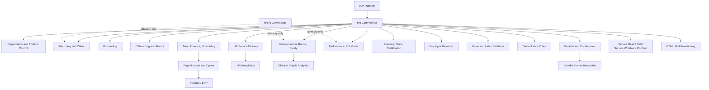

### 19A.2 Worker lifecycle

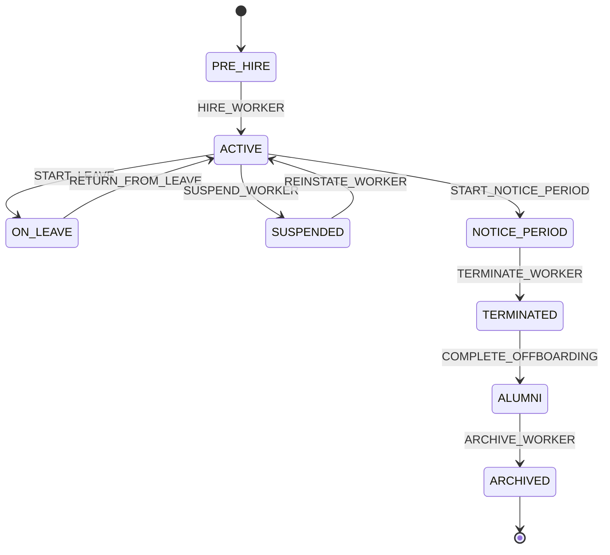

### 19A.3 Hire-to-retire nervous system

```mermaid
sequenceDiagram
  participant Recruit as Recruiting
  participant HR as HR Core
  participant IAM as IAM
  participant ITSM as ITSM
  participant Payroll as Payroll
  participant Benefits as Benefits
  participant Off as Offboarding
  Recruit->>HR: OfferAccepted / HireWorker command
  HR->>IAM: RequestUserProvisioning
  HR->>ITSM: RequestOnboardingTasks
  HR->>Payroll: StagePayrollProfile
  HR->>Benefits: EvaluateBenefitsEligibility
  HR-->>Off: NoticePeriodStarted / TerminationApproved
  Off->>IAM: RequestDeprovisioning
  Off->>Payroll: RequestFinalSettlement
  Off->>Benefits: RequestContinuationReview
  Off->>HR: CompleteOffboardingPlan
  HR->>HR: Move to ALUMNI
```

### 19A.4 Recruiting funnel

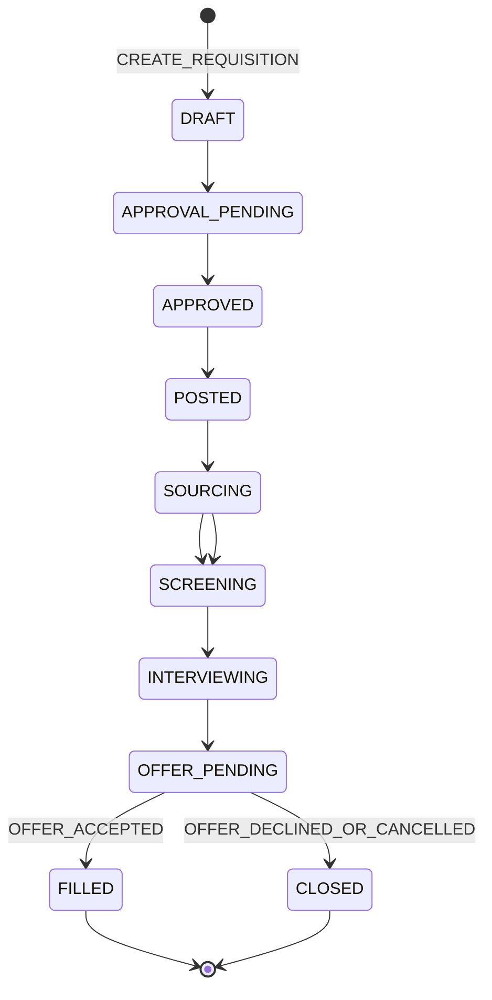

### 19A.5 Payroll cycle

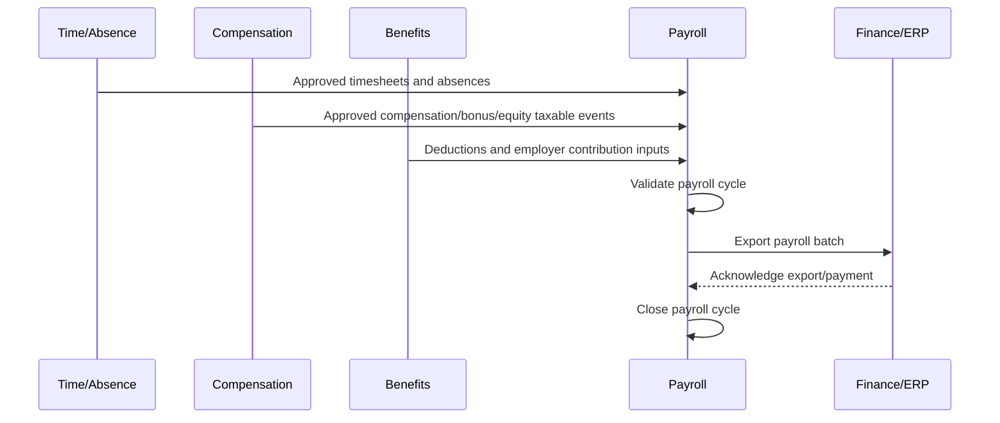

### 19A.6 ER restricted-access model

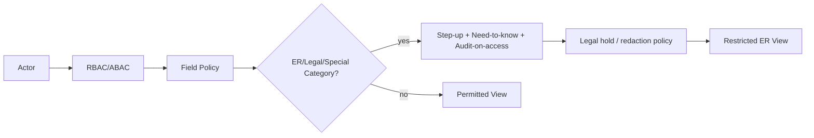

### 19A.7 HR command/event nervous system

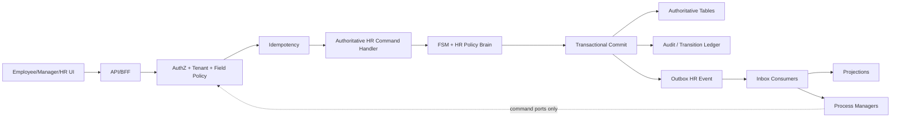

### 19A.8 Offboarding flow

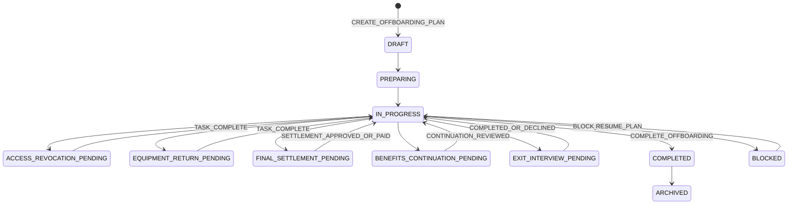

### 19A.9 Workforce scheduling flow

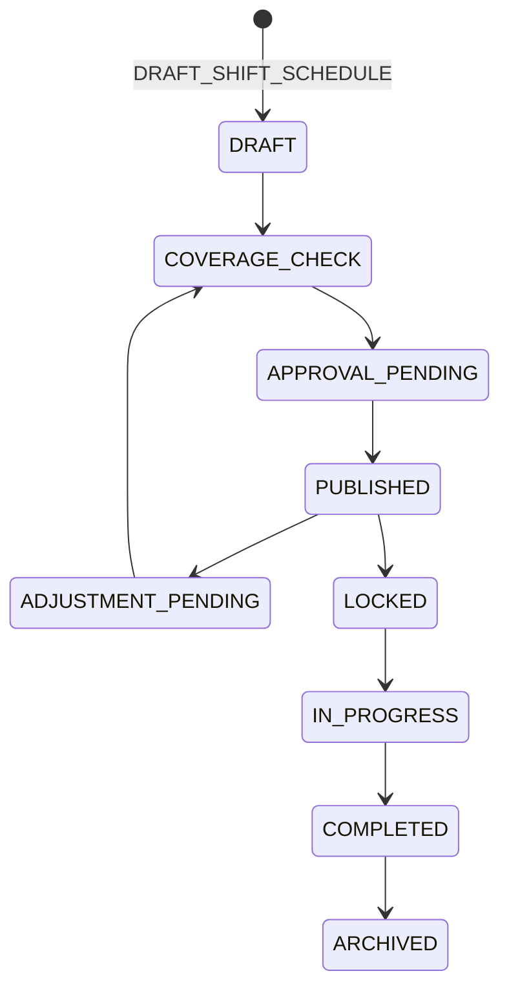

### 19A.10 HR AI governance flow

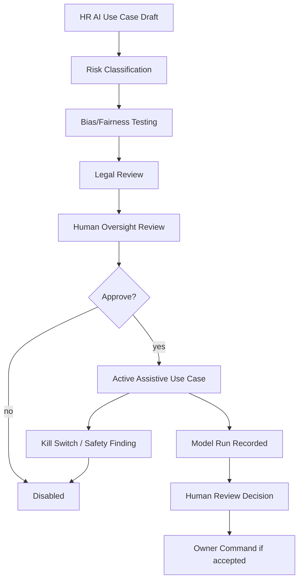


### 19B. V1.2 Mermaid Diagram Pack — World-Class Depth Additions

#### 19B.1 Payroll calculation engine

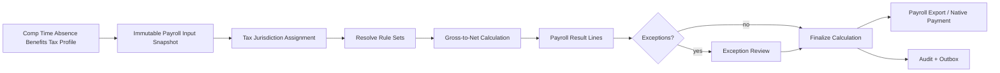

#### 19B.2 Learning runtime

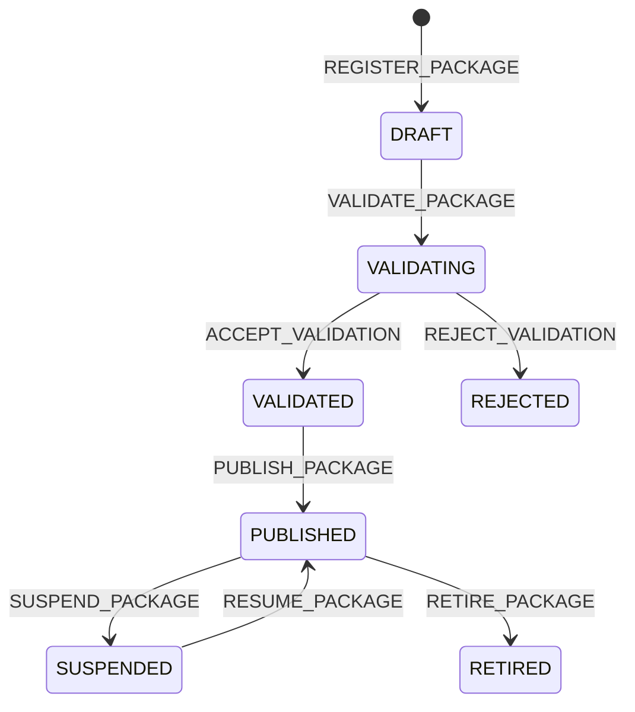

#### 19B.3 I-9 / E-Verify flow

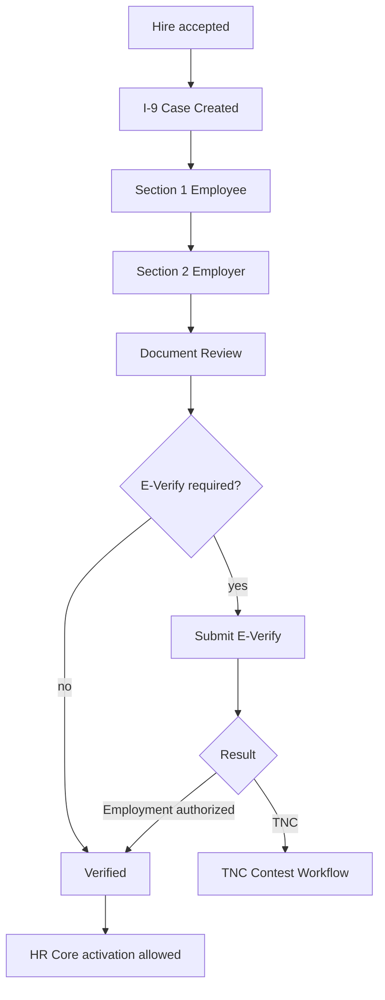

#### 19B.4 Report builder governance

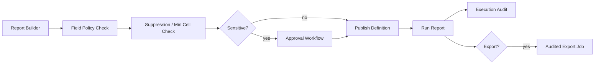

#### 19B.5 Org design scenario

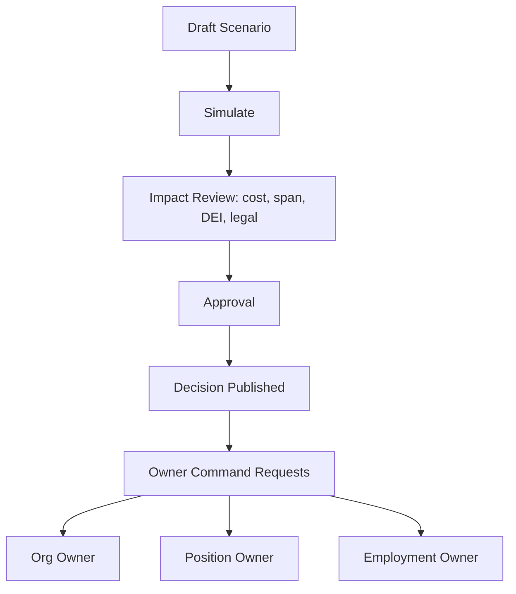


### 19A.11 Country policy upload and approval flow — V1.4

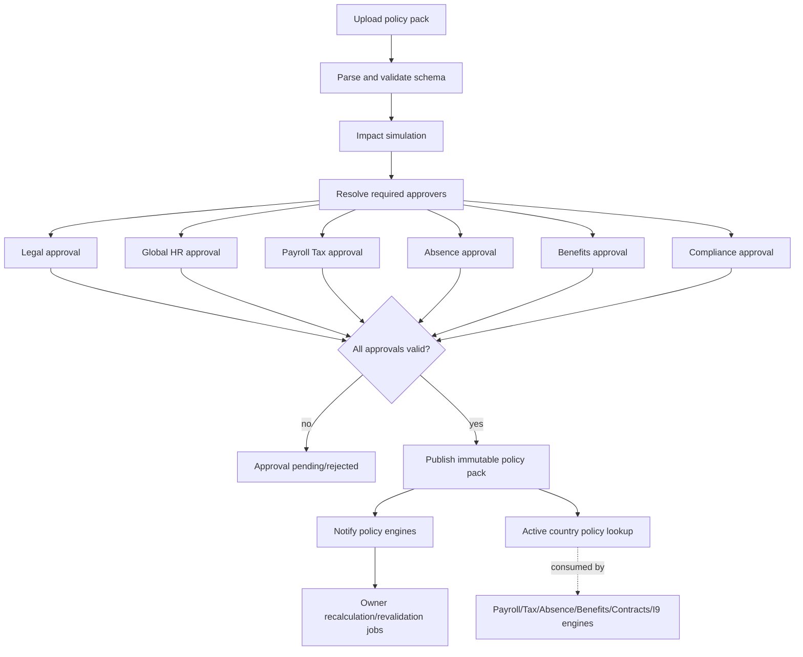

### 19A.12 Country policy rollback sequence — V1.4

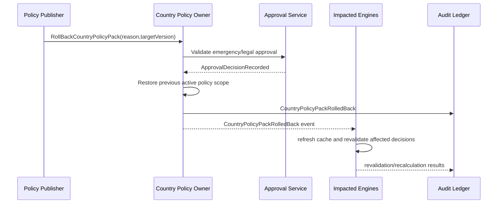


## 20. HR Roadmap


### 20.1A V1.4 country policy governance implementation order

```text
Phase 0:
- Build country policy DDL, upload object handling, validation runners, approval-step model, and allowed-actions integration.
- Implement COUNTRY_POLICY_NO_HARDCODED_LEGAL_VALUES CI rule.

Phase 1:
- Implement active country policy lookup and simulation-only consumption.
- Build Country Policy Governance workspace and approval queue.

Phase 2:
- Wire payroll, tax, absence, benefits, contracts, I-9/E-Verify, statutory reporting, and works-council engines to consume only PUBLISHED country policy packs.

Phase 3:
- Add recalculation/revalidation orchestration, rollback, and cross-country governance dashboards.
```

### Phase 0 — HR architecture freeze and foundation

```text
- Accept HR v1.0 as canonical module blueprint.
- Finalize country/legal entity scope for MVP.
- Create HR package boundaries and schema metadata.
- Implement HR privacy/field-policy engine.
- Implement HR audit-on-access for sensitive data.
- Create worker, organization, position, command, event, and projection scaffolding.
```

### Phase 1 — Core HR and organization

```text
Worker profile
Personal data
Employment relationship
Legal entity and org units
Position control
Job architecture
Manager relationships
Employee and manager self-service basics
```

### Phase 2 — Recruiting and onboarding

```text
Workforce plan and headcount request
Job requisition
Candidate and applications
Interview plan and scorecards
Offer management
Employment contracts
Preboarding and onboarding
Candidate portal
```

### Phase 3 — Time, absence, benefits, payroll staging

```text
Work schedules
Timesheets
Attendance exceptions
Absence requests
Leave cases
Accrual balances
Benefits programs/enrollment
Payroll input staging
Payroll cycle and export
```

### Phase 4 — Performance, learning, skills, talent

```text
Goals and OKRs
Review cycles
Continuous feedback
Calibration
PIP
Learning assignments
Skills and certifications
Career paths
Talent pools
Succession planning
```

### Phase 5 — HR service delivery, ER, compliance, engagement

```text
HR case management
Employee relations cases
Investigations
Disciplinary actions
Accommodation cases
Policy acknowledgements
Work authorization cases
Engagement surveys and action plans
Compliance reports and legal holds
```

### Phase 6 — Analytics, integrations, enterprise scale

```text
Advanced workforce analytics
Payroll/benefits/job board/LMS/IAM integrations
Data warehouse feeds
Retention and legal-hold automation
Performance/load testing
Audit evidence packs
Global localization expansion
```

---


### 20.5 V1.1 roadmap expansion

| Phase | Added V1.1 capabilities | Release posture |
|---|---|---|
| Phase 0 | V1.1 ADRs, DDL closure, CI/DevEx governance, HR AI governance baseline, cross-blueprint contracts | Must complete before coding beyond Core HR. |
| Phase 1 | Core HR + org + employment + role/privacy + HR self-service allowlist | MVP foundation. |
| Phase 2 | Recruiting, onboarding, HR service delivery, HR knowledge, service catalog, HR case SLA | HR operations MVP. |
| Phase 3 | Time, absence, payroll inputs, workforce scheduling, open shifts, overtime, schedule adherence | Frontline/hourly workforce readiness. |
| Phase 4 | Compensation, bonus, equity, benefits plus, open enrollment, carrier reconciliation, total rewards | Enterprise HR commercial depth. |
| Phase 5 | Offboarding, final settlement, alumni, references, global labor localization, work authorization, statutory reporting | Global enterprise readiness. |
| Phase 6 | Performance, PIP, learning, skills, succession, workforce planning, DEI/pay transparency, engagement/recognition | Strategic HCM depth. |
| Phase 7 | Union/labor relations, works council, grievances, labor action, country packs | Public sector/manufacturing/healthcare readiness. |
| Phase 8 | HR AI assistive features only after governance gates; external ecosystem/connectors; data warehouse | Controlled expansion. |

No phase may bypass HR privacy, tenant isolation, command idempotency, audit-on-access, field classification, or owner-only mutation.


### 20.9 V1.2 Roadmap Tiering — World-Class Product Depth

| Tier | Capability group | Release posture |
|---|---|---|
| V1.2-P0 Structural hardening | typed DDL, states-only FSM transitions, saga timeout/DLQ metadata, role/SoD expansion, country-pack template, event topic registry | Required before v1.2 coding starts. |
| V1.2-P1 Payroll foundation | payroll calculation run, payroll result lines, tax jurisdiction assignment, worker tax profile, retro calculation, payroll explainability | Required before native payroll pilot. |
| V1.2-P2 Tax/year-end depth | tax filings, year-end forms, local filings, rule-set update workflow, tax authority adapters | Required before regulated payroll launch. |
| V1.2-P3 LMS runtime | content packages, SCORM/xAPI runtime, assessments, ILT, transcript, marketplace integration | Required before Learning product launch. |
| V1.2-P4 Reporting platform | report builder, calculated fields, matrix/pivot reports, schedules, warehouse export, report audit | Required before enterprise analytics launch. |
| V1.2-P5 Global absence and compliance | statutory leave entitlement, public holiday calendars, leave liability, country packs, works council/I-9/E-Verify | Required before multi-country and US eligibility launch. |
| V1.2-P6 Candidate and mobile experience | career site, self-scheduling, candidate comms, HR mobile app, push/offline/geofence | Required before frontline/candidate-experience launch. |
| V1.2-P7 Contingent workforce and org design | VMS, SOW, contractor time/rates, misclassification, org design simulation, RIF scenarios | Required before large enterprise/global workforce launch. |
| V1.2-P8 Wellbeing/EAP and advanced total rewards | EAP, financial wellness/EWA, grade-step/longevity, advanced wellbeing privacy | Optional by market segment but architecturally defined. |


## 21. HR Implementation Tranche Gate

Every HR tranche must produce:

```text
Authority owner confirmation
Command/query/projection classification
Schema contract and field classification
HR privacy impact
Role/permission/field-policy impact
Country/labor-law impact
Canonical FSM transition used
Events emitted
Tables touched
Audit/idempotency behavior
Projection impact
Integration impact
Payroll/benefits/finance impact where applicable
Legal hold/retention impact
UI screen-spec impact
Metric/reporting impact
Tests added
Cleanup report
```

No tranche may add a new HR service, command, event, table, workflow, policy, or UI surface without proving it does not duplicate an existing owner.

---

## 22. HR Project Start Checklist

### 22.1A V1.4 country policy start checklist

```text
[ ] Country policy upload schema approved by Global HR, Legal, Payroll Tax, Absence, Benefits, and Compliance owners.
[ ] Country policy DDL migrated and RLS-tested.
[ ] Approval chain resolution configured for first-country policy packs.
[ ] Active country policy lookup service implemented.
[ ] Policy engines reject non-published policy versions.
[ ] CI rule blocks hardcoded legal/payroll/statutory country values in command handlers.
[ ] Country policy impact simulation produces affected worker/payroll/absence/benefits/compliance counts.
[ ] Country policy publication and rollback sagas have DLQ/runbooks.
[ ] Country policy governance UI has upload, diff, simulation, approval, publish, and rollback screens.
```

```text
[ ] HR v1.0 accepted as canonical module blueprint.
[ ] HR package boundaries created.
[ ] HR data privacy and field policy approved.
[ ] HR role catalogue and SoD matrix approved.
[ ] Worker, org, position, recruiting, time, payroll, benefits, performance, learning, ER, compliance schemas stubbed.
[ ] HR command envelope and command handling order implemented.
[ ] HR audit-on-access implemented for sensitive categories.
[ ] HR event schema registry created.
[ ] HR RLS/tenant isolation tests implemented.
[ ] Employee self-service, manager hub, recruiter workspace, payroll console, and HR admin initial screen specs created.
[ ] WorkerProfile, Position, JobRequisition, CandidateApplication, Offer, OnboardingPlan FSM tests written before handlers.
[ ] Payroll, compensation, benefits, ER, medical/accommodation, and candidate data field-classification maps approved.
[ ] Initial country/legal entity labor-law rules selected for MVP.
[ ] Integration mastership contracts completed for IAM, payroll, benefits carrier, job boards, background check, LMS, and e-signature.
[ ] Migration/import template approved before importing employee/candidate data.
[ ] HR retention and legal hold matrix approved.
[ ] HR analytics privacy thresholds approved.
```

---


V1.1 gap-closure checklist additions:

```text
[ ] All Claude-inspection V1.0 gaps are mapped to V1.1 canonical sections.
[ ] All missing V1.0 tables and V1.1 tables have DDL coverage.
[ ] HR-ADR-001 through HR-ADR-030 are accepted or explicitly replaced.
[ ] Compensation, bonus, equity, variable comp, and total compensation statement FSMs are implemented or deferred by roadmap tier.
[ ] OffboardingPlan, ExitInterview, FinalSettlement, ReferenceRequest, and AlumniPortal contracts are approved.
[ ] HR AI governance tables, kill switches, bias tests, legal review, and human oversight gates exist before any HR AI use case ships.
[ ] Workforce scheduling, open shift, shift swap, overtime, coverage, and schedule adherence policies are generated.
[ ] Country rule sets, statutory leave, work authorization, works council, statutory report, tax filing, and notice-period country-pack templates are approved before second-country tenant.
[ ] Benefits open enrollment, dependent verification, continuation, carrier reconciliation, spending accounts, wellness, and total rewards are approved.
[ ] HR service catalog, HR knowledge lifecycle, HR case SLA, routing, and virtual agent handoff are approved.
[ ] Employee and manager self-service allowed-command matrices are approved.
[ ] DEI/pay transparency and people analytics suppression thresholds are approved.
[ ] Union/labor relations module is accepted or explicitly deferred by target-market decision.
[ ] CI/DevEx gates for special-category data, RLS, field classification, direct DB writes, import boundaries, AI governance, and contract drift are active.
[ ] Mermaid diagrams are included in design/engineering onboarding pack.
```


### 22.2 V1.2 Project Start Checklist Additions

```text
[ ] V1.2 accepted as canonical HR/HCM implementation blueprint.
[ ] All states-only V1.1 FSMs now have transition tables and generated tests.
[ ] Typed DDL hardening policy adopted; payload-only required business identifiers fail CI.
[ ] Saga registry includes timeout/retry/DLQ/manual recovery metadata.
[ ] V1.2 roles and SoD matrix approved.
[ ] Reference country pack template approved by Legal/Global HR.
[ ] HR event topic registry and consumer groups approved.
[ ] Payroll calculation engine scope selected: native, external, or hybrid.
[ ] Payroll tax jurisdiction decision contract approved.
[ ] Learning runtime mode selected: platform runtime, external LMS master, or hybrid.
[ ] Report builder field policy and suppression engine implemented before sensitive reports.
[ ] Contingent workforce/VMS mastership contract approved before contractor launch.
[ ] Leave entitlement engine country pack exists before country launch.
[ ] I-9/E-Verify contract approved before US hiring launch.
[ ] HR mobile security, offline package, push token, and geofence policies approved.
[ ] Org design scenario cannot directly mutate org/position/employment truth.
[ ] EAP/wellbeing privacy policy approved before EAP integration.
```


### 22.3 V1.3 Final Build-Start Checklist Additions

```text
[ ] Section 6.89 transition rows generated into FSM validators and invalid-transition tests.
[ ] Section 4.17 table registry fully matched to Sections 16.6, 16.7, 16.9, and 16.10 DDL.
[ ] Section 16.8 typed hardening migrations applied or explicitly staged before production baseline.
[ ] Payroll rule-set, tax jurisdiction rule-set, and country-pack JSON schemas checked into contracts package.
[ ] Payroll explainability and calculation audit tables included in migration baseline.
[ ] SCORM/xAPI runtime test harness created for launch, suspend, resume, commit, terminate, and xAPI ingest.
[ ] Candidate experience public-site DDL and retention metadata approved.
[ ] Saga operational metadata registry imported into workflow runner configuration.
[ ] Country-pack sample reviewed by Legal/Global HR before first multi-country implementation.
[ ] Payload-only required business identifier CI rule enabled.
```


## 23. HR Cleanup and Quality Report

| Area | Result |
|---|---|
| Business logic preserved | HR domains use owner-only mutation and domain commands. |
| Brain included | HR policies cover eligibility, headcount, recruiting, offer, leave, payroll, performance, ER, talent, and privacy. |
| Nervous system included | Canonical HR events, envelope extensions, outbox/replay restrictions, projections, timers, reconciliation, and sagas are included. |
| Full feature depth included | Core HR, recruiting, onboarding, time, leave, payroll, benefits, performance, learning, talent, ER, compliance, engagement, service delivery, analytics, integrations, and UI are included. |
| Implementation readiness | Schema baseline, API families, tables, FSMs, tests, roadmap, tranche gate, and checklist included. |
| Remaining execution work | Generate full SQL for every table, full OpenAPI files, detailed screen specs/Figma, country-specific labor-law packs, and integration adapter contracts. |
| Architectural risk | HR implementation teams must not bypass owner commands under delivery pressure, especially around payroll, compensation, personal data, and ER cases. |


### 23.1 V1.1 cleanup report — Claude inspection closure

| Inspection finding | V1.1 result |
|---|---|
| DDL incomplete | Closed by Section 16.2 DDL pack and 16.4 coverage gate. |
| No ADR section | Closed by HR-ADR-001 through HR-ADR-030 in Section 17A. |
| Compensation skeleton | Closed with CompensationPlan, BonusCycle, EquityGrant, VariableCompPlan, CompensationBandMarket, TotalCompStatement FSMs, authority rows, DDL, events, metrics, sagas, and policy engines. |
| No offboarding aggregate | Closed with OffboardingPlan, OffboardingTask, ExitInterview, FinalSettlement, ReferenceRequest, AlumniPortal lifecycle and saga. |
| No HR AI governance | Closed with Section 14A HR AI governance, HR AI tables, events, tests, policy, kill switches, bias testing, and human review. |
| Workforce management absent | Closed with shift scheduling, open shifts, shift bids, swaps, overtime, coverage gaps, adherence, timers, and tests. |
| Global/multi-country HR shallow | Closed with country rule sets, statutory leave, local contract rules, notice rules, works council, statutory reports, work authorization, tax filings, and global integration contracts. |
| Missing FSMs | Closed with Sections 6.28-6.75. |
| No diagrams | Closed with Section 19A Mermaid diagram pack. |
| Benefits shallow | Closed with open enrollment, dependent verification, continuation coverage, spending accounts, carrier reconciliation, wellness, comparison sessions, and total rewards. |
| No cross-blueprint contracts | Closed with Section 12.6/12.7 contracts. |
| HR Service Delivery basic | Closed with HR service catalog, HR knowledge, HR case SLA, virtual agent handoff, deflection, and routing policy. |
| Employee/manager self-service unclear | Closed with self-service allowlist, ManagerActionRequest, EmployeeLifeEvent, security rules, and API paths. |
| Workforce planning depth missing | Closed with scenario planning, demand/supply, skills gap, FTE reconciliation, contingent workforce. |
| DEI/people analytics missing | Closed with DEI reports, pay gap, pay equity, suppression logs, metrics, and policies. |
| Recognition/engagement minimal | Closed with pulse survey/360 feedback/recognition program/social feed/points/milestones. |
| Union/labor relations absent | Closed with union contracts, union grievances, works council, labor action, steward assignment, CBA rules. |
| CI/DevEx governance absent | Closed with Section 16B. |

Remaining execution work:

```text
- Generate actual SQL migrations from Section 16.2.
- Generate OpenAPI files and TypeScript contracts from Sections 15 and 16.
- Convert Mermaid/text wireframes into design files and Storybook components.
- Create first country labor-law packs for target launch countries.
- Finalize customer-specific legal review before deploying HR AI, DEI/pay-transparency, union/labor, payroll/tax, and benefits continuation capabilities.
```


### 23.2 V1.2 Cleanup and Closure Report

| Area | V1.2 result |
|---|---|
| V1.1 remaining structural gaps | Closed typed DDL hardening, transition-table coverage, saga timeouts/DLQ, role/SoD expansion, country-pack template, and event topic/inbox registry. |
| Payroll feature-depth gap | Added native payroll calculation architecture, result lines, retro calculations, tax sequencing, year-end forms, and payroll explainability. |
| Tax jurisdiction gap | Added tax jurisdiction assignment engine, worker tax profile, tax filing workflow, and tax authority contract. |
| LMS gap | Added learning runtime, SCORM/xAPI content packages, ILT, assessments, transcripts, and marketplace integration. |
| Analytics/reporting gap | Added governed report builder, calculated fields, report schedules, warehouse exports, execution audit, and sensitive report controls. |
| Contingent workforce gap | Added VMS/SOW/rate-card/contractor-time/misclassification model and contracts. |
| Absence entitlement gap | Added entitlement calculation, projection, carryover, liability, payout, public holidays, and country-pack driven rules. |
| Candidate experience gap | Added career site, job SEO/schema, self-scheduling, candidate communications, referrals, video interviews, surveys, and I-9 linkage. |
| Position-based compensation gap | Added pay scale, grade-step progression, WGI/longevity, union/public-sector pay scale logic. |
| Mobile gap | Added HR mobile device, push token, offline package, geofence clock, biometric step-up, and mobile sync rules. |
| Org design gap | Added org design scenarios, RIF simulation, span/layer analytics, cost impact, and owner-command implementation path. |
| Wellbeing/EAP gap | Added EAP referrals, anonymous usage rollups, wellness claims, financial wellness/EWA and strict privacy rules. |
| Remaining honest caveat | V1.2 defines the world-class architecture and implementation contracts. Native payroll/tax/LMS/reporting are still large build programs and should be staged, not rushed into MVP. |


### 23.3 V1.3 Final Claude Audit Cleanup Report

| Final audit item | Result |
|---|---|
| V1.2 engine FSMs lacked full transition tables | Closed by Section 6.89 with executable transitions for all V1.2 engine FSMs. |
| V1.2 DDL coverage incomplete | Closed by Section 16.7 plus payroll/learning specialist DDL in Sections 16.9 and 16.10. |
| V1.1 DDL payload-heavy | Closed by Section 16.8 typed-column hardening pack and CI rule. |
| Saga operational metadata missing for original/V1.1 sagas | Closed by Section 17.13 complete saga back-fill. |
| Country-pack template absent | Closed by Section 12.9 canonical schema and starter UK/DE examples. |
| Payroll rule-set model abstract | Closed by Section 7.31 and Section 16.9 rule components/explainability DDL. |
| SCORM/xAPI player mapping absent | Closed by Section 7.32 and Section 16.10 runtime-state DDL. |
| Candidate experience DDL missing | Closed by Section 16.7 candidate-experience DDL. |
| Build-start QA missing | Closed by Section 19.6 and Section 22.3. |

V1.3 is the clean working version to start Phase 0 execution, contract generation, and schema-migration planning. Remaining work is implementation delivery, not unresolved blueprint architecture.


### 23.4 V1.4 Country Policy Governance Cleanup Report

| Area | Result |
|---|---|
| Country-specific legal/payroll values | Converted from implementation caveat into governed, uploadable, approval-gated policy packs. |
| Approval authority | Legal, Global HR, Payroll Tax, Absence, Benefits, and Compliance approvals are resolved from impacted policy sections. |
| Engine wiring | Payroll, tax, absence, benefits, contracts, I-9/E-Verify, statutory reporting, works council, and retention engines consume PUBLISHED country policy packs only. |
| Nervous system | Added upload, validation, impact simulation, approval, publication, supersession, rollback, retirement, and recalculation events. |
| DDL | Added typed country policy pack, upload, validation, simulation, approval, publication, recalculation, and source-evidence tables. |
| Tests | Added upload, approval, SoD, publication, rollback, active-policy, recalculation, and no-hardcoded-values tests. |
| Remaining legal note | The system is configurable and approval-gated, but legal/payroll owners still supply and approve the actual values per country/effective date. |
